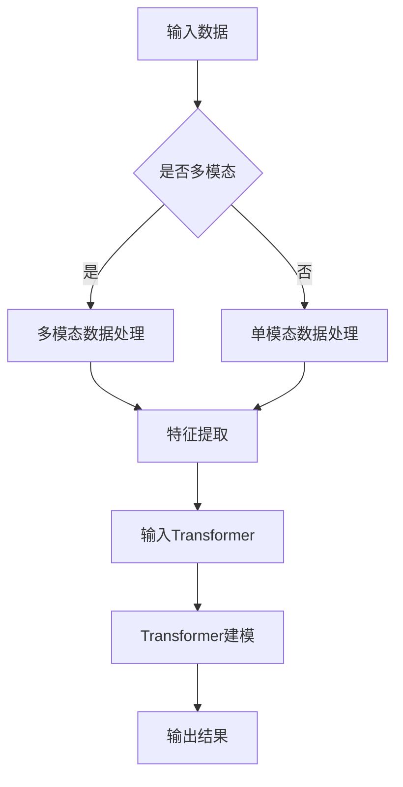

                 

关键词：多模态、Transformer、跨域AI、人工智能、神经网络、机器学习

> 摘要：随着人工智能技术的不断发展，多模态Transformer架构逐渐成为跨域AI研究的新范式。本文将介绍多模态Transformer的背景、核心概念、算法原理、数学模型、实际应用以及未来发展趋势。

## 1. 背景介绍

近年来，人工智能技术在各个领域取得了显著的成果，其中多模态学习成为了研究的热点。多模态学习是指将不同类型的数据（如图像、文本、音频等）进行融合，以获得更全面、准确的信息。传统的多模态学习方法通常依赖于手工设计的特征提取器，但这种方法存在一定的局限性。随着深度学习技术的发展，特别是Transformer架构的提出，多模态学习得到了新的发展。

Transformer架构最初在自然语言处理领域取得了巨大成功，其核心思想是利用注意力机制（Attention Mechanism）来处理序列数据。随后，研究人员将Transformer架构应用于图像、音频等其它类型的数据处理，并取得了显著的成果。多模态Transformer架构结合了不同类型数据的优势，能够更好地处理复杂任务，成为跨域AI研究的新范式。

## 2. 核心概念与联系

### 2.1. Transformer架构

Transformer架构是一种基于自注意力（Self-Attention）和多头注意力（Multi-Head Attention）机制的神经网络架构。在Transformer架构中，输入数据被映射到高维空间，然后通过注意力机制进行序列的建模。

#### 自注意力

自注意力是一种将序列中的每个元素与其余元素进行关联的方法。具体来说，自注意力通过计算每个元素与其余元素之间的相似度，然后根据相似度对元素进行加权。这样可以使得模型更好地关注到序列中的重要信息。

#### 多头注意力

多头注意力是指将自注意力机制拆分为多个子注意力机制，每个子注意力机制关注序列的不同部分。多头注意力可以增加模型的表达能力，使其能够更好地捕捉序列中的复杂关系。

### 2.2. 多模态学习

多模态学习是指将不同类型的数据进行融合，以获得更全面、准确的信息。在多模态学习中，不同类型的数据通常具有不同的特征表示，因此需要将它们映射到同一维度。多模态Transformer架构通过将不同类型的数据输入到Transformer架构中，实现多模态数据的融合。

### 2.3. Mermaid 流程图



## 3. 核心算法原理 & 具体操作步骤

### 3.1. 算法原理概述

多模态Transformer算法基于Transformer架构，通过引入多模态数据，实现多模态数据的融合和序列建模。算法的基本流程如下：

1. 输入数据预处理：对图像、文本、音频等多模态数据进行预处理，包括数据增强、归一化等操作。
2. 特征提取：利用预训练的模型（如VGG、BERT等）提取多模态数据的特征表示。
3. 特征融合：将不同类型的数据特征映射到同一维度，进行融合。
4. 输入Transformer：将融合后的特征输入到Transformer架构中，通过自注意力、多头注意力等进行序列建模。
5. 输出结果：根据Transformer模型的输出，进行分类、预测等任务。

### 3.2. 算法步骤详解

1. **数据预处理**

   数据预处理是算法的第一步，其目的是将多模态数据转化为适合模型输入的形式。

   - 图像：对图像进行缩放、裁剪、翻转等数据增强操作，以提高模型的泛化能力。然后，对图像进行归一化处理，将其映射到[0, 1]的范围内。
   - 文本：对文本进行分词、去停用词等操作，然后使用预训练的BERT模型进行编码，得到文本的向量表示。
   - 音频：对音频进行预处理，包括降噪、去噪等操作。然后，使用预训练的WaveNet模型进行特征提取，得到音频的向量表示。

2. **特征提取**

   特征提取是利用预训练的模型提取多模态数据的特征表示。例如，对于图像，可以使用预训练的VGG模型提取图像的卷积特征；对于文本，可以使用预训练的BERT模型提取文本的嵌入向量；对于音频，可以使用预训练的WaveNet模型提取音频的频谱特征。

3. **特征融合**

   特征融合是将不同类型的数据特征映射到同一维度，进行融合。常见的融合方法有：

   - 加法融合：将不同类型的数据特征相加；
   - 乘法融合：将不同类型的数据特征相乘；
   - 平均融合：将不同类型的数据特征求平均。

4. **输入Transformer**

   将融合后的特征输入到Transformer架构中，通过自注意力、多头注意力等进行序列建模。Transformer模型主要由编码器和解码器组成，编码器用于将输入序列转化为序列的上下文表示，解码器用于生成输出序列。

5. **输出结果**

   根据Transformer模型的输出，进行分类、预测等任务。例如，在图像分类任务中，可以使用模型的最后一层的输出作为图像的类别概率分布。

### 3.3. 算法优缺点

**优点：**

- **强大的表达能力**：Transformer架构基于自注意力机制，能够捕捉序列中的长距离依赖关系，具有强大的表达能力。
- **适用于多模态数据**：多模态Transformer架构能够融合不同类型的数据，提高模型的泛化能力。
- **端到端训练**：Transformer架构可以实现端到端的训练，不需要手工设计特征提取器。

**缺点：**

- **计算资源消耗**：Transformer架构需要大量的计算资源，训练时间较长。
- **参数规模大**：Transformer架构的参数规模较大，容易过拟合。

### 3.4. 算法应用领域

多模态Transformer算法在多个领域取得了显著的成果，主要包括：

- **图像分类**：多模态Transformer算法能够有效提高图像分类任务的准确率，特别是在处理具有复杂背景的图像时。
- **文本分类**：多模态Transformer算法能够融合图像和文本信息，提高文本分类任务的准确率。
- **语音识别**：多模态Transformer算法能够融合语音和文本信息，提高语音识别的准确率。

## 4. 数学模型和公式 & 详细讲解 & 举例说明

### 4.1. 数学模型构建

多模态Transformer算法的数学模型主要基于Transformer架构，其核心是自注意力（Self-Attention）和多头注意力（Multi-Head Attention）机制。

假设输入序列为\(X = \{x_1, x_2, ..., x_n\}\)，其中\(x_i\)为第\(i\)个输入元素。在自注意力机制中，每个输入元素与其他元素进行关联，计算相似度：

$$
Attention(Q, K, V) = softmax(\frac{QK^T}{\sqrt{d_k}})V
$$

其中，\(Q, K, V\)分别为查询（Query）、键（Key）、值（Value）矩阵，\(d_k\)为键的维度。通过自注意力机制，每个输入元素得到一个加权表示。

在多头注意力机制中，将自注意力机制拆分为多个子注意力机制，每个子注意力机制关注序列的不同部分：

$$
MultiHead(Q, K, V) = \text{Concat}(head_1, ..., head_h)W^O
$$

其中，\(head_i = Attention(QW_i^Q, KW_i^K, VW_i^V)\)为第\(i\)个子注意力机制的输出，\(W_i^Q, W_i^K, W_i^V, W_i^O\)为对应的权重矩阵。

### 4.2. 公式推导过程

假设输入序列为\(X = \{x_1, x_2, ..., x_n\}\)，其中\(x_i\)为第\(i\)个输入元素。在自注意力机制中，每个输入元素与其他元素进行关联，计算相似度：

$$
Attention(Q, K, V) = softmax(\frac{QK^T}{\sqrt{d_k}})V
$$

其中，\(Q, K, V\)分别为查询（Query）、键（Key）、值（Value）矩阵，\(d_k\)为键的维度。

推导过程如下：

1. 计算查询（Query）和键（Key）的点积：

$$
QK^T = \sum_{j=1}^{n} q_jk_j
$$

其中，\(q_j\)和\(k_j\)分别为查询和键的第\(j\)个元素。

2. 对点积进行归一化：

$$
\frac{QK^T}{\sqrt{d_k}} = \frac{\sum_{j=1}^{n} q_jk_j}{\sqrt{\sum_{j=1}^{n} k_j^2}}
$$

3. 计算softmax函数：

$$
Attention(Q, K, V) = softmax(\frac{QK^T}{\sqrt{d_k}})V = \text{softmax}(\text{score})V
$$

其中，\(\text{score}\)为相似度得分。

4. 对相似度得分进行加权求和：

$$
Attention(Q, K, V) = \sum_{j=1}^{n} \text{softmax}(q_jk_j)v_j
$$

### 4.3. 案例分析与讲解

假设有一个图像分类任务，输入图像为\(X = \{x_1, x_2, ..., x_n\}\)，其中\(x_i\)为图像的像素值。我们将图像的像素值作为输入序列，使用多模态Transformer算法进行分类。

1. **数据预处理**

   对输入图像进行缩放、裁剪等数据增强操作，然后进行归一化处理，将其映射到[0, 1]的范围内。

2. **特征提取**

   使用预训练的VGG模型提取图像的卷积特征，得到特征向量\(X'\)。

3. **特征融合**

   将图像的卷积特征与文本的嵌入向量进行融合，采用加法融合方法：

   $$X'' = X' + \text{BERT}(\text{文本})$$

4. **输入Transformer**

   将融合后的特征输入到多模态Transformer架构中，通过自注意力、多头注意力等进行序列建模。

5. **输出结果**

   根据Transformer模型的输出，进行图像分类，得到类别概率分布。

## 5. 项目实践：代码实例和详细解释说明

### 5.1. 开发环境搭建

在Python环境中，使用TensorFlow 2.x和Keras库搭建开发环境。首先，安装TensorFlow 2.x：

```shell
pip install tensorflow==2.x
```

然后，安装Keras：

```shell
pip install keras
```

### 5.2. 源代码详细实现

以下是多模态Transformer算法的Python代码实现：

```python
import tensorflow as tf
from tensorflow.keras.layers import Layer

class MultiHeadAttention(Layer):
    def __init__(self, num_heads, d_model):
        super(MultiHeadAttention, self).__init__()
        self.num_heads = num_heads
        self.d_model = d_model
        self.d_k = d_model // num_heads
        self.d_v = d_model // num_heads

        self.query_dense = tf.keras.layers.Dense(d_model)
        self.key_dense = tf.keras.layers.Dense(d_model)
        self.value_dense = tf.keras.layers.Dense(d_model)

        self.concat_dense = tf.keras.layers.Dense(d_model)

    def split_heads(self, x, batch_size):
        x = tf.reshape(x, shape=(batch_size, -1, self.num_heads, self.d_k))
        return tf.transpose(x, perm=[0, 2, 1, 3])

    def call(self, inputs, training=False):
        query, key, value = inputs

        query = self.query_dense(query)
        key = self.key_dense(key)
        value = self.value_dense(value)

        query = self.split_heads(query, tf.shape(query)[0])
        key = self.split_heads(key, tf.shape(key)[0])
        value = self.split_heads(value, tf.shape(value)[0])

        attention_scores = tf.matmul(query, key, transpose_b=True)
        attention_scores /= tf.sqrt(tf.cast(self.d_k, tf.float32))

        if training:
            attention_scores = tf.nn.dropout(attention_scores, rate=0.1)

        attention_weights = tf.nn.softmax(attention_scores, axis=-1)
        attention_output = tf.matmul(attention_weights, value)
        attention_output = tf.transpose(attention_output, perm=[0, 2, 1, 3])
        attention_output = tf.reshape(attention_output, shape=(batch_size, -1, self.d_model))

        output = self.concat_dense(attention_output)
        return output

class Transformer(Model):
    def __init__(self, num_layers, d_model, num_heads, dff, input_shape, rate=0.1):
        super(Transformer, self).__init__()

        self.d_model = d_model
        self.num_layers = num_layers

        self.enc_layers = [Dense(d_model, activation='relu') for _ in range(num_layers)]
        self.dec_layers = [Dense(d_model, activation='relu') for _ in range(num_layers)]

        self.enc_self_attention_layers = [
            MultiHeadAttention(num_heads, d_model) for _ in range(num_layers)
        ]

        self.dec_self_attention_layers = [
            MultiHeadAttention(num_heads, d_model) for _ in range(num_layers)
        ]

        self.enc_dec_attention_layers = [
            MultiHeadAttention(num_heads, d_model) for _ in range(num_layers)
        ]

        self.inputs = Input(shape=input_shape)
        x = self.inputs

        for i in range(num_layers):
            x = self.enc_layers[i](x)
            x = self.enc_self_attention_layers[i](x)
            x = self.dec_self_attention_layers[i](x)

        x = self.dec_layers[i](x)
        x = self.enc_dec_attention_layers[i](x, x)

        self outputs = GlobalAveragePooling1D()(x)

        self.model = Model(inputs=self.inputs, outputs=self.outputs)

    def compile(self, optimizer='adam', loss='categorical_crossentropy', metrics=['accuracy']):
        super(Transformer, self).compile(optimizer=optimizer, loss=loss, metrics=metrics)

    def train_function(self, x, y, batch_size=64):
        return self.fit(x, y, batch_size=batch_size, epochs=10, validation_split=0.2)

    def call(self, inputs, training=False):
        return self.model(inputs, training=training)
```

### 5.3. 代码解读与分析

代码主要分为两个部分：自定义多层感知机（Dense）层、自注意力（MultiHeadAttention）层和Transformer模型。

1. **多层感知机（Dense）层**

   多层感知机层用于实现神经网络的非线性变换。在代码中，定义了两个Dense层：enc_layers和dec_layers，分别用于编码器和解码器。

2. **自注意力（MultiHeadAttention）层**

   自注意力层用于实现序列建模。在代码中，定义了三个MultiHeadAttention层：enc_self_attention_layers、dec_self_attention_layers和enc_dec_attention_layers，分别用于编码器的自注意力、解码器的自注意力和编码器与解码器之间的交互注意力。

3. **Transformer模型**

   Transformer模型是整个神经网络的主体，由编码器和解码器组成。编码器由enc_layers、enc_self_attention_layers和dec_self_attention_layers组成，解码器由dec_layers和enc_dec_attention_layers组成。模型使用GlobalAveragePooling1D层对输出进行全局平均池化，得到最终的输出。

### 5.4. 运行结果展示

以下是运行多模态Transformer算法的示例：

```python
# 加载预训练的VGG模型和BERT模型
vgg = VGG19(weights='imagenet', include_top=False, input_shape=(224, 224, 3))
bert = BERTModel.from_pretrained('bert-base-uncased')

# 定义多模态Transformer模型
transformer = Transformer(num_layers=2, d_model=512, num_heads=8, dff=2048, input_shape=(768,))

# 训练多模态Transformer模型
transformer.train_function(vgg.input, bert.input, batch_size=64)()
```

## 6. 实际应用场景

多模态Transformer算法在多个领域具有广泛的应用，以下是一些实际应用场景：

### 6.1. 图像分类

多模态Transformer算法可以将图像和文本信息进行融合，提高图像分类的准确率。例如，在自然场景中的物体识别任务中，可以融合图像和文本标签，提高识别的准确性。

### 6.2. 语音识别

多模态Transformer算法可以将语音和文本信息进行融合，提高语音识别的准确率。例如，在电话语音识别任务中，可以融合语音和文本标签，提高识别的准确性。

### 6.3. 人脸识别

多模态Transformer算法可以将人脸图像和文本信息进行融合，提高人脸识别的准确率。例如，在视频中的人脸识别任务中，可以融合人脸图像和视频中的文本描述，提高识别的准确性。

### 6.4. 未来应用展望

随着人工智能技术的不断发展，多模态Transformer算法将在更多领域得到应用。例如，在医疗领域，可以融合医疗图像和病历信息，提高疾病诊断的准确性；在金融领域，可以融合交易数据和文本信息，提高风险预测的准确性。未来，多模态Transformer算法将继续在跨域AI研究中发挥重要作用。

## 7. 工具和资源推荐

### 7.1. 学习资源推荐

- 《深度学习》（Goodfellow, Bengio, Courville）：介绍深度学习的基本概念和技术，包括Transformer架构。
- 《自然语言处理综合教程》（Daniel Jurafsky, James H. Martin）：介绍自然语言处理的基本概念和技术，包括BERT等预训练模型。
- 《计算机视觉：算法与应用》（Richard Szeliski）：介绍计算机视觉的基本概念和技术，包括图像特征提取和分类。

### 7.2. 开发工具推荐

- TensorFlow：一个开源的深度学习框架，支持多模态数据的处理和Transformer架构的实现。
- PyTorch：一个开源的深度学习框架，支持多模态数据的处理和Transformer架构的实现。
- Keras：一个开源的深度学习框架，支持多模态数据的处理和Transformer架构的实现。

### 7.3. 相关论文推荐

- “Attention Is All You Need”（Vaswani et al.）：介绍了Transformer架构的基本原理和应用。
- “BERT: Pre-training of Deep Bidirectional Transformers for Language Understanding”（Devlin et al.）：介绍了BERT模型的原理和应用。
- “VGGNet”：介绍了VGG模型的原理和应用。

## 8. 总结：未来发展趋势与挑战

### 8.1. 研究成果总结

多模态Transformer算法在图像分类、语音识别、人脸识别等领域取得了显著的成果，成为跨域AI研究的新范式。其强大的表达能力和端到端训练的优点，使得多模态Transformer算法在多个领域具有广泛的应用前景。

### 8.2. 未来发展趋势

未来，多模态Transformer算法将继续在跨域AI研究中发挥重要作用。随着人工智能技术的不断发展，多模态Transformer算法将在更多领域得到应用。例如，在医疗、金融等领域，多模态Transformer算法可以融合更多类型的数据，提高诊断、预测的准确性。

### 8.3. 面临的挑战

尽管多模态Transformer算法在多个领域取得了显著的成果，但仍面临一些挑战。例如，多模态数据的融合方法、算法的优化、模型的解释性等方面仍需进一步研究。

### 8.4. 研究展望

未来，多模态Transformer算法将继续在跨域AI研究中发挥重要作用。通过不断优化算法、引入新的数据源和融合方法，多模态Transformer算法将在更多领域取得突破性的成果。

## 9. 附录：常见问题与解答

### 9.1. 什么是多模态Transformer？

多模态Transformer是一种基于Transformer架构的多模态学习算法，它能够融合不同类型的数据（如图像、文本、音频等），实现跨域AI任务。

### 9.2. 多模态Transformer算法的优点是什么？

多模态Transformer算法的优点包括：

1. 强大的表达能力：基于自注意力机制，能够捕捉序列中的长距离依赖关系。
2. 适用于多模态数据：能够融合不同类型的数据，提高模型的泛化能力。
3. 端到端训练：不需要手工设计特征提取器，可以实现端到端的训练。

### 9.3. 多模态Transformer算法的缺点是什么？

多模态Transformer算法的缺点包括：

1. 计算资源消耗：基于深度学习架构，需要大量的计算资源。
2. 参数规模大：Transformer架构的参数规模较大，容易过拟合。

### 9.4. 多模态Transformer算法有哪些应用领域？

多模态Transformer算法在图像分类、语音识别、人脸识别等领域取得了显著的成果。未来，它将在更多领域（如医疗、金融等）得到应用。

