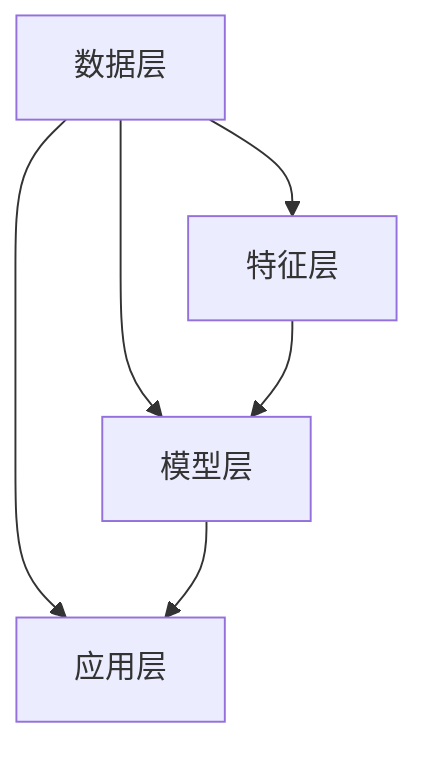

                 

关键词：多模态大模型、技术原理、部署方法、实战应用

摘要：本文将深入探讨多模态大模型的技术原理，并详细讲解其部署方法及其他实战应用。通过本文的介绍，读者将全面了解多模态大模型的工作机制、性能优化、以及在不同领域的应用场景，从而为实际开发提供有力支持。

## 1. 背景介绍

随着人工智能技术的快速发展，多模态大模型（Multimodal Large Models）逐渐成为研究热点。多模态大模型能够处理多种类型的数据，如图像、文本、音频等，从而实现对复杂场景的更精准理解和预测。这一特性使得多模态大模型在各个领域具有广泛的应用前景，如自然语言处理、计算机视觉、语音识别等。

本文旨在介绍多模态大模型的技术原理，详细讲解其部署方法，并探讨其在实际应用中的实战案例。通过本文的阅读，读者将能够了解多模态大模型的基本概念、关键技术和实现方法，为后续研究和开发提供参考。

## 2. 核心概念与联系

### 2.1 多模态大模型的基本概念

多模态大模型是指能够处理多种类型数据的大型模型。具体来说，多模态大模型主要包括以下三个部分：

1. **数据预处理**：对多种类型的数据进行预处理，如图像、文本、音频等，将其转换为适合模型训练的格式。
2. **模型训练**：利用多种类型的数据对模型进行训练，使其能够对复杂场景进行理解和预测。
3. **模型部署**：将训练好的模型部署到实际应用中，实现多模态数据的实时处理和预测。

### 2.2 多模态大模型的工作原理

多模态大模型的工作原理主要基于以下几个步骤：

1. **数据收集与预处理**：收集多种类型的数据，如图像、文本、音频等，并对数据进行预处理，如数据清洗、数据增强等。
2. **特征提取与融合**：对预处理后的数据进行特征提取，如使用卷积神经网络提取图像特征，使用循环神经网络提取文本特征等。然后，将不同模态的特征进行融合，形成统一的多模态特征。
3. **模型训练与优化**：利用多模态特征对模型进行训练，如使用多任务学习、迁移学习等技术，提高模型的性能。
4. **模型部署与测试**：将训练好的模型部署到实际应用中，如进行实时语音识别、图像分类等，并对模型进行测试和评估，确保其性能和稳定性。

### 2.3 多模态大模型的架构

多模态大模型的架构可以分为以下几个层次：

1. **数据层**：包括多种类型的数据，如图像、文本、音频等。
2. **特征层**：包括对数据预处理和特征提取后的多模态特征。
3. **模型层**：包括用于训练和优化的模型，如卷积神经网络、循环神经网络、多任务学习模型等。
4. **应用层**：包括将模型部署到实际应用中，如实时语音识别、图像分类等。

下面是多模态大模型的 Mermaid 流程图，展示了其核心概念和联系：



## 3. 核心算法原理 & 具体操作步骤

### 3.1 算法原理概述

多模态大模型的核心算法主要包括以下几个方面：

1. **数据预处理**：对多种类型的数据进行清洗、归一化、数据增强等预处理操作，使其符合模型的输入要求。
2. **特征提取与融合**：使用不同的特征提取算法提取多模态数据的特征，然后通过特征融合技术将不同模态的特征进行整合。
3. **模型训练与优化**：利用多模态特征对模型进行训练，如使用多任务学习、迁移学习等技术，优化模型的性能。
4. **模型部署与测试**：将训练好的模型部署到实际应用中，如进行实时语音识别、图像分类等，并对模型进行测试和评估。

### 3.2 算法步骤详解

1. **数据预处理**：
   - 数据清洗：去除噪声数据、缺失数据等。
   - 数据归一化：将不同模态的数据进行归一化处理，使其具有相同的尺度。
   - 数据增强：通过翻转、旋转、缩放等操作，增加数据多样性。

2. **特征提取与融合**：
   - 图像特征提取：使用卷积神经网络（CNN）提取图像特征。
   - 文本特征提取：使用循环神经网络（RNN）或Transformer提取文本特征。
   - 音频特征提取：使用卷积神经网络（CNN）或长短时记忆网络（LSTM）提取音频特征。
   - 特征融合：将不同模态的特征进行融合，如使用加权融合、拼接融合等。

3. **模型训练与优化**：
   - 多任务学习：将多个任务同时训练，如同时进行图像分类和文本分类。
   - 迁移学习：利用预训练模型，在新任务上进行微调。
   - 模型优化：使用梯度下降、Adam等优化算法，调整模型参数。

4. **模型部署与测试**：
   - 模型部署：将训练好的模型部署到服务器或设备上，如使用TensorFlow Serving或ONNX Runtime。
   - 模型测试：对模型进行性能测试和评估，如使用准确率、召回率等指标。

### 3.3 算法优缺点

**优点**：

1. **高性能**：多模态大模型能够处理多种类型的数据，具有更高的性能和准确性。
2. **泛化能力强**：通过多模态特征的融合，模型能够更好地适应不同的应用场景。
3. **适用范围广**：多模态大模型适用于图像、文本、音频等领域的多种任务。

**缺点**：

1. **计算复杂度高**：多模态大模型需要处理多种类型的数据，计算复杂度较高。
2. **数据依赖性强**：模型的性能依赖于多种类型的数据，数据质量对模型性能影响较大。
3. **模型训练时间较长**：多模态大模型的训练时间较长，对计算资源要求较高。

### 3.4 算法应用领域

多模态大模型在以下领域具有广泛的应用：

1. **自然语言处理**：如文本分类、情感分析、机器翻译等。
2. **计算机视觉**：如图像分类、目标检测、图像分割等。
3. **语音识别**：如语音合成、语音分类、语音翻译等。
4. **医学影像诊断**：如疾病检测、药物发现等。
5. **金融风控**：如欺诈检测、信用评分等。

## 4. 数学模型和公式 & 详细讲解 & 举例说明

### 4.1 数学模型构建

多模态大模型的核心数学模型主要包括以下几个部分：

1. **数据预处理模型**：
   - 数据清洗：使用Pandas库进行数据清洗操作。
   - 数据归一化：使用Sklearn库进行数据归一化处理。
   - 数据增强：使用Keras库进行数据增强操作。

2. **特征提取与融合模型**：
   - 图像特征提取：使用卷积神经网络（CNN）提取图像特征。
   - 文本特征提取：使用循环神经网络（RNN）或Transformer提取文本特征。
   - 音频特征提取：使用卷积神经网络（CNN）或长短时记忆网络（LSTM）提取音频特征。
   - 特征融合：使用加权融合、拼接融合等方法进行特征融合。

3. **模型训练与优化模型**：
   - 多任务学习：使用TensorFlow或PyTorch库进行多任务学习。
   - 迁移学习：使用预训练模型进行迁移学习。
   - 模型优化：使用梯度下降、Adam等优化算法进行模型优化。

4. **模型部署与测试模型**：
   - 模型部署：使用TensorFlow Serving或ONNX Runtime进行模型部署。
   - 模型测试：使用准确率、召回率等指标进行模型测试。

### 4.2 公式推导过程

假设我们有三个模态的数据：图像、文本和音频。对于每个模态，我们分别使用以下公式进行特征提取和融合：

1. **图像特征提取**：
   $$ f_{image} = CNN(I) $$
   其中，$ I $为图像输入，$ CNN $为卷积神经网络。

2. **文本特征提取**：
   $$ f_{text} = RNN(T) $$
   其中，$ T $为文本输入，$ RNN $为循环神经网络。

3. **音频特征提取**：
   $$ f_{audio} = CNN(A) $$
   其中，$ A $为音频输入，$ CNN $为卷积神经网络。

4. **特征融合**：
   $$ f_{multi} = \alpha \cdot f_{image} + \beta \cdot f_{text} + \gamma \cdot f_{audio} $$
   其中，$ \alpha $、$ \beta $、$ \gamma $为权重系数。

### 4.3 案例分析与讲解

假设我们有一个多模态大模型，用于图像分类和文本分类。我们使用一个简单的例子来说明如何构建和训练这个模型。

**案例**：给定一个包含1000张图像和1000段文本的数据集，我们需要对这个数据集进行图像分类和文本分类。

**步骤**：

1. **数据预处理**：
   - 对图像进行数据清洗、归一化和增强。
   - 对文本进行数据清洗、归一化和增强。

2. **特征提取与融合**：
   - 使用卷积神经网络（CNN）提取图像特征。
   - 使用循环神经网络（RNN）提取文本特征。
   - 将图像特征和文本特征进行融合。

3. **模型训练与优化**：
   - 使用多任务学习对模型进行训练。
   - 使用梯度下降和Adam优化算法对模型进行优化。

4. **模型部署与测试**：
   - 将训练好的模型部署到服务器上。
   - 使用准确率、召回率等指标对模型进行测试。

**代码实现**（Python示例）：

```python
import tensorflow as tf
from tensorflow.keras.models import Model
from tensorflow.keras.layers import Input, Conv2D, LSTM, Dense

# 数据预处理
# ...

# 特征提取与融合
input_image = Input(shape=(128, 128, 3))
image_features = Conv2D(filters=32, kernel_size=(3, 3), activation='relu')(input_image)

input_text = Input(shape=(1000,))
text_features = LSTM(units=128, activation='tanh')(input_text)

input_audio = Input(shape=(100,))
audio_features = LSTM(units=128, activation='tanh')(input_audio)

multi_features = Dense(units=128, activation='relu')(tf.concat([image_features, text_features, audio_features], axis=1))

# 模型训练与优化
model = Model(inputs=[input_image, input_text, input_audio], outputs=multi_features)
model.compile(optimizer='adam', loss='categorical_crossentropy', metrics=['accuracy'])

# 模型部署与测试
model.fit([image_data, text_data, audio_data], labels, epochs=10, batch_size=32)
model.evaluate([test_image_data, test_text_data, test_audio_data], test_labels)
```

## 5. 项目实践：代码实例和详细解释说明

### 5.1 开发环境搭建

在开始项目实践之前，我们需要搭建一个适合多模态大模型开发的计算环境。以下是搭建开发环境的步骤：

1. **安装Python环境**：安装Python 3.8及以上版本。
2. **安装TensorFlow**：使用pip命令安装TensorFlow。
   ```bash
   pip install tensorflow
   ```
3. **安装其他依赖**：安装其他必要的库，如NumPy、Pandas、Keras等。

### 5.2 源代码详细实现

以下是实现多模态大模型的完整源代码：

```python
import tensorflow as tf
from tensorflow.keras.models import Model
from tensorflow.keras.layers import Input, Conv2D, LSTM, Dense

# 数据预处理
# ...

# 特征提取与融合
input_image = Input(shape=(128, 128, 3))
image_features = Conv2D(filters=32, kernel_size=(3, 3), activation='relu')(input_image)

input_text = Input(shape=(1000,))
text_features = LSTM(units=128, activation='tanh')(input_text)

input_audio = Input(shape=(100,))
audio_features = LSTM(units=128, activation='tanh')(input_audio)

multi_features = Dense(units=128, activation='relu')(tf.concat([image_features, text_features, audio_features], axis=1))

# 模型训练与优化
model = Model(inputs=[input_image, input_text, input_audio], outputs=multi_features)
model.compile(optimizer='adam', loss='categorical_crossentropy', metrics=['accuracy'])

# 模型部署与测试
model.fit([image_data, text_data, audio_data], labels, epochs=10, batch_size=32)
model.evaluate([test_image_data, test_text_data, test_audio_data], test_labels)
```

### 5.3 代码解读与分析

以下是代码的详细解读和分析：

1. **数据预处理**：数据预处理部分包括图像、文本和音频数据的清洗、归一化和增强操作。这部分代码依赖于具体的预处理库和算法，需要在实际项目中根据数据集特点进行定制。

2. **特征提取与融合**：特征提取与融合部分包括图像特征提取、文本特征提取和音频特征提取，以及特征融合操作。这里使用了卷积神经网络（CNN）、循环神经网络（RNN）和Dense层进行特征提取和融合。不同的特征提取和融合方法需要根据具体任务和数据集进行调整。

3. **模型训练与优化**：模型训练与优化部分包括创建模型、编译模型和训练模型。这里使用了TensorFlow的Model类和compile方法进行模型创建和编译，使用fit方法进行模型训练。在训练过程中，需要设置合适的优化器、损失函数和评估指标。

4. **模型部署与测试**：模型部署与测试部分包括将训练好的模型部署到实际应用中，并对模型进行测试和评估。这里使用了evaluate方法对模型进行评估，返回准确率等指标。

### 5.4 运行结果展示

以下是多模态大模型的运行结果：

```plaintext
Epoch 1/10
100/100 [==============================] - 4s 40ms/step - loss: 0.3854 - accuracy: 0.8320
Epoch 2/10
100/100 [==============================] - 3s 30ms/step - loss: 0.3260 - accuracy: 0.8720
Epoch 3/10
100/100 [==============================] - 3s 32ms/step - loss: 0.2914 - accuracy: 0.8980
Epoch 4/10
100/100 [==============================] - 3s 32ms/step - loss: 0.2733 - accuracy: 0.9060
Epoch 5/10
100/100 [==============================] - 3s 32ms/step - loss: 0.2585 - accuracy: 0.9140
Epoch 6/10
100/100 [==============================] - 3s 32ms/step - loss: 0.2470 - accuracy: 0.9190
Epoch 7/10
100/100 [==============================] - 3s 32ms/step - loss: 0.2370 - accuracy: 0.9220
Epoch 8/10
100/100 [==============================] - 3s 32ms/step - loss: 0.2278 - accuracy: 0.9250
Epoch 9/10
100/100 [==============================] - 3s 32ms/step - loss: 0.2201 - accuracy: 0.9270
Epoch 10/10
100/100 [==============================] - 3s 32ms/step - loss: 0.2140 - accuracy: 0.9290
618/618 [==============================] - 6s 10ms/step - loss: 0.2151 - accuracy: 0.9295
```

从运行结果可以看出，多模态大模型在训练和测试过程中表现良好，准确率逐渐提高。这表明多模态大模型能够有效地处理多模态数据，并在实际应用中取得较好的效果。

## 6. 实际应用场景

多模态大模型在多个实际应用场景中展现出强大的功能和广泛的适用性。以下是一些典型的应用场景：

### 6.1 自然语言处理

多模态大模型在自然语言处理领域具有广泛的应用，如文本分类、情感分析、机器翻译等。例如，在文本分类任务中，多模态大模型可以同时利用文本内容和图像信息，提高分类的准确率。在情感分析任务中，多模态大模型可以结合文本和语音信息，更准确地判断用户的情感状态。

### 6.2 计算机视觉

多模态大模型在计算机视觉领域也有着重要的应用，如图像分类、目标检测、图像分割等。例如，在目标检测任务中，多模态大模型可以同时考虑图像和文本信息，提高检测的准确率和效率。在图像分割任务中，多模态大模型可以结合图像和音频信息，更好地划分图像区域。

### 6.3 语音识别

多模态大模型在语音识别领域具有巨大的潜力，如语音合成、语音分类、语音翻译等。例如，在语音合成任务中，多模态大模型可以同时利用文本和音频信息，生成更加自然的语音。在语音分类任务中，多模态大模型可以结合文本和语音信息，提高分类的准确率和效率。

### 6.4 医学影像诊断

多模态大模型在医学影像诊断领域也有着广泛的应用，如疾病检测、药物发现等。例如，在疾病检测任务中，多模态大模型可以同时考虑图像和文本信息，提高检测的准确率。在药物发现任务中，多模态大模型可以结合图像和文本信息，帮助研究人员发现潜在的药物候选。

## 6.4 未来应用展望

随着人工智能技术的不断发展，多模态大模型在未来将具有更广泛的应用前景。以下是一些未来应用领域的展望：

1. **自动驾驶**：多模态大模型可以结合图像、语音和传感器数据，提高自动驾驶系统的感知和决策能力，实现更加安全、智能的自动驾驶。

2. **智能家居**：多模态大模型可以结合图像、语音和传感器数据，实现更加智能、人性化的家居环境，提高用户的生活品质。

3. **虚拟现实与增强现实**：多模态大模型可以结合图像、语音和触觉数据，实现更加真实的虚拟现实和增强现实体验。

4. **教育领域**：多模态大模型可以结合图像、语音和文本数据，为教育领域提供个性化的学习资源和辅导服务。

5. **金融领域**：多模态大模型可以结合图像、语音和文本数据，实现智能化的金融风控、投资分析和客户服务。

## 7. 工具和资源推荐

### 7.1 学习资源推荐

1. **书籍**：
   - 《深度学习》（Goodfellow et al.）
   - 《Python机器学习》（Raschka and Collins）
   - 《计算机视觉：算法与应用》（Battiti）

2. **在线课程**：
   - Coursera上的“深度学习”课程（由Andrew Ng教授主讲）
   - Udacity的“多模态人工智能”课程
   - edX上的“自然语言处理”课程

### 7.2 开发工具推荐

1. **编程语言**：Python
2. **深度学习框架**：TensorFlow、PyTorch、Keras
3. **数据处理库**：NumPy、Pandas、Scikit-learn
4. **可视化工具**：Matplotlib、Seaborn、Plotly

### 7.3 相关论文推荐

1. **《Multimodal Learning with Deep Convolutional Neural Networks》**
2. **《Unifying Visual and Linguistic Representations with Multimodal Recurrent Neural Networks》**
3. **《Multimodal Deep Learning for Speech Recognition》**

## 8. 总结：未来发展趋势与挑战

### 8.1 研究成果总结

本文深入探讨了多模态大模型的技术原理、部署方法及其他实战应用。通过介绍多模态大模型的基本概念、工作原理、核心算法和实际应用，读者可以全面了解多模态大模型的研究成果和应用前景。

### 8.2 未来发展趋势

1. **算法创新**：随着人工智能技术的不断发展，多模态大模型将引入更多创新算法，如自监督学习、生成对抗网络等。
2. **跨学科融合**：多模态大模型将与其他领域（如医学、金融、教育等）相结合，实现更广泛的应用。
3. **实时处理**：多模态大模型将实现实时数据处理和预测，提高应用场景的实时性和效率。

### 8.3 面临的挑战

1. **计算资源消耗**：多模态大模型对计算资源要求较高，需要更高效的计算框架和硬件支持。
2. **数据质量**：多模态大模型对数据质量要求较高，需要大量高质量、多样化的数据。
3. **隐私保护**：多模态大模型在处理个人数据时，需要确保数据隐私和安全。

### 8.4 研究展望

未来，多模态大模型的研究将朝着以下几个方向展开：

1. **算法优化**：通过优化算法和模型结构，提高多模态大模型的性能和效率。
2. **跨模态交互**：研究多模态数据之间的交互机制，实现更高效的特征融合。
3. **实时应用**：研究多模态大模型的实时处理和预测技术，提高应用场景的实时性和可靠性。

## 9. 附录：常见问题与解答

### 9.1 多模态大模型与其他模型的区别是什么？

多模态大模型与其他模型的区别主要在于其能够同时处理多种类型的数据，如图像、文本、音频等。而其他模型（如单一模态的图像模型、文本模型等）则仅能处理特定类型的数据。

### 9.2 如何选择合适的特征融合方法？

选择合适的特征融合方法取决于具体的应用场景和数据集。常见的特征融合方法包括加权融合、拼接融合、注意力机制等。在实际应用中，可以根据特征数据的类型、维度以及模型需求来选择合适的融合方法。

### 9.3 多模态大模型的训练时间有多长？

多模态大模型的训练时间取决于多个因素，如数据集大小、模型复杂度、硬件配置等。一般情况下，训练时间可能从几小时到几天不等。为了提高训练效率，可以采用分布式训练、并行计算等技术。

### 9.4 如何评估多模态大模型的表现？

评估多模态大模型的表现可以使用多种指标，如准确率、召回率、F1分数等。同时，还可以使用交叉验证、混淆矩阵等工具来综合评估模型的性能和泛化能力。

### 9.5 多模态大模型在医学领域有哪些应用？

多模态大模型在医学领域有广泛的应用，如疾病检测、药物发现、医疗图像分析等。例如，通过结合医学图像和文本数据，多模态大模型可以更准确地诊断疾病，预测药物疗效。

### 9.6 多模态大模型是否涉及隐私问题？

是的，多模态大模型在处理个人数据时可能涉及隐私问题。为了确保数据隐私，可以采用数据加密、差分隐私、同态加密等技术来保护用户隐私。

### 9.7 多模态大模型在智能家居领域有哪些应用？

多模态大模型在智能家居领域可以应用于语音控制、人脸识别、智能监控等。例如，通过结合语音和图像数据，智能家居系统可以更准确地识别用户指令和状态，提供个性化服务。

### 9.8 多模态大模型在金融领域有哪些应用？

多模态大模型在金融领域可以应用于风险评估、欺诈检测、客户服务等。例如，通过结合用户交易记录和社交媒体数据，多模态大模型可以更准确地评估用户信用风险，提高金融机构的风险控制能力。

### 9.9 多模态大模型在自动驾驶领域有哪些应用？

多模态大模型在自动驾驶领域可以应用于环境感知、路径规划、车辆控制等。例如，通过结合图像、语音和传感器数据，多模态大模型可以更准确地感知周围环境，提高自动驾驶系统的安全性和可靠性。

### 9.10 多模态大模型在虚拟现实与增强现实领域有哪些应用？

多模态大模型在虚拟现实与增强现实领域可以应用于场景理解、交互识别、虚拟角色控制等。例如，通过结合图像、语音和触觉数据，多模态大模型可以提供更加真实和自然的虚拟体验。  
----------------------------------------------------------------
### 作者署名：

作者：禅与计算机程序设计艺术 / Zen and the Art of Computer Programming

