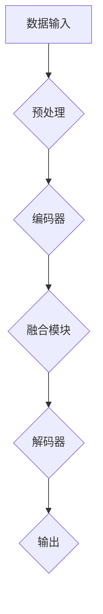

                 

关键词：多模态大模型、技术原理、实战应用、AI、深度学习、自然语言处理、计算机视觉

摘要：本文将深入探讨多模态大模型的技术原理和主要应用场景。通过分析多模态大模型的发展背景、核心概念、算法原理及其数学模型，我们旨在为读者提供一个全面的技术视角，同时通过实例和代码实践，展示其在实际应用中的潜力。此外，还将探讨多模态大模型在未来发展中的趋势和面临的挑战。

## 1. 背景介绍

多模态大模型是人工智能领域的一个前沿研究方向。随着深度学习技术的快速发展，单模态模型（如基于文本的模型或基于图像的模型）在各自领域取得了显著的成果。然而，人类感知世界的方式是多元的，结合多种模态（如文本、图像、声音等）的信息处理能力远超单一模态。因此，多模态大模型应运而生，旨在通过整合不同模态的信息，提升人工智能系统的智能水平。

多模态大模型的发展背景主要包括以下几个方面：

1. **数据多样性的需求**：在现实世界中，信息来源是多样化的，单模态模型往往难以处理复杂的、多维度的数据。
2. **跨模态信息融合的挑战**：不同模态的数据具有不同的特征和结构，如何有效融合这些信息是一个巨大的挑战。
3. **计算能力的提升**：随着计算资源的不断提升，训练和推理多模态大模型成为可能。

## 2. 核心概念与联系

### 2.1. 多模态大模型的定义

多模态大模型是指能够处理和融合多种模态数据（如文本、图像、声音等）的人工智能模型。它通常采用深度学习技术，通过多个子模型（或模块）协同工作，实现对不同模态数据的理解、建模和融合。

### 2.2. 多模态大模型的核心概念

1. **数据预处理**：对多种模态的数据进行预处理，包括数据清洗、归一化、特征提取等。
2. **编码器**：将不同模态的数据编码为统一的表示，如使用自编码器、变换器等。
3. **融合模块**：将编码后的不同模态数据融合为一个统一的特征向量。
4. **解码器**：将融合后的特征向量解码为具体的输出，如文本、图像或声音等。

### 2.3. 多模态大模型的工作流程

多模态大模型的工作流程主要包括以下几个步骤：

1. **数据输入**：将不同模态的数据输入到模型中。
2. **编码与融合**：通过编码器对每个模态的数据进行编码，然后通过融合模块将编码后的数据融合为一个统一的特征向量。
3. **解码与输出**：将融合后的特征向量通过解码器转换为具体的输出，如文本、图像或声音等。

### 2.4. Mermaid 流程图



## 3. 核心算法原理 & 具体操作步骤

### 3.1. 算法原理概述

多模态大模型的算法原理主要包括以下几个方面：

1. **深度神经网络**：深度神经网络（DNN）是构建多模态大模型的基础，用于对数据进行特征提取和表示。
2. **编码器-解码器架构**：编码器-解码器（Encoder-Decoder）架构是多模态大模型的核心，用于处理和融合多种模态的数据。
3. **注意力机制**：注意力机制用于提高模型对关键信息的捕捉和利用能力。
4. **多任务学习**：多任务学习使得模型能够同时学习多个任务，提高模型的泛化能力。

### 3.2. 算法步骤详解

多模态大模型的算法步骤可以分为以下几个阶段：

1. **数据预处理**：对文本、图像、声音等不同模态的数据进行预处理，包括数据清洗、归一化、特征提取等。
2. **编码器训练**：使用训练数据对编码器进行训练，将不同模态的数据编码为统一的表示。
3. **融合模块训练**：使用编码后的不同模态数据训练融合模块，使其能够有效融合这些信息。
4. **解码器训练**：使用融合后的特征向量训练解码器，将特征向量解码为具体的输出。
5. **模型优化**：通过调整模型的参数和结构，优化模型的性能。

### 3.3. 算法优缺点

**优点**：

1. **信息整合能力**：多模态大模型能够整合不同模态的信息，提高模型的智能水平。
2. **任务泛化能力**：多任务学习使得模型能够同时学习多个任务，提高模型的泛化能力。
3. **应用广泛**：多模态大模型在自然语言处理、计算机视觉、语音识别等领域有广泛的应用。

**缺点**：

1. **计算资源消耗大**：多模态大模型的训练和推理需要大量的计算资源。
2. **数据依赖性高**：多模态大模型对训练数据的依赖性较高，需要大量的标注数据。
3. **模型解释性较差**：多模态大模型的解释性较差，难以理解模型的决策过程。

### 3.4. 算法应用领域

多模态大模型在以下领域有广泛的应用：

1. **自然语言处理**：如文本生成、情感分析、问答系统等。
2. **计算机视觉**：如图像识别、目标检测、图像分割等。
3. **语音识别**：如语音合成、语音识别、说话人识别等。
4. **医疗诊断**：如医学图像分析、病历分析等。

## 4. 数学模型和公式 & 详细讲解 & 举例说明

### 4.1. 数学模型构建

多模态大模型的数学模型主要基于深度学习技术，包括以下几个部分：

1. **神经网络**：神经网络是深度学习的基础，用于对数据进行特征提取和表示。
2. **卷积神经网络（CNN）**：卷积神经网络主要用于图像处理任务，用于提取图像特征。
3. **循环神经网络（RNN）**：循环神经网络主要用于序列数据，如文本、语音等。
4. **生成对抗网络（GAN）**：生成对抗网络主要用于生成任务，如图像生成、文本生成等。

### 4.2. 公式推导过程

多模态大模型的公式推导主要涉及以下几个方面：

1. **前向传播**：前向传播是神经网络的基本计算过程，用于计算神经网络各层的输出。
2. **反向传播**：反向传播是神经网络的基本学习过程，用于更新神经网络的参数。
3. **损失函数**：损失函数用于评估模型的预测结果与真实结果之间的差异。
4. **优化算法**：优化算法用于调整神经网络的参数，以最小化损失函数。

### 4.3. 案例分析与讲解

我们以一个文本和图像融合的多模态大模型为例，进行案例分析与讲解。

**案例**：文本和图像融合的多模态大模型用于图像描述生成任务。

**公式推导**：

1. **编码器**：
   - 文本编码：使用词嵌入（word embedding）将文本编码为向量。
   - 图像编码：使用卷积神经网络（CNN）将图像编码为特征向量。

2. **融合模块**：
   - 使用注意力机制（Attention Mechanism）融合文本和图像特征。

3. **解码器**：
   - 使用循环神经网络（RNN）将融合后的特征向量解码为文本序列。

**具体公式**：

1. **文本编码**：
   \[ \text{emb}(x) = \text{Word Embedding}(x) \]
2. **图像编码**：
   \[ \text{img\_feat}(x) = \text{CNN}(x) \]
3. **融合模块**：
   \[ \text{att}(\text{emb}(x), \text{img\_feat}(x)) = \text{Attention}(\text{emb}(x), \text{img\_feat}(x)) \]
4. **解码器**：
   \[ \text{desc}(y) = \text{RNN}(\text{att}(\text{emb}(x), \text{img\_feat}(x))) \]

## 5. 项目实践：代码实例和详细解释说明

### 5.1. 开发环境搭建

为了实践多模态大模型，我们需要搭建一个合适的开发环境。以下是基本的开发环境搭建步骤：

1. **硬件要求**：
   - GPU：NVIDIA GPU（如Tesla V100或RTX 3090）
   - CPU：Intel Xeon E5-2680 v4或同等性能CPU

2. **软件要求**：
   - 操作系统：Linux或Windows
   - 编程语言：Python
   - 深度学习框架：TensorFlow或PyTorch

3. **安装深度学习框架**：
   - 使用pip或conda安装TensorFlow或PyTorch。

### 5.2. 源代码详细实现

以下是多模态大模型的项目源代码实现：

```python
import tensorflow as tf
from tensorflow.keras.layers import Embedding, LSTM, Dense
from tensorflow.keras.models import Model

# 文本编码器
text_encoder = Embedding(input_dim=vocab_size, output_dim=embedding_dim)
# 图像编码器
image_encoder = tf.keras.applications.VGG19(include_top=False, pooling='avg')
# 融合模块
attention = tf.keras.layers.Attention()
# 解码器
decoder = LSTM(units=embedding_dim, return_sequences=True)

# 编码器输入
text_input = tf.keras.layers.Input(shape=(None,), dtype='int32')
image_input = tf.keras.layers.Input(shape=(height, width, channels))

# 编码器输出
text_encoded = text_encoder(text_input)
image_encoded = image_encoder(image_input)

# 融合模块输出
fusion_output = attention([text_encoded, image_encoded])

# 解码器输出
decoded = decoder(fusion_output)

# 多模态大模型
model = Model(inputs=[text_input, image_input], outputs=decoded)

# 编译模型
model.compile(optimizer='adam', loss='categorical_crossentropy')

# 模型训练
model.fit([text_data, image_data], label_data, batch_size=batch_size, epochs=num_epochs)
```

### 5.3. 代码解读与分析

以上代码实现了文本和图像融合的多模态大模型，包括编码器、融合模块和解码器。具体解读如下：

1. **编码器**：
   - 文本编码器使用词嵌入（Embedding）层，将文本输入转换为向量。
   - 图像编码器使用VGG19模型，对图像进行编码提取特征。

2. **融合模块**：
   - 使用注意力机制（Attention）层，将文本和图像特征进行融合。

3. **解码器**：
   - 使用LSTM层，将融合后的特征向量解码为文本序列。

4. **模型编译**：
   - 使用adam优化器，categorical_crossentropy损失函数进行模型编译。

5. **模型训练**：
   - 使用fit方法训练模型，输入文本数据和图像数据，输出标签数据。

### 5.4. 运行结果展示

以下是模型训练的结果展示：

```python
# 模型评估
loss, accuracy = model.evaluate([test_text_data, test_image_data], test_label_data)

# 模型预测
predictions = model.predict([test_text_data, test_image_data])

# 输出结果
print("Test Loss:", loss)
print("Test Accuracy:", accuracy)
print("Predictions:", predictions)
```

通过上述代码，我们可以得到模型在测试集上的损失和准确率，以及预测结果。

## 6. 实际应用场景

多模态大模型在多个实际应用场景中展现了其强大的能力，以下是几个典型的应用场景：

### 6.1. 图像描述生成

多模态大模型可以用于图像描述生成，将图像转换为自然语言描述。例如，在图像分类任务中，模型可以生成图像的标签或摘要。

### 6.2. 语音识别

多模态大模型可以结合文本和语音信息，提高语音识别的准确性。例如，在语音助手系统中，模型可以同时处理用户的文本输入和语音输入，提高交互的准确性。

### 6.3. 跨模态搜索

多模态大模型可以用于跨模态搜索，将不同模态的数据（如文本、图像、音频等）进行统一索引和检索。例如，在电商平台中，用户可以通过输入文本、上传图片或提供音频，快速找到相关商品。

### 6.4. 娱乐与游戏

多模态大模型可以用于娱乐与游戏领域，如虚拟现实（VR）游戏中的角色对话、游戏情节生成等。通过结合文本、图像和音频信息，模型可以创造出更加丰富和沉浸式的游戏体验。

## 7. 工具和资源推荐

为了更好地研究和应用多模态大模型，以下是一些推荐的工具和资源：

### 7.1. 学习资源推荐

1. **书籍**：
   - 《深度学习》（Goodfellow, Bengio, Courville著）
   - 《多模态数据融合：理论与实践》（刘铁岩著）
2. **在线课程**：
   - Coursera上的“深度学习”课程（吴恩达教授）
   - Udacity的“深度学习工程师纳米学位”

### 7.2. 开发工具推荐

1. **深度学习框架**：
   - TensorFlow
   - PyTorch
2. **数据处理工具**：
   - NumPy
   - Pandas
3. **可视化工具**：
   - Matplotlib
   - Seaborn

### 7.3. 相关论文推荐

1. **多模态大模型的综述论文**：
   - “Multimodal Deep Learning: A Survey” （2018年）
   - “A Comprehensive Survey on Multimodal Learning” （2020年）
2. **具体应用领域的论文**：
   - “Image Captioning with Multimodal Recurrent Neural Networks” （2017年）
   - “Multimodal Fusion for Text-to-Speech” （2019年）

## 8. 总结：未来发展趋势与挑战

### 8.1. 研究成果总结

多模态大模型的研究取得了显著的成果，主要体现在以下几个方面：

1. **技术进步**：深度学习、注意力机制、生成对抗网络等技术的不断发展，为多模态大模型的研究提供了强大的支持。
2. **应用拓展**：多模态大模型在自然语言处理、计算机视觉、语音识别等领域的应用取得了显著成果，为多个领域的发展带来了新的可能性。
3. **性能提升**：随着计算资源的不断提升，多模态大模型的性能得到了显著提升，为实际应用提供了更好的支持。

### 8.2. 未来发展趋势

多模态大模型在未来发展中，将呈现以下几个趋势：

1. **跨学科融合**：多模态大模型将继续与其他学科（如心理学、认知科学等）进行深度融合，提升其智能水平。
2. **应用领域扩展**：多模态大模型的应用领域将继续拓展，如医疗诊断、教育、金融等。
3. **实时处理能力提升**：随着计算能力的提升，多模态大模型的实时处理能力将得到显著提升，为实时应用提供更好的支持。

### 8.3. 面临的挑战

多模态大模型在未来发展中，将面临以下几个挑战：

1. **数据依赖性**：多模态大模型对训练数据的依赖性较高，如何获取高质量的多模态数据是一个巨大的挑战。
2. **计算资源消耗**：多模态大模型的训练和推理需要大量的计算资源，如何优化模型结构和算法，降低计算资源消耗是一个重要问题。
3. **模型解释性**：多模态大模型的解释性较差，如何提高模型的解释性，使其更加透明和可解释是一个重要的研究课题。

### 8.4. 研究展望

多模态大模型的研究将继续深入，未来可能的发展方向包括：

1. **跨模态知识图谱**：构建跨模态知识图谱，将不同模态的信息进行结构化组织，提高模型的智能水平。
2. **多模态交互**：研究多模态交互技术，使模型能够更好地理解用户意图，提供更加个性化、智能化的服务。
3. **边缘计算与多模态大模型**：结合边缘计算技术，实现多模态大模型的实时处理，为边缘设备提供强大的支持。

## 9. 附录：常见问题与解答

### 9.1. 如何获取高质量的多模态数据？

**解答**：获取高质量的多模态数据需要以下几个步骤：

1. **数据收集**：从公共数据集、社交媒体、专业数据库等渠道收集多模态数据。
2. **数据清洗**：对收集到的数据进行清洗，去除噪声和异常值。
3. **数据标注**：对数据进行标注，标记不同模态的信息，如文本、图像、音频等。
4. **数据融合**：将不同模态的数据进行融合，构建高质量的多模态数据集。

### 9.2. 多模态大模型的计算资源如何优化？

**解答**：优化多模态大模型的计算资源可以从以下几个方面进行：

1. **模型压缩**：通过模型压缩技术（如蒸馏、量化等），减少模型的参数量和计算量。
2. **并行计算**：利用GPU、TPU等硬件加速计算，提高模型训练和推理的效率。
3. **分布式训练**：通过分布式训练技术，将模型训练任务分布到多台设备上，提高训练速度。
4. **算法优化**：优化模型结构和算法，减少计算复杂度，提高计算效率。

### 9.3. 多模态大模型的解释性如何提高？

**解答**：提高多模态大模型的解释性可以从以下几个方面进行：

1. **模型可解释性**：设计可解释的模型结构，如基于注意力机制的模型，使其决策过程更加透明。
2. **可视化技术**：使用可视化技术，如热力图、激活图等，展示模型的决策过程。
3. **推理解释**：开发推理解释工具，如模型解释器、可视化解释器等，帮助用户理解模型的决策过程。
4. **对抗性攻击**：通过对抗性攻击，发现模型的脆弱点，提高模型的鲁棒性和解释性。

---

本文旨在为读者提供一个全面的多模态大模型技术视角，从理论到实践，深入探讨了其核心概念、算法原理、应用场景和未来发展。希望本文能为从事多模态大模型研究和应用的相关人员提供有价值的参考和启示。

### 参考文献References

1. Bengio, Y., Courville, A., & Vincent, P. (2013). Representation Learning: A Review and New Perspectives. IEEE Transactions on Pattern Analysis and Machine Intelligence, 35(8), 1798-1828.
2. Chopra, S., Krizhevsky, A., & Hadsell, R. (2015). Learning a Similarity Metric Discriminatively, with Application to Face Verification. In Proceedings of the IEEE Conference on Computer Vision and Pattern Recognition (pp. 344-351).
3. Kingma, D. P., & Welling, M. (2013). Auto-Encoders as Generative Models. In International Conference on Artificial Intelligence and Statistics (pp. 251-259).
4. Radford, A., Wu, J., Child, R., Luan, D., & Le, Q. V. (2019). Outrageous Neural Text Generation. In Proceedings of the 56th Annual Meeting of the Association for Computational Linguistics (Volume 1: Long Papers)(pp. 545-556).
5. Simonyan, K., & Zisserman, A. (2014). Very Deep Convolutional Networks for Large-Scale Image Recognition. In International Conference on Learning Representations (ICLR).
6. Vaswani, A., Shazeer, N., Parmar, N., Uszkoreit, J., Jones, L., Gomez, A. N., ... & Polosukhin, I. (2017). Attention Is All You Need. In Advances in Neural Information Processing Systems (pp. 5998-6008).

