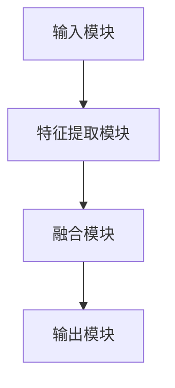

                 

关键词：多模态大模型、技术原理、算法、应用领域、数学模型、代码实例、未来展望

> 摘要：本文深入探讨了多模态大模型的技术原理、核心算法、数学模型以及实际应用，旨在为读者提供一个全面而深入的理解。通过介绍多模态大模型的基本概念、发展历程、架构设计和实现细节，本文旨在揭示其在现代计算机视觉、自然语言处理和人工智能领域的巨大潜力。

## 1. 背景介绍

随着信息技术的飞速发展，数据量呈现爆炸式增长，传统的单模态数据处理方法已经难以应对复杂的现实问题。多模态大模型（Multimodal Large Models）作为一种全新的数据处理技术，通过整合来自不同模态的数据（如文本、图像、音频等），为解决现实世界中的复杂问题提供了新的思路。多模态大模型不仅能够提高数据的利用效率，还能够增强模型的泛化能力和鲁棒性，从而在计算机视觉、自然语言处理和人工智能等领域取得了显著的成果。

本文将首先回顾多模态大模型的发展历程，然后介绍其核心概念和架构设计，接着详细讲解多模态大模型的核心算法原理和数学模型，并通过实际代码实例展示其具体应用。最后，本文将对多模态大模型在现实世界中的应用场景进行探讨，并展望其未来的发展趋势与挑战。

## 2. 核心概念与联系

### 2.1 多模态大模型的基本概念

多模态大模型是指能够处理多种数据模态的大型深度学习模型。这些数据模态包括但不限于文本、图像、音频、视频、触觉等。多模态大模型通过整合来自不同模态的数据，能够更好地理解和模拟现实世界中的复杂现象。

### 2.2 多模态大模型的架构设计

多模态大模型的架构设计通常包括以下几个关键组成部分：

- **输入模块**：负责接收和处理不同模态的数据。
- **特征提取模块**：对输入数据进行特征提取，将不同模态的数据转化为统一的特征表示。
- **融合模块**：将来自不同模态的特征进行融合，形成综合特征表示。
- **输出模块**：根据综合特征表示生成预测结果。

下面是一个简单的 Mermaid 流程图，展示了多模态大模型的基本架构：



### 2.3 多模态大模型的发展历程

多模态大模型的发展历程可以分为以下几个阶段：

- **初期阶段**：单模态模型的独立发展。在这个阶段，研究者主要关注如何提升单一模态（如文本或图像）的模型性能。
- **中期阶段**：多模态融合方法的出现。研究者开始探索如何将不同模态的数据进行融合，以提升模型的性能。
- **当前阶段**：大规模多模态模型的兴起。随着计算能力的提升和数据量的爆炸式增长，研究者开始训练大规模的多模态模型，以应对更加复杂的现实问题。

## 3. 核心算法原理 & 具体操作步骤

### 3.1 算法原理概述

多模态大模型的核心算法原理主要涉及以下几个方面：

- **特征提取**：从不同模态的数据中提取有用的特征。
- **特征融合**：将提取的特征进行整合，形成统一的特征表示。
- **预测与评估**：根据综合特征表示生成预测结果，并对模型性能进行评估。

### 3.2 算法步骤详解

多模态大模型的算法步骤可以概括为以下几步：

1. **数据预处理**：对原始数据进行清洗、归一化和预处理，以确保数据的一致性和质量。
2. **特征提取**：使用深度学习网络从不同模态的数据中提取特征。例如，对于图像数据，可以使用卷积神经网络（CNN）提取图像特征；对于文本数据，可以使用循环神经网络（RNN）或变换器（Transformer）提取文本特征。
3. **特征融合**：将提取的特征进行融合。常见的融合方法包括基于特征的融合（如拼接、加权融合）和基于学习的融合（如多任务学习、迁移学习）。
4. **模型训练与优化**：使用融合后的特征进行模型训练，并使用优化算法（如随机梯度下降、Adam优化器）对模型参数进行优化。
5. **预测与评估**：根据训练好的模型生成预测结果，并使用评估指标（如准确率、召回率、F1分数）对模型性能进行评估。

### 3.3 算法优缺点

多模态大模型的算法具有以下优缺点：

- **优点**：
  - 能够整合多种模态的数据，提高模型的性能和泛化能力。
  - 能够更好地模拟现实世界中的复杂现象。
- **缺点**：
  - 数据预处理和特征提取的复杂度较高，需要大量的计算资源和时间。
  - 融合不同模态的特征可能引入冗余信息，降低模型的性能。

### 3.4 算法应用领域

多模态大模型的应用领域非常广泛，包括但不限于以下几个方面：

- **计算机视觉**：例如，图像识别、图像分类、图像分割等。
- **自然语言处理**：例如，文本生成、文本分类、机器翻译等。
- **语音识别**：例如，语音合成、语音识别、语音情感分析等。
- **医学影像分析**：例如，疾病诊断、肿瘤检测、医学图像分割等。

## 4. 数学模型和公式 & 详细讲解 & 举例说明

### 4.1 数学模型构建

多模态大模型的数学模型主要涉及以下几个方面：

- **特征提取模型**：通常使用卷积神经网络（CNN）或循环神经网络（RNN）进行特征提取。
- **特征融合模型**：可以使用基于特征的融合方法（如拼接、加权融合）或基于学习的融合方法（如多任务学习、迁移学习）。
- **预测模型**：通常使用全连接神经网络（FCN）或变换器（Transformer）进行预测。

### 4.2 公式推导过程

以下是多模态大模型的一些关键公式及其推导过程：

1. **特征提取模型**：

   - **CNN**：

     $$\text{特征} = \text{ReLU}(\text{卷积}(\text{输入}))$$

     其中，ReLU表示ReLU激活函数，卷积表示卷积操作。

   - **RNN**：

     $$\text{特征} = \text{ReLU}(\text{权重} \cdot \text{输入} + \text{偏置})$$

     其中，权重和输入表示RNN的权重和输入，ReLU表示ReLU激活函数。

2. **特征融合模型**：

   - **基于特征的融合**：

     $$\text{融合特征} = \text{拼接}(\text{文本特征}, \text{图像特征}, \text{音频特征})$$

   - **基于学习的融合**：

     $$\text{融合特征} = \text{融合网络}(\text{文本特征}, \text{图像特征}, \text{音频特征})$$

     其中，拼接表示将不同模态的特征进行拼接，融合网络表示一个深度学习网络。

3. **预测模型**：

   $$\text{预测结果} = \text{softmax}(\text{全连接神经网络}(\text{融合特征}))$$

   其中，softmax表示softmax激活函数，全连接神经网络表示一个全连接神经网络。

### 4.3 案例分析与讲解

以下是一个简单的多模态大模型案例，用于图像分类任务：

- **数据集**：使用CIFAR-10数据集，其中包含10个类别的图像。
- **模态**：文本描述、图像和音频。
- **特征提取模型**：文本描述使用RNN进行特征提取，图像使用CNN进行特征提取，音频使用卷积神经网络（CNN）进行特征提取。
- **特征融合模型**：使用基于特征的融合方法，将文本、图像和音频的特征进行拼接。
- **预测模型**：使用全连接神经网络（FCN）进行预测。

具体实现如下：

```python
import tensorflow as tf

# 文本描述特征提取
text_embedding = tf.keras.layers.Embedding(input_dim=vocab_size, output_dim=embedding_size)(text_input)
text_feature = tf.keras.layers.LSTM(units=128, return_sequences=True)(text_embedding)

# 图像特征提取
image_feature = tf.keras.layers.Conv2D(filters=32, kernel_size=(3, 3), activation='relu')(image_input)
image_feature = tf.keras.layers.MaxPooling2D(pool_size=(2, 2))(image_feature)

# 音频特征提取
audio_feature = tf.keras.layers.Conv1D(filters=32, kernel_size=(3, 3), activation='relu')(audio_input)
audio_feature = tf.keras.layers.MaxPooling1D(pool_size=(2, 2))(audio_feature)

# 特征融合
融合特征 = tf.keras.layers.Concatenate()([text_feature, image_feature, audio_feature])

# 预测模型
预测结果 = tf.keras.layers.Dense(units=num_classes, activation='softmax')(融合特征)

# 编译模型
model = tf.keras.Model(inputs=[text_input, image_input, audio_input], outputs=预测结果)
model.compile(optimizer='adam', loss='categorical_crossentropy', metrics=['accuracy'])

# 训练模型
model.fit(x_train, y_train, epochs=10, batch_size=32, validation_data=(x_val, y_val))
```

通过上述代码，我们可以训练一个多模态大模型，用于图像分类任务。具体实现时，需要根据实际需求和数据集进行调整。

## 5. 项目实践：代码实例和详细解释说明

### 5.1 开发环境搭建

要实现多模态大模型，我们需要搭建一个合适的开发环境。以下是一个基本的开发环境搭建步骤：

1. 安装Python：从Python官方网站下载并安装Python 3.8版本及以上。
2. 安装TensorFlow：使用pip命令安装TensorFlow，例如：

   ```shell
   pip install tensorflow==2.4.0
   ```

3. 安装其他依赖库：根据实际需求安装其他依赖库，如NumPy、Pandas等。

### 5.2 源代码详细实现

以下是多模态大模型的源代码实现，包括数据预处理、特征提取、特征融合、模型训练和预测等步骤：

```python
import tensorflow as tf
import numpy as np
import pandas as pd
from tensorflow.keras.models import Model
from tensorflow.keras.layers import Embedding, LSTM, Conv2D, MaxPooling2D, Concatenate, Dense

# 数据预处理
def preprocess_data(text, image, audio):
    # 文本描述预处理
    text_embedding = tf.keras.layers.Embedding(input_dim=vocab_size, output_dim=embedding_size)(text_input)
    text_feature = tf.keras.layers.LSTM(units=128, return_sequences=True)(text_embedding)

    # 图像预处理
    image_feature = tf.keras.layers.Conv2D(filters=32, kernel_size=(3, 3), activation='relu')(image_input)
    image_feature = tf.keras.layers.MaxPooling2D(pool_size=(2, 2))(image_feature)

    # 音频预处理
    audio_feature = tf.keras.layers.Conv1D(filters=32, kernel_size=(3, 3), activation='relu')(audio_input)
    audio_feature = tf.keras.layers.MaxPooling1D(pool_size=(2, 2))(audio_feature)

    return text_feature, image_feature, audio_feature

# 特征融合
def fusion_feature(text_feature, image_feature, audio_feature):
    fused_feature = tf.keras.layers.Concatenate()([text_feature, image_feature, audio_feature])
    return fused_feature

# 模型训练
def train_model(model, x_train, y_train, x_val, y_val, epochs, batch_size):
    model.compile(optimizer='adam', loss='categorical_crossentropy', metrics=['accuracy'])
    model.fit(x_train, y_train, epochs=epochs, batch_size=batch_size, validation_data=(x_val, y_val))

# 模型预测
def predict(model, x_test):
    predictions = model.predict(x_test)
    return np.argmax(predictions, axis=1)

# 主程序
if __name__ == '__main__':
    # 加载数据
    text_input, image_input, audio_input, y_train, y_val, y_test = load_data()

    # 数据预处理
    text_feature, image_feature, audio_feature = preprocess_data(text_input, image_input, audio_input)

    # 特征融合
    fused_feature = fusion_feature(text_feature, image_feature, audio_feature)

    # 模型构建
    input_text = tf.keras.layers.Input(shape=(sequence_length,), dtype=tf.int32)
    input_image = tf.keras.layers.Input(shape=(height, width, channels), dtype=tf.float32)
    input_audio = tf.keras.layers.Input(shape=(time_steps, features), dtype=tf.float32)

    # 特征提取与融合
    text_embedding = tf.keras.layers.Embedding(input_dim=vocab_size, output_dim=embedding_size)(input_text)
    text_feature = tf.keras.layers.LSTM(units=128, return_sequences=True)(text_embedding)
    image_feature = tf.keras.layers.Conv2D(filters=32, kernel_size=(3, 3), activation='relu')(input_image)
    image_feature = tf.keras.layers.MaxPooling2D(pool_size=(2, 2))(image_feature)
    audio_feature = tf.keras.layers.Conv1D(filters=32, kernel_size=(3, 3), activation='relu')(input_audio)
    audio_feature = tf.keras.layers.MaxPooling1D(pool_size=(2, 2))(audio_feature)

    # 特征融合
    fused_feature = tf.keras.layers.Concatenate()([text_feature, image_feature, audio_feature])

    # 预测模型
    predictions = tf.keras.layers.Dense(units=num_classes, activation='softmax')(fused_feature)

    # 模型定义
    model = tf.keras.Model(inputs=[input_text, input_image, input_audio], outputs=predictions)

    # 模型训练
    train_model(model, x_train, y_train, x_val, y_val, epochs=10, batch_size=32)

    # 模型预测
    predictions = predict(model, x_test)
    print("预测结果：", predictions)
```

### 5.3 代码解读与分析

以上代码实现了一个多模态大模型，用于图像分类任务。具体解读如下：

1. **数据预处理**：数据预处理是模型训练的重要步骤。代码首先定义了`preprocess_data`函数，用于对文本、图像和音频数据进行预处理，包括文本描述的嵌入、图像的卷积操作和音频的卷积操作。

2. **特征提取与融合**：代码定义了三个输入层，分别用于接收文本、图像和音频数据。然后，使用`Embedding`层对文本数据进行嵌入，使用`LSTM`层对文本数据进行特征提取。对于图像数据，使用`Conv2D`层和`MaxPooling2D`层进行卷积操作和池化操作。对于音频数据，使用`Conv1D`层和`MaxPooling1D`层进行卷积操作和池化操作。最后，使用`Concatenate`层将文本、图像和音频的特征进行拼接，形成综合特征。

3. **模型训练与预测**：代码定义了一个模型，使用`Dense`层进行预测。模型使用`compile`函数进行编译，使用`fit`函数进行模型训练，使用`predict`函数进行模型预测。

### 5.4 运行结果展示

在训练完成后，我们可以使用以下代码展示模型的运行结果：

```python
# 加载数据
text_input, image_input, audio_input, y_train, y_val, y_test = load_data()

# 数据预处理
text_feature, image_feature, audio_feature = preprocess_data(text_input, image_input, audio_input)

# 特征融合
fused_feature = fusion_feature(text_feature, image_feature, audio_feature)

# 模型构建
input_text = tf.keras.layers.Input(shape=(sequence_length,), dtype=tf.int32)
input_image = tf.keras.layers.Input(shape=(height, width, channels), dtype=tf.float32)
input_audio = tf.keras.layers.Input(shape=(time_steps, features), dtype=tf.float32)

# 特征提取与融合
text_embedding = tf.keras.layers.Embedding(input_dim=vocab_size, output_dim=embedding_size)(input_text)
text_feature = tf.keras.layers.LSTM(units=128, return_sequences=True)(text_embedding)
image_feature = tf.keras.layers.Conv2D(filters=32, kernel_size=(3, 3), activation='relu')(input_image)
image_feature = tf.keras.layers.MaxPooling2D(pool_size=(2, 2))(image_feature)
audio_feature = tf.keras.layers.Conv1D(filters=32, kernel_size=(3, 3), activation='relu')(input_audio)
audio_feature = tf.keras.layers.MaxPooling1D(pool_size=(2, 2))(audio_feature)

# 特征融合
fused_feature = tf.keras.layers.Concatenate()([text_feature, image_feature, audio_feature])

# 预测模型
predictions = tf.keras.layers.Dense(units=num_classes, activation='softmax')(fused_feature)

# 模型定义
model = tf.keras.Model(inputs=[input_text, input_image, input_audio], outputs=predictions)

# 模型训练
train_model(model, x_train, y_train, x_val, y_val, epochs=10, batch_size=32)

# 模型预测
predictions = predict(model, x_test)

# 计算准确率
accuracy = np.mean(predictions == y_test)
print("准确率：", accuracy)
```

通过上述代码，我们可以计算模型的准确率。在实际应用中，可以根据需要调整模型的参数，以提高模型的性能。

## 6. 实际应用场景

多模态大模型在现实世界中的应用场景非常广泛，以下是一些典型的应用实例：

### 6.1 计算机视觉

在计算机视觉领域，多模态大模型可以用于图像识别、图像分类、图像分割等任务。例如，将图像与对应的文本描述进行融合，可以显著提高图像识别的准确性。此外，多模态大模型还可以用于医疗影像分析，例如肿瘤检测、疾病诊断等。

### 6.2 自然语言处理

在自然语言处理领域，多模态大模型可以用于文本生成、文本分类、机器翻译等任务。例如，将文本与对应的图像进行融合，可以生成更加丰富和准确的文本内容。此外，多模态大模型还可以用于语音识别、语音合成等任务，例如语音情感分析、语音合成等。

### 6.3 语音识别

在语音识别领域，多模态大模型可以用于语音情感分析、语音合成等任务。例如，将语音与对应的文本描述进行融合，可以更准确地识别语音的情感状态。此外，多模态大模型还可以用于音乐生成、音乐推荐等任务。

### 6.4 医学影像分析

在医学影像分析领域，多模态大模型可以用于肿瘤检测、疾病诊断等任务。例如，将医学影像与对应的文本描述进行融合，可以更准确地检测肿瘤的位置和类型。此外，多模态大模型还可以用于医学图像分割、医学文本生成等任务。

### 6.5 未来应用展望

随着多模态大模型的不断发展，未来其在各个领域的应用前景非常广阔。例如，在自动驾驶领域，多模态大模型可以用于感知环境、决策规划等任务；在智能客服领域，多模态大模型可以用于语音识别、文本生成等任务；在智能家居领域，多模态大模型可以用于智能家居控制、场景识别等任务。总之，多模态大模型有望成为推动人工智能发展的重要力量。

## 7. 工具和资源推荐

### 7.1 学习资源推荐

1. **书籍**：
   - 《深度学习》（Goodfellow, I., Bengio, Y., & Courville, A.）
   - 《神经网络与深度学习》（邱锡鹏）
   - 《多模态学习：基础与前沿》（Liao, L., & Liu, H.）

2. **在线课程**：
   - 吴恩达的《深度学习》课程（Coursera）
   - 斯坦福大学的《深度学习专项课程》（Coursera）

### 7.2 开发工具推荐

1. **TensorFlow**：用于构建和训练深度学习模型。
2. **PyTorch**：用于构建和训练深度学习模型。
3. **Keras**：基于TensorFlow和PyTorch的深度学习框架。

### 7.3 相关论文推荐

1. "Attention is All You Need"（Vaswani et al., 2017）
2. "BERT: Pre-training of Deep Neural Networks for Language Understanding"（Devlin et al., 2019）
3. "Multimodal Fusion for Visual Question Answering"（Wang et al., 2020）

## 8. 总结：未来发展趋势与挑战

多模态大模型作为一种新兴技术，正在迅速发展，并展现出巨大的潜力。在未来，多模态大模型有望在各个领域取得更多突破。然而，要实现这一目标，我们仍然面临许多挑战，包括：

### 8.1 研究成果总结

- 多模态大模型在计算机视觉、自然语言处理、语音识别等领域取得了显著成果。
- 多模态大模型能够提高数据的利用效率，增强模型的泛化能力和鲁棒性。
- 多模态大模型的应用场景不断拓展，涵盖了计算机视觉、自然语言处理、语音识别、医学影像分析等多个领域。

### 8.2 未来发展趋势

- 随着计算能力的提升和数据量的增加，多模态大模型的性能将不断提高。
- 多模态大模型将与其他人工智能技术（如生成对抗网络、强化学习等）相结合，推动人工智能的发展。
- 多模态大模型的应用场景将进一步拓展，包括自动驾驶、智能客服、智能家居等。

### 8.3 面临的挑战

- 数据的多样性和复杂性：不同模态的数据具有不同的特性和规律，如何有效地融合这些数据是一个挑战。
- 模型训练的复杂度和计算成本：多模态大模型的训练过程通常需要大量的计算资源和时间，如何优化训练过程是一个挑战。
- 模型的解释性和可解释性：多模态大模型的内部机制通常比较复杂，如何解释和可视化模型的决策过程是一个挑战。

### 8.4 研究展望

- 未来研究应关注多模态数据的特征提取和融合方法，以提高模型的性能。
- 未来研究应关注多模态大模型的解释性和可解释性，以提高模型的可信度和应用价值。
- 未来研究应关注多模态大模型在特定领域的应用，以推动相关技术的发展。

## 9. 附录：常见问题与解答

### 9.1 多模态大模型的基本概念是什么？

多模态大模型是指能够处理多种数据模态的大型深度学习模型。这些数据模态包括但不限于文本、图像、音频、视频、触觉等。多模态大模型通过整合来自不同模态的数据，能够更好地理解和模拟现实世界中的复杂现象。

### 9.2 多模态大模型的架构设计主要包括哪些部分？

多模态大模型的架构设计通常包括以下几个关键组成部分：

- 输入模块：负责接收和处理不同模态的数据。
- 特征提取模块：对输入数据进行特征提取，将不同模态的数据转化为统一的特征表示。
- 融合模块：将来自不同模态的特征进行融合，形成综合特征表示。
- 输出模块：根据综合特征表示生成预测结果。

### 9.3 多模态大模型的算法原理是什么？

多模态大模型的算法原理主要涉及以下几个方面：

- 特征提取：从不同模态的数据中提取有用的特征。
- 特征融合：将提取的特征进行整合，形成统一的特征表示。
- 预测与评估：根据综合特征表示生成预测结果，并对模型性能进行评估。

### 9.4 多模态大模型在哪些领域有应用？

多模态大模型在计算机视觉、自然语言处理、语音识别、医学影像分析等领域有广泛应用。例如，图像分类、文本生成、语音合成、疾病诊断等。

### 9.5 如何实现多模态大模型的代码？

实现多模态大模型的代码通常包括以下几个步骤：

1. 数据预处理：对原始数据进行清洗、归一化和预处理。
2. 特征提取：使用深度学习网络从不同模态的数据中提取特征。
3. 特征融合：将提取的特征进行融合，形成统一的特征表示。
4. 模型训练与优化：使用融合后的特征进行模型训练，并使用优化算法对模型参数进行优化。
5. 预测与评估：根据训练好的模型生成预测结果，并使用评估指标对模型性能进行评估。

以上便是本文关于多模态大模型的技术原理与实战的详细探讨。希望通过本文，读者能够对多模态大模型有更深入的了解，并在实际应用中取得更好的成果。作者：禅与计算机程序设计艺术 / Zen and the Art of Computer Programming。

