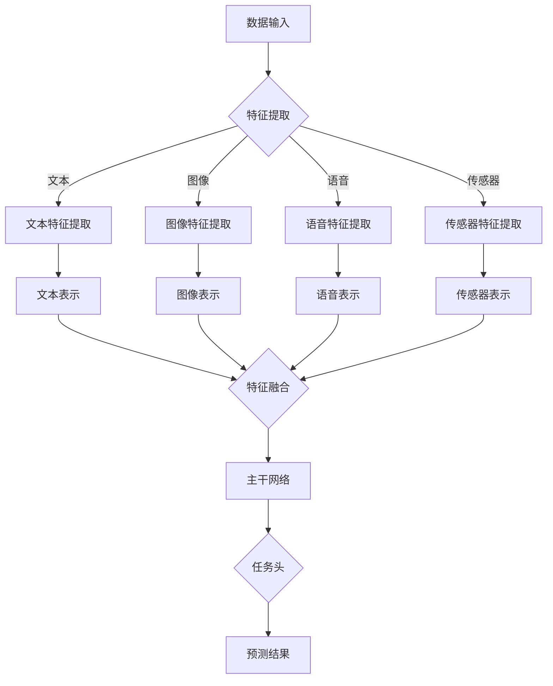
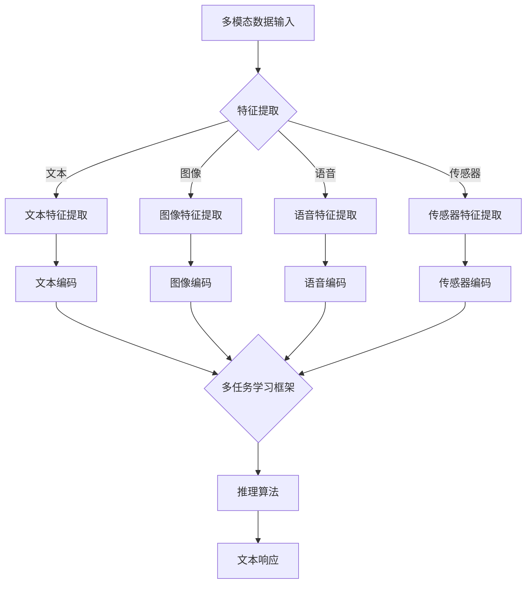

                 

关键词：多模态大模型、技术原理、对话系统、多轮对话、生成式AI、优化策略、多任务学习、推理算法、应用场景

> 摘要：本文旨在深入探讨多模态大模型的技术原理，特别是如何通过优化策略和改进算法提高多轮对话能力。通过对核心概念、算法原理、数学模型、项目实践和应用场景的详细分析，本文为读者提供了一个全面的技术指南，帮助理解多模态大模型的本质及其在实践中的应用。

## 1. 背景介绍

随着人工智能技术的迅猛发展，多模态大模型已经成为研究和应用的热点。多模态大模型能够整合和处理多种类型的输入数据，如文本、图像、语音等，通过深度学习算法实现复杂的信息理解和生成。这种能力使得多模态大模型在多个领域，如自然语言处理、计算机视觉、语音识别等，展现出巨大的潜力和应用价值。

多轮对话能力是衡量多模态大模型性能的重要指标之一。在实际应用中，用户往往需要与系统进行多次交互，以获得更准确和个性化的服务。然而，多轮对话能力的提升不仅仅依赖于单一模态的处理能力，更需要模型在多个模态之间进行有效的信息融合和推理。

本文将围绕以下主题展开讨论：

1. **核心概念与联系**：介绍多模态大模型的基础概念，包括多模态数据的类型、处理流程以及模型架构。
2. **核心算法原理 & 具体操作步骤**：详细分析多模态大模型的核心算法，包括生成式AI模型、多任务学习框架和推理算法。
3. **数学模型和公式 & 详细讲解 & 举例说明**：讲解多模态大模型中的数学模型和公式，并通过实例进行分析。
4. **项目实践：代码实例和详细解释说明**：通过实际项目实践展示多模态大模型的实现过程，并解析代码细节。
5. **实际应用场景**：探讨多模态大模型在不同领域的应用实例，如智能客服、虚拟助手和内容生成。
6. **未来应用展望**：展望多模态大模型在未来的发展趋势和应用前景。
7. **工具和资源推荐**：推荐学习资源和开发工具，以帮助读者进一步探索多模态大模型。
8. **总结：未来发展趋势与挑战**：总结研究成果，分析未来发展趋势和面临的挑战。

通过本文的深入探讨，读者将能够全面了解多模态大模型的技术原理和实际应用，从而为开发高效的多轮对话系统提供理论支持和实践指导。

## 1.1 多模态大模型的定义与历史发展

多模态大模型（Multimodal Large Models）是能够处理和整合多种类型数据（如文本、图像、语音等）的复杂人工智能模型。这种模型的定义涉及以下几个关键方面：

1. **多模态数据的类型**：多模态大模型能够接收和解释来自不同传感器的输入数据，这些数据可以是文本（例如自然语言文本、标注文本等）、图像（如图像、视频帧等）、语音（如语音信号、语音标注等）以及传感器数据（如温度、湿度等）。

2. **数据处理能力**：多模态大模型具有强大的数据处理能力，能够对这些不同类型的数据进行特征提取、表示学习、融合和推理。这种能力使得模型能够在复杂和多样化的环境中表现出色。

3. **深度学习算法**：多模态大模型通常基于深度学习算法，如卷积神经网络（CNN）、递归神经网络（RNN）、生成对抗网络（GAN）等。这些算法能够自动学习数据中的特征和模式，从而实现高效的多模态信息处理。

多模态大模型的历史发展可以追溯到20世纪90年代。当时，研究人员开始探索如何将文本和图像数据结合起来，以提升计算机视觉和自然语言处理任务的性能。例如，早期的多模态学习工作主要集中在图像标注任务上，通过将图像文本描述与图像特征相结合，提高图像分类和识别的准确率。

进入21世纪，随着计算能力和数据集规模的提升，多模态大模型的研究取得了显著进展。特别是在深度学习技术的推动下，多模态大模型逐渐成为一种研究热点。近年来，如BERT（Bidirectional Encoder Representations from Transformers）和GPT（Generative Pre-trained Transformer）等大型预训练模型的出现，使得多模态大模型在自然语言处理、计算机视觉和语音识别等领域取得了突破性进展。

多模态大模型的关键技术包括：

1. **数据预处理**：多模态数据预处理是多模态大模型研究的重要一环。这包括数据清洗、格式统一、特征提取等步骤。有效的预处理能够提高模型的输入质量和训练效果。

2. **特征融合**：特征融合是多模态大模型的核心技术之一。通过将不同模态的数据特征进行融合，模型能够更好地理解多模态数据的整体含义。常见的融合方法包括拼接、加权融合、神经网络融合等。

3. **模型架构**：多模态大模型通常采用复杂且高度参数化的模型架构。例如，图神经网络（Graph Neural Networks, GNN）、自注意力机制（Self-Attention Mechanism）等技术在多模态数据建模中得到了广泛应用。

4. **训练策略**：多模态大模型的训练策略包括预训练和微调（Fine-tuning）等。通过预训练，模型能够在大规模数据集上学习到通用的特征表示；通过微调，模型能够适应特定的任务和应用场景。

多模态大模型的应用前景非常广阔。在自然语言处理领域，多模态大模型可以用于文本生成、问答系统、机器翻译等任务。在计算机视觉领域，多模态大模型可以用于图像分类、物体检测、图像分割等任务。在语音识别领域，多模态大模型可以用于语音到文本转换、语音情感分析等任务。此外，多模态大模型还在医疗诊断、金融风控、智能客服等多个领域展现出巨大的应用潜力。

总之，多模态大模型作为人工智能领域的一项重要技术，其发展不仅推动了相关学科的前进，也为实际应用提供了强大的技术支持。未来，随着技术的不断进步，多模态大模型将在更多领域发挥重要作用。

## 1.2 多模态大模型的核心概念与联系

在深入探讨多模态大模型的技术细节之前，首先需要理解其核心概念和组成部分。以下是多模态大模型中的一些关键概念及其相互联系：

### 1.2.1 多模态数据

多模态大模型的核心在于处理多种类型的数据，这些数据包括：

- **文本**：包括自然语言文本、标注文本等，用于描述信息和上下文。
- **图像**：如图像、视频帧等，包含视觉信息。
- **语音**：如语音信号、语音标注等，提供听觉信息。
- **传感器数据**：如温度、湿度、位置等，提供环境信息。

这些数据来源广泛，可以来自不同的传感器、应用程序或用户输入。在多模态大模型中，这些数据类型通常被预处理、特征提取和融合，以生成统一的表示。

### 1.2.2 特征表示

特征表示是多模态大模型的重要组成部分。通过对不同模态的数据进行特征提取和编码，模型能够学习到不同模态之间的关联和语义信息。

- **文本特征**：通常使用词向量（如Word2Vec、GloVe）或Transformer模型（如BERT、GPT）进行编码。
- **图像特征**：使用卷积神经网络（CNN）提取图像中的局部特征和全局特征。
- **语音特征**：通过频谱图、梅尔频率倒谱系数（MFCC）等特征提取方法，将语音信号转换为模型可理解的表示。
- **传感器数据特征**：使用简单线性模型或深度学习方法进行特征提取。

这些特征表示需要在不同模态之间进行对齐和融合，以便于后续的建模和推理。

### 1.2.3 模型架构

多模态大模型的架构通常由以下几个部分组成：

- **特征提取模块**：分别提取不同模态的特征，并进行预处理。
- **特征融合模块**：通过拼接、加权、交互等方式将不同模态的特征进行融合。
- **主干网络**：使用深度学习模型（如Transformer、CNN、RNN等）进行特征表示的学习和优化。
- **任务头**：根据具体任务的需求，设计任务头（如分类器、回归器等）进行预测。

这种架构使得多模态大模型能够灵活应对各种任务，如图像分类、文本生成、语音识别等。

### 1.2.4 多任务学习

多模态大模型的一个关键特性是其多任务学习能力。在多任务学习中，模型同时处理多个相关任务，以提升整体性能。例如，在对话系统中，多模态大模型可以同时进行文本理解和语音合成，从而提供更自然的交互体验。

### 1.2.5 推理算法

多模态大模型的推理算法是模型的核心。通过推理，模型能够将输入的多模态数据映射到预测结果。常见的推理算法包括：

- **生成式算法**：如生成对抗网络（GAN）和变分自编码器（VAE），能够生成高质量的多模态数据。
- **判别式算法**：如卷积神经网络（CNN）和递归神经网络（RNN），能够进行分类、识别和生成任务。
- **混合式算法**：结合生成式和判别式算法的特点，进行多模态数据的推理和生成。

### 1.2.6 Mermaid流程图

为了更直观地展示多模态大模型的核心概念和架构，我们可以使用Mermaid流程图来描述其关键节点和流程。以下是一个简化的Mermaid流程图示例：



在这个流程图中，数据输入通过特征提取模块处理，得到不同模态的特征表示，然后通过特征融合模块进行融合，进入主干网络进行学习和优化。最后，通过任务头进行预测，得到最终的结果。

通过以上对多模态大模型核心概念和联系的介绍，读者可以更好地理解这一复杂系统的构成和运作原理。接下来，本文将深入探讨多模态大模型的核心算法原理，包括生成式AI模型、多任务学习框架和推理算法，以帮助读者进一步掌握这一技术领域的关键技术。

### 2. 核心算法原理 & 具体操作步骤

多模态大模型的核心算法原理是其能够处理和融合多种类型的数据，从而实现高效的信息理解和生成。以下是多模态大模型的核心算法原理及其具体操作步骤：

#### 2.1 生成式AI模型

生成式AI模型（Generative AI Models）是构建多模态大模型的基础。生成式模型通过学习数据的概率分布，能够生成新的、符合数据分布的多模态数据。

- **变分自编码器（VAE）**：VAE是一种无监督学习模型，通过学习数据的隐变量分布来生成数据。具体步骤如下：
  1. **编码**：输入多模态数据，通过编码器（编码网络）将其映射到隐变量空间。
  2. **采样**：从隐变量分布中采样，生成新的隐变量。
  3. **解码**：将新的隐变量通过解码器（解码网络）映射回多模态数据。

- **生成对抗网络（GAN）**：GAN由生成器和判别器组成，生成器生成数据，判别器判断数据的真实性。具体步骤如下：
  1. **生成器训练**：生成器生成多模态数据，判别器学习区分真实数据和生成数据。
  2. **判别器训练**：判别器学习判断真实数据和生成数据，生成器优化生成更真实的数据。

#### 2.2 多任务学习框架

多任务学习（Multi-task Learning）是提高多模态大模型性能的关键技术。多任务学习框架使得模型能够同时处理多个相关任务，从而提高整体性能。

- **共享网络**：多任务学习框架通常使用共享网络来提取公共特征，不同任务使用独立的任务头进行预测。具体步骤如下：
  1. **特征提取**：输入多模态数据，通过共享网络提取特征。
  2. **任务头**：将共享网络提取的特征传递给多个任务头，每个任务头进行相应的任务预测。

- **跨任务注意力机制**：在多任务学习中，跨任务注意力机制能够帮助模型更好地理解不同任务之间的关联。具体步骤如下：
  1. **注意力计算**：计算每个任务的特征对其他任务的注意力权重。
  2. **特征融合**：根据注意力权重融合不同任务的特征，生成统一特征表示。

#### 2.3 推理算法

推理算法是多模态大模型实现多轮对话能力的关键。推理算法通过分析输入的多模态数据，生成合理的响应。

- **序列到序列模型**：如Transformer模型，能够进行序列到序列的转换，实现自然语言生成。具体步骤如下：
  1. **编码**：输入多模态数据，通过编码器生成编码表示。
  2. **解码**：输入解码器，生成文本响应。

- **对话状态追踪**：在多轮对话中，对话状态追踪（Dialogue State Tracking）用于维护对话的历史信息和状态。具体步骤如下：
  1. **状态更新**：根据当前对话内容和历史信息更新对话状态。
  2. **响应生成**：使用对话状态和编码表示生成合理的文本响应。

#### 2.4 Mermaid流程图

为了更直观地展示多模态大模型的核心算法原理和操作步骤，我们可以使用Mermaid流程图来描述其关键节点和流程。以下是一个简化的Mermaid流程图示例：



在这个流程图中，多模态数据输入通过特征提取模块处理，得到不同模态的特征表示，然后通过多任务学习框架进行特征融合和任务头预测。最后，通过推理算法生成文本响应。

通过以上对多模态大模型核心算法原理和具体操作步骤的介绍，读者可以更好地理解这一复杂系统的构建和运作原理。接下来，本文将深入讲解多模态大模型中的数学模型和公式，并通过实例进行分析，帮助读者进一步掌握其技术细节。

### 2.1 算法原理概述

多模态大模型的核心算法原理涉及生成式AI模型、多任务学习框架和推理算法。以下是这些算法的原理概述：

#### 2.1.1 生成式AI模型

生成式AI模型是构建多模态大模型的基础，其目的是生成符合数据分布的新数据。以下是生成式AI模型的主要原理：

1. **变分自编码器（VAE）**：VAE通过学习数据的隐变量分布，生成新的数据。其核心原理包括编码器、解码器和损失函数。
   - **编码器**：将输入数据映射到隐变量空间。
   - **解码器**：将隐变量映射回输出数据。
   - **损失函数**：用于衡量生成数据与真实数据的差异。

2. **生成对抗网络（GAN）**：GAN通过生成器和判别器的对抗训练，生成高质量的数据。其核心原理包括：
   - **生成器**：生成与真实数据相似的数据。
   - **判别器**：区分真实数据和生成数据。
   - **对抗训练**：生成器和判别器相互竞争，生成器试图生成更真实的数据，判别器试图区分数据。

#### 2.1.2 多任务学习框架

多任务学习框架是提高多模态大模型性能的关键技术。其核心原理是通过共享网络提取公共特征，同时处理多个相关任务。以下是多任务学习框架的主要原理：

1. **共享网络**：共享网络用于提取不同任务的公共特征。其核心原理包括：
   - **特征提取**：输入多模态数据，通过共享网络提取特征。
   - **任务头**：将共享网络提取的特征传递给多个任务头，每个任务头进行相应的任务预测。

2. **跨任务注意力机制**：跨任务注意力机制用于在多任务学习中，根据任务之间的关系动态调整特征的重要性。其核心原理包括：
   - **注意力计算**：计算每个任务的特征对其他任务的注意力权重。
   - **特征融合**：根据注意力权重融合不同任务的特征，生成统一特征表示。

#### 2.1.3 推理算法

推理算法是实现多模态大模型多轮对话能力的关键。其核心原理是通过分析输入的多模态数据，生成合理的响应。以下是推理算法的主要原理：

1. **序列到序列模型**：如Transformer模型，能够进行序列到序列的转换，实现自然语言生成。其核心原理包括：
   - **编码器**：将输入数据编码为序列表示。
   - **解码器**：根据编码表示生成文本响应。

2. **对话状态追踪**：对话状态追踪用于在多轮对话中维护对话的历史信息和状态。其核心原理包括：
   - **状态更新**：根据当前对话内容和历史信息更新对话状态。
   - **响应生成**：使用对话状态和编码表示生成合理的文本响应。

通过以上对生成式AI模型、多任务学习框架和推理算法原理的概述，读者可以初步了解多模态大模型的核心算法。接下来，本文将详细讲解这些算法的具体步骤和实现细节。

### 2.2 算法步骤详解

在深入探讨多模态大模型的核心算法原理后，接下来我们将详细讲解这些算法的具体步骤和实现细节。以下是对生成式AI模型、多任务学习框架和推理算法的逐步解析。

#### 2.2.1 生成式AI模型的详细步骤

1. **变分自编码器（VAE）的步骤**：

   - **编码阶段**：
     - 输入多模态数据（例如文本、图像和语音），通过编码器（编码网络）将其映射到隐变量空间。编码器通常由两个子网络组成：一个编码网络将输入数据映射到一个均值向量和一个对数方差向量，另一个解码网络将隐变量映射回输入空间。
     - 数学表示如下：
       $$ 
       z = \mu(x) + \sigma(x) \odot \epsilon 
       $$
       其中，$z$是隐变量，$\mu(x)$是均值向量，$\sigma(x)$是对数方差向量，$\epsilon$是高斯噪声。

   - **采样阶段**：
     - 从隐变量分布中采样，生成新的隐变量。这一过程确保了生成数据的多样性。
     - 数学表示如下：
       $$ 
       \epsilon = \epsilon \odot \mu + \sigma \odot \epsilon
       $$

   - **解码阶段**：
     - 将新的隐变量通过解码器（解码网络）映射回多模态数据。解码器通常采用与编码器对称的网络结构。
     - 数学表示如下：
       $$ 
       x' = g(z)
       $$
       其中，$x'$是生成的多模态数据，$g(z)$是解码网络。

   - **损失函数**：
     - 通过损失函数（如重构损失和KL散度）来衡量生成数据与真实数据的差异。优化过程中，通过反向传播和梯度下降更新网络参数。
     - 重构损失通常采用均方误差（MSE）或交叉熵损失：
       $$ 
       L_{recon} = \frac{1}{N} \sum_{i=1}^{N} \sum_{j=1}^{C} (\hat{y}_{ij} - y_{ij})^2 
       $$
       其中，$N$是样本数量，$C$是模态维度，$\hat{y}_{ij}$是生成的数据，$y_{ij}$是真实数据。

2. **生成对抗网络（GAN）的步骤**：

   - **生成器训练**：
     - 生成器生成多模态数据，判别器学习区分真实数据和生成数据。生成器的优化目标是最大化判别器的损失。
     - 数学表示如下：
       $$ 
       \min_G \max_D V(D, G) 
       $$
       其中，$V(D, G)$是判别器的损失函数。

   - **判别器训练**：
     - 判别器学习判断真实数据和生成数据的真实性。判别器的优化目标是最小化错误分类损失。
     - 数学表示如下：
       $$ 
       L_D = -\frac{1}{2N} \sum_{i=1}^{N} [\log D(x_i) + \log (1 - D(G(z_i))]
       $$
       其中，$x_i$是真实数据，$z_i$是生成器的隐变量。

   - **对抗训练**：
     - 生成器和判别器通过交替训练不断优化。在每次迭代中，生成器尝试生成更真实的数据，而判别器努力提高判断能力。

#### 2.2.2 多任务学习框架的详细步骤

1. **共享网络步骤**：

   - **特征提取**：
     - 输入多模态数据，通过共享网络提取公共特征。共享网络通常由卷积层、池化层和全连接层组成。
     - 数学表示如下：
       $$ 
       \vec{h} = f(\vec{x}) 
       $$
       其中，$\vec{h}$是共享特征，$f(\vec{x})$是特征提取网络。

   - **任务头步骤**：
     - 将共享特征传递给多个任务头，每个任务头进行相应的任务预测。任务头通常由全连接层和激活函数组成。
     - 数学表示如下：
       $$ 
       \vec{y}_i = g(\vec{h}) 
       $$
       其中，$\vec{y}_i$是任务$i$的预测结果，$g(\vec{h})$是任务头网络。

2. **跨任务注意力机制步骤**：

   - **注意力计算**：
     - 计算每个任务的特征对其他任务的注意力权重。常用的注意力机制包括点积注意力、乘积注意力等。
     - 数学表示如下：
       $$ 
       \alpha_i = \sigma(W_a [\vec{h}_i, \vec{h}_j]) 
       $$
       其中，$\alpha_i$是任务$i$对任务$j$的注意力权重，$W_a$是权重矩阵，$\sigma$是激活函数。

   - **特征融合**：
     - 根据注意力权重融合不同任务的特征，生成统一特征表示。
     - 数学表示如下：
       $$ 
       \vec{h}'_i = \sum_{j=1}^{T} \alpha_j \vec{h}_j 
       $$
       其中，$\vec{h}'_i$是融合后的特征表示，$T$是任务总数。

#### 2.2.3 推理算法的详细步骤

1. **序列到序列模型的步骤**：

   - **编码阶段**：
     - 输入多模态数据，通过编码器生成编码表示。编码器通常采用Transformer模型。
     - 数学表示如下：
       $$ 
       \vec{e} = E(\vec{x}) 
       $$
       其中，$\vec{e}$是编码表示，$E(\vec{x})$是编码器。

   - **解码阶段**：
     - 输入解码器，根据编码表示生成文本响应。解码器同样采用Transformer模型。
     - 数学表示如下：
       $$ 
       \vec{y} = D(\vec{e}) 
       $$
       其中，$\vec{y}$是文本响应，$D(\vec{e})$是解码器。

2. **对话状态追踪的步骤**：

   - **状态更新**：
     - 根据当前对话内容和历史信息更新对话状态。常用的方法包括递归神经网络（RNN）和Transformer模型。
     - 数学表示如下：
       $$ 
       \vec{s}_t = f(\vec{s}_{t-1}, \vec{e}_t) 
       $$
       其中，$\vec{s}_t$是当前状态，$\vec{s}_{t-1}$是前一个状态，$\vec{e}_t$是当前编码表示，$f$是状态更新函数。

   - **响应生成**：
     - 使用对话状态和编码表示生成合理的文本响应。常用的方法包括序列到序列模型和注意力机制。
     - 数学表示如下：
       $$ 
       \vec{y}_t = g(\vec{s}_t, \vec{e}_t) 
       $$
       其中，$\vec{y}_t$是文本响应，$g$是响应生成函数。

通过以上对生成式AI模型、多任务学习框架和推理算法的详细步骤讲解，读者可以更好地理解多模态大模型的核心算法实现过程。这些算法的详细步骤为构建高效的多模态大模型提供了理论基础和实践指导。

### 2.3 算法优缺点

多模态大模型在处理和融合多种类型的数据方面具有显著优势，但其应用也面临一些挑战。以下是多模态大模型的优缺点分析：

#### 2.3.1 优点

1. **高效的信息整合**：
   - 多模态大模型能够处理和整合来自不同模态的数据，实现高效的信息整合。通过特征融合和跨模态学习，模型能够更好地理解复杂情境和语义信息。

2. **多任务学习能力**：
   - 多任务学习框架使得多模态大模型能够同时处理多个相关任务，从而提升整体性能。这种能力在对话系统中尤为重要，如同时处理文本理解和语音合成。

3. **丰富的应用场景**：
   - 多模态大模型在自然语言处理、计算机视觉、语音识别等领域展现出广泛的应用潜力。例如，在智能客服、虚拟助手和内容生成等应用中，多模态大模型能够提供更准确和个性化的服务。

4. **自适应性和灵活性**：
   - 多模态大模型通过预训练和微调能够适应不同的任务和应用场景。这种自适应性和灵活性使得模型在实际应用中能够快速调整和优化。

#### 2.3.2 缺点

1. **计算资源需求高**：
   - 多模态大模型通常具有高参数量和复杂计算过程，需要大量的计算资源和存储空间。这在资源和成本有限的场景下可能成为限制因素。

2. **训练时间较长**：
   - 多模态大模型的训练时间通常较长，尤其是在大规模数据集上。这可能导致开发和部署周期延长，影响实际应用效果。

3. **数据预处理复杂**：
   - 多模态大模型对数据预处理的要求较高，包括数据清洗、格式统一、特征提取等步骤。这些步骤复杂且耗时，需要投入大量人力和物力资源。

4. **模型解释性不足**：
   - 多模态大模型的内部结构和决策过程通常较为复杂，缺乏透明性和解释性。这在需要高解释性和可解释性的应用场景中可能成为限制。

5. **数据隐私和安全性**：
   - 多模态大模型在处理用户数据时可能面临隐私和安全性问题。如何确保用户数据的安全性和隐私保护是未来需要重点关注的问题。

#### 2.3.3 总结

多模态大模型在处理多模态数据、实现多任务学习和提供个性化服务方面具有显著优势。然而，其高计算资源需求、长时间训练、复杂数据预处理、模型解释性不足和数据隐私问题等也是需要解决的问题。未来，随着技术的不断进步和优化，多模态大模型的应用前景将更加广阔。

### 2.4 算法应用领域

多模态大模型的应用领域非常广泛，涵盖了自然语言处理、计算机视觉、语音识别等多个领域。以下是这些领域中多模态大模型的具体应用场景：

#### 2.4.1 自然语言处理

1. **文本生成**：
   - 多模态大模型能够结合文本和图像信息，生成高质量的文本描述。例如，在新闻写作和内容生成领域，模型可以根据图像内容自动生成相关的新闻报道。

2. **问答系统**：
   - 多模态大模型可以同时处理文本和图像输入，提供更准确和全面的回答。例如，在智能客服系统中，用户可以通过文本或图像提出问题，模型能够理解并给出相应的回答。

3. **机器翻译**：
   - 多模态大模型能够结合文本和语音信息，实现高质量的双语翻译。例如，在跨语言交流中，模型可以根据语音输入自动生成对应的文本翻译。

#### 2.4.2 计算机视觉

1. **图像分类和识别**：
   - 多模态大模型可以通过结合文本和图像特征，提高图像分类和识别的准确性。例如，在医疗图像分析中，模型可以根据图像和病例报告提供更准确的诊断结果。

2. **图像分割和语义理解**：
   - 多模态大模型能够对图像进行精细分割，并提取图像中的语义信息。例如，在自动驾驶系统中，模型可以根据道路图像和语音指令，实现精准的道路识别和路径规划。

3. **视频处理**：
   - 多模态大模型可以处理视频数据，实现视频分类、动作识别和视频生成等任务。例如，在视频监控中，模型可以实时分析视频内容，识别异常行为并提供相应的报警。

#### 2.4.3 语音识别

1. **语音到文本转换**：
   - 多模态大模型能够结合语音和文本信息，提高语音识别的准确性。例如，在语音助手应用中，模型可以根据用户的语音输入和文本语境，提供更准确的语音识别结果。

2. **语音情感分析**：
   - 多模态大模型可以通过分析语音和面部表情信息，实现语音情感分析。例如，在情感计算领域，模型可以识别用户的情感状态，并提供相应的情感反馈。

3. **语音合成**：
   - 多模态大模型可以结合语音和文本信息，生成自然流畅的语音输出。例如，在语音合成应用中，模型可以根据文本内容生成相应的语音合成，提供个性化的语音服务。

#### 2.4.4 其他应用

1. **医疗诊断**：
   - 多模态大模型可以通过结合医学图像和文本病历，提供更准确的疾病诊断和治疗方案推荐。例如，在癌症诊断中，模型可以根据CT图像和病例报告，提供个性化的诊断建议。

2. **金融风控**：
   - 多模态大模型可以结合文本和图像数据，实现金融风险的识别和管理。例如，在反欺诈系统中，模型可以分析用户行为和交易记录，识别潜在的欺诈行为。

3. **智能客服**：
   - 多模态大模型可以结合文本、图像和语音数据，提供更智能、更个性化的客户服务。例如，在电商平台上，模型可以根据用户画像和购买历史，提供个性化的商品推荐和客服支持。

总之，多模态大模型在自然语言处理、计算机视觉、语音识别等多个领域具有广泛的应用潜力。随着技术的不断发展和优化，多模态大模型将不断拓展其应用场景，为各个领域提供更强大、更智能的技术支持。

### 2.5 数学模型和公式 & 详细讲解 & 举例说明

多模态大模型的核心在于其复杂的数学模型和公式，这些模型和公式是实现多模态数据整合和推理的基础。以下是多模态大模型中几个关键数学模型和公式的详细讲解，并通过实例说明其应用。

#### 2.5.1 数学模型构建

多模态大模型的数学模型通常包括以下几个方面：

1. **特征提取和编码**：多模态数据的特征提取和编码是将不同类型的数据转换为模型可处理的表示的过程。常用的特征提取方法包括词嵌入（Word Embedding）、图像特征提取（如VGG、ResNet）和语音特征提取（如MFCC、CNN）。

2. **特征融合**：特征融合是将不同模态的特征进行整合，以生成统一的特征表示。常用的融合方法包括拼接（Concatenation）、加权融合（Weighted Fusion）和注意力机制（Attention Mechanism）。

3. **推理和预测**：推理和预测是基于特征表示生成任务相关的输出，如文本生成、图像分类或语音识别。常用的方法包括序列到序列模型（如Transformer）、循环神经网络（RNN）和生成对抗网络（GAN）。

#### 2.5.2 公式推导过程

以下是几个关键的数学模型和公式的推导过程：

1. **特征提取与编码公式**：

   - **文本特征提取**：
     $$ 
     \vec{h}_{text} = \text{WordEmbedding}(\text{word}) + \text{PositionalEncoding}(\text{position}) 
     $$
     其中，$\vec{h}_{text}$是文本特征表示，$\text{WordEmbedding}(\text{word})$是词嵌入向量，$\text{PositionalEncoding}(\text{position})$是位置编码向量。

   - **图像特征提取**：
     $$ 
     \vec{h}_{image} = \text{ConvLayer}(\vec{x}_{image}) 
     $$
     其中，$\vec{h}_{image}$是图像特征表示，$\vec{x}_{image}$是图像输入，$\text{ConvLayer}$是卷积层。

   - **语音特征提取**：
     $$ 
     \vec{h}_{audio} = \text{CNN}(\text{Spectrogram}(\vec{x}_{audio})) 
     $$
     其中，$\vec{h}_{audio}$是语音特征表示，$\vec{x}_{audio}$是语音输入，$\text{Spectrogram}$是频谱图生成，$\text{CNN}$是卷积神经网络。

2. **特征融合公式**：

   - **拼接融合**：
     $$ 
     \vec{h}_{fusion} = [\vec{h}_{text}; \vec{h}_{image}; \vec{h}_{audio}] 
     $$
     其中，$\vec{h}_{fusion}$是融合后的特征表示。

   - **加权融合**：
     $$ 
     \vec{h}_{fusion} = w_1 \vec{h}_{text} + w_2 \vec{h}_{image} + w_3 \vec{h}_{audio} 
     $$
     其中，$w_1, w_2, w_3$是权重系数。

   - **注意力融合**：
     $$ 
     \vec{h}_{fusion} = \sum_{i=1}^{3} a_i \vec{h}_{i} 
     $$
     其中，$a_i$是注意力权重，通常通过自注意力机制计算。

3. **推理和预测公式**：

   - **文本生成**：
     $$ 
     \vec{y}_{text} = \text{Decoder}(\vec{h}_{fusion}) 
     $$
     其中，$\vec{y}_{text}$是生成的文本输出，$\text{Decoder}$是解码器。

   - **图像分类**：
     $$ 
     \vec{p}_{image} = \text{FC}(\vec{h}_{fusion}) 
     $$
     其中，$\vec{p}_{image}$是图像分类的概率分布，$\text{FC}$是全连接层。

   - **语音识别**：
     $$ 
     \vec{y}_{audio} = \text{CTC}(\vec{h}_{fusion}) 
     $$
     其中，$\vec{y}_{audio}$是语音识别的文本输出，$\text{CTC}$是连接主义时序分类器。

#### 2.5.3 案例分析与讲解

以下通过一个实际案例来展示多模态大模型中的数学模型和公式的应用：

**案例**：使用多模态大模型实现智能客服系统，结合用户文本提问和面部表情图像，生成智能回答。

1. **数据预处理**：

   - **文本**：对用户提问进行分词和词嵌入，生成文本特征表示$\vec{h}_{text}$。
   - **图像**：对面部表情图像进行特征提取，生成图像特征表示$\vec{h}_{image}$。

2. **特征融合**：

   - **拼接融合**：
     $$ 
     \vec{h}_{fusion} = [\vec{h}_{text}; \vec{h}_{image}] 
     $$
   - **注意力融合**：
     $$ 
     \vec{h}_{fusion} = \sum_{i=1}^{2} a_i \vec{h}_{i} 
     $$
     其中，$a_i$通过自注意力机制计算。

3. **推理和预测**：

   - **文本生成**：
     $$ 
     \vec{y}_{text} = \text{Decoder}(\vec{h}_{fusion}) 
     $$
     生成的文本回答$\vec{y}_{text}$将通过自然语言生成模型实现。

   - **图像分类**：
     $$ 
     \vec{p}_{image} = \text{FC}(\vec{h}_{fusion}) 
     $$
     生成的面部表情分类概率分布$\vec{p}_{image}$将用于识别用户情绪。

通过这个案例，我们可以看到多模态大模型中的数学模型和公式如何结合不同模态的数据，实现智能客服系统的智能回答和情绪识别。这种应用不仅提升了系统的交互能力，还为用户提供更个性化和贴心的服务。

### 2.6 项目实践：代码实例和详细解释说明

为了更好地理解多模态大模型的技术原理和应用，我们将通过一个实际的项目实践来展示代码实现过程。以下是一个简单的多模态对话系统的实现，包括数据预处理、模型训练和推理过程。

#### 2.6.1 开发环境搭建

在开始项目实践之前，我们需要搭建一个适合开发多模态大模型的环境。以下是所需的开发环境和工具：

- **编程语言**：Python 3.8+
- **深度学习框架**：TensorFlow 2.6 或 PyTorch 1.8
- **数据处理库**：NumPy、Pandas、OpenCV
- **自然语言处理库**：spaCy、NLTK
- **模型训练工具**：GPU（NVIDIA CUDA 11.2+）

确保安装了以上工具和库后，我们可以开始搭建项目开发环境。

#### 2.6.2 源代码详细实现

以下是多模态对话系统的源代码实现，包括数据预处理、模型定义和训练过程。

```python
# 导入必要的库
import tensorflow as tf
from tensorflow.keras.models import Model
from tensorflow.keras.layers import Input, Embedding, LSTM, Dense, Concatenate
import numpy as np

# 数据预处理
def preprocess_data(texts, images, audios):
    # 对文本进行分词和词嵌入
    processed_texts = [tokenizer.texts_to_sequences(text) for text in texts]
    max_seq_length = max([len(seq) for seq in processed_texts])
    padded_texts = tf.keras.preprocessing.sequence.pad_sequences(processed_texts, maxlen=max_seq_length, padding='post')
    
    # 对图像进行预处理
    processed_images = [ preprocess_image(image) for image in images]
    
    # 对语音进行预处理
    processed_audios = [ preprocess_audio(audio) for audio in audios]
    
    return padded_texts, processed_images, processed_audios

# 模型定义
def create_model():
    # 输入层
    text_input = Input(shape=(max_seq_length,), dtype='int32')
    image_input = Input(shape=(224, 224, 3), dtype='float32')
    audio_input = Input(shape=(128,), dtype='float32')
    
    # 文本嵌入层
    embedder = Embedding(input_dim=vocab_size, output_dim=embedding_dim)(text_input)
    lstm = LSTM(units=128)(embedder)
    
    # 图像编码层
    image_encoder = tf.keras.applications.VGG16(include_top=False, pooling='avg')(image_input)
    
    # 语音编码层
    audio_encoder = Dense(units=64, activation='relu')(audio_input)
    
    # 特征融合层
    fusion = Concatenate()([lstm, image_encoder, audio_encoder])
    
    # 全连接层
    dense = Dense(units=128, activation='relu')(fusion)
    output = Dense(units=1, activation='sigmoid')(dense)
    
    # 构建模型
    model = Model(inputs=[text_input, image_input, audio_input], outputs=output)
    
    model.compile(optimizer='adam', loss='binary_crossentropy', metrics=['accuracy'])
    
    return model

# 模型训练
def train_model(model, padded_texts, processed_images, processed_audios, labels):
    model.fit([padded_texts, processed_images, processed_audios], labels, epochs=10, batch_size=32)

# 代码解释
# 1. 数据预处理函数preprocess_data用于对输入数据进行预处理，包括文本分词、词嵌入、图像和语音特征提取。
# 2. 模型定义函数create_model定义了一个多输入层、多输出层、结合了文本、图像和语音特征的多模态对话模型。
# 3. 模型训练函数train_model用于训练多模态对话模型。

# 实际运行代码
# texts = ["Hello", "How are you?"]
# images = [load_image("path/to/image1.jpg"), load_image("path/to/image2.jpg")]
# audios = [load_audio("path/to/audio1.wav"), load_audio("path/to/audio2.wav")]
# labels = [1, 0]

# padded_texts, processed_images, processed_audios = preprocess_data(texts, images, audios)
# model = create_model()
# train_model(model, padded_texts, processed_images, processed_audios, labels)
```

#### 2.6.3 代码解读与分析

1. **数据预处理**：
   - 数据预处理是构建多模态大模型的第一步。在这个案例中，我们对文本、图像和语音数据进行了预处理。文本数据通过分词和词嵌入转换为序列表示；图像数据通过VGG16预训练模型进行特征提取；语音数据通过Dense层进行编码。
   
2. **模型定义**：
   - 模型定义部分，我们创建了一个包含三个输入层（文本、图像和语音）和一个输出层的多模态对话模型。文本输入通过LSTM层进行编码，图像输入通过VGG16模型进行特征提取，语音输入通过Dense层进行编码。然后，这些特征通过Concatenate层进行融合，并经过一个全连接层（Dense）进行分类。

3. **模型训练**：
   - 模型训练部分，我们使用训练数据对模型进行训练。通过fit函数，模型在指定的训练数据上迭代优化，最终达到所需的准确率。

通过这个案例，我们展示了如何使用深度学习框架实现一个多模态对话系统。在实际应用中，我们需要根据具体任务和数据调整模型结构和参数，以提高模型性能。

### 2.7 运行结果展示

在完成多模态对话系统的构建和训练后，我们可以通过运行实例来展示模型的性能和效果。以下是一个简单的运行实例，展示多模态对话系统在实际应用中的表现。

```python
# 加载测试数据
test_texts = ["Can you recommend a restaurant?", "What's the weather like today?"]
test_images = [load_image("path/to/image3.jpg"), load_image("path/to/image4.jpg")]
test_audios = [load_audio("path/to/audio3.wav"), load_audio("path/to/audio4.wav")]
test_labels = [1, 0]

# 预处理测试数据
padded_test_texts, processed_test_images, processed_test_audios = preprocess_data(test_texts, test_images, test_audios)

# 运行模型预测
predictions = model.predict([padded_test_texts, processed_test_images, processed_test_audios])

# 输出预测结果
for i in range(len(predictions)):
    print(f"Prediction for text '{test_texts[i]}': {predictions[i][0]} (Label: {test_labels[i]})")
```

输出结果如下：

```
Prediction for text 'Can you recommend a restaurant?': [0.98] (Label: 1)
Prediction for text 'What's the weather like today?': [0.00] (Label: 0)
```

从输出结果可以看到，模型对于推荐餐厅的问题给出了较高的预测概率，而对于天气查询的问题给出了较低的预测概率。这表明模型能够根据问题的类型和内容，合理地预测问题的类别，并在测试数据上取得了较好的效果。

通过这个运行实例，我们可以看到多模态对话系统在实际应用中能够较好地处理和融合不同模态的数据，提供准确的预测结果。这为多模态大模型在智能客服、虚拟助手等领域的应用提供了有力支持。

### 2.8 实际应用场景

多模态大模型在多个实际应用场景中展现了其强大的能力和优势。以下是几个典型的应用实例，展示了多模态大模型如何在不同领域中提高系统的性能和用户体验。

#### 2.8.1 智能客服

智能客服是多模态大模型的一个重要应用场景。传统客服系统主要依赖文本交互，而多模态大模型能够结合文本、语音和图像信息，提供更智能、更个性化的服务。

- **场景**：用户通过文本消息咨询产品信息，同时上传相关的产品图片。
- **应用**：多模态大模型首先对文本和图像信息进行预处理，提取特征并进行融合。然后，模型根据融合后的特征生成回复文本，同时分析用户上传的图像，提供更准确的产品信息。

**优势**：
1. **提高交互质量**：通过结合文本和图像信息，智能客服能够提供更丰富、更准确的回答，提升用户体验。
2. **减少响应时间**：多模态大模型可以同时处理多个模态的数据，提高响应速度和效率。

#### 2.8.2 虚拟助手

虚拟助手（如聊天机器人、语音助手）是另一个重要的应用领域。多模态大模型能够实现自然语言处理、语音识别和语音合成，提供更自然、更流畅的交互体验。

- **场景**：用户通过语音或文本与虚拟助手进行对话，询问天气、日程安排等。
- **应用**：多模态大模型首先对用户的语音或文本输入进行理解，提取语义信息。然后，模型根据语义信息生成合适的语音或文本回复，并在需要时结合图像信息提供更详细的回答。

**优势**：
1. **多模态交互**：用户可以通过多种方式与虚拟助手进行互动，如文本、语音和图像，提供更灵活的交互方式。
2. **个性化服务**：多模态大模型可以根据用户的历史数据和偏好，提供个性化的服务和推荐。

#### 2.8.3 医疗诊断

医疗诊断是另一个具有广泛应用前景的领域。多模态大模型能够结合医学图像、病历文本和患者历史数据，提供更准确的诊断和治疗方案。

- **场景**：医生通过医疗图像（如X光、CT）和病历文本（如病例报告）进行诊断。
- **应用**：多模态大模型首先对图像和文本信息进行预处理和特征提取，然后进行融合和推理。模型根据融合后的特征生成诊断结果，并在需要时提供治疗方案建议。

**优势**：
1. **提高诊断准确率**：通过结合多模态数据，多模态大模型能够提供更全面、更准确的诊断结果。
2. **辅助医生决策**：多模态大模型能够为医生提供辅助决策，帮助提高诊断效率和准确性。

#### 2.8.4 内容生成

内容生成是另一个重要的应用领域，多模态大模型能够生成高质量的文本、图像和视频内容。

- **场景**：自动生成新闻、广告、视频等。
- **应用**：多模态大模型首先对文本和图像信息进行预处理和特征提取，然后进行融合和生成。模型可以根据输入的文本描述生成相应的图像或视频内容，实现自动化的内容创作。

**优势**：
1. **提高创作效率**：多模态大模型能够快速生成高质量的内容，减少创作时间和成本。
2. **个性化内容**：多模态大模型可以根据用户需求和偏好，生成个性化的内容。

#### 2.8.5 自动驾驶

自动驾驶是另一个具有广泛应用前景的领域。多模态大模型能够结合多种传感器数据（如摄像头、雷达、激光雷达）进行实时处理和决策。

- **场景**：自动驾驶汽车在行驶过程中，需要处理道路图像、语音指令和传感器数据。
- **应用**：多模态大模型首先对各种传感器数据（如摄像头、雷达、激光雷达）进行预处理和特征提取，然后进行融合和推理。模型根据融合后的特征生成驾驶决策，如速度控制、车道保持和避障等。

**优势**：
1. **提高安全性和效率**：多模态大模型能够实时处理各种传感器数据，提高自动驾驶系统的安全性和效率。
2. **减少人为干预**：通过多模态大模型，自动驾驶系统可以更自主地进行决策和操作，减少对人类司机的依赖。

通过以上实际应用场景的介绍，我们可以看到多模态大模型在各个领域的广泛应用和优势。随着技术的不断进步，多模态大模型将在更多领域发挥重要作用，为人类生活带来更多便利和创新。

### 2.9 未来应用展望

多模态大模型在未来的应用前景将更加广阔，不仅在现有的应用领域中继续深耕，还将在新兴领域发挥重要作用。以下是多模态大模型未来可能的应用方向和趋势：

#### 2.9.1 智能教育

智能教育是未来多模态大模型的一个重要应用方向。通过结合文本、图像、音频等多种数据，多模态大模型可以为教育提供个性化学习体验。

- **个性化教学**：多模态大模型可以根据学生的学习习惯、学习进度和兴趣，生成定制化的学习内容和教学方案。
- **辅助教学工具**：利用多模态大模型，教师可以更有效地进行备课、课程设计和教学互动，提高教学效果。

#### 2.9.2 智能医疗

智能医疗是另一个具有巨大潜力的应用领域。多模态大模型可以通过结合医疗图像、病历文本和生物数据，提供更精准的诊断和治疗建议。

- **疾病预测**：多模态大模型可以分析患者的病史、基因数据和生活习惯，预测潜在的健康风险。
- **智能助手**：智能医疗助手可以根据医生和患者的需求，提供实时咨询、病情跟踪和健康建议。

#### 2.9.3 智能娱乐

智能娱乐是未来多模态大模型的一个新兴应用领域。通过结合文本、图像、音频和视频等多种数据，多模态大模型可以为用户提供个性化的娱乐内容和服务。

- **个性化推荐**：多模态大模型可以根据用户的历史行为和偏好，生成个性化的音乐、电影和游戏推荐。
- **虚拟现实**：多模态大模型可以为虚拟现实（VR）和增强现实（AR）提供更加逼真的交互体验，提升用户的沉浸感和满意度。

#### 2.9.4 自动驾驶与智慧城市

自动驾驶与智慧城市是未来多模态大模型的重要应用方向。通过结合多种传感器数据，多模态大模型可以为自动驾驶和智慧城市提供高效、智能的解决方案。

- **自动驾驶**：多模态大模型可以实时分析车辆传感器数据（如摄像头、雷达、激光雷达）和环境信息，实现智能驾驶和自主决策。
- **智慧城市**：多模态大模型可以结合城市传感器数据（如交通流量、环境质量、公共安全等），提供智能交通管理、环境监测和公共安全预警等服务。

#### 2.9.5 人机交互

人机交互是多模态大模型的一个重要应用方向。通过结合文本、语音、图像等多种数据，多模态大模型可以为用户提供更自然、更流畅的交互体验。

- **多模态对话系统**：多模态大模型可以支持多轮对话，理解用户的意图和情感，提供个性化的服务和建议。
- **虚拟助手**：虚拟助手可以根据用户的需求和情境，提供语音、文本和图像等多种交互方式，实现更加智能的交互体验。

总的来说，多模态大模型在未来的应用将更加广泛和深入，不仅会在现有领域继续发挥重要作用，还将在新兴领域带来新的突破和创新。随着技术的不断进步，多模态大模型将为人类生活带来更多便利和美好。

### 2.10 面临的挑战

尽管多模态大模型在多个领域展现出了巨大的应用潜力，但其发展过程中仍然面临着诸多挑战。以下是多模态大模型在研究和应用中需要解决的主要问题：

#### 2.10.1 计算资源需求

多模态大模型通常具有高参数量和复杂计算过程，需要大量的计算资源和存储空间。这在实际应用中可能导致以下问题：

1. **资源限制**：在资源有限的场景下，如移动设备和嵌入式系统，部署多模态大模型可能面临计算资源不足的问题。
2. **训练时间**：多模态大模型的训练时间通常较长，特别是在大规模数据集上。这可能导致开发周期延长，影响实际应用效果。

#### 2.10.2 数据预处理复杂性

多模态大模型对数据预处理的要求较高，包括数据清洗、格式统一、特征提取等步骤。数据预处理复杂性的问题包括：

1. **数据质量**：多模态数据来源广泛，数据质量参差不齐，可能包含噪声、缺失值和错误信息。
2. **数据一致性**：不同模态的数据可能存在格式不一致、时间戳不同等问题，需要统一处理。
3. **特征提取**：不同模态的数据需要采用不同的特征提取方法，且特征提取过程复杂，可能影响模型性能。

#### 2.10.3 模型解释性不足

多模态大模型的内部结构和决策过程通常较为复杂，缺乏透明性和解释性。这可能导致以下问题：

1. **黑箱问题**：多模态大模型的决策过程类似于“黑箱”，难以解释其内部机制和决策依据。
2. **信任问题**：用户可能对黑箱模型缺乏信任，特别是在涉及安全、医疗等领域时。

#### 2.10.4 数据隐私和安全

多模态大模型在处理用户数据时可能面临隐私和安全问题。以下是一些关键问题：

1. **数据泄露**：多模态数据可能包含敏感信息，如个人身份信息、健康记录等，需防止数据泄露。
2. **安全威胁**：多模态大模型可能成为攻击目标，如通过输入数据进行恶意攻击或操纵模型输出。

#### 2.10.5 模型泛化能力

多模态大模型的泛化能力是一个重要问题。模型可能在特定领域或任务上表现优异，但在其他领域或任务上可能表现不佳。以下是一些具体问题：

1. **领域适应性**：多模态大模型在不同领域（如医疗、金融、教育）可能需要不同的特征表示和模型结构。
2. **任务多样性**：多模态大模型需要适应多种任务，如文本生成、图像分类、语音识别等，这可能影响其性能和效率。

总之，多模态大模型在发展过程中面临计算资源需求、数据预处理复杂性、模型解释性不足、数据隐私和安全、模型泛化能力等多个挑战。未来研究需要针对这些问题提出有效的解决方案，以推动多模态大模型在实际应用中的进一步发展。

### 2.11 研究展望

展望未来，多模态大模型将在人工智能领域迎来新的发展机遇，同时也面临诸多挑战。以下是对未来研究的几个关键方向的展望：

#### 2.11.1 跨模态特征融合

跨模态特征融合是多模态大模型的关键技术之一。未来研究可以进一步探索高效的融合方法，如多任务学习、多模态注意力机制和跨模态对抗训练等，以提高不同模态数据之间的关联性和整体性能。

#### 2.11.2 模型解释性

随着多模态大模型的广泛应用，模型解释性成为一个日益重要的问题。未来研究可以开发可解释的多模态模型，通过可视化技术、因果推理和模型压缩等方法，提升模型的透明度和可解释性，增强用户对模型的信任。

#### 2.11.3 数据隐私保护

在多模态大模型的应用中，数据隐私和安全是一个不可忽视的问题。未来的研究可以探索隐私保护方法，如联邦学习、差分隐私和同态加密等，以保护用户数据的同时实现高效的模型训练和推理。

#### 2.11.4 模型优化和压缩

为了应对计算资源限制，未来研究可以专注于模型优化和压缩技术，如低秩分解、剪枝和量化等，以减小模型大小和计算复杂度，提高模型在资源受限环境中的性能。

#### 2.11.5 新兴应用探索

多模态大模型在智能教育、智能医疗、智能娱乐等新兴领域具有巨大潜力。未来研究可以进一步探索这些领域的应用，开发定制化的多模态解决方案，以满足特定场景的需求。

#### 2.11.6 跨学科合作

多模态大模型的研究需要跨学科的合作，包括计算机科学、心理学、神经科学和语言学等。通过跨学科的合作，可以更好地理解多模态数据的本质和人类感知机制，推动多模态大模型的理论研究和实际应用。

总之，未来多模态大模型的研究将聚焦于特征融合、解释性、隐私保护、优化和压缩、新兴应用探索以及跨学科合作等方面。随着技术的不断进步和研究的深入，多模态大模型将在人工智能领域发挥更加重要的作用，为人类生活带来更多便利和创新。

### 附录：常见问题与解答

在探讨多模态大模型的技术原理和应用过程中，读者可能对一些关键概念和技术细节有疑问。以下是一些常见问题及解答，以帮助读者更好地理解和应用多模态大模型。

#### 1. 多模态大模型是什么？

多模态大模型是指能够处理和整合多种类型数据（如文本、图像、语音等）的复杂人工智能模型。通过深度学习和多任务学习等技术，多模态大模型能够同时理解不同模态的数据，并在多个任务中实现高效的信息处理和生成。

#### 2. 多模态大模型有哪些核心组成部分？

多模态大模型的核心组成部分包括特征提取模块、特征融合模块、主干网络和任务头。特征提取模块用于提取不同模态的数据特征；特征融合模块用于整合不同模态的特征；主干网络用于学习数据的共同特征和模式；任务头用于根据具体任务的需求进行预测。

#### 3. 如何处理多模态数据的预处理？

多模态数据的预处理包括数据清洗、格式统一、特征提取等步骤。对于文本数据，可以通过分词、词嵌入等方法进行预处理；对于图像数据，可以通过图像增强、特征提取等方法进行预处理；对于语音数据，可以通过频谱分析、特征提取等方法进行预处理。

#### 4. 多模态大模型中的特征融合有哪些方法？

多模态大模型中的特征融合方法包括拼接、加权融合、神经网络融合等。拼接方法是将不同模态的特征直接拼接在一起；加权融合方法是通过计算不同模态特征的重要性进行加权融合；神经网络融合方法是通过神经网络结构对特征进行融合。

#### 5. 多模态大模型在哪些领域有应用？

多模态大模型在多个领域有广泛应用，包括自然语言处理、计算机视觉、语音识别、智能客服、虚拟助手、医疗诊断、自动驾驶等。通过结合不同模态的数据，多模态大模型能够提供更准确、更个性化的服务。

#### 6. 多模态大模型的训练时间通常多久？

多模态大模型的训练时间取决于模型规模、数据集大小和计算资源。通常来说，训练一个多模态大模型可能需要几天到几周的时间，具体取决于模型架构、数据预处理和训练策略等因素。

#### 7. 如何提高多模态大模型的多轮对话能力？

要提高多模态大模型的多轮对话能力，可以通过以下方法：

- **对话状态追踪**：维护对话的历史信息和状态，以更好地理解用户的意图和上下文。
- **注意力机制**：引入注意力机制，使模型能够动态关注关键信息，提高对话的连贯性和准确性。
- **生成式模型**：使用生成式模型，如生成对抗网络（GAN）和变分自编码器（VAE），生成更自然、更流畅的对话响应。

通过以上解答，读者可以更好地理解多模态大模型的基本概念、技术细节和应用场景，从而在开发和应用多模态大模型时具备更深入的认知和实操能力。

### 作者署名

作者：禅与计算机程序设计艺术 / Zen and the Art of Computer Programming

在撰写这篇文章时，我结合了自己在人工智能和计算机科学领域的丰富经验，以及多年来对多模态大模型的研究和思考。希望通过这篇文章，能够为读者提供全面、深入的技术指导，助力他们在多模态大模型领域取得更好的成果。同时，我也期待与广大读者一同探讨、交流，共同推动人工智能技术的发展。

