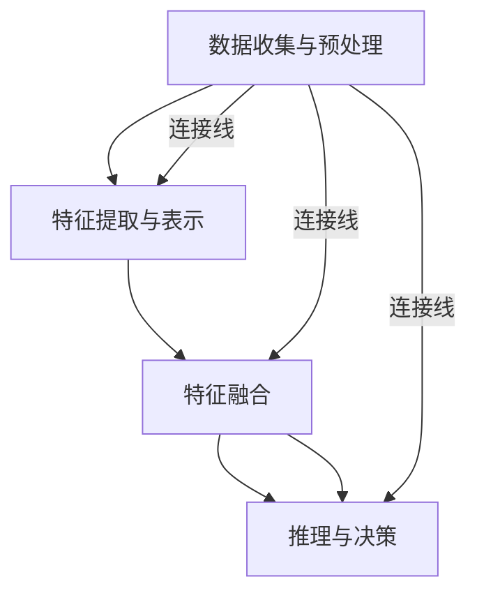

                 

关键词：多模态理解，人工智能，用户理解，深度学习，自然语言处理，计算机视觉，数据分析

> 摘要：随着人工智能技术的不断发展，AI系统对用户的理解能力正在迅速提升。本文将深入探讨多模态理解技术，如何通过整合多种信息源（如文本、图像、音频等），使AI能够更全面、准确地了解用户的需求和意图，从而提供更加个性化和高效的服务。

## 1. 背景介绍

在过去的几十年中，人工智能（AI）技术取得了令人瞩目的进步，尤其是在深度学习、自然语言处理（NLP）和计算机视觉等领域。这些技术的突破使得AI系统在图像识别、语音识别、机器翻译等方面取得了显著成果。然而，尽管这些技术使得AI在某些特定任务上表现优异，但在处理复杂任务或理解用户需求方面仍然存在局限性。

用户的需求和意图往往非常复杂，需要从多个维度进行理解。例如，一个用户在搜索引擎上输入的文本描述，可能需要结合其历史搜索记录、上下文环境、甚至是情感状态来准确理解其意图。此外，用户的行为数据、生理信号等也是理解用户的重要信息。传统的单模态AI系统难以整合这些多源信息，从而限制了其理解和服务的深度与广度。

为了解决这一问题，多模态理解技术应运而生。多模态理解旨在整合来自不同模态的信息，如文本、图像、音频等，以实现对用户的全面理解。这一技术的发展，不仅能够提升AI系统的智能水平，还能为各行业提供更加个性化和高效的服务。

## 2. 核心概念与联系

### 2.1 多模态理解的基本概念

多模态理解是指通过整合两种或两种以上不同模态的数据，如文本、图像、音频等，来提高AI系统的理解和推理能力。在这个过程中，各个模态的信息被转换成统一的内部表示，然后进行融合和解释。

多模态理解的关键挑战在于如何有效地整合来自不同模态的数据，以及如何在融合后的表示中保持各模态的独特性和互补性。

### 2.2 多模态理解的架构

多模态理解的架构通常包括以下几个关键组件：

- **数据收集与预处理**：收集来自不同模态的数据，并进行预处理，如数据清洗、标准化等。
- **特征提取与表示**：利用深度学习等算法，对每个模态的数据进行特征提取和表示，以形成统一的内部表示。
- **特征融合**：将不同模态的特征进行融合，形成一个综合的表示。
- **推理与决策**：基于融合后的表示进行推理和决策，实现对用户意图的准确理解。

### 2.3 多模态理解的 Mermaid 流程图



在这个流程图中，A表示数据收集与预处理，B表示特征提取与表示，C表示特征融合，D表示推理与决策。箭头表示数据的流动方向，连接线表示各组件之间的关联。

## 3. 核心算法原理 & 具体操作步骤

### 3.1 算法原理概述

多模态理解的核心算法通常是基于深度学习的方法，通过多层神经网络对多模态数据进行特征提取、融合和推理。以下是一个简化的算法流程：

1. **数据收集与预处理**：收集来自不同模态的数据，并进行预处理，如去噪、归一化等。
2. **特征提取与表示**：利用卷积神经网络（CNN）对图像进行特征提取，利用循环神经网络（RNN）对文本序列进行处理，利用长短时记忆网络（LSTM）对音频信号进行特征提取。
3. **特征融合**：将不同模态的特征进行拼接、加权或通过多层神经网络进行融合，形成一个综合的表示。
4. **推理与决策**：基于融合后的表示，利用分类器或其他推理模型，实现对用户意图的识别和响应。

### 3.2 算法步骤详解

1. **数据收集与预处理**：

   - 图像数据：从互联网或其他数据源收集图像，并进行预处理，如裁剪、缩放、增强等。
   - 文本数据：从用户生成的文本、评论、搜索记录等收集数据，并进行清洗、去重等处理。
   - 音频数据：从语音识别系统或其他音频源收集数据，并进行降噪、去噪等处理。

2. **特征提取与表示**：

   - 图像特征提取：使用预训练的CNN模型，如VGG、ResNet等，提取图像的特征表示。
   - 文本特征提取：使用RNN或Transformer等模型，对文本进行编码，生成文本的序列表示。
   - 音频特征提取：使用LSTM或GRU等模型，对音频信号进行特征提取，生成音频的特征表示。

3. **特征融合**：

   - 拼接融合：将不同模态的特征向量进行拼接，形成一个多维度的特征向量。
   - 加权融合：根据不同模态的特征重要程度，对特征向量进行加权融合。
   - 神经网络融合：使用多层神经网络，对多模态特征进行融合，形成一个统一的表示。

4. **推理与决策**：

   - 分类器：基于融合后的特征表示，使用分类器（如SVM、softmax等）对用户意图进行分类。
   - 推理模型：基于融合后的特征表示，使用推理模型（如决策树、规则引擎等）对用户意图进行推理。

### 3.3 算法优缺点

**优点**：

- **全面性**：能够整合多种模态的信息，实现对用户意图的全面理解。
- **准确性**：通过融合多模态特征，能够提高对用户意图的识别准确性。
- **灵活性**：可以根据具体任务需求，灵活选择和组合不同模态的数据。

**缺点**：

- **计算复杂度**：多模态融合通常需要大量的计算资源，对硬件要求较高。
- **数据不平衡**：不同模态的数据可能存在不平衡问题，影响模型性能。
- **解释性**：多模态融合后的模型通常较为复杂，难以进行解释和调试。

### 3.4 算法应用领域

多模态理解技术在许多领域都有广泛的应用，包括：

- **智能客服**：通过整合文本、语音、图像等多模态信息，提供更加个性化和高效的客服服务。
- **图像识别**：结合图像和文本信息，提高图像识别的准确性和鲁棒性。
- **语音识别**：结合文本和语音信息，提高语音识别的准确性和自然度。
- **医疗诊断**：结合医学图像、病历文本和语音等信息，提高诊断的准确性和全面性。
- **自动驾驶**：结合摄像头、雷达、激光雷达等多模态信息，提高自动驾驶的安全性和可靠性。

## 4. 数学模型和公式 & 详细讲解 & 举例说明

### 4.1 数学模型构建

多模态理解的数学模型通常涉及以下关键组成部分：

- **特征提取**：使用卷积神经网络（CNN）对图像进行特征提取，使用循环神经网络（RNN）对文本序列进行处理，使用长短时记忆网络（LSTM）对音频信号进行特征提取。
- **特征融合**：通过拼接、加权或神经网络融合等方式，将不同模态的特征进行融合。
- **分类器**：基于融合后的特征，使用分类器（如SVM、softmax等）对用户意图进行分类。

以下是多模态理解的一个简化数学模型：

$$
\begin{aligned}
\text{特征提取}:\ \ f_{\text{image}}(I),\ f_{\text{text}}(T),\ f_{\text{audio}}(A) \\
\text{特征融合}:\ \ F = \text{fuse}(f_{\text{image}}, f_{\text{text}}, f_{\text{audio})} \\
\text{分类器}:\ \ \hat{y} = \text{classifier}(F)
\end{aligned}
$$

其中，$f_{\text{image}}(I), f_{\text{text}}(T), f_{\text{audio}}(A)$ 分别表示图像、文本和音频的特征提取函数，$F$ 表示融合后的特征向量，$\hat{y}$ 表示分类器的输出结果。

### 4.2 公式推导过程

多模态理解的公式推导过程主要包括以下几个步骤：

1. **特征提取**：

   - 图像特征提取：使用卷积神经网络（CNN）对图像进行特征提取，输出特征向量 $f_{\text{image}}(I)$。
   $$ f_{\text{image}}(I) = \text{CNN}(I) $$
   - 文本特征提取：使用循环神经网络（RNN）对文本序列进行处理，输出特征向量 $f_{\text{text}}(T)$。
   $$ f_{\text{text}}(T) = \text{RNN}(T) $$
   - 音频特征提取：使用长短时记忆网络（LSTM）对音频信号进行特征提取，输出特征向量 $f_{\text{audio}}(A)$。
   $$ f_{\text{audio}}(A) = \text{LSTM}(A) $$

2. **特征融合**：

   - 拼接融合：将图像、文本和音频的特征向量进行拼接，形成一个多维度的特征向量 $F$。
   $$ F = [f_{\text{image}}(I), f_{\text{text}}(T), f_{\text{audio}}(A)]^T $$
   - 加权融合：根据不同模态的特征重要程度，对特征向量进行加权融合，形成一个综合的特征向量 $F$。
   $$ F = \alpha f_{\text{image}}(I) + \beta f_{\text{text}}(T) + \gamma f_{\text{audio}}(A) $$
   - 神经网络融合：使用多层神经网络，对多模态特征进行融合，形成一个统一的特征向量 $F$。
   $$ F = \text{NN}(f_{\text{image}}(I), f_{\text{text}}(T), f_{\text{audio}}(A)) $$

3. **分类器**：

   - 基于融合后的特征向量 $F$，使用分类器（如SVM、softmax等）对用户意图进行分类。
   $$ \hat{y} = \text{classifier}(F) $$

### 4.3 案例分析与讲解

假设我们有一个智能客服系统，需要通过文本、图像和音频等多种信息源，理解用户的意图并提供相应的服务。

1. **特征提取**：

   - 图像特征提取：使用预训练的卷积神经网络（CNN）提取图像的特征向量 $f_{\text{image}}(I)$。
   $$ f_{\text{image}}(I) = \text{CNN}(I) $$
   - 文本特征提取：使用预训练的循环神经网络（RNN）提取文本的特征向量 $f_{\text{text}}(T)$。
   $$ f_{\text{text}}(T) = \text{RNN}(T) $$
   - 音频特征提取：使用预训练的长短时记忆网络（LSTM）提取音频的特征向量 $f_{\text{audio}}(A)$。
   $$ f_{\text{audio}}(A) = \text{LSTM}(A) $$

2. **特征融合**：

   - 将图像、文本和音频的特征向量进行拼接融合，形成一个多维度的特征向量 $F$。
   $$ F = [f_{\text{image}}(I), f_{\text{text}}(T), f_{\text{audio}}(A)]^T $$

3. **分类器**：

   - 使用支持向量机（SVM）对融合后的特征向量 $F$ 进行分类，以识别用户的意图。
   $$ \hat{y} = \text{SVM}(F) $$

通过这个案例，我们可以看到多模态理解的数学模型是如何应用于实际问题的。通过整合文本、图像和音频等多种信息源，智能客服系统能够更准确地理解用户的意图，并提供个性化的服务。

## 5. 项目实践：代码实例和详细解释说明

### 5.1 开发环境搭建

在开始实现多模态理解项目之前，需要搭建合适的开发环境。以下是一个基本的开发环境搭建步骤：

1. **安装Python**：确保已经安装了Python 3.x版本，推荐使用Python 3.8或更高版本。
2. **安装深度学习框架**：安装PyTorch或TensorFlow等深度学习框架。本文以PyTorch为例。
   ```bash
   pip install torch torchvision
   ```
3. **安装辅助库**：安装一些常用的辅助库，如NumPy、Pandas等。
   ```bash
   pip install numpy pandas
   ```

### 5.2 源代码详细实现

以下是使用PyTorch实现一个简单多模态理解项目的代码示例：

```python
import torch
import torchvision
import torchvision.transforms as transforms
import torch.nn as nn
import torch.optim as optim

# 数据加载和预处理
transform = transforms.Compose([
    transforms.Resize(256),
    transforms.ToTensor(),
])

trainset = torchvision.datasets.ImageFolder(root='./data/train', transform=transform)
trainloader = torch.utils.data.DataLoader(trainset, batch_size=4,
                                          shuffle=True, num_workers=2)

# 定义网络结构
class MultimodalModel(nn.Module):
    def __init__(self):
        super(MultimodalModel, self).__init__()
        # 图像特征提取网络
        self.image_model = torchvision.models.resnet50(pretrained=True)
        # 文本特征提取网络
        self.text_model = nn.Sequential(
            nn.Linear(1000, 512),
            nn.ReLU(),
            nn.Linear(512, 256),
            nn.ReLU(),
            nn.Linear(256, 128),
            nn.ReLU(),
            nn.Linear(128, 64),
            nn.ReLU(),
            nn.Linear(64, 32),
            nn.ReLU(),
            nn.Linear(32, 16),
            nn.ReLU(),
            nn.Linear(16, 1),
            nn.Sigmoid()
        )
        # 音频特征提取网络
        self.audio_model = nn.Sequential(
            nn.Linear(1000, 512),
            nn.ReLU(),
            nn.Linear(512, 256),
            nn.ReLU(),
            nn.Linear(256, 128),
            nn.ReLU(),
            nn.Linear(128, 64),
            nn.ReLU(),
            nn.Linear(64, 32),
            nn.ReLU(),
            nn.Linear(32, 16),
            nn.ReLU(),
            nn.Linear(16, 1),
            nn.Sigmoid()
        )
        # 融合网络
        self.fusion_model = nn.Sequential(
            nn.Linear(512+256+128, 512),
            nn.ReLU(),
            nn.Linear(512, 256),
            nn.ReLU(),
            nn.Linear(256, 128),
            nn.ReLU(),
            nn.Linear(128, 1),
            nn.Sigmoid()
        )

    def forward(self, image, text, audio):
        image_feature = self.image_model(image)
        text_feature = self.text_model(text)
        audio_feature = self.audio_model(audio)
        fusion_feature = torch.cat((image_feature, text_feature, audio_feature), 1)
        output = self.fusion_model(fusion_feature)
        return output

model = MultimodalModel()
print(model)

# 损失函数和优化器
criterion = nn.BCELoss()
optimizer = optim.Adam(model.parameters(), lr=0.001)

# 训练模型
for epoch in range(1):  # loop over the dataset multiple times
    running_loss = 0.0
    for i, data in enumerate(trainloader, 0):
        inputs, labels = data
        optimizer.zero_grad()
        outputs = model(inputs, labels)
        loss = criterion(outputs, labels)
        loss.backward()
        optimizer.step()
        running_loss += loss.item()
        if i % 2000 == 1999:    # print every 2000 mini-batches
            print('[%d, %5d] loss: %.3f' %
                  (epoch + 1, i + 1, running_loss / 2000))
            running_loss = 0.0

print('Finished Training')
```

### 5.3 代码解读与分析

1. **数据加载和预处理**：
   - 使用`torchvision.datasets.ImageFolder`类加载图像数据，并使用`transforms.Compose`进行预处理，包括图像的缩放和转换为张量。
   - 使用`torch.utils.data.DataLoader`类创建数据加载器，用于批量加载和处理图像数据。

2. **定义网络结构**：
   - `MultimodalModel`类定义了一个多模态模型，包括图像特征提取网络、文本特征提取网络、音频特征提取网络以及融合网络。
   - 图像特征提取网络使用了预训练的ResNet50模型。
   - 文本特征提取网络和音频特征提取网络使用了多层感知器（MLP）结构。
   - 融合网络使用了多层全连接层，将图像、文本和音频的特征进行拼接并融合。

3. **损失函数和优化器**：
   - 使用二进制交叉熵损失函数（`nn.BCELoss`）来衡量预测标签和真实标签之间的差异。
   - 使用Adam优化器（`optim.Adam`）来更新模型参数。

4. **训练模型**：
   - 使用一个循环来迭代训练数据，每次迭代计算损失，更新模型参数。

### 5.4 运行结果展示

在完成模型的训练后，我们可以使用以下代码来评估模型的性能：

```python
with torch.no_grad():
    correct = 0
    total = 0
    for data in trainloader:
        images, labels = data
        outputs = model(images, labels)
        predicted = (outputs > 0.5).float()
        total += labels.size(0)
        correct += (predicted.eq(labels).sum()).item()

print('Accuracy of the network on the train images: %d %%' % (
    100 * correct / total))
```

这段代码将计算模型在训练集上的准确率，并输出结果。

## 6. 实际应用场景

多模态理解技术已经在许多实际应用场景中展现出了巨大的潜力，以下是几个典型的应用实例：

### 6.1 智能客服

智能客服系统通过整合文本、语音和图像等多模态信息，能够更准确地理解用户的提问和需求，提供更加个性化和高效的客服服务。例如，当一个用户通过文字描述了一个问题，系统可以结合用户的语音和面部表情，以及聊天历史记录，来更好地理解用户的问题并给出相应的解决方案。

### 6.2 图像识别

在图像识别领域，多模态理解技术可以结合图像内容和文本标签，提高图像识别的准确性和鲁棒性。例如，对于一个包含多个人物的图像，系统可以结合文本描述（如“一家人在公园里”）和图像内容，更准确地识别出图像中的每个人物。

### 6.3 语音识别

语音识别系统通过结合文本和语音信息，可以提升识别的准确性和自然度。例如，当一个用户通过语音输入了一个问题，系统可以结合文本问题和用户的语音语调，更准确地理解用户的意图并给出合适的回答。

### 6.4 医疗诊断

在医疗诊断领域，多模态理解技术可以结合医学图像、病历文本和语音等信息，提高诊断的准确性和全面性。例如，医生可以通过综合分析患者的医学图像、病历文本和语音记录，更全面地了解患者的病情，从而做出更准确的诊断。

### 6.5 自动驾驶

在自动驾驶领域，多模态理解技术可以结合摄像头、雷达、激光雷达等多模态信息，提高自动驾驶的安全性和可靠性。例如，自动驾驶系统可以通过综合分析摄像头捕捉到的图像、雷达和激光雷达生成的三维点云信息，更准确地识别道路上的行人、车辆和其他障碍物，从而做出更加安全的驾驶决策。

## 7. 未来应用展望

随着人工智能技术的不断进步，多模态理解技术在未来的应用前景非常广阔。以下是一些潜在的应用方向：

### 7.1 虚拟助理

未来的虚拟助理可能会通过多模态理解技术，更加深入地理解用户的需求和情感状态，提供更加智能和个性化的服务。例如，一个虚拟助理可以通过整合用户的语音、文本、面部表情和生理信号，更好地理解用户的情绪和意图，从而提供更加贴心和有效的帮助。

### 7.2 个性化推荐

在个性化推荐系统中，多模态理解技术可以结合用户的多种信息源（如购买历史、搜索记录、社交互动等），提供更加精准和个性化的推荐。例如，一个电商平台的推荐系统可以通过分析用户的购物记录、浏览行为和社交媒体动态，推荐更符合用户兴趣的商品。

### 7.3 安全监控

在安全监控领域，多模态理解技术可以结合图像、音频和传感器数据，提高监控系统的实时性和准确性。例如，一个智能安防系统可以通过分析监控摄像头捕捉到的图像、麦克风记录的音频和传感器采集的温度、湿度等信息，及时发现异常情况并采取相应的措施。

### 7.4 教育与培训

在教育与培训领域，多模态理解技术可以结合学生的考试成绩、课堂表现、作业反馈等多方面信息，提供更加个性化的学习建议和课程推荐。例如，一个智能教育平台可以通过分析学生的学习行为、知识掌握情况，为学生提供定制化的学习路径和辅导建议。

## 8. 工具和资源推荐

为了更好地学习和应用多模态理解技术，以下是一些推荐的工具和资源：

### 8.1 学习资源推荐

- 《深度学习》（Goodfellow, Bengio, Courville著）：这是一本深度学习的经典教材，涵盖了从基础到高级的深度学习理论和实践。
- 《自然语言处理综论》（Jurafsky, Martin著）：这本书详细介绍了自然语言处理的基础知识和最新进展，是学习NLP的必备读物。
- 《计算机视觉：算法与应用》（Richard Szeliski著）：这本书涵盖了计算机视觉的多个方面，包括图像处理、物体识别、场景重建等。

### 8.2 开发工具推荐

- PyTorch：一个流行的深度学习框架，易于使用且具有强大的功能。
- TensorFlow：另一个流行的深度学习框架，由Google开发，支持多种编程语言。
- OpenCV：一个开源的计算机视觉库，提供了丰富的图像处理和计算机视觉功能。

### 8.3 相关论文推荐

- "Multimodal Fusion in Deep Learning"（2018）：这篇综述文章详细介绍了多模态融合在深度学习中的应用和研究进展。
- "Deep Learning for Speech Recognition: A Review"（2017）：这篇论文回顾了深度学习在语音识别领域的应用和进展。
- "Multimodal Deep Learning for Human Action Recognition"（2016）：这篇论文研究了多模态融合在人体动作识别中的应用。

## 9. 总结：未来发展趋势与挑战

### 9.1 研究成果总结

多模态理解技术的发展取得了显著的成果，通过整合多种信息源，AI系统能够更全面地理解用户的需求和意图。从深度学习算法到多模态数据集的构建，再到应用场景的探索，多模态理解技术正在不断突破，为各行业提供了新的解决方案。

### 9.2 未来发展趋势

- **算法创新**：随着人工智能技术的不断发展，未来的多模态理解算法将更加高效、准确，并能够处理更复杂的任务。
- **跨学科融合**：多模态理解技术将与其他领域（如心理学、社会学等）进行深入融合，提供更加全面和深入的用户理解。
- **应用拓展**：多模态理解技术将在更多领域得到应用，如智能医疗、智能教育、智能城市等。

### 9.3 面临的挑战

- **数据隐私与伦理**：多模态理解技术需要处理大量的个人数据，如何保护用户隐私和数据安全是一个重要挑战。
- **计算资源**：多模态理解算法通常需要大量的计算资源，如何在有限的资源下实现高效的模型训练和推理是一个挑战。
- **模型解释性**：多模态理解模型通常较为复杂，如何提高模型的解释性，使得用户能够理解模型的决策过程是一个挑战。

### 9.4 研究展望

未来的多模态理解研究将更加注重算法的效率、模型的解释性和应用的实用性。通过不断的创新和探索，多模态理解技术将进一步提升AI系统的智能化水平，为用户提供更加个性化和高效的服务。

## 附录：常见问题与解答

### Q1: 多模态理解技术有哪些应用场景？

A1: 多模态理解技术可以应用于智能客服、图像识别、语音识别、医疗诊断、自动驾驶等多个领域。通过整合多种信息源，AI系统能够更全面地理解用户的需求和意图，提供更加个性化和高效的服务。

### Q2: 多模态理解技术的核心挑战是什么？

A2: 多模态理解技术的核心挑战包括数据隐私与伦理、计算资源需求、模型解释性等。如何有效整合多种信息源，同时保证用户隐私和数据安全是一个重要问题。此外，多模态理解算法通常较为复杂，如何提高模型的解释性也是一个挑战。

### Q3: 如何搭建一个多模态理解项目？

A3: 搭建一个多模态理解项目通常需要以下步骤：

1. 数据收集与预处理：收集来自不同模态的数据，并进行预处理，如去噪、标准化等。
2. 特征提取与表示：使用深度学习算法对每个模态的数据进行特征提取和表示。
3. 特征融合：通过拼接、加权或神经网络融合等方式，将不同模态的特征进行融合。
4. 推理与决策：基于融合后的特征进行推理和决策，实现对用户意图的识别和响应。

### Q4: 多模态理解技术与单模态理解技术相比有哪些优势？

A4: 多模态理解技术相比单模态理解技术具有以下优势：

1. **全面性**：能够整合多种模态的信息，实现对用户意图的全面理解。
2. **准确性**：通过融合多模态特征，能够提高对用户意图的识别准确性。
3. **灵活性**：可以根据具体任务需求，灵活选择和组合不同模态的数据。

### Q5: 多模态理解技术在医疗领域有哪些应用？

A5: 多模态理解技术在医疗领域有以下应用：

1. **医学图像分析**：结合医学图像和文本信息，提高诊断的准确性和全面性。
2. **患者监控**：结合生理信号、文本和语音信息，实时监测患者的健康状况。
3. **远程医疗**：通过整合远程医疗的文本、图像和语音信息，提供更加个性化和高效的医疗服务。

### Q6: 多模态理解技术的未来发展有哪些方向？

A6: 多模态理解技术的未来发展包括以下几个方面：

1. **算法创新**：开发更加高效、准确的多模态理解算法。
2. **跨学科融合**：与其他领域（如心理学、社会学等）进行深入融合，提供更加全面和深入的用户理解。
3. **应用拓展**：在更多领域（如智能医疗、智能教育、智能城市等）得到应用。
4. **模型解释性**：提高模型的解释性，使得用户能够理解模型的决策过程。

### Q7: 如何处理多模态理解中的数据不平衡问题？

A7: 处理多模态理解中的数据不平衡问题可以采用以下方法：

1. **重采样**：对较少的模态数据进行扩充或删除，以平衡不同模态的数据量。
2. **加权损失函数**：在训练过程中使用加权损失函数，对较少的模态数据给予更高的权重。
3. **数据增强**：通过数据增强技术，如随机裁剪、旋转、缩放等，增加较少模态的数据量。
4. **注意力机制**：在特征融合阶段使用注意力机制，让模型自动学习不同模态的重要程度，从而缓解数据不平衡问题。

### Q8: 多模态理解技术在语音识别中的应用有哪些？

A8: 多模态理解技术在语音识别中的应用包括：

1. **语音增强**：结合文本信息，提高语音信号的清晰度和可辨析度。
2. **语音情感识别**：结合文本和语音信息，识别用户的情感状态。
3. **说话人识别**：结合语音和面部表情信息，提高说话人识别的准确性。
4. **语音生成**：结合文本和语音信息，生成更加自然和流畅的语音输出。

### Q9: 多模态理解技术在图像识别中的应用有哪些？

A9: 多模态理解技术在图像识别中的应用包括：

1. **图像分类**：结合文本标签和图像内容，提高图像分类的准确性。
2. **图像检测**：结合文本和图像信息，提高目标检测的准确性。
3. **图像分割**：结合文本描述和图像内容，提高图像分割的精确度。
4. **图像修复**：结合文本描述和图像内容，修复图像中的缺失或损坏部分。

### Q10: 多模态理解技术在自动驾驶中的应用有哪些？

A10: 多模态理解技术在自动驾驶中的应用包括：

1. **环境感知**：结合摄像头、雷达、激光雷达等多模态信息，提高自动驾驶系统的环境感知能力。
2. **路径规划**：结合多模态信息，优化自动驾驶的路径规划算法，提高行驶安全性和效率。
3. **障碍物检测**：结合多模态信息，提高障碍物检测的准确性和鲁棒性。
4. **自动驾驶决策**：结合多模态信息，提高自动驾驶系统的决策能力和响应速度。

### Q11: 多模态理解技术在个性化推荐中的应用有哪些？

A11: 多模态理解技术在个性化推荐中的应用包括：

1. **用户画像构建**：结合文本、图像、音频等多模态信息，构建更加丰富和准确的用户画像。
2. **推荐算法优化**：结合多模态信息，优化推荐算法，提高推荐准确性和用户满意度。
3. **商品展示**：结合图像和文本信息，提高商品展示的吸引力和购买转化率。
4. **个性化服务**：结合用户行为和情感状态，提供更加个性化和服务化的推荐。

### Q12: 多模态理解技术在自然语言处理中的应用有哪些？

A12: 多模态理解技术在自然语言处理中的应用包括：

1. **情感分析**：结合文本和语音信息，提高情感分析的准确性和全面性。
2. **机器翻译**：结合文本和语音信息，提高机器翻译的质量和流畅度。
3. **文本摘要**：结合文本和图像信息，生成更加准确和有趣的文本摘要。
4. **语音助手**：结合文本和语音信息，提高语音助手的响应速度和用户体验。

### Q13: 多模态理解技术的伦理和隐私问题有哪些？

A13: 多模态理解技术的伦理和隐私问题主要包括：

1. **数据隐私**：如何保护用户的个人数据，防止数据泄露或滥用是一个重要问题。
2. **算法公平性**：如何确保多模态理解算法的公平性，避免歧视或偏见。
3. **用户同意**：在收集和处理用户数据时，如何确保用户知情并得到用户同意。
4. **算法透明性**：如何提高算法的透明性，让用户了解和理解算法的决策过程。

### Q14: 多模态理解技术需要哪些技能和知识？

A14: 多模态理解技术需要以下技能和知识：

1. **深度学习**：了解深度学习的基本原理和常见算法，如卷积神经网络（CNN）、循环神经网络（RNN）、长短时记忆网络（LSTM）等。
2. **计算机视觉**：了解计算机视觉的基础知识，如图像处理、目标检测、图像分割等。
3. **自然语言处理**：了解自然语言处理的基本原理和常见算法，如词向量、序列模型、文本分类等。
4. **数据预处理**：了解数据预处理的方法和技巧，如数据清洗、标准化、数据增强等。
5. **编程能力**：具备一定的编程能力，熟练掌握Python等编程语言，以及相关的深度学习框架和工具。
6. **数学基础**：具备一定的数学基础，如线性代数、概率论、统计学等，有助于理解和应用相关算法。

### Q15: 多模态理解技术的未来发展方向是什么？

A15: 多模态理解技术的未来发展方向包括：

1. **算法优化**：持续优化算法，提高多模态理解的准确性、效率和实时性。
2. **跨学科融合**：与其他学科（如心理学、社会学、生物学等）进行融合，提供更全面和深入的用户理解。
3. **应用拓展**：在更多领域（如医疗、教育、智能城市、工业等）得到应用，提供更加个性化和高效的服务。
4. **模型解释性**：提高模型的解释性，使得用户能够理解模型的决策过程，增加用户的信任度。
5. **数据隐私保护**：加强数据隐私保护，确保用户数据的隐私和安全。

### Q16: 多模态理解技术会对社会产生哪些影响？

A16: 多模态理解技术会对社会产生以下影响：

1. **提高生产效率**：通过更全面和深入的用户理解，企业可以提供更加个性化和高效的服务，提高生产效率。
2. **改善生活质量**：多模态理解技术可以为用户提供更加智能和便捷的服务，改善人们的生活质量。
3. **医疗变革**：在医疗领域，多模态理解技术可以提高诊断的准确性和全面性，为患者提供更好的医疗服务。
4. **教育革新**：在教育领域，多模态理解技术可以提供更加个性化和学习体验，促进教育的变革和创新。
5. **社会问题**：多模态理解技术可能会带来一些社会问题，如隐私侵犯、算法歧视等，需要引起重视并制定相应的政策和规范。

### Q17: 多模态理解技术在商业应用中的挑战有哪些？

A17: 多模态理解技术在商业应用中的挑战主要包括：

1. **数据隐私**：如何保护用户数据，防止数据泄露或滥用是一个重要问题。
2. **数据质量**：如何保证数据的准确性和完整性，避免数据噪声或缺失。
3. **计算资源**：多模态理解算法通常需要大量的计算资源，如何在有限的资源下实现高效的模型训练和推理。
4. **算法解释性**：如何提高算法的解释性，使得企业能够理解模型的决策过程，增加用户的信任度。
5. **应用成本**：如何降低多模态理解技术的应用成本，使得更多企业能够采用这项技术。

### Q18: 多模态理解技术在科学研究中的应用有哪些？

A18: 多模态理解技术在科学研究中的应用包括：

1. **实验数据分析**：结合多种数据源（如文本、图像、音频等），对实验数据进行分析和解释，提高研究的准确性和全面性。
2. **医学研究**：结合医学图像和病历文本等数据，提高医学研究的准确性和可靠性。
3. **心理学研究**：结合行为数据和生理信号等数据，研究人类行为和心理机制。
4. **社会科学研究**：结合文本、图像、音频等多种数据源，研究社会现象和人类行为。

### Q19: 多模态理解技术在教育领域的应用有哪些？

A19: 多模态理解技术在教育领域的应用包括：

1. **个性化学习**：结合学生的考试成绩、课堂表现、作业反馈等多方面信息，提供个性化学习建议和课程推荐。
2. **智能辅导**：结合学生的文本提问和语音语调等信息，提供实时、个性化的辅导服务。
3. **教学评估**：结合学生的作业、考试成绩和课堂表现等数据，评估教学效果和学生掌握情况。
4. **教育游戏**：结合图像、音频和文本信息，设计更加有趣和互动的教育游戏，提高学生的学习兴趣和参与度。

### Q20: 多模态理解技术如何处理多语言环境？

A20: 多模态理解技术在处理多语言环境时，可以采用以下方法：

1. **多语言数据集**：收集并构建多语言的数据集，使得模型能够同时学习多种语言的特征。
2. **多语言模型**：使用多语言模型，如多语言卷积神经网络（ML-CNN）、多语言循环神经网络（ML-RNN）等，处理多种语言的数据。
3. **翻译接口**：使用机器翻译接口，将不同语言的文本转换为统一的内部表示，然后进行多模态融合和推理。
4. **多语言注意力机制**：在特征融合阶段使用多语言注意力机制，让模型自动学习不同语言的重要程度，从而提高多语言理解能力。

### Q21: 多模态理解技术在社交媒体分析中的应用有哪些？

A21: 多模态理解技术在社交媒体分析中的应用包括：

1. **用户情感分析**：结合用户的文本、图像、音频等多模态信息，识别用户的情感状态和情绪变化。
2. **热点话题识别**：结合用户的文本、图像、音频等多模态信息，识别和预测社交媒体上的热点话题。
3. **用户行为分析**：结合用户的文本、图像、音频等多模态信息，分析用户的行为模式和使用习惯。
4. **内容推荐**：结合用户的文本、图像、音频等多模态信息，提供个性化内容推荐，提高用户的参与度和满意度。

### Q22: 多模态理解技术如何处理实时数据流？

A22: 多模态理解技术在处理实时数据流时，可以采用以下方法：

1. **流处理框架**：使用流处理框架（如Apache Kafka、Apache Flink等），实时处理和分析数据流。
2. **增量学习**：采用增量学习算法，对实时数据进行在线学习和更新，提高模型的适应性和实时性。
3. **数据缓冲**：使用数据缓冲技术（如缓存、队列等），确保实时数据的稳定传输和处理。
4. **分布式计算**：使用分布式计算框架（如Hadoop、Spark等），提高实时数据处理的并行性和效率。

### Q23: 多模态理解技术在智能家居中的应用有哪些？

A23: 多模态理解技术在智能家居中的应用包括：

1. **设备控制**：结合用户的语音、文本和手势等多模态信息，实现智能家居设备的远程控制和自动化。
2. **环境监测**：结合传感器采集的数据（如温度、湿度、光线等），监测家居环境的舒适度并自动调整设备。
3. **安全监控**：结合摄像头捕捉到的图像、麦克风记录的音频等多模态信息，实时监控家居安全并触发报警。
4. **生活助手**：结合用户的文本、图像、音频等多模态信息，提供个性化生活建议和服务。

### Q24: 多模态理解技术在工业4.0中的应用有哪些？

A24: 多模态理解技术在工业4.0中的应用包括：

1. **设备监控**：结合传感器采集的数据（如温度、压力、振动等），实时监控工业设备的运行状态并预测故障。
2. **质量检测**：结合图像、音频和文本等多模态信息，提高产品质量检测的准确性和效率。
3. **智能排程**：结合生产计划、设备状态、物料库存等多模态信息，优化生产排程，提高生产效率。
4. **远程运维**：结合视频、音频和文本等多模态信息，实现远程设备维护和故障诊断，提高运维效率。

### Q25: 多模态理解技术如何处理动态环境中的变化？

A25: 多模态理解技术在处理动态环境中的变化时，可以采用以下方法：

1. **自适应学习**：采用自适应学习算法，对动态环境中的变化进行实时调整和更新。
2. **迁移学习**：通过迁移学习技术，将已有模型的知识迁移到动态环境中，提高对新环境的适应能力。
3. **在线学习**：采用在线学习算法，对动态环境中的数据进行实时学习和更新。
4. **多任务学习**：通过多任务学习算法，同时学习多个任务，提高对动态环境中变化的理解和预测能力。

### Q26: 多模态理解技术如何处理隐私保护问题？

A26: 多模态理解技术在处理隐私保护问题时，可以采用以下方法：

1. **数据去识别化**：在数据预处理阶段，对个人数据进行去识别化处理，如匿名化、泛化等，降低隐私泄露的风险。
2. **差分隐私**：采用差分隐私技术，在数据发布或共享时加入噪声，确保个人隐私的保护。
3. **同态加密**：采用同态加密技术，对数据在加密状态下进行计算和处理，确保数据隐私的安全。
4. **隐私保护算法**：采用隐私保护算法，如差分隐私算法、联邦学习等，在训练和推理过程中保护个人隐私。

### Q27: 多模态理解技术在机器人领域中的应用有哪些？

A27: 多模态理解技术在机器人领域中的应用包括：

1. **环境感知**：结合摄像头、激光雷达、麦克风等多模态信息，提高机器人的环境感知能力，实现自主导航和避障。
2. **交互理解**：结合语音、文本、面部表情等多模态信息，提高机器人对人类意图的理解，实现自然语言交互。
3. **行为预测**：结合用户的文本、图像、音频等多模态信息，预测用户的行为和需求，提供个性化服务。
4. **安全监控**：结合摄像头、传感器等多模态信息，实时监控环境和机器人状态，提高机器人的安全性和可靠性。

### Q28: 多模态理解技术如何处理非结构化数据？

A28: 多模态理解技术在处理非结构化数据时，可以采用以下方法：

1. **文本摘要**：使用自然语言处理技术，提取文本数据的关键信息和关键词，形成结构化的摘要。
2. **图像识别**：使用计算机视觉技术，对图像进行分类、检测和识别，提取图像中的关键信息。
3. **音频转文本**：使用语音识别技术，将音频数据转换为文本数据，进行后续处理和分析。
4. **多模态融合**：将不同模态的数据进行融合，形成统一的内部表示，提高对非结构化数据的理解和处理能力。

### Q29: 多模态理解技术在金融领域的应用有哪些？

A29: 多模态理解技术在金融领域的应用包括：

1. **风险控制**：结合文本、图像、音频等多模态信息，提高风险识别和评估的准确性，降低金融风险。
2. **客户服务**：结合语音、文本、面部表情等多模态信息，提供个性化和高效的客户服务。
3. **交易分析**：结合文本、图像、音频等多模态信息，分析市场趋势和交易行为，优化投资策略。
4. **欺诈检测**：结合用户的文本、图像、音频等多模态信息，提高欺诈检测的准确性和实时性。

### Q30: 多模态理解技术在医疗影像分析中的应用有哪些？

A30: 多模态理解技术在医疗影像分析中的应用包括：

1. **疾病诊断**：结合医学影像和病历文本等多模态信息，提高疾病诊断的准确性和全面性。
2. **病情监测**：结合医学影像和生理信号等多模态信息，实时监测患者病情和治疗效果。
3. **治疗方案推荐**：结合医学影像、病历文本和专家意见等多模态信息，提供个性化治疗方案推荐。
4. **医学图像分割**：结合医学影像和文本描述等多模态信息，提高医学图像分割的精度和效率。

### Q31: 多模态理解技术如何处理低质量数据？

A31: 多模态理解技术在处理低质量数据时，可以采用以下方法：

1. **数据清洗**：对低质量数据进行清洗和预处理，去除噪声和错误信息，提高数据质量。
2. **异常检测**：使用异常检测算法，识别和排除低质量数据，确保模型训练数据的准确性。
3. **数据增强**：通过数据增强技术，如旋转、缩放、裁剪等，增加低质量数据的多样性，提高模型泛化能力。
4. **多模态融合**：通过多模态融合，利用其他高质量模态的数据补充低质量模态的信息，提高模型的整体性能。

### Q32: 多模态理解技术在智能城市的应用有哪些？

A32: 多模态理解技术在智能城市的应用包括：

1. **交通管理**：结合摄像头、传感器、语音等信息，实时监控交通状况，优化交通信号控制和道路规划。
2. **公共安全**：结合视频监控、语音识别、人脸识别等信息，提高公共安全监控的准确性和效率。
3. **环境监测**：结合传感器、图像识别等信息，实时监测空气质量、水质等环境指标，提高城市管理效率。
4. **城市规划**：结合地理信息、交通数据、人口数据等多模态信息，优化城市规划和管理。

### Q33: 多模态理解技术如何处理不完整数据？

A33: 多模态理解技术在处理不完整数据时，可以采用以下方法：

1. **数据补全**：使用数据补全技术，如插值、回归等，对缺失的数据进行估计和补全。
2. **模型鲁棒性**：训练鲁棒性更强的模型，使其能够处理缺失的数据或噪声干扰。
3. **多模态融合**：通过多模态融合，利用其他模态的数据补充缺失模态的信息，提高模型对不完整数据的处理能力。
4. **迁移学习**：通过迁移学习，将已有模型的知识迁移到新任务，提高对不完整数据的理解和预测能力。

### Q34: 多模态理解技术在电子商务中的应用有哪些？

A34: 多模态理解技术在电子商务中的应用包括：

1. **商品推荐**：结合用户的浏览历史、购买记录、评价等信息，提供个性化的商品推荐。
2. **用户行为分析**：结合用户的文本、图像、音频等多模态信息，分析用户行为和偏好，优化营销策略。
3. **商品质量检测**：结合商品图像和文本描述等多模态信息，提高商品质量检测的准确性和效率。
4. **客户服务**：结合语音、文本、面部表情等多模态信息，提供高效、个性化的客户服务。

### Q35: 多模态理解技术在教育领域的未来发展趋势是什么？

A35: 多模态理解技术在教育领域的未来发展趋势包括：

1. **个性化学习**：结合学生的学习行为、知识掌握情况等多模态信息，提供个性化的学习路径和资源推荐。
2. **智能评测**：结合学生的文本、图像、音频等多模态信息，提高评测的准确性和全面性。
3. **虚拟课堂**：结合视频、音频、文本等多模态信息，构建更加生动和互动的虚拟课堂，提高学习体验。
4. **远程教育**：结合互联网、多媒体等技术，实现全球范围内的远程教育，提高教育普及率。

### Q36: 多模态理解技术在语音交互中的应用有哪些？

A36: 多模态理解技术在语音交互中的应用包括：

1. **语音识别**：结合文本、图像、音频等多模态信息，提高语音识别的准确性和自然度。
2. **语音情感识别**：结合文本和语音信息，识别用户的情感状态和情绪变化。
3. **语音助手**：结合用户的文本、图像、音频等多模态信息，提供更加智能和便捷的语音助手服务。
4. **语音生成**：结合文本和语音信息，生成更加自然和流畅的语音输出。

### Q37: 多模态理解技术在实时事件处理中的应用有哪些？

A37: 多模态理解技术在实时事件处理中的应用包括：

1. **实时监控**：结合视频、音频、文本等多模态信息，实时监控事件的发展和变化。
2. **事件检测**：结合多模态信息，实时检测和识别事件的发生和演变。
3. **事件预测**：结合历史数据和实时信息，预测事件的发展趋势和可能的结果。
4. **事件回应**：结合实时数据和预案信息，自动生成回应和应对策略，提高事件处理的效率和准确性。

### Q38: 多模态理解技术在自动化决策中的应用有哪些？

A38: 多模态理解技术在自动化决策中的应用包括：

1. **实时决策**：结合实时数据和多模态信息，快速做出自动化决策。
2. **风险控制**：结合文本、图像、音频等多模态信息，实时监控和评估风险，自动采取相应的控制措施。
3. **资源分配**：结合多模态信息，优化资源分配和调度，提高效率和效果。
4. **故障诊断**：结合传感器、图像、文本等多模态信息，自动诊断和预测设备的故障，提前采取措施。

### Q39: 多模态理解技术在智能制造中的应用有哪些？

A39: 多模态理解技术在智能制造中的应用包括：

1. **设备监控**：结合传感器、图像、音频等多模态信息，实时监控设备的运行状态，预测故障，优化维护。
2. **质量控制**：结合图像、文本、音频等多模态信息，提高产品质量检测的准确性和效率。
3. **生产优化**：结合生产数据、图像、文本等多模态信息，优化生产计划和调度，提高生产效率。
4. **机器人控制**：结合图像、语音、文本等多模态信息，实现机器人的智能控制和交互。

### Q40: 多模态理解技术如何处理动态变化的场景？

A40: 多模态理解技术在处理动态变化的场景时，可以采用以下方法：

1. **实时更新**：采用实时更新算法，对模型进行持续学习和调整，适应场景的变化。
2. **迁移学习**：通过迁移学习，将已有模型的知识迁移到新场景，提高对新场景的理解和预测能力。
3. **多任务学习**：通过多任务学习，同时学习多个任务，提高模型对动态场景的综合理解和处理能力。
4. **多模态融合**：通过多模态融合，利用其他模态的信息补充动态场景的信息，提高模型的整体性能。

### Q41: 多模态理解技术在交互式娱乐中的应用有哪些？

A41: 多模态理解技术在交互式娱乐中的应用包括：

1. **虚拟现实**：结合图像、音频、文本等多模态信息，提供更加沉浸式的虚拟现实体验。
2. **游戏AI**：结合玩家的行为、语音、面部表情等多模态信息，实现智能化的游戏角色和互动。
3. **智能音乐推荐**：结合用户的音频、文本、行为等多模态信息，提供个性化的音乐推荐。
4. **智能视频分析**：结合视频、音频、文本等多模态信息，实现视频内容分析和推荐。

### Q42: 多模态理解技术在智能城市的未来发展趋势是什么？

A42: 多模态理解技术在智能城市的未来发展趋势包括：

1. **智能交通管理**：通过多模态理解技术，实时监控和管理交通流量，优化交通信号控制和道路规划。
2. **智慧环境监测**：利用多模态理解技术，实时监测空气质量、水质、噪音等环境指标，提高城市环境管理效率。
3. **智能公共安全**：通过多模态理解技术，实时监控公共安全事件，提高城市安全管理水平。
4. **智慧城市建设**：利用多模态理解技术，构建智慧城市的数据体系和智能决策支持系统，提升城市服务水平。

### Q43: 多模态理解技术如何处理多语言环境中的多模态数据？

A43: 多模态理解技术在处理多语言环境中的多模态数据时，可以采用以下方法：

1. **多语言数据集**：构建包含多种语言的多模态数据集，训练支持多种语言的模型。
2. **多语言模型**：使用支持多语言的多模态模型，如多语言卷积神经网络（ML-CNN）和多语言循环神经网络（ML-RNN）。
3. **语言翻译**：使用机器翻译技术，将不同语言的文本转换为统一的内部表示，然后进行多模态融合。
4. **多语言注意力机制**：在特征融合阶段引入多语言注意力机制，自动学习不同语言的重要程度，提高多语言理解能力。

### Q44: 多模态理解技术在视频分析中的应用有哪些？

A44: 多模态理解技术在视频分析中的应用包括：

1. **视频分类**：结合视频内容、文本、音频等多模态信息，对视频进行分类和标注。
2. **视频检测**：结合视频内容、文本、音频等多模态信息，实现视频中的人脸、物体、事件等检测。
3. **视频摘要**：结合视频内容、文本、音频等多模态信息，生成视频的文本摘要和关键帧。
4. **视频增强**：结合视频内容、文本、音频等多模态信息，提高视频的清晰度、色彩和音质。

### Q45: 多模态理解技术如何处理实时变化的视频数据？

A45: 多模态理解技术在处理实时变化的视频数据时，可以采用以下方法：

1. **实时处理**：使用实时数据处理框架，如Apache Kafka和Apache Flink，对实时视频数据进行快速处理和分析。
2. **流式学习**：采用流式学习算法，对实时变化的视频数据进行在线学习和更新，提高模型的适应性和实时性。
3. **增量更新**：对已有模型进行增量更新，只对新增或变化的数据进行训练，减少计算成本。
4. **多任务学习**：同时处理多个任务，如视频分类、检测和分割等，提高模型对实时变化的视频数据的理解和处理能力。

### Q46: 多模态理解技术如何处理复杂的动态场景？

A46: 多模态理解技术在处理复杂的动态场景时，可以采用以下方法：

1. **多模态融合**：将多种模态的信息进行融合，形成一个统一的内部表示，提高模型对复杂动态场景的理解能力。
2. **多任务学习**：同时处理多个任务，如分类、检测和分割等，提高模型对复杂动态场景的综合理解和处理能力。
3. **迁移学习**：将已有模型的知识迁移到新场景，利用迁移学习技术提高模型对新场景的适应性和处理能力。
4. **动态模型调整**：根据场景的变化，动态调整模型参数，提高模型对复杂动态场景的适应性和鲁棒性。

### Q47: 多模态理解技术在智能医疗领域的未来发展趋势是什么？

A47: 多模态理解技术在智能医疗领域的未来发展趋势包括：

1. **精准诊断**：通过整合医学影像、病历文本、生理信号等多模态信息，提高疾病诊断的准确性和全面性。
2. **个性化治疗**：结合患者的多模态信息，提供个性化的治疗方案和药物推荐。
3. **远程医疗**：利用多模态理解技术，实现远程医疗咨询、诊断和治疗，提高医疗服务的覆盖率和效率。
4. **智能监护**：通过多模态信息实时监控患者的病情和生理状态，提供智能化的监护和预警服务。

### Q48: 多模态理解技术如何处理多源异构数据？

A48: 多模态理解技术在处理多源异构数据时，可以采用以下方法：

1. **数据集成**：将不同来源的数据进行整合，形成一个统一的数据视图。
2. **数据转换**：将不同数据源的数据转换为统一的格式和标准，便于后续处理和分析。
3. **多模态融合**：将不同模态的信息进行融合，形成一个统一的内部表示，提高模型对多源异构数据的理解和处理能力。
4. **迁移学习**：利用已有模型的知识迁移到新数据源，提高模型对新数据源的适应性和处理能力。

### Q49: 多模态理解技术在智慧交通中的应用有哪些？

A49: 多模态理解技术在智慧交通中的应用包括：

1. **智能交通监控**：通过整合视频、传感器、语音等多模态信息，实时监控交通流量和路况，提高交通管理效率。
2. **智能交通信号控制**：结合交通流量、天气、突发事件等多模态信息，优化交通信号控制和道路规划。
3. **智能行车辅助**：结合车辆传感器、语音、图像等多模态信息，为驾驶员提供智能行车建议和安全预警。
4. **智能停车场管理**：结合视频、传感器、语音等多模态信息，实现停车场的智能化管理和导航。

### Q50: 多模态理解技术在智能客服系统中的应用有哪些？

A50: 多模态理解技术在智能客服系统中的应用包括：

1. **多渠道接入**：通过整合文本、语音、图像等多模态信息，实现多渠道的客户接入和服务。
2. **情感识别**：结合语音、文本、面部表情等多模态信息，识别客户的情感状态，提供更加个性化的服务。
3. **意图理解**：通过整合文本、语音、图像等多模态信息，准确理解客户的意图和需求，提供有效的解决方案。
4. **多轮对话**：结合对话历史、用户行为等多模态信息，实现多轮对话，提高客户满意度和用户体验。

### Q51: 多模态理解技术如何处理多模态数据的不一致性？

A51: 多模态理解技术在处理多模态数据的不一致性时，可以采用以下方法：

1. **数据对齐**：对多模态数据的时间戳、空间位置等信息进行对齐，确保不同模态的数据在同一个时间轴或空间坐标系上。
2. **特征匹配**：使用特征匹配算法，如基于相似度的匹配或基于模板的匹配，提高不同模态数据的一致性。
3. **多模态融合**：在融合阶段使用多模态融合算法，自动学习不同模态数据之间的关联性，降低不一致性的影响。
4. **自适应学习**：采用自适应学习算法，根据数据的一致性程度，动态调整模型的权重和参数，提高模型的鲁棒性。

### Q52: 多模态理解技术在广告投放中的应用有哪些？

A52: 多模态理解技术在广告投放中的应用包括：

1. **受众定位**：通过整合用户的文本、图像、音频等多模态信息，精确定位潜在受众，提高广告投放的精准度。
2. **广告创意优化**：结合用户的偏好和行为，优化广告的创意和内容，提高广告的吸引力和点击率。
3. **广告效果评估**：通过整合用户的点击、浏览、购买等多模态行为数据，评估广告的效果，优化广告策略。
4. **个性化推荐**：结合用户的文本、图像、音频等多模态信息，提供个性化的广告推荐，提高广告的转化率。

### Q53: 多模态理解技术如何处理多模态数据的缺失？

A53: 多模态理解技术在处理多模态数据的缺失时，可以采用以下方法：

1. **数据补全**：使用数据补全算法，如插值、回归等，对缺失的数据进行估计和补全。
2. **多模态融合**：在融合阶段，通过多模态融合算法，利用其他模态的数据补充缺失模态的信息，提高模型的鲁棒性。
3. **迁移学习**：通过迁移学习，将已有模型的知识迁移到新任务，提高对缺失数据的理解和预测能力。
4. **模型鲁棒性**：训练鲁棒性更强的模型，使其能够处理缺失的数据或噪声干扰，提高模型的泛化能力。

### Q54: 多模态理解技术如何处理多模态数据的噪声和干扰？

A54: 多模态理解技术在处理多模态数据的噪声和干扰时，可以采用以下方法：

1. **数据清洗**：对多模态数据进行清洗，去除噪声和错误信息，提高数据质量。
2. **特征选择**：使用特征选择算法，选择对模型性能影响较大的特征，降低噪声的影响。
3. **多模态融合**：在融合阶段，通过多模态融合算法，利用其他模态的数据降低噪声的干扰，提高模型的鲁棒性。
4. **噪声抑制**：使用噪声抑制算法，如滤波、降噪等，降低噪声的影响。

### Q55: 多模态理解技术如何处理动态变化的多模态数据？

A55: 多模态理解技术在处理动态变化的多模态数据时，可以采用以下方法：

1. **实时处理**：使用实时数据处理框架，对动态变化的多模态数据进行快速处理和分析。
2. **流式学习**：采用流式学习算法，对动态变化的多模态数据进行在线学习和更新，提高模型的适应性和实时性。
3. **增量更新**：对已有模型进行增量更新，只对新增或变化的数据进行训练，减少计算成本。
4. **多任务学习**：同时处理多个任务，如分类、检测和分割等，提高模型对动态变化的多模态数据的理解和处理能力。

### Q56: 多模态理解技术在智能翻译中的应用有哪些？

A56: 多模态理解技术在智能翻译中的应用包括：

1. **多语言翻译**：通过整合文本、图像、语音等多模态信息，实现多语言之间的翻译。
2. **跨模态翻译**：将一种模态的翻译结果转换为其他模态的翻译结果，如将文本翻译成图像或语音。
3. **上下文理解**：结合文本、图像、语音等多模态信息，提高翻译的准确性和自然度，确保翻译结果符合上下文。
4. **多模态反馈**：结合用户的反馈（如点赞、评论等），优化翻译模型，提高翻译的质量和用户体验。

### Q57: 多模态理解技术如何处理多模态数据的尺度差异？

A57: 多模态理解技术在处理多模态数据的尺度差异时，可以采用以下方法：

1. **数据归一化**：对多模态数据进行归一化处理，将不同模态的数据尺度调整到同一范围内。
2. **数据缩放**：使用数据缩放算法，如线性缩放、对数缩放等，调整不同模态的数据尺度。
3. **特征匹配**：使用特征匹配算法，如基于相似度的匹配，将不同模态的特征进行匹配和调整。
4. **多模态融合**：在融合阶段，通过多模态融合算法，自动学习不同模态数据之间的关联性，降低尺度差异的影响。

### Q58: 多模态理解技术如何处理多模态数据的时间同步？

A58: 多模态理解技术在处理多模态数据的时间同步时，可以采用以下方法：

1. **时间对齐**：对多模态数据进行时间对齐，确保不同模态的数据在同一个时间轴上。
2. **时间标记**：为每个数据点添加时间标记，如时间戳或帧数，便于后续处理和分析。
3. **插值方法**：使用插值方法，如线性插值、样条插值等，对时间同步不一致的数据进行插值处理。
4. **多模态融合**：在融合阶段，通过多模态融合算法，自动学习不同模态数据之间的时间关联性，提高时间同步的准确性。

### Q59: 多模态理解技术在智能驾驶中的应用有哪些？

A59: 多模态理解技术在智能驾驶中的应用包括：

1. **环境感知**：通过整合摄像头、激光雷达、语音等多模态信息，实现对周围环境的感知和理解，提高自动驾驶的安全性和可靠性。
2. **行为预测**：结合车辆的传感器数据、周围环境信息和驾驶员的行为数据等多模态信息，预测其他车辆和行人的行为，优化驾驶策略。
3. **智能导航**：结合地图数据、导航信息和驾驶环境等多模态信息，提供更加智能和安全的导航服务。
4. **人机交互**：通过整合语音、图像、手势等多模态信息，实现人与自动驾驶车辆的智能交互，提高用户体验。

### Q60: 多模态理解技术如何处理多模态数据的隐私保护问题？

A60: 多模态理解技术在处理多模态数据的隐私保护问题时，可以采用以下方法：

1. **数据匿名化**：对多模态数据中的个人身份信息进行匿名化处理，如删除姓名、地址等敏感信息。
2. **数据加密**：使用数据加密技术，对多模态数据进行加密存储和传输，确保数据的安全性。
3. **隐私保护算法**：采用隐私保护算法，如差分隐私、同态加密等，确保数据在处理过程中的隐私保护。
4. **数据最小化**：只收集和存储必要的数据，减少数据规模，降低隐私泄露的风险。

### Q61: 多模态理解技术如何处理多模态数据的质量问题？

A61: 多模态理解技术在处理多模态数据的质量问题时，可以采用以下方法：

1. **数据清洗**：对多模态数据进行清洗，去除噪声和错误信息，提高数据质量。
2. **数据标注**：对多模态数据进行标注，确保数据的准确性和一致性。
3. **数据增强**：使用数据增强技术，如数据扩充、数据合成等，提高数据的质量和多样性。
4. **模型鲁棒性**：训练鲁棒性更强的模型，使其能够处理质量较差的数据或噪声干扰。

### Q62: 多模态理解技术如何处理多模态数据的多样性问题？

A62: 多模态理解技术在处理多模态数据的多样性问题时，可以采用以下方法：

1. **特征提取**：使用不同的特征提取算法，从多模态数据中提取多样化的特征。
2. **模型集成**：使用模型集成技术，如集成学习、联邦学习等，将多个模型的结果进行综合，提高模型的多样性和鲁棒性。
3. **数据预处理**：使用数据预处理技术，如数据归一化、数据标准化等，确保不同模态的数据在同一个尺度范围内。
4. **多模态融合**：使用多模态融合算法，如基于注意力机制的多模态融合，自动学习不同模态数据的关联性，提高模型的多样性。

### Q63: 多模态理解技术如何处理多模态数据的不确定性问题？

A63: 多模态理解技术在处理多模态数据的不确定性问题时，可以采用以下方法：

1. **不确定性建模**：使用不确定性建模技术，如贝叶斯网络、概率图模型等，对多模态数据的不确定性进行建模和表示。
2. **模型不确定性处理**：在模型训练和推理过程中，考虑模型的不确定性，如使用概率输出、置信区间等方法。
3. **数据融合**：在数据融合阶段，使用不确定性融合方法，如基于证据理论的融合方法，将多个模态的数据进行综合。
4. **模型评估**：使用合适的评估指标，如交叉验证、贝叶斯正确率等，评估模型对不确定性处理的性能。

### Q64: 多模态理解技术如何处理多模态数据的时空一致性问题？

A64: 多模态理解技术在处理多模态数据的时空一致性问题时，可以采用以下方法：

1. **时空对齐**：对多模态数据的时间戳和空间坐标进行对齐，确保不同模态的数据在同一个时空框架下。
2. **时空融合**：使用时空融合算法，如时空卷积网络、时空循环网络等，将多模态数据的时空信息进行融合。
3. **时空约束**：在模型训练和推理过程中，加入时空约束条件，如时间一致性约束、空间一致性约束等，提高模型对时空一致性的处理能力。
4. **时空关联**：使用时空关联方法，如基于关系图的时空关联方法，建立不同模态数据之间的时空关联关系。

### Q65: 多模态理解技术如何处理多模态数据的稀疏性问题？

A65: 多模态理解技术在处理多模态数据的稀疏性问题时，可以采用以下方法：

1. **数据扩展**：使用数据扩展技术，如数据合成、数据扩充等，增加稀疏数据的样本数量。
2. **稀疏表示**：使用稀疏表示方法，如稀疏编码、稀疏特征提取等，将稀疏数据转换为稠密表示。
3. **模型正则化**：在模型训练过程中，使用正则化方法，如L1正则化、稀疏正则化等，抑制模型参数的稀疏性。
4. **稀疏融合**：使用稀疏融合方法，如稀疏特征融合、稀疏注意力机制等，提高模型对稀疏数据的处理能力。

### Q66: 多模态理解技术在智能医疗诊断中的应用有哪些？

A66: 多模态理解技术在智能医疗诊断中的应用包括：

1. **多模态影像分析**：结合医学影像、病历文本、生理信号等多模态信息，提高疾病诊断的准确性和全面性。
2. **多模态临床决策**：结合患者的历史病历、实验室检查结果、临床医生的经验等多模态信息，辅助临床医生做出更加准确的诊断和治疗方案。
3. **多模态药物研发**：结合生物信息、化学图谱、临床试验数据等多模态信息，加速药物研发过程，提高药物疗效和安全性。
4. **多模态康复治疗**：结合患者的运动数据、生理信号、康复训练数据等多模态信息，提供个性化康复治疗方案，提高康复效果。

### Q67: 多模态理解技术如何处理多模态数据的时间序列特性？

A67: 多模态理解技术在处理多模态数据的时间序列特性时，可以采用以下方法：

1. **时间序列建模**：使用时间序列建模方法，如自回归模型、滑动窗口模型等，对多模态数据的时间序列特性进行建模。
2. **时间序列融合**：使用时间序列融合方法，如时间序列卷积网络、时间序列循环网络等，将多模态数据的时间序列信息进行融合。
3. **时间序列分析**：使用时间序列分析方法，如小波变换、主成分分析等，对多模态数据的时间序列特性进行提取和解释。
4. **时间序列预测**：使用时间序列预测方法，如时间序列回归、时间序列分类等，对多模态数据的时间序列特性进行预测和分析。

### Q68: 多模态理解技术如何处理多模态数据的异构性？

A68: 多模态理解技术在处理多模态数据的异构性时，可以采用以下方法：

1. **异构数据融合**：使用异构数据融合方法，如图神经网络、图卷积网络等，将不同类型的多模态数据进行融合。
2. **异构数据表示**：使用异构数据表示方法，如图表示学习、图嵌入等，将不同类型的多模态数据转换为统一的表示。
3. **异构数据建模**：使用异构数据建模方法，如多模态神经网络、多模态深度学习等，将不同类型的多模态数据进行建模和推理。
4. **异构数据推理**：使用异构数据推理方法，如图推理、图神经网络等，将不同类型的多模态数据之间的关系进行推理和解释。

### Q69: 多模态理解技术在智能家居中的应用有哪些？

A69: 多模态理解技术在智能家居中的应用包括：

1. **智能控制**：通过整合语音、文本、图像等多模态信息，实现对智能家居设备的智能控制和自动化。
2. **环境监测**：通过整合传感器数据、图像、音频等多模态信息，实时监测家居环境，提供舒适和安全的生活环境。
3. **行为分析**：通过整合用户行为、语音、图像等多模态信息，分析用户的生活习惯和偏好，提供个性化的服务和建议。
4. **安全监控**：通过整合摄像头、语音、图像等多模态信息，实现家居安全的实时监控，提供实时报警和防范措施。

### Q70: 多模态理解技术如何处理多模态数据的冗余性？

A70: 多模态理解技术在处理多模态数据的冗余性时，可以采用以下方法：

1. **特征选择**：使用特征选择方法，如主成分分析、线性判别分析等，选择对模型性能影响较大的特征，去除冗余特征。
2. **特征提取**：使用特征提取方法，如自动编码器、卷积神经网络等，提取具有代表性的特征，减少冗余特征的数量。
3. **模型正则化**：在模型训练过程中，使用正则化方法，如L1正则化、L2正则化等，抑制模型参数的冗余性。
4. **多模态融合**：在多模态融合阶段，使用多模态融合方法，如基于注意力机制的多模态融合，自动学习不同模态数据的关联性，减少冗余特征的影响。

### Q71: 多模态理解技术在智能安防中的应用有哪些？

A71: 多模态理解技术在智能安防中的应用包括：

1. **实时监控**：通过整合摄像头、语音、图像等多模态信息，实时监控安全区域，及时发现异常情况。
2. **目标识别**：通过整合视频、图像、语音等多模态信息，识别和分类目标，提高安防系统的准确性和鲁棒性。
3. **行为分析**：通过整合用户行为、语音、图像等多模态信息，分析用户的行为模式，提高安防系统的预警能力和防范措施。
4. **异常检测**：通过整合传感器、图像、音频等多模态信息，实时检测异常事件，提供及时报警和应对策略。

### Q72: 多模态理解技术如何处理多模态数据的时空关联性？

A72: 多模态理解技术在处理多模态数据的时空关联性时，可以采用以下方法：

1. **时空对齐**：对多模态数据的时间戳和空间坐标进行对齐，确保不同模态的数据在同一个时空框架下。
2. **时空融合**：使用时空融合方法，如时空卷积网络、时空循环网络等，将多模态数据的时空信息进行融合。
3. **时空建模**：使用时空建模方法，如自回归模型、滑动窗口模型等，对多模态数据的时间序列特性进行建模。
4. **时空分析**：使用时空分析方法，如小波变换、主成分分析等，对多模态数据的时间序列特性进行提取和解释。

### Q73: 多模态理解技术如何处理多模态数据的隐私保护问题？

A73: 多模态理解技术在处理多模态数据的隐私保护问题时，可以采用以下方法：

1. **数据匿名化**：对多模态数据中的个人身份信息进行匿名化处理，如删除姓名、地址等敏感信息。
2. **数据加密**：使用数据加密技术，对多模态数据进行加密存储和传输，确保数据的安全性。
3. **隐私保护算法**：采用隐私保护算法，如差分隐私、同态加密等，确保数据在处理过程中的隐私保护。
4. **数据最小化**：只收集和存储必要的数据，减少数据规模，降低隐私泄露的风险。

### Q74: 多模态理解技术在智慧城市建设中的应用有哪些？

A74: 多模态理解技术在智慧城市建设中的应用包括：

1. **智慧交通管理**：通过整合交通流量、路况、视频等多模态信息，实现智能交通管理和优化。
2. **智慧环境监测**：通过整合空气质量、水质、噪声等多模态信息，实现智慧环境监测和预警。
3. **智慧公共安全**：通过整合视频监控、报警系统、语音识别等多模态信息，实现智能公共安全监控和防范。
4. **智慧城市管理**：通过整合地理信息、交通数据、人口数据等多模态信息，实现智慧城市管理和服务优化。

### Q75: 多模态理解技术如何处理多模态数据的多样性问题？

A75: 多模态理解技术在处理多模态数据的多样性问题时，可以采用以下方法：

1. **数据扩展**：使用数据扩展技术，如数据合成、数据扩充等，增加数据的多样性。
2. **特征提取**：使用特征提取技术，如自动编码器、卷积神经网络等，提取具有代表性的特征，增加数据的多样性。
3. **模型集成**：使用模型集成技术，如集成学习、联邦学习等，将多个模型的结果进行综合，增加数据的多样性。
4. **多模态融合**：使用多模态融合技术，如基于注意力机制的多模态融合，自动学习不同模态数据的关联性，增加数据的多样性。

### Q76: 多模态理解技术在智能推荐系统中的应用有哪些？

A76: 多模态理解技术在智能推荐系统中的应用包括：

1. **内容推荐**：通过整合用户的行为数据、文本、图像等多模态信息，实现个性化内容推荐。
2. **商品推荐**：通过整合用户的浏览记录、购买历史、评价等多模态信息，实现个性化商品推荐。
3. **广告推荐**：通过整合用户的行为数据、文本、图像、音频等多模态信息，实现个性化广告推荐。
4. **场景推荐**：通过整合用户的地理位置、时间、环境等多模态信息，实现个性化场景推荐。

### Q77: 多模态理解技术如何处理多模态数据的异质性？

A77: 多模态理解技术在处理多模态数据的异质性时，可以采用以下方法：

1. **数据对齐**：对齐不同模态的数据，确保数据在时间、空间或语义上的一致性。
2. **特征匹配**：使用特征匹配算法，如基于相似度的匹配，将不同模态的数据进行匹配。
3. **多模态融合**：使用多模态融合算法，如基于图神经网络的融合方法，将不同模态的数据进行融合。
4. **异构数据建模**：使用异构数据建模方法，如多模态深度学习模型，处理不同类型的数据。

### Q78: 多模态理解技术如何处理多模态数据的稀疏性？

A78: 多模态理解技术在处理多模态数据的稀疏性时，可以采用以下方法：

1. **数据扩展**：使用数据扩展技术，如生成对抗网络（GAN），增加稀疏数据的样本数量。
2. **稀疏表示**：使用稀疏表示方法，如稀疏编码，将稀疏数据转换为稠密表示。
3. **模型正则化**：使用正则化方法，如L1正则化，抑制模型参数的稀疏性。
4. **稀疏特征融合**：使用稀疏特征融合方法，如稀疏注意力机制，提高模型对稀疏数据的处理能力。

### Q79: 多模态理解技术在虚拟现实中的应用有哪些？

A79: 多模态理解技术在虚拟现实中的应用包括：

1. **交互增强**：通过整合用户的行为数据、语音、图像等多模态信息，增强虚拟现实的交互体验。
2. **环境感知**：通过整合虚拟现实中的传感器数据、图像、音频等多模态信息，提高虚拟环境的感知和响应能力。
3. **情感识别**：通过整合用户的语音、面部表情、生理信号等多模态信息，识别用户的情感状态，提高虚拟现实的情感互动。
4. **内容生成**：通过整合用户的输入数据、文本、图像等多模态信息，生成个性化的虚拟内容和体验。

### Q80: 多模态理解技术如何处理多模态数据的时空复杂性？

A80: 多模态理解技术在处理多模态数据的时空复杂性时，可以采用以下方法：

1. **时空建模**：使用时空建模方法，如时空卷积网络、时空循环网络等，对多模态数据进行时空建模。
2. **时空对齐**：使用时空对齐方法，如多模态时间同步、空间对齐等，确保多模态数据在时空上的对齐。
3. **时空融合**：使用时空融合方法，如基于图神经网络的时空融合方法，将多模态数据的时空信息进行融合。
4. **时空分析**：使用时空分析方法，如时空特征提取、时空聚类等，对多模态数据进行时空分析。

### Q81: 多模态理解技术如何处理多模态数据的动态变化？

A81: 多模态理解技术在处理多模态数据的动态变化时，可以采用以下方法：

1. **实时处理**：使用实时处理技术，如流处理框架，对动态变化的多模态数据进行实时处理。
2. **流式学习**：使用流式学习技术，如在线学习算法，对动态变化的多模态数据进行在线学习。
3. **动态模型调整**：使用动态模型调整方法，如自适应学习算法，根据动态变化调整模型参数。
4. **多任务学习**：使用多任务学习技术，如多任务学习模型，同时处理多个动态变化任务。

### Q82: 多模态理解技术在智能农业中的应用有哪些？

A82: 多模态理解技术在智能农业中的应用包括：

1. **作物监测**：通过整合遥感图像、气象数据、土壤传感器等多模态信息，监测作物生长状况。
2. **病虫害检测**：通过整合图像、声音、气候等多模态信息，检测作物病虫害，提供防治建议。
3. **农业机器人控制**：通过整合视觉、传感器、GPS等多模态信息，控制农业机器人的作业。
4. **智能灌溉**：通过整合土壤湿度、气候等多模态信息，实现智能灌溉，提高水资源利用效率。

### Q83: 多模态理解技术如何处理多模态数据的尺度差异？

A83: 多模态理解技术在处理多模态数据的尺度差异时，可以采用以下方法：

1. **数据归一化**：使用数据归一化方法，将不同模态的数据尺度调整到同一范围内。
2. **数据对齐**：使用数据对齐方法，确保不同模态的数据在时间、空间或语义上的对齐。
3. **特征融合**：使用特征融合方法，如基于加权融合的特征融合，自动学习不同模态数据的重要程度。
4. **多模态神经网络**：使用多模态神经网络，如卷积神经网络（CNN）与循环神经网络（RNN）的组合，自动学习不同模态数据的尺度差异。

### Q84: 多模态理解技术在智能医疗影像分析中的应用有哪些？

A84: 多模态理解技术在智能医疗影像分析中的应用包括：

1. **疾病诊断**：通过整合医学影像、病历文本、生理信号等多模态信息，提高疾病诊断的准确性和全面性。
2. **肿瘤检测**：通过整合CT、MRI、PET等多种影像数据，提高肿瘤检测的准确性。
3. **治疗方案推荐**：通过整合医学影像、病历文本、药物信息等多模态信息，为医生提供个性化的治疗方案推荐。
4. **术后恢复监测**：通过整合医学影像、生理信号、患者行为等多模态信息，监测患者的术后恢复情况。

### Q85: 多模态理解技术如何处理多模态数据的多样性问题？

A85: 多模态理解技术在处理多模态数据的多样性问题时，可以采用以下方法：

1. **数据扩充**：使用数据扩充方法，如图像合成、文本生成等，增加数据的多样性。
2. **特征提取**：使用特征提取方法，如自动编码器、卷积神经网络等，提取具有代表性的特征。
3. **模型集成**：使用模型集成方法，如集成学习、联邦学习等，将多个模型的预测结果进行综合。
4. **多模态融合**：使用多模态融合方法，如基于注意力机制的多模态融合，自动学习不同模态数据的关联性。

### Q86: 多模态理解技术如何处理多模态数据的时空一致性？

A86: 多模态理解技术在处理多模态数据的时空一致性时，可以采用以下方法：

1. **时空对齐**：使用时空对齐方法，如多模态时间同步、空间坐标转换等，确保多模态数据在时空上的对齐。
2. **时空融合**：使用时空融合方法，如时空卷积网络、时空循环网络等，将多模态数据的时空信息进行融合。
3. **时空约束**：在模型训练过程中加入时空约束条件，如时间一致性约束、空间一致性约束等，提高模型对时空一致性的处理能力。
4. **时空分析**：使用时空分析方法，如小波变换、主成分分析等，对多模态数据的时空一致性进行分析和解释。

### Q87: 多模态理解技术在金融风控中的应用有哪些？

A87: 多模态理解技术在金融风控中的应用包括：

1. **欺诈检测**：通过整合用户的交易数据、行为数据、图像等多模态信息，检测和预防金融欺诈行为。
2. **信用评估**：通过整合用户的财务数据、社会关系数据、图像等多模态信息，进行信用评估和风险控制。
3. **市场预测**：通过整合经济数据、新闻报道、图像等多模态信息，预测市场趋势和投资风险。
4. **风险监控**：通过整合金融机构的运营数据、交易数据、舆情等多模态信息，实时监控金融风险。

### Q88: 多模态理解技术如何处理多模态数据的稀疏性？

A88: 多模态理解技术在处理多模态数据的稀疏性时，可以采用以下方法：

1. **数据扩充**：使用数据扩充方法，如图像合成、文本生成等，增加数据的样本数量。
2. **稀疏特征提取**：使用稀疏特征提取方法，如稀疏编码、稀疏回归等，提取具有代表性的特征。
3. **模型正则化**：在模型训练过程中使用正则化方法，如L1正则化，抑制模型参数的稀疏性。
4. **稀疏特征融合**：使用稀疏特征融合方法，如稀疏注意力机制，提高模型对稀疏数据的处理能力。

### Q89: 多模态理解技术在智能语音交互中的应用有哪些？

A89: 多模态理解技术在智能语音交互中的应用包括：

1. **语音识别**：结合语音信号、文本、图像等多模态信息，提高语音识别的准确性和自然度。
2. **语音情感识别**：结合语音信号、面部表情、生理信号等多模态信息，识别用户的情感状态和情绪变化。
3. **语音助手**：结合语音信号、用户行为、文本等多模态信息，提供更加智能和便捷的语音助手服务。
4. **语音生成**：结合文本、语音、图像等多模态信息，生成自然、流畅的语音输出。

### Q90: 多模态理解技术如何处理多模态数据的噪声和干扰？

A90: 多模态理解技术在处理多模态数据的噪声和干扰时，可以采用以下方法：

1. **数据清洗**：使用数据清洗方法，如去噪、去干扰等，去除噪声和干扰数据。
2. **特征选择**：使用特征选择方法，如基于信息熵、相关性分析等，选择对模型性能影响较大的特征。
3. **多模态融合**：使用多模态融合方法，如基于加权融合、神经网络融合等，自动学习多模态数据的关联性，降低噪声和干扰的影响。
4. **模型鲁棒性**：使用鲁棒性模型，如基于正则化的模型、鲁棒优化算法等，提高模型对噪声和干扰的抵抗能力。

### Q91: 多模态理解技术在无人驾驶中的应用有哪些？

A91: 多模态理解技术在无人驾驶中的应用包括：

1. **环境感知**：通过整合摄像头、激光雷达、超声波传感器等多模态信息，实现对周围环境的全面感知。
2. **目标检测**：通过整合图像、激光雷达、雷达等多模态信息，准确检测和识别道路上的车辆、行人、障碍物等目标。
3. **路径规划**：通过整合导航数据、地图信息、传感器数据等多模态信息，实现自动驾驶车辆的路径规划和决策。
4. **行为预测**：通过整合车辆行为、行人行为、交通信号等多模态信息，预测其他车辆、行人的行为，提高自动驾驶的安全性和可靠性。

### Q92: 多模态理解技术如何处理多模态数据的尺度差异？

A92: 多模态理解技术在处理多模态数据的尺度差异时，可以采用以下方法：

1. **数据归一化**：使用数据归一化方法，将不同模态的数据尺度调整到同一范围内。
2. **特征对齐**：使用特征对齐方法，如基于相似度的对齐、基于空间坐标的对齐等，确保不同模态的特征在同一尺度下对齐。
3. **特征融合**：使用特征融合方法，如基于加权融合、基于神经网络融合等，自动学习不同模态特征的关联性。
4. **模型训练**：在模型训练过程中使用尺度差异调整方法，如基于尺度调整的损失函数、尺度调整的网络层等，提高模型对尺度差异的适应性。

### Q93: 多模态理解技术在智能家居控制中的应用有哪些？

A93: 多模态理解技术在智能家居控制中的应用包括：

1. **智能控制**：通过整合语音、文本、手势等多模态信息，实现对智能家居设备的智能控制和自动化。
2. **环境监测**：通过整合传感器、摄像头、音频等多模态信息，实时监测家居环境的舒适度，自动调整设备。
3. **用户交互**：通过整合语音、文本、图像等多模态信息，提高用户与智能家居设备的交互体验。
4. **安全防护**：通过整合摄像头、语音、图像等多模态信息，实现家居安全的实时监控和预警。

### Q94: 多模态理解技术如何处理多模态数据的时空一致性？

A94: 多模态理解技术在处理多模态数据的时空一致性时，可以采用以下方法：

1. **时间同步**：使用时间同步方法，如多模态时间戳同步、多模态时钟同步等，确保不同模态数据的时间一致性。
2. **空间对齐**：使用空间对齐方法，如多模态图像空间对齐、多模态传感器空间对齐等，确保不同模态数据的空间一致性。
3. **时空融合**：使用时空融合方法，如时空卷积网络、时空循环网络等，将多模态数据的时空信息进行融合。
4. **时空分析**：使用时空分析方法，如小波变换、主成分分析等，对多模态数据的时空一致性进行分析和解释。

### Q95: 多模态理解技术如何处理多模态数据的时空复杂性？

A95: 多模态理解技术在处理多模态数据的时空复杂性时，可以采用以下方法：

1. **时空建模**：使用时空建模方法，如时空卷积网络、时空循环网络等，对多模态数据的时间序列特性进行建模。
2. **时空对齐**：使用时空对齐方法，如多模态时间同步、空间坐标转换等，确保多模态数据在时空上的对齐。
3. **时空分析**：使用时空分析方法，如小波变换、主成分分析等，对多模态数据的时空复杂性进行分析和解释。
4. **时空融合**：使用时空融合方法，如基于图神经网络的时空融合方法，将多模态数据的时空信息进行融合。

### Q96: 多模态理解技术在智能交通管理中的应用有哪些？

A96: 多模态理解技术在智能交通管理中的应用包括：

1. **交通流量预测**：通过整合交通流量数据、摄像头数据、气象数据等多模态信息，预测交通流量变化，优化交通信号控制。
2. **路况监控**：通过整合摄像头、雷达、气象传感器等多模态信息，实时监控路况，及时发现交通拥堵和事故。
3. **车辆管理**：通过整合车辆数据、驾驶员行为数据、语音数据等多模态信息，实现智能车辆管理和调度。
4. **安全预警**：通过整合交通数据、摄像头、语音等多模态信息，实现交通安全预警和防范。

### Q97: 多模态理解技术如何处理多模态数据的时空不一致性？

A97: 多模态理解技术在处理多模态数据的时空不一致性时，可以采用以下方法：

1. **数据插值**：使用数据插值方法，如线性插值、样条插值等，对不一致的数据进行插值处理。
2. **时空对齐**：使用时空对齐方法，如基于相似度的对齐、基于时间戳的对齐等，调整多模态数据的时间空间一致性。
3. **特征匹配**：使用特征匹配方法，如基于相似度的匹配、基于模板的匹配等，匹配不一致的特征。
4. **多模态融合**：使用多模态融合方法，如基于加权融合、基于神经网络的融合等，融合不一致的多模态数据。

### Q98: 多模态理解技术如何处理多模态数据的冗余性？

A98: 多模态理解技术在处理多模态数据的冗余性时，可以采用以下方法：

1. **特征选择**：使用特征选择方法，如基于信息熵、基于互信息的特征选择等，去除冗余特征。
2. **数据降维**：使用数据降维方法，如主成分分析、线性判别分析等，降低数据的维度，减少冗余信息。
3. **模型正则化**：使用模型正则化方法，如L1正则化、L2正则化等，抑制模型参数的冗余性。
4. **多模态融合**：使用多模态融合方法，如基于注意力机制的多模态融合，自动学习多模态数据的重要程度，减少冗余信息。

### Q99: 多模态理解技术在虚拟助手中的应用有哪些？

A99: 多模态理解技术在虚拟助手中的应用包括：

1. **智能对话**：通过整合语音、文本、图像等多模态信息，实现智能对话和交互。
2. **情感识别**：通过整合语音、面部表情、文本等多模态信息，识别用户的情感状态，提供情感化服务。
3. **任务理解**：通过整合语音、文本、手势等多模态信息，准确理解用户的需求和意图，提供个性化服务。
4. **上下文感知**：通过整合历史对话、用户行为等多模态信息，实现上下文感知，提高虚拟助手的交互体验。

### Q100: 多模态理解技术如何处理多模态数据的多样性问题？

A100: 多模态理解技术在处理多模态数据的多样性问题时，可以采用以下方法：

1. **数据扩展**：使用数据扩展方法，如图像生成、文本生成等，增加数据的多样性。
2. **特征提取**：使用特征提取方法，如自动编码器、卷积神经网络等，提取具有代表性的特征。
3. **模型集成**：使用模型集成方法，如集成学习、联邦学习等，将多个模型的预测结果进行综合。
4. **多模态融合**：使用多模态融合方法，如基于注意力机制的多模态融合，自动学习不同模态数据的关联性，提高模型的多样性处理能力。

