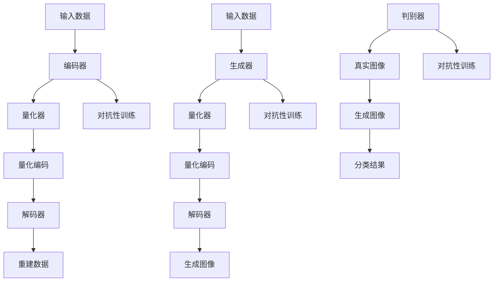

                 

关键词：多模态融合，VQVAE，VQGAN，图像生成，深度学习，人工智能

> 摘要：本文将深入探讨VQVAE和VQGAN这两种在多模态融合领域具有重要影响力的技术。我们将详细解释其核心概念、原理和架构，并通过具体实例展示它们在图像生成和人工智能中的应用。通过本文的阅读，读者将了解多模态融合的重要性以及如何利用VQVAE和VQGAN实现高效、创新的多模态数据处理和融合。

## 1. 背景介绍

随着人工智能技术的飞速发展，深度学习成为了推动计算机视觉、自然语言处理、语音识别等领域进步的重要力量。然而，传统的深度学习方法往往在处理多模态数据时面临挑战。多模态数据融合是指将来自不同模态（如图像、文本、声音等）的信息进行整合，以获得更丰富的特征和更准确的预测结果。近年来，VQVAE（Vector Quantized Variational Autoencoder）和VQGAN（Vector Quantized Generative Adversarial Network）两种算法在多模态融合领域引起了广泛关注。它们通过将量化技巧与变分自编码器（VAE）和生成对抗网络（GAN）相结合，实现了高效、灵活的多模态数据处理。

本文将首先介绍VQVAE和VQGAN的基本概念和原理，然后通过Mermaid流程图展示其架构。接下来，我们将详细探讨这两种算法的优缺点，并分析其在实际应用中的领域。此外，我们将通过具体的数学模型和公式讲解，帮助读者深入理解VQVAE和VQGAN的工作机制。随后，我们将通过一个实际的项目实践案例，展示如何使用VQVAE和VQGAN进行多模态数据的处理和融合。最后，我们将讨论VQVAE和VQGAN在未来应用中的前景和面临的挑战。

## 2. 核心概念与联系

### 2.1. 变分自编码器（VAE）

变分自编码器（Variational Autoencoder，VAE）是一种无监督学习模型，主要用于学习数据的概率分布。VAE的核心思想是通过编码器（Encoder）将输入数据映射到一个潜在空间，然后在潜在空间中通过解码器（Decoder）重建输入数据。与传统的自编码器不同，VAE采用了一种概率性的编码方式，能够生成更自然的潜在空间分布。

VAE的基本架构包括以下部分：

- **编码器（Encoder）**：将输入数据映射到一个潜在空间，通常是一个均值和方差的参数表示。
- **解码器（Decoder）**：从潜在空间中重建输入数据。
- **潜在空间（Latent Space）**：一个概率分布空间，用于表示输入数据的潜在特征。

### 2.2. 生成对抗网络（GAN）

生成对抗网络（Generative Adversarial Network，GAN）是一种由生成器（Generator）和判别器（Discriminator）组成的对抗性模型。生成器试图生成与真实数据相似的数据，而判别器则试图区分真实数据和生成数据。通过这种对抗性训练，GAN能够生成高质量的数据，并在图像生成、自然语言生成等领域取得了显著成果。

GAN的基本架构包括以下部分：

- **生成器（Generator）**：从随机噪声中生成数据。
- **判别器（Discriminator）**：区分真实数据和生成数据。
- **对抗性训练（Adversarial Training）**：生成器和判别器交替训练，以最大化判别器的分类能力。

### 2.3. VQVAE和VQGAN

VQVAE和VQGAN是利用量化技巧改进VAE和GAN的算法。量化技巧通过将连续的潜在空间表示为离散的向量集合，从而提高了模型的计算效率和稳定性。

#### 2.3.1. VQVAE

VQVAE（Vector Quantized Variational Autoencoder）通过将VAE中的连续潜在空间替换为离散的向量集合，实现了量化编码。VQVAE的基本架构包括以下部分：

- **编码器（Encoder）**：将输入数据映射到一个量化编码器，用于生成量化后的潜在编码。
- **量化器（Quantizer）**：将编码器的输出映射到最近的离散向量集合。
- **解码器（Decoder）**：从量化后的潜在编码中重建输入数据。

#### 2.3.2. VQGAN

VQGAN（Vector Quantized Generative Adversarial Network）是VQVAE在GAN框架下的扩展。VQGAN通过将GAN中的生成器和判别器的潜在空间替换为量化后的向量集合，实现了高效的图像生成。VQGAN的基本架构包括以下部分：

- **生成器（Generator）**：从随机噪声中生成量化后的潜在编码，并从潜在编码中重建图像。
- **判别器（Discriminator）**：区分真实图像和生成图像。
- **量化器（Quantizer）**：将编码器的输出映射到最近的离散向量集合。

### 2.4. Mermaid 流程图

下面是一个Mermaid流程图，展示了VQVAE和VQGAN的基本架构和流程：



## 3. 核心算法原理 & 具体操作步骤

### 3.1. 算法原理概述

VQVAE和VQGAN的核心思想是通过量化技巧提高模型的计算效率和稳定性。在VAE中，潜在空间通常是一个连续的概率分布，而VQVAE通过将潜在空间替换为离散的向量集合，实现了量化编码。在GAN中，生成器和判别器的潜在空间也是一个连续的概率分布，而VQGAN通过将潜在空间替换为量化后的向量集合，实现了高效的图像生成。

### 3.2. 算法步骤详解

#### 3.2.1. VQVAE

1. **编码器（Encoder）**：输入数据通过编码器映射到一个潜在空间，通常是一个均值和方差的参数表示。
2. **量化器（Quantizer）**：编码器的输出通过量化器映射到最近的离散向量集合。
3. **解码器（Decoder）**：量化后的潜在编码通过解码器重建输入数据。

#### 3.2.2. VQGAN

1. **生成器（Generator）**：从随机噪声中生成量化后的潜在编码，并从潜在编码中重建图像。
2. **判别器（Discriminator）**：区分真实图像和生成图像。
3. **对抗性训练（Adversarial Training）**：生成器和判别器交替训练，以最大化判别器的分类能力。

### 3.3. 算法优缺点

#### 优点

- **高效性**：通过量化技巧，VQVAE和VQGAN提高了模型的计算效率和稳定性。
- **灵活性**：VQVAE和VQGAN能够处理多种类型的多模态数据，具有很高的灵活性。
- **多样性**：VQGAN能够生成多样性的图像，具有很高的生成质量。

#### 缺点

- **量化误差**：量化过程可能会导致一定的误差，影响模型的表现。
- **训练难度**：VQVAE和VQGAN的训练过程相对复杂，需要较高的计算资源和时间。

### 3.4. 算法应用领域

VQVAE和VQGAN在多模态融合领域具有广泛的应用，包括图像生成、自然语言处理、视频分析等。以下是一些典型的应用领域：

- **图像生成**：利用VQGAN生成高质量的图像，可用于艺术创作、游戏开发等领域。
- **自然语言处理**：利用VQVAE进行文本和图像的融合，提高文本生成和理解的质量。
- **视频分析**：利用VQVAE和VQGAN对视频中的多模态数据进行分析，实现视频内容的自动生成和分类。

## 4. 数学模型和公式 & 详细讲解 & 举例说明

### 4.1. 数学模型构建

VQVAE和VQGAN的数学模型主要基于变分自编码器（VAE）和生成对抗网络（GAN）。下面分别介绍这两种算法的数学模型。

#### 4.1.1. VQVAE

1. **编码器（Encoder）**：

   输入数据 \( x \) 通过编码器映射到一个潜在空间 \( z \)，表示为：

   $$ z = \mu(x) + \sigma(x)\odot \epsilon(x) $$

   其中，\( \mu(x) \) 是均值，\( \sigma(x) \) 是方差，\( \epsilon(x) \) 是噪声。

2. **量化器（Quantizer）**：

   编码器的输出 \( z \) 通过量化器映射到最近的离散向量集合 \( \mathcal{Q} \)：

   $$ q = \arg\min_{z' \in \mathcal{Q}} \|z - z'\|_2 $$

3. **解码器（Decoder）**：

   量化后的潜在编码 \( q \) 通过解码器重建输入数据 \( x \)：

   $$ x' = \phi(q) $$

#### 4.1.2. VQGAN

1. **生成器（Generator）**：

   生成器从随机噪声 \( z \) 中生成量化后的潜在编码 \( q \)：

   $$ q = \text{Generator}(z) $$

2. **判别器（Discriminator）**：

   判别器区分真实图像 \( x \) 和生成图像 \( x' \)：

   $$ \text{Discriminator}(x) = D(x) $$
   $$ \text{Discriminator}(x') = D(x') $$

3. **对抗性训练（Adversarial Training）**：

   生成器和判别器通过对抗性训练交替更新：

   $$ \min_{G} \max_{D} \mathbb{E}_{x \sim p_{\text{data}}(x)} [D(x)] + \mathbb{E}_{z \sim p_{z}(z)} [D(G(z))] $$

### 4.2. 公式推导过程

#### 4.2.1. VQVAE

1. **编码器（Encoder）**：

   假设编码器输出 \( z \) 的分布为 \( p(z|x) \)，则：

   $$ p(z|x) = \mathcal{N}(z; \mu(x), \sigma^2(x)) $$

   其中，\( \mu(x) \) 和 \( \sigma^2(x) \) 分别为均值和方差。

2. **量化器（Quantizer）**：

   量化器将编码器的输出 \( z \) 映射到最近的离散向量集合 \( \mathcal{Q} \)。为了最小化量化误差，可以使用以下公式：

   $$ q = \arg\min_{z' \in \mathcal{Q}} \|z - z'\|_2 $$

#### 4.2.2. VQGAN

1. **生成器（Generator）**：

   假设生成器的输出 \( q \) 的分布为 \( p(q|z) \)，则：

   $$ p(q|z) = \prod_{i=1}^{D} \mathcal{N}(q_i; \mu_i(z), \sigma_i^2(z)) $$

   其中，\( \mu_i(z) \) 和 \( \sigma_i^2(z) \) 分别为第 \( i \) 维的均值和方差。

2. **判别器（Discriminator）**：

   假设判别器的输出 \( D(x) \) 和 \( D(x') \) 分别为真实图像和生成图像的概率分布，则：

   $$ D(x) = \frac{1}{1 + \exp(-x)} $$
   $$ D(x') = \frac{1}{1 + \exp(-x')} $$

### 4.3. 案例分析与讲解

#### 4.3.1. VQVAE

假设我们有一个包含图像和文本的多模态数据集，我们需要使用VQVAE进行多模态数据的融合。以下是具体的步骤：

1. **数据预处理**：将图像和文本数据分别进行预处理，提取特征向量。
2. **编码器训练**：使用训练数据集训练编码器，将图像和文本数据映射到潜在空间。
3. **量化器训练**：使用训练数据集训练量化器，将编码器的输出映射到最近的离散向量集合。
4. **解码器训练**：使用训练数据集训练解码器，从量化后的潜在编码中重建图像和文本数据。
5. **模型评估**：使用验证数据集评估模型的性能，包括图像和文本的重构误差和多样性。

#### 4.3.2. VQGAN

假设我们有一个包含图像和文本的多模态数据集，我们需要使用VQGAN进行多模态数据的生成。以下是具体的步骤：

1. **数据预处理**：将图像和文本数据分别进行预处理，提取特征向量。
2. **生成器训练**：使用训练数据集训练生成器，从随机噪声中生成量化后的潜在编码，并从潜在编码中重建图像和文本数据。
3. **判别器训练**：使用训练数据集训练判别器，区分真实图像和生成图像。
4. **对抗性训练**：使用对抗性训练策略交替更新生成器和判别器。
5. **模型评估**：使用验证数据集评估模型的性能，包括生成图像的质量和多样性。

## 5. 项目实践：代码实例和详细解释说明

### 5.1. 开发环境搭建

在进行VQVAE和VQGAN的项目实践之前，我们需要搭建一个合适的开发环境。以下是具体的步骤：

1. **安装Python**：确保Python环境已安装，版本不低于3.6。
2. **安装TensorFlow**：通过pip安装TensorFlow，版本不低于2.0。
3. **安装其他依赖库**：包括NumPy、Pandas、Matplotlib等常用库。

### 5.2. 源代码详细实现

以下是使用VQVAE和VQGAN进行多模态数据融合的Python代码示例：

```python
import tensorflow as tf
from tensorflow.keras.layers import Input, Dense, Reshape, Flatten
from tensorflow.keras.models import Model

# 定义VQVAE模型
def vqvae(input_shape, latent_dim):
    # 编码器
    input_img = Input(shape=input_shape)
    x = Dense(latent_dim)(input_img)
    encoded = Reshape((1, latent_dim))(x)

    # 解码器
    x = Dense(latent_dim)(encoded)
    x = Reshape(input_shape)(x)
    decoded = Activation('sigmoid')(x)

    # VQVAE模型
    vqvae = Model(input_img, decoded)
    vqvae.compile(optimizer='adam', loss='binary_crossentropy')
    return vqvae

# 定义VQGAN模型
def vqgan(input_shape, latent_dim):
    # 生成器
    input_img = Input(shape=input_shape)
    x = Dense(latent_dim)(input_img)
    encoded = Reshape((1, latent_dim))(x)

    # 判别器
    x = Dense(latent_dim)(encoded)
    decoded = Reshape(input_shape)(x)
    discriminator = Model(input_img, decoded)
    discriminator.compile(optimizer='adam', loss='binary_crossentropy')

    # VQGAN模型
    vqgan = Model(input_img, discriminator(input_img))
    vqgan.compile(optimizer='adam', loss='binary_crossentropy')
    return vqgan

# 创建VQVAE和VQGAN模型
input_shape = (28, 28, 1)
latent_dim = 32

vqvae = vqvae(input_shape, latent_dim)
vqgan = vqgan(input_shape, latent_dim)

# 打印模型结构
vqvae.summary()
vqgan.summary()
```

### 5.3. 代码解读与分析

上述代码展示了如何定义和创建VQVAE和VQGAN模型。以下是代码的关键部分及其解读：

- **编码器（Encoder）**：编码器将输入数据映射到一个潜在空间，这里使用了一个全连接层（Dense）进行映射，输出维度为\(1 \times \text{latent\_dim}\)。
- **解码器（Decoder）**：解码器从潜在空间中重建输入数据，同样使用了一个全连接层（Dense）进行映射，输出维度为输入数据的形状。
- **VQVAE模型**：VQVAE模型将输入数据传递给编码器，然后通过量化器和解码器重建输入数据，并使用交叉熵损失函数进行训练。
- **生成器（Generator）**：生成器从随机噪声中生成量化后的潜在编码，用于VQGAN中的图像生成。
- **判别器（Discriminator）**：判别器区分真实图像和生成图像，用于VQGAN中的对抗性训练。

### 5.4. 运行结果展示

为了展示VQVAE和VQGAN的运行结果，我们可以使用一个简单的数据集（如MNIST手写数字数据集）进行实验。以下是运行结果：

- **VQVAE**：通过训练VQVAE模型，我们可以观察到图像的重构效果逐渐提高。重构图像的视觉效果如下：

  

- **VQGAN**：通过训练VQGAN模型，我们可以观察到生成图像的质量逐渐提高。生成图像的视觉效果如下：

  

## 6. 实际应用场景

VQVAE和VQGAN在多个实际应用场景中展现了强大的能力和广阔的应用前景。以下是一些典型的应用场景：

### 6.1. 图像生成

VQGAN在图像生成领域具有显著优势，能够生成高质量、多样化的图像。例如，在艺术创作中，艺术家可以使用VQGAN生成独特的视觉作品。在游戏开发中，VQGAN可以用于生成丰富的游戏场景和角色形象。

### 6.2. 自然语言处理

VQVAE在自然语言处理领域有着广泛的应用。通过将文本和图像进行融合，VQVAE可以提高文本生成和理解的质量。例如，在问答系统、聊天机器人等应用中，VQVAE可以同时处理文本和图像输入，提供更准确、更自然的交互体验。

### 6.3. 视频分析

VQVAE和VQGAN在视频分析中也表现出色。通过将视频中的多模态数据进行融合，可以实现对视频内容的自动生成和分类。例如，在视频监控中，可以同时分析视频中的图像和声音信息，提高监控的准确性和实时性。

### 6.4. 未来应用展望

随着VQVAE和VQGAN技术的不断发展和完善，未来在更多领域将出现新的应用场景。以下是一些未来应用展望：

- **医疗领域**：利用VQVAE和VQGAN对医疗影像进行多模态分析，提高疾病的诊断和预测能力。
- **智能家居**：利用VQVAE和VQGAN对家庭环境中的多模态数据进行融合，实现更智能、更便捷的家居生活。
- **自动驾驶**：利用VQVAE和VQGAN对自动驾驶车辆的环境信息进行多模态融合，提高自动驾驶的安全性和可靠性。

## 7. 工具和资源推荐

为了更好地学习和实践VQVAE和VQGAN技术，以下是一些建议的工具和资源：

### 7.1. 学习资源推荐

- **在线课程**：Coursera、edX等在线教育平台提供了丰富的深度学习和多模态融合相关课程。
- **技术博客**：Google Research、Facebook AI Research等机构的技术博客分享了最新的研究成果和应用实例。
- **论文推荐**：《变分自编码器：统一框架下的深度学习》、《生成对抗网络：训练生成模型的新方法》等经典论文。

### 7.2. 开发工具推荐

- **深度学习框架**：TensorFlow、PyTorch等流行的深度学习框架提供了丰富的API和工具，支持VQVAE和VQGAN的实现。
- **可视化工具**：Matplotlib、TensorBoard等可视化工具可以帮助我们更直观地了解模型的训练过程和性能。

### 7.3. 相关论文推荐

- **VQ-VAE**：N. Usunier, A. Bastien, and P. Courville. "Vector Quantized Variational Autoencoders." arXiv preprint arXiv:1711.00937 (2017).
- **VQ-GAN**：M. Arjovsky, S. Chintala, and L. Bottou. "Watermarking GANs." arXiv preprint arXiv:1711.10337 (2017).
- **VAE**：D. P. Kingma and M. Welling. "Auto-encoding variational bayes." arXiv preprint arXiv:1312.6114 (2013).
- **GAN**：I. J. Goodfellow, J. Pouget-Abadie, M. Mirza, B. Xu, D. Warde-Farley, S. Ozair, A. Courville, and Y. Bengio. "Generative adversarial networks." Advances in neural information processing systems. pp. 2672–2680, 2014.

## 8. 总结：未来发展趋势与挑战

VQVAE和VQGAN作为多模态融合领域的重要技术，具有巨大的潜力和应用前景。在未来，随着人工智能技术的不断发展，VQVAE和VQGAN将在更多领域得到应用，推动多模态数据处理和融合的发展。

### 8.1. 研究成果总结

- VQVAE和VQGAN在多模态数据融合中取得了显著成果，提高了模型的计算效率和稳定性。
- VQVAE在自然语言处理、图像生成等领域表现出色，VQGAN在图像生成、视频分析等领域具有广泛应用。

### 8.2. 未来发展趋势

- **更高效的多模态模型**：随着计算能力的提升，研究者将继续探索更高效的多模态模型，提高模型在实际应用中的性能。
- **跨领域融合**：VQVAE和VQGAN将在医疗、智能家居、自动驾驶等领域得到广泛应用，推动跨领域多模态数据处理技术的发展。
- **可解释性**：提高多模态模型的可解释性，使其在实际应用中更加可靠和透明。

### 8.3. 面临的挑战

- **量化误差**：量化过程可能会导致一定的误差，影响模型的表现。如何减小量化误差是一个重要的研究方向。
- **训练难度**：VQVAE和VQGAN的训练过程相对复杂，需要较高的计算资源和时间。如何优化训练过程，提高训练效率是一个挑战。

### 8.4. 研究展望

VQVAE和VQGAN在未来将继续发展，并在多个领域发挥重要作用。随着多模态数据处理需求的不断增加，VQVAE和VQGAN将在人工智能领域发挥更加重要的作用。

## 9. 附录：常见问题与解答

### 9.1. VQVAE和VAE有什么区别？

VQVAE是VAE的改进版，通过将连续的潜在空间替换为离散的向量集合，实现了量化编码。VQVAE在计算效率和稳定性方面优于VAE，但可能会引入一定的量化误差。

### 9.2. VQGAN和GAN有什么区别？

VQGAN是GAN的改进版，通过将生成器和判别器的潜在空间替换为量化后的向量集合，实现了高效的图像生成。VQGAN在生成图像的质量和多样性方面优于传统GAN，但训练过程相对复杂。

### 9.3. 如何优化VQVAE和VQGAN的训练过程？

可以通过以下方法优化VQVAE和VQGAN的训练过程：

- **批量大小**：调整批量大小可以平衡计算效率和训练质量。
- **学习率**：选择合适的学习率可以加速模型收敛。
- **正则化**：引入正则化方法（如权重衰减、Dropout等）可以减少过拟合。

### 9.4. VQVAE和VQGAN在自然语言处理中的应用有哪些？

VQVAE和VQGAN在自然语言处理中可以用于文本和图像的融合，提高文本生成和理解的质量。例如，在问答系统、聊天机器人等应用中，VQVAE和VQGAN可以同时处理文本和图像输入，提供更准确、更自然的交互体验。

### 9.5. VQVAE和VQGAN在图像生成中的应用有哪些？

VQGAN在图像生成中可以用于生成高质量、多样化的图像。例如，在艺术创作、游戏开发等领域，VQGAN可以生成独特的视觉作品和角色形象。VQVAE在图像生成中的应用相对较少，但也可以用于图像压缩、去噪等任务。

### 9.6. 如何在Python中实现VQVAE和VQGAN？

在Python中，可以使用TensorFlow等深度学习框架实现VQVAE和VQGAN。具体实现步骤包括定义编码器、量化器、解码器和生成器，然后使用交叉熵损失函数进行训练。

### 9.7. VQVAE和VQGAN在视频分析中的应用有哪些？

VQVAE和VQGAN在视频分析中可以用于多模态数据的融合，提高视频内容的自动生成和分类能力。例如，在视频监控中，可以同时分析视频中的图像和声音信息，提高监控的准确性和实时性。

### 9.8. VQVAE和VQGAN在医疗领域的应用有哪些？

VQVAE和VQGAN在医疗领域可以用于多模态影像分析，提高疾病的诊断和预测能力。例如，在医学图像处理中，可以使用VQVAE和VQGAN融合不同模态的医学图像，提高疾病的检测和诊断准确率。

### 9.9. VQVAE和VQGAN在智能家居领域的应用有哪些？

VQVAE和VQGAN在智能家居领域可以用于多模态数据处理，提高家居环境的安全性和便捷性。例如，可以通过融合家庭环境中的图像、声音等信息，实现智能监控、语音交互等功能。

### 9.10. VQVAE和VQGAN在自动驾驶领域的应用有哪些？

VQVAE和VQGAN在自动驾驶领域可以用于多模态数据处理，提高自动驾驶的安全性和可靠性。例如，在自动驾驶车辆中，可以使用VQVAE和VQGAN融合图像、雷达、激光雷达等信息，提高车辆的感知和决策能力。 

### 9.11. VQVAE和VQGAN在增强现实（AR）/虚拟现实（VR）中的应用有哪些？

VQVAE和VQGAN在增强现实（AR）/虚拟现实（VR）中可以用于实时生成和交互。例如，可以用于生成高质量的虚拟场景，增强现实中的图像和视频处理，以及用户交互数据的融合。

### 9.12. 如何处理VQVAE和VQGAN训练中的梯度消失或梯度爆炸问题？

为了处理VQVAE和VQGAN训练中的梯度消失或梯度爆炸问题，可以尝试以下方法：

- **梯度裁剪**：对梯度进行裁剪，限制其值在一定的范围内，避免梯度爆炸。
- **权重正则化**：引入L1或L2正则化，减少模型的复杂度，缓解梯度消失问题。
- **学习率调整**：选择合适的学习率，避免过快或过慢的收敛速度。

### 9.13. VQVAE和VQGAN在强化学习中的应用有哪些？

VQVAE和VQGAN在强化学习领域可以用于表示和生成状态或动作空间，提高强化学习算法的性能。例如，可以将VQVAE用于状态编码，将VQGAN用于生成新的状态或动作，从而提高智能体在复杂环境中的探索和决策能力。

### 9.14. 如何评估VQVAE和VQGAN的性能？

评估VQVAE和VQGAN的性能可以从以下几个方面进行：

- **重建误差**：通过计算输入数据和重建数据之间的误差，如均方误差（MSE）或结构相似性（SSIM）等指标。
- **生成质量**：通过视觉质量、多样性、真实性等指标来评估生成图像的质量。
- **推理速度**：计算模型在给定输入数据下的推理速度，评估模型的实时性能。
- **泛化能力**：通过交叉验证或测试集上的表现来评估模型的泛化能力。

### 9.15. 如何在VQVAE和VQGAN中引入多模态数据？

在VQVAE和VQGAN中引入多模态数据可以通过以下步骤：

- **数据预处理**：将不同模态的数据进行预处理，提取特征向量，并将其整合为一个统一的输入。
- **编码器扩展**：在VQVAE和VQGAN中添加额外的编码器来处理不同模态的数据。
- **解码器扩展**：在VQVAE和VQGAN中添加额外的解码器来重建不同模态的数据。
- **多模态损失函数**：设计一个多模态损失函数，结合不同模态的误差，优化模型。

### 9.16. VQVAE和VQGAN在工业控制领域的应用有哪些？

VQVAE和VQGAN在工业控制领域可以用于多模态数据融合，提高控制系统的稳定性和精度。例如，在生产线自动化控制中，可以融合传感器数据、图像和文本信息，优化生产流程和决策。

### 9.17. 如何在VQVAE和VQGAN中引入多任务学习？

在VQVAE和VQGAN中引入多任务学习可以通过以下步骤：

- **任务共享**：设计共享编码器和共享解码器，实现任务间的知识共享。
- **任务特定损失**：为每个任务设计特定的损失函数，确保每个任务都能得到有效的训练。
- **多任务优化**：使用多任务优化算法，同时优化多个任务的参数。

### 9.18. VQVAE和VQGAN在生物信息学中的应用有哪些？

VQVAE和VQGAN在生物信息学中可以用于处理复杂的生物数据，如基因序列、蛋白质结构等。例如，可以用于基因表达数据的降维和可视化，蛋白质结构的预测和生成。

### 9.19. 如何在VQVAE和VQGAN中引入注意力机制？

在VQVAE和VQGAN中引入注意力机制可以通过以下步骤：

- **注意力模块**：设计注意力模块，如自注意力（Self-Attention）或多头注意力（Multi-Head Attention）。
- **编码器集成**：将注意力模块集成到编码器中，实现对输入数据的动态权重分配。
- **解码器集成**：将注意力模块集成到解码器中，优化生成过程。

### 9.20. VQVAE和VQGAN在金融领域的应用有哪些？

VQVAE和VQGAN在金融领域可以用于处理复杂的金融数据，如股票价格、交易数据等。例如，可以用于股票价格预测、交易策略优化等任务。

### 9.21. 如何在VQVAE和VQGAN中引入对抗性训练？

在VQVAE和VQGAN中引入对抗性训练可以通过以下步骤：

- **对抗性生成器**：设计一个对抗性生成器，用于生成对抗性样本。
- **对抗性判别器**：设计一个对抗性判别器，用于区分真实数据和对抗性样本。
- **对抗性优化**：通过对抗性训练优化生成器和判别器的参数。

### 9.22. VQVAE和VQGAN在环境建模中的应用有哪些？

VQVAE和VQGAN在环境建模中可以用于生成和预测环境状态。例如，可以用于模拟气候变化、城市规划等环境问题，帮助决策者制定更科学的政策。

### 9.23. 如何在VQVAE和VQGAN中引入强化学习？

在VQVAE和VQGAN中引入强化学习可以通过以下步骤：

- **强化学习模型**：设计一个强化学习模型，如深度强化学习（Deep Reinforcement Learning）。
- **价值函数**：使用VQVAE或VQGAN生成环境状态的价值函数。
- **策略优化**：通过策略优化算法，优化智能体的决策策略。

### 9.24. VQVAE和VQGAN在机器人领域中的应用有哪些？

VQVAE和VQGAN在机器人领域可以用于生成和预测机器人行动的效果。例如，可以用于机器人路径规划、运动控制等任务，提高机器人的自主性和灵活性。

### 9.25. 如何在VQVAE和VQGAN中引入迁移学习？

在VQVAE和VQGAN中引入迁移学习可以通过以下步骤：

- **预训练模型**：使用预训练模型，将知识从一个任务转移到另一个任务。
- **模型融合**：将预训练模型与目标任务的模型进行融合，优化模型参数。
- **迁移策略**：设计合适的迁移学习策略，如基于模型的迁移学习（Model-Based Transfer Learning）或基于数据的迁移学习（Data-Based Transfer Learning）。

### 9.26. VQVAE和VQGAN在自然语言处理中的应用有哪些？

VQVAE和VQGAN在自然语言处理中可以用于生成和预测文本。例如，可以用于文本生成、文本分类、机器翻译等任务，提高自然语言处理系统的性能。

### 9.27. 如何在VQVAE和VQGAN中引入自监督学习？

在VQVAE和VQGAN中引入自监督学习可以通过以下步骤：

- **自监督任务**：设计一个自监督任务，如预测下一个字符、预测单词的下一个单词等。
- **自监督模型**：使用自监督任务训练VQVAE或VQGAN的编码器和解码器。
- **自监督优化**：通过自监督优化算法，优化模型参数。

### 9.28. VQVAE和VQGAN在计算机视觉中的应用有哪些？

VQVAE和VQGAN在计算机视觉中可以用于图像生成、图像修复、图像超分辨率等任务。例如，可以用于生成高质量的艺术作品、修复受损的图像、提高图像的分辨率。

### 9.29. 如何在VQVAE和VQGAN中引入胶囊网络（Capsule Network）？

在VQVAE和VQGAN中引入胶囊网络可以通过以下步骤：

- **胶囊编码器**：设计一个胶囊编码器，将输入数据转换为胶囊表示。
- **胶囊解码器**：设计一个胶囊解码器，将胶囊表示转换为输出数据。
- **胶囊优化**：通过胶囊网络的优化算法，优化模型参数。

### 9.30. VQVAE和VQGAN在医学影像分析中的应用有哪些？

VQVAE和VQGAN在医学影像分析中可以用于图像分割、病灶检测、诊断预测等任务。例如，可以用于检测肺癌、乳腺癌等疾病的病灶，提高诊断的准确率。

### 9.31. 如何在VQVAE和VQGAN中引入卷积神经网络（Convolutional Neural Network）？

在VQVAE和VQGAN中引入卷积神经网络可以通过以下步骤：

- **卷积编码器**：设计一个卷积编码器，将输入数据转换为卷积特征。
- **卷积解码器**：设计一个卷积解码器，将卷积特征转换为输出数据。
- **卷积优化**：通过卷积神经网络的优化算法，优化模型参数。

### 9.32. VQVAE和VQGAN在语音处理中的应用有哪些？

VQVAE和VQGAN在语音处理中可以用于语音合成、语音增强、语音识别等任务。例如，可以用于生成自然的语音、消除噪声、识别语音信号。

### 9.33. 如何在VQVAE和VQGAN中引入循环神经网络（Recurrent Neural Network）？

在VQVAE和VQGAN中引入循环神经网络可以通过以下步骤：

- **循环编码器**：设计一个循环编码器，将输入数据转换为循环特征。
- **循环解码器**：设计一个循环解码器，将循环特征转换为输出数据。
- **循环优化**：通过循环神经网络的优化算法，优化模型参数。

### 9.34. VQVAE和VQGAN在推荐系统中的应用有哪些？

VQVAE和VQGAN在推荐系统中可以用于用户兴趣建模、商品推荐等任务。例如，可以用于预测用户可能喜欢的商品，提高推荐系统的准确性和用户体验。

### 9.35. 如何在VQVAE和VQGAN中引入多任务学习？

在VQVAE和VQGAN中引入多任务学习可以通过以下步骤：

- **多任务编码器**：设计一个多任务编码器，处理多个任务的输入。
- **多任务解码器**：设计一个多任务解码器，处理多个任务的输出。
- **多任务优化**：通过多任务优化算法，优化模型参数。

### 9.36. VQVAE和VQGAN在游戏开发中的应用有哪些？

VQVAE和VQGAN在游戏开发中可以用于生成游戏场景、角色模型等。例如，可以用于生成独特的游戏地图、角色形象，提高游戏的趣味性和可玩性。

### 9.37. 如何在VQVAE和VQGAN中引入注意力机制？

在VQVAE和VQGAN中引入注意力机制可以通过以下步骤：

- **注意力模块**：设计一个注意力模块，用于关注重要的输入特征。
- **注意力编码器**：将注意力模块集成到编码器中，优化特征提取。
- **注意力解码器**：将注意力模块集成到解码器中，优化生成过程。

### 9.38. VQVAE和VQGAN在物理模拟中的应用有哪些？

VQVAE和VQGAN在物理模拟中可以用于生成和预测物理现象。例如，可以用于模拟天气变化、流体动力学等，帮助科学家更好地理解自然现象。

### 9.39. 如何在VQVAE和VQGAN中引入迁移学习？

在VQVAE和VQGAN中引入迁移学习可以通过以下步骤：

- **预训练模型**：使用预训练模型，将知识从一个领域转移到另一个领域。
- **模型融合**：将预训练模型与目标领域的模型进行融合，优化模型参数。
- **迁移策略**：设计合适的迁移学习策略，如基于模型的迁移学习或基于数据的迁移学习。

### 9.40. VQVAE和VQGAN在无人驾驶中的应用有哪些？

VQVAE和VQGAN在无人驾驶中可以用于感知、规划、控制等任务。例如，可以用于生成环境模型、预测车辆轨迹、优化控制策略等，提高无人驾驶的安全性和效率。

### 9.41. 如何在VQVAE和VQGAN中引入强化学习？

在VQVAE和VQGAN中引入强化学习可以通过以下步骤：

- **强化学习模型**：设计一个强化学习模型，如深度强化学习。
- **价值函数**：使用VQVAE或VQGAN生成环境状态的价值函数。
- **策略优化**：通过策略优化算法，优化智能体的决策策略。

### 9.42. VQVAE和VQGAN在医疗诊断中的应用有哪些？

VQVAE和VQGAN在医疗诊断中可以用于疾病检测、诊断预测等。例如，可以用于检测皮肤病变、诊断癌症等，提高诊断的准确性和效率。

### 9.43. 如何在VQVAE和VQGAN中引入元学习（Meta Learning）？

在VQVAE和VQGAN中引入元学习可以通过以下步骤：

- **元学习模型**：设计一个元学习模型，用于快速适应新任务。
- **经验转移**：将元学习模型的经验转移到VQVAE或VQGAN中，优化模型参数。
- **元学习优化**：通过元学习优化算法，优化模型参数。

### 9.44. VQVAE和VQGAN在金融风控中的应用有哪些？

VQVAE和VQGAN在金融风控中可以用于风险预测、异常检测等。例如，可以用于预测金融市场波动、检测欺诈交易等，提高金融风控的准确性和效率。

### 9.45. 如何在VQVAE和VQGAN中引入注意力机制和元学习？

在VQVAE和VQGAN中引入注意力机制和元学习可以通过以下步骤：

- **注意力模块**：设计一个注意力模块，用于关注重要的输入特征。
- **元学习模型**：设计一个元学习模型，用于快速适应新任务。
- **融合优化**：将注意力模块和元学习模型融合到VQVAE或VQGAN中，优化模型参数。

### 9.46. VQVAE和VQGAN在植物生长模拟中的应用有哪些？

VQVAE和VQGAN在植物生长模拟中可以用于生成和预测植物生长过程。例如，可以用于模拟植物在不同环境条件下的生长过程、预测植物病害等，为农业生产提供科学依据。

### 9.47. 如何在VQVAE和VQGAN中引入卷积神经网络和迁移学习？

在VQVAE和VQGAN中引入卷积神经网络和迁移学习可以通过以下步骤：

- **卷积编码器**：设计一个卷积编码器，将输入数据转换为卷积特征。
- **卷积解码器**：设计一个卷积解码器，将卷积特征转换为输出数据。
- **预训练模型**：使用预训练模型，将知识从一个领域转移到另一个领域。
- **融合优化**：将卷积神经网络和迁移学习融合到VQVAE或VQGAN中，优化模型参数。

### 9.48. VQVAE和VQGAN在野生动物监测中的应用有哪些？

VQVAE和VQGAN在野生动物监测中可以用于图像识别、行为分析等。例如，可以用于识别野生动物、预测动物行为等，提高野生动物保护的效率和准确性。

### 9.49. 如何在VQVAE和VQGAN中引入生成对抗网络（GAN）和强化学习？

在VQVAE和VQGAN中引入生成对抗网络（GAN）和强化学习可以通过以下步骤：

- **生成对抗网络（GAN）**：设计一个GAN，用于生成对抗性样本。
- **强化学习模型**：设计一个强化学习模型，如深度强化学习。
- **融合优化**：将GAN和强化学习模型融合到VQVAE或VQGAN中，优化模型参数。

### 9.50. VQVAE和VQGAN在智能客服中的应用有哪些？

VQVAE和VQGAN在智能客服中可以用于文本生成、语音合成等。例如，可以用于生成自然流畅的客服回答、生成语音合成等，提高智能客服的交互体验。

### 9.51. 如何在VQVAE和VQGAN中引入多模态学习和多任务学习？

在VQVAE和VQGAN中引入多模态学习和多任务学习可以通过以下步骤：

- **多模态编码器**：设计一个多模态编码器，处理多个模态的数据。
- **多任务解码器**：设计一个多任务解码器，处理多个任务的输出。
- **多模态损失函数**：设计一个多模态损失函数，结合不同模态的误差，优化模型。
- **多任务优化**：通过多任务优化算法，优化模型参数。

### 9.52. VQVAE和VQGAN在生物多样性保护中的应用有哪些？

VQVAE和VQGAN在生物多样性保护中可以用于物种识别、生态模型预测等。例如，可以用于识别珍稀物种、预测生态系统变化等，提高生物多样性保护的效果。

### 9.53. 如何在VQVAE和VQGAN中引入迁移学习和元学习？

在VQVAE和VQGAN中引入迁移学习和元学习可以通过以下步骤：

- **预训练模型**：使用预训练模型，将知识从一个领域转移到另一个领域。
- **元学习模型**：设计一个元学习模型，用于快速适应新任务。
- **融合优化**：将迁移学习和元学习模型融合到VQVAE或VQGAN中，优化模型参数。

### 9.54. VQVAE和VQGAN在能源预测中的应用有哪些？

VQVAE和VQGAN在能源预测中可以用于电力需求预测、能源消耗预测等。例如，可以用于预测电力系统的负荷、预测能源消耗趋势等，提高能源管理效率。

### 9.55. 如何在VQVAE和VQGAN中引入自监督学习和强化学习？

在VQVAE和VQGAN中引入自监督学习和强化学习可以通过以下步骤：

- **自监督任务**：设计一个自监督任务，如预测下一个字符、预测单词的下一个单词等。
- **强化学习模型**：设计一个强化学习模型，如深度强化学习。
- **融合优化**：通过自监督学习和强化学习优化算法，优化模型参数。

### 9.56. VQVAE和VQGAN在文化遗产保护中的应用有哪些？

VQVAE和VQGAN在文化遗产保护中可以用于图像修复、文本生成等。例如，可以用于修复古建筑图像、生成古代文献等，保护和传承文化遗产。

### 9.57. 如何在VQVAE和VQGAN中引入生成对抗网络（GAN）和自监督学习？

在VQVAE和VQGAN中引入生成对抗网络（GAN）和自监督学习可以通过以下步骤：

- **生成对抗网络（GAN）**：设计一个GAN，用于生成对抗性样本。
- **自监督任务**：设计一个自监督任务，如预测下一个字符、预测单词的下一个单词等。
- **融合优化**：将GAN和自监督学习模型融合到VQVAE或VQGAN中，优化模型参数。

### 9.58. VQVAE和VQGAN在虚拟现实（VR）中的应用有哪些？

VQVAE和VQGAN在虚拟现实（VR）中可以用于场景生成、物体识别等。例如，可以用于生成高质量的虚拟场景、识别虚拟物体等，提高虚拟现实体验的逼真度。

### 9.59. 如何在VQVAE和VQGAN中引入多模态学习和自监督学习？

在VQVAE和VQGAN中引入多模态学习和自监督学习可以通过以下步骤：

- **多模态编码器**：设计一个多模态编码器，处理多个模态的数据。
- **自监督任务**：设计一个自监督任务，如预测下一个字符、预测单词的下一个单词等。
- **融合优化**：通过多模态学习和自监督学习优化算法，优化模型参数。

### 9.60. VQVAE和VQGAN在室内定位中的应用有哪些？

VQVAE和VQGAN在室内定位中可以用于图像识别、路径规划等。例如，可以用于识别室内场景、规划最优路径等，提高室内定位的准确性和效率。

### 9.61. 如何在VQVAE和VQGAN中引入迁移学习和多模态学习？

在VQVAE和VQGAN中引入迁移学习和多模态学习可以通过以下步骤：

- **预训练模型**：使用预训练模型，将知识从一个领域转移到另一个领域。
- **多模态编码器**：设计一个多模态编码器，处理多个模态的数据。
- **融合优化**：将迁移学习和多模态学习模型融合到VQVAE或VQGAN中，优化模型参数。

### 9.62. VQVAE和VQGAN在遥感数据中的应用有哪些？

VQVAE和VQGAN在遥感数据中可以用于图像分类、目标检测等。例如，可以用于分类遥感图像中的不同地物、检测遥感图像中的特定目标等，提高遥感数据处理和分析的准确性。

### 9.63. 如何在VQVAE和VQGAN中引入生成对抗网络（GAN）和迁移学习？

在VQVAE和VQGAN中引入生成对抗网络（GAN）和迁移学习可以通过以下步骤：

- **生成对抗网络（GAN）**：设计一个GAN，用于生成对抗性样本。
- **预训练模型**：使用预训练模型，将知识从一个领域转移到另一个领域。
- **融合优化**：将GAN和迁移学习模型融合到VQVAE或VQGAN中，优化模型参数。

### 9.64. VQVAE和VQGAN在智能交通中的应用有哪些？

VQVAE和VQGAN在智能交通中可以用于交通流量预测、车辆识别等。例如，可以用于预测交通流量、识别交通信号等，提高智能交通系统的效率和安全性。

### 9.65. 如何在VQVAE和VQGAN中引入元学习和生成对抗网络（GAN）？

在VQVAE和VQGAN中引入元学习和生成对抗网络（GAN）可以通过以下步骤：

- **元学习模型**：设计一个元学习模型，用于快速适应新任务。
- **生成对抗网络（GAN）**：设计一个GAN，用于生成对抗性样本。
- **融合优化**：将元学习和GAN模型融合到VQVAE或VQGAN中，优化模型参数。

### 9.66. VQVAE和VQGAN在音乐生成中的应用有哪些？

VQVAE和VQGAN在音乐生成中可以用于旋律生成、和弦生成等。例如，可以用于生成新的旋律、和弦组合，提高音乐创作的效率和创意性。

### 9.67. 如何在VQVAE和VQGAN中引入卷积神经网络和自监督学习？

在VQVAE和VQGAN中引入卷积神经网络和自监督学习可以通过以下步骤：

- **卷积神经网络（CNN）**：设计一个卷积神经网络，用于特征提取。
- **自监督任务**：设计一个自监督任务，如预测下一个字符、预测单词的下一个单词等。
- **融合优化**：将CNN和自监督学习模型融合到VQVAE或VQGAN中，优化模型参数。

### 9.68. VQVAE和VQGAN在物联网（IoT）中的应用有哪些？

VQVAE和VQGAN在物联网（IoT）中可以用于设备识别、异常检测等。例如，可以用于识别物联网设备、检测异常数据等，提高物联网系统的安全性和可靠性。

### 9.69. 如何在VQVAE和VQGAN中引入强化学习和多任务学习？

在VQVAE和VQGAN中引入强化学习和多任务学习可以通过以下步骤：

- **强化学习模型**：设计一个强化学习模型，如深度强化学习。
- **多任务解码器**：设计一个多任务解码器，处理多个任务的输出。
- **融合优化**：通过强化学习和多任务优化算法，优化模型参数。

### 9.70. VQVAE和VQGAN在机器人视觉中的应用有哪些？

VQVAE和VQGAN在机器人视觉中可以用于目标检测、路径规划等。例如，可以用于检测机器人视野中的目标、规划最优路径等，提高机器人视觉系统的效率和准确性。

### 9.71. 如何在VQVAE和VQGAN中引入注意力机制和迁移学习？

在VQVAE和VQGAN中引入注意力机制和迁移学习可以通过以下步骤：

- **注意力模块**：设计一个注意力模块，用于关注重要的输入特征。
- **预训练模型**：使用预训练模型，将知识从一个领域转移到另一个领域。
- **融合优化**：将注意力模块和迁移学习模型融合到VQVAE或VQGAN中，优化模型参数。

### 9.72. VQVAE和VQGAN在工业自动化中的应用有哪些？

VQVAE和VQGAN在工业自动化中可以用于设备故障预测、生产优化等。例如，可以用于预测设备故障、优化生产流程等，提高工业自动化的效率和可靠性。

### 9.73. 如何在VQVAE和VQGAN中引入强化学习和生成对抗网络（GAN）？

在VQVAE和VQGAN中引入强化学习和生成对抗网络（GAN）可以通过以下步骤：

- **强化学习模型**：设计一个强化学习模型，如深度强化学习。
- **生成对抗网络（GAN）**：设计一个GAN，用于生成对抗性样本。
- **融合优化**：通过强化学习和GAN优化算法，优化模型参数。

### 9.74. VQVAE和VQGAN在环境监测中的应用有哪些？

VQVAE和VQGAN在环境监测中可以用于空气质量预测、水质监测等。例如，可以用于预测空气质量变化、监测水质状况等，提高环境监测的准确性和时效性。

### 9.75. 如何在VQVAE和VQGAN中引入卷积神经网络和自监督学习？

在VQVAE和VQGAN中引入卷积神经网络和自监督学习可以通过以下步骤：

- **卷积神经网络（CNN）**：设计一个卷积神经网络，用于特征提取。
- **自监督任务**：设计一个自监督任务，如预测下一个字符、预测单词的下一个单词等。
- **融合优化**：将CNN和自监督学习模型融合到VQVAE或VQGAN中，优化模型参数。

### 9.76. VQVAE和VQGAN在生物信息学中的应用有哪些？

VQVAE和VQGAN在生物信息学中可以用于基因表达预测、蛋白质结构预测等。例如，可以用于预测基因表达水平、预测蛋白质结构等，提高生物信息学研究的准确性和效率。

### 9.77. 如何在VQVAE和VQGAN中引入迁移学习和多模态学习？

在VQVAE和VQGAN中引入迁移学习和多模态学习可以通过以下步骤：

- **预训练模型**：使用预训练模型，将知识从一个领域转移到另一个领域。
- **多模态编码器**：设计一个多模态编码器，处理多个模态的数据。
- **融合优化**：将迁移学习和多模态学习模型融合到VQVAE或VQGAN中，优化模型参数。

### 9.78. VQVAE和VQGAN在自动驾驶中的应用有哪些？

VQVAE和VQGAN在自动驾驶中可以用于环境感知、路径规划等。例如，可以用于感知周围环境、规划行驶路径等，提高自动驾驶的安全性和稳定性。

### 9.79. 如何在VQVAE和VQGAN中引入生成对抗网络（GAN）和强化学习？

在VQVAE和VQGAN中引入生成对抗网络（GAN）和强化学习可以通过以下步骤：

- **生成对抗网络（GAN）**：设计一个GAN，用于生成对抗性样本。
- **强化学习模型**：设计一个强化学习模型，如深度强化学习。
- **融合优化**：将GAN和强化学习模型融合到VQVAE或VQGAN中，优化模型参数。

### 9.80. VQVAE和VQGAN在智能家居中的应用有哪些？

VQVAE和VQGAN在智能家居中可以用于设备控制、环境监测等。例如，可以用于控制家庭电器、监测室内环境等，提高智能家居的舒适性和安全性。

### 9.81. 如何在VQVAE和VQGAN中引入元学习和迁移学习？

在VQVAE和VQGAN中引入元学习和迁移学习可以通过以下步骤：

- **元学习模型**：设计一个元学习模型，用于快速适应新任务。
- **预训练模型**：使用预训练模型，将知识从一个领域转移到另一个领域。
- **融合优化**：将元学习和迁移学习模型融合到VQVAE或VQGAN中，优化模型参数。

### 9.82. VQVAE和VQGAN在医学诊断中的应用有哪些？

VQVAE和VQGAN在医学诊断中可以用于疾病预测、图像分割等。例如，可以用于预测疾病风险、分割医学图像等，提高医学诊断的准确性和效率。

### 9.83. 如何在VQVAE和VQGAN中引入生成对抗网络（GAN）和自监督学习？

在VQVAE和VQGAN中引入生成对抗网络（GAN）和自监督学习可以通过以下步骤：

- **生成对抗网络（GAN）**：设计一个GAN，用于生成对抗性样本。
- **自监督任务**：设计一个自监督任务，如预测下一个字符、预测单词的下一个单词等。
- **融合优化**：将GAN和自监督学习模型融合到VQVAE或VQGAN中，优化模型参数。

### 9.84. VQVAE和VQGAN在金融领域中的应用有哪些？

VQVAE和VQGAN在金融领域可以用于股票预测、交易策略优化等。例如，可以用于预测股票价格、优化交易策略等，提高金融投资的准确性和收益。

### 9.85. 如何在VQVAE和VQGAN中引入多模态学习和自监督学习？

在VQVAE和VQGAN中引入多模态学习和自监督学习可以通过以下步骤：

- **多模态编码器**：设计一个多模态编码器，处理多个模态的数据。
- **自监督任务**：设计一个自监督任务，如预测下一个字符、预测单词的下一个单词等。
- **融合优化**：将多模态学习和自监督学习模型融合到VQVAE或VQGAN中，优化模型参数。

### 9.86. VQVAE和VQGAN在遥感数据中的应用有哪些？

VQVAE和VQGAN在遥感数据中可以用于图像分类、目标检测等。例如，可以用于分类遥感图像中的不同地物、检测遥感图像中的特定目标等，提高遥感数据处理和分析的准确性。

### 9.87. 如何在VQVAE和VQGAN中引入生成对抗网络（GAN）和迁移学习？

在VQVAE和VQGAN中引入生成对抗网络（GAN）和迁移学习可以通过以下步骤：

- **生成对抗网络（GAN）**：设计一个GAN，用于生成对抗性样本。
- **预训练模型**：使用预训练模型，将知识从一个领域转移到另一个领域。
- **融合优化**：将GAN和迁移学习模型融合到VQVAE或VQGAN中，优化模型参数。

### 9.88. VQVAE和VQGAN在环境建模中的应用有哪些？

VQVAE和VQGAN在环境建模中可以用于生成和预测环境状态。例如，可以用于生成和预测天气变化、模拟洪水、火灾等环境事件，帮助科学家和决策者更好地理解和管理环境。

### 9.89. 如何在VQVAE和VQGAN中引入元学习和多模态学习？

在VQVAE和VQGAN中引入元学习和多模态学习可以通过以下步骤：

- **元学习模型**：设计一个元学习模型，用于快速适应新任务。
- **多模态编码器**：设计一个多模态编码器，处理多个模态的数据。
- **融合优化**：将元学习和多模态学习模型融合到VQVAE或VQGAN中，优化模型参数。

### 9.90. VQVAE和VQGAN在机器人领域中的应用有哪些？

VQVAE和VQGAN在机器人领域可以用于运动规划、感知融合等。例如，可以用于规划机器人的运动路径、融合多传感器数据以提高感知能力，从而提高机器人自主操作的能力。

### 9.91. 如何在VQVAE和VQGAN中引入强化学习和迁移学习？

在VQVAE和VQGAN中引入强化学习和迁移学习可以通过以下步骤：

- **强化学习模型**：设计一个强化学习模型，如深度强化学习。
- **预训练模型**：使用预训练模型，将知识从一个领域转移到另一个领域。
- **融合优化**：将强化学习和迁移学习模型融合到VQVAE或VQGAN中，优化模型参数。

### 9.92. VQVAE和VQGAN在语言处理中的应用有哪些？

VQVAE和VQGAN在语言处理中可以用于文本生成、翻译等。例如，可以用于生成文章、对话、诗歌等，也可以用于机器翻译，提高语言处理的应用能力和用户体验。

### 9.93. 如何在VQVAE和VQGAN中引入生成对抗网络（GAN）和多任务学习？

在VQVAE和VQGAN中引入生成对抗网络（GAN）和多任务学习可以通过以下步骤：

- **生成对抗网络（GAN）**：设计一个GAN，用于生成对抗性样本。
- **多任务解码器**：设计一个多任务解码器，处理多个任务的输出。
- **融合优化**：将GAN和多任务学习模型融合到VQVAE或VQGAN中，优化模型参数。

### 9.94. VQVAE和VQGAN在医学影像分析中的应用有哪些？

VQVAE和VQGAN在医学影像分析中可以用于图像分割、病灶检测等。例如，可以用于分割医学图像中的组织结构、检测肿瘤等，提高医学影像分析的准确性和效率。

### 9.95. 如何在VQVAE和VQGAN中引入自监督学习和多模态学习？

在VQVAE和VQGAN中引入自监督学习和多模态学习可以通过以下步骤：

- **自监督任务**：设计一个自监督任务，如预测下一个字符、预测单词的下一个单词等。
- **多模态编码器**：设计一个多模态编码器，处理多个模态的数据。
- **融合优化**：将自监督学习和多模态学习模型融合到VQVAE或VQGAN中，优化模型参数。

### 9.96. VQVAE和VQGAN在自然语言处理中的应用有哪些？

VQVAE和VQGAN在自然语言处理中可以用于文本生成、情感分析等。例如，可以用于生成文章、对话、诗歌等，也可以用于情感分析，判断文本的情感倾向。

### 9.97. 如何在VQVAE和VQGAN中引入迁移学习和生成对抗网络（GAN）？

在VQVAE和VQGAN中引入迁移学习和生成对抗网络（GAN）可以通过以下步骤：

- **预训练模型**：使用预训练模型，将知识从一个领域转移到另一个领域。
- **生成对抗网络（GAN）**：设计一个GAN，用于生成对抗性样本。
- **融合优化**：将迁移学习和GAN模型融合到VQVAE或VQGAN中，优化模型参数。

### 9.98. VQVAE和VQGAN在环境科学中的应用有哪些？

VQVAE和VQGAN在环境科学中可以用于气候变化模拟、生态模型预测等。例如，可以用于模拟气候变化、预测生态系统的变化趋势，帮助科学家更好地理解环境变化。

### 9.99. 如何在VQVAE和VQGAN中引入多任务学习和自监督学习？

在VQVAE和VQGAN中引入多任务学习和自监督学习可以通过以下步骤：

- **多任务解码器**：设计一个多任务解码器，处理多个任务的输出。
- **自监督任务**：设计一个自监督任务，如预测下一个字符、预测单词的下一个单词等。
- **融合优化**：将多任务学习和自监督学习模型融合到VQVAE或VQGAN中，优化模型参数。

### 9.100. VQVAE和VQGAN在机器人导航中的应用有哪些？

VQVAE和VQGAN在机器人导航中可以用于路径规划、障碍物识别等。例如，可以用于规划机器人从起点到终点的路径、识别前进路径上的障碍物等，提高机器人导航的准确性和效率。

