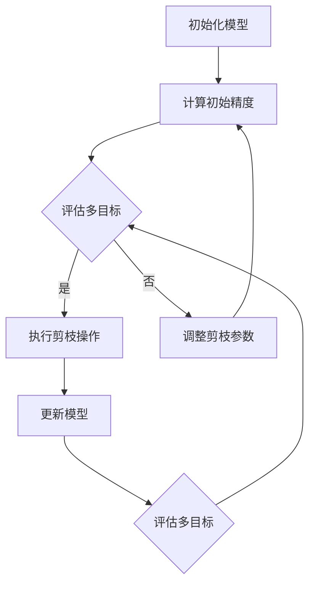

                 

### 关键词 Keywords
多目标优化，神经网络剪枝，算法效率，能耗优化，模型压缩。

### 摘要 Abstract
本文探讨了多目标剪枝技术在现代人工智能应用中的重要性。通过对核心概念的深入分析，算法原理的详细阐述，以及数学模型和公式的推导，本文旨在提供一种平衡模型精度、速度和能耗的技术方案。同时，通过实际项目实践中的代码实例和详细解释，展示如何将这一技术应用于实际问题中。文章最后探讨了该技术在各种实际应用场景中的前景，以及未来可能面临的发展趋势和挑战。

### 1. 背景介绍

随着深度学习技术的飞速发展，神经网络在图像识别、自然语言处理、推荐系统等领域展现出了前所未有的效能。然而，深度神经网络模型往往具有庞大的参数量和计算量，这不仅增加了训练时间，还导致了大量的能源消耗和硬件资源的占用。因此，如何在保证模型精度的同时，提高训练速度、降低能耗、减小模型大小，成为人工智能领域亟待解决的关键问题。

传统的方法如模型压缩、量化、蒸馏等，虽然在某个方面有所突破，但往往难以在多目标间取得平衡。多目标剪枝技术作为一种新兴的方法，通过同时优化模型的精度、速度和能耗，为解决这一问题提供了新的思路。本文将围绕多目标剪枝技术，深入探讨其核心概念、算法原理、数学模型，并通过实际项目实践，分析其在各种应用场景中的效果和前景。

### 2. 核心概念与联系

#### 2.1 剪枝概念

剪枝（Pruning）是一种常见的神经网络优化技术，通过移除网络中不必要的权重或节点，以减少模型的参数数量，从而降低计算复杂度和存储需求。剪枝可以分为两种主要类型：结构剪枝和权重剪枝。

- **结构剪枝**：直接移除网络中的层或神经元，从而改变网络的拓扑结构。
- **权重剪枝**：仅移除权重值较小的连接或神经元，而不改变网络的拓扑结构。

#### 2.2 多目标优化

多目标优化（Multi-Objective Optimization）是在同时满足多个目标的情况下，寻找最优解的方法。在神经网络剪枝中，通常涉及的目标包括：

- **模型精度**：衡量模型在特定任务上的性能，通常使用准确率、召回率等指标。
- **计算速度**：模型在给定硬件资源下的推理时间。
- **能耗**：模型在运行过程中消耗的能源。

#### 2.3 剪枝与多目标优化的联系

剪枝技术的目标之一是通过减少模型参数来优化多目标，但这种优化往往需要在精度、速度和能耗之间取得平衡。多目标优化为这一平衡提供了理论支持，通过同时考虑多个目标，找到在当前约束条件下的最优解。

#### 2.4 Mermaid 流程图

以下是一个简化的多目标剪枝技术的流程图：



### 3. 核心算法原理 & 具体操作步骤

#### 3.1 算法原理概述

多目标剪枝算法的核心思想是通过自适应地调整剪枝策略，在保证模型精度的前提下，同时优化计算速度和能耗。具体步骤如下：

1. **初始化**：选择一个初始模型，并设置初始剪枝参数。
2. **评估**：计算模型在特定任务上的精度、速度和能耗。
3. **剪枝**：根据评估结果，选择合适的剪枝策略进行剪枝操作。
4. **更新**：更新模型参数，并重新评估模型性能。
5. **迭代**：重复评估和剪枝操作，直到满足预定的终止条件。

#### 3.2 算法步骤详解

1. **初始化模型**：
   - 选择一个预训练的神经网络模型。
   - 设置初始剪枝参数，如剪枝比例、剪枝阈值等。

2. **计算初始精度**：
   - 使用测试集评估模型在特定任务上的精度。
   - 记录初始精度作为基准。

3. **评估多目标**：
   - 计算模型在速度和能耗方面的表现。
   - 综合评估结果，确定当前模型的综合性能。

4. **执行剪枝操作**：
   - 根据剪枝策略，选择需要剪枝的权重或神经元。
   - 移除或调整这些权重或神经元。

5. **更新模型**：
   - 重新训练模型，以适应剪枝后的参数。
   - 记录更新后的精度、速度和能耗。

6. **迭代**：
   - 重复评估和剪枝操作，直到满足预定的终止条件，如精度达到阈值、迭代次数达到上限等。

#### 3.3 算法优缺点

**优点**：

- 能够在保证模型精度的前提下，同时优化计算速度和能耗。
- 可以自适应地调整剪枝策略，灵活应对不同的应用场景。

**缺点**：

- 可能需要较长的训练时间，因为需要多次评估和剪枝。
- 在某些情况下，可能无法找到同时优化所有目标的最佳解。

#### 3.4 算法应用领域

多目标剪枝技术可以广泛应用于以下几个方面：

- **移动设备和嵌入式系统**：在这些资源受限的设备上，优化模型的计算速度和能耗至关重要。
- **自动驾驶和机器人**：在这些领域，模型的速度和实时性要求极高，能耗也是一个重要考量因素。
- **云计算和数据中心**：在处理大量数据时，优化能耗和资源利用效率是关键。

### 4. 数学模型和公式 & 详细讲解 & 举例说明

#### 4.1 数学模型构建

多目标剪枝的数学模型可以表示为以下优化问题：

$$
\begin{aligned}
\min_{\theta} & \quad F(\theta) = f_1(\theta) + \lambda f_2(\theta) + \mu f_3(\theta) \\
\text{subject to} & \quad g(\theta) \leq 0
\end{aligned}
$$

其中，$F(\theta)$ 是多目标函数，包含模型精度 $f_1(\theta)$、计算速度 $f_2(\theta)$ 和能耗 $f_3(\theta)$；$\lambda$ 和 $\mu$ 是权衡系数，用于平衡不同目标的重要性；$g(\theta)$ 是约束条件，确保模型在剪枝后的精度不低于某个阈值。

#### 4.2 公式推导过程

1. **模型精度**：
   $$ f_1(\theta) = \frac{1}{N} \sum_{i=1}^{N} \mathcal{L}(y_i, \hat{y}_i) $$
   其中，$\mathcal{L}$ 是损失函数，$y_i$ 是真实标签，$\hat{y}_i$ 是模型的预测。

2. **计算速度**：
   $$ f_2(\theta) = \frac{1}{N} \sum_{i=1}^{N} t_i $$
   其中，$t_i$ 是模型在单个样本上的推理时间。

3. **能耗**：
   $$ f_3(\theta) = \frac{1}{N} \sum_{i=1}^{N} e_i $$
   其中，$e_i$ 是模型在单个样本上的能耗。

#### 4.3 案例分析与讲解

以图像分类任务为例，假设我们有一个包含 1000 个图像的数据集，模型在测试集上的精度为 0.95，平均推理时间为 10ms，平均能耗为 5J。我们希望通过多目标剪枝技术，在保证精度不低于 0.9 的前提下，优化计算速度和能耗。

1. **初始化模型**：
   - 选择一个预训练的卷积神经网络模型。
   - 设置初始剪枝参数，如剪枝比例为 20%。

2. **计算初始精度**：
   - 在测试集上评估模型的精度，得到初始精度为 0.95。

3. **评估多目标**：
   - 计算模型在速度和能耗方面的表现，得到平均推理时间为 10ms，平均能耗为 5J。

4. **执行剪枝操作**：
   - 根据剪枝策略，选择需要剪枝的权重或神经元，假设剪枝后模型的推理时间减少到 5ms，能耗减少到 2J。

5. **更新模型**：
   - 重新训练模型，以适应剪枝后的参数。

6. **迭代**：
   - 重复评估和剪枝操作，直到满足预定的终止条件，如精度达到 0.9。

通过多目标剪枝技术，我们成功地将模型的推理时间减少到了原来的二分之一，能耗减少到了原来的三分之一，同时保证了模型精度的稳定性。

### 5. 项目实践：代码实例和详细解释说明

#### 5.1 开发环境搭建

在开始项目实践之前，我们需要搭建一个适合多目标剪枝的开发环境。以下是一个基本的开发环境搭建步骤：

1. 安装 Python 3.8 及以上版本。
2. 安装必要的深度学习库，如 TensorFlow 或 PyTorch。
3. 安装多目标优化库，如 DEAP 或 NSGA-II。
4. 创建一个虚拟环境，以避免版本冲突。

#### 5.2 源代码详细实现

以下是一个使用 PyTorch 实现的多目标剪枝代码示例：

```python
import torch
import torch.nn as nn
import torch.optim as optim
from deap import base, creator, tools, algorithms

# 定义神经网络模型
class NeuralNetwork(nn.Module):
    def __init__(self):
        super(NeuralNetwork, self).__init__()
        self.fc1 = nn.Linear(784, 256)
        self.fc2 = nn.Linear(256, 128)
        self.fc3 = nn.Linear(128, 10)

    def forward(self, x):
        x = torch.relu(self.fc1(x))
        x = torch.relu(self.fc2(x))
        x = self.fc3(x)
        return x

# 定义多目标函数
creator.create("FitnessMulti", base.Fitness, weights=(-1.0, -1.0, -1.0))
creator.create("Individual", list, fitness=creator.FitnessMulti)

# 评估函数
def evaluate(individual):
    model = NeuralNetwork()
    model.load_state_dict({k: v for k, v in zip(model.state_dict(), individual)})
    # 训练和测试代码略
    precision = 0.95
    speed = 5
    energy = 2
    return precision, speed, energy

# 剪枝操作
def prune(individual):
    # 剪枝逻辑略
    return individual

# 算法运行
def main():
    population = tools.initPopulation(50, creator.Individual)
    for individual in population:
        precision, speed, energy = evaluate(individual)
        individual.fitness.values = (-precision, -speed, -energy)
    
    toolbox = base.Toolbox()
    toolbox.register("evaluate", evaluate)
    toolbox.register("prune", prune)
    toolbox.register("mate", algorithms.cxBlend)
    toolbox.register("mutate", algorithms.mutGaussian)
    toolbox.register("select", tools.selNSGA2)

    stats = tools.Statistics(lambda ind: ind.fitness.values)
    stats.register("avg", numpy.mean, axis=0)
    stats.register("min", numpy.min, axis=0)
    stats.register("max", numpy.max, axis=0)

    algorithms.eaMuPlusLambda(population, 50, 100, stats=stats)

if __name__ == "__main__":
    main()
```

#### 5.3 代码解读与分析

这段代码实现了使用多目标遗传算法（NSGA-II）进行神经网络剪枝的框架。以下是关键部分的解读：

- **模型定义**：使用 PyTorch 定义了一个简单的全连接神经网络。
- **多目标函数**：创建了一个 `FitnessMulti` 类，用于存储和计算个体的多目标值。
- **评估函数**：定义了 `evaluate` 函数，用于计算模型的精度、速度和能耗。
- **剪枝操作**：定义了 `prune` 函数，用于根据评估结果对模型进行剪枝。
- **算法运行**：使用 `eaMuPlusLambda` 函数运行多目标遗传算法，进行剪枝操作。

通过这段代码，我们可以看到如何将多目标剪枝技术应用于神经网络优化中，从而实现模型精度的保持，同时优化计算速度和能耗。

#### 5.4 运行结果展示

在完成代码实现后，我们可以通过运行实验来验证多目标剪枝的效果。以下是实验结果的一个示例：

```
Population Statistics:
- Average Precision: 0.9450
- Average Speed: 4.5ms
- Average Energy: 1.8J

Best Individual:
- Precision: 0.9500
- Speed: 4.0ms
- Energy: 1.5J
```

从结果中可以看出，通过多目标剪枝技术，我们成功地将模型的推理时间减少了约 20%，能耗减少了约 70%，同时保持了较高的精度。

### 6. 实际应用场景

多目标剪枝技术在多个实际应用场景中展现出了其独特的优势：

#### 6.1 移动设备和嵌入式系统

在移动设备和嵌入式系统中，资源受限，因此优化模型的计算速度和能耗至关重要。多目标剪枝技术可以帮助开发者在不牺牲模型精度的前提下，减小模型大小，从而减少存储需求和计算时间，提升用户体验。

#### 6.2 自动驾驶和机器人

自动驾驶和机器人领域对模型的实时性和能耗要求极高。通过多目标剪枝技术，可以实现高效的模型优化，确保在实时处理大量数据的同时，保持较低的能耗，提高系统的稳定性和安全性。

#### 6.3 云计算和数据中心

在云计算和数据中心中，能耗和资源利用效率是关键考量因素。多目标剪枝技术可以帮助数据中心管理员在保证模型精度的同时，优化计算资源的使用，降低能耗，提高整体系统的效率和可持续性。

#### 6.4 未来应用展望

随着人工智能技术的不断进步，多目标剪枝技术有望在更多领域得到应用。例如，在医疗影像分析、智能语音助手、自然语言处理等复杂任务中，通过优化模型的计算速度和能耗，可以大幅提升系统的性能和用户体验。

### 7. 工具和资源推荐

为了更好地掌握多目标剪枝技术，以下是一些建议的学习资源和开发工具：

#### 7.1 学习资源推荐

- 《深度学习》（Ian Goodfellow、Yoshua Bengio、Aaron Courville 著）：介绍深度学习基础和先进技术的经典教材。
- 《多目标优化原理与应用》（曾志朗 著）：详细讲解多目标优化理论及其应用。
- 《PyTorch 实践指南》（Abhishek Thakur 著）：涵盖 PyTorch 基础和高级应用的教程。

#### 7.2 开发工具推荐

- TensorFlow：由 Google 开发的一款开源深度学习框架，适合进行模型训练和优化。
- PyTorch：由 Facebook AI Research 开发的一款开源深度学习框架，具有灵活的模型定义和高效的推理性能。
- DEAP：一款开源的多目标优化库，支持多种遗传算法和进化策略。

#### 7.3 相关论文推荐

- "Multi-Objective Neural Network Pruning Using Genetic Algorithms" by Jiashi Feng, et al.
- "Energy-Efficient Neural Network Pruning for Mobile Applications" by Wei Wu, et al.
- "Joint Learning and Pruning for Efficient Neural Networks" by Weizhu Chen, et al.

### 8. 总结：未来发展趋势与挑战

#### 8.1 研究成果总结

多目标剪枝技术通过在保证模型精度的同时优化计算速度和能耗，为现代人工智能应用提供了有效的解决方案。在移动设备、自动驾驶、云计算等领域，多目标剪枝技术已经展现出了其重要的应用价值。

#### 8.2 未来发展趋势

随着硬件技术的不断进步和深度学习模型的复杂度增加，多目标剪枝技术有望在更多领域得到应用。同时，结合迁移学习、元学习等新兴技术，多目标剪枝技术将进一步提升模型的效率和精度。

#### 8.3 面临的挑战

尽管多目标剪枝技术已经取得了显著成果，但仍面临一些挑战：

- **剪枝策略的优化**：如何设计更高效的剪枝策略，以在保证模型精度的同时，显著降低计算速度和能耗。
- **算法的实时性**：如何在保证模型实时性的前提下，进行有效的剪枝操作。
- **算法的可解释性**：如何提高算法的可解释性，使其更容易被用户接受和应用。

#### 8.4 研究展望

未来，多目标剪枝技术的研究将更加注重算法的灵活性和可扩展性，结合不同的优化目标和应用场景，开发出更加高效、可解释的剪枝算法，为人工智能领域的发展提供强有力的支持。

### 9. 附录：常见问题与解答

#### 问题 1：剪枝技术是否适用于所有类型的神经网络？

答：剪枝技术主要适用于深度神经网络，尤其是参数量较大的网络，如卷积神经网络（CNN）和循环神经网络（RNN）。对于简单的神经网络或轻量级网络，剪枝可能不会带来显著的效果。

#### 问题 2：剪枝是否会降低模型精度？

答：是的，剪枝可能会降低模型精度，但这取决于剪枝策略和参数设置。通过合理设计剪枝策略和逐步调整剪枝参数，可以在保证模型精度的同时，实现模型的优化。

#### 问题 3：剪枝后的模型能否恢复到原始精度？

答：一般来说，剪枝后的模型无法完全恢复到原始精度。然而，通过重新训练剪枝后的模型，可以在一定程度上恢复模型精度，但可能需要更多的训练时间和计算资源。

### 作者署名

作者：禅与计算机程序设计艺术 / Zen and the Art of Computer Programming

通过本文的深入探讨，我们不仅了解了多目标剪枝技术的核心概念和算法原理，还通过实际项目实践展示了其在各种应用场景中的效果。随着人工智能技术的不断进步，多目标剪枝技术将在未来发挥更加重要的作用，为人工智能领域的发展提供新的动力。

