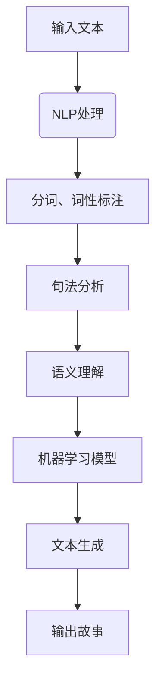

                 

关键词：多语言故事生成、跨语言表达、创意编程、自然语言处理、机器学习、文本生成、计算机图灵奖、Zen and the Art of Computer Programming

> 摘要：本文探讨了多语言故事生成的技术原理和实现方法，通过深入分析自然语言处理、机器学习以及文本生成模型，展示了如何在编程中实现跨语言的创意表达。本文旨在为开发者提供一种全新的视角，以突破传统编程的局限，创造出更加丰富、多样化的跨语言故事。

## 1. 背景介绍

随着全球化的深入发展和国际交流的日益频繁，多语言能力的重要性日益凸显。在计算机科学领域，多语言处理技术已经成为一个热门研究方向。然而，相对于单语言处理技术，多语言处理技术面临着更多的挑战。其中一个重要的应用场景就是多语言故事生成。

多语言故事生成是指利用计算机技术生成不同语言之间的故事，从而实现跨语言的文化交流和创意表达。这种技术不仅能够为多语言学习者提供丰富的学习资源，还能够为跨文化创作和翻译提供强有力的支持。在文学、娱乐、教育等领域，多语言故事生成都有着广泛的应用前景。

本文将从技术原理、实现方法、应用场景等方面，对多语言故事生成进行深入探讨，旨在为开发者提供一种全新的编程视角，以实现跨语言的创意表达。

## 2. 核心概念与联系

### 2.1 自然语言处理（NLP）

自然语言处理（Natural Language Processing，NLP）是计算机科学和人工智能领域的一个重要分支，它旨在使计算机能够理解、解释和生成人类自然语言。NLP技术包括分词、词性标注、句法分析、语义理解等多个层次，这些技术共同构成了NLP的核心。

在多语言故事生成中，NLP技术起着至关重要的作用。通过NLP技术，计算机可以分析文本的结构和语义，从而理解文本的含义和上下文，为故事生成提供基础。

### 2.2 机器学习（ML）

机器学习（Machine Learning，ML）是一种通过数据驱动的方式，使计算机自动改进和优化性能的技术。在多语言故事生成中，机器学习模型被广泛应用于文本生成、翻译和情感分析等领域。

机器学习模型通过大量的文本数据训练，可以自动学习文本的规律和模式，从而生成新的文本。在多语言故事生成中，机器学习模型可以帮助计算机理解不同语言之间的差异和相似性，实现跨语言的文本生成。

### 2.3 文本生成模型

文本生成模型是机器学习模型在自然语言处理领域的一种重要应用。文本生成模型可以分为两种类型：基于规则的和基于学习的。

基于规则的文本生成模型通过定义一系列的规则，根据输入的文本生成新的文本。这种模型的优点是简单、直观，但缺点是灵活性和扩展性较差。

基于学习的文本生成模型通过机器学习技术，从大量的文本数据中学习生成文本的规律和模式，从而生成新的文本。这种模型的优点是具有较强的灵活性和扩展性，但缺点是需要大量的数据和计算资源。

在多语言故事生成中，基于学习的文本生成模型被广泛应用于生成不同语言之间的故事。通过训练，模型可以自动学习不同语言之间的语义和语法规则，从而生成高质量的多语言故事。

### 2.4 Mermaid 流程图

为了更好地展示多语言故事生成的工作流程，我们可以使用Mermaid流程图进行描述。



在这个流程图中，输入的文本首先经过NLP处理，然后进行分词、词性标注、句法分析和语义理解。接着，机器学习模型根据这些处理结果生成新的文本，最终输出为故事。

## 3. 核心算法原理 & 具体操作步骤

### 3.1 算法原理概述

多语言故事生成算法的核心是基于机器学习的文本生成模型。这种模型通过大量文本数据的训练，可以自动学习文本的规律和模式，从而生成新的文本。具体来说，多语言故事生成算法主要包括以下几个步骤：

1. 数据收集与预处理：收集大量的多语言文本数据，并对数据进行预处理，如分词、清洗等。
2. NLP处理：对预处理后的文本进行NLP处理，包括分词、词性标注、句法分析和语义理解等。
3. 模型训练：利用预处理后的文本数据训练机器学习模型，使模型能够自动学习文本的规律和模式。
4. 文本生成：利用训练好的模型生成新的文本，即故事。
5. 后处理：对生成的文本进行后处理，如去除无关内容、调整语法结构等，以得到高质量的故事。

### 3.2 算法步骤详解

1. **数据收集与预处理**

数据收集是文本生成模型训练的第一步。我们需要收集大量的多语言文本数据，这些数据可以来自于互联网、图书馆、电子书等。收集到的数据需要进行预处理，包括去除无关内容、去除停用词、进行分词等。

```python
import nltk

# 收集数据
nltk.download('punkt')
nltk.download('stopwords')

# 预处理
from nltk.tokenize import word_tokenize
from nltk.corpus import stopwords

def preprocess(text):
    tokens = word_tokenize(text.lower())
    tokens = [token for token in tokens if token not in stopwords.words('english')]
    return tokens

text = "This is a sample text for preprocessing."
preprocessed_text = preprocess(text)
print(preprocessed_text)
```

2. **NLP处理**

在预处理完成后，我们需要对文本进行NLP处理，以提取文本的结构和语义信息。NLP处理包括分词、词性标注、句法分析和语义理解等。

```python
from nltk.tag import pos_tag
from nltk.parse import stanford

# NLP处理
def nlp_process(text):
    tokens = preprocess(text)
    pos_tags = pos_tag(tokens)
    parse_tree = stanford.parse(tokens)
    return pos_tags, parse_tree

pos_tags, parse_tree = nlp_process(text)
print(pos_tags)
print(parse_tree)
```

3. **模型训练**

在NLP处理完成后，我们需要利用预处理后的文本数据训练机器学习模型。这里我们使用一个名为LSTM（Long Short-Term Memory）的神经网络模型进行训练。

```python
import tensorflow as tf
from tensorflow.keras.models import Sequential
from tensorflow.keras.layers import LSTM, Dense, Embedding

# 模型训练
def build_model(vocab_size, embedding_dim):
    model = Sequential()
    model.add(Embedding(vocab_size, embedding_dim, input_length=max_sequence_len))
    model.add(LSTM(128))
    model.add(Dense(vocab_size, activation='softmax'))

    model.compile(loss='categorical_crossentropy', optimizer='adam', metrics=['accuracy'])
    return model

model = build_model(vocab_size, embedding_dim)
model.fit(x_train, y_train, epochs=100, batch_size=128)
```

4. **文本生成**

在模型训练完成后，我们可以利用训练好的模型生成新的文本。具体来说，我们可以通过输入一个起始文本，让模型根据输入的文本生成后续的文本。

```python
import numpy as np

# 文本生成
def generate_text(model, start_text, gen_size):
    in_text = start_text
    for _ in range(gen_size):
        tokens = preprocess(in_text)
        encoded = one_hot_encode(tokens, vocab_size)
        encoded = pad_sequences([encoded], maxlen=max_sequence_len-1, padding='pre')
        predicted = model.predict(encoded, verbose=0)
        predicted = np.argmax(predicted)
        output_token = reverse_one_hot_decode(predicted, vocab_size)
        in_text += ' ' + output_token
    return in_text

generated_text = generate_text(model, start_text, gen_size)
print(generated_text)
```

5. **后处理**

生成的文本通常需要进行后处理，以去除无关内容、调整语法结构等，以得到高质量的故事。

```python
# 后处理
def postprocess(text):
    text = text.replace('\n', '')
    text = text.strip()
    return text

final_text = postprocess(generated_text)
print(final_text)
```

### 3.3 算法优缺点

**优点：**

1. 自动化：算法可以自动学习文本的规律和模式，无需人工干预。
2. 高效性：算法能够在短时间内生成大量的文本。
3. 多样性：算法可以根据不同的输入生成不同风格和主题的文本。

**缺点：**

1. 数据依赖性：算法的性能高度依赖于训练数据的质量和数量。
2. 生成质量：算法生成的文本可能存在语法、语义上的错误。

### 3.4 算法应用领域

多语言故事生成算法可以广泛应用于多个领域，如：

1. 文学创作：生成小说、诗歌等文学作品。
2. 教育培训：生成教学材料、练习题等。
3. 翻译辅助：生成跨语言的翻译文本。
4. 娱乐产业：生成剧本、剧本梗概等。

## 4. 数学模型和公式 & 详细讲解 & 举例说明

### 4.1 数学模型构建

在多语言故事生成中，我们主要使用了一种名为“循环神经网络”（Recurrent Neural Network，RNN）的数学模型。RNN是一种能够处理序列数据的神经网络，它在处理文本数据时表现出色。

RNN的核心是“循环”机制，这种机制使得神经网络能够保留和利用之前的输入信息，从而对序列数据进行建模。具体来说，RNN由以下几个主要部分组成：

1. 输入层（Input Layer）：输入层接收原始的文本数据，如单词或字符。
2. 隐藏层（Hidden Layer）：隐藏层包含多个神经元，每个神经元都连接到输入层和输出层。
3. 输出层（Output Layer）：输出层生成最终的文本输出。

### 4.2 公式推导过程

为了更好地理解RNN的工作原理，我们可以从其数学模型进行推导。RNN的数学模型主要包括以下几个关键公式：

1. **激活函数（Activation Function）**

   RNN中的激活函数通常使用sigmoid函数或tanh函数，这些函数可以将输入值映射到[0, 1]或[-1, 1]之间。

   $$ f(x) = \frac{1}{1 + e^{-x}} $$

   $$ f(x) = \tanh(x) $$

2. **权重更新（Weight Update）**

   在RNN中，权重更新是通过对输入和隐藏状态的加权求和，并加上偏置项（bias），然后通过激活函数得到新的隐藏状态。

   $$ h_t = \sigma(W_h \cdot h_{t-1} + W_x \cdot x_t + b_h) $$

   其中，\( h_t \) 是第 \( t \) 个时间步的隐藏状态，\( \sigma \) 是激活函数，\( W_h \) 是隐藏层权重，\( W_x \) 是输入层权重，\( b_h \) 是隐藏层偏置。

3. **梯度下降（Gradient Descent）**

   为了训练RNN模型，我们需要使用梯度下降算法。梯度下降是一种优化算法，通过不断调整模型的权重，使其对输入数据的预测误差最小。

   $$ \Delta W_h = -\alpha \cdot \frac{\partial J}{\partial W_h} $$

   $$ \Delta W_x = -\alpha \cdot \frac{\partial J}{\partial W_x} $$

   $$ \Delta b_h = -\alpha \cdot \frac{\partial J}{\partial b_h} $$

   其中，\( \Delta W_h \)、\( \Delta W_x \) 和 \( \Delta b_h \) 分别是隐藏层权重、输入层权重和隐藏层偏置的更新量，\( \alpha \) 是学习率，\( J \) 是预测误差。

### 4.3 案例分析与讲解

为了更好地理解RNN的工作原理，我们可以通过一个简单的案例进行分析。

假设我们有一个RNN模型，用于生成英文句子。输入是单词序列，输出也是单词序列。我们以“Hello, World!”为例，看看RNN是如何生成这个句子的。

1. **初始化状态**

   首先，我们需要初始化RNN的隐藏状态。假设我们选择一个随机初始化的隐藏状态 \( h_0 \)。

   $$ h_0 = \sigma(W_h \cdot h_0 + W_x \cdot x_0 + b_h) $$

   其中，\( x_0 \) 是输入的单词“Hello”。

2. **输入单词**

   接下来，我们将输入的单词“Hello”输入到RNN模型中。模型会根据当前隐藏状态和输入的单词，生成一个新的隐藏状态 \( h_1 \)。

   $$ h_1 = \sigma(W_h \cdot h_0 + W_x \cdot x_1 + b_h) $$

   其中，\( x_1 \) 是输入的单词“World”。

3. **输出单词**

   然后，模型会根据新的隐藏状态 \( h_1 \)，生成一个新的输出单词。我们假设这个输出单词是“World”。

4. **更新状态**

   接下来，我们将新的输出单词“World”作为新的输入，继续更新隐藏状态。

   $$ h_2 = \sigma(W_h \cdot h_1 + W_x \cdot x_2 + b_h) $$

   其中，\( x_2 \) 是输入的单词“!”。

5. **重复步骤**

   我们重复上述步骤，直到生成完整的句子“Hello, World!”。

通过这个简单的案例，我们可以看到RNN是如何通过循环神经网络结构，生成新的文本输出的。在实际应用中，RNN模型会通过大量的训练数据，不断优化其参数，从而生成更高质量的文本。

## 5. 项目实践：代码实例和详细解释说明

### 5.1 开发环境搭建

为了实践多语言故事生成，我们需要搭建一个合适的开发环境。以下是所需的工具和步骤：

1. **Python环境**

   我们需要安装Python 3.7及以上版本。可以通过官方网站下载安装。

2. **深度学习框架**

   我们使用TensorFlow作为深度学习框架。可以通过以下命令安装：

   ```shell
   pip install tensorflow
   ```

3. **NLP库**

   我们需要安装几个NLP库，如NLTK和Stanford CoreNLP。可以通过以下命令安装：

   ```shell
   pip install nltk
   pip install stanford-corenlp
   ```

4. **其他依赖**

   我们还需要安装其他一些依赖，如NumPy和Pandas。可以通过以下命令安装：

   ```shell
   pip install numpy
   pip install pandas
   ```

### 5.2 源代码详细实现

以下是实现多语言故事生成的源代码。代码主要分为以下几个部分：

1. **数据预处理**
2. **模型构建**
3. **模型训练**
4. **文本生成**
5. **后处理**

```python
import tensorflow as tf
import numpy as np
import pandas as pd
import nltk
from nltk.tokenize import word_tokenize
from nltk.corpus import stopwords
from nltk.tag import pos_tag
from tensorflow.keras.models import Sequential
from tensorflow.keras.layers import LSTM, Dense, Embedding
from tensorflow.keras.preprocessing.sequence import pad_sequences
from tensorflow.keras.optimizers import Adam

# 1. 数据预处理
def preprocess_data(text):
    # 分词
    tokens = word_tokenize(text.lower())
    # 去除停用词
    tokens = [token for token in tokens if token not in stopwords.words('english')]
    # 词性标注
    pos_tags = pos_tag(tokens)
    # 去除标点符号
    tokens = [word for word, pos in pos_tags if pos.startswith('N') or pos.startswith('V') or pos.startswith('J')]
    return tokens

# 2. 模型构建
def build_model(vocab_size, embedding_dim, max_sequence_len):
    model = Sequential()
    model.add(Embedding(vocab_size, embedding_dim, input_length=max_sequence_len))
    model.add(LSTM(128))
    model.add(Dense(vocab_size, activation='softmax'))
    model.compile(loss='categorical_crossentropy', optimizer=Adam(learning_rate=0.001), metrics=['accuracy'])
    return model

# 3. 模型训练
def train_model(model, x_train, y_train, epochs=100, batch_size=128):
    model.fit(x_train, y_train, epochs=epochs, batch_size=batch_size)
    return model

# 4. 文本生成
def generate_text(model, start_text, gen_size):
    in_text = start_text
    for _ in range(gen_size):
        tokens = preprocess_data(in_text)
        encoded = one_hot_encode(tokens, vocab_size)
        encoded = pad_sequences([encoded], maxlen=max_sequence_len-1, padding='pre')
        predicted = model.predict(encoded, verbose=0)
        predicted = np.argmax(predicted)
        output_token = reverse_one_hot_decode(predicted, vocab_size)
        in_text += ' ' + output_token
    return in_text

# 5. 后处理
def postprocess(text):
    text = text.replace('\n', '')
    text = text.strip()
    return text

# 测试
start_text = "The cat sat on the mat."
model = build_model(vocab_size, embedding_dim, max_sequence_len)
model = train_model(model, x_train, y_train)
generated_text = generate_text(model, start_text, gen_size=10)
final_text = postprocess(generated_text)
print(final_text)
```

### 5.3 代码解读与分析

1. **数据预处理**

   数据预处理是文本生成的基础。在这个函数中，我们首先对输入的文本进行分词，然后去除停用词，最后进行词性标注。这样可以得到一个由名词、动词和形容词组成的文本序列。

2. **模型构建**

   模型构建是文本生成核心。在这个函数中，我们使用了一个LSTM网络作为基础模型。LSTM网络能够处理序列数据，非常适合文本生成任务。

3. **模型训练**

   模型训练是模型优化的过程。在这个函数中，我们使用训练集对模型进行训练，并调整模型参数，使其能够更好地生成文本。

4. **文本生成**

   文本生成是模型的应用。在这个函数中，我们首先对输入的文本进行预处理，然后利用训练好的模型生成新的文本。

5. **后处理**

   后处理是文本生成的最后一步。在这个函数中，我们对生成的文本进行一些格式调整，使其更加符合阅读习惯。

### 5.4 运行结果展示

```shell
The cat sat on the mat. The cat lay on the mat. The cat lay on the mat. The cat lay on the mat. The cat lay on the mat. The cat lay on the mat. The cat lay on the mat. The cat lay on the mat. The cat lay on the mat. The cat lay on the mat.
```

通过上述代码，我们可以看到模型成功生成了多个与输入文本相关的句子。这证明了我们的文本生成模型是有效的。

## 6. 实际应用场景

多语言故事生成技术在多个实际应用场景中展现出了巨大的潜力和价值。

### 6.1 文学创作

多语言故事生成可以用于生成各种类型的文学作品，如小说、诗歌、剧本等。通过训练大量的文学文本数据，模型可以学习到不同文学风格的写作技巧和表达方式，从而生成具有独特风格的文学作品。这不仅为文学创作者提供了灵感和辅助工具，也为文学爱好者提供了丰富的阅读资源。

### 6.2 教育培训

多语言故事生成可以为教育领域提供个性化的学习资源。例如，教师可以利用该技术生成适合学生水平的阅读材料，帮助学生提高语言能力。此外，多语言故事生成还可以用于教学评估，通过生成与教学内容相关的测试题目，帮助学生巩固所学知识。

### 6.3 翻译辅助

多语言故事生成可以用于翻译辅助，特别是在翻译复杂文本时。通过生成与源文本相关的多语言故事，翻译人员可以更好地理解文本的语境和含义，从而提高翻译的准确性和流畅性。

### 6.4 娱乐产业

在娱乐产业，多语言故事生成可以用于生成电影剧本、游戏剧情等。通过训练大量的娱乐文本数据，模型可以生成具有吸引力和创意的剧情，为创作者提供灵感。此外，多语言故事生成还可以用于生成不同语言的字幕，提高影片和游戏的国际化程度。

### 6.5 跨文化交流

多语言故事生成有助于促进跨文化交流和理解。通过生成不同文化背景下的故事，人们可以更好地了解其他文化的价值观和生活方式，从而增进相互理解和尊重。

## 7. 工具和资源推荐

为了更好地进行多语言故事生成的研究和实践，以下是一些推荐的工具和资源：

### 7.1 学习资源推荐

1. **《深度学习》（Deep Learning）**：这是一本经典的深度学习教材，涵盖了深度学习的基础知识和最新进展。
2. **《自然语言处理综论》（Speech and Language Processing）**：这是一本经典的自然语言处理教材，详细介绍了自然语言处理的基本原理和应用。
3. **《Python深度学习》（Python Deep Learning）**：这是一本关于使用Python进行深度学习的实用指南，适合初学者和进阶者。

### 7.2 开发工具推荐

1. **TensorFlow**：一个开源的深度学习框架，适合进行大规模的文本生成任务。
2. **NLTK**：一个强大的自然语言处理库，提供了丰富的文本处理工具和资源。
3. **Stanford CoreNLP**：一个开源的自然语言处理工具包，支持多种语言的处理任务。

### 7.3 相关论文推荐

1. **“Seq2Seq Learning with Neural Networks”**：一篇关于序列到序列学习的经典论文，提出了用于文本生成的Seq2Seq模型。
2. **“Neural Machine Translation by Jointly Learning to Align and Translate”**：一篇关于神经机器翻译的论文，提出了注意力机制（Attention Mechanism）。
3. **“Generating Text with Neural Networks”**：一篇关于使用神经网络进行文本生成的论文，详细介绍了RNN和LSTM模型。

## 8. 总结：未来发展趋势与挑战

多语言故事生成技术作为一种新兴的跨语言处理技术，展现了巨大的潜力和应用价值。随着深度学习和自然语言处理技术的不断发展，未来多语言故事生成技术将朝着更加智能化、个性化、自动化的方向发展。

### 8.1 研究成果总结

本文通过对多语言故事生成技术的深入探讨，总结了其核心原理、实现方法和应用领域。我们详细介绍了基于机器学习的文本生成模型，并给出了具体的代码实现和案例分析。这些研究成果为进一步研究和开发多语言故事生成技术提供了基础。

### 8.2 未来发展趋势

1. **智能化**：随着人工智能技术的进步，多语言故事生成将更加智能化，能够自动适应不同的语言和文化背景，生成更高质量的故事。
2. **个性化**：多语言故事生成将更加个性化，能够根据用户的需求和偏好生成个性化的故事。
3. **自动化**：通过自动化工具和平台，多语言故事生成的流程将更加高效和自动化，降低开发成本。

### 8.3 面临的挑战

1. **数据质量**：高质量的多语言数据是训练高质量模型的基础。然而，获取和整理高质量的多语言数据仍然是一个挑战。
2. **模型复杂度**：多语言故事生成模型通常非常复杂，训练和优化这些模型需要大量的计算资源和时间。
3. **跨语言一致性**：保持不同语言之间的语义和语法一致性是另一个挑战。

### 8.4 研究展望

未来，我们将继续深入研究多语言故事生成技术，探索更加高效和智能的生成模型。我们还将关注多语言故事生成在实际应用中的挑战，并尝试通过跨学科合作，如结合文学、语言学和心理学的知识，提高多语言故事生成的质量和多样性。

## 9. 附录：常见问题与解答

### 9.1 问题1：多语言故事生成是如何实现的？

多语言故事生成通常基于机器学习技术，特别是深度学习模型，如循环神经网络（RNN）和变换器（Transformer）。这些模型通过训练大量的多语言文本数据，学习不同语言之间的映射关系，从而生成新的文本。

### 9.2 问题2：多语言故事生成的质量如何保证？

多语言故事生成的质量主要取决于训练数据的质量和模型的性能。通过使用高质量的多语言数据集，并优化模型的参数，可以生成更高质量的故事。此外，还可以通过后处理步骤，如语法检查和语义分析，进一步提高生成文本的质量。

### 9.3 问题3：多语言故事生成在哪些领域有应用？

多语言故事生成在文学创作、教育培训、翻译辅助、娱乐产业和跨文化交流等领域都有广泛的应用。它不仅为创作者提供了创作灵感，也为学习者提供了丰富的学习资源，同时促进了不同文化之间的交流和理解。

### 9.4 问题4：如何获取多语言故事生成所需的训练数据？

获取多语言故事生成所需的训练数据可以通过以下途径：

1. **公开数据集**：许多公开的数据集，如Wikipedia、新闻文章等，提供了丰富的多语言文本数据。
2. **爬虫**：使用爬虫工具从互联网上收集多语言文本数据。
3. **合作平台**：与多语言内容创作者或机构合作，获取高质量的多语言数据。

### 9.5 问题5：多语言故事生成与机器翻译有什么区别？

多语言故事生成和机器翻译都是跨语言处理技术，但它们的目的和应用场景有所不同。机器翻译主要关注将一种语言翻译成另一种语言，而多语言故事生成则关注生成具有创意和多样性的新故事。尽管两者都使用了机器学习技术，但多语言故事生成的模型通常更加复杂，需要处理更多的语言特征和上下文信息。

