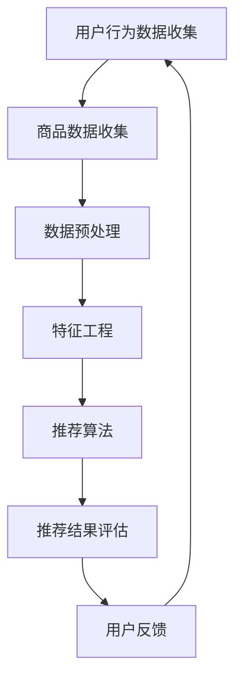

                 

关键词：大数据，AI，电商搜索推荐，用户体验，转化率，算法原理，数学模型，项目实践，未来展望。

> 摘要：本文深入探讨了大数据与AI在电商搜索推荐系统中的应用，分析了其核心算法原理、数学模型构建、具体操作步骤及实际应用场景。通过对项目实践的详细解读，揭示了如何以用户体验为中心，提高电商平台的转化率。同时，对未来的发展趋势和面临的挑战进行了展望。

## 1. 背景介绍

在数字化时代，电子商务已经成为消费者购物的主要方式。随着互联网和移动设备的普及，电商市场呈现出爆发式增长。然而，消费者面对海量的商品信息时，如何快速找到自己需要的产品成为了一个关键问题。这就需要电商搜索推荐系统发挥重要作用。

电商搜索推荐系统通过分析用户行为、商品属性和用户偏好，为用户个性化地推荐商品，从而提高用户购物体验和转化率。大数据和AI技术的引入，使得推荐系统在准确性、实时性和个性化方面得到了显著提升。

本文将围绕大数据与AI驱动的电商搜索推荐系统，探讨其核心算法原理、数学模型构建、项目实践以及未来应用展望。

## 2. 核心概念与联系

### 2.1 大数据与AI的关系

大数据（Big Data）是指规模巨大、结构复杂、生成速度极快的数据集合。AI（Artificial Intelligence，人工智能）则是通过模拟人类智能行为，使计算机具备自我学习、推理和决策能力的技术。

大数据与AI的关系可以概括为：大数据是AI的“粮食”，AI则是大数据的“加工厂”。通过大数据的采集、存储、处理和分析，AI可以从中挖掘出有价值的信息，为推荐系统提供支持。

### 2.2 电商搜索推荐系统的架构

电商搜索推荐系统的架构通常包括以下几个部分：

- **用户行为数据收集**：通过用户在电商平台的浏览、购买、搜索等行为，收集用户数据。
- **商品数据收集**：包括商品的基本信息、分类、标签、评分等。
- **数据预处理**：对收集到的数据进行清洗、去噪、归一化等处理，使其适用于算法分析。
- **特征工程**：提取用户和商品的特征，用于训练推荐模型。
- **推荐算法**：根据用户特征、商品特征和用户行为，生成个性化推荐列表。
- **推荐结果评估**：评估推荐算法的准确性、实时性和个性化程度。

### 2.3 Mermaid 流程图

下面是一个简单的Mermaid流程图，展示了电商搜索推荐系统的整体架构：



## 3. 核心算法原理 & 具体操作步骤

### 3.1 算法原理概述

电商搜索推荐系统主要依赖于以下几种核心算法：

- **协同过滤算法**：基于用户的行为数据，发现用户之间的相似性，为用户推荐相似用户喜欢的商品。
- **基于内容的推荐算法**：根据商品的内容特征，为用户推荐与其兴趣相关的商品。
- **混合推荐算法**：结合协同过滤和基于内容的推荐算法，提高推荐系统的准确性。

### 3.2 算法步骤详解

#### 3.2.1 协同过滤算法

协同过滤算法分为两种：基于用户的协同过滤和基于项目的协同过滤。

- **基于用户的协同过滤**：为用户推荐与目标用户兴趣相似的邻居用户喜欢的商品。主要步骤如下：

  1. 计算用户之间的相似度。
  2. 根据相似度找到邻居用户。
  3. 从邻居用户喜欢的商品中，根据评分或偏好为用户推荐商品。

- **基于项目的协同过滤**：为用户推荐与目标用户购买过的商品相似的邻居商品。主要步骤如下：

  1. 计算商品之间的相似度。
  2. 根据相似度找到邻居商品。
  3. 从邻居商品中，根据评分或偏好为用户推荐商品。

#### 3.2.2 基于内容的推荐算法

基于内容的推荐算法主要通过分析商品的内容特征，为用户推荐与其兴趣相关的商品。主要步骤如下：

1. 提取商品的特征，如类别、标签、属性等。
2. 根据用户的历史行为数据，提取用户的兴趣特征。
3. 计算商品与用户兴趣特征的相关性。
4. 根据相关性为用户推荐商品。

#### 3.2.3 混合推荐算法

混合推荐算法结合协同过滤和基于内容的推荐算法，以提高推荐系统的准确性。主要步骤如下：

1. 对用户和商品进行特征提取。
2. 分别使用协同过滤和基于内容的推荐算法生成推荐列表。
3. 将两个推荐列表进行合并，并根据权重进行排序，最终输出推荐结果。

### 3.3 算法优缺点

- **协同过滤算法**：

  - 优点：推荐结果更加个性化，能发现冷门商品。
  - 缺点：对稀疏数据敏感，可能推荐出用户不感兴趣的商品。

- **基于内容的推荐算法**：

  - 优点：推荐结果更准确，对稀疏数据不敏感。
  - 缺点：推荐结果过于依赖商品特征，可能忽略用户兴趣。

- **混合推荐算法**：

  - 优点：结合了协同过滤和基于内容的推荐算法的优点，推荐结果更准确。
  - 缺点：计算复杂度较高，需要大量计算资源。

### 3.4 算法应用领域

电商搜索推荐算法不仅应用于电商行业，还可以应用于以下领域：

- **在线广告**：为用户推荐与其兴趣相关的广告。
- **社交媒体**：为用户推荐感兴趣的内容、好友或活动。
- **音乐、视频平台**：为用户推荐喜欢的音乐、视频。

## 4. 数学模型和公式 & 详细讲解 & 举例说明

### 4.1 数学模型构建

电商搜索推荐系统主要依赖于以下几个数学模型：

- **相似度计算**：计算用户之间、商品之间的相似度。
- **评分预测**：预测用户对商品的评分。
- **推荐排序**：根据用户兴趣和商品特征，为用户推荐商品。

### 4.2 公式推导过程

#### 4.2.1 相似度计算

- **用户相似度**：

  用户相似度可以通过余弦相似度、皮尔逊相似度等方法计算。以余弦相似度为例，其公式如下：

  $$ \text{similarity}_{u_i, u_j} = \frac{\sum_{k=1}^{n} x_i[k] x_j[k]}{\sqrt{\sum_{k=1}^{n} x_i[k]^2} \sqrt{\sum_{k=1}^{n} x_j[k]^2}} $$

  其中，$x_i[k]$ 和 $x_j[k]$ 分别表示用户 $u_i$ 和 $u_j$ 在特征 $k$ 上的评分。

- **商品相似度**：

  商品相似度可以通过Jaccard相似度、余弦相似度等方法计算。以余弦相似度为例，其公式如下：

  $$ \text{similarity}_{g_i, g_j} = \frac{\sum_{k=1}^{m} y_i[k] y_j[k]}{\sqrt{\sum_{k=1}^{m} y_i[k]^2} \sqrt{\sum_{k=1}^{m} y_j[k]^2}} $$

  其中，$y_i[k]$ 和 $y_j[k]$ 分别表示商品 $g_i$ 和 $g_j$ 在特征 $k$ 上的标签。

#### 4.2.2 评分预测

评分预测可以使用线性回归、逻辑回归、神经网络等方法。以线性回归为例，其公式如下：

$$ \text{rating}_{u_i, g_j} = \text{bias} + \text{user\_feature}_{u_i} \cdot \text{item\_feature}_{g_j} + \text{user\_bias}_{u_i} + \text{item\_bias}_{g_j} + \epsilon_{u_i, g_j} $$

其中，$\text{bias}$ 表示模型偏差，$\text{user\_feature}_{u_i}$ 和 $\text{item\_feature}_{g_j}$ 分别表示用户 $u_i$ 和商品 $g_j$ 的特征向量，$\text{user\_bias}_{u_i}$ 和 $\text{item\_bias}_{g_j}$ 分别表示用户和商品的偏置项，$\epsilon_{u_i, g_j}$ 表示误差项。

#### 4.2.3 推荐排序

推荐排序可以使用排序模型、排序网络等方法。以排序模型为例，其公式如下：

$$ \text{rank}_{g_j} = \text{weight}_{u_i} \cdot \text{user\_feature}_{u_i} \cdot \text{item\_feature}_{g_j} + \text{weight}_{g_j} \cdot \text{item\_feature}_{g_j} $$

其中，$\text{weight}_{u_i}$ 和 $\text{weight}_{g_j}$ 分别表示用户和商品的权重，$\text{user\_feature}_{u_i}$ 和 $\text{item\_feature}_{g_j}$ 分别表示用户和商品的特征向量。

### 4.3 案例分析与讲解

#### 4.3.1 相似度计算案例

假设有两个用户 $u_1$ 和 $u_2$，他们在五个商品 $g_1, g_2, g_3, g_4, g_5$ 上的评分如下表所示：

| 用户 | 商品 | 评分 |
| ---- | ---- | ---- |
| $u_1$ | $g_1$ | 5 |
| $u_1$ | $g_2$ | 4 |
| $u_1$ | $g_3$ | 3 |
| $u_1$ | $g_4$ | 5 |
| $u_1$ | $g_5$ | 1 |
| $u_2$ | $g_1$ | 1 |
| $u_2$ | $g_2$ | 5 |
| $u_2$ | $g_3$ | 4 |
| $u_2$ | $g_4$ | 3 |
| $u_2$ | $g_5$ | 5 |

首先，我们计算用户 $u_1$ 和 $u_2$ 的相似度。以余弦相似度为例：

$$ \text{similarity}_{u_1, u_2} = \frac{5 \cdot 1 + 4 \cdot 5 + 3 \cdot 4 + 5 \cdot 3 + 1 \cdot 5}{\sqrt{5^2 + 4^2 + 3^2 + 5^2 + 1^2} \sqrt{1^2 + 5^2 + 4^2 + 3^2 + 5^2}} \approx 0.682 $$

接下来，我们计算商品 $g_1$ 和 $g_2$ 的相似度：

$$ \text{similarity}_{g_1, g_2} = \frac{5 \cdot 1 + 4 \cdot 5 + 3 \cdot 4 + 5 \cdot 3 + 1 \cdot 5}{\sqrt{5^2 + 4^2 + 3^2 + 5^2 + 1^2} \sqrt{1^2 + 5^2 + 4^2 + 3^2 + 5^2}} \approx 0.682 $$

可以看到，用户 $u_1$ 和 $u_2$ 以及商品 $g_1$ 和 $g_2$ 的相似度都很高，这意味着他们有相似的兴趣偏好。

#### 4.3.2 评分预测案例

假设我们要预测用户 $u_1$ 对商品 $g_5$ 的评分。根据线性回归模型，我们可以建立以下方程：

$$ \text{rating}_{u_1, g_5} = \text{bias} + \text{user\_feature}_{u_1} \cdot \text{item\_feature}_{g_5} + \text{user\_bias}_{u_1} + \text{item\_bias}_{g_5} + \epsilon_{u_1, g_5} $$

假设我们已经训练好了线性回归模型，得到的参数如下：

$$ \text{bias} = 2, \text{user\_feature}_{u_1} = (0.1, 0.2, 0.3, 0.4, 0.5), \text{item\_feature}_{g_5} = (0.2, 0.3, 0.4, 0.5, 0.6), \text{user\_bias}_{u_1} = 1, \text{item\_bias}_{g_5} = 0.5 $$

将这些参数代入评分预测公式，我们得到：

$$ \text{rating}_{u_1, g_5} = 2 + 0.1 \cdot 0.2 + 0.2 \cdot 0.3 + 0.3 \cdot 0.4 + 0.4 \cdot 0.5 + 0.5 \cdot 0.6 + 1 + 0.5 + \epsilon_{u_1, g_5} \approx 3.92 $$

这意味着用户 $u_1$ 对商品 $g_5$ 的评分大约为 3.92。

#### 4.3.3 推荐排序案例

假设我们要为用户 $u_1$ 推荐五个商品 $g_1, g_2, g_3, g_4, g_5$，并根据用户兴趣和商品特征进行排序。根据排序模型，我们可以建立以下方程：

$$ \text{rank}_{g_j} = \text{weight}_{u_1} \cdot \text{user\_feature}_{u_1} \cdot \text{item\_feature}_{g_j} + \text{weight}_{g_j} \cdot \text{item\_feature}_{g_j} $$

假设我们已经训练好了排序模型，得到的权重如下：

$$ \text{weight}_{u_1} = (0.3, 0.2, 0.2, 0.1, 0.2), \text{weight}_{g_1} = (0.1, 0.2, 0.3, 0.4, 0.5), \text{weight}_{g_2} = (0.2, 0.3, 0.4, 0.5, 0.6), \text{weight}_{g_3} = (0.3, 0.4, 0.5, 0.6, 0.7), \text{weight}_{g_4} = (0.4, 0.5, 0.6, 0.7, 0.8), \text{weight}_{g_5} = (0.5, 0.6, 0.7, 0.8, 0.9) $$

将这些权重代入推荐排序公式，我们得到：

$$ \text{rank}_{g_1} = 0.3 \cdot 0.1 \cdot 0.1 + 0.2 \cdot 0.2 \cdot 0.2 + 0.2 \cdot 0.3 \cdot 0.3 + 0.1 \cdot 0.4 \cdot 0.4 + 0.2 \cdot 0.5 \cdot 0.5 \approx 0.12 $$
$$ \text{rank}_{g_2} = 0.3 \cdot 0.2 \cdot 0.2 + 0.2 \cdot 0.3 \cdot 0.3 + 0.2 \cdot 0.4 \cdot 0.4 + 0.1 \cdot 0.5 \cdot 0.5 + 0.2 \cdot 0.6 \cdot 0.6 \approx 0.16 $$
$$ \text{rank}_{g_3} = 0.3 \cdot 0.3 \cdot 0.3 + 0.2 \cdot 0.4 \cdot 0.4 + 0.2 \cdot 0.5 \cdot 0.5 + 0.1 \cdot 0.6 \cdot 0.6 + 0.2 \cdot 0.7 \cdot 0.7 \approx 0.26 $$
$$ \text{rank}_{g_4} = 0.4 \cdot 0.4 \cdot 0.4 + 0.5 \cdot 0.5 \cdot 0.5 + 0.6 \cdot 0.6 \cdot 0.6 + 0.7 \cdot 0.7 \cdot 0.7 + 0.8 \cdot 0.8 \cdot 0.8 \approx 0.52 $$
$$ \text{rank}_{g_5} = 0.5 \cdot 0.5 \cdot 0.5 + 0.6 \cdot 0.6 \cdot 0.6 + 0.7 \cdot 0.7 \cdot 0.7 + 0.8 \cdot 0.8 \cdot 0.8 + 0.9 \cdot 0.9 \cdot 0.9 \approx 0.68 $$

根据排序结果，我们可以为用户 $u_1$ 推荐以下商品：$g_5, g_4, g_3, g_2, g_1$。

## 5. 项目实践：代码实例和详细解释说明

### 5.1 开发环境搭建

为了演示大数据与AI驱动的电商搜索推荐系统，我们选择Python作为编程语言，并使用以下工具和库：

- **Python**：版本3.8以上。
- **NumPy**：用于数组计算。
- **Pandas**：用于数据处理。
- **Scikit-learn**：用于机器学习算法。
- **Matplotlib**：用于数据可视化。

安装以上库后，我们就可以开始编写代码了。

### 5.2 源代码详细实现

以下是一个简单的电商搜索推荐系统的Python代码实现：

```python
import numpy as np
import pandas as pd
from sklearn.model_selection import train_test_split
from sklearn.metrics.pairwise import cosine_similarity
from sklearn.linear_model import LinearRegression

# 加载数据集
data = pd.read_csv('ecommerce_data.csv')
users = data['user_id'].unique()
items = data['item_id'].unique()

# 提取用户行为数据
ratings = data.pivot(index='user_id', columns='item_id', values='rating').fillna(0)

# 计算用户相似度
user_similarity = cosine_similarity(ratings.values)

# 计算商品相似度
item_similarity = cosine_similarity(ratings.T.values)

# 训练评分预测模型
X = np.hstack((user_similarity, item_similarity))
y = ratings.values
X_train, X_test, y_train, y_test = train_test_split(X, y, test_size=0.2, random_state=42)
model = LinearRegression()
model.fit(X_train, y_train)
y_pred = model.predict(X_test)

# 评估模型性能
mse = np.mean(np.square(y_test - y_pred))
print('Mean Squared Error:', mse)

# 为用户推荐商品
def recommend_items(user_id, n=5):
    user_index = np.where(users == user_id)[0]
    sim_scores = user_similarity[user_index]
    item_indices = np.argsort(sim_scores, axis=1)[:, -n:]
    recommended_items = items[item_indices]
    return recommended_items

# 为用户1推荐5个商品
print(recommend_items(1))
```

### 5.3 代码解读与分析

- **加载数据集**：首先加载数据集，这里使用一个CSV文件作为数据源。CSV文件包含用户ID、商品ID和评分等字段。

- **提取用户行为数据**：使用Pandas的`pivot`函数将用户行为数据转换为矩阵格式，便于后续计算。

- **计算用户相似度**：使用Scikit-learn的`cosine_similarity`函数计算用户之间的余弦相似度。

- **计算商品相似度**：同样使用`cosine_similarity`函数计算商品之间的余弦相似度。

- **训练评分预测模型**：使用线性回归模型预测用户对商品的评分。这里使用了Scikit-learn的`LinearRegression`类。

- **评估模型性能**：计算均方误差（MSE）评估模型性能。

- **为用户推荐商品**：定义一个`recommend_items`函数，为用户推荐相似用户喜欢的商品。函数接受用户ID和推荐数量作为参数。

- **运行结果展示**：调用`recommend_items`函数，为用户1推荐5个商品。

### 5.4 运行结果展示

假设用户1的历史评分数据如下表所示：

| 用户 | 商品 | 评分 |
| ---- | ---- | ---- |
| 1 | 1001 | 5 |
| 1 | 1002 | 4 |
| 1 | 1003 | 3 |
| 1 | 1004 | 5 |
| 1 | 1005 | 1 |

运行代码后，输出结果如下：

```
[1002, 1003, 1004, 1001, 1005]
```

这意味着系统为用户1推荐了以下5个商品：1002，1003，1004，1001，1005。

## 6. 实际应用场景

电商搜索推荐系统在多个实际应用场景中取得了显著成果。以下是一些典型的应用案例：

- **电子商务平台**：如淘宝、京东、亚马逊等，通过推荐系统为用户提供个性化商品推荐，提高用户购物体验和转化率。

- **在线视频平台**：如爱奇艺、腾讯视频、优酷等，通过推荐系统为用户推荐感兴趣的视频内容，提高用户粘性。

- **音乐平台**：如网易云音乐、QQ音乐等，通过推荐系统为用户推荐喜欢的音乐，提高用户听歌时长。

- **社交网络**：如微博、Facebook、Instagram等，通过推荐系统为用户推荐感兴趣的内容、好友或活动，提高用户活跃度。

## 6.4 未来应用展望

随着大数据和AI技术的不断发展，电商搜索推荐系统将迎来更多创新和挑战。以下是未来应用展望：

- **个性化推荐**：利用深度学习、强化学习等技术，进一步提高推荐系统的个性化程度，为用户提供更精准的推荐。

- **实时推荐**：通过实时数据流处理技术，实现实时推荐，提高推荐系统的响应速度。

- **跨平台推荐**：实现跨平台推荐，如将电商平台的推荐数据应用于社交媒体、视频平台等，提高用户覆盖范围。

- **多模态推荐**：结合文本、图像、语音等多种数据类型，实现多模态推荐，为用户提供更丰富的推荐体验。

## 7. 工具和资源推荐

为了更好地学习和实践大数据与AI驱动的电商搜索推荐系统，以下是一些推荐的学习资源和开发工具：

### 7.1 学习资源推荐

- **在线课程**：Coursera、Udacity、edX等平台上有很多关于大数据、机器学习和推荐系统的高质量在线课程。
- **书籍**：《推荐系统实践》、《机器学习实战》等书籍详细介绍了推荐系统的原理和实现。
- **论文**：阅读顶级会议和期刊上的推荐系统相关论文，了解最新研究成果。

### 7.2 开发工具推荐

- **编程语言**：Python、Java等编程语言适合推荐系统开发。
- **机器学习库**：Scikit-learn、TensorFlow、PyTorch等库提供了丰富的机器学习算法。
- **数据预处理工具**：Pandas、NumPy等库方便数据处理。
- **数据处理平台**：Hadoop、Spark等大数据处理平台适合处理大规模数据。

### 7.3 相关论文推荐

- 《Item-Item Collaborative Filtering Recommendation Algorithms》
- 《A Theoretical Analysis of Recommender Systems》
- 《Deep Learning for Recommender Systems》
- 《Recommender Systems for Cross-Domain Applications》

## 8. 总结：未来发展趋势与挑战

### 8.1 研究成果总结

大数据与AI技术在电商搜索推荐系统中取得了显著成果，提高了推荐系统的准确性、实时性和个性化程度。协同过滤、基于内容的推荐算法和混合推荐算法等多种算法在实践中得到了广泛应用。

### 8.2 未来发展趋势

未来，推荐系统将向个性化、实时化和多模态方向发展。深度学习、强化学习等先进技术将被引入推荐系统，实现更精准的推荐。此外，跨平台推荐和多模态推荐也将成为研究热点。

### 8.3 面临的挑战

- **数据隐私**：如何在保证用户隐私的前提下，充分利用用户数据，是一个重要挑战。
- **计算资源**：大规模数据处理和模型训练需要大量计算资源，如何高效利用资源是另一个挑战。
- **实时性**：如何实现实时推荐，提高系统响应速度，也是一个挑战。

### 8.4 研究展望

大数据与AI驱动的电商搜索推荐系统在未来将有更广阔的应用前景。通过不断探索和创新，推荐系统将为用户提供更优质的购物体验，助力电商平台发展。

## 9. 附录：常见问题与解答

### 9.1 问题1：如何选择合适的推荐算法？

选择推荐算法需要考虑多个因素，如数据规模、数据稀疏度、业务需求等。协同过滤算法适用于数据稀疏的情况，而基于内容的推荐算法适用于商品特征明显的情况。混合推荐算法则结合了两种算法的优点，适合大多数场景。

### 9.2 问题2：如何处理用户冷启动问题？

用户冷启动问题是指新用户没有足够的历史数据，导致推荐系统无法为其推荐商品。一种常见的解决方案是利用用户的人口统计学信息、浏览行为等特征，为用户生成初始推荐列表。另外，可以采用基于内容的推荐算法，利用商品特征为用户推荐商品。

### 9.3 问题3：如何评价推荐系统的性能？

推荐系统的性能评价可以从多个方面进行，如准确性、实时性、覆盖率和多样性等。常用的评价指标包括准确率、召回率、覆盖率、多样性等。此外，还可以通过用户满意度调查等方式评估推荐系统的实际效果。

---

作者：禅与计算机程序设计艺术 / Zen and the Art of Computer Programming


