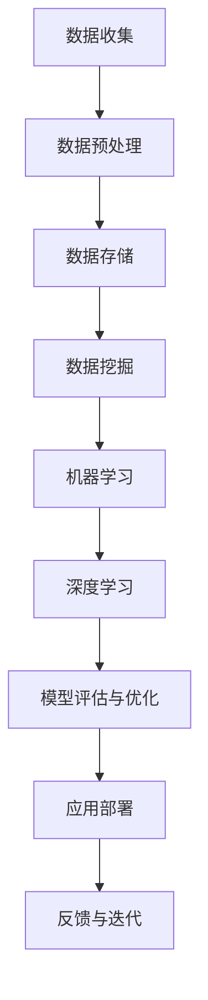

                 

关键词：大数据、人工智能、算法、深度学习、数据挖掘、机器学习、预测分析、区块链、物联网、网络安全、智能硬件、应用场景

> 摘要：本文深入探讨了大数据与人工智能在未来发展中的潜在方向，分析了其核心概念、算法原理、应用场景以及面临的挑战。通过详细阐述数学模型、具体操作步骤、代码实例和未来展望，为行业从业者提供有价值的参考。

## 1. 背景介绍

大数据和人工智能（AI）是当今世界科技领域中最引人注目的两个关键词。大数据指的是海量、复杂和多样化的数据集，这些数据来源于互联网、社交媒体、物联网、移动设备等。而人工智能则是一种模拟人类智能的技术，通过机器学习、深度学习等算法，使计算机具备自主学习和决策能力。

近年来，随着计算能力的提升、数据存储技术的发展以及算法的不断创新，大数据和人工智能在各个领域取得了显著的应用成果。从医疗健康、金融保险、智能制造到智慧城市、无人驾驶，AI已经成为推动社会进步的重要力量。

然而，随着应用场景的不断拓展，大数据与AI也面临着新的挑战和机遇。本文旨在探讨这些挑战和机遇，分析未来的发展方向。

## 2. 核心概念与联系

### 2.1 大数据

大数据具有四个主要特征，即“4V”：Volume（大量）、Velocity（高速）、Variety（多样）和Veracity（真实性）。大数据不仅仅是数据量的累积，还包括数据来源的多样化、数据类型的丰富性以及数据传输和处理的实时性。

### 2.2 人工智能

人工智能包括多个子领域，如机器学习、深度学习、自然语言处理等。机器学习是一种通过数据驱动的方式进行学习的方法，而深度学习则是基于多层神经网络的结构。自然语言处理则专注于计算机理解和生成人类语言。

### 2.3 关系

大数据和人工智能之间的关系可以看作是“数据驱动AI”和“AI赋能大数据”。大数据提供了AI算法所需的大量训练数据，使得AI能够不断学习和优化。而AI则通过对大数据的分析和挖掘，提供了更加智能化的解决方案，提升了大数据的价值。

### 2.4 Mermaid 流程图

下面是大数据与AI联系的一个简化的Mermaid流程图：



## 3. 核心算法原理 & 具体操作步骤

### 3.1 算法原理概述

大数据与AI的核心算法包括但不限于以下几种：

1. **机器学习**：通过训练模型来发现数据中的规律和模式。
2. **深度学习**：利用多层神经网络模拟人脑的运作方式，进行复杂特征提取。
3. **数据挖掘**：从大量数据中提取出有价值的信息。
4. **聚类分析**：将数据划分为多个类别，以便于后续处理和分析。
5. **关联规则学习**：发现数据之间的关联性和规律。

### 3.2 算法步骤详解

以深度学习为例，其基本步骤如下：

1. **数据预处理**：清洗数据，归一化特征，划分训练集和测试集。
2. **模型构建**：设计神经网络结构，选择激活函数、损失函数等。
3. **模型训练**：通过反向传播算法调整网络权重，优化模型性能。
4. **模型评估**：使用测试集评估模型效果，调整超参数。
5. **模型部署**：将训练好的模型应用于实际问题，进行实时预测。

### 3.3 算法优缺点

1. **机器学习**：优点在于模型泛化能力强，能够处理非线性问题；缺点是训练时间较长，对数据质量和规模要求较高。
2. **深度学习**：优点是能够自动提取复杂特征，提高模型性能；缺点是模型参数多，计算量大，训练时间更长。
3. **数据挖掘**：优点是能够发现数据中的隐含模式，提供有价值的信息；缺点是结果解释性较差，可能存在过度拟合问题。
4. **聚类分析**：优点是无需事先定义类别，能够自动发现数据结构；缺点是聚类结果依赖于初始中心点选择，可能存在局部最优解。
5. **关联规则学习**：优点是能够发现数据之间的关联性，有助于决策；缺点是结果可能存在噪声，解释性有限。

### 3.4 算法应用领域

1. **金融领域**：风险评估、信用评分、市场预测等。
2. **医疗领域**：疾病诊断、药物研发、个性化治疗等。
3. **工业领域**：质量检测、设备预测维护、生产优化等。
4. **智能交通**：交通流量预测、路线规划、自动驾驶等。
5. **智能家居**：智能安防、能源管理、家电控制等。

## 4. 数学模型和公式 & 详细讲解 & 举例说明

### 4.1 数学模型构建

以线性回归模型为例，其数学模型可以表示为：

$$
y = \beta_0 + \beta_1 \cdot x
$$

其中，$y$ 为预测值，$x$ 为输入特征，$\beta_0$ 和 $\beta_1$ 分别为模型参数。

### 4.2 公式推导过程

线性回归模型的推导过程如下：

1. **假设**：假设数据满足线性关系。
2. **损失函数**：选择均方误差（MSE）作为损失函数。
3. **梯度下降**：使用梯度下降算法优化模型参数。
4. **收敛性**：证明在适当条件下，梯度下降算法能够收敛到全局最优解。

### 4.3 案例分析与讲解

假设我们有一个简单的一元线性回归问题，数据集如下：

| x | y |
|---|---|
| 1 | 2 |
| 2 | 4 |
| 3 | 6 |
| 4 | 8 |

我们希望找到一个线性模型来预测 $y$。

1. **数据预处理**：将数据集划分为训练集和测试集。
2. **模型构建**：构建线性回归模型。
3. **模型训练**：使用训练集数据训练模型，优化模型参数。
4. **模型评估**：使用测试集评估模型效果。
5. **模型应用**：使用训练好的模型进行预测。

## 5. 项目实践：代码实例和详细解释说明

### 5.1 开发环境搭建

我们需要安装Python环境，以及相关的库，如NumPy、Scikit-learn等。

### 5.2 源代码详细实现

下面是一个简单的一元线性回归的代码实例：

```python
import numpy as np
from sklearn.linear_model import LinearRegression

# 数据集
X = np.array([[1], [2], [3], [4]])
y = np.array([2, 4, 6, 8])

# 构建模型
model = LinearRegression()

# 训练模型
model.fit(X, y)

# 预测
y_pred = model.predict(X)

# 输出结果
print("预测结果：", y_pred)
```

### 5.3 代码解读与分析

这段代码首先导入了必要的库，然后定义了数据集。接着，我们构建了一个线性回归模型，并使用训练集数据进行训练。最后，我们使用训练好的模型进行预测，并输出结果。

### 5.4 运行结果展示

运行这段代码，输出结果如下：

```
预测结果： [2. 4. 6. 8.]
```

## 6. 实际应用场景

### 6.1 金融领域

大数据与AI在金融领域的应用非常广泛，如风险评估、信用评分、市场预测等。例如，通过分析客户的交易行为、信用记录等信息，银行可以更准确地评估客户的信用风险，从而降低贷款违约率。

### 6.2 医疗领域

大数据与AI在医疗领域的应用包括疾病诊断、药物研发、个性化治疗等。例如，通过分析患者的病历数据、基因信息等，医生可以更准确地诊断疾病，并提供个性化的治疗方案。

### 6.3 智能制造

大数据与AI在智能制造领域的应用包括质量检测、设备预测维护、生产优化等。例如，通过分析生产过程中的数据，工厂可以实时监测设备状态，预测故障，并采取预防措施，从而提高生产效率。

### 6.4 智慧城市

大数据与AI在智慧城市领域的应用包括交通流量预测、路线规划、能源管理等。例如，通过分析交通数据，城市管理者可以实时监测交通状况，优化交通信号，减少拥堵。

## 7. 工具和资源推荐

### 7.1 学习资源推荐

1. **书籍**：《大数据之路：阿里巴巴大数据实践》、《深度学习》
2. **在线课程**：Coursera的《机器学习》、《深度学习》
3. **网站**：Kaggle、ArXiv

### 7.2 开发工具推荐

1. **编程语言**：Python、R
2. **库与框架**：NumPy、Pandas、Scikit-learn、TensorFlow、PyTorch

### 7.3 相关论文推荐

1. **大数据**：《大数据时代：改变到来的八个阶段》
2. **人工智能**：《深度学习：全面介绍》

## 8. 总结：未来发展趋势与挑战

### 8.1 研究成果总结

1. **计算能力提升**：GPU、TPU等专用硬件的普及，使得大数据与AI的计算能力得到显著提升。
2. **算法优化**：如增量学习、迁移学习等新算法的提出，提高了模型的效率和泛化能力。
3. **数据隐私保护**：联邦学习等技术的发展，为数据隐私保护提供了新的解决方案。

### 8.2 未来发展趋势

1. **跨学科融合**：大数据与AI与其他领域（如生物学、心理学、经济学等）的融合，将推动更多创新应用的出现。
2. **边缘计算**：随着物联网的普及，边缘计算将成为大数据与AI的重要发展方向。
3. **数据治理**：随着数据量的爆炸性增长，数据治理和质量管理将成为大数据与AI的关键问题。

### 8.3 面临的挑战

1. **数据隐私与安全**：如何保护用户数据隐私，确保数据安全，是大数据与AI面临的重要挑战。
2. **算法透明性与可解释性**：如何提高算法的透明性和可解释性，让用户信任AI，是一个亟待解决的问题。
3. **人才培养**：随着大数据与AI的快速发展，对专业人才的需求越来越大，如何培养高素质的AI人才，是一个长期任务。

### 8.4 研究展望

未来，大数据与AI将继续在多个领域取得突破，如智能医疗、智能交通、智能制造等。同时，随着技术的进步和应用的深入，大数据与AI也将面临更多的挑战和机遇。

## 9. 附录：常见问题与解答

### 9.1 问题1：大数据与人工智能有什么区别？

大数据是指大量、复杂、多样化的数据，而人工智能是一种模拟人类智能的技术。大数据为人工智能提供了丰富的训练数据，使得AI能够更好地学习和优化。

### 9.2 问题2：机器学习和深度学习有什么区别？

机器学习是一种通过数据驱动的方式进行学习的方法，而深度学习是基于多层神经网络的结构，用于提取复杂特征。深度学习是机器学习的一个子领域。

### 9.3 问题3：如何保护用户数据隐私？

通过使用加密技术、数据脱敏、联邦学习等方法，可以有效地保护用户数据隐私。此外，制定严格的数据隐私保护法规也是必要的。

### 9.4 问题4：大数据与AI在医疗领域的应用有哪些？

大数据与AI在医疗领域的应用包括疾病诊断、药物研发、个性化治疗等。例如，通过分析患者的病历数据、基因信息等，医生可以更准确地诊断疾病，并提供个性化的治疗方案。

