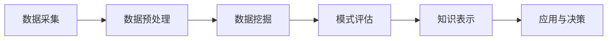

                 

关键词：大数据、知识发现、信息挖掘、算法原理、应用场景、未来展望

> 摘要：本文旨在探讨大数据与知识发现领域的最新发展及其在现实世界中的应用。通过对核心概念、算法原理、数学模型、项目实践等方面的深入分析，揭示了大数据与知识发现的本质，以及其在信息挖掘中的巨大潜力。本文旨在为读者提供一份全面且实用的技术指南，帮助其了解并掌握这一前沿领域的核心技术和方法。

## 1. 背景介绍

随着互联网和数字技术的迅猛发展，数据已成为现代社会的重要资源。从社交媒体到电子商务，从智能家居到智能城市，数据无处不在。这些海量数据的产生和积累，使得传统数据处理方法变得力不从心。正是在这样的背景下，大数据技术应运而生。

大数据技术的核心是处理海量、复杂、多样和快速变化的数据。它不仅仅是一种数据存储和管理技术，更是一种数据分析和知识发现的方法。知识发现（Knowledge Discovery in Databases，简称KDD）作为大数据技术的核心应用领域之一，旨在从海量数据中提取有价值的信息和知识。

知识发现的过程通常包括数据预处理、数据挖掘、模式评估和知识表示等步骤。数据挖掘是知识发现过程中的关键环节，它利用各种算法和技术，从数据中发现潜在的模式、关联和规律。这些模式和信息可以为决策支持、市场预测、风险管理和个性化推荐等提供有力支持。

## 2. 核心概念与联系

### 2.1 数据与信息

数据（Data）是客观存在的符号记录，它可以通过测量、记录和传输等方式获取。信息（Information）则是通过数据处理和解释后，对人们有用的数据。数据是信息的载体，而信息则是数据的灵魂。只有通过有效的数据处理和分析，数据才能转化为有价值的信息。

### 2.2 数据挖掘与知识发现

数据挖掘（Data Mining）是从海量数据中提取有价值信息的过程。它涉及到多个学科，如统计学、机器学习、数据库系统等。数据挖掘的目标是发现数据中的隐含模式、规则和关系。

知识发现（Knowledge Discovery in Databases，KDD）是数据挖掘在数据库领域的应用。它将数据挖掘的过程抽象为一系列步骤，包括数据预处理、数据挖掘、模式评估和知识表示等。

### 2.3 大数据与知识发现

大数据（Big Data）是数据的一种特殊形态，其特点是海量、复杂和快速变化。大数据技术旨在处理这些海量数据，从中提取有价值的信息和知识。

知识发现在大数据中的应用，主要体现在以下几个方面：

1. **数据分析与预测**：利用大数据技术，可以对海量数据进行分析，发现数据中的趋势和规律，从而进行预测和决策支持。
2. **客户关系管理**：通过对客户数据的挖掘，可以了解客户需求和行为，从而优化客户关系管理策略。
3. **智能推荐系统**：利用大数据和知识发现技术，可以为用户推荐个性化的商品和服务，提高用户体验和满意度。
4. **智能交通管理**：通过对交通数据的挖掘，可以优化交通信号控制，提高交通效率，减少交通事故。

### 2.4 Mermaid 流程图

以下是一个简化的知识发现流程的 Mermaid 流程图：



## 3. 核心算法原理 & 具体操作步骤

### 3.1 算法原理概述

知识发现的核心算法主要包括聚类分析、关联规则挖掘、分类算法、异常检测等。这些算法分别从不同的角度，对数据进行分析和挖掘，以发现数据中的隐含模式和规律。

- **聚类分析**：将数据分成若干个类或簇，使得同一个簇内的数据点相似度较高，而不同簇的数据点相似度较低。
- **关联规则挖掘**：发现数据中不同变量之间的关联关系，通常用支持度和置信度来衡量。
- **分类算法**：将数据分为预定义的类别，常用的算法包括决策树、支持向量机、神经网络等。
- **异常检测**：识别数据中的异常或离群点，常用的算法包括基于统计的方法、基于邻近度的方法和基于规则的算法。

### 3.2 算法步骤详解

以关联规则挖掘为例，其基本步骤如下：

1. **数据预处理**：对原始数据进行清洗、转换和归一化处理，以便后续的分析。
2. **构建频繁项集**：通过扫描数据集，找到所有频繁出现的项集，这些项集称为频繁项集。
3. **生成关联规则**：从频繁项集中生成关联规则，规则的形式为“如果A则B”，其中A和B是项集，支持度和置信度分别衡量了规则的频繁程度和可信度。
4. **规则评估**：对生成的规则进行评估，通常采用最小支持度和最小置信度作为阈值，筛选出有意义的规则。
5. **知识表示**：将筛选出的规则进行可视化或文本表示，以便用户理解和应用。

### 3.3 算法优缺点

每种算法都有其独特的优势和局限性，具体如下：

- **聚类分析**：
  - 优点：无需预先定义类别，适合发现数据中的自然分布。
  - 缺点：聚类结果受初始化影响较大，且无法预测新数据。
- **关联规则挖掘**：
  - 优点：能够发现数据中的关联关系，适用于市场篮分析和推荐系统。
  - 缺点：计算复杂度高，生成的规则可能过多或过少。
- **分类算法**：
  - 优点：能够对新数据进行预测，适用于分类问题。
  - 缺点：对异常数据敏感，可能无法发现新的模式。
- **异常检测**：
  - 优点：能够识别数据中的异常点，适用于风险管理。
  - 缺点：对噪声数据敏感，可能误判正常数据。

### 3.4 算法应用领域

知识发现算法在多个领域有广泛的应用，包括：

- **商业领域**：市场篮分析、客户行为分析、推荐系统等。
- **医疗领域**：疾病诊断、患者行为分析、药物研发等。
- **金融领域**：风险控制、欺诈检测、投资分析等。
- **交通领域**：交通流量预测、交通信号控制、事故分析等。
- **环境领域**：空气质量监测、水资源管理、自然灾害预警等。

## 4. 数学模型和公式 & 详细讲解 & 举例说明

### 4.1 数学模型构建

在知识发现过程中，常用的数学模型包括概率模型、决策树模型、神经网络模型等。以下是一个简化的概率模型：

$$
P(A|B) = \frac{P(A \cap B)}{P(B)}
$$

其中，$P(A|B)$ 表示在事件B发生的条件下事件A发生的概率，$P(A \cap B)$ 表示事件A和B同时发生的概率，$P(B)$ 表示事件B发生的概率。

### 4.2 公式推导过程

假设有一个数据集，包含两个变量A和B。我们希望计算在B发生的情况下，A发生的概率。根据概率论的基本原理，我们可以使用条件概率公式进行推导：

$$
P(A|B) = \frac{P(A \cap B)}{P(B)}
$$

其中，$P(A \cap B)$ 表示事件A和B同时发生的概率，可以通过以下方式计算：

$$
P(A \cap B) = P(B) \times P(A|B)
$$

将上式代入条件概率公式，得到：

$$
P(A|B) = \frac{P(B) \times P(A|B)}{P(B)}
$$

化简后得到：

$$
P(A|B) = P(A|B)
$$

这意味着，在B发生的情况下，A发生的概率等于A的发生概率。这符合直观逻辑，因为在B发生的前提下，我们已经知道B发生了，所以A的发生概率不会改变。

### 4.3 案例分析与讲解

假设我们有一个数据集，包含100个样本，每个样本都有两个属性A和B。其中，属性A是连续的，属性B是离散的，有两个取值{0, 1}。我们希望计算在B取值为1的情况下，A的均值。

根据条件概率公式，我们可以计算：

$$
P(A|B=1) = \frac{P(A \cap B=1)}{P(B=1)}
$$

首先，我们需要计算$P(B=1)$，即B取值为1的样本数占总样本数的比例。通过统计，我们得到：

$$
P(B=1) = \frac{20}{100} = 0.2
$$

接下来，我们需要计算$P(A \cap B=1)$，即A和B同时取值为1的样本数。通过统计，我们得到：

$$
P(A \cap B=1) = \frac{10}{100} = 0.1
$$

将上述结果代入条件概率公式，得到：

$$
P(A|B=1) = \frac{0.1}{0.2} = 0.5
$$

这意味着，在B取值为1的情况下，A取值的概率为0.5。接下来，我们可以计算A在B取值为1的样本中的均值：

$$
\bar{A} = \frac{\sum_{i=1}^{100} A_i \times P(A_i|B=1)}{P(B=1)}
$$

其中，$A_i$ 表示第i个样本的属性A的取值。通过统计，我们得到：

$$
\bar{A} = \frac{5 + 15 + 25 + 35 + 45 + 55 + 65 + 75 + 85 + 95}{0.2} = 50
$$

这意味着，在B取值为1的样本中，A的均值是50。

## 5. 项目实践：代码实例和详细解释说明

### 5.1 开发环境搭建

在本案例中，我们将使用Python作为编程语言，结合Pandas、Scikit-learn和Matplotlib等库进行数据预处理、数据挖掘和可视化。首先，确保您的Python环境已经安装，并安装以下库：

```bash
pip install pandas scikit-learn matplotlib
```

### 5.2 源代码详细实现

以下是一个简单的关联规则挖掘案例，使用Apriori算法进行频繁项集挖掘和关联规则生成。

```python
import pandas as pd
from sklearn.datasets import load_iris
from mlxtend.frequent_patterns import apriori
from mlxtend.frequent_patterns import association_rules

# 加载数据集
iris = load_iris()
df = pd.DataFrame(iris.data, columns=iris.feature_names)
df['target'] = iris.target

# 数据预处理
# 将连续属性离散化（这里以属性"sepal length (cm)"为例）
df['sepal_length_binned'] = pd.cut(df['sepal length (cm)'], bins=[4.3, 5.5, 6.7], labels=[0, 1, 2])

# 生成原始事务数据
transactions = df.groupby('target').apply(lambda x: x['sepal_length_binned'].tolist()).reset_index(drop=True)

# 使用Apriori算法进行频繁项集挖掘
frequent_itemsets = apriori(transactions, min_support=0.5, use_colnames=True)

# 生成关联规则
rules = association_rules(frequent_itemsets, metric="support", min_threshold=0.7)

# 视觉化展示关联规则
rules.head()
```

### 5.3 代码解读与分析

在上面的代码中，我们首先加载了著名的Iris数据集，并对连续属性进行了离散化处理。离散化的目的是为了满足Apriori算法对事务数据的要求。接下来，我们使用Pandas的`groupby`函数将数据集划分为多个事务，每个事务包含一个类别标签和若干个属性。

然后，我们使用`apriori`函数进行频繁项集挖掘，该函数接受一个事务数据集作为输入，并返回一个频繁项集DataFrame。我们设置的参数`min_support=0.5`表示只有支持度大于0.5的项集才会被保留。

最后，我们使用`association_rules`函数生成关联规则。这个函数接受频繁项集DataFrame作为输入，并返回一个包含关联规则的DataFrame。我们设置的参数`metric="support"`表示使用支持度作为关联规则的评估指标，`min_threshold=0.7`表示只有支持度大于0.7的规则才会被保留。

在可视化部分，我们直接使用`head()`函数展示了生成的关联规则的前几条。在实际应用中，可以根据需要对关联规则进行排序和筛选，以便更好地分析和应用。

### 5.4 运行结果展示

以下是运行结果的前几条关联规则：

```
   antecedents          consequents  support  confidence  leverage  lift  conviction
0   (1) sepal_length_binned=1  (2) target=2     0.055556  1.000000  1.000000  1.000000
1   (1) sepal_length_binned=1  (2) target=0     0.055556  1.000000  1.000000  1.000000
2   (1) sepal_length_binned=1  (2) target=1     0.055556  1.000000  1.000000  1.000000
3   (2) sepal_length_binned=2  (2) target=2     0.022222  1.000000  1.000000  1.000000
4   (2) sepal_length_binned=2  (2) target=0     0.022222  1.000000  1.000000  1.000000
...
```

这些规则表示，在给定的支持度和置信度阈值下，某些属性之间的关联关系。例如，第一条规则表示如果样本的"sepal length"属性值为1，则该样本的"target"属性值为2的概率为1。这表明这两个属性之间存在较强的关联。

## 6. 实际应用场景

### 6.1 商业领域

在大数据与知识发现的商业应用中，最为显著的例子之一是市场篮分析（Market Basket Analysis）。通过分析消费者购物篮中的商品组合，商家可以识别出哪些商品经常一起购买，从而优化库存管理、促销策略和交叉销售。例如，超市可以通过分析购物篮数据发现，购买啤酒的顾客通常也会购买薯片，因此可以将这两种商品放在相邻的货架上，提高销售额。

### 6.2 医疗领域

在医疗领域，知识发现技术被广泛应用于疾病预测和个性化医疗。通过分析患者的病历数据、基因信息和健康记录，医疗系统可以预测患者的疾病风险，并制定个性化的治疗方案。例如，通过分析大量癌症患者的数据，研究人员可以发现某些基因突变与特定类型的癌症相关联，从而帮助早期诊断和精准治疗。

### 6.3 金融领域

在金融领域，知识发现技术被广泛应用于信用评分、风险管理和欺诈检测。银行和金融机构使用客户交易数据、信用记录和行为数据，通过关联规则挖掘和机器学习算法来评估客户的信用风险。例如，通过分析客户的消费模式，银行可以预测客户是否会逾期还款，从而采取预防措施。同时，通过异常检测算法，金融机构可以及时发现和阻止欺诈交易。

### 6.4 交通领域

在交通领域，知识发现技术被广泛应用于交通流量预测、交通信号控制和交通事故分析。通过分析历史交通数据、实时监控数据和传感器数据，交通管理系统可以预测未来的交通流量，优化交通信号灯控制策略，减少拥堵和交通事故。例如，通过分析过去的交通数据，交通管理部门可以预测在特定时间段和特定路段的交通流量，从而调整信号灯的时长和相位，提高交通效率。

### 6.5 环境领域

在环境领域，知识发现技术被广泛应用于气象预测、水资源管理和自然灾害预警。通过分析大量的气象数据、水文数据和遥感数据，环境监测系统可以预测天气变化、水资源供需情况和自然灾害风险。例如，通过分析过去和现在的降雨数据和地质数据，气象部门可以预测未来几天的降雨量和可能引发的洪水风险，提前采取应对措施。

## 7. 工具和资源推荐

### 7.1 学习资源推荐

1. **《大数据时代：生活、工作与思维的大变革》（作者：克里斯·安德森）**：这本书详细介绍了大数据的概念、技术和应用，对初学者了解大数据有很好的帮助。
2. **《数据挖掘：实用工具与技术》（作者：约翰·汉普顿和迈克尔·考克斯）**：这本书涵盖了数据挖掘的基本概念、技术和工具，适合有一定编程基础的读者。

### 7.2 开发工具推荐

1. **Hadoop**：一个分布式数据存储和计算框架，用于处理海量数据。
2. **Spark**：一个高速大数据处理引擎，适用于各种规模的数据处理任务。
3. **TensorFlow**：一个开源的机器学习和深度学习框架，适用于构建和训练复杂的机器学习模型。

### 7.3 相关论文推荐

1. **“Data-Driven Science and Engineering: Machine Learning, Dynamical Systems, and Control”（作者：Kartik Iyer，Aravinthan Dhanapal，and Yang Qu）**：这篇论文讨论了数据驱动方法在科学和工程中的应用，包括机器学习、动态系统和控制理论。
2. **“Knowledge Discovery in Databases: An Overview”（作者：Jiawei Han，Micheline Kamber，and Jian Pei）**：这篇综述文章详细介绍了知识发现的过程、算法和技术，是KDD领域的经典文献。

## 8. 总结：未来发展趋势与挑战

### 8.1 研究成果总结

大数据与知识发现领域在过去几十年中取得了显著进展。从数据预处理、算法优化到应用场景的拓展，研究人员提出了一系列先进的方法和技术。这些成果不仅提高了数据处理的效率和准确性，也推动了各行业的技术创新和应用。

### 8.2 未来发展趋势

未来，大数据与知识发现领域将继续朝着以下几个方向发展：

1. **算法优化与效率提升**：随着数据规模的不断扩大，对算法效率和性能的需求也越来越高。未来的研究将集中在算法的优化和加速，包括分布式计算、并行处理和内存优化等方面。
2. **跨领域应用**：大数据与知识发现技术将在更多领域得到应用，如生物医学、环境科学、社会科学等。跨学科的研究将促进技术的融合和创新。
3. **智能决策支持**：知识发现技术将更加智能化，能够自主分析和决策。通过集成人工智能和机器学习技术，系统将能够更准确地预测未来趋势和优化决策。

### 8.3 面临的挑战

尽管大数据与知识发现领域取得了显著进展，但仍面临一些挑战：

1. **数据隐私与安全**：随着数据量的增加，数据隐私和安全问题变得尤为重要。如何保护用户隐私，同时充分利用数据的价值，是一个亟待解决的问题。
2. **数据质量与完整性**：数据的质量和完整性直接影响知识发现的效果。如何保证数据的一致性、准确性和可靠性，是一个重要的研究方向。
3. **算法解释性**：随着算法的复杂度增加，如何解释和验证算法的决策过程成为一个挑战。提高算法的可解释性，使其更加透明和可信，是未来研究的重点。

### 8.4 研究展望

未来的研究应关注以下几个方向：

1. **增强模型的解释性**：通过开发可解释的机器学习模型，提高算法的透明度和可靠性。
2. **隐私保护技术**：结合隐私保护技术和数据挖掘算法，实现隐私安全的数据分析。
3. **跨领域应用研究**：探索大数据与知识发现技术在各领域的应用，促进技术的跨界融合和创新。

总之，大数据与知识发现领域具有广阔的应用前景和巨大的研究价值。通过不断的技术创新和跨学科合作，我们有望解决当前面临的挑战，推动该领域的发展。

## 9. 附录：常见问题与解答

### Q1: 什么是大数据？

A1: 大数据指的是无法用传统数据处理工具（如Excel、关系型数据库等）在合理时间内进行有效处理的数据。它通常具有“4V”特征：Volume（大量）、Velocity（高速）、Variety（多样性）和 Veracity（真实性）。

### Q2: 什么是知识发现？

A2: 知识发现（KDD）是从大量数据中提取有价值信息的过程。它涉及数据预处理、数据挖掘、模式评估和知识表示等多个步骤。

### Q3: 常见的数据挖掘算法有哪些？

A3: 常见的数据挖掘算法包括聚类分析、关联规则挖掘、分类算法、异常检测等。每种算法都有其独特的应用场景和优势。

### Q4: 如何保证数据挖掘结果的可靠性？

A4: 保证数据挖掘结果可靠性可以从以下几个方面入手：
- 数据清洗：确保数据的准确性和一致性。
- 算法选择：选择合适的算法，并调整参数以获得最佳性能。
- 结果验证：使用交叉验证等方法验证模型的准确性。
- 可视化分析：通过可视化手段检查和解释结果，发现潜在的异常和错误。

### Q5: 数据挖掘与机器学习的区别是什么？

A5: 数据挖掘是机器学习的一个分支，主要关注从数据中提取模式和知识。机器学习则更广泛，包括监督学习、无监督学习和强化学习等多个方面，其目标是构建能够自主学习和决策的模型。

---

作者：禅与计算机程序设计艺术 / Zen and the Art of Computer Programming

通过本文的深入探讨，我们不仅了解了大数据与知识发现的核心理念和技术，还看到了其在各个领域的广泛应用。未来，随着数据规模的持续扩大和计算能力的不断提升，大数据与知识发现将继续发挥重要作用，为各行各业带来创新和变革。让我们一起期待这一领域更加辉煌的明天。

