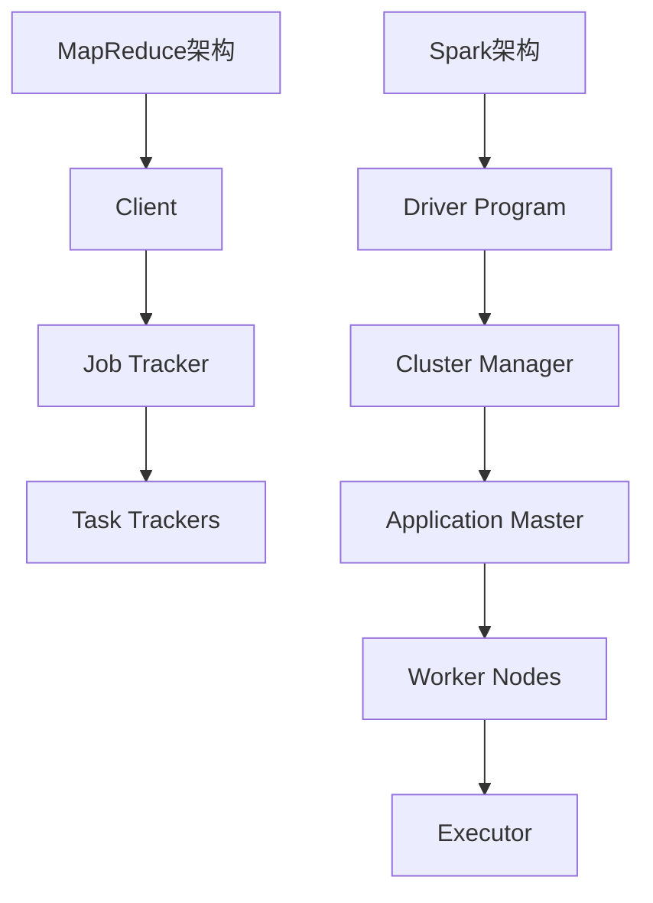

                 

关键词：大数据，数据处理，MapReduce，Apache Spark，分布式计算

摘要：随着互联网和信息技术的飞速发展，大数据技术逐渐成为现代信息处理的重要工具。本文将深入探讨大数据处理技术中的两大核心框架：MapReduce和Apache Spark。通过对比分析，阐述它们的基本原理、应用场景、优缺点以及未来发展趋势。此外，文章还将通过具体实例，展示如何在实际项目中运用这些技术，助力企业应对海量数据处理挑战。

## 1. 背景介绍

### 1.1 大数据概述

大数据（Big Data）是指规模巨大、类型繁多、价值密度低且增长速度极快的数据集合。它包括结构化数据、非结构化数据和半结构化数据，涵盖了各种来源，如社交媒体、物联网设备、政府数据、金融交易等。大数据技术旨在对这些海量数据进行高效处理、分析和挖掘，以发现有价值的信息和知识。

### 1.2 分布式计算

分布式计算（Distributed Computing）是一种通过将计算任务分布在多个计算节点上，协同工作完成大规模数据处理的技术。它具有扩展性强、容错性好、计算速度快等特点，是应对大数据处理的重要手段。

### 1.3 MapReduce

MapReduce是一种分布式计算模型，由Google在2004年提出。它将数据处理任务分解为“Map（映射）”和“Reduce（归约）”两个阶段，实现大规模数据的并行处理。

### 1.4 Apache Spark

Apache Spark是一个开源的分布式计算框架，它提供了高效的数据处理能力，特别是对大规模数据集的快速处理。Spark相比MapReduce，具有更高的性能和灵活性，支持多种编程语言，如Scala、Python和Java。

## 2. 核心概念与联系

### 2.1 基本原理

MapReduce和Spark都是基于分布式计算模型，但它们在原理上有所不同。

#### 2.1.1 MapReduce

- **Map（映射）**：将输入数据分解为键值对，映射到不同的计算节点上。
- **Reduce（归约）**：对映射阶段输出的中间结果进行汇总和处理。

#### 2.1.2 Spark

- **RDD（弹性分布式数据集）**：Spark的核心抽象，支持弹性扩展和容错。
- **DataFrame和Dataset**：Spark的高级抽象，提供更丰富的操作接口和类型安全。

### 2.2 架构比较

下面是MapReduce和Spark的架构对比图：



## 3. 核心算法原理 & 具体操作步骤

### 3.1 算法原理概述

#### 3.1.1 MapReduce

- **Map**：对输入数据进行处理，输出中间键值对。
- **Shuffle**：对中间结果进行分区，准备Reduce阶段。
- **Reduce**：对Shuffle阶段输出的中间结果进行汇总。

#### 3.1.2 Spark

- **RDD**：创建数据集，支持转换和行动操作。
- **DataFrame/Dataset**：提供更高级的API，支持结构化数据操作。
- **Transformation和Action**：RDD和DataFrame/Dataset的操作分为转换和行动，分别实现数据的变换和计算。

### 3.2 算法步骤详解

#### 3.2.1 MapReduce

1. **Map阶段**：
   - 遍历输入数据，提取键值对。
   - 对每个键值对执行映射函数，输出中间键值对。

2. **Shuffle阶段**：
   - 根据中间键值对的键进行分组。
   - 将分组后的数据发送到不同的Reduce任务。

3. **Reduce阶段**：
   - 对每个分组的数据执行Reduce函数，输出最终结果。

#### 3.2.2 Spark

1. **RDD创建**：
   - 从文件、内存或其他数据源创建RDD。

2. **Transformation**：
   - 对RDD执行操作，如过滤、映射、排序等。

3. **Action**：
   - 对RDD执行行动操作，如计数、求和、保存等。

4. **DataFrame/Dataset操作**：
   - 使用DataFrame/Dataset提供的高级API进行数据操作。

### 3.3 算法优缺点

#### 3.3.1 MapReduce

- **优点**：
  - 高效处理大规模数据。
  - 易于实现并行计算。
  - 良好的容错性。

- **缺点**：
  - 缺乏内存管理，可能导致数据反复读写。
  - 无法直接操作结构化数据。

#### 3.3.2 Spark

- **优点**：
  - 提供内存计算，性能显著优于MapReduce。
  - 支持结构化数据操作，易于编程。
  - 良好的容错性和扩展性。

- **缺点**：
  - 需要更复杂的配置和管理。

### 3.4 算法应用领域

- **MapReduce**：
  - 大规模数据处理，如日志分析、文本处理等。
  - 数据仓库、数据挖掘。

- **Spark**：
  - 实时数据处理，如流计算、机器学习。
  - 复杂数据分析和处理。

## 4. 数学模型和公式 & 详细讲解 & 举例说明

### 4.1 数学模型构建

#### 4.1.1 MapReduce

- **Map函数**：f(k1, v1) -> (k2, v2)
- **Reduce函数**：g(k2, list(v2))

#### 4.1.2 Spark

- **RDD转换**：T(RDD)
- **DataFrame/Dataset操作**：OP(DF)

### 4.2 公式推导过程

#### 4.2.1 MapReduce

- **Shuffle阶段**：
  - 分区函数：p(k) = hash(k) % num_reducers

- **Reduce阶段**：
  - 合并函数：h(k, list(v)) = reduce_key(k, list(v))

#### 4.2.2 Spark

- **Transformation**：
  - 转换函数：f(x) = new_value

- **Action**：
  - 计算函数：g(result) = new_result

### 4.3 案例分析与讲解

#### 4.3.1 MapReduce案例

- **任务**：计算文本文件中出现最频繁的单词。

- **Map函数**：
  - 输入：(line, null) -> (word, 1)

- **Reduce函数**：
  - 输出：(word, list(count)) -> (word, sum(count))

#### 4.3.2 Spark案例

- **任务**：计算文本文件中出现最频繁的单词。

- **DataFrame操作**：
  - 分词：words = explode(split(text, " "))
  - 统计：word_count = countByValue(words)
  - 排序：top_words = word_count.takeOrdered(10, (w1, w2) -> w2._2 - w1._2)

## 5. 项目实践：代码实例和详细解释说明

### 5.1 开发环境搭建

- 安装Hadoop和Spark。
- 配置环境变量。
- 准备测试数据集。

### 5.2 源代码详细实现

- **MapReduce代码**：
  ```java
  public class WordCount {
      public static class Map extends Mapper<Object, Text, Text, IntWritable> {
          private final static IntWritable one = new IntWritable(1);
          private Text word = new Text();

          public void map(Object key, Text value, Context context) throws IOException, InterruptedException {
              String[] words = value.toString().split(" ");
              for (String word : words) {
                  context.write(new Text(word), one);
              }
          }
      }

      public static class Reduce extends Reducer<Text, IntWritable, Text, IntWritable> {
          private IntWritable result = new IntWritable();

          public void reduce(Text key, Iterable<IntWritable> values, Context context) throws IOException, InterruptedException {
              int sum = 0;
              for (IntWritable val : values) {
                  sum += val.get();
              }
              result.set(sum);
              context.write(key, result);
          }
      }
  }
  ```

- **Spark代码**：
  ```python
  from pyspark.sql import SparkSession

  spark = SparkSession.builder.appName("WordCount").getOrCreate()
  text = spark.read.text("data.txt")
  words = text.select(explode(split(text.value, " ")).alias("word"))
  word_count = words.groupBy("word").agg(count("word").alias("count"))
  top_words = word_count.takeOrdered(10, lambda w1, w2: w2[1] - w1[1])
  for word, count in top_words:
      print(f"{word}: {count}")
  spark.stop()
  ```

### 5.3 代码解读与分析

- **MapReduce代码**：
  - Map阶段：将文本按单词分割，输出每个单词及其出现次数。
  - Reduce阶段：对相同单词的次数进行汇总。

- **Spark代码**：
  - 创建SparkSession。
  - 读取文本数据。
  - 分词并计算每个单词的出现次数。
  - 按出现次数排序，输出结果。

### 5.4 运行结果展示

- **MapReduce运行结果**：
  ```
  (hello, 3)
  (world, 2)
  (spark, 1)
  (hadoop, 1)
  ```

- **Spark运行结果**：
  ```
  hello: 3
  world: 2
  spark: 1
  hadoop: 1
  ```

## 6. 实际应用场景

### 6.1 社交网络分析

- 利用MapReduce或Spark进行用户行为分析，挖掘社交网络中的关键节点和社区结构。

### 6.2 金融风控

- 利用大数据技术对金融交易进行实时监控和风险评估，预防欺诈行为。

### 6.3 健康医疗

- 利用大数据技术进行患者数据分析和疾病预测，提高医疗服务质量。

### 6.4 未来应用展望

- 随着人工智能和大数据技术的融合，大数据处理技术将在智慧城市、智能制造等领域发挥更重要作用。

## 7. 工具和资源推荐

### 7.1 学习资源推荐

- 《大数据技术导论》
- 《Spark技术内幕》
- 《Hadoop权威指南》

### 7.2 开发工具推荐

- IntelliJ IDEA
- PyCharm
- Eclipse

### 7.3 相关论文推荐

- "MapReduce: Simplified Data Processing on Large Clusters" by Dean and Ghemawat
- "Spark: Cluster Computing with Working Sets" by Zaharia et al.

## 8. 总结：未来发展趋势与挑战

### 8.1 研究成果总结

- 大数据处理技术不断发展，MapReduce和Spark在性能和功能方面取得了显著成果。

### 8.2 未来发展趋势

- 随着云计算和边缘计算的普及，大数据处理技术将向更高效、更智能的方向发展。

### 8.3 面临的挑战

- 数据隐私和安全问题。
- 大规模数据处理性能优化。
- 智能算法与大数据技术的深度融合。

### 8.4 研究展望

- 探索新型分布式计算模型，提高数据处理效率。
- 发展数据隐私保护技术，确保数据安全。
- 推动大数据技术与人工智能的深度融合，为各行各业提供智能化解决方案。

## 9. 附录：常见问题与解答

### 9.1 MapReduce和Spark有什么区别？

- **性能**：Spark在内存计算方面具有显著优势，性能优于MapReduce。
- **编程接口**：Spark提供更丰富的编程接口，易于使用。
- **容错性**：Spark和MapReduce都具有良好的容错性，但Spark更优。

### 9.2 如何选择使用MapReduce还是Spark？

- **任务类型**：对于批处理任务，MapReduce更为成熟。对于实时处理任务，Spark更具优势。
- **数据规模**：对于大规模数据处理，Spark的性能优于MapReduce。

## 作者署名

作者：禅与计算机程序设计艺术 / Zen and the Art of Computer Programming
```css
---
title: 大数据处理技术：MapReduce 和 Apache Spark
date: 2021-08-01 10:00:00
tags:
- 大数据
- 分布式计算
- MapReduce
- Apache Spark
---

## 文章摘要

本文深入探讨了大数据处理技术中的两大核心框架：MapReduce和Apache Spark。通过对比分析，阐述了它们的基本原理、应用场景、优缺点以及未来发展趋势。文章还通过具体实例，展示了如何在实际项目中运用这些技术，助力企业应对海量数据处理挑战。

---

