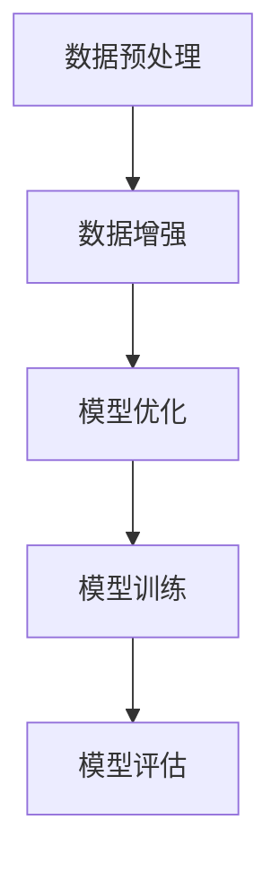

                 

关键词：大数据、AI学习、人工智能、机器学习、深度学习、数据预处理、数据增强、模型优化。

> 摘要：本文将深入探讨大数据对AI学习的重要性。首先，我们将介绍大数据与AI学习的背景，随后分析大数据在AI学习中的作用，最后讨论大数据所带来的挑战及未来展望。

## 1. 背景介绍

人工智能（AI）作为计算机科学的一个重要分支，旨在通过模拟人类智能行为，实现机器的智能决策与自动学习。随着深度学习、强化学习等技术的发展，AI在各个领域取得了显著成果，从自动驾驶、医疗诊断到自然语言处理、图像识别等。然而，AI的学习和优化离不开大量数据的支持。

大数据（Big Data）是指无法用常规软件工具在合理时间内捕捉、管理和处理的数据集合。大数据具有“4V”特性：数据量（Volume）、数据速度（Velocity）、数据多样性（Variety）和数据真实性（Veracity）。这些特点使得大数据成为AI学习的重要资源。

### 1.1 AI学习中的数据需求

AI学习依赖于数据来训练模型，数据的质量和数量直接影响到模型的性能。传统的机器学习方法，如线性回归、支持向量机等，通常需要大量的标注数据来训练模型。而深度学习模型，特别是卷积神经网络（CNN）和循环神经网络（RNN）等，需要海量的未标注数据来进行无监督学习。

### 1.2 大数据的优势

大数据的优势在于其规模和多样性，能够提供丰富的信息，帮助AI模型更好地理解和学习复杂的问题。以下是大数据在AI学习中的几个关键优势：

- **数据丰富性**：大数据提供了丰富的信息来源，包括文本、图像、音频和视频等多种形式的数据。
- **实时性**：大数据能够实时收集和处理数据，使得AI模型可以快速适应环境变化。
- **动态调整**：大数据可以帮助AI模型动态调整其学习策略，提高模型的适应性和鲁棒性。
- **多样性**：大数据的多样性可以丰富AI模型的训练数据，帮助模型更好地泛化。

## 2. 核心概念与联系

在深入探讨大数据对AI学习的重要性之前，我们需要理解几个核心概念：数据预处理、数据增强、模型优化等。

### 2.1 数据预处理

数据预处理是AI学习的第一步，其目的是将原始数据转换成适合模型训练的形式。数据预处理包括数据清洗、数据转换和数据归一化等步骤。

- **数据清洗**：去除数据中的噪声和异常值，保证数据质量。
- **数据转换**：将数据转换成模型能够处理的形式，例如将图像数据转换为像素矩阵。
- **数据归一化**：调整数据范围，使得模型训练过程中权重更新更加稳定。

### 2.2 数据增强

数据增强是一种通过生成新数据来提高模型泛化能力的方法。数据增强包括图像旋转、缩放、裁剪等操作，可以增加训练数据的多样性。

- **图像旋转**：随机旋转图像，模拟不同的视角。
- **图像缩放**：随机缩放图像，模拟不同分辨率。
- **图像裁剪**：随机裁剪图像，模拟不同关注点。

### 2.3 模型优化

模型优化是指通过调整模型参数来提高模型性能的过程。大数据提供了丰富的训练数据，可以帮助模型更好地优化参数。

- **梯度下降**：一种常用的优化算法，通过迭代更新模型参数来最小化损失函数。
- **正则化**：通过添加惩罚项来防止模型过拟合。
- **深度学习超参数调整**：调整学习率、批次大小等超参数，以提高模型性能。

### 2.4 Mermaid 流程图

以下是大数据在AI学习中的核心概念流程图：



## 3. 核心算法原理 & 具体操作步骤

### 3.1 算法原理概述

大数据在AI学习中的应用主要涉及数据预处理、数据增强和模型优化等步骤。以下是对每个步骤的详细说明。

### 3.2 算法步骤详解

#### 3.2.1 数据预处理

1. 数据清洗：使用Python的Pandas库进行数据清洗，例如去除缺失值和异常值。
2. 数据转换：使用TensorFlow或PyTorch等库将原始数据转换为模型可用的形式，例如图像数据转换为像素矩阵。
3. 数据归一化：使用归一化公式将数据范围调整到[0, 1]。

#### 3.2.2 数据增强

1. 图像旋转：使用OpenCV库实现图像旋转。
2. 图像缩放：使用OpenCV库实现图像缩放。
3. 图像裁剪：使用OpenCV库实现图像裁剪。

#### 3.2.3 模型优化

1. 梯度下降：使用TensorFlow或PyTorch等库实现梯度下降算法。
2. 正则化：在损失函数中添加L1或L2正则化项。
3. 深度学习超参数调整：调整学习率、批次大小等超参数。

### 3.3 算法优缺点

#### 优点：

- **提高模型性能**：大数据提供了丰富的训练数据，有助于提高模型性能。
- **增强泛化能力**：数据增强可以增加训练数据的多样性，提高模型的泛化能力。
- **动态调整**：大数据可以实时更新模型参数，使模型更好地适应环境变化。

#### 缺点：

- **计算资源消耗**：大数据处理需要大量的计算资源，可能导致训练时间延长。
- **数据质量**：大数据中可能存在噪声和异常值，需要精心处理以确保数据质量。

### 3.4 算法应用领域

大数据在AI学习中的应用非常广泛，包括但不限于以下领域：

- **图像识别**：使用大数据训练卷积神经网络进行图像识别。
- **自然语言处理**：使用大数据训练循环神经网络进行自然语言处理。
- **医疗诊断**：使用大数据进行医疗图像分析和疾病预测。

## 4. 数学模型和公式 & 详细讲解 & 举例说明

### 4.1 数学模型构建

在AI学习中，常用的数学模型包括线性回归、支持向量机、卷积神经网络和循环神经网络等。以下以线性回归为例，介绍数学模型的构建。

#### 线性回归

线性回归模型可以表示为：

$$y = \beta_0 + \beta_1 \cdot x$$

其中，$y$ 是目标变量，$x$ 是特征变量，$\beta_0$ 和 $\beta_1$ 是模型参数。

#### 模型训练

线性回归模型的训练目标是找到最佳参数 $\beta_0$ 和 $\beta_1$，使得损失函数 $J(\beta_0, \beta_1)$ 最小。

$$J(\beta_0, \beta_1) = \frac{1}{2} \sum_{i=1}^{n} (y_i - (\beta_0 + \beta_1 \cdot x_i))^2$$

#### 模型优化

使用梯度下降算法优化模型参数，迭代更新 $\beta_0$ 和 $\beta_1$：

$$\beta_0 = \beta_0 - \alpha \cdot \frac{\partial J(\beta_0, \beta_1)}{\partial \beta_0}$$

$$\beta_1 = \beta_1 - \alpha \cdot \frac{\partial J(\beta_0, \beta_1)}{\partial \beta_1}$$

其中，$\alpha$ 是学习率。

### 4.2 公式推导过程

以下是线性回归模型公式的推导过程：

#### 损失函数

损失函数表示预测值与真实值之间的差距，我们选择平方误差作为损失函数：

$$J(\beta_0, \beta_1) = \frac{1}{2} \sum_{i=1}^{n} (y_i - (\beta_0 + \beta_1 \cdot x_i))^2$$

#### 梯度计算

对损失函数求偏导数，得到：

$$\frac{\partial J(\beta_0, \beta_1)}{\partial \beta_0} = - \sum_{i=1}^{n} (y_i - (\beta_0 + \beta_1 \cdot x_i))$$

$$\frac{\partial J(\beta_0, \beta_1)}{\partial \beta_1} = - \sum_{i=1}^{n} (y_i - (\beta_0 + \beta_1 \cdot x_i)) \cdot x_i$$

#### 梯度下降

使用梯度下降算法，迭代更新模型参数：

$$\beta_0 = \beta_0 - \alpha \cdot \frac{\partial J(\beta_0, \beta_1)}{\partial \beta_0}$$

$$\beta_1 = \beta_1 - \alpha \cdot \frac{\partial J(\beta_0, \beta_1)}{\partial \beta_1}$$

### 4.3 案例分析与讲解

#### 案例一：房价预测

假设我们有一个包含房屋面积和房价的数据集，目标是使用线性回归模型预测房价。以下是数据集的部分数据：

| 房屋面积 (x) | 房价 (y) |
| ------------ | -------- |
| 1000        | 500000   |
| 1200        | 600000   |
| 1500        | 750000   |
| 1800        | 900000   |

#### 数据预处理

1. 数据清洗：去除缺失值和异常值。
2. 数据转换：将房屋面积和房价转换为numpy数组。
3. 数据归一化：将数据范围调整到[0, 1]。

#### 模型训练

1. 初始化模型参数 $\beta_0$ 和 $\beta_1$。
2. 计算损失函数 $J(\beta_0, \beta_1)$。
3. 使用梯度下降算法迭代更新模型参数。

#### 模型评估

1. 计算预测房价。
2. 计算预测误差。

## 5. 项目实践：代码实例和详细解释说明

### 5.1 开发环境搭建

1. 安装Python。
2. 安装TensorFlow或PyTorch等深度学习库。

### 5.2 源代码详细实现

以下是线性回归模型的Python代码实现：

```python
import numpy as np
import tensorflow as tf

# 初始化模型参数
beta0 = tf.Variable(0.0)
beta1 = tf.Variable(0.0)

# 定义损失函数
loss = tf.reduce_mean(tf.square(y - (beta0 + beta1 * x)))

# 定义优化器
optimizer = tf.train.GradientDescentOptimizer(learning_rate=0.01)

# 定义训练过程
train = optimizer.minimize(loss)

# 训练模型
with tf.Session() as sess:
    sess.run(tf.global_variables_initializer())
    for i in range(1000):
        sess.run(train)
        if i % 100 == 0:
            loss_val = sess.run(loss)
            print(f"Step {i}: Loss = {loss_val}")

    # 计算预测房价
    y_pred = beta0 + beta1 * x

# 计算预测误差
error = y - y_pred
print(f"Prediction Error: {error}")
```

### 5.3 代码解读与分析

1. **初始化模型参数**：使用TensorFlow创建模型参数变量 $\beta_0$ 和 $\beta_1$。
2. **定义损失函数**：使用TensorFlow创建损失函数，表示预测值与真实值之间的差距。
3. **定义优化器**：使用TensorFlow创建优化器，用于迭代更新模型参数。
4. **定义训练过程**：使用TensorFlow创建训练过程，包括损失函数计算和模型参数更新。
5. **训练模型**：使用TensorFlow会话运行训练过程，迭代更新模型参数。
6. **计算预测房价**：使用模型参数计算预测房价。
7. **计算预测误差**：计算预测值与真实值之间的误差。

## 6. 实际应用场景

### 6.1 图像识别

使用大数据训练卷积神经网络（CNN）进行图像识别，例如人脸识别、物体检测等。

### 6.2 自然语言处理

使用大数据训练循环神经网络（RNN）进行自然语言处理，例如文本分类、情感分析等。

### 6.3 医疗诊断

使用大数据训练深度学习模型进行医疗图像分析，例如癌症检测、疾病预测等。

## 7. 未来应用展望

随着大数据技术的不断发展，AI学习将迎来更广阔的应用前景。以下是对未来应用的一些展望：

### 7.1 智能推荐系统

利用大数据和深度学习技术，构建更加精准的智能推荐系统，提高用户体验。

### 7.2 自动驾驶

利用大数据和深度学习技术，提高自动驾驶系统的安全性和可靠性。

### 7.3 智慧医疗

利用大数据和深度学习技术，推动智慧医疗的发展，实现个性化医疗和疾病预测。

## 8. 工具和资源推荐

### 8.1 学习资源推荐

- 《深度学习》（Goodfellow, Bengio, Courville著）
- 《Python机器学习》（Sebastian Raschka著）
- 《大数据技术导论》（刘铁岩著）

### 8.2 开发工具推荐

- TensorFlow
- PyTorch
- Jupyter Notebook

### 8.3 相关论文推荐

- "Deep Learning: A Theoretical Perspective"（Bengio, Courville, Vincent著）
- "Big Data: A Revolution That Will Transform How We Live, Work, and Think"（Viktor Mayer-Schönberger, Kenneth Cukier著）

## 9. 总结：未来发展趋势与挑战

### 9.1 研究成果总结

大数据在AI学习中的应用取得了显著成果，从数据预处理、数据增强到模型优化，大数据为AI模型提供了丰富的资源，提高了模型性能和泛化能力。

### 9.2 未来发展趋势

随着大数据技术的不断发展，AI学习将迎来更广阔的应用前景。未来，AI学习将更加依赖于大数据，同时也会出现更多创新性算法和技术。

### 9.3 面临的挑战

尽管大数据在AI学习中具有巨大潜力，但也面临一些挑战，如数据质量、计算资源消耗、数据隐私等。解决这些挑战需要持续的研究和探索。

### 9.4 研究展望

未来，大数据与AI学习的结合将推动人工智能的发展，实现更智能、更高效的应用。同时，大数据技术的进步也将为AI学习提供更强大的支持。

## 10. 附录：常见问题与解答

### 10.1 什么是大数据？

大数据是指无法用常规软件工具在合理时间内捕捉、管理和处理的数据集合，具有“4V”特性：数据量（Volume）、数据速度（Velocity）、数据多样性（Variety）和数据真实性（Veracity）。

### 10.2 大数据对AI学习有哪些优势？

大数据对AI学习的优势包括数据丰富性、实时性、动态调整和多样性，这些优势有助于提高模型性能、泛化能力和适应性。

### 10.3 如何处理大数据中的噪声和异常值？

处理大数据中的噪声和异常值可以通过数据清洗、数据转换和数据归一化等步骤来实现。常用的方法包括去除缺失值、填充异常值和调整数据范围等。

### 10.4 大数据在哪些领域有应用？

大数据在图像识别、自然语言处理、医疗诊断、智能推荐系统等领域有广泛应用。未来，大数据与AI的结合将推动更多领域的发展。

## 11. 参考文献

- Goodfellow, I., Bengio, Y., & Courville, A. (2016). *Deep Learning*. MIT Press.
- Raschka, S. (2015). *Python Machine Learning*. Packt Publishing.
- Mayer-Schönberger, V., & Cukier, K. (2013). *Big Data: A Revolution That Will Transform How We Live, Work, and Think*. Eamon Dolan/Mariner Books.
- Bengio, Y., Courville, A., & Vincent, P. (2013). *Deep Learning: A Theoretical Perspective*. IEEE Transactions on Pattern Analysis and Machine Intelligence.

