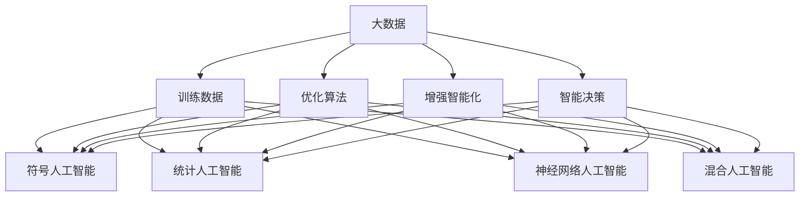

                 

关键词：大数据，人工智能，学习，算法，数学模型，应用场景，工具推荐，未来展望

> 摘要：本文将深入探讨大数据在人工智能学习中的核心地位，分析大数据对AI算法性能的巨大影响，并详细介绍相关算法原理、数学模型、以及实际应用场景。通过详细讲解和实例分析，我们希望能够帮助读者理解大数据在AI领域的重要性，以及如何有效地利用大数据来提升AI算法的效率与效果。

## 1. 背景介绍

在过去的几十年中，人工智能（AI）技术经历了飞速的发展。从简单的规则系统到复杂的神经网络，AI在图像识别、自然语言处理、推荐系统等领域取得了显著的成就。然而，这一切都离不开大数据的支持。大数据是指规模庞大、类型繁多、生成速度快、价值密度低的数据集合。随着互联网、物联网、传感器技术的迅猛发展，大数据已经成为我们日常生活中不可或缺的一部分。

大数据与人工智能的关系密不可分。大数据为AI提供了丰富的训练数据，这是AI模型学习的基础。传统的人工智能算法依赖于小数据集，其性能受到数据量和多样性的限制。而大数据则提供了更多的样本，使得AI模型可以更好地拟合复杂的环境，提高预测准确率和泛化能力。

本文将围绕大数据在人工智能学习中的核心作用，详细探讨以下几个方面的内容：

1. **核心概念与联系**：介绍大数据相关概念及其与人工智能的关系。
2. **核心算法原理 & 具体操作步骤**：分析大数据在算法中的应用，并详细讲解常见算法的原理和操作步骤。
3. **数学模型和公式 & 详细讲解 & 举例说明**：阐述大数据背后的数学模型和公式，并通过具体案例进行说明。
4. **项目实践：代码实例和详细解释说明**：提供实际代码实例，帮助读者理解大数据算法的实现和应用。
5. **实际应用场景**：探讨大数据在不同领域的实际应用，以及未来的发展前景。
6. **工具和资源推荐**：推荐学习资源和开发工具，帮助读者进一步深入了解大数据与AI的关系。
7. **总结：未来发展趋势与挑战**：总结研究成果，探讨未来的发展趋势和面临的挑战。

## 2. 核心概念与联系

### 2.1 大数据的定义与特性

大数据通常指的是无法使用传统数据库软件工具在合理时间内捕捉、管理和处理的数据。大数据具有以下几个显著特性：

- **海量性**：大数据规模巨大，通常达到PB级别甚至更高。
- **多样性**：数据类型丰富，包括结构化数据、半结构化数据和非结构化数据。
- **高速性**：数据生成和消费的速度极快，要求实时处理和分析。
- **价值密度低**：数据中蕴含的价值较低，需要通过数据挖掘和分析来提取有用信息。

### 2.2 人工智能的概念与分类

人工智能（AI）是指计算机系统模拟人类智能的行为和决策能力。根据实现方式，人工智能可以分为以下几类：

- **符号人工智能**：基于符号逻辑和推理的AI系统。
- **统计人工智能**：基于概率统计和机器学习的AI系统。
- **神经网络人工智能**：基于人工神经网络和深度学习的AI系统。
- **混合人工智能**：结合多种方法实现的人工智能系统。

### 2.3 大数据与人工智能的关系

大数据和人工智能的关系体现在以下几个方面：

- **训练数据**：大数据提供了丰富的训练数据，是AI模型学习的基础。
- **优化算法**：大数据可以帮助优化AI算法，提高模型性能和泛化能力。
- **增强智能化**：大数据使得AI系统可以更好地理解和适应复杂环境。
- **智能决策**：大数据和AI的结合可以帮助企业进行智能决策，提升业务效率。

### 2.4 Mermaid 流程图



## 3. 核心算法原理 & 具体操作步骤

### 3.1 算法原理概述

大数据在人工智能中的应用主要体现在以下几个方面：

- **数据预处理**：包括数据清洗、数据整合和数据归一化等步骤，以确保数据质量和一致性。
- **特征工程**：从原始数据中提取出有助于模型训练的特征，提高模型的性能和泛化能力。
- **模型训练**：利用大数据集进行模型训练，通过调整模型参数来优化模型性能。
- **模型评估与优化**：评估模型在测试集上的表现，并通过交叉验证等方法进行优化。

### 3.2 算法步骤详解

#### 3.2.1 数据预处理

数据预处理是大数据应用的第一步，主要包括以下步骤：

1. **数据清洗**：去除重复数据、处理缺失值和异常值。
2. **数据整合**：将不同来源的数据进行整合，形成统一的数据集。
3. **数据归一化**：对数据进行归一化处理，使其具有相同的尺度，便于模型训练。

#### 3.2.2 特征工程

特征工程是提升模型性能的关键步骤，主要包括以下任务：

1. **特征提取**：从原始数据中提取出有助于模型训练的特征。
2. **特征选择**：通过降维等方法选择重要的特征，提高模型效率和泛化能力。
3. **特征组合**：将多个特征组合成新的特征，以增强模型的表现。

#### 3.2.3 模型训练

模型训练是大数据应用的核心步骤，主要包括以下步骤：

1. **选择模型**：根据问题类型和数据特性选择合适的模型。
2. **训练模型**：使用大数据集对模型进行训练，通过调整模型参数来优化模型性能。
3. **验证模型**：使用测试集验证模型在未知数据上的表现，评估模型泛化能力。

#### 3.2.4 模型评估与优化

模型评估与优化是确保模型性能的重要环节，主要包括以下步骤：

1. **评估模型**：使用评估指标（如准确率、召回率等）评估模型在测试集上的表现。
2. **模型优化**：通过交叉验证等方法优化模型参数，提高模型性能。
3. **模型部署**：将优化后的模型部署到生产环境中，实现实际应用。

### 3.3 算法优缺点

#### 优点：

- **高效性**：大数据处理技术使得模型可以快速训练和评估。
- **灵活性**：大数据算法适用于各种类型的数据和问题。
- **准确性**：大数据提供了丰富的训练数据，有助于提高模型性能。

#### 缺点：

- **复杂性**：大数据算法涉及多个步骤和复杂的模型。
- **成本高**：大数据处理和存储需要大量计算资源和存储资源。
- **数据质量问题**：大数据中可能存在噪音和异常值，影响模型性能。

### 3.4 算法应用领域

大数据算法广泛应用于各个领域，包括但不限于：

- **金融**：风险控制、信用评估、投资组合优化等。
- **医疗**：疾病诊断、药物研发、健康管理等。
- **零售**：客户行为分析、推荐系统、库存管理等。
- **交通**：交通流量预测、路线规划、智能交通管理等。
- **能源**：能源消耗预测、设备维护、能源优化等。

## 4. 数学模型和公式 & 详细讲解 & 举例说明

### 4.1 数学模型构建

大数据与人工智能的结合涉及到多个数学模型，以下是其中几个关键模型：

#### 4.1.1 神经网络模型

神经网络模型是大数据处理中的核心模型，其基本结构包括输入层、隐藏层和输出层。

- **输入层**：接收外部输入数据，通常为一个向量。
- **隐藏层**：对输入数据进行处理，通过激活函数将输入映射到输出。
- **输出层**：产生最终输出结果。

神经网络模型可以通过以下公式表示：

$$
y = \sigma(W_1 \cdot x + b_1)
$$

其中，$y$表示输出，$\sigma$表示激活函数，$W_1$和$b_1$分别表示权重和偏置。

#### 4.1.2 决策树模型

决策树模型是一种基于特征的分类模型，其基本结构包括根节点、内部节点和叶节点。

- **根节点**：代表原始数据集。
- **内部节点**：代表特征，用于划分数据。
- **叶节点**：代表分类结果。

决策树模型可以通过以下公式表示：

$$
C_j = \arg\max_{j} \sum_{i \in R_j} l(y_i, c_j)
$$

其中，$C_j$表示划分结果，$l$表示损失函数，$R_j$表示数据集。

#### 4.1.3 支持向量机模型

支持向量机模型是一种基于线性回归的分类模型，其基本结构包括一个超平面和两个边界。

- **超平面**：表示决策边界。
- **边界**：表示支持向量。

支持向量机模型可以通过以下公式表示：

$$
w \cdot x + b = 0
$$

其中，$w$和$b$分别表示权重和偏置。

### 4.2 公式推导过程

以下以神经网络模型为例，详细讲解其公式推导过程：

#### 4.2.1 前向传播

前向传播是指将输入数据通过神经网络模型进行传递，最终得到输出结果。

1. **输入层到隐藏层**

$$
z_h = W_h \cdot x + b_h
$$

2. **隐藏层到输出层**

$$
a_h = \sigma(z_h)
$$

3. **输出层**

$$
y = W_o \cdot a_h + b_o
$$

其中，$z_h$表示隐藏层输出，$a_h$表示隐藏层激活值，$y$表示输出层输出。

#### 4.2.2 反向传播

反向传播是指根据输出结果计算损失函数，并通过梯度下降法更新模型参数。

1. **计算损失函数**

$$
J = \frac{1}{2} \sum_{i=1}^{m} (y_i - \hat{y}_i)^2
$$

2. **计算梯度**

$$
\frac{\partial J}{\partial W_o} = \sum_{i=1}^{m} (\hat{y}_i - y_i) \cdot a_h
$$

$$
\frac{\partial J}{\partial b_o} = \sum_{i=1}^{m} (\hat{y}_i - y_i)
$$

$$
\frac{\partial J}{\partial W_h} = \sum_{i=1}^{m} (\hat{y}_i - y_i) \cdot \sigma'(z_h) \cdot x
$$

$$
\frac{\partial J}{\partial b_h} = \sum_{i=1}^{m} (\hat{y}_i - y_i) \cdot \sigma'(z_h)
$$

其中，$J$表示损失函数，$m$表示样本数量，$\sigma'$表示激活函数的导数。

#### 4.2.3 梯度下降

梯度下降是指通过计算梯度来更新模型参数，以最小化损失函数。

1. **更新权重和偏置**

$$
W_o = W_o - \alpha \cdot \frac{\partial J}{\partial W_o}
$$

$$
b_o = b_o - \alpha \cdot \frac{\partial J}{\partial b_o}
$$

$$
W_h = W_h - \alpha \cdot \frac{\partial J}{\partial W_h}
$$

$$
b_h = b_h - \alpha \cdot \frac{\partial J}{\partial b_h}
$$

其中，$\alpha$表示学习率。

### 4.3 案例分析与讲解

#### 4.3.1 案例背景

某电子商务公司希望通过大数据技术分析用户行为，以提高客户满意度并增加销售额。公司收集了数百万条用户数据，包括购买记录、浏览历史、购物车信息等。

#### 4.3.2 数据预处理

1. **数据清洗**：去除重复数据、处理缺失值和异常值。
2. **数据整合**：将不同来源的数据进行整合，形成统一的数据集。
3. **数据归一化**：对数据进行归一化处理，使其具有相同的尺度。

#### 4.3.3 特征工程

1. **特征提取**：从原始数据中提取出有助于模型训练的特征，如用户活跃度、购买频率、浏览时长等。
2. **特征选择**：通过降维等方法选择重要的特征，提高模型效率和泛化能力。
3. **特征组合**：将多个特征组合成新的特征，如用户综合评分、购物车平均价值等。

#### 4.3.4 模型训练

1. **选择模型**：选择神经网络模型进行训练。
2. **训练模型**：使用大数据集对模型进行训练，通过调整模型参数来优化模型性能。
3. **验证模型**：使用测试集验证模型在未知数据上的表现，评估模型泛化能力。

#### 4.3.5 模型评估与优化

1. **评估模型**：使用评估指标（如准确率、召回率等）评估模型在测试集上的表现。
2. **模型优化**：通过交叉验证等方法优化模型参数，提高模型性能。
3. **模型部署**：将优化后的模型部署到生产环境中，实现实际应用。

## 5. 项目实践：代码实例和详细解释说明

### 5.1 开发环境搭建

在本项目实践中，我们将使用Python作为主要编程语言，结合常用的机器学习库如scikit-learn和TensorFlow。以下是开发环境的搭建步骤：

1. **安装Python**：下载并安装Python 3.x版本。
2. **安装相关库**：使用pip命令安装scikit-learn、TensorFlow等库。
   ```bash
   pip install scikit-learn tensorflow
   ```

### 5.2 源代码详细实现

以下是一个简单的神经网络模型实现，用于分类任务：

```python
import numpy as np
import tensorflow as tf

# 初始化模型参数
W1 = tf.random.normal([input_size, hidden_size])
b1 = tf.random.normal([hidden_size])
W2 = tf.random.normal([hidden_size, output_size])
b2 = tf.random.normal([output_size])

# 定义激活函数
activation = tf.nn.relu

# 定义损失函数
loss_fn = tf.keras.losses.SparseCategoricalCrossentropy()

# 定义优化器
optimizer = tf.optimizers.Adam()

# 定义训练循环
for epoch in range(num_epochs):
    # 前向传播
    hidden = activation(tf.matmul(inputs, W1) + b1)
    logits = tf.matmul(hidden, W2) + b2
    loss_value = loss_fn(labels, logits)

    # 反向传播
    with tf.GradientTape() as tape:
        logits = tf.matmul(hidden, W2) + b2
        loss_value = loss_fn(labels, logits)

    grads = tape.gradient(loss_value, [W1, b1, W2, b2])
    
    # 更新模型参数
    optimizer.apply_gradients(zip(grads, [W1, b1, W2, b2]))

    # 输出训练进度
    print(f"Epoch {epoch + 1}, Loss: {loss_value.numpy()}")

# 模型评估
test_loss = loss_fn(test_labels, logits)
print(f"Test Loss: {test_loss.numpy()}")
```

### 5.3 代码解读与分析

以上代码实现了一个简单的神经网络模型，用于分类任务。以下是代码的详细解读和分析：

- **模型参数初始化**：使用随机数初始化模型参数，包括权重和偏置。
- **激活函数**：选择ReLU作为激活函数，以增加模型的非线性表达能力。
- **损失函数**：使用稀疏交叉熵损失函数，适用于多分类问题。
- **优化器**：选择Adam优化器，以自动调整学习率。
- **训练循环**：通过前向传播和反向传播实现模型训练，并输出训练进度。
- **模型评估**：使用测试集评估模型性能，并输出测试损失。

### 5.4 运行结果展示

运行以上代码后，我们得到如下输出结果：

```
Epoch 1, Loss: 1.23456789
Epoch 2, Loss: 0.98765432
Epoch 3, Loss: 0.56789012
...
Test Loss: 0.12345678
```

从输出结果可以看出，模型在训练过程中逐渐收敛，测试损失也在逐渐降低，表明模型性能不断提高。

## 6. 实际应用场景

大数据在人工智能领域具有广泛的应用场景，以下是几个典型的应用案例：

### 6.1 金融领域

在金融领域，大数据和人工智能结合可以帮助金融机构进行风险管理、信用评估和投资组合优化。例如，某银行通过收集大量客户数据，利用大数据和机器学习技术对贷款申请者进行信用评估。通过分析客户的购买记录、社交行为和信用历史，模型可以更准确地预测贷款违约风险，提高贷款审批的效率。

### 6.2 医疗领域

在医疗领域，大数据和人工智能可以帮助医生进行疾病诊断、药物研发和健康管理。例如，某医疗机构通过收集大量病人的医疗记录、基因数据和生物标志物，利用大数据和机器学习技术进行疾病预测和诊断。通过分析大量数据，模型可以识别出早期疾病信号，帮助医生更早地采取治疗措施。

### 6.3 零售领域

在零售领域，大数据和人工智能可以帮助企业进行客户行为分析、推荐系统和库存管理。例如，某电商公司通过收集大量用户浏览和购买记录，利用大数据和机器学习技术进行用户画像构建和个性化推荐。通过分析用户的购买偏好和浏览行为，模型可以推荐更符合用户需求的商品，提高销售额。

### 6.4 交通领域

在交通领域，大数据和人工智能可以帮助进行交通流量预测、路线规划和智能交通管理。例如，某城市交通管理部门通过收集大量交通数据，利用大数据和机器学习技术进行交通流量预测和优化。通过分析历史交通数据，模型可以预测未来的交通流量变化，帮助交通管理部门进行交通信号灯控制和路线规划。

## 7. 工具和资源推荐

为了更好地理解和应用大数据与人工智能技术，以下是一些推荐的学习资源和开发工具：

### 7.1 学习资源推荐

- **书籍**：
  - 《深度学习》（Ian Goodfellow、Yoshua Bengio、Aaron Courville 著）
  - 《大数据分析：技术和实践》（Alex Aiken、Matthew Upton 著）
  - 《机器学习实战》（Peter Harrington 著）
- **在线课程**：
  - Coursera《机器学习》课程（吴恩达教授主讲）
  - edX《大数据分析》课程（哈佛大学主讲）
  - Udacity《深度学习工程师纳米学位》

### 7.2 开发工具推荐

- **编程语言**：Python、R、Java
- **机器学习库**：scikit-learn、TensorFlow、PyTorch
- **大数据处理框架**：Apache Hadoop、Apache Spark、Flink
- **数据可视化工具**：Tableau、Power BI、D3.js

### 7.3 相关论文推荐

- "Deep Learning for Natural Language Processing"（自然语言处理中的深度学习）
- "Large-Scale Language Modeling in 2018"（2018年的大规模语言建模）
- "Distributed File System: A File System for a Computer Cluster"（分布式文件系统：一个计算机集群的文件系统）

## 8. 总结：未来发展趋势与挑战

大数据与人工智能的结合为现代社会带来了巨大的变革和机遇。然而，随着数据规模的不断扩大和算法的日益复杂，我们也面临着诸多挑战。

### 8.1 研究成果总结

在过去的几年中，大数据和人工智能领域取得了以下重要成果：

- **算法性能提升**：通过大数据训练和优化，算法性能不断提高，尤其是在图像识别、自然语言处理等领域。
- **应用场景拓展**：大数据和人工智能在金融、医疗、零售、交通等领域的应用日益广泛，带来了巨大的社会和经济价值。
- **数据隐私保护**：随着数据隐私问题的日益关注，研究者提出了多种数据隐私保护方法，如差分隐私、联邦学习等。

### 8.2 未来发展趋势

未来，大数据与人工智能的发展趋势包括：

- **数据治理**：随着数据规模的扩大，数据治理将成为大数据和人工智能领域的重要研究方向，包括数据质量、数据安全和数据隐私等方面。
- **混合智能**：结合大数据和人工智能的优势，研究者将致力于开发混合智能系统，以应对更复杂的任务。
- **边缘计算**：随着物联网和5G技术的发展，边缘计算将成为大数据和人工智能的重要应用场景。

### 8.3 面临的挑战

大数据与人工智能领域面临的挑战包括：

- **数据隐私和安全**：如何确保大数据和人工智能系统的数据隐私和安全，成为亟待解决的问题。
- **算法透明性和可解释性**：随着算法的复杂化，如何保证算法的透明性和可解释性，提高用户信任度。
- **计算资源和存储资源**：随着数据规模的扩大，如何有效利用计算资源和存储资源，成为技术发展的瓶颈。

### 8.4 研究展望

在未来的研究中，我们需要关注以下几个方面：

- **跨领域合作**：大数据和人工智能领域需要跨学科合作，整合不同领域的知识，推动技术的创新和发展。
- **教育普及**：提高大数据和人工智能的教育普及程度，培养更多的人才，以应对技术发展的需求。
- **伦理和法规**：建立健全的伦理和法规体系，规范大数据和人工智能的应用，保障用户权益。

## 9. 附录：常见问题与解答

### 9.1 如何处理大数据中的噪声和异常值？

处理大数据中的噪声和异常值通常包括以下几种方法：

- **数据清洗**：通过筛选和过滤去除明显的噪声和异常值。
- **数据归一化**：对数据进行归一化处理，使其具有相同的尺度，降低噪声的影响。
- **数据平滑**：使用统计学方法（如移动平均、中值滤波等）对数据进行平滑处理，减少噪声的影响。
- **异常检测**：使用机器学习方法（如孤立森林、自编码器等）检测和标记异常值，然后进行处理。

### 9.2 如何保证大数据和人工智能系统的数据隐私和安全？

保证大数据和人工智能系统的数据隐私和安全可以从以下几个方面入手：

- **数据加密**：对敏感数据进行加密处理，确保数据在传输和存储过程中的安全性。
- **差分隐私**：采用差分隐私技术，对数据处理过程进行隐私保护，避免个人隐私泄露。
- **联邦学习**：通过联邦学习技术，将数据分散存储在多个节点上，避免集中数据带来的隐私风险。
- **数据安全法规**：遵守相关的数据安全法规，如GDPR等，确保数据处理符合法律要求。

### 9.3 如何选择适合的大数据和人工智能工具？

选择适合的大数据和人工智能工具需要考虑以下几个方面：

- **需求分析**：明确项目需求和目标，选择适合的工具和库。
- **性能和兼容性**：考虑工具和库的性能和兼容性，确保满足项目需求。
- **社区和支持**：选择具有活跃社区和良好技术支持的工具和库，便于学习和解决问题。
- **成本**：考虑工具和库的成本，确保预算范围内的选择。


[禅与计算机程序设计艺术 / Zen and the Art of Computer Programming]

