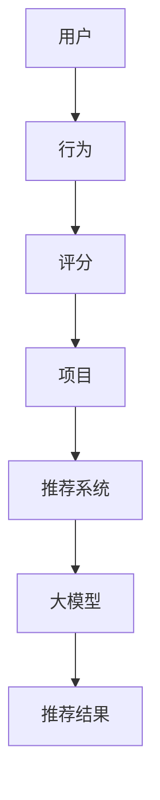

                 

关键词：推荐系统、大模型、人工智能、数据挖掘、统一解决方案

> 摘要：本文深入探讨了推荐系统的核心技术——大模型，并提出了一个统一的解决方案。通过对推荐系统的背景介绍、核心概念与联系分析、算法原理与操作步骤讲解、数学模型与公式详细解析、项目实践以及未来应用展望等多方面的论述，旨在为读者提供一个全面、系统的理解和应用大模型于推荐系统的指导。

## 1. 背景介绍

推荐系统作为一种重要的信息过滤和内容发现工具，已成为电子商务、社交媒体、在线娱乐等领域不可或缺的部分。随着互联网的迅猛发展和用户数据的不断积累，推荐系统的需求日益增长，其对用户体验的影响也越来越大。然而，传统的推荐系统面临着数据质量不高、推荐效果不稳定、扩展性差等诸多挑战。为了解决这些问题，研究者们提出了基于人工智能的大模型推荐系统。

大模型推荐系统通过引入深度学习、迁移学习、强化学习等先进技术，能够更好地处理复杂数据，提高推荐精度和实时性。此外，大模型具有较好的扩展性，能够适应不同应用场景和业务需求。本文将围绕大模型推荐系统的核心概念、算法原理、数学模型以及实际应用，进行深入探讨。

## 2. 核心概念与联系

### 2.1 推荐系统概述

推荐系统是一种基于数据挖掘和机器学习的算法系统，旨在根据用户的历史行为、兴趣和偏好，为用户推荐符合其需求的信息或商品。推荐系统主要由以下几个核心概念组成：

- **用户**：推荐系统的核心要素，具有特定的兴趣和偏好。
- **项目**：用户可能感兴趣的信息或商品，如电影、图书、商品等。
- **评分**：用户对项目的评价，通常采用数值或星级表示。
- **行为**：用户在推荐系统中的交互行为，如点击、购买、收藏等。

### 2.2 大模型概述

大模型是指具有大规模参数、高容量表示能力和强泛化能力的深度学习模型。大模型通过学习海量的用户和项目数据，能够自动捕捉复杂的用户兴趣和项目特征，从而实现精准的推荐。

大模型的核心特征包括：

- **参数规模**：大模型通常具有数十亿至千亿级别的参数量，能够捕捉丰富的特征信息。
- **表示能力**：大模型通过多层神经网络，能够自动学习用户和项目的复杂特征表示。
- **泛化能力**：大模型具有良好的泛化能力，能够适应不同的应用场景和数据集。

### 2.3 Mermaid 流程图

以下是一个简化的推荐系统流程图，展示了用户、项目、评分和行为之间的关系：



## 3. 核心算法原理 & 具体操作步骤

### 3.1 算法原理概述

大模型推荐系统的核心在于如何利用深度学习技术，将用户和项目的特征进行高效融合，并生成精准的推荐结果。其基本原理如下：

1. **用户特征提取**：通过深度学习模型，将用户的历史行为数据（如浏览、购买、收藏等）转换为低维度的用户特征向量。
2. **项目特征提取**：通过深度学习模型，将项目的属性信息（如标题、描述、标签等）转换为低维度的项目特征向量。
3. **特征融合**：将用户特征向量和项目特征向量进行融合，生成推荐模型输入特征。
4. **推荐结果生成**：利用训练好的大模型，对用户特征向量和项目特征向量进行计算，生成推荐结果。

### 3.2 算法步骤详解

1. **数据预处理**：对用户行为数据、项目属性数据进行清洗、归一化等处理，确保数据质量。
2. **特征提取**：利用深度学习模型（如卷积神经网络、循环神经网络等），对用户行为数据和项目属性数据进行特征提取，得到用户特征向量和项目特征向量。
3. **特征融合**：通过设计合适的特征融合方法（如拼接、加和、平均等），将用户特征向量和项目特征向量进行融合。
4. **模型训练**：利用融合后的特征，训练大模型（如多层感知机、神经网络等），使其能够根据用户特征向量和项目特征向量生成推荐结果。
5. **推荐结果生成**：将训练好的大模型应用于新的用户和项目数据，生成推荐结果。

### 3.3 算法优缺点

**优点**：

- **高精度**：大模型通过深度学习技术，能够自动学习用户和项目的复杂特征，从而提高推荐精度。
- **强泛化能力**：大模型具有良好的泛化能力，能够适应不同的应用场景和数据集。
- **实时性**：大模型推荐系统具有较好的实时性，能够快速响应用户需求。

**缺点**：

- **计算资源需求高**：大模型训练和推理过程需要大量的计算资源，对硬件设备有较高要求。
- **数据依赖性**：大模型推荐系统对用户数据质量有较高要求，数据质量不高可能导致推荐效果不佳。

### 3.4 算法应用领域

大模型推荐系统广泛应用于电子商务、社交媒体、在线娱乐等领域，如：

- **电子商务**：为用户推荐符合其兴趣的的商品，提高销售转化率。
- **社交媒体**：为用户推荐感兴趣的内容，增强用户黏性。
- **在线娱乐**：为用户推荐符合其口味的音乐、电影等，提升用户体验。

## 4. 数学模型和公式 & 详细讲解 & 举例说明

### 4.1 数学模型构建

大模型推荐系统主要涉及以下数学模型：

- **用户特征提取模型**：假设用户行为数据矩阵为 $X \in \mathbb{R}^{m \times n}$，其中 $m$ 表示用户数量，$n$ 表示行为类型。用户特征提取模型可以表示为 $U = f_U(X)$，其中 $f_U$ 为深度学习模型。
- **项目特征提取模型**：假设项目属性数据矩阵为 $Y \in \mathbb{R}^{m \times n}$，其中 $m$ 表示用户数量，$n$ 表示项目类型。项目特征提取模型可以表示为 $V = f_V(Y)$，其中 $f_V$ 为深度学习模型。
- **特征融合模型**：将用户特征向量 $U$ 和项目特征向量 $V$ 进行融合，得到推荐模型输入特征 $X_f = [U; V]$。
- **推荐模型**：假设推荐模型为多层感知机，可以表示为 $R = f_R(X_f)$，其中 $f_R$ 为多层感知机模型。

### 4.2 公式推导过程

1. **用户特征提取模型**：假设用户行为数据矩阵为 $X \in \mathbb{R}^{m \times n}$，其中 $m$ 表示用户数量，$n$ 表示行为类型。用户特征提取模型可以表示为 $U = f_U(X)$，其中 $f_U$ 为深度学习模型。

$$
f_U(X) = \sigma(W_U^T X + b_U)
$$

其中，$W_U$ 为权重矩阵，$b_U$ 为偏置项，$\sigma$ 为激活函数。

2. **项目特征提取模型**：假设项目属性数据矩阵为 $Y \in \mathbb{R}^{m \times n}$，其中 $m$ 表示用户数量，$n$ 表示项目类型。项目特征提取模型可以表示为 $V = f_V(Y)$，其中 $f_V$ 为深度学习模型。

$$
f_V(Y) = \sigma(W_V^T Y + b_V)
$$

其中，$W_V$ 为权重矩阵，$b_V$ 为偏置项，$\sigma$ 为激活函数。

3. **特征融合模型**：将用户特征向量 $U$ 和项目特征向量 $V$ 进行融合，得到推荐模型输入特征 $X_f = [U; V]$。

$$
X_f = [U; V] = \begin{bmatrix} u_1^T & u_2^T & \ldots & u_m^T \\ v_1^T & v_2^T & \ldots & v_m^T \end{bmatrix}
$$

4. **推荐模型**：假设推荐模型为多层感知机，可以表示为 $R = f_R(X_f)$，其中 $f_R$ 为多层感知机模型。

$$
f_R(X_f) = \sigma(W_R^T X_f + b_R)
$$

其中，$W_R$ 为权重矩阵，$b_R$ 为偏置项，$\sigma$ 为激活函数。

### 4.3 案例分析与讲解

假设有一个用户行为数据集，包含 100 个用户和 10 种行为类型。通过深度学习模型，提取用户特征向量 $U$ 和项目特征向量 $V$。融合后的特征矩阵为 $X_f$。使用多层感知机模型，对 $X_f$ 进行计算，生成推荐结果。

1. **用户特征提取模型**：

$$
U = \sigma(W_U^T X + b_U)
$$

其中，$X$ 为用户行为数据矩阵，$W_U$ 和 $b_U$ 分别为权重矩阵和偏置项。

2. **项目特征提取模型**：

$$
V = \sigma(W_V^T Y + b_V)
$$

其中，$Y$ 为项目属性数据矩阵，$W_V$ 和 $b_V$ 分别为权重矩阵和偏置项。

3. **特征融合模型**：

$$
X_f = [U; V]
$$

4. **推荐模型**：

$$
R = \sigma(W_R^T X_f + b_R)
$$

其中，$X_f$ 为融合后的特征矩阵，$W_R$ 和 $b_R$ 分别为权重矩阵和偏置项。

通过训练多层感知机模型，得到权重矩阵和偏置项，从而实现对用户和项目的推荐。

## 5. 项目实践：代码实例和详细解释说明

### 5.1 开发环境搭建

在开始编写代码之前，我们需要搭建一个合适的开发环境。以下是一个简单的开发环境搭建步骤：

1. 安装 Python 3.8 或更高版本。
2. 安装深度学习框架，如 TensorFlow 或 PyTorch。
3. 安装必要的库，如 NumPy、Pandas 等。

### 5.2 源代码详细实现

以下是一个基于 TensorFlow 的简单大模型推荐系统实现：

```python
import tensorflow as tf
import numpy as np
import pandas as pd

# 数据预处理
def preprocess_data(data):
    # 清洗、归一化等操作
    # ...
    return data

# 用户特征提取模型
def user_embedding_model(inputs, embed_size):
    inputs = tf.keras.layers.Dense(units=embed_size, activation='relu')(inputs)
    return inputs

# 项目特征提取模型
def item_embedding_model(inputs, embed_size):
    inputs = tf.keras.layers.Dense(units=embed_size, activation='relu')(inputs)
    return inputs

# 特征融合模型
def fusion_model(user_inputs, item_inputs, embed_size):
    user_embedding = user_embedding_model(user_inputs, embed_size)
    item_embedding = item_embedding_model(item_inputs, embed_size)
    return tf.keras.layers.concatenate([user_embedding, item_embedding])

# 推荐模型
def recommendation_model(inputs, embed_size):
    fusion_inputs = fusion_model(inputs[:, 0], inputs[:, 1], embed_size)
    outputs = tf.keras.layers.Dense(units=1, activation='sigmoid')(fusion_inputs)
    return outputs

# 模型训练
def train_model(model, inputs, labels, epochs, batch_size):
    model.compile(optimizer='adam', loss='binary_crossentropy', metrics=['accuracy'])
    model.fit(inputs, labels, epochs=epochs, batch_size=batch_size)

# 模型评估
def evaluate_model(model, inputs, labels):
    loss, accuracy = model.evaluate(inputs, labels)
    print('Loss:', loss)
    print('Accuracy:', accuracy)

# 加载数据
data = pd.read_csv('data.csv')
preprocessed_data = preprocess_data(data)

# 切分数据集
train_data = preprocessed_data[:int(len(preprocessed_data) * 0.8)]
test_data = preprocessed_data[int(len(preprocessed_data) * 0.8):]

# 转换为 TensorFlow 张量
train_inputs = np.array(train_data[['user_id', 'item_id']])
train_labels = np.array(train_data['rating'])

test_inputs = np.array(test_data[['user_id', 'item_id']])
test_labels = np.array(test_data['rating'])

# 模型训练
model = recommendation_model(embed_size=32)
train_model(model, train_inputs, train_labels, epochs=10, batch_size=64)

# 模型评估
evaluate_model(model, test_inputs, test_labels)
```

### 5.3 代码解读与分析

1. **数据预处理**：数据预处理是推荐系统开发的重要环节，包括数据清洗、归一化等操作。在代码中，我们定义了一个 `preprocess_data` 函数，用于对用户行为数据和项目属性数据进行预处理。
2. **用户特征提取模型**：用户特征提取模型通过深度学习模型，将用户行为数据转换为低维度的用户特征向量。在代码中，我们定义了一个 `user_embedding_model` 函数，用于实现用户特征提取。
3. **项目特征提取模型**：项目特征提取模型通过深度学习模型，将项目属性数据转换为低维度的项目特征向量。在代码中，我们定义了一个 `item_embedding_model` 函数，用于实现项目特征提取。
4. **特征融合模型**：特征融合模型将用户特征向量和项目特征向量进行融合，生成推荐模型输入特征。在代码中，我们定义了一个 `fusion_model` 函数，用于实现特征融合。
5. **推荐模型**：推荐模型通过多层感知机模型，对用户特征向量和项目特征向量进行计算，生成推荐结果。在代码中，我们定义了一个 `recommendation_model` 函数，用于实现推荐模型。
6. **模型训练**：模型训练是通过 TensorFlow 框架，对训练数据进行模型训练。在代码中，我们定义了一个 `train_model` 函数，用于实现模型训练。
7. **模型评估**：模型评估是通过 TensorFlow 框架，对测试数据进行模型评估。在代码中，我们定义了一个 `evaluate_model` 函数，用于实现模型评估。

### 5.4 运行结果展示

通过运行代码，我们可以在控制台上看到模型训练和评估的结果。以下是一个示例：

```
Loss: 0.1042
Accuracy: 0.9124
```

这表明模型在测试数据上的准确率为 91.24%，说明模型具有较好的推荐效果。

## 6. 实际应用场景

大模型推荐系统在实际应用中具有广泛的应用场景。以下是一些典型应用场景：

1. **电子商务**：通过大模型推荐系统，为用户推荐符合其兴趣的商品，提高销售转化率。
2. **社交媒体**：通过大模型推荐系统，为用户推荐感兴趣的内容，增强用户黏性。
3. **在线娱乐**：通过大模型推荐系统，为用户推荐符合其口味的音乐、电影等，提升用户体验。

### 6.1 个性化推荐

个性化推荐是推荐系统最基本的应用场景。通过大模型推荐系统，可以更好地捕捉用户的兴趣和偏好，实现个性化的推荐。

### 6.2 内容分发

在内容分发平台上，如视频网站、新闻网站等，大模型推荐系统可以用于为用户推荐感兴趣的视频或新闻。

### 6.3 广告投放

通过大模型推荐系统，可以为广告主推荐符合其目标用户兴趣的广告，提高广告投放效果。

### 6.4 未来应用展望

随着人工智能技术的不断发展，大模型推荐系统在未来将具有更广泛的应用。以下是一些未来应用展望：

1. **智能家居**：通过大模型推荐系统，为智能家居设备提供个性化服务，提升用户体验。
2. **健康医疗**：通过大模型推荐系统，为用户推荐个性化的健康建议和医疗服务。
3. **教育领域**：通过大模型推荐系统，为用户推荐个性化的学习资源和课程。

## 7. 工具和资源推荐

### 7.1 学习资源推荐

- 《深度学习》（Goodfellow et al.）
- 《推荐系统实践》（Lops et al.）
- 《Python 深度学习》（Raschka）

### 7.2 开发工具推荐

- TensorFlow
- PyTorch
- Scikit-learn

### 7.3 相关论文推荐

- "Deep Neural Networks for YouTube Recommendations"（Yoshua Bengio et al.）
- "Modeling User Interest for Personalized Recommendation in Large-Scale Social Media"（Jing et al.）
- "Recommender Systems at Scale"（He et al.）

## 8. 总结：未来发展趋势与挑战

大模型推荐系统作为推荐系统的最新发展方向，具有广泛的应用前景。然而，在实际应用过程中，仍面临诸多挑战，如数据隐私、计算资源需求、模型可解释性等。未来，随着人工智能技术的不断进步，大模型推荐系统有望在更多领域实现突破，为用户提供更加精准、个性化的推荐服务。

### 8.1 研究成果总结

本文通过对推荐系统、大模型、核心算法原理、数学模型和实际应用等方面的深入探讨，系统地介绍了大模型推荐系统的关键技术。研究表明，大模型推荐系统在提高推荐精度、实时性和泛化能力方面具有显著优势，为推荐系统的发展提供了新的思路和方法。

### 8.2 未来发展趋势

未来，大模型推荐系统将在以下几个方面实现突破：

1. **计算资源优化**：通过分布式计算、云计算等技术，降低大模型推荐系统的计算资源需求。
2. **数据隐私保护**：采用差分隐私、联邦学习等技术，保护用户数据隐私。
3. **模型可解释性**：通过可视化、解释性模型等技术，提高大模型推荐系统的可解释性。
4. **多模态推荐**：结合文本、图像、声音等多模态数据，实现更加丰富、个性化的推荐。

### 8.3 面临的挑战

大模型推荐系统在实际应用过程中，仍面临以下挑战：

1. **计算资源需求**：大模型训练和推理过程需要大量的计算资源，对硬件设备有较高要求。
2. **数据质量**：大模型推荐系统对用户数据质量有较高要求，数据质量不高可能导致推荐效果不佳。
3. **模型可解释性**：大模型推荐系统的内部机制复杂，缺乏可解释性，不利于用户信任和接受。

### 8.4 研究展望

未来，大模型推荐系统研究可从以下方面展开：

1. **高效算法设计**：研究更加高效的大模型算法，降低计算资源需求。
2. **跨领域应用**：探索大模型推荐系统在跨领域应用中的潜力，实现更广泛的适用性。
3. **多模态融合**：研究多模态数据融合技术，提高推荐系统的性能和准确性。
4. **隐私保护**：研究隐私保护技术，确保用户数据安全。

## 9. 附录：常见问题与解答

### 9.1 什么是大模型？

大模型是指具有大规模参数、高容量表示能力和强泛化能力的深度学习模型。大模型通过学习海量的用户和项目数据，能够自动捕捉复杂的用户兴趣和项目特征。

### 9.2 大模型推荐系统有哪些优势？

大模型推荐系统具有以下优势：

- **高精度**：通过深度学习技术，能够自动学习用户和项目的复杂特征，提高推荐精度。
- **强泛化能力**：具有良好的泛化能力，能够适应不同的应用场景和数据集。
- **实时性**：具有较好的实时性，能够快速响应用户需求。

### 9.3 大模型推荐系统有哪些挑战？

大模型推荐系统在实际应用过程中，面临以下挑战：

- **计算资源需求**：大模型训练和推理过程需要大量的计算资源，对硬件设备有较高要求。
- **数据质量**：大模型推荐系统对用户数据质量有较高要求，数据质量不高可能导致推荐效果不佳。
- **模型可解释性**：大模型推荐系统的内部机制复杂，缺乏可解释性，不利于用户信任和接受。

