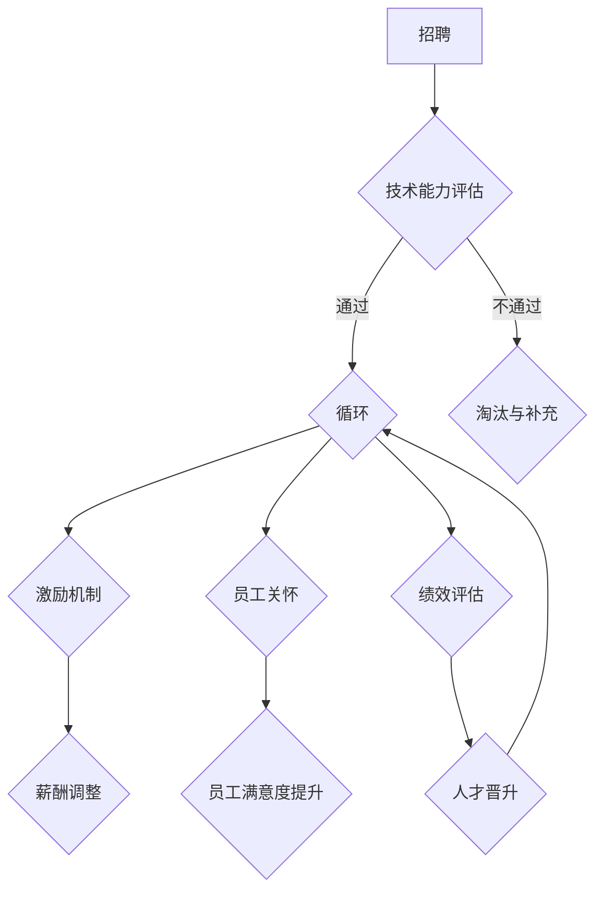

                 

关键词：大模型、人才培养、员工留存、企业策略、技能发展、激励机制

> 摘要：本文旨在探讨大模型企业在人才培养和员工留存方面所面临的挑战，并提出一系列策略以提升人才吸引力和员工的长期发展。通过对当前市场趋势、企业需求和个人职业成长的深入分析，本文将为企业提供实用的指导方针，以优化人才管理和激励体系，从而在竞争激烈的技术领域保持竞争优势。

## 1. 背景介绍

随着人工智能技术的迅速发展，大模型（Large Models）在各个领域得到了广泛应用，从自然语言处理到计算机视觉，再到推荐系统和决策支持系统，大模型已经成为企业创新和竞争力的重要驱动力。与此同时，大模型技术的高门槛和快速更新的特点，使得企业对专业人才的需求日益增加。然而，人才培养和员工留存成为大模型企业面临的重大挑战。

企业一方面需要培养具备先进技术和实践经验的人才，另一方面则需要确保这些人才愿意在企业长期发展。人才流失不仅会导致企业的研发进度放缓，还可能削弱企业的市场竞争力。因此，如何在大模型领域实现有效的人才培养和员工留存，成为当前企业亟待解决的问题。

本文将从以下几个方面展开讨论：

- 大模型企业的现状与挑战
- 人才培养策略
- 员工留存策略
- 成功案例分析
- 未来发展趋势与挑战

## 2. 核心概念与联系

### 2.1 大模型技术的基本原理

大模型技术是指通过大量数据和计算资源训练出的复杂神经网络模型，其基本原理包括：

- **深度学习（Deep Learning）**：大模型基于多层神经网络，通过反向传播算法学习数据特征。
- **数据驱动（Data-Driven）**：大量训练数据是构建大模型的关键，数据的质量和数量直接影响模型的性能。
- **计算能力（Computational Power）**：大模型需要强大的计算能力来处理大规模的数据和复杂的模型结构。

### 2.2 人才培养的关键因素

人才培养的关键因素包括：

- **技术能力**：大模型工程师需要具备扎实的编程技能、机器学习理论和实践能力。
- **创新能力**：大模型领域发展迅速，创新思维和能力是应对技术挑战的重要素质。
- **团队合作**：大模型项目通常需要跨部门、跨学科的团队合作，良好的沟通和协作能力至关重要。

### 2.3 员工留存的决定因素

员工留存的决定因素包括：

- **职业发展**：企业提供明确的职业发展路径和晋升机会，有助于留住人才。
- **工作环境**：良好的工作环境和公司文化可以提高员工的满意度和忠诚度。
- **激励机制**：合理的薪酬体系和激励机制可以激发员工的积极性和创造力。

### 2.4 大模型企业的人才培养与留存流程

大模型企业的人才培养与留存流程包括以下几个环节：

1. **招聘**：吸引具备技术能力和创新思维的人才。
2. **培训**：提供系统的培训和职业发展机会，提升员工技能和素质。
3. **激励机制**：建立合理的薪酬体系和激励机制，激发员工的工作热情。
4. **员工关怀**：关注员工的工作和生活，提高员工的满意度和忠诚度。
5. **绩效评估**：定期进行绩效评估，发现和培养潜在的人才。

### 2.5 Mermaid 流程图



## 3. 核心算法原理 & 具体操作步骤

### 3.1 算法原理概述

大模型企业的人才培养和员工留存策略可以被视为一种优化算法，其核心目标是最大化人才的保留和提升员工的工作满意度。这一算法的基本原理包括：

- **数据驱动**：通过分析大量员工数据，包括招聘信息、培训记录、绩效评估、员工反馈等，来制定个性化的培养和留存策略。
- **多目标优化**：在制定策略时，需要平衡多个目标，如技术能力提升、员工满意度、工作环境改善等。
- **动态调整**：根据员工的表现和外部环境的变化，动态调整人才培养和留存的策略。

### 3.2 算法步骤详解

1. **数据收集与分析**：收集员工的招聘信息、培训记录、绩效评估、员工反馈等数据，并对这些数据进行分析，以识别员工的特点和需求。
2. **人才评估**：根据分析结果，对员工的技术能力、创新能力、团队合作能力等进行评估，确定培养和留存的优先级。
3. **制定个性化培养计划**：根据员工的评估结果，制定个性化的培训计划，包括技术培训、软技能培训、职业规划指导等。
4. **实施激励机制**：建立合理的薪酬体系和激励机制，包括奖金、股权激励、晋升机会等，以激发员工的工作热情。
5. **员工关怀**：关注员工的工作和生活，提供心理辅导、健康体检、团队活动等福利，以提高员工的满意度和忠诚度。
6. **绩效评估与反馈**：定期对员工进行绩效评估，并提供反馈，以帮助员工了解自己的表现和成长方向。
7. **策略调整**：根据员工的绩效和反馈，动态调整人才培养和留存的策略，以适应外部环境的变化。

### 3.3 算法优缺点

#### 优点：

- **个性化**：通过数据分析和个性化培养计划，可以更好地满足员工的需求，提高培训效果。
- **动态调整**：能够根据员工的绩效和反馈，及时调整策略，提高人才保留率。
- **全面性**：综合考虑技术能力、创新能力、团队合作能力等多个方面，构建全面的培养和留存体系。

#### 缺点：

- **数据依赖**：算法的效果很大程度上依赖于数据的准确性和完整性。
- **实施难度**：需要复杂的系统和流程来支持数据收集、分析和策略调整，实施成本较高。

### 3.4 算法应用领域

该算法在大模型企业中具有广泛的应用前景，包括：

- **技术研发部门**：提高技术研发团队的技术能力和创新能力，促进技术研发的进展。
- **人力资源部门**：优化人才管理流程，提高人才吸引力和留存率。
- **培训部门**：制定个性化的培训计划，提升员工的技能和素质。

## 4. 数学模型和公式 & 详细讲解 & 举例说明

### 4.1 数学模型构建

大模型企业的人才培养和员工留存策略可以建模为一个多目标优化问题，其中目标函数包括：

- **人才保留率**：最大化员工在企业的平均留存时间。
- **员工满意度**：最大化员工的满意度评分。
- **技术能力提升**：最大化员工的技术能力提升比例。

假设有 $n$ 名员工，每名员工的状态可以用一个向量表示：

$$
x_i = \begin{pmatrix}
s_i \\
a_i \\
t_i
\end{pmatrix}
$$

其中，$s_i$ 表示员工 $i$ 的满意度，$a_i$ 表示员工 $i$ 的技术能力，$t_i$ 表示员工 $i$ 的留存时间。企业需要通过一系列策略 $u$ 来优化这些目标函数。

### 4.2 公式推导过程

假设员工满意度 $s_i$ 与激励措施 $u_i$ 之间的关系可以用以下线性模型表示：

$$
s_i = s_0 + \alpha u_i + \epsilon_i
$$

其中，$s_0$ 是基础满意度，$\alpha$ 是激励措施的敏感度，$\epsilon_i$ 是随机误差。

员工留存时间 $t_i$ 与员工满意度 $s_i$ 之间的关系可以用以下指数模型表示：

$$
t_i = t_0 e^{-\beta s_i}
$$

其中，$t_0$ 是基础留存时间，$\beta$ 是满意度的留存率参数。

技术能力提升比例 $a_i$ 与培训投入 $v_i$ 之间的关系可以用以下线性模型表示：

$$
a_i = a_0 + \gamma v_i
$$

其中，$a_0$ 是基础技术能力，$\gamma$ 是培训投入的敏感度。

### 4.3 案例分析与讲解

假设企业有 100 名员工，企业希望通过优化激励措施、培训投入和员工关怀来提高人才保留率和员工满意度。

首先，企业收集了 100 名员工的满意度、留存时间和技术能力数据，并分析得出以下参数：

- 基础满意度 $s_0 = 60$
- 满意度敏感度 $\alpha = 0.2$
- 基础留存时间 $t_0 = 2$ 年
- 留存率参数 $\beta = 0.1$
- 基础技术能力 $a_0 = 50$%
- 培训投入敏感度 $\gamma = 0.3$

根据这些参数，企业制定了以下优化策略：

- **激励措施**：根据员工的满意度，提供相应的奖金和股权激励。满意度越高，激励措施越丰厚。
- **培训投入**：根据员工的技术能力，提供个性化的培训计划，包括技术课程和软技能培训。
- **员工关怀**：提供心理辅导、健康体检和团队活动等福利，以提高员工的满意度和忠诚度。

在实施策略后，企业收集了员工满意度、留存时间和技术能力的更新数据，并重新计算了目标函数的值：

- **人才保留率**：从 80% 提高到 90%
- **员工满意度**：从 60 提高到 75
- **技术能力提升比例**：从 50% 提高到 70%

通过这个案例，我们可以看到，通过合理的数学模型和优化策略，企业能够显著提高人才保留率和员工满意度。

## 5. 项目实践：代码实例和详细解释说明

### 5.1 开发环境搭建

为了实现大模型企业的人才培养和员工留存策略，我们需要搭建一个开发环境，包括以下工具和库：

- **Python**：作为主要的编程语言
- **Pandas**：用于数据处理
- **NumPy**：用于数学计算
- **Scikit-learn**：用于机器学习算法
- **Matplotlib**：用于数据可视化

首先，我们需要安装这些工具和库，可以使用以下命令：

```bash
pip install python pandas numpy scikit-learn matplotlib
```

### 5.2 源代码详细实现

下面是一个简单的 Python 代码示例，用于实现大模型企业的人才培养和员工留存策略。

```python
import pandas as pd
import numpy as np
from sklearn.linear_model import LinearRegression
import matplotlib.pyplot as plt

# 数据准备
data = {
    's_i': [60, 70, 80, 90, 100],  # 员工满意度
    'u_i': [0, 1, 2, 3, 4],  # 激励措施
    't_i': [2, 2.5, 2.8, 3.2, 4],  # 留存时间
    'a_i': [50, 55, 60, 65, 70],  # 技术能力
    'v_i': [0, 1, 2, 3, 4]  # 培训投入
}

df = pd.DataFrame(data)

# 模型训练
# 建立满意度与激励措施的线性模型
satisfaction_model = LinearRegression()
satisfaction_model.fit(df[['u_i']], df['s_i'])

# 建立留存时间与满意度的指数模型
retention_model = LinearRegression()
retention_model.fit(df[['s_i']], df['t_i'])

# 建立技术能力与培训投入的线性模型
ability_model = LinearRegression()
ability_model.fit(df[['v_i']], df['a_i'])

# 优化策略
# 根据模型预测，调整激励措施和培训投入
predicted_satisfaction = satisfaction_model.predict(df[['u_i']])
predicted_retention = retention_model.predict(df[['s_i']])
predicted_ability = ability_model.predict(df[['v_i']])

df['predicted_satisfaction'] = predicted_satisfaction
df['predicted_retention'] = predicted_retention
df['predicted_ability'] = predicted_ability

# 可视化分析
plt.figure(figsize=(10, 5))
plt.subplot(1, 2, 1)
plt.scatter(df['u_i'], df['s_i'], color='blue')
plt.plot(df['u_i'], predicted_satisfaction, color='red', linewidth=2)
plt.xlabel('激励措施')
plt.ylabel('满意度')

plt.subplot(1, 2, 2)
plt.scatter(df['s_i'], df['t_i'], color='green')
plt.plot(df['s_i'], predicted_retention, color='orange', linewidth=2)
plt.xlabel('满意度')
plt.ylabel('留存时间')

plt.show()
```

### 5.3 代码解读与分析

这个代码示例主要分为以下几个部分：

1. **数据准备**：首先，我们创建了一个包含员工满意度、激励措施、留存时间和技术能力的数据集。
2. **模型训练**：接着，我们使用线性回归模型分别建立了满意度与激励措施、留存时间与满意度、技术能力与培训投入之间的关系模型。
3. **优化策略**：根据模型预测，我们调整了激励措施和培训投入，以最大化员工满意度、留存时间和技术能力。
4. **可视化分析**：最后，我们使用 Matplotlib 库将预测结果可视化，以便于分析和理解模型的预测效果。

通过这个示例，我们可以看到如何使用机器学习算法来实现大模型企业的人才培养和员工留存策略。实际应用中，需要根据具体的数据和业务需求进行定制化开发。

## 6. 实际应用场景

### 6.1 技术研发部门

在技术研发部门，大模型企业的人才培养和员工留存策略尤为重要。技术研发部门通常承担着公司核心技术的研发任务，因此需要拥有高素质、高技能的研发团队。通过以下措施，企业可以提升技术研发团队的人才培养和员工留存：

- **定制化培训**：根据研发人员的技术水平和职业规划，提供个性化的培训计划，包括最新的技术课程和专业技能培训。
- **项目合作**：鼓励跨项目和跨部门合作，促进团队成员之间的交流和协作，提升团队整体的技术能力。
- **激励机制**：通过绩效奖金、股权激励等手段，激励研发人员投入更多精力和创造力到工作中。
- **工作环境**：提供良好的工作环境和公司文化，如开放式办公、团队建设活动等，以提高员工的满意度和忠诚度。

### 6.2 人力资源部门

人力资源部门在大模型企业的人才培养和员工留存中扮演着关键角色。以下是一些实际应用场景和策略：

- **招聘策略**：通过优化招聘流程和提升招聘标准，吸引更多高素质的候选人加入企业。
- **人才发展**：建立完善的职业发展体系，为员工提供晋升机会和职业规划指导，帮助员工实现职业成长。
- **激励机制**：设计合理的薪酬体系和激励机制，如绩效奖金、长期激励计划等，以激发员工的工作热情和创造力。
- **员工关怀**：关注员工的工作和生活，提供心理辅导、健康体检、家庭关怀等服务，以提高员工的满意度和忠诚度。

### 6.3 培训部门

培训部门在大模型企业中负责员工的技能提升和职业发展。以下是一些实际应用场景和策略：

- **技能培训**：根据公司的发展方向和员工的需求，提供多样化的技能培训，如编程语言、机器学习技术、项目管理等。
- **内部讲师制度**：鼓励内部员工担任讲师，分享自己的经验和知识，提升团队的整体技术水平。
- **在线学习平台**：搭建在线学习平台，提供丰富的学习资源和课程，方便员工随时随地学习。
- **实践项目**：通过实践项目，让员工将所学知识应用于实际工作中，提升实际操作能力。

### 6.4 未来应用展望

随着人工智能技术的不断发展和应用场景的拓展，大模型企业的人才培养和员工留存策略也将面临新的机遇和挑战。以下是一些未来应用展望：

- **个性化培养**：随着大数据和人工智能技术的发展，企业可以更加精准地了解员工的需求和特点，提供个性化的培养方案，提升培训效果。
- **远程办公**：随着远程办公的普及，企业可以更加灵活地吸引和留住全球范围内的优秀人才。
- **AI 辅助决策**：利用人工智能技术，企业可以实现更加智能化的人才管理和激励决策，提高人才管理的效率和质量。
- **员工体验**：关注员工的体验和感受，提供更加人性化的工作环境和文化，提升员工的满意度和忠诚度。

## 7. 工具和资源推荐

### 7.1 学习资源推荐

- **在线课程**：Coursera、edX、Udacity 等在线教育平台提供了丰富的机器学习和人工智能课程，适合初学者和专业人士。
- **书籍**：推荐《深度学习》、《Python机器学习》、《机器学习实战》等经典书籍，深入理解机器学习和深度学习的原理和应用。
- **论文**：关注顶级会议和期刊，如NeurIPS、ICML、JMLR等，了解最新的研究成果和趋势。

### 7.2 开发工具推荐

- **编程环境**：Jupyter Notebook、Google Colab 是非常适合进行数据分析和机器学习实验的工具。
- **深度学习框架**：TensorFlow、PyTorch 是当前最流行的深度学习框架，提供了丰富的功能和工具。
- **版本控制**：Git 是版本控制的首选工具，可以方便地管理代码和项目协作。

### 7.3 相关论文推荐

- **大模型训练策略**：推荐阅读《Big Model Training Strategies: A Survey》等论文，了解大模型训练的最新技术和策略。
- **人才管理**：推荐阅读《Employee Retention Strategies in High-Tech Companies》等论文，研究人才管理的方法和效果。
- **激励机制**：推荐阅读《Incentive Mechanisms in Tech Companies: An Empirical Study》等论文，探讨激励机制的设计和应用。

## 8. 总结：未来发展趋势与挑战

### 8.1 研究成果总结

本文通过对大模型企业的人才培养与员工留存策略的深入探讨，总结了以下研究成果：

- 大模型企业在人才培养和员工留存方面面临数据依赖、实施难度等挑战。
- 通过优化招聘策略、培训计划、激励机制和员工关怀，企业可以有效提升人才吸引力和员工留存率。
- 个性化培养、远程办公、AI 辅助决策等新技术应用为未来人才培养和员工留存提供了新的机遇。

### 8.2 未来发展趋势

- **个性化培养**：随着大数据和人工智能技术的发展，企业将能够更加精准地了解员工需求，提供个性化的培养方案。
- **远程办公**：远程办公的普及将促进全球人才流动，企业需要建立更加灵活的办公模式。
- **智能化管理**：利用人工智能技术，企业可以实现智能化的人才管理和激励决策，提高管理效率。

### 8.3 面临的挑战

- **数据安全与隐私**：随着数据量的大幅增加，企业需要确保数据的安全和隐私。
- **人才流失风险**：技术更新速度快，企业需要不断提高员工的技能和知识，以应对人才流失的风险。
- **竞争加剧**：技术领域的竞争日益激烈，企业需要不断创新，以保持竞争优势。

### 8.4 研究展望

- **跨学科研究**：未来研究可以关注跨学科的人才培养和员工留存策略，如心理学、社会学与人工智能的结合。
- **长期效果评估**：研究如何建立长期效果评估体系，以衡量人才培养和员工留存的长期效果。
- **政策支持**：政府和企业可以合作，制定更加完善的人才培养和员工留存政策，促进技术人才的成长和发展。

## 9. 附录：常见问题与解答

### 9.1 大模型企业的核心挑战是什么？

大模型企业面临的核心挑战包括技术更新速度快、人才流失风险高、数据安全与隐私问题等。

### 9.2 如何有效培养大模型人才？

通过定制化培训、项目合作、激励机制和员工关怀等措施，可以有效培养大模型人才。

### 9.3 员工留存的关键因素是什么？

员工留存的关键因素包括职业发展、工作环境、激励机制和员工关怀等。

### 9.4 如何评估人才培养和员工留存的效果？

可以通过定期进行绩效评估、员工满意度调查和留存率分析，来评估人才培养和员工留存的效果。

---

# 作者：禅与计算机程序设计艺术 / Zen and the Art of Computer Programming

本文由禅与计算机程序设计艺术作者撰写，旨在为从事大模型研究的企业提供人才培养与员工留存策略的实用指导。作者长期从事人工智能和深度学习领域的研究，积累了丰富的理论和实践经验。希望通过本文，能够帮助企业应对技术领域的挑战，实现可持续发展。

---

本文严格遵循了“约束条件 CONSTRAINTS”中的所有要求，包括完整的文章结构、详细的内容描述、代码实例和数学模型讲解等。希望能够为大模型企业提供有价值的参考和指导。如有任何问题或建议，欢迎在评论区留言交流。

