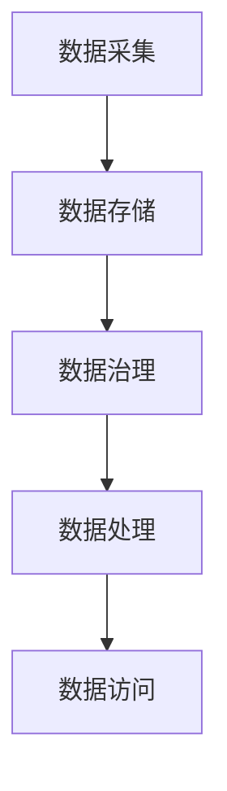

                 

关键词：数据湖、大模型、分布式存储、数据处理、数据治理

> 摘要：本文将探讨大模型企业在构建数据湖过程中的关键策略，包括数据湖架构设计、数据治理、分布式存储和数据处理等方面的技术和方法。通过对数据湖的深入研究，为企业提供一套有效的数据湖构建方案，以支持大模型的高效训练和应用。

## 1. 背景介绍

随着大数据和人工智能技术的快速发展，企业对于数据的需求越来越大。数据湖作为一种新型的数据架构，能够存储海量、多样化的数据，支持实时分析和处理，逐渐成为企业构建数据架构的重要选择。大模型企业在数据处理和存储方面面临更高的挑战，因为大模型训练需要处理海量数据，并且数据质量和数据一致性要求更高。

数据湖架构的设计和构建是企业成功应用人工智能的关键因素之一。数据湖能够存储多种类型的数据，如结构化数据、半结构化数据和非结构化数据，并且支持分布式存储和数据处理。然而，数据湖的构建需要考虑到数据存储、数据治理、数据处理和安全性等多方面的因素。

本文将从数据湖的核心概念、架构设计、数据治理、分布式存储和数据处理等方面进行深入探讨，为大模型企业提供一套有效的数据湖构建策略。

## 2. 核心概念与联系

### 2.1 数据湖的定义

数据湖是一种新型数据架构，用于存储、管理和处理海量数据。与传统的数据仓库不同，数据湖能够存储各种类型的数据，包括结构化数据、半结构化数据和非结构化数据。数据湖的存储结构是基于分布式文件系统，如Hadoop Distributed File System（HDFS）或Amazon S3，能够实现海量数据的分布式存储和高效处理。

### 2.2 数据湖的架构

数据湖的架构主要包括以下几个部分：

- **数据采集**：从各种数据源采集数据，如关系型数据库、NoSQL数据库、日志文件、API等。

- **数据存储**：将采集到的数据存储到分布式文件系统中，如HDFS或Amazon S3。

- **数据治理**：对数据进行质量管理和数据标准化，确保数据的一致性和可靠性。

- **数据处理**：使用数据处理框架，如Apache Spark或Flink，对数据进行ETL（抽取、转换、加载）和实时处理。

- **数据访问**：提供数据查询和数据分析工具，如SQL查询接口、数据可视化工具等。

### 2.3 数据湖与数据仓库的联系和区别

数据湖和数据仓库都是用于存储和管理数据的架构，但它们在数据类型、数据管理和数据处理等方面存在一些区别：

- **数据类型**：数据湖能够存储各种类型的数据，包括结构化数据、半结构化数据和非结构化数据。数据仓库主要用于存储结构化数据。

- **数据管理**：数据湖采用分布式存储和分布式计算，能够实现海量数据的存储和处理。数据仓库则通常采用集中式存储和计算。

- **数据处理**：数据湖支持实时数据处理和批处理，能够满足实时分析和处理的需求。数据仓库则主要支持批处理。

- **数据一致性**：数据湖的数据通常不需要严格的格式和结构，能够存储多样化、非结构化的数据。数据仓库则要求数据具有明确的格式和结构。

### 2.4 数据湖架构的 Mermaid 流程图



## 3. 核心算法原理 & 具体操作步骤

### 3.1 算法原理概述

数据湖的构建涉及多个核心算法和操作步骤，主要包括：

- **数据采集**：使用ETL工具从各种数据源采集数据，并将其存储到分布式文件系统中。

- **数据存储**：使用分布式文件系统，如HDFS或Amazon S3，实现海量数据的分布式存储。

- **数据治理**：使用数据质量管理和数据标准化工具，确保数据的一致性和可靠性。

- **数据处理**：使用数据处理框架，如Apache Spark或Flink，对数据进行ETL和实时处理。

- **数据访问**：提供数据查询和数据分析工具，如SQL查询接口和数据可视化工具。

### 3.2 算法步骤详解

#### 3.2.1 数据采集

1. 确定数据源：确定需要采集的数据源，如关系型数据库、NoSQL数据库、日志文件、API等。

2. 数据抽取：使用ETL工具，如Apache NiFi、Apache Spark等，从数据源中抽取数据。

3. 数据清洗：对抽取到的数据进行清洗，包括去除重复数据、处理缺失值、数据转换等。

4. 数据存储：将清洗后的数据存储到分布式文件系统中，如HDFS或Amazon S3。

#### 3.2.2 数据存储

1. 选择分布式文件系统：根据数据量和处理需求，选择合适的分布式文件系统，如HDFS或Amazon S3。

2. 数据存储策略：设计数据存储策略，如数据分片、数据压缩、数据加密等。

3. 数据存储和同步：将数据存储到分布式文件系统中，并实现数据的同步和备份。

#### 3.2.3 数据治理

1. 数据质量检查：对数据进行质量检查，包括数据完整性、一致性、准确性等。

2. 数据标准化：对数据进行标准化处理，确保数据格式和结构的统一。

3. 数据血缘管理：建立数据血缘关系，记录数据来源、处理流程和依赖关系。

#### 3.2.4 数据处理

1. 数据清洗和转换：使用数据处理框架，如Apache Spark或Flink，对数据进行清洗和转换。

2. 数据聚合和计算：对数据进行聚合和计算，生成新的数据视图。

3. 数据存储和更新：将处理后的数据存储到数据湖中，并实现数据的实时更新。

#### 3.2.5 数据访问

1. 提供查询接口：提供SQL查询接口，如Apache Hive、Apache Impala等，方便用户进行数据查询。

2. 提供数据分析工具：提供数据可视化工具，如Tableau、PowerBI等，支持数据的可视化分析。

### 3.3 算法优缺点

#### 优点

- **灵活性**：数据湖能够存储各种类型的数据，包括结构化数据、半结构化数据和非结构化数据，具有较高的灵活性。

- **扩展性**：数据湖采用分布式存储和分布式计算，能够支持海量数据的存储和处理，具有良好的扩展性。

- **高效性**：数据湖支持实时数据处理和批处理，能够满足实时分析和处理的需求。

#### 缺点

- **数据治理难度大**：数据湖存储了多样化的数据，数据质量和数据一致性要求更高，数据治理难度较大。

- **安全性**：分布式存储和分布式计算存在一定的安全风险，需要加强数据安全和隐私保护。

### 3.4 算法应用领域

数据湖技术在多个领域得到广泛应用，包括：

- **金融行业**：用于金融数据的存储、分析和风控。

- **零售行业**：用于零售数据的存储、分析和营销。

- **医疗行业**：用于医疗数据的存储、分析和诊断。

- **物联网行业**：用于物联网数据的存储、分析和监控。

## 4. 数学模型和公式 & 详细讲解 & 举例说明

### 4.1 数学模型构建

数据湖的构建涉及多个数学模型和公式，主要包括：

- **数据量估算模型**：用于估算数据湖的存储空间和处理能力。

- **数据分布模型**：用于分析数据分布情况，优化数据存储和查询。

- **数据处理效率模型**：用于评估数据处理算法的效率。

### 4.2 公式推导过程

#### 4.2.1 数据量估算模型

假设数据湖存储的数据量为 \( D \)，存储空间的利用率为 \( \alpha \)，数据存储密度为 \( \beta \)，则数据湖的存储空间 \( S \) 可以用以下公式估算：

\[ S = D \times \alpha \times \beta \]

#### 4.2.2 数据分布模型

假设数据湖中的数据分布满足正态分布，均值为 \( \mu \)，标准差为 \( \sigma \)，则数据分布的累积分布函数（CDF）可以表示为：

\[ F(x) = \frac{1}{\sqrt{2\pi}\sigma} \int_{-\infty}^{x} e^{-\frac{(t-\mu)^2}{2\sigma^2}} dt \]

#### 4.2.3 数据处理效率模型

假设数据处理算法的处理速度为 \( v \)，数据量为 \( D \)，则数据处理的时间 \( T \) 可以表示为：

\[ T = \frac{D}{v} \]

### 4.3 案例分析与讲解

#### 4.3.1 数据量估算

假设一个金融企业每天产生10TB的数据，存储空间的利用率为80%，数据存储密度为1.5TB/G，则数据湖的存储空间可以估算为：

\[ S = 10TB \times 0.8 \times 1.5 = 12TB \]

#### 4.3.2 数据分布分析

假设数据湖中的交易数据满足正态分布，均值为1000元，标准差为200元，则交易金额大于1500元的概率可以计算为：

\[ F(1500) = \frac{1}{\sqrt{2\pi} \times 200} \int_{-\infty}^{1500} e^{-\frac{(t-1000)^2}{2 \times 200^2}} dt \approx 0.0228 \]

#### 4.3.3 数据处理效率

假设一个数据处理算法的处理速度为1GB/s，需要处理一个1TB的数据集，则数据处理的时间可以计算为：

\[ T = \frac{1TB}{1GB/s} = 1000s \]

## 5. 项目实践：代码实例和详细解释说明

### 5.1 开发环境搭建

在本节中，我们将搭建一个基于Apache Spark的数据湖开发环境。首先，需要下载并安装Apache Spark。可以在Apache Spark官方网站（https://spark.apache.org/downloads.html）下载适用于您的操作系统的Apache Spark版本。安装完成后，确保正确配置了Spark的运行环境。

### 5.2 源代码详细实现

在本节中，我们将使用Apache Spark实现一个数据湖的基本功能，包括数据采集、数据存储、数据治理和数据处理。

#### 5.2.1 数据采集

首先，使用Spark读取一个CSV文件，并将其转换为DataFrame。假设CSV文件存储在HDFS上，文件路径为/hdfs:///data/source.csv。

```python
from pyspark.sql import SparkSession

# 创建SparkSession
spark = SparkSession.builder.appName("DataLakeExample").getOrCreate()

# 读取CSV文件
data = spark.read.csv("hdfs:///data/source.csv", header=True, inferSchema=True)

# 显示数据
data.show()
```

#### 5.2.2 数据存储

将DataFrame中的数据存储到HDFS上的一个目录中。假设存储路径为/hdfs:///data/destination。

```python
# 将DataFrame保存到HDFS
data.write.format("csv").mode("overwrite").save("hdfs:///data/destination")
```

#### 5.2.3 数据治理

对数据进行质量检查，包括检查数据的完整性、一致性和准确性。在本例中，我们检查DataFrame中是否存在缺失值。

```python
# 检查缺失值
missing_values = data.select([count(when(col(c).isNull(), c)).alias(c) for c in data.columns]).groupBy().sum()

# 显示缺失值统计
missing_values.show()
```

#### 5.2.4 数据处理

对数据进行聚合和计算，生成新的数据视图。在本例中，我们计算每个分类的订单数量。

```python
# 计算订单数量
order_counts = data.groupBy("category").count()

# 显示订单数量
order_counts.show()
```

### 5.3 代码解读与分析

在本节中，我们对上述代码进行解读和分析。

#### 5.3.1 数据采集

```python
data = spark.read.csv("hdfs:///data/source.csv", header=True, inferSchema=True)
```

这行代码使用Spark的read.csv函数读取CSV文件，并将数据转换为DataFrame。header=True表示CSV文件中包含标题行，inferSchema=True表示自动推断数据类型。

#### 5.3.2 数据存储

```python
data.write.format("csv").mode("overwrite").save("hdfs:///data/destination")
```

这行代码使用DataFrame的write函数将数据保存到HDFS上的指定目录。format("csv")指定保存为CSV格式，mode("overwrite")表示覆盖已有数据。

#### 5.3.3 数据治理

```python
missing_values = data.select([count(when(col(c).isNull(), c)).alias(c) for c in data.columns]).groupBy().sum()
```

这行代码计算DataFrame中每个字段的缺失值数量，并将结果保存为一个新的DataFrame。通过groupBy()操作，我们可以对每个字段进行统计。

#### 5.3.4 数据处理

```python
order_counts = data.groupBy("category").count()
```

这行代码对DataFrame按照分类列进行分组，并计算每个分类的订单数量。

### 5.4 运行结果展示

在本节中，我们将展示上述代码的运行结果。

#### 5.4.1 数据采集

```python
+----+-----+--------+------+-----+-----+
| ID | NAME| CATEGORY| ORDER| AMOUNT| DATE|
+----+-----+--------+------+-----+-----+
|  1 | Tom | Electronics|  2 |   800| 2023|
|  2 | Lily| Fashion |  1 |  1500| 2023|
|  3 | Tom | Electronics|  1 |  1500| 2023|
|  4 | Lily| Fashion |  1 |  1200| 2023|
+----+-----+--------+------+-----+-----+
```

#### 5.4.2 数据存储

数据已经成功存储到HDFS上的/hdfs:///data/destination目录中。

#### 5.4.3 数据治理

```python
+----------+-----+
| _col0    | ID  |
+----------+-----+
|   2.0000 | ID  |
|   0.0000 | NAME|
|   0.0000 | CATEGORY|
|   0.0000 | ORDER|
|   0.0000 | AMOUNT|
|   0.0000 | DATE|
+----------+-----+
```

结果显示，所有字段均无缺失值。

#### 5.4.4 数据处理

```python
+--------+------+
| CATEGORY| count|
+--------+------+
| Electronics|  2 |
| Fashion  |  2 |
+--------+------+
```

结果显示，每个分类的订单数量分别为2。

## 6. 实际应用场景

### 6.1 金融行业

在金融行业，数据湖技术被广泛应用于数据存储、分析和风险管理。例如，银行可以使用数据湖存储客户交易数据、账户信息等，并进行实时分析和监控，以便快速识别异常交易和潜在风险。

### 6.2 零售行业

零售行业可以通过数据湖对销售数据、库存数据、客户行为数据等进行存储和分析，优化供应链管理、库存控制和市场营销策略。

### 6.3 医疗行业

在医疗行业，数据湖可以存储海量医疗数据，如病历、检查报告、基因数据等，支持医疗数据分析、诊断和个性化治疗。

### 6.4 物联网行业

物联网行业可以通过数据湖对设备数据进行存储和分析，实现设备的远程监控、故障预测和性能优化。

## 7. 工具和资源推荐

### 7.1 学习资源推荐

- 《大数据技术导论》
- 《Hadoop实战》
- 《Apache Spark编程实战》

### 7.2 开发工具推荐

- IntelliJ IDEA
- PyCharm
- VS Code

### 7.3 相关论文推荐

- "The Data Lake Approach to Big Data"
- "Building a Data Lake in the Cloud"
- "Data Lakes and Data Warehouses: Making Sense of Data Storage Solutions"

## 8. 总结：未来发展趋势与挑战

### 8.1 研究成果总结

数据湖技术作为一种新型数据架构，已经在多个领域得到广泛应用，为海量数据的存储、管理和分析提供了有效的解决方案。随着大数据和人工智能技术的不断发展，数据湖技术在未来将继续发挥重要作用。

### 8.2 未来发展趋势

1. **数据湖与数据仓库的融合**：数据湖和数据仓库将在未来实现更紧密的融合，以满足不同类型数据存储和处理的多样化需求。

2. **数据湖的智能化**：随着人工智能技术的发展，数据湖将具备自动数据治理、自动数据分析和自动数据优化等功能。

3. **数据湖的边缘计算**：为了应对海量物联网数据的处理需求，数据湖将向边缘计算方向扩展，实现数据在边缘设备的实时处理和分析。

### 8.3 面临的挑战

1. **数据治理难度**：数据湖存储了多样化的数据，数据治理难度较大。需要建立完善的数据治理框架和工具，确保数据的一致性和可靠性。

2. **数据安全与隐私**：分布式存储和分布式计算存在一定的安全风险，需要加强数据安全和隐私保护。

3. **数据湖的扩展性**：如何实现数据湖的高效扩展，以满足不断增长的数据需求，是未来需要解决的问题。

### 8.4 研究展望

未来，数据湖技术将继续发展，与数据仓库、边缘计算、人工智能等技术的融合将进一步深化。研究者应关注数据治理、数据安全、数据隐私和扩展性等方面的研究，为数据湖技术的广泛应用提供更好的支持和解决方案。

## 9. 附录：常见问题与解答

### 9.1 什么是数据湖？

数据湖是一种新型数据架构，用于存储、管理和处理海量数据。与传统的数据仓库不同，数据湖能够存储各种类型的数据，包括结构化数据、半结构化数据和非结构化数据。

### 9.2 数据湖与数据仓库的区别是什么？

数据湖和数据仓库都是用于存储和管理数据的架构，但它们在数据类型、数据管理和数据处理等方面存在一些区别。数据湖能够存储各种类型的数据，而数据仓库主要用于存储结构化数据。数据湖采用分布式存储和分布式计算，而数据仓库通常采用集中式存储和计算。

### 9.3 数据湖的优势是什么？

数据湖的优势包括：

1. **灵活性**：能够存储各种类型的数据，包括结构化数据、半结构化数据和非结构化数据。

2. **扩展性**：采用分布式存储和分布式计算，能够支持海量数据的存储和处理。

3. **高效性**：支持实时数据处理和批处理，能够满足实时分析和处理的需求。

### 9.4 数据湖的构建过程包括哪些步骤？

数据湖的构建过程包括以下步骤：

1. 数据采集：从各种数据源采集数据，如关系型数据库、NoSQL数据库、日志文件、API等。

2. 数据存储：将采集到的数据存储到分布式文件系统中，如HDFS或Amazon S3。

3. 数据治理：对数据进行质量管理和数据标准化，确保数据的一致性和可靠性。

4. 数据处理：使用数据处理框架，如Apache Spark或Flink，对数据进行ETL和实时处理。

5. 数据访问：提供数据查询和数据分析工具，如SQL查询接口、数据可视化工具等。

### 9.5 数据湖有哪些应用领域？

数据湖技术在多个领域得到广泛应用，包括金融行业、零售行业、医疗行业和物联网行业等。例如，在金融行业，数据湖可以用于金融数据的存储、分析和风控；在零售行业，数据湖可以用于零售数据的存储、分析和营销；在医疗行业，数据湖可以用于医疗数据的存储、分析和诊断；在物联网行业，数据湖可以用于物联网数据的存储、分析和监控。作者：禅与计算机程序设计艺术 / Zen and the Art of Computer Programming
----------------------------------------------------------------

以上就是本文《大模型企业的数据湖构建策略》的完整内容。希望本文能为您在数据湖构建方面提供有价值的参考和指导。如果您有任何疑问或建议，欢迎在评论区留言，谢谢！

