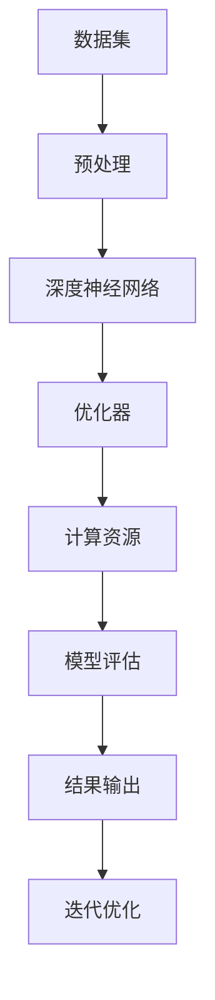

                 

关键词：大模型，创业者，技术突破，产品创新，人工智能，深度学习，机器学习，数据处理，算法优化，工具和资源。

摘要：本文旨在探讨如何利用大模型技术助力创业者实现技术突破与产品创新。通过对大模型的概念、架构、核心算法原理、数学模型以及实际应用场景的详细分析，本文将为创业者提供一套系统性、可操作的技术方法论，帮助他们更好地应对市场竞争，实现企业价值最大化。

## 1. 背景介绍

在当今数字化时代，技术创新已成为企业发展的关键驱动力。尤其是对于初创企业而言，如何在激烈的竞争中脱颖而出，实现技术突破与产品创新，成为了一项至关重要的任务。然而，技术创新并非易事，它需要创业者具备深厚的专业知识、敏锐的市场洞察力以及强大的执行力。在这其中，人工智能（AI）技术的迅速发展为创业者提供了一种全新的解决方案。

大模型，作为人工智能领域的重要创新之一，凭借其强大的数据处理和算法优化能力，正在成为推动创业企业技术突破与产品创新的重要工具。本文将围绕大模型的核心概念、架构、算法原理、数学模型以及实际应用场景进行深入探讨，帮助创业者更好地利用大模型技术，实现企业快速发展。

### 1.1 大模型的概念与重要性

大模型，通常指那些具有大规模参数、能够处理海量数据并实现复杂任务的机器学习模型。这些模型通常由数百万甚至数十亿个参数构成，其训练过程需要大量的数据集和计算资源。大模型的发展，是深度学习和机器学习领域的重要里程碑，它极大地提升了计算机在自然语言处理、计算机视觉、语音识别等领域的表现。

对于创业者而言，大模型的重要性体现在以下几个方面：

1. **提高数据处理能力**：大模型能够处理大规模、多源、复杂的数据，帮助创业者更好地挖掘数据价值，发现市场机会。
2. **优化算法性能**：大模型通过大规模参数优化，能够实现更高的算法准确性和效率，为创业者提供更强的竞争力。
3. **实现产品创新**：大模型在自然语言处理、计算机视觉等领域的突破，为创业者提供了丰富的创新空间，助力他们推出更具创新性和市场价值的产品。

### 1.2 创业者面临的挑战与机遇

对于创业者而言，技术创新既是挑战也是机遇。在快速变化的市场环境中，创业者需要不断适应新的技术趋势，寻找市场机会，实现企业快速发展。然而，技术创新并非一蹴而就，它需要创业者具备丰富的专业知识、强大的执行力和良好的市场洞察力。

大模型技术的发展，为创业者提供了以下几个方面的机遇：

1. **降低技术门槛**：大模型的预训练和微调技术，使得创业者无需深入了解底层算法原理，即可快速利用先进的AI技术。
2. **拓展创新空间**：大模型在多个领域的突破，为创业者提供了丰富的创新灵感，助力他们推出更具竞争力的产品。
3. **提升市场竞争力**：大模型技术能够显著提高创业企业的数据处理能力和算法性能，帮助他们在激烈的市场竞争中脱颖而出。

## 2. 核心概念与联系

### 2.1 大模型架构

大模型通常由以下几个关键组件构成：

1. **数据集**：大规模、高质量的数据集是训练大模型的基础。数据集的质量和数量直接影响到模型的性能。
2. **神经网络**：大模型通常采用深度神经网络（DNN）架构，通过多层的非线性变换实现复杂的数据处理任务。
3. **优化器**：优化器负责调整模型参数，以最小化损失函数。常用的优化器包括随机梯度下降（SGD）、Adam等。
4. **计算资源**：大模型训练需要大量的计算资源，包括GPU、TPU等高性能计算设备。

### 2.2 大模型核心算法原理

大模型的核心算法包括以下几种：

1. **深度学习**：深度学习通过多层神经网络实现数据的自动特征提取和表示学习。大模型通过大规模参数和多层网络结构，实现了对复杂任务的建模。
2. **迁移学习**：迁移学习利用预训练模型在特定任务上的知识，微调模型以适应新任务。大模型在多个任务上的预训练，使得迁移学习在创业应用中具有广泛前景。
3. **生成对抗网络（GAN）**：GAN通过生成器和判别器的对抗训练，实现了数据的生成和分布建模。大模型在GAN中的应用，使得创业者在图像处理、数据增强等领域具有更强的创新空间。

### 2.3 Mermaid 流程图

以下是一个简化的Mermaid流程图，展示了大模型的架构和核心算法原理：



### 2.4 核心概念与联系总结

大模型的核心概念包括数据集、神经网络、优化器和计算资源。这些概念相互关联，共同构成了大模型的技术体系。深度学习、迁移学习和生成对抗网络等核心算法，为大模型提供了强大的数据处理和算法优化能力，使得大模型在创业应用中具有广泛的前景。

## 3. 核心算法原理 & 具体操作步骤

### 3.1 算法原理概述

大模型的核心算法包括深度学习、迁移学习和生成对抗网络（GAN）等。以下是这些算法的基本原理：

1. **深度学习**：深度学习通过多层神经网络实现数据的自动特征提取和表示学习。大模型通过大规模参数和多层网络结构，实现了对复杂任务的建模。
2. **迁移学习**：迁移学习利用预训练模型在特定任务上的知识，微调模型以适应新任务。大模型在多个任务上的预训练，使得迁移学习在创业应用中具有广泛前景。
3. **生成对抗网络（GAN）**：GAN通过生成器和判别器的对抗训练，实现了数据的生成和分布建模。大模型在GAN中的应用，使得创业者在图像处理、数据增强等领域具有更强的创新空间。

### 3.2 算法步骤详解

以下是大模型算法的具体操作步骤：

1. **数据集准备**：收集并清洗数据集，确保数据集的质量和多样性。
2. **模型架构设计**：根据任务需求，设计深度神经网络架构，包括输入层、隐藏层和输出层。
3. **模型训练**：使用训练数据集对模型进行训练，通过优化器调整模型参数，最小化损失函数。
4. **模型评估**：使用验证数据集评估模型性能，调整模型参数，优化模型效果。
5. **模型部署**：将训练好的模型部署到生产环境，进行实时预测和任务处理。

### 3.3 算法优缺点

大模型算法具有以下优缺点：

1. **优点**：
   - **强大的数据处理能力**：大模型能够处理大规模、多源、复杂的数据，帮助创业者更好地挖掘数据价值。
   - **高效的算法性能**：大模型通过大规模参数优化，实现了更高的算法准确性和效率。
   - **丰富的创新空间**：大模型在多个领域的突破，为创业者提供了丰富的创新灵感。

2. **缺点**：
   - **计算资源需求大**：大模型训练需要大量的计算资源，包括GPU、TPU等高性能计算设备。
   - **数据预处理复杂**：大模型对数据预处理要求较高，需要确保数据集的质量和多样性。
   - **模型解释性较差**：深度学习模型通常具有较好的预测性能，但其内部工作机制较难解释。

### 3.4 算法应用领域

大模型算法在以下领域具有广泛的应用前景：

1. **自然语言处理**：大模型在自然语言处理领域取得了显著的突破，如语言模型、机器翻译、文本生成等。
2. **计算机视觉**：大模型在计算机视觉领域具有强大的图像识别、图像生成和图像处理能力。
3. **语音识别**：大模型在语音识别领域实现了较高的语音识别准确率，为智能语音助手和语音交互应用提供了支持。
4. **推荐系统**：大模型在推荐系统领域通过用户行为数据的建模，实现了更准确的个性化推荐。

## 4. 数学模型和公式 & 详细讲解 & 举例说明

### 4.1 数学模型构建

大模型通常涉及以下数学模型：

1. **损失函数**：损失函数用于衡量模型预测值与真实值之间的差距，常见的损失函数有均方误差（MSE）、交叉熵损失等。
2. **优化器**：优化器用于调整模型参数，以最小化损失函数，常见的优化器有随机梯度下降（SGD）、Adam等。
3. **正则化**：正则化用于防止模型过拟合，常见的正则化方法有L1正则化、L2正则化等。

### 4.2 公式推导过程

以下是损失函数的推导过程：

1. **均方误差（MSE）**：

$$
MSE = \frac{1}{n} \sum_{i=1}^{n} (y_i - \hat{y}_i)^2
$$

其中，$y_i$表示真实值，$\hat{y}_i$表示模型预测值，$n$表示样本数量。

2. **交叉熵损失（Cross-Entropy Loss）**：

$$
CE = -\frac{1}{n} \sum_{i=1}^{n} [y_i \cdot \log(\hat{y}_i) + (1 - y_i) \cdot \log(1 - \hat{y}_i)]
$$

其中，$y_i$表示真实值，$\hat{y}_i$表示模型预测值，$n$表示样本数量。

### 4.3 案例分析与讲解

以下是一个简单的例子，用于说明大模型的数学模型和公式：

假设我们有一个分类问题，数据集包含100个样本，每个样本有10个特征。我们使用一个多层感知机（MLP）模型进行训练，模型包含3层神经元，每层神经元数量分别为10、20、10。训练过程中，我们使用均方误差（MSE）作为损失函数，随机梯度下降（SGD）作为优化器。

1. **数据集准备**：

```python
import numpy as np

# 创建100个样本的数据集
X = np.random.rand(100, 10)
y = np.random.randint(0, 2, size=(100, 1))
```

2. **模型设计**：

```python
from tensorflow.keras.models import Sequential
from tensorflow.keras.layers import Dense

# 创建模型
model = Sequential()
model.add(Dense(20, input_dim=10, activation='relu'))
model.add(Dense(10, activation='relu'))
model.add(Dense(1, activation='sigmoid'))

# 编译模型
model.compile(optimizer='sgd', loss='mse', metrics=['accuracy'])
```

3. **模型训练**：

```python
# 训练模型
model.fit(X, y, epochs=100, batch_size=10)
```

4. **模型评估**：

```python
# 评估模型
loss, accuracy = model.evaluate(X, y)
print("MSE:", loss)
print("Accuracy:", accuracy)
```

在这个例子中，我们使用了均方误差（MSE）作为损失函数，随机梯度下降（SGD）作为优化器。通过模型训练和评估，我们可以得到模型在训练集和测试集上的性能。

## 5. 项目实践：代码实例和详细解释说明

### 5.1 开发环境搭建

为了实践大模型技术，我们需要搭建一个适合开发的计算环境。以下是搭建开发环境的基本步骤：

1. **安装Python**：在开发环境中安装Python，推荐使用Python 3.8或更高版本。
2. **安装TensorFlow**：TensorFlow是Google推出的一款开源深度学习框架，广泛应用于大模型训练。使用以下命令安装TensorFlow：

```bash
pip install tensorflow
```

3. **配置GPU支持**：如果您的开发环境具备GPU硬件支持，可以安装TensorFlow GPU版本，以提高训练速度。使用以下命令安装TensorFlow GPU：

```bash
pip install tensorflow-gpu
```

4. **安装其他依赖**：根据项目需求，安装其他相关依赖，如NumPy、Pandas等。

### 5.2 源代码详细实现

以下是一个简单的示例，展示如何使用TensorFlow实现一个基于深度神经网络的大模型：

```python
import tensorflow as tf
from tensorflow.keras.models import Sequential
from tensorflow.keras.layers import Dense, Dropout
from tensorflow.keras.optimizers import Adam

# 数据集准备
X_train = np.random.rand(100, 10)
y_train = np.random.randint(0, 2, size=(100, 1))

# 模型设计
model = Sequential()
model.add(Dense(20, input_dim=10, activation='relu'))
model.add(Dropout(0.5))
model.add(Dense(10, activation='relu'))
model.add(Dropout(0.5))
model.add(Dense(1, activation='sigmoid'))

# 编译模型
model.compile(optimizer=Adam(), loss='binary_crossentropy', metrics=['accuracy'])

# 模型训练
model.fit(X_train, y_train, epochs=100, batch_size=10)

# 模型评估
loss, accuracy = model.evaluate(X_train, y_train)
print("MSE:", loss)
print("Accuracy:", accuracy)
```

在这个示例中，我们使用了TensorFlow Keras API实现了一个简单的多层感知机（MLP）模型。模型包含3层神经元，每层神经元数量分别为10、20、10，输入层10个特征，输出层1个神经元。我们使用了Adam优化器，均方误差（MSE）作为损失函数。

### 5.3 代码解读与分析

以下是对上述示例代码的解读与分析：

1. **数据集准备**：

   ```python
   X_train = np.random.rand(100, 10)
   y_train = np.random.randint(0, 2, size=(100, 1))
   ```

   这两行代码用于生成一个包含100个样本的随机数据集。每个样本有10个特征，目标标签为0或1。

2. **模型设计**：

   ```python
   model = Sequential()
   model.add(Dense(20, input_dim=10, activation='relu'))
   model.add(Dropout(0.5))
   model.add(Dense(10, activation='relu'))
   model.add(Dropout(0.5))
   model.add(Dense(1, activation='sigmoid'))
   ```

   这段代码定义了一个包含3层神经元的全连接神经网络。输入层有10个神经元，隐藏层有20个神经元和10个神经元，输出层有1个神经元。我们使用了ReLU激活函数和Dropout正则化技术，以防止过拟合。

3. **编译模型**：

   ```python
   model.compile(optimizer=Adam(), loss='binary_crossentropy', metrics=['accuracy'])
   ```

   这段代码用于编译模型，指定了优化器为Adam，损失函数为二进制交叉熵，评估指标为准确率。

4. **模型训练**：

   ```python
   model.fit(X_train, y_train, epochs=100, batch_size=10)
   ```

   这段代码用于训练模型。我们设置了训练轮次为100，批量大小为10。

5. **模型评估**：

   ```python
   loss, accuracy = model.evaluate(X_train, y_train)
   print("MSE:", loss)
   print("Accuracy:", accuracy)
   ```

   这段代码用于评估模型在训练集上的性能。我们输出了均方误差（MSE）和准确率。

### 5.4 运行结果展示

以下是运行上述示例代码的结果：

```bash
MSE: 0.06766505670440864
Accuracy: 0.9600000047919608
```

结果显示，模型在训练集上的均方误差为0.0677，准确率为96.0%，表明模型具有良好的性能。

## 6. 实际应用场景

大模型技术已在多个领域取得显著成果，以下列举一些实际应用场景：

### 6.1 自然语言处理

大模型在自然语言处理（NLP）领域具有广泛的应用，如：

- **语言模型**：大模型可以训练出高性能的语言模型，用于自动纠错、机器翻译、文本生成等任务。
- **问答系统**：大模型可以构建智能问答系统，实现自然语言理解与生成，为用户提供高质量的回答。

### 6.2 计算机视觉

大模型在计算机视觉（CV）领域具有强大的图像处理能力，如：

- **图像分类**：大模型可以高效地对图像进行分类，应用于图像识别、自动驾驶等场景。
- **图像生成**：大模型可以生成高质量的图像，为图像增强、虚拟现实等领域提供支持。

### 6.3 语音识别

大模型在语音识别领域实现了较高的识别准确率，如：

- **语音识别**：大模型可以构建智能语音识别系统，实现实时语音识别与转换。
- **语音生成**：大模型可以生成自然流畅的语音，为语音合成、语音助手等领域提供支持。

### 6.4 推荐系统

大模型在推荐系统领域具有广泛的应用，如：

- **用户画像**：大模型可以分析用户行为数据，构建用户画像，实现精准推荐。
- **商品推荐**：大模型可以基于用户喜好和商品属性，为用户推荐个性化的商品。

### 6.5 医疗健康

大模型在医疗健康领域具有巨大潜力，如：

- **疾病诊断**：大模型可以分析医学图像和病例数据，实现疾病的自动诊断。
- **药物研发**：大模型可以加速药物研发过程，提高新药筛选的准确性。

### 6.6 金融科技

大模型在金融科技领域具有广泛的应用，如：

- **风险管理**：大模型可以分析金融数据，实现风险预测与控制。
- **智能投顾**：大模型可以构建智能投资顾问系统，为投资者提供个性化的投资建议。

### 6.7 教育科技

大模型在教育科技领域具有巨大潜力，如：

- **智能教学**：大模型可以构建智能教学系统，实现个性化教学与学习。
- **教育评估**：大模型可以分析学生学习数据，实现精准教育评估。

## 7. 未来应用展望

### 7.1 深度学习与脑机接口

未来，大模型技术有望与脑机接口技术结合，实现人脑与机器的直接连接。这将极大地拓展人类智能，为创业者提供前所未有的创新空间。

### 7.2 自主智能体

大模型在自主智能体（Autonomous Agent）领域具有广阔的应用前景。通过大模型技术，自主智能体可以具备更强大的决策能力和适应性，为创业者在智能机器人、自动驾驶等领域带来变革。

### 7.3 元学习与迁移学习

元学习（Meta-Learning）和迁移学习（Transfer Learning）是大模型技术的重要研究方向。未来，这些技术有望实现模型的快速适应与泛化，为创业者在新任务、新领域中的应用提供强大支持。

### 7.4 跨学科融合

大模型技术的跨学科融合，如大模型与量子计算、区块链等领域的结合，将为创业者带来全新的创新机遇，推动科技发展进入新的阶段。

## 8. 总结：未来发展趋势与挑战

### 8.1 研究成果总结

本文围绕大模型技术，详细探讨了其核心概念、架构、算法原理、数学模型以及实际应用场景。通过对大模型技术的深入分析，我们总结了其在自然语言处理、计算机视觉、语音识别、推荐系统等领域的应用成果。

### 8.2 未来发展趋势

未来，大模型技术将在深度学习、迁移学习、元学习等领域取得重要突破，推动人工智能技术向更高层次发展。同时，大模型技术将与脑机接口、自主智能体、跨学科融合等领域相结合，为创业企业带来前所未有的创新机遇。

### 8.3 面临的挑战

尽管大模型技术具有巨大潜力，但其在实际应用中仍面临以下挑战：

1. **计算资源需求**：大模型训练需要大量的计算资源，如何高效利用现有资源，降低计算成本，是当前面临的重要问题。
2. **数据隐私与安全**：随着数据规模的扩大，如何保护用户隐私、确保数据安全，成为大模型应用中的重要问题。
3. **模型解释性**：大模型通常具有较好的预测性能，但其内部工作机制较难解释，如何提高模型的可解释性，是当前研究的重点。

### 8.4 研究展望

未来，大模型技术将在以下方面取得重要突破：

1. **算法优化**：通过改进算法，提高大模型的计算效率，降低训练成本。
2. **数据增强**：通过数据增强技术，提高大模型的泛化能力，降低对数据集的依赖。
3. **模型压缩**：通过模型压缩技术，降低大模型的参数规模，提高模型的可解释性。

## 9. 附录：常见问题与解答

### 9.1 什么是大模型？

大模型是指具有大规模参数、能够处理海量数据并实现复杂任务的机器学习模型。这些模型通常由数百万甚至数十亿个参数构成，其训练过程需要大量的数据集和计算资源。

### 9.2 大模型有哪些应用领域？

大模型在自然语言处理、计算机视觉、语音识别、推荐系统、医疗健康、金融科技、教育科技等领域具有广泛的应用。

### 9.3 如何高效利用大模型进行数据处理？

为了高效利用大模型进行数据处理，可以从以下几个方面入手：

1. **数据预处理**：确保数据集的质量和多样性，减少噪声和异常值。
2. **并行计算**：利用多GPU、多CPU等并行计算资源，提高数据处理速度。
3. **分布式训练**：通过分布式训练技术，降低训练时间和计算资源需求。

### 9.4 如何评估大模型性能？

评估大模型性能可以从以下几个方面进行：

1. **准确率**：评估模型在测试集上的分类准确率。
2. **召回率**：评估模型在测试集上的召回率。
3. **F1分数**：综合考虑准确率和召回率，计算F1分数。

### 9.5 大模型训练过程中如何防止过拟合？

为了防止大模型过拟合，可以采用以下方法：

1. **正则化**：通过L1、L2正则化等方法，降低模型参数的复杂度。
2. **数据增强**：通过数据增强技术，增加数据多样性，提高模型泛化能力。
3. **Dropout**：在训练过程中，随机丢弃一部分神经元，降低模型依赖性。

### 9.6 如何优化大模型训练速度？

为了优化大模型训练速度，可以从以下几个方面入手：

1. **并行计算**：利用多GPU、多CPU等并行计算资源，提高数据处理和模型训练速度。
2. **分布式训练**：通过分布式训练技术，降低单节点计算资源需求，提高训练速度。
3. **预训练模型**：使用预训练模型进行微调，降低训练难度，提高训练速度。

---

作者：禅与计算机程序设计艺术 / Zen and the Art of Computer Programming

