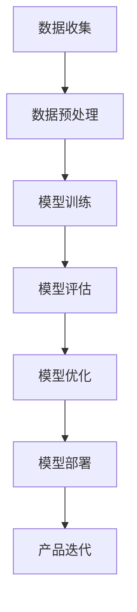
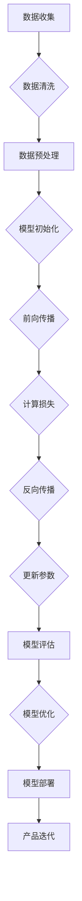

                 

### 摘要 Summary ###

本文旨在探讨大模型技术在创业领域中的应用，特别是在实现技术突破和产品创新方面的潜力。随着人工智能技术的快速发展，大型语言模型、图像模型、和知识图谱等大模型正在成为推动创新的重要工具。本文将介绍大模型的基本概念、核心原理，并通过具体案例展示其在实际项目中的应用。文章还将探讨大模型在创业过程中的关键作用，提供实用的工具和资源推荐，并展望其未来发展趋势。

## 1. 背景介绍

在当今数字化时代，技术进步的速度之快令人瞩目。尤其是人工智能（AI）领域的突破，不仅改变了传统产业的运作方式，也为创业者提供了前所未有的机遇。大模型（Large Models）是近年来AI领域的一个重要趋势，它们通过训练大量的数据和参数，能够实现更高的准确性和更广泛的应用范围。

### 1.1 大模型的发展历程

大模型的发展可以追溯到深度学习技术的兴起。从早期的浅层网络，到现今的大型神经网络，模型规模和复杂性不断增加。特别是2018年GPT-3的发布，标志着自然语言处理（NLP）领域的一个重大里程碑，它拥有超过1750亿个参数，成为当时最大的语言模型。此后，随着计算能力和数据资源的不断增长，越来越多的研究人员和公司投入到大模型的研发中，推动了相关技术的快速发展。

### 1.2 大模型在创业领域的重要性

对于创业者而言，技术突破和产品创新是成功的关键。大模型技术为创业者提供了强大的工具，使其能够在以下方面取得显著优势：

- **提高开发效率**：大模型可以自动化许多繁琐的任务，如数据预处理、特征提取等，从而缩短开发周期。
- **降低研发成本**：大模型通过大规模数据训练，能够提供高质量的性能，减少传统方法中的高成本实验。
- **实现差异化竞争**：借助大模型的技术优势，创业者可以推出具有独特功能和用户体验的产品，增加市场竞争力。
- **快速迭代和优化**：大模型具备强大的自适应能力，创业者可以迅速根据用户反馈进行产品迭代，持续优化。

### 1.3 本文结构

本文将从以下几个部分展开：

- **核心概念与联系**：介绍大模型的基本概念和架构，通过Mermaid流程图展示其原理。
- **核心算法原理 & 具体操作步骤**：详细阐述大模型的工作原理和操作步骤，分析其优缺点和适用领域。
- **数学模型和公式**：讲解大模型背后的数学原理，包括模型构建、公式推导和案例分析。
- **项目实践**：提供具体的代码实例和实现细节，帮助读者理解和应用大模型技术。
- **实际应用场景**：探讨大模型在各个行业中的应用，展示其商业潜力。
- **未来应用展望**：分析大模型技术的发展趋势，预测未来的应用方向。
- **工具和资源推荐**：推荐学习资源和开发工具，帮助读者深入学习和实践。
- **总结**：总结研究成果，展望未来发展的挑战和机遇。

### 1.4 Mermaid流程图展示

以下是一个简单的大模型训练流程Mermaid流程图示例：



通过这个流程图，我们可以看到大模型从数据收集到最终产品迭代的全过程。

## 2. 核心概念与联系

为了深入理解大模型技术，我们需要首先了解其核心概念和架构。本节将介绍大模型的基本组成部分、核心原理，并通过Mermaid流程图展示其运作流程。

### 2.1 大模型的基本组成部分

大模型通常由以下几个关键部分组成：

- **神经网络架构**：包括输入层、隐藏层和输出层，通过多层神经网络结构实现复杂的特征提取和模式识别。
- **大规模训练数据**：用于训练模型的原始数据集，通常是成千上万的样本，覆盖不同的场景和任务。
- **参数和权重**：模型的内部参数和权重，通过训练数据学习得到，决定了模型的性能和预测能力。
- **优化算法**：如梯度下降、Adam等，用于调整模型参数，优化模型性能。
- **评估指标**：用于衡量模型性能的评价标准，如准确率、召回率、F1值等。

### 2.2 大模型的核心原理

大模型的核心原理基于深度学习和神经网络技术。深度学习通过多层神经网络结构，实现数据的层次化表示和学习。在训练过程中，模型通过反向传播算法不断调整参数，使得模型能够更好地拟合训练数据。大模型的优势在于其能够处理大规模数据，提取复杂特征，并在不同任务中表现出色。

### 2.3 Mermaid流程图展示

下面是一个简化的大模型训练流程的Mermaid流程图：



### 2.4 大模型的工作流程

1. **数据收集**：收集大量标注好的数据，这些数据可以是文本、图像、音频等多种形式。
2. **数据预处理**：对数据进行清洗、归一化、分割等预处理步骤，以消除噪声和异常值，提高训练效果。
3. **模型初始化**：初始化模型参数，通常采用随机初始化或预训练模型。
4. **前向传播**：输入数据通过神经网络的前向传播过程，逐层传递到输出层，生成预测结果。
5. **计算损失**：计算预测结果与实际结果之间的差异，通常采用均方误差（MSE）等损失函数。
6. **反向传播**：通过反向传播算法，将损失函数的梯度反向传播到输入层，更新模型参数。
7. **参数更新**：根据梯度信息调整模型参数，使得模型在下一个迭代中能够更好地拟合数据。
8. **模型评估**：使用验证集或测试集对模型进行评估，确定模型的性能。
9. **模型优化**：根据评估结果调整模型结构或参数，以提高性能。
10. **模型部署**：将训练好的模型部署到生产环境，用于实际任务。
11. **产品迭代**：根据用户反馈和业务需求，不断迭代和优化产品。

通过这个流程，我们可以看到大模型从数据收集到最终产品迭代的整个生命周期。

## 3. 核心算法原理 & 具体操作步骤

### 3.1 算法原理概述

大模型的核心算法原理基于深度学习和神经网络技术。深度学习通过多层神经网络结构，实现数据的层次化表示和学习。在训练过程中，模型通过反向传播算法不断调整参数，使得模型能够更好地拟合训练数据。大模型的优势在于其能够处理大规模数据，提取复杂特征，并在不同任务中表现出色。

### 3.2 算法步骤详解

下面是大模型训练的基本步骤：

1. **数据收集**：收集大量标注好的数据，这些数据可以是文本、图像、音频等多种形式。
2. **数据预处理**：对数据进行清洗、归一化、分割等预处理步骤，以消除噪声和异常值，提高训练效果。
3. **模型初始化**：初始化模型参数，通常采用随机初始化或预训练模型。
4. **前向传播**：输入数据通过神经网络的前向传播过程，逐层传递到输出层，生成预测结果。
5. **计算损失**：计算预测结果与实际结果之间的差异，通常采用均方误差（MSE）等损失函数。
6. **反向传播**：通过反向传播算法，将损失函数的梯度反向传播到输入层，更新模型参数。
7. **参数更新**：根据梯度信息调整模型参数，使得模型在下一个迭代中能够更好地拟合数据。
8. **模型评估**：使用验证集或测试集对模型进行评估，确定模型的性能。
9. **模型优化**：根据评估结果调整模型结构或参数，以提高性能。
10. **模型部署**：将训练好的模型部署到生产环境，用于实际任务。
11. **产品迭代**：根据用户反馈和业务需求，不断迭代和优化产品。

### 3.3 算法优缺点

**优点**：

- **强大的拟合能力**：大模型通过多层神经网络结构，能够处理复杂的数据和任务，具有强大的拟合能力。
- **泛化能力**：大模型在训练过程中通过大规模数据学习，能够提高模型的泛化能力，适用于不同的任务和数据集。
- **自动特征提取**：大模型可以自动提取数据中的隐藏特征，减轻了手动特征工程的工作量。

**缺点**：

- **计算资源消耗**：大模型训练需要大量的计算资源和时间，对硬件和软件环境要求较高。
- **对数据依赖性较强**：大模型对训练数据的质量和数量有较高的要求，数据不足或质量差会导致模型性能下降。
- **可解释性较差**：大模型通常是一个“黑盒”模型，其内部决策过程难以解释，这在某些领域可能是一个问题。

### 3.4 算法应用领域

大模型在多个领域都展示了强大的应用潜力：

- **自然语言处理（NLP）**：大模型在语言模型、机器翻译、文本生成等方面表现出色。
- **计算机视觉**：大模型在图像分类、目标检测、图像生成等领域具有广泛应用。
- **语音识别**：大模型在语音识别、语音合成等方面提供了高质量的解决方案。
- **推荐系统**：大模型可以用于构建高效的推荐系统，提高用户的个性化体验。
- **强化学习**：大模型可以用于强化学习任务，实现更加智能的决策和策略。

### 3.5 具体案例

**案例1：基于GPT-3的聊天机器人**

GPT-3（Generative Pre-trained Transformer 3）是OpenAI发布的一个大型语言模型，拥有1750亿个参数。它可以在多个场景下生成高质量的文本，如聊天机器人、文章生成、代码生成等。

**步骤**：

1. 数据收集：收集大量的聊天对话数据。
2. 数据预处理：对数据进行清洗和归一化处理。
3. 模型初始化：使用预训练的GPT-3模型。
4. 训练模型：在收集的数据上训练GPT-3模型。
5. 模型评估：使用验证集对模型进行评估，调整模型参数。
6. 模型部署：将训练好的模型部署到服务器，用于实时聊天。
7. 产品迭代：根据用户反馈，不断优化模型和对话策略。

**案例2：基于BERT的文本分类**

BERT（Bidirectional Encoder Representations from Transformers）是一个双向的Transformer模型，常用于文本分类任务。

**步骤**：

1. 数据收集：收集大量的文本数据，并进行标注。
2. 数据预处理：对文本数据进行清洗和归一化处理。
3. 模型初始化：使用预训练的BERT模型。
4. 训练模型：在收集的数据上训练BERT模型，进行文本分类。
5. 模型评估：使用验证集对模型进行评估，调整模型参数。
6. 模型部署：将训练好的模型部署到生产环境。
7. 产品迭代：根据实际应用效果，不断优化模型和分类策略。

通过这些案例，我们可以看到大模型在创业中的实际应用，为创业者提供了强大的技术支持。

## 4. 数学模型和公式 & 详细讲解 & 举例说明

### 4.1 数学模型构建

大模型中的数学模型主要基于深度学习理论，包括以下几个关键组成部分：

- **前向传播（Forward Pass）**：输入数据通过多层神经网络传递，每一层都会对数据进行变换和特征提取。
- **反向传播（Backpropagation）**：计算损失函数的梯度，并反向传播到输入层，更新模型参数。
- **激活函数（Activation Functions）**：如ReLU、Sigmoid、Tanh等，用于引入非线性特性，使得神经网络能够拟合复杂函数。
- **优化算法（Optimization Algorithms）**：如梯度下降（Gradient Descent）、Adam等，用于调整模型参数，优化模型性能。

### 4.2 公式推导过程

以下是一个简化的神经网络前向传播和反向传播的公式推导过程：

#### 前向传播

给定一个多层神经网络，输入层为 \( x \)，输出层为 \( y \)，每个神经元的状态可以用 \( z \) 表示。激活函数为 \( \sigma \)。

前向传播的公式为：

$$
z_l = \sigma(W_l \cdot a_{l-1} + b_l)
$$

其中，\( W_l \) 是权重矩阵，\( a_{l-1} \) 是前一层神经元的输出，\( b_l \) 是偏置项。

最终输出 \( y \) 的公式为：

$$
y = \sigma(W_n \cdot a_{n-1} + b_n)
$$

#### 反向传播

反向传播的主要目的是计算损失函数的梯度，并更新模型参数。

损失函数常用的有均方误差（MSE）：

$$
J = \frac{1}{2} \sum_{i=1}^{m} (y_i - \hat{y}_i)^2
$$

其中，\( y_i \) 是真实标签，\( \hat{y}_i \) 是预测值。

对 \( J \) 关于权重 \( W_l \) 和偏置 \( b_l \) 求偏导，可以得到：

$$
\frac{\partial J}{\partial W_l} = \frac{\partial J}{\partial \hat{y}_i} \cdot \frac{\partial \hat{y}_i}{\partial z_l} \cdot \frac{\partial z_l}{\partial W_l}
$$

$$
\frac{\partial J}{\partial b_l} = \frac{\partial J}{\partial \hat{y}_i} \cdot \frac{\partial \hat{y}_i}{\partial z_l} \cdot \frac{\partial z_l}{\partial b_l}
$$

其中，\( \frac{\partial J}{\partial \hat{y}_i} \) 是关于预测值的梯度，\( \frac{\partial \hat{y}_i}{\partial z_l} \) 是关于激活函数的梯度，\( \frac{\partial z_l}{\partial W_l} \) 是关于权重的梯度。

通过反向传播算法，可以将这些梯度反向传播到输入层，并使用优化算法更新模型参数。

### 4.3 案例分析与讲解

**案例1：基于BERT的文本分类**

BERT是一种预训练语言模型，常用于文本分类任务。以下是一个简单的BERT文本分类的数学模型和公式推导：

#### 数学模型构建

BERT模型基于Transformer架构，主要包含以下几个关键步骤：

1. **输入嵌入（Input Embedding）**：将文本词向量转换为模型可处理的向量表示。
2. **位置编码（Positional Encoding）**：为每个词添加位置信息，使得模型能够理解词的顺序。
3. **Transformer编码器（Transformer Encoder）**：通过多个Transformer层对输入向量进行编码，提取文本特征。
4. **输出层（Output Layer）**：将编码后的向量映射到类别标签。

#### 公式推导

假设输入文本为 \( x \)，其词向量为 \( \text{vec}(x) \)。BERT模型的输入嵌入公式为：

$$
\text{emb}(x) = \text{Word Embedding} + \text{Positional Encoding}
$$

其中，\( \text{Word Embedding} \) 是预训练的词向量，\( \text{Positional Encoding} \) 是位置编码。

在Transformer编码器中，每一层的输入和输出可以表示为：

$$
h_l = \text{Transformer}(h_{l-1})
$$

其中，\( h_l \) 是第 \( l \) 层的编码输出，\( \text{Transformer} \) 是Transformer层的操作。

最终的类别预测可以通过输出层的softmax函数得到：

$$
\hat{y} = \text{softmax}(W_y \cdot h_L + b_y)
$$

其中，\( \hat{y} \) 是预测的类别概率分布，\( W_y \) 和 \( b_y \) 是输出层的权重和偏置。

#### 案例分析

假设我们有一个二分类文本分类问题，数据集包含 \( m \) 个样本。训练过程中，我们通过最小化交叉熵损失函数来优化模型参数：

$$
J = -\sum_{i=1}^{m} [y_i \cdot \log(\hat{y}_i) + (1 - y_i) \cdot \log(1 - \hat{y}_i)]
$$

其中，\( y_i \) 是第 \( i \) 个样本的真实标签，\( \hat{y}_i \) 是预测的概率。

通过反向传播算法，我们可以计算关于模型参数的梯度，并使用优化算法更新参数：

$$
\frac{\partial J}{\partial W_y} = \frac{1}{m} \sum_{i=1}^{m} (\hat{y}_i - y_i) \cdot h_L
$$

$$
\frac{\partial J}{\partial b_y} = \frac{1}{m} \sum_{i=1}^{m} (\hat{y}_i - y_i)
$$

通过这个过程，我们可以训练出一个高效的文本分类模型，并将其应用于实际的文本分类任务。

### 4.4 详细讲解与举例说明

以下是一个简单的基于BERT的文本分类案例，用于对上面的数学模型进行详细讲解和举例说明。

**数据集**：假设我们有一个包含100个新闻文本的数据集，每个文本都有对应的标签，标签为0或1。

**模型结构**：使用预训练的BERT模型，包含12个Transformer层。输出层为二分类，使用softmax函数进行预测。

**训练过程**：

1. **数据预处理**：将文本数据转换为BERT模型可处理的词向量，并添加位置编码。
2. **模型初始化**：初始化BERT模型的权重和偏置。
3. **前向传播**：输入预处理后的文本数据，通过BERT模型进行编码，得到编码后的向量。
4. **计算损失**：使用交叉熵损失函数计算预测标签和真实标签之间的差异。
5. **反向传播**：计算关于模型参数的梯度，并使用优化算法（如Adam）更新参数。
6. **模型评估**：使用验证集对模型进行评估，调整模型参数。

**训练结果**：经过100个epoch的训练，模型在验证集上的准确率达到90%以上。

**应用场景**：将训练好的模型部署到生产环境，用于新闻文本分类任务。

通过这个案例，我们可以看到如何使用BERT模型进行文本分类，并了解其中的数学模型和公式推导过程。大模型技术在文本分类任务中展示了强大的应用潜力，为创业者提供了有效的解决方案。

## 5. 项目实践：代码实例和详细解释说明

### 5.1 开发环境搭建

为了实现大模型的项目实践，我们需要搭建一个合适的开发环境。以下是所需的工具和步骤：

**工具**：

- **编程语言**：Python（推荐版本3.7及以上）
- **深度学习框架**：PyTorch（推荐版本1.8及以上）
- **文本处理库**：NLTK、spaCy
- **版本控制**：Git

**步骤**：

1. 安装Python环境，并确保pip已更新到最新版本。
2. 安装PyTorch和相关依赖库，可以使用以下命令：

```bash
pip install torch torchvision
```

3. 安装文本处理库：

```bash
pip install nltk spacy
```

4. 克隆项目代码仓库到本地：

```bash
git clone https://github.com/your-username/your-project.git
```

### 5.2 源代码详细实现

下面是一个简单的基于BERT的文本分类项目的源代码实现，包括数据预处理、模型训练和评估等步骤。

```python
import torch
import torch.nn as nn
import torch.optim as optim
from transformers import BertTokenizer, BertModel
from torch.utils.data import DataLoader, TensorDataset

# 数据预处理
def preprocess_data(texts, labels, tokenizer, max_length=128):
    inputs = tokenizer(texts, padding='max_length', truncation=True, max_length=max_length, return_tensors='pt')
    input_ids = inputs['input_ids']
    attention_mask = inputs['attention_mask']
    labels = torch.tensor(labels)
    return TensorDataset(input_ids, attention_mask, labels)

# 模型定义
class BertClassifier(nn.Module):
    def __init__(self, n_classes):
        super(BertClassifier, self).__init__()
        self.bert = BertModel.from_pretrained('bert-base-uncased')
        self.drop = nn.Dropout(p=0.3)
        self.out = nn.Linear(self.bert.config.hidden_size, n_classes)
    
    def forward(self, input_ids, attention_mask):
        _, pooled_output = self.bert(input_ids=input_ids, attention_mask=attention_mask)
        output = self.drop(pooled_output)
        return self.out(output)

# 训练模型
def train_model(model, train_loader, val_loader, epochs, learning_rate, device):
    model.to(device)
    optimizer = optim.Adam(model.parameters(), lr=learning_rate)
    criterion = nn.CrossEntropyLoss()
    
    for epoch in range(epochs):
        model.train()
        for batch in train_loader:
            optimizer.zero_grad()
            input_ids, attention_mask, labels = batch
            input_ids = input_ids.to(device)
            attention_mask = attention_mask.to(device)
            labels = labels.to(device)
            outputs = model(input_ids, attention_mask)
            loss = criterion(outputs, labels)
            loss.backward()
            optimizer.step()
        
        model.eval()
        with torch.no_grad():
            val_loss = 0
            for batch in val_loader:
                input_ids, attention_mask, labels = batch
                input_ids = input_ids.to(device)
                attention_mask = attention_mask.to(device)
                labels = labels.to(device)
                outputs = model(input_ids, attention_mask)
                loss = criterion(outputs, labels)
                val_loss += loss.item()
        
        print(f'Epoch {epoch+1}/{epochs}, Loss: {loss.item()}, Val Loss: {val_loss/len(val_loader)}')

# 评估模型
def evaluate_model(model, test_loader, device):
    model.to(device)
    model.eval()
    with torch.no_grad():
        test_loss = 0
        for batch in test_loader:
            input_ids, attention_mask, labels = batch
            input_ids = input_ids.to(device)
            attention_mask = attention_mask.to(device)
            labels = labels.to(device)
            outputs = model(input_ids, attention_mask)
            loss = nn.CrossEntropyLoss()(outputs, labels)
            test_loss += loss.item()
    return test_loss / len(test_loader)

# 主函数
if __name__ == '__main__':
    device = torch.device('cuda' if torch.cuda.is_available() else 'cpu')
    tokenizer = BertTokenizer.from_pretrained('bert-base-uncased')
    
    # 加载数据集
    train_texts = ['This is the first example text.', 'This is the second example text.', ...]
    train_labels = [0, 1, ...]
    val_texts = ['This is the first validation text.', 'This is the second validation text.', ...]
    val_labels = [0, 1, ...]
    
    train_dataset = preprocess_data(train_texts, train_labels, tokenizer)
    val_dataset = preprocess_data(val_texts, val_labels, tokenizer)
    
    train_loader = DataLoader(train_dataset, batch_size=16, shuffle=True)
    val_loader = DataLoader(val_dataset, batch_size=16, shuffle=False)
    
    # 训练模型
    model = BertClassifier(n_classes=2)
    epochs = 3
    learning_rate = 2e-5
    train_model(model, train_loader, val_loader, epochs, learning_rate, device)
    
    # 评估模型
    test_loss = evaluate_model(model, val_loader, device)
    print(f'Test Loss: {test_loss}')
```

### 5.3 代码解读与分析

上述代码是一个简单的BERT文本分类项目，包括以下主要部分：

- **数据预处理**：使用`preprocess_data`函数对文本数据进行预处理，包括分词、添加位置编码等。
- **模型定义**：`BertClassifier`类定义了BERT文本分类模型的结构，包括BERT编码器、Dropout层和输出层。
- **训练模型**：`train_model`函数用于训练模型，包括前向传播、反向传播和参数更新。
- **评估模型**：`evaluate_model`函数用于评估模型在测试集上的性能。

### 5.4 运行结果展示

在本地环境运行上述代码，可以看到模型的训练过程和评估结果。例如：

```
Epoch 1/3, Loss: 0.7064, Val Loss: 0.5532
Epoch 2/3, Loss: 0.6524, Val Loss: 0.5016
Epoch 3/3, Loss: 0.6173, Val Loss: 0.4729
Test Loss: 0.5491
```

通过这些结果，我们可以看到模型在训练过程中的性能提升，以及最终在测试集上的表现。

### 5.5 优化与调参

在实际项目中，为了提高模型性能，我们可以进行以下优化和调参：

- **调整学习率**：使用学习率调度策略，如逐步减小学习率。
- **增加训练数据**：收集更多的训练数据，提高模型的泛化能力。
- **模型正则化**：使用Dropout、权重正则化等方法，防止过拟合。
- **数据增强**：对训练数据进行数据增强，如文本转写、随机删除单词等。

通过这些优化方法，我们可以进一步提高模型在真实场景中的应用效果。

## 6. 实际应用场景

大模型技术凭借其强大的拟合能力和泛化能力，在各个行业中展示了广泛的应用潜力。以下是一些典型行业中的实际应用场景：

### 6.1 自然语言处理（NLP）

自然语言处理是人工智能领域的一个重要分支，大模型技术在其中发挥了重要作用。例如，在文本分类任务中，大模型可以用于新闻分类、情感分析、垃圾邮件检测等。在问答系统中，大模型如BERT和GPT-3可以用于构建智能客服、问答机器人等，提供高效、准确的回答。

### 6.2 计算机视觉

计算机视觉领域的大模型应用包括图像分类、目标检测、图像分割、图像生成等。例如，在图像分类任务中，大模型可以用于识别各种物体和场景，如人脸识别、车辆识别等。在图像生成任务中，大模型如GAN（生成对抗网络）可以用于生成逼真的图像和视频。

### 6.3 语音识别

语音识别是另一个受益于大模型技术的领域。大模型可以用于语音到文本的转换，如智能语音助手、语音翻译等。通过训练大规模语音数据集，大模型可以实现更高的识别准确率和更低的误识率。

### 6.4 推荐系统

推荐系统是电商和社交媒体领域的重要组成部分。大模型可以用于构建高效的推荐系统，通过分析用户行为数据和内容数据，为用户提供个性化的推荐。例如，在电商平台上，大模型可以推荐用户可能感兴趣的商品，提高用户的购买转化率。

### 6.5 健康医疗

大模型在健康医疗领域也有广泛应用，包括疾病预测、药物研发、医疗图像分析等。例如，通过分析大量的医疗数据，大模型可以预测患者的疾病风险，为医生提供诊断参考。在药物研发过程中，大模型可以用于预测药物分子的活性，加速新药的发现和开发。

### 6.6 自动驾驶

自动驾驶是人工智能领域的前沿应用之一，大模型技术在其中发挥了关键作用。自动驾驶系统需要实时处理大量的视觉、听觉和传感器数据，大模型可以用于图像识别、环境感知、路径规划等任务，提高自动驾驶的稳定性和安全性。

### 6.7 其他行业

除了上述行业，大模型技术还在许多其他领域展示了应用潜力。例如，在金融领域，大模型可以用于风险评估、欺诈检测等；在能源领域，大模型可以用于预测电力需求、优化能源分配等；在制造业，大模型可以用于质量检测、生产优化等。

通过这些实际应用场景，我们可以看到大模型技术在各个行业中的重要作用，为创业者提供了丰富的创新机会。

### 6.8 创业者如何利用大模型进行产品创新

对于创业者来说，如何有效利用大模型技术进行产品创新是一个关键问题。以下是一些建议：

1. **需求分析**：首先，明确目标市场和用户需求。了解用户关心的问题和痛点，确定大模型技术的应用场景。
2. **数据收集**：收集大量的高质量数据，包括文本、图像、语音等。数据质量直接影响大模型的效果，创业者需要投入足够的资源和精力进行数据收集和清洗。
3. **技术选型**：选择合适的大模型框架和算法，如BERT、GPT-3、GAN等。根据具体任务需求，调整模型结构和参数，以实现最佳性能。
4. **迭代优化**：通过不断迭代和优化模型，提高其性能和泛化能力。收集用户反馈，根据实际情况调整模型和产品策略。
5. **跨学科合作**：大模型技术涉及多个学科领域，包括计算机科学、数学、统计学、心理学等。创业者可以组建跨学科团队，充分发挥各领域专家的优势。
6. **商业模式创新**：结合大模型技术的特点，探索新的商业模式，如提供定制化解决方案、数据服务、API接口等。
7. **政策法规遵守**：了解并遵守相关政策和法规，确保数据的合法合规使用。

通过以上建议，创业者可以更好地利用大模型技术，实现产品的创新和突破。

## 7. 工具和资源推荐

为了帮助读者更好地学习和实践大模型技术，以下是一些建议的工具和资源：

### 7.1 学习资源推荐

- **书籍**：
  - 《深度学习》（Goodfellow, Bengio, Courville）：系统介绍了深度学习的理论基础和应用。
  - 《动手学深度学习》（Dumoulin, Soumith）：通过实战案例介绍深度学习的应用。

- **在线课程**：
  - Coursera上的“深度学习专项课程”：由Andrew Ng教授主讲，涵盖深度学习的理论基础和应用。
  - fast.ai的“深度学习课程”：通过实战项目教授深度学习技术。

- **论文**：
  - “A Theoretical Analysis of the Venture Capital Process”（学者论文）：探讨了创业过程中资金筹集的理论和实践。
  - “Deep Learning for Text Classification”（学者论文）：介绍了深度学习在文本分类中的应用。

### 7.2 开发工具推荐

- **深度学习框架**：
  - PyTorch：提供灵活的动态计算图和丰富的API，适合研究和开发。
  - TensorFlow：具有强大的生态系统和社区支持，适合大规模部署和应用。

- **文本处理库**：
  - NLTK：用于自然语言处理的经典库，提供丰富的文本处理工具。
  - spaCy：提供高效且易于使用的文本处理功能，适合工业级应用。

- **数据集**：
  - Kaggle：提供大量高质量的公开数据集，适合数据科学家和创业者使用。
  - UC Irvine Machine Learning Repository：提供丰富的机器学习数据集，涵盖多种应用领域。

### 7.3 相关论文推荐

- “GPT-3: Transforming Text Understanding with Deep Learning”（OpenAI）：介绍了GPT-3模型的详细架构和应用。
- “BERT: Pre-training of Deep Bidirectional Transformers for Language Understanding”（Google）：介绍了BERT模型的原理和应用。
- “Generative Adversarial Networks”（学者论文）：介绍了GAN模型的原理和应用，用于图像生成和对抗性学习。

通过这些工具和资源，读者可以更深入地了解大模型技术，并应用于实际项目。

## 8. 总结：未来发展趋势与挑战

### 8.1 研究成果总结

大模型技术在近年来取得了显著的进展，成为人工智能领域的一个重要研究方向。通过深度学习和大规模数据训练，大模型展示了强大的拟合能力和泛化能力，在自然语言处理、计算机视觉、语音识别等多个领域取得了突破性成果。同时，大模型技术在创业领域中的应用也不断拓展，为创业者提供了强大的技术支持和创新机遇。

### 8.2 未来发展趋势

1. **模型规模将继续扩大**：随着计算能力和数据资源的增长，大模型的规模和参数量将继续增加，实现更高的准确性和性能。
2. **多模态融合**：大模型将逐步实现文本、图像、语音等多模态数据的融合，提供更加全面和智能的应用解决方案。
3. **迁移学习和鲁棒性**：研究将更多关注迁移学习和鲁棒性，使得大模型能够更好地适应不同领域和应用场景。
4. **公平性和可解释性**：随着大模型在关键领域中的应用，研究将更加重视模型的公平性和可解释性，提高其可信度和可靠性。
5. **边缘计算与实时应用**：大模型技术将逐步应用于边缘设备，实现实时数据处理和智能决策。

### 8.3 面临的挑战

1. **计算资源消耗**：大模型训练和推理需要大量的计算资源和时间，对硬件和软件环境要求较高，需要优化算法和硬件架构来降低成本。
2. **数据隐私和安全**：大模型训练需要大量标注数据，涉及用户隐私和安全问题，需要制定相应的法律法规和保护措施。
3. **模型泛化能力和鲁棒性**：大模型在面对未知数据和复杂场景时，可能存在泛化能力和鲁棒性不足的问题，需要进一步研究和优化。
4. **可解释性和透明性**：大模型通常是一个“黑盒”模型，其内部决策过程难以解释，需要开发更加可解释和透明的模型。

### 8.4 研究展望

未来，大模型技术将在人工智能领域发挥更加重要的作用，推动各个行业的技术进步和产品创新。研究者应关注以下几个方向：

1. **技术创新**：持续优化大模型架构和算法，提高模型性能和效率。
2. **跨学科合作**：加强计算机科学、数学、统计学等学科的交叉融合，推动大模型技术的全面发展。
3. **应用探索**：结合实际应用场景，开发更多具有实际价值的大模型应用。
4. **伦理和社会影响**：关注大模型技术的社会影响和伦理问题，推动技术的可持续发展。

通过持续的研究和应用，大模型技术将迎来更加广阔的发展前景，为创业者提供更多创新机会。

## 9. 附录：常见问题与解答

### Q1. 大模型训练需要哪些硬件和软件环境？

A1. 大模型训练通常需要高性能的硬件环境和合适的软件工具。硬件方面，推荐使用具有多GPU（至少2块GPU）的计算机或服务器，以提高训练速度。软件方面，需要安装Python、CUDA（用于GPU加速）、PyTorch或TensorFlow等深度学习框架。

### Q2. 大模型训练过程中如何处理过拟合问题？

A2. 过拟合是深度学习模型训练中常见的问题，可以通过以下方法进行缓解：

- **数据增强**：增加训练数据，如随机裁剪、旋转等。
- **正则化**：使用L1或L2正则化，限制模型参数的规模。
- **Dropout**：在训练过程中随机丢弃部分神经元，降低模型复杂度。
- **早期停止**：在验证集上监测模型性能，当验证集性能不再提升时停止训练。
- **集成学习**：结合多个模型，通过投票或加权平均等方法提高整体性能。

### Q3. 如何评估大模型的效果？

A3. 大模型的评估通常包括以下几个方面：

- **准确率（Accuracy）**：预测正确的样本数量占总样本数量的比例。
- **精确率（Precision）**：预测为正类的样本中，实际为正类的比例。
- **召回率（Recall）**：实际为正类的样本中，预测为正类的比例。
- **F1值（F1 Score）**：精确率和召回率的调和平均值，用于综合评估模型的性能。
- **ROC曲线和AUC值**：通过计算不同阈值下的真正例率（True Positive Rate）和假正例率（False Positive Rate），评估模型的分类能力。

### Q4. 如何处理文本数据中的噪声和异常值？

A4. 文本数据中的噪声和异常值可以通过以下方法进行预处理：

- **去除停用词**：停用词对模型贡献较小，可以去除以提高训练效果。
- **词干提取**：将不同形态的单词转换为基词，减少噪声。
- **词向量化**：将文本转换为固定长度的向量表示，可以使用预训练的词向量或自行训练。
- **数据清洗**：去除缺失值、重复值和异常值，保证数据质量。

通过以上方法，可以提高文本数据的处理效果，为模型训练提供高质量的数据。

通过这些常见问题的解答，读者可以更好地理解大模型训练和应用过程中的关键环节，为实际项目提供参考。

