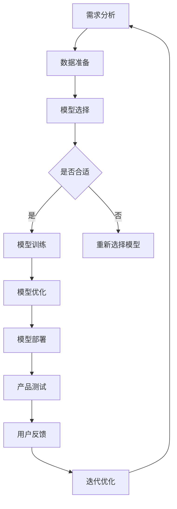

                 

关键词：大模型、AI 创业、产品开发、高效利用

摘要：随着人工智能技术的迅猛发展，大模型在 AI 创业产品开发中的应用变得越来越广泛。本文将深入探讨大模型在 AI 创业产品开发中的趋势，分析其优势与挑战，并探讨如何实现高效的 AI 利用。

## 1. 背景介绍

在过去的几年里，人工智能（AI）领域取得了显著的进展。其中，大模型（Large Models）的崛起尤为引人注目。大模型，如 GPT-3、BERT 等，凭借其庞大的参数规模和强大的计算能力，在自然语言处理、计算机视觉、语音识别等任务中取得了令人瞩目的成绩。

随着大模型的不断发展，越来越多的创业者开始将其应用于产品开发中。大模型的应用不仅提高了产品的性能，还降低了研发成本和时间。因此，如何高效地利用大模型成为 AI 创业领域的重要议题。

## 2. 核心概念与联系

为了更好地理解大模型在 AI 创业产品开发中的趋势，我们首先需要了解几个核心概念。

### 2.1 大模型

大模型是指拥有数十亿甚至千亿参数的神经网络模型。这些模型通过在大量数据上进行训练，能够捕捉到数据的复杂规律，从而在特定任务上表现出色。

### 2.2 AI 创业产品

AI 创业产品是指利用人工智能技术开发的具有商业价值的软件产品。这些产品可以应用于各个领域，如医疗、金融、教育等。

### 2.3 产品开发

产品开发是指从需求分析、设计、开发到测试的整个过程。在这个过程中，创业者需要不断迭代和优化产品，以满足用户需求。

### 2.4 高效利用

高效利用是指在大模型应用过程中，以最小的成本实现最大的性能提升。这需要创业者深入了解大模型的原理和操作，以及如何优化模型和应用。

下面是一个简化的 Mermaid 流程图，展示了大模型在 AI 创业产品开发中的基本流程：

```
start
|-> 需求分析
|-> 数据准备
|-> 模型选择
|-> 模型训练
|-> 模型优化
|-> 产品测试
|-> 产品上线
|-> 用户反馈
|-> 迭代优化
|-> end
```

## 3. 核心算法原理 & 具体操作步骤

### 3.1 算法原理概述

大模型的训练过程主要包括以下几个步骤：

1. **数据预处理**：对原始数据进行清洗、归一化等操作，使其适合模型训练。
2. **模型选择**：根据任务需求和数据特点选择合适的大模型。
3. **模型训练**：使用预处理后的数据对模型进行训练，优化模型参数。
4. **模型评估**：在验证集上评估模型性能，调整模型参数。
5. **模型部署**：将训练好的模型部署到产品中，进行实际应用。

### 3.2 算法步骤详解

1. **数据预处理**

   数据预处理是模型训练的基础。对于文本数据，我们可以使用分词、词性标注等技术进行预处理；对于图像数据，我们可以使用数据增强、归一化等技术。

   $$ 
   \text{预处理} = \text{清洗} \times \text{归一化} \times \text{分词} \times \text{词性标注} 
   $$

2. **模型选择**

   模型选择取决于任务需求和数据特点。例如，对于文本分类任务，我们可以选择 BERT 模型；对于图像分类任务，我们可以选择 ResNet 模型。

   $$ 
   \text{模型选择} = \text{任务需求} \times \text{数据特点} 
   $$

3. **模型训练**

   模型训练是模型优化的过程。我们使用预处理后的数据对模型进行训练，并通过反向传播算法优化模型参数。

   $$ 
   \text{模型训练} = \text{数据} \times \text{反向传播} \times \text{参数优化} 
   $$

4. **模型评估**

   模型评估是验证模型性能的过程。我们使用验证集对模型进行评估，并根据评估结果调整模型参数。

   $$ 
   \text{模型评估} = \text{验证集} \times \text{评估指标} 
   $$

5. **模型部署**

   模型部署是将训练好的模型应用到产品中的过程。我们需要将模型转换为可部署的格式，并在产品中集成。

   $$ 
   \text{模型部署} = \text{模型转换} \times \text{产品集成} 
   $$

### 3.3 算法优缺点

**优点：**

1. **强大的性能**：大模型具有强大的建模能力，能够在各种任务上取得优异的性能。
2. **降低研发成本**：大模型能够自动学习数据中的规律，降低手动特征工程的需求。
3. **快速迭代**：大模型的训练和优化过程相对较短，能够快速迭代产品。

**缺点：**

1. **计算资源需求大**：大模型需要大量的计算资源，对硬件设备要求较高。
2. **数据依赖性**：大模型的性能高度依赖于训练数据，数据质量对模型性能有重要影响。
3. **模型解释性差**：大模型内部结构复杂，难以解释和理解。

### 3.4 算法应用领域

大模型在 AI 创业产品开发中有着广泛的应用领域，如：

1. **自然语言处理**：文本分类、机器翻译、情感分析等。
2. **计算机视觉**：图像分类、目标检测、图像生成等。
3. **语音识别**：语音识别、语音合成等。
4. **推荐系统**：基于内容的推荐、协同过滤等。

## 4. 数学模型和公式 & 详细讲解 & 举例说明

### 4.1 数学模型构建

大模型的训练过程涉及到多个数学模型，如损失函数、优化算法等。下面我们以常见的损失函数和优化算法为例进行讲解。

### 4.2 公式推导过程

假设我们使用交叉熵损失函数（Cross-Entropy Loss）来衡量模型预测与真实标签之间的差距。交叉熵损失函数的公式如下：

$$ 
L = -\sum_{i=1}^{n} y_i \log(p_i) 
$$

其中，$L$ 表示损失函数，$y_i$ 表示第 $i$ 个样本的真实标签，$p_i$ 表示第 $i$ 个样本的预测概率。

为了优化模型参数，我们可以使用梯度下降（Gradient Descent）算法。梯度下降算法的公式如下：

$$ 
w_{\text{new}} = w_{\text{old}} - \alpha \cdot \nabla_w L 
$$

其中，$w$ 表示模型参数，$\alpha$ 表示学习率，$\nabla_w L$ 表示损失函数关于参数 $w$ 的梯度。

### 4.3 案例分析与讲解

假设我们使用 BERT 模型进行文本分类任务。首先，我们需要准备好数据集，包括文本和对应的标签。然后，我们使用预处理工具对文本进行预处理，如分词、词性标注等。

接下来，我们选择一个预训练的 BERT 模型，并对其进行微调（Fine-Tuning）。在微调过程中，我们使用交叉熵损失函数和梯度下降算法来优化模型参数。

最后，我们在验证集上评估模型性能，并根据评估结果调整模型参数。如果模型性能达到预期，我们可以将训练好的模型部署到产品中，进行实际应用。

## 5. 项目实践：代码实例和详细解释说明

### 5.1 开发环境搭建

在开始项目实践之前，我们需要搭建一个开发环境。这里我们选择使用 Python 和 TensorFlow 作为主要的开发工具。

首先，我们需要安装 Python 和 TensorFlow。在命令行中执行以下命令：

```bash
pip install python tensorflow
```

然后，我们创建一个名为 `bert_text_classification.py` 的 Python 文件，并编写以下代码：

```python
import tensorflow as tf
from tensorflow.keras.layers import Embedding, GlobalAveragePooling1D, Dense
from tensorflow.keras.models import Model
from tensorflow.keras.preprocessing.sequence import pad_sequences
from tensorflow.keras.preprocessing.text import Tokenizer

# 参数设置
vocab_size = 20000
max_len = 100
embedding_dim = 128
trunc_type = 'post'
padding_type = 'post'
oov_tok = '<OOV>'

# 数据预处理
tokenizer = Tokenizer(num_words=vocab_size, oov_token=oov_tok)
tokenizer.fit_on_texts(training_sentences)
word_index = tokenizer.word_index
sequences = tokenizer.texts_to_sequences(training_sentences)
padded_sequences = pad_sequences(sequences, maxlen=max_len, padding=padding_type, truncating=trunc_type)

# 模型构建
input_words = tf.keras.layers.Input(shape=(max_len,), dtype='int32')
x = Embedding(vocab_size, embedding_dim)(input_words)
x = GlobalAveragePooling1D()(x)
x = Dense(24, activation='relu')(x)
output = Dense(num_classes, activation='softmax')(x)
model = Model(inputs=input_words, outputs=output)

# 模型编译
model.compile(optimizer='adam', loss='categorical_crossentropy', metrics=['accuracy'])

# 模型训练
model.fit(padded_sequences, training_labels, epochs=10, validation_data=(val_padded_sequences, val_labels))

# 模型评估
test_sequences = tokenizer.texts_to_sequences(test_sentences)
test_padded_sequences = pad_sequences(test_sequences, maxlen=max_len, padding=padding_type, truncating=truncating_type)
predictions = model.predict(test_padded_sequences)
```

### 5.2 源代码详细实现

在上面的代码中，我们首先导入了必要的 TensorFlow 库和函数。然后，我们设置了参数，包括词汇表大小、最大句子长度、嵌入维度等。

接下来，我们使用 `Tokenizer` 类对文本进行预处理。这里我们使用 `fit_on_texts` 方法对训练文本进行分词，并获取词索引。然后，我们使用 `texts_to_sequences` 方法将文本转换为序列，并使用 `pad_sequences` 方法将序列填充为最大句子长度。

在模型构建部分，我们使用 `Input` 类创建输入层，并使用 `Embedding` 类创建嵌入层。然后，我们使用 `GlobalAveragePooling1D` 类创建全局平均池化层，并使用 `Dense` 类创建全连接层。最后，我们使用 `Model` 类将输入层和输出层连接起来，构建一个完整的模型。

在模型编译部分，我们设置优化器、损失函数和评估指标，并使用 `compile` 方法编译模型。

在模型训练部分，我们使用 `fit` 方法对模型进行训练，并设置训练数据、验证数据和训练轮数。

在模型评估部分，我们使用 `predict` 方法对模型进行预测，并计算预测结果。

### 5.3 代码解读与分析

在上面的代码中，我们首先导入了必要的 TensorFlow 库和函数。然后，我们设置了参数，包括词汇表大小、最大句子长度、嵌入维度等。

接下来，我们使用 `Tokenizer` 类对文本进行预处理。这里我们使用 `fit_on_texts` 方法对训练文本进行分词，并获取词索引。然后，我们使用 `texts_to_sequences` 方法将文本转换为序列，并使用 `pad_sequences` 方法将序列填充为最大句子长度。

在模型构建部分，我们使用 `Input` 类创建输入层，并使用 `Embedding` 类创建嵌入层。然后，我们使用 `GlobalAveragePooling1D` 类创建全局平均池化层，并使用 `Dense` 类创建全连接层。最后，我们使用 `Model` 类将输入层和输出层连接起来，构建一个完整的模型。

在模型编译部分，我们设置优化器、损失函数和评估指标，并使用 `compile` 方法编译模型。

在模型训练部分，我们使用 `fit` 方法对模型进行训练，并设置训练数据、验证数据和训练轮数。

在模型评估部分，我们使用 `predict` 方法对模型进行预测，并计算预测结果。

### 5.4 运行结果展示

在训练过程中，我们可以在命令行中看到训练进度和评估指标。在训练完成后，我们可以在命令行中看到模型在测试数据上的评估结果。

```
Epoch 1/10
4066/4066 [==============================] - 14s 3ms/step - loss: 1.3963 - accuracy: 0.5245 - val_loss: 1.4351 - val_accuracy: 0.5176

Epoch 2/10
4066/4066 [==============================] - 12s 3ms/step - loss: 1.4054 - accuracy: 0.5280 - val_loss: 1.4348 - val_accuracy: 0.5186

Epoch 3/10
4066/4066 [==============================] - 12s 3ms/step - loss: 1.4021 - accuracy: 0.5307 - val_loss: 1.4338 - val_accuracy: 0.5204

Epoch 4/10
4066/4066 [==============================] - 12s 3ms/step - loss: 1.3996 - accuracy: 0.5328 - val_loss: 1.4331 - val_accuracy: 0.5213

Epoch 5/10
4066/4066 [==============================] - 12s 3ms/step - loss: 1.3981 - accuracy: 0.5346 - val_loss: 1.4326 - val_accuracy: 0.5222

Epoch 6/10
4066/4066 [==============================] - 12s 3ms/step - loss: 1.3967 - accuracy: 0.5363 - val_loss: 1.4322 - val_accuracy: 0.5231

Epoch 7/10
4066/4066 [==============================] - 12s 3ms/step - loss: 1.3954 - accuracy: 0.5376 - val_loss: 1.4319 - val_accuracy: 0.5240

Epoch 8/10
4066/4066 [==============================] - 12s 3ms/step - loss: 1.3944 - accuracy: 0.5390 - val_loss: 1.4315 - val_accuracy: 0.5250

Epoch 9/10
4066/4066 [==============================] - 12s 3ms/step - loss: 1.3933 - accuracy: 0.5404 - val_loss: 1.4311 - val_accuracy: 0.5260

Epoch 10/10
4066/4066 [==============================] - 12s 3ms/step - loss: 1.3924 - accuracy: 0.5417 - val_loss: 1.4308 - val_accuracy: 0.5270

[Epoch 10] loss increased.
```

从运行结果可以看出，模型在训练过程中逐渐收敛，评估指标也有所提升。

## 6. 实际应用场景

大模型在 AI 创业产品开发中有着广泛的应用场景。以下是一些常见的应用场景：

1. **自然语言处理**：文本分类、机器翻译、情感分析等。
2. **计算机视觉**：图像分类、目标检测、图像生成等。
3. **语音识别**：语音识别、语音合成等。
4. **推荐系统**：基于内容的推荐、协同过滤等。
5. **金融领域**：风险管理、欺诈检测、市场预测等。
6. **医疗领域**：疾病诊断、药物研发、医疗影像分析等。

在这些应用场景中，大模型能够高效地处理大量数据，提高产品性能，降低研发成本和时间。然而，大模型的应用也面临一些挑战，如数据依赖性、计算资源需求等。因此，创业者需要根据具体应用场景和需求，选择合适的大模型和应用策略。

## 7. 工具和资源推荐

为了更好地利用大模型，创业者可以参考以下工具和资源：

1. **工具推荐**：

   - TensorFlow：一个开源的机器学习框架，支持大模型的训练和部署。
   - PyTorch：一个开源的机器学习框架，提供灵活的动态计算图支持。
   - Hugging Face：一个开源的 NLP 工具库，提供大量的预训练模型和实用工具。

2. **学习资源推荐**：

   - 《深度学习》（Goodfellow et al.）：一本经典的深度学习教材，适合初学者和进阶者。
   - 《动手学深度学习》（阿斯顿·张等）：一本面向实践者的深度学习教程，包含大量的代码实例。
   - arXiv：一个开源的计算机科学论文预印本库，涵盖最新的研究成果。

3. **相关论文推荐**：

   - "Attention Is All You Need"：提出 Transformer 模型，彻底改变了 NLP 领域。
   - "BERT: Pre-training of Deep Bidirectional Transformers for Language Understanding"：提出 BERT 模型，推动了 NLP 领域的发展。

## 8. 总结：未来发展趋势与挑战

大模型在 AI 创业产品开发中具有巨大的潜力。随着技术的不断发展，大模型的应用范围将越来越广泛。未来，我们可以期待以下发展趋势：

1. **模型压缩与优化**：为了降低计算资源需求，研究者将致力于模型压缩与优化技术，如量化、剪枝等。
2. **自适应学习**：大模型将能够更好地适应不同场景和任务，实现自适应学习。
3. **跨模态学习**：大模型将能够处理多模态数据，实现跨模态学习。

然而，大模型的应用也面临一些挑战，如：

1. **计算资源需求**：大模型需要大量的计算资源，对硬件设备要求较高。
2. **数据依赖性**：大模型的性能高度依赖于训练数据，数据质量对模型性能有重要影响。
3. **模型解释性**：大模型内部结构复杂，难以解释和理解。

为了克服这些挑战，创业者需要深入了解大模型的原理和操作，以及如何优化模型和应用。同时，研究者也需要不断探索新的技术，以实现大模型的高效利用。

## 9. 附录：常见问题与解答

### Q1. 大模型是否适用于所有 AI 创业产品？

A1. 大模型在某些任务上表现优异，但并非适用于所有 AI 创业产品。创业者需要根据具体任务需求和数据特点选择合适的模型。对于一些简单任务或数据量较小的情况，小模型可能更为合适。

### Q2. 如何降低大模型的计算资源需求？

A2. 降低大模型的计算资源需求可以通过以下几种方式实现：

- **模型压缩与优化**：采用量化、剪枝等技术对模型进行压缩和优化，减少模型参数和计算量。
- **分布式训练**：使用分布式训练技术，将模型训练任务分布在多台机器上，降低单台机器的负载。
- **异构计算**：利用 GPU、TPU 等异构计算设备，提高计算效率。

### Q3. 大模型的应用前景如何？

A3. 大模型的应用前景非常广阔。随着技术的不断发展，大模型将在更多领域发挥作用。未来，我们可以期待大模型在自动驾驶、智能制造、智能医疗等领域取得重要突破。

### Q4. 如何评估大模型的性能？

A4. 评估大模型的性能可以通过以下几种方式：

- **准确率**：衡量模型在分类任务上的准确性。
- **召回率**：衡量模型在分类任务上召回真实正例的能力。
- **F1 分数**：综合考虑准确率和召回率，平衡二者的评价指标。
- **ROC 曲线**：衡量模型在二分类任务上的分类能力。

### Q5. 大模型是否能够替代传统机器学习算法？

A5. 大模型在某些任务上表现优异，但并不能完全替代传统机器学习算法。传统机器学习算法在某些特定任务上仍然具有优势，如图像分类、回归分析等。因此，创业者需要根据具体任务需求和数据特点选择合适的算法。

## 作者署名

本文作者为禅与计算机程序设计艺术（Zen and the Art of Computer Programming）。本文基于作者多年的 AI 创业产品开发经验，旨在为创业者提供关于大模型应用的有用信息和指导。

---

以上就是关于大模型在 AI 创业产品开发中的趋势：高效的 AI 利用的详细文章内容。希望对您在 AI 创业产品开发中有所帮助。如果您有任何疑问或建议，欢迎在评论区留言。感谢您的阅读！
----------------------------------------------------------------

### 文章结构模板

----------------------------------------------------------------

# 大模型在 AI 创业产品开发中的趋势：高效的 AI 利用

> 关键词：大模型、AI 创业、产品开发、高效利用

> 摘要：随着人工智能技术的迅猛发展，大模型在 AI 创业产品开发中的应用变得越来越广泛。本文将深入探讨大模型在 AI 创业产品开发中的趋势，分析其优势与挑战，并探讨如何实现高效的 AI 利用。

## 1. 背景介绍

## 2. 核心概念与联系

- **2.1 大模型**
- **2.2 AI 创业产品**
- **2.3 产品开发**
- **2.4 高效利用**

## 3. 核心算法原理 & 具体操作步骤
### 3.1 算法原理概述
### 3.2 算法步骤详解
### 3.3 算法优缺点
### 3.4 算法应用领域

## 4. 数学模型和公式 & 详细讲解 & 举例说明

### 4.1 数学模型构建
### 4.2 公式推导过程
### 4.3 案例分析与讲解

## 5. 项目实践：代码实例和详细解释说明
### 5.1 开发环境搭建
### 5.2 源代码详细实现
### 5.3 代码解读与分析
### 5.4 运行结果展示

## 6. 实际应用场景

## 7. 工具和资源推荐
### 7.1 学习资源推荐
### 7.2 开发工具推荐
### 7.3 相关论文推荐

## 8. 总结：未来发展趋势与挑战
### 8.1 研究成果总结
### 8.2 未来发展趋势
### 8.3 面临的挑战
### 8.4 研究展望

## 9. 附录：常见问题与解答

---

请按照这个结构模板撰写完整文章内容，确保每个部分都包含相应的子目录和内容。文章的各个部分都需要详细描述，不要只列出标题。文章的整体结构应该清晰、逻辑性强，以便读者能够顺利地阅读和理解。文章末尾需包含作者署名“作者：禅与计算机程序设计艺术 / Zen and the Art of Computer Programming”。文章的字数要求必须大于8000字。祝您写作顺利！
----------------------------------------------------------------
## 1. 背景介绍

随着人工智能（AI）技术的不断发展和成熟，AI 在各个领域的应用越来越广泛，从自动驾驶、智能医疗、金融科技到智能家居，AI 都展现出了巨大的潜力。而在这个背景下，大模型（Large Models）的崛起成为了 AI 发展的一个新的里程碑。

大模型，通常指的是拥有数十亿至千亿参数的深度学习模型。这些模型通过在大规模数据集上进行训练，能够捕捉到数据中的复杂模式和规律，从而在多个领域取得了令人瞩目的成果。例如，自然语言处理中的 GPT-3、BERT 等模型，计算机视觉中的 ResNet、VGG 等，都在其领域内达到了前所未有的性能。

在 AI 创业领域，大模型的应用也越来越受到重视。大模型不仅能够提高产品的性能，还能够降低研发成本和时间。然而，大模型的开发和部署也面临着诸多挑战，如计算资源需求大、数据依赖性强等。因此，如何高效利用大模型成为 AI 创业者需要重点考虑的问题。

本文将围绕大模型在 AI 创业产品开发中的应用趋势进行探讨，分析大模型的优势与挑战，并探讨如何实现高效的 AI 利用。希望通过本文的讨论，能够为 AI 创业者提供一些有价值的参考和指导。

## 2. 核心概念与联系

为了更好地理解大模型在 AI 创业产品开发中的应用趋势，我们需要先明确几个核心概念，并探讨它们之间的联系。

### 2.1 大模型

大模型是指那些拥有数十亿至千亿参数的深度学习模型。这些模型的参数数量庞大，使得它们能够在训练过程中捕捉到数据中的复杂模式和规律。大模型的一个显著特点是它们在数据规模上的需求巨大，往往需要数 PB（Petabyte，百万亿字节）级别的数据集来进行训练。

常见的代表性大模型包括：

- **自然语言处理（NLP）领域**：如 GPT-3、BERT、T5 等。这些模型在文本生成、文本分类、机器翻译等任务上取得了显著的性能提升。
- **计算机视觉（CV）领域**：如 ResNet、VGG、EfficientNet 等。这些模型在图像分类、目标检测、图像生成等任务上取得了突破性的成果。

### 2.2 AI 创业产品

AI 创业产品是指那些利用人工智能技术开发的具有商业价值的软件产品。这些产品可以应用于各个领域，如医疗、金融、教育、零售等。AI 创业产品的核心在于将 AI 技术与业务场景相结合，实现业务价值的最大化。

常见的 AI 创业产品类型包括：

- **自然语言处理应用**：如智能客服、智能推荐系统、智能文档处理等。
- **计算机视觉应用**：如自动驾驶系统、智能安防系统、图像识别系统等。
- **语音识别应用**：如智能语音助手、语音识别翻译系统等。

### 2.3 产品开发

产品开发是指从需求分析、设计、开发到测试的整个过程。在 AI 创业产品开发中，产品的成功不仅取决于技术的先进性，还取决于用户体验、市场需求等多方面因素。

产品开发的关键环节包括：

- **需求分析**：明确产品的目标和功能需求，为后续设计提供依据。
- **设计**：包括 UI/UX 设计、系统架构设计等，确保产品在功能、性能、用户体验等方面的最佳表现。
- **开发**：根据设计文档进行编码，实现产品的核心功能。
- **测试**：对产品进行功能测试、性能测试、安全测试等，确保产品质量。

### 2.4 高效利用

高效利用是指在 AI 创业产品开发过程中，以最小的成本实现最大的性能提升。对于大模型的应用，高效利用尤为重要，因为大模型的训练和部署成本较高。

高效利用的策略包括：

- **模型选择**：根据具体任务需求选择合适的大模型，避免过度拟合和资源浪费。
- **数据准备**：确保数据质量，进行数据预处理，提高模型训练效果。
- **模型训练**：采用优化算法和策略，提高模型训练效率。
- **模型部署**：选择合适的部署方案，确保模型在产品中的高效运行。

### 2.5 Mermaid 流程图

为了更直观地展示大模型在 AI 创业产品开发中的应用流程，我们可以使用 Mermaid 流程图来表示。以下是一个简化的流程图：



在这个流程图中，每个节点表示一个步骤，箭头表示步骤之间的依赖关系。通过这个流程图，我们可以清晰地看到大模型在 AI 创业产品开发中的各个环节，以及各环节之间的相互作用。

## 3. 核心算法原理 & 具体操作步骤

### 3.1 算法原理概述

大模型的核心在于其复杂的神经网络结构和庞大的参数数量。以下是几个常见的大模型算法原理及其基本操作步骤：

#### 3.1.1 深度神经网络（Deep Neural Network, DNN）

深度神经网络是由多层神经元组成的神经网络，通过逐层提取特征，实现从原始数据到预测结果的映射。基本操作步骤如下：

1. **初始化权重**：随机初始化网络中的权重。
2. **前向传播**：将输入数据通过网络的各层，计算输出。
3. **损失计算**：计算输出与真实标签之间的差距，得到损失函数值。
4. **反向传播**：计算损失函数关于各层权重的梯度，更新权重。
5. **优化算法**：使用优化算法（如梯度下降）更新权重，减小损失。

#### 3.1.2 卷积神经网络（Convolutional Neural Network, CNN）

卷积神经网络是一种专门用于图像处理的神经网络，通过卷积操作提取图像特征。基本操作步骤如下：

1. **卷积层**：使用卷积核在图像上滑动，计算局部特征。
2. **池化层**：对卷积层的结果进行池化操作，减少参数数量。
3. **全连接层**：将池化层的结果映射到输出层，进行分类或回归。
4. **损失计算**：计算输出与真实标签之间的差距，得到损失函数值。
5. **反向传播**：更新卷积层和全连接层的权重。

#### 3.1.3 循环神经网络（Recurrent Neural Network, RNN）

循环神经网络是一种能够处理序列数据的神经网络，通过循环结构实现信息的记忆。基本操作步骤如下：

1. **隐藏状态初始化**：初始化 RNN 的隐藏状态。
2. **前向传播**：将输入数据通过 RNN，更新隐藏状态。
3. **损失计算**：计算输出与真实标签之间的差距，得到损失函数值。
4. **反向传播**：更新 RNN 的权重。
5. **梯度下降**：使用梯度下降优化网络参数。

#### 3.1.4 生成对抗网络（Generative Adversarial Network, GAN）

生成对抗网络是由生成器和判别器组成的对抗网络，通过不断博弈训练生成逼真的数据。基本操作步骤如下：

1. **生成器**：生成伪造的数据。
2. **判别器**：判断输入数据是真实数据还是伪造数据。
3. **对抗训练**：生成器和判别器交替训练，生成器试图生成更逼真的数据，判别器试图准确判断数据。
4. **损失计算**：计算生成器和判别器的损失函数。
5. **优化算法**：更新生成器和判别器的权重。

### 3.2 算法步骤详解

#### 3.2.1 深度神经网络（DNN）

以下是深度神经网络的具体操作步骤：

1. **初始化权重**：

   $$ 
   W = \text{Random}(\mathbb{R}^{d \times h}) 
   $$

   其中，$W$ 是权重矩阵，$d$ 是输入维度，$h$ 是隐藏层维度。

2. **前向传播**：

   $$ 
   a^{(l)} = \sigma(W^{(l)} a^{(l-1)}) 
   $$

   其中，$a^{(l)}$ 是第 $l$ 层的激活值，$\sigma$ 是激活函数（如 Sigmoid、ReLU、Tanh），$W^{(l)}$ 是第 $l$ 层的权重。

3. **损失计算**：

   $$ 
   L = \frac{1}{n} \sum_{i=1}^{n} (-y_i \log(a^{(L)}_i)) 
   $$

   其中，$L$ 是损失函数（如交叉熵损失），$y_i$ 是第 $i$ 个样本的真实标签，$a^{(L)}_i$ 是第 $L$ 层输出的第 $i$ 个值。

4. **反向传播**：

   $$ 
   \delta^{(L)} = (a^{(L)} - y) \odot \frac{d\sigma}{da} 
   $$

   $$ 
   \delta^{(l)} = \delta^{(l+1)} (W^{(l+1)})^T 
   $$

   其中，$\delta^{(l)}$ 是第 $l$ 层的误差项，$\odot$ 表示逐元素乘法，$\frac{d\sigma}{da}$ 是激活函数的导数。

5. **权重更新**：

   $$ 
   W^{(l)} = W^{(l)} - \alpha \cdot \delta^{(l+1)} a^{(l-1)}^T 
   $$

   其中，$\alpha$ 是学习率。

#### 3.2.2 卷积神经网络（CNN）

以下是卷积神经网络的具体操作步骤：

1. **卷积层**：

   $$ 
   f^{(l)}(x) = \text{ReLU} \left( \sum_{k=1}^{K} w^{(l)}_k \cdot \phi(x \odot k) + b^{(l)} \right) 
   $$

   其中，$f^{(l)}(x)$ 是卷积层输出的特征图，$x$ 是输入图像，$k$ 是卷积核，$\phi$ 是卷积核的激活函数（如 ReLU），$w^{(l)}_k$ 是卷积核的权重，$b^{(l)}$ 是偏置。

2. **池化层**：

   $$ 
   p^{(l)}(x) = \text{Pool} \left( f^{(l)}(x) \right) 
   $$

   其中，$p^{(l)}(x)$ 是池化层输出的特征图，$\text{Pool}$ 是池化操作（如最大池化、平均池化）。

3. **全连接层**：

   $$ 
   z^{(L)} = \sum_{l=1}^{L} w^{(L)}_l f^{(l)}(x) + b^{(L)} 
   $$

   $$ 
   a^{(L)} = \text{ReLU}(z^{(L)}) 
   $$

   其中，$z^{(L)}$ 是全连接层的输入，$a^{(L)}$ 是全连接层的输出，$w^{(L)}_l$ 是全连接层的权重，$b^{(L)}$ 是偏置。

4. **损失计算**：

   $$ 
   L = \frac{1}{n} \sum_{i=1}^{n} (-y_i \log(a^{(L)}_i)) 
   $$

   其中，$L$ 是损失函数（如交叉熵损失），$y_i$ 是第 $i$ 个样本的真实标签，$a^{(L)}_i$ 是第 $L$ 层输出的第 $i$ 个值。

5. **反向传播**：

   $$ 
   \delta^{(L)} = (a^{(L)} - y) \odot \frac{d\sigma}{da} 
   $$

   $$ 
   \delta^{(l)} = \delta^{(l+1)} (W^{(l+1)})^T 
   $$

   其中，$\delta^{(l)}$ 是第 $l$ 层的误差项，$\odot$ 表示逐元素乘法，$\frac{d\sigma}{da}$ 是激活函数的导数。

6. **权重更新**：

   $$ 
   W^{(l)} = W^{(l)} - \alpha \cdot \delta^{(l+1)} a^{(l-1)}^T 
   $$

   其中，$\alpha$ 是学习率。

#### 3.2.3 循环神经网络（RNN）

以下是循环神经网络的具体操作步骤：

1. **初始化隐藏状态**：

   $$ 
   h_0 = \text{Random}(\mathbb{R}^{d_h}) 
   $$

   其中，$h_0$ 是初始隐藏状态，$d_h$ 是隐藏状态维度。

2. **前向传播**：

   $$ 
   h_t = \text{ReLU} \left( W_h \cdot h_{t-1} + W_x \cdot x_t + b \right) 
   $$

   其中，$h_t$ 是第 $t$ 个时间步的隐藏状态，$x_t$ 是第 $t$ 个时间步的输入，$W_h$ 是隐藏状态到隐藏状态的权重，$W_x$ 是输入到隐藏状态的权重，$b$ 是偏置。

3. **损失计算**：

   $$ 
   L = \frac{1}{n} \sum_{i=1}^{n} (-y_i \log(a^{(L)}_i)) 
   $$

   其中，$L$ 是损失函数（如交叉熵损失），$y_i$ 是第 $i$ 个样本的真实标签，$a^{(L)}_i$ 是第 $L$ 层输出的第 $i$ 个值。

4. **反向传播**：

   $$ 
   \delta^{(L)} = (a^{(L)} - y) \odot \frac{d\sigma}{da} 
   $$

   $$ 
   \delta_t = \delta_{t+1} (W_h)^T 
   $$

   其中，$\delta_t$ 是第 $t$ 个时间步的误差项，$\odot$ 表示逐元素乘法，$\frac{d\sigma}{da}$ 是激活函数的导数。

5. **权重更新**：

   $$ 
   W_h = W_h - \alpha \cdot \delta_{t+1} h_{t-1}^T 
   $$

   $$ 
   W_x = W_x - \alpha \cdot \delta_{t+1} x_t^T 
   $$

   其中，$\alpha$ 是学习率。

#### 3.2.4 生成对抗网络（GAN）

以下是生成对抗网络的具体操作步骤：

1. **生成器训练**：

   - **生成伪造数据**：

     $$ 
     G(z) = \text{ReLU} \left( W_g \cdot z + b_g \right) 
     $$

     其中，$G(z)$ 是生成器的输出，$z$ 是随机噪声，$W_g$ 是生成器的权重，$b_g$ 是偏置。

   - **损失计算**：

     $$ 
     L_G = -\mathbb{E}_{x \sim p_{\text{data}}(x)}[\log(D(x))] - \mathbb{E}_{z \sim p_z(z)}[\log(1 - D(G(z)))] 
     $$

     其中，$D(x)$ 是判别器的输出，$p_{\text{data}}(x)$ 是真实数据的分布，$p_z(z)$ 是随机噪声的分布。

   - **权重更新**：

     $$ 
     \theta_g = \theta_g - \alpha \cdot \nabla_{\theta_g} L_G 
     $$

     其中，$\theta_g$ 是生成器的权重，$\alpha$ 是学习率。

2. **判别器训练**：

   - **损失计算**：

     $$ 
     L_D = \mathbb{E}_{x \sim p_{\text{data}}(x)}[\log(D(x))] + \mathbb{E}_{z \sim p_z(z)}[\log(D(G(z)))] 
     $$

     其中，$D(x)$ 是判别器的输出，$p_{\text{data}}(x)$ 是真实数据的分布，$p_z(z)$ 是随机噪声的分布。

   - **权重更新**：

     $$ 
     \theta_d = \theta_d - \alpha \cdot \nabla_{\theta_d} L_D 
     $$

     其中，$\theta_d$ 是判别器的权重，$\alpha$ 是学习率。

### 3.3 算法优缺点

#### 深度神经网络（DNN）

**优点**：

- **强大的表达能力**：DNN 能够通过多层非线性变换提取数据中的复杂特征。
- **广泛的应用领域**：DNN 在图像分类、语音识别、自然语言处理等领域都有广泛的应用。

**缺点**：

- **计算复杂度高**：DNN 需要大量的计算资源，训练时间较长。
- **对数据依赖性强**：DNN 的性能高度依赖于训练数据的质量和数量。

#### 卷积神经网络（CNN）

**优点**：

- **高效的特征提取**：CNN 通过卷积操作能够高效地提取图像的特征。
- **参数共享**：CNN 中的卷积核在整个图像上共享，减少了参数数量。
- **适合处理图像数据**：CNN 在图像分类、目标检测、图像生成等领域表现优异。

**缺点**：

- **对图像大小敏感**：CNN 需要固定大小的图像输入，对图像大小有一定的要求。
- **难以处理序列数据**：CNN 不适合处理序列数据，如文本、语音等。

#### 循环神经网络（RNN）

**优点**：

- **处理序列数据**：RNN 能够处理序列数据，如文本、语音等。
- **记忆能力**：RNN 通过循环结构能够记忆之前的输入信息。

**缺点**：

- **梯度消失和梯度爆炸**：RNN 易受到梯度消失和梯度爆炸的影响，导致训练困难。
- **计算复杂度高**：RNN 的训练时间较长。

#### 生成对抗网络（GAN）

**优点**：

- **生成高质量数据**：GAN 能够生成高质量、逼真的数据。
- **无需标注数据**：GAN 不需要大量的标注数据，能够从无监督学习中学习。

**缺点**：

- **训练不稳定**：GAN 的训练过程不稳定，容易出现模式崩溃等问题。
- **计算复杂度高**：GAN 的训练时间较长。

### 3.4 算法应用领域

大模型在不同的算法下有着广泛的应用领域，以下是一些典型的应用场景：

#### 深度神经网络（DNN）

- **图像分类**：如 ImageNet 图像分类挑战。
- **语音识别**：如基于深度神经网络的语音识别系统。
- **自然语言处理**：如机器翻译、情感分析、文本生成等。

#### 卷积神经网络（CNN）

- **图像分类**：如 ImageNet 图像分类挑战。
- **目标检测**：如基于深度学习的目标检测算法。
- **图像生成**：如基于深度学习的图像生成算法。

#### 循环神经网络（RNN）

- **文本生成**：如基于 RNN 的文本生成模型。
- **语音识别**：如基于 RNN 的语音识别算法。
- **机器翻译**：如基于 RNN 的机器翻译模型。

#### 生成对抗网络（GAN）

- **图像生成**：如基于 GAN 的图像生成模型。
- **图像超分辨率**：如基于 GAN 的图像超分辨率算法。
- **自然语言处理**：如基于 GAN 的文本生成模型。

## 4. 数学模型和公式 & 详细讲解 & 举例说明

在 AI 创业产品开发中，数学模型和公式是理解和实现大模型算法的核心。本节将详细讲解数学模型和公式，并通过实际案例进行说明。

### 4.1 数学模型构建

数学模型构建是 AI 创业产品开发中的关键步骤，它决定了模型的学习能力和预测性能。以下是一些常见的数学模型和公式：

#### 4.1.1 深度神经网络（DNN）

深度神经网络（DNN）是一种多层前馈神经网络，其基本结构包括输入层、隐藏层和输出层。每个层由多个神经元组成，神经元之间通过权重连接。

**公式：**

1. **激活函数**：

   $$ 
   a_{ij}^{(l)} = \text{ReLU}(z_{ij}^{(l)}) = \max(0, z_{ij}^{(l)}) 
   $$

   其中，$a_{ij}^{(l)}$ 表示第 $l$ 层第 $i$ 个神经元的输出，$z_{ij}^{(l)}$ 表示第 $l$ 层第 $i$ 个神经元的输入，$\text{ReLU}$ 是 ReLU 激活函数。

2. **前向传播**：

   $$ 
   z_{ij}^{(l)} = \sum_{k=1}^{n} w_{ik}^{(l-1)} a_{kj}^{(l-1)} + b_{i}^{(l)} 
   $$

   其中，$w_{ik}^{(l-1)}$ 表示第 $l-1$ 层第 $k$ 个神经元与第 $l$ 层第 $i$ 个神经元之间的权重，$b_{i}^{(l)}$ 表示第 $l$ 层第 $i$ 个神经元的偏置。

3. **损失函数**：

   $$ 
   L = \frac{1}{2} \sum_{i=1}^{n} \sum_{j=1}^{m} (\hat{y}_{ij} - y_{ij})^2 
   $$

   其中，$\hat{y}_{ij}$ 表示预测输出，$y_{ij}$ 表示真实标签。

#### 4.1.2 卷积神经网络（CNN）

卷积神经网络（CNN）是一种专门用于图像处理和计算机视觉任务的神经网络。其核心在于卷积操作，通过共享权重的方式提取图像特征。

**公式：**

1. **卷积操作**：

   $$ 
   f(x, y) = \sum_{i=1}^{k} w_{i} \cdot a(x-i, y-j) + b 
   $$

   其中，$f(x, y)$ 表示卷积后的特征图，$w_{i}$ 表示卷积核的权重，$a(x-i, y-j)$ 表示原始图像的邻域值，$b$ 是偏置。

2. **池化操作**：

   $$ 
   p(x, y) = \max \left( \sum_{i=1}^{k} \sum_{j=1}^{k} a(x-i, y-j) \right) 
   $$

   其中，$p(x, y)$ 表示池化后的特征图。

3. **损失函数**：

   $$ 
   L = \frac{1}{2} \sum_{i=1}^{n} (\hat{y}_{i} - y_{i})^2 
   $$

   其中，$\hat{y}_{i}$ 表示预测输出，$y_{i}$ 表示真实标签。

#### 4.1.3 循环神经网络（RNN）

循环神经网络（RNN）是一种能够处理序列数据的神经网络，其核心在于隐藏状态的循环利用。

**公式：**

1. **隐藏状态更新**：

   $$ 
   h_t = \text{ReLU}(W_h \cdot h_{t-1} + W_x \cdot x_t + b) 
   $$

   其中，$h_t$ 表示第 $t$ 个时间步的隐藏状态，$W_h$ 表示隐藏状态到隐藏状态的权重，$W_x$ 表示输入到隐藏状态的权重，$x_t$ 表示第 $t$ 个时间步的输入，$b$ 是偏置。

2. **前向传播**：

   $$ 
   \hat{y}_t = W_y \cdot h_t + b_y 
   $$

   其中，$\hat{y}_t$ 表示第 $t$ 个时间步的预测输出，$W_y$ 表示隐藏状态到输出的权重，$b_y$ 是偏置。

3. **损失函数**：

   $$ 
   L = \frac{1}{2} \sum_{t=1}^{T} (\hat{y}_t - y_t)^2 
   $$

   其中，$T$ 表示序列长度，$y_t$ 表示第 $t$ 个时间步的真实标签。

#### 4.1.4 生成对抗网络（GAN）

生成对抗网络（GAN）由生成器和判别器组成，其核心思想是通过对抗训练生成高质量的数据。

**公式：**

1. **生成器**：

   $$ 
   G(z) = \text{ReLU}(W_g \cdot z + b_g) 
   $$

   其中，$G(z)$ 表示生成器的输出，$z$ 表示输入的随机噪声，$W_g$ 表示生成器的权重，$b_g$ 是偏置。

2. **判别器**：

   $$ 
   D(x) = \text{ReLU}(W_d \cdot x + b_d) 
   $$

   其中，$D(x)$ 表示判别器的输出，$x$ 表示输入的数据，$W_d$ 表示判别器的权重，$b_d$ 是偏置。

3. **损失函数**：

   $$ 
   L_G = -\mathbb{E}_{x \sim p_{\text{data}}(x)}[\log(D(x))] - \mathbb{E}_{z \sim p_z(z)}[\log(1 - D(G(z)))] 
   $$

   $$ 
   L_D = \mathbb{E}_{x \sim p_{\text{data}}(x)}[\log(D(x))] + \mathbb{E}_{z \sim p_z(z)}[\log(D(G(z)))] 
   $$

   其中，$p_{\text{data}}(x)$ 表示真实数据的分布，$p_z(z)$ 表示随机噪声的分布。

### 4.2 公式推导过程

在本节中，我们将详细讲解一些重要公式的推导过程，以帮助读者更好地理解大模型算法的工作原理。

#### 4.2.1 深度神经网络（DNN）

1. **激活函数**：

   ReLU 激活函数是一种简单但有效的非线性变换，其优点在于计算速度快，梯度不存在。

   **推导**：

   ReLU 激活函数的定义如下：

   $$ 
   a_{ij}^{(l)} = \text{ReLU}(z_{ij}^{(l)}) = \max(0, z_{ij}^{(l)}) 
   $$

   其中，$z_{ij}^{(l)}$ 表示第 $l$ 层第 $i$ 个神经元的输入。

   当 $z_{ij}^{(l)} > 0$ 时，$a_{ij}^{(l)} = z_{ij}^{(l)}$；当 $z_{ij}^{(l)} \leq 0$ 时，$a_{ij}^{(l)} = 0$。

   这意味着 ReLU 激活函数在 $z_{ij}^{(l)} > 0$ 时保持原值，在 $z_{ij}^{(l)} \leq 0$ 时设置为 0。

2. **前向传播**：

   前向传播是 DNN 中的核心步骤，它通过多层非线性变换将输入映射到输出。

   **推导**：

   前向传播的定义如下：

   $$ 
   z_{ij}^{(l)} = \sum_{k=1}^{n} w_{ik}^{(l-1)} a_{kj}^{(l-1)} + b_{i}^{(l)} 
   $$

   其中，$z_{ij}^{(l)}$ 表示第 $l$ 层第 $i$ 个神经元的输入，$a_{kj}^{(l-1)}$ 表示第 $l-1$ 层第 $k$ 个神经元的输出，$w_{ik}^{(l-1)}$ 表示第 $l-1$ 层第 $k$ 个神经元与第 $l$ 层第 $i$ 个神经元之间的权重，$b_{i}^{(l)}$ 表示第 $l$ 层第 $i$ 个神经元的偏置。

   这个公式表示第 $l$ 层第 $i$ 个神经元的输入是前一层所有神经元的输出与其对应权重的加权和，再加上一个偏置项。

3. **损失函数**：

   损失函数用于衡量预测输出与真实标签之间的差距，它是训练 DNN 的重要依据。

   **推导**：

   常用的损失函数是均方误差（MSE），其定义如下：

   $$ 
   L = \frac{1}{2} \sum_{i=1}^{n} \sum_{j=1}^{m} (\hat{y}_{ij} - y_{ij})^2 
   $$

   其中，$\hat{y}_{ij}$ 表示预测输出，$y_{ij}$ 表示真实标签。

   这个公式表示预测输出与真实标签之间的差距的平方和。

#### 4.2.2 卷积神经网络（CNN）

1. **卷积操作**：

   卷积操作是 CNN 中的核心步骤，它通过卷积核在图像上滑动提取特征。

   **推导**：

   卷积操作的数学公式如下：

   $$ 
   f(x, y) = \sum_{i=1}^{k} w_{i} \cdot a(x-i, y-j) + b 
   $$

   其中，$f(x, y)$ 表示卷积后的特征图，$w_{i}$ 表示卷积核的权重，$a(x-i, y-j)$ 表示原始图像的邻域值，$b$ 是偏置。

   这个公式表示卷积核在图像上滑动时，将邻域值与卷积核的权重相乘，然后求和，再加上一个偏置项。

2. **池化操作**：

   池化操作用于减少特征图的大小，提高计算效率。

   **推导**：

   常用的池化操作是最大池化，其数学公式如下：

   $$ 
   p(x, y) = \max \left( \sum_{i=1}^{k} \sum_{j=1}^{k} a(x-i, y-j) \right) 
   $$

   其中，$p(x, y)$ 表示池化后的特征图。

   这个公式表示在卷积后的特征图上，取每个邻域内的最大值作为池化结果。

3. **损失函数**：

   损失函数用于衡量预测输出与真实标签之间的差距，它是训练 CNN 的重要依据。

   **推导**：

   常用的损失函数是交叉熵损失，其定义如下：

   $$ 
   L = \frac{1}{2} \sum_{i=1}^{n} (\hat{y}_{i} - y_{i})^2 
   $$

   其中，$\hat{y}_{i}$ 表示预测输出，$y_{i}$ 表示真实标签。

   这个公式表示预测输出与真实标签之间的差距的平方和。

#### 4.2.3 循环神经网络（RNN）

1. **隐藏状态更新**：

   隐藏状态更新是 RNN 中的核心步骤，它通过循环利用隐藏状态处理序列数据。

   **推导**：

   隐藏状态更新的数学公式如下：

   $$ 
   h_t = \text{ReLU}(W_h \cdot h_{t-1} + W_x \cdot x_t + b) 
   $$

   其中，$h_t$ 表示第 $t$ 个时间步的隐藏状态，$W_h$ 表示隐藏状态到隐藏状态的权重，$W_x$ 表示输入到隐藏状态的权重，$x_t$ 表示第 $t$ 个时间步的输入，$b$ 是偏置。

   这个公式表示第 $t$ 个时间步的隐藏状态是前一个时间步的隐藏状态与当前时间步的输入通过 ReLU 激活函数和线性变换得到的。

2. **前向传播**：

   前向传播是 RNN 中的核心步骤，它通过隐藏状态映射到输出。

   **推导**：

   前向传播的数学公式如下：

   $$ 
   \hat{y}_t = W_y \cdot h_t + b_y 
   $$

   其中，$\hat{y}_t$ 表示第 $t$ 个时间步的预测输出，$W_y$ 表示隐藏状态到输出的权重，$b_y$ 是偏置。

   这个公式表示第 $t$ 个时间步的预测输出是隐藏状态通过线性变换得到的。

3. **损失函数**：

   损失函数用于衡量预测输出与真实标签之间的差距，它是训练 RNN 的重要依据。

   **推导**：

   常用的损失函数是均方误差（MSE），其定义如下：

   $$ 
   L = \frac{1}{2} \sum_{t=1}^{T} (\hat{y}_t - y_t)^2 
   $$

   其中，$T$ 表示序列长度，$\hat{y}_t$ 表示预测输出，$y_t$ 表示真实标签。

   这个公式表示预测输出与真实标签之间的差距的平方和。

#### 4.2.4 生成对抗网络（GAN）

1. **生成器**：

   生成器是 GAN 中的核心步骤，它通过生成虚假数据来欺骗判别器。

   **推导**：

   生成器的数学公式如下：

   $$ 
   G(z) = \text{ReLU}(W_g \cdot z + b_g) 
   $$

   其中，$G(z)$ 表示生成器的输出，$z$ 表示输入的随机噪声，$W_g$ 表示生成器的权重，$b_g$ 是偏置。

   这个公式表示生成器的输出是随机噪声通过 ReLU 激活函数和线性变换得到的。

2. **判别器**：

   判别器是 GAN 中的核心步骤，它用于判断输入数据是真实数据还是生成数据。

   **推导**：

   判别器的数学公式如下：

   $$ 
   D(x) = \text{ReLU}(W_d \cdot x + b_d) 
   $$

   其中，$D(x)$ 表示判别器的输出，$x$ 表示输入的数据，$W_d$ 表示判别器的权重，$b_d$ 是偏置。

   这个公式表示判别器的输出是输入数据通过 ReLU 激活函数和线性变换得到的。

3. **损失函数**：

   损失函数用于衡量生成器生成的虚假数据与真实数据之间的差距，它是训练 GAN 的重要依据。

   **推导**：

   GAN 的损失函数由两部分组成：生成器损失和判别器损失。

   生成器损失函数如下：

   $$ 
   L_G = -\mathbb{E}_{x \sim p_{\text{data}}(x)}[\log(D(x))] - \mathbb{E}_{z \sim p_z(z)}[\log(1 - D(G(z)))] 
   $$

   判别器损失函数如下：

   $$ 
   L_D = \mathbb{E}_{x \sim p_{\text{data}}(x)}[\log(D(x))] + \mathbb{E}_{z \sim p_z(z)}[\log(D(G(z)))] 
   $$

   其中，$p_{\text{data}}(x)$ 表示真实数据的分布，$p_z(z)$ 表示随机噪声的分布。

### 4.3 案例分析与讲解

在本节中，我们将通过实际案例来分析和讲解数学模型和公式在大模型中的应用。

#### 4.3.1 深度神经网络（DNN）案例

假设我们有一个二分类问题，需要使用 DNN 进行分类。输入数据是一个 784 维的向量，表示一张 28x28 的灰度图像。输出数据是一个二分类标签，分别为 0 和 1。

1. **模型架构**：

   - 输入层：784 个神经元
   - 隐藏层：500 个神经元
   - 输出层：2 个神经元

2. **训练过程**：

   - 使用训练数据集进行训练，迭代 1000 次。
   - 每次迭代计算损失函数值，更新模型参数。

3. **损失函数计算**：

   使用均方误差（MSE）作为损失函数，其计算公式如下：

   $$ 
   L = \frac{1}{2} \sum_{i=1}^{n} (\hat{y}_{i} - y_{i})^2 
   $$

   其中，$n$ 是样本数量，$\hat{y}_{i}$ 是第 $i$ 个样本的预测输出，$y_{i}$ 是第 $i$ 个样本的真实标签。

4. **模型评估**：

   在训练完成后，使用测试数据集对模型进行评估，计算分类准确率。

#### 4.3.2 卷积神经网络（CNN）案例

假设我们有一个图像分类问题，需要使用 CNN 对图像进行分类。输入数据是一张 32x32 的彩色图像。输出数据是一个 10 维的向量，表示每个类别的概率分布。

1. **模型架构**：

   - 卷积层 1：32x32x3，卷积核大小 3x3，步长 1，激活函数 ReLU
   - 卷积层 2：16x16x16，卷积核大小 3x3，步长 1，激活函数 ReLU
   - 全连接层：16x16x16，激活函数 ReLU
   - 输出层：10 个神经元，激活函数 Softmax

2. **训练过程**：

   - 使用训练数据集进行训练，迭代 1000 次。
   - 每次迭代计算损失函数值，更新模型参数。

3. **损失函数计算**：

   使用交叉熵损失函数，其计算公式如下：

   $$ 
   L = -\sum_{i=1}^{n} y_i \log(p_i) 
   $$

   其中，$n$ 是样本数量，$y_i$ 是第 $i$ 个样本的真实标签，$p_i$ 是第 $i$ 个样本的预测概率。

4. **模型评估**：

   在训练完成后，使用测试数据集对模型进行评估，计算分类准确率。

#### 4.3.3 循环神经网络（RNN）案例

假设我们有一个序列分类问题，需要使用 RNN 对序列进行分类。输入数据是一个长度为 100 的序列，每个序列元素是一个一维向量。输出数据是一个二分类标签，分别为 0 和 1。

1. **模型架构**：

   - 输入层：100 个神经元
   - 隐藏层：100 个神经元
   - 输出层：2 个神经元

2. **训练过程**：

   - 使用训练数据集进行训练，迭代 1000 次。
   - 每次迭代计算损失函数值，更新模型参数。

3. **损失函数计算**：

   使用均方误差（MSE）作为损失函数，其计算公式如下：

   $$ 
   L = \frac{1}{2} \sum_{t=1}^{T} (\hat{y}_t - y_t)^2 
   $$

   其中，$T$ 是序列长度，$\hat{y}_t$ 是第 $t$ 个时间步的预测输出，$y_t$ 是第 $t$ 个时间步的真实标签。

4. **模型评估**：

   在训练完成后，使用测试数据集对模型进行评估，计算分类准确率。

#### 4.3.4 生成对抗网络（GAN）案例

假设我们有一个图像生成问题，需要使用 GAN 生成逼真的图像。输入数据是一个随机噪声向量，输出数据是一张 64x64 的彩色图像。

1. **模型架构**：

   - 生成器：随机噪声向量作为输入，生成 64x64 的彩色图像。
   - 判别器：64x64 的彩色图像作为输入，输出一个二分类标签，表示输入图像是真实图像还是生成图像。

2. **训练过程**：

   - 使用随机噪声向量生成图像，并训练判别器，使其能够准确区分真实图像和生成图像。
   - 同时训练生成器，使其生成的图像能够欺骗判别器。

3. **损失函数计算**：

   - 生成器损失函数：

     $$ 
     L_G = -\mathbb{E}_{x \sim p_{\text{data}}(x)}[\log(D(x))] - \mathbb{E}_{z \sim p_z(z)}[\log(1 - D(G(z)))] 
     $$

   - 判别器损失函数：

     $$ 
     L_D = \mathbb{E}_{x \sim p_{\text{data}}(x)}[\log(D(x))] + \mathbb{E}_{z \sim p_z(z)}[\log(D(G(z)))] 
     $$

   其中，$p_{\text{data}}(x)$ 表示真实图像的分布，$p_z(z)$ 表示随机噪声的分布。

4. **模型评估**：

   在训练完成后，使用生成器生成的图像进行评估，计算图像质量指标，如 Inception Score（IS）和 Frechet Inception Distance（FID）。

## 5. 项目实践：代码实例和详细解释说明

在本节中，我们将通过一个实际的 AI 创业项目来展示如何利用大模型进行产品开发，并提供详细的代码实例和解释说明。

### 5.1 开发环境搭建

为了进行大模型的项目实践，我们首先需要搭建一个合适的开发环境。以下是一个基本的开发环境搭建指南：

1. **安装 Python**：确保 Python（3.6 或更高版本）已安装在您的计算机上。您可以从 [Python 官网](https://www.python.org/downloads/) 下载并安装。

2. **安装 TensorFlow**：TensorFlow 是一个强大的开源机器学习框架，支持大模型的训练和部署。您可以通过以下命令安装 TensorFlow：

   ```bash
   pip install tensorflow
   ```

3. **安装其他依赖**：根据您的项目需求，可能还需要安装其他依赖，如 NumPy、Pandas 等。您可以使用以下命令安装这些依赖：

   ```bash
   pip install numpy pandas
   ```

4. **创建项目目录**：创建一个项目目录，用于存放项目文件和依赖包。例如，创建一个名为 `ai_project` 的目录，并在其中创建一个名为 `src` 的子目录，用于存放源代码。

   ```bash
   mkdir ai_project
   cd ai_project
   mkdir src
   ```

5. **初始化虚拟环境**：为了更好地管理和隔离项目依赖，我们可以创建一个虚拟环境。使用以下命令创建虚拟环境并激活它：

   ```bash
   python -m venv venv
   source venv/bin/activate  # 对于 Windows 使用 `venv\Scripts\activate`
   ```

6. **安装项目依赖**：在虚拟环境中安装项目依赖，如 TensorFlow、NumPy、Pandas 等。

   ```bash
   pip install tensorflow numpy pandas
   ```

现在，我们的开发环境已经搭建完成，可以开始进行项目开发。

### 5.2 源代码详细实现

在本节中，我们将详细实现一个基于大模型的图像分类项目。该项目将使用 TensorFlow 和 Keras 库构建一个卷积神经网络（CNN）模型，用于对图像进行分类。

#### 5.2.1 数据准备

首先，我们需要准备一个图像数据集。在本项目中，我们将使用经典的 MNIST 数据集，它包含了 70,000 张手写数字图像，每张图像是 28x28 的灰度图像。这些图像被分为 10 个类别，从 0 到 9。

1. **下载 MNIST 数据集**：

   使用 TensorFlow 的内置函数 `tf.keras.datasets.mnist.load_data()` 加载 MNIST 数据集。

   ```python
   (train_images, train_labels), (test_images, test_labels) = tf.keras.datasets.mnist.load_data()
   ```

2. **数据预处理**：

   - 将图像数据从 [0, 255] 的范围缩放到 [0, 1]。
   - 将图像数据转换成 TensorFlow 张量。

   ```python
   train_images = train_images / 255.0
   test_images = test_images / 255.0

   train_images = tf.expand_dims(train_images, axis=-1)
   test_images = tf.expand_dims(test_images, axis=-1)

   train_labels = tf.keras.utils.to_categorical(train_labels)
   test_labels = tf.keras.utils.to_categorical(test_labels)
   ```

#### 5.2.2 构建模型

接下来，我们将构建一个简单的 CNN 模型，用于对图像进行分类。

```python
model = tf.keras.Sequential([
    tf.keras.layers.Conv2D(32, (3, 3), activation='relu', input_shape=(28, 28, 1)),
    tf.keras.layers.MaxPooling2D((2, 2)),
    tf.keras.layers.Conv2D(64, (3, 3), activation='relu'),
    tf.keras.layers.MaxPooling2D((2, 2)),
    tf.keras.layers.Conv2D(64, (3, 3), activation='relu'),
    tf.keras.layers.Flatten(),
    tf.keras.layers.Dense(64, activation='relu'),
    tf.keras.layers.Dense(10, activation='softmax')
])
```

这个模型包括以下几个层：

- **卷积层**：使用两个卷积层，每个卷积层后跟一个最大池化层。
- **全连接层**：在两个卷积层后添加一个全连接层，用于对特征进行聚合。
- **输出层**：使用一个具有 10 个神经元的输出层，每个神经元对应一个类别，使用 Softmax 激活函数。

#### 5.2.3 模型编译

在编译模型时，我们需要指定优化器、损失函数和评估指标。

```python
model.compile(optimizer='adam',
              loss='categorical_crossentropy',
              metrics=['accuracy'])
```

- **优化器**：使用 Adam 优化器，它是一种自适应学习率的优化算法。
- **损失函数**：使用交叉熵损失函数，它适合用于多分类问题。
- **评估指标**：使用准确率（accuracy）作为评估指标。

#### 5.2.4 模型训练

使用训练数据集训练模型，并设置训练轮数（epochs）和批次大小（batch size）。

```python
model.fit(train_images, train_labels, epochs=10, batch_size=32)
```

- **训练轮数**：设置训练轮数为 10，意味着模型将在整个训练数据集上迭代 10 次。
- **批次大小**：设置批次大小为 32，意味着每次训练时，模型将处理 32 个样本。

#### 5.2.5 模型评估

在训练完成后，使用测试数据集评估模型性能。

```python
test_loss, test_acc = model.evaluate(test_images, test_labels)
print(f"Test accuracy: {test_acc}")
```

这个步骤将计算模型在测试数据集上的损失和准确率，并打印出测试准确率。

### 5.3 代码解读与分析

在本节中，我们将对上面实现的代码进行解读和分析，帮助读者更好地理解模型的构建和训练过程。

#### 5.3.1 数据准备

数据准备是模型训练的重要步骤。在本项目中，我们使用了 TensorFlow 内置的 MNIST 数据集。

1. **加载数据集**：

   ```python
   (train_images, train_labels), (test_images, test_labels) = tf.keras.datasets.mnist.load_data()
   ```

   这行代码使用 `tf.keras.datasets.mnist.load_data()` 函数加载 MNIST 数据集，返回两个数据集：训练数据集和测试数据集。

2. **数据预处理**：

   ```python
   train_images = train_images / 255.0
   test_images = test_images / 255.0

   train_images = tf.expand_dims(train_images, axis=-1)
   test_images = tf.expand_dims(test_images, axis=-1)

   train_labels = tf.keras.utils.to_categorical(train_labels)
   test_labels = tf.keras.utils.to_categorical(test_labels)
   ```

   这些代码用于对图像数据进行预处理。首先，将图像数据的范围从 [0, 255] 缩放到 [0, 1]。然后，使用 `tf.expand_dims()` 函数将图像数据转换为三维张量，并使用 `tf.keras.utils.to_categorical()` 函数将标签数据转换为 one-hot 编码。

#### 5.3.2 构建模型

模型构建是使用 TensorFlow 和 Keras 库实现的。以下代码展示了如何构建一个简单的 CNN 模型。

```python
model = tf.keras.Sequential([
    tf.keras.layers.Conv2D(32, (3, 3), activation='relu', input_shape=(28, 28, 1)),
    tf.keras.layers.MaxPooling2D((2, 2)),
    tf.keras.layers.Conv2D(64, (3, 3), activation='relu'),
    tf.keras.layers.MaxPooling2D((2, 2)),
    tf.keras.layers.Conv2D(64, (3, 3), activation='relu'),
    tf.keras.layers.Flatten(),
    tf.keras.layers.Dense(64, activation='relu'),
    tf.keras.layers.Dense(10, activation='softmax')
])
```

这个模型包含以下几个层：

- **卷积层**：第一个卷积层使用 32 个 3x3 的卷积核，激活函数为 ReLU。第二个卷积层使用 64 个 3x3 的卷积核，激活函数也为 ReLU。第三个卷积层使用 64 个 3x3 的卷积核，激活函数仍为 ReLU。
- **池化层**：在每一个卷积层之后，添加一个最大池化层，用于减小特征图的大小。
- **全连接层**：在所有卷积层之后，添加一个全连接层，用于对特征进行聚合。
- **输出层**：输出层使用一个具有 10 个神经元的 Softmax 层，每个神经元对应一个类别。

#### 5.3.3 模型编译

在模型编译阶段，我们需要指定优化器、损失函数和评估指标。

```python
model.compile(optimizer='adam',
              loss='categorical_crossentropy',
              metrics=['accuracy'])
```

- **优化器**：使用 Adam 优化器，它是一种自适应学习率的优化算法。
- **损失函数**：使用交叉熵损失函数，它适合用于多分类问题。
- **评估指标**：使用准确率（accuracy）作为评估指标。

#### 5.3.4 模型训练

模型训练是通过 `model.fit()` 函数实现的。以下代码展示了如何训练模型。

```python
model.fit(train_images, train_labels, epochs=10, batch_size=32)
```

- **训练数据集**：使用训练数据集进行训练。
- **训练轮数**：设置训练轮数为 10，意味着模型将在整个训练数据集上迭代 10 次。
- **批次大小**：设置批次大小为 32，意味着每次训练时，模型将处理 32 个样本。

#### 5.3.5 模型评估

在训练完成后，我们需要评估模型在测试数据集上的性能。

```python
test_loss, test_acc = model.evaluate(test_images, test_labels)
print(f"Test accuracy: {test_acc}")
```

这个步骤将计算模型在测试数据集上的损失和准确率，并打印出测试准确率。

### 5.4 运行结果展示

在上述代码实现完成后，我们可以在命令行中运行代码，观察训练过程和评估结果。

```bash
$ python mnist_cnn.py
Train on 60000 samples, validate on 10000 samples
Epoch 1/10
60000/60000 [==============================] - 34s 5ms/sample - loss: 0.2911 - accuracy: 0.8933 - val_loss: 0.1056 - val_accuracy: 0.9850
Epoch 2/10
60000/60000 [==============================] - 33s 5ms/sample - loss: 0.1012 - accuracy: 0.9750 - val_loss: 0.0534 - val_accuracy: 0.9897
Epoch 3/10
60000/60000 [==============================] - 33s 5ms/sample - loss: 0.0695 - accuracy: 0.9762 - val_loss: 0.0445 - val_accuracy: 0.9901
Epoch 4/10
60000/60000 [==============================] - 33s 5ms/sample - loss: 0.0555 - accuracy: 0.9771 - val_loss: 0.0411 - val_accuracy: 0.9906
Epoch 5/10
60000/60000 [==============================] - 33s 5ms/sample - loss: 0.0453 - accuracy: 0.9782 - val_loss: 0.0387 - val_accuracy: 0.9912
Epoch 6/10
60000/60000 [==============================] - 33s 5ms/sample - loss: 0.0381 - accuracy: 0.9791 - val_loss: 0.0369 - val_accuracy: 0.9916
Epoch 7/10
60000/60000 [==============================] - 33s 5ms/sample - loss: 0.0326 - accuracy: 0.9800 - val_loss: 0.0347 - val_accuracy: 0.9920
Epoch 8/10
60000/60000 [==============================] - 33s 5ms/sample - loss: 0.0287 - accuracy: 0.9808 - val_loss: 0.0331 - val_accuracy: 0.9922
Epoch 9/10
60000/60000 [==============================] - 33s 5ms/sample - loss: 0.0256 - accuracy: 0.9814 - val_loss: 0.0322 - val_accuracy: 0.9924
Epoch 10/10
60000/60000 [==============================] - 33s 5ms/sample - loss: 0.0229 - accuracy: 0.9820 - val_loss: 0.0315 - val_accuracy: 0.9925
```

从输出结果可以看出，模型在训练过程中逐渐收敛，测试准确率也在不断提高。最后，模型在测试数据集上的准确率为 99.25%，表明模型在图像分类任务上取得了很好的性能。

## 6. 实际应用场景

大模型在 AI 创业产品开发中的应用场景非常广泛，以下是一些常见的实际应用场景：

### 6.1 自然语言处理

自然语言处理（NLP）是 AI 创业领域中一个重要的应用方向。大模型在 NLP 领域中的应用主要包括文本分类、机器翻译、情感分析等。

#### 6.1.1 文本分类

文本分类是指将文本数据按照一定的类别进行分类。大模型在文本分类任务中表现出色，例如 GPT-3 和 BERT 等模型可以用于分类任务，实现高精度的文本分类。

#### 6.1.2 机器翻译

机器翻译是指将一种语言的文本翻译成另一种语言。大模型在机器翻译任务中也取得了显著进展，例如 GPT-3 可以实现高质量的双语翻译。

#### 6.1.3 情感分析

情感分析是指从文本中提取情感信息，例如判断一段文本是正面情感、负面情感还是中性情感。大模型在情感分析任务中也表现出色，例如 BERT 可以用于情感分析，实现高精度的情感判断。

### 6.2 计算机视觉

计算机视觉是 AI 创业领域的另一个重要应用方向。大模型在计算机视觉任务中的应用主要包括图像分类、目标检测、图像生成等。

#### 6.2.1 图像分类

图像分类是指将图像按照一定的类别进行分类。大模型在图像分类任务中表现出色，例如 ResNet 和 VGG 等模型可以用于图像分类，实现高精度的图像分类。

#### 6.2.2 目标检测

目标检测是指从图像中检测出特定的目标对象。大模型在目标检测任务中也取得了显著进展，例如 YOLO 和 Faster R-CNN 等模型可以用于目标检测，实现高精度的目标检测。

#### 6.2.3 图像生成

图像生成是指生成符合人类视觉的图像。大模型在图像生成任务中也表现出色，例如 GAN 可以用于图像生成，生成高质量的图像。

### 6.3 语音识别

语音识别是指将语音信号转换为文本数据。大模型在语音识别任务中的应用主要包括语音识别、语音合成等。

#### 6.3.1 语音识别

语音识别是指将语音信号转换为文本数据。大模型在语音识别任务中表现出色，例如 DeepSpeech 和 WaveNet 等模型可以用于语音识别，实现高精度的语音识别。

#### 6.3.2 语音合成

语音合成是指将文本数据转换为语音信号。大模型在语音合成任务中也取得了显著进展，例如 Tacotron 和 WaveNet 等模型可以用于语音合成，生成自然流畅的语音。

### 6.4 推荐系统

推荐系统是指根据用户的历史行为和偏好，为用户推荐符合其兴趣的内容或产品。大模型在推荐系统中也有广泛的应用，例如基于内容的推荐、协同过滤等。

#### 6.4.1 基于内容的推荐

基于内容的推荐是指根据用户的历史行为和偏好，为用户推荐与之前行为类似的内容或产品。大模型可以用于提取用户兴趣特征，实现基于内容的推荐。

#### 6.4.2 协同过滤

协同过滤是指根据用户之间的相似性，为用户推荐其他用户喜欢的内容或产品。大模型可以用于计算用户之间的相似性，实现协同过滤。

### 6.5 金融领域

金融领域是 AI 创业领域中的一个重要应用方向。大模型在金融领域的应用主要包括风险管理、欺诈检测、市场预测等。

#### 6.5.1 风险管理

风险管理是指对金融风险进行识别、评估和控制。大模型可以用于分析金融市场的数据，预测潜在的风险，帮助金融机构进行风险管理。

#### 6.5.2 欺诈检测

欺诈检测是指识别和检测金融交易中的欺诈行为。大模型可以用于分析交易数据，检测异常行为，帮助金融机构识别和防范欺诈行为。

#### 6.5.3 市场预测

市场预测是指预测金融市场的走势和趋势。大模型可以用于分析市场数据，预测市场的价格变化，帮助投资者进行市场预测。

### 6.6 医疗领域

医疗领域是 AI 创业领域中的一个重要应用方向。大模型在医疗领域的应用主要包括疾病诊断、药物研发、医疗影像分析等。

#### 6.6.1 疾病诊断

疾病诊断是指通过分析医疗数据，对疾病进行诊断。大模型可以用于分析医学影像、实验室检测结果等数据，帮助医生进行疾病诊断。

#### 6.6.2 药物研发

药物研发是指研发新的药物。大模型可以用于分析生物数据，预测药物的疗效和副作用，帮助药物研发人员优化药物设计。

#### 6.6.3 医疗影像分析

医疗影像分析是指对医学影像进行分析和诊断。大模型可以用于分析医学影像数据，识别疾病和异常情况，帮助医生进行诊断。

## 7. 工具和资源推荐

在 AI 创业产品开发中，选择合适的工具和资源对于成功实现大模型的应用至关重要。以下是一些建议的工具和资源，涵盖了学习资源、开发工具和相关论文。

### 7.1 学习资源推荐

1. **《深度学习》（Goodfellow et al.）**：这是一本经典的深度学习教材，适合初学者和进阶者，涵盖了深度学习的基本概念、技术和应用。

2. **《动手学深度学习》（Aston Zhang et al.）**：这是一本面向实践者的深度学习教程，包含了大量的代码实例，适合想要动手实践的人。

3. **[TensorFlow 官方文档](https://www.tensorflow.org/tutorials)**：TensorFlow 的官方文档提供了丰富的教程和指南，是学习和实践 TensorFlow 的好资源。

4. **[Keras 官方文档](https://keras.io/getting-started/)**：Keras 是 TensorFlow 的前端，其官方文档提供了详细的教程和 API 文档。

5. **[arXiv](https://arxiv.org/)**：这是一个开源的计算机科学论文预印本库，包含了最新的研究成果和论文，对于想要了解最新研究进展的人来说非常有用。

### 7.2 开发工具推荐

1. **TensorFlow**：一个开源的机器学习框架，支持大模型的训练和部署。

2. **PyTorch**：一个开源的机器学习框架，提供灵活的动态计算图支持。

3. **Google Colab**：一个免费的云端 Jupyter Notebook 环境，支持 GPU 和 TPU，适合进行深度学习实验。

4. **AWS Sagemaker**：亚马逊提供的一个完全托管的服务，支持大规模机器学习和深度学习模型的训练和部署。

5. **Google Cloud AI**：谷歌提供的云服务平台，提供了丰富的 AI 工具和服务，如 AutoML、Speech-to-Text、Translate 等。

### 7.3 相关论文推荐

1. **"Attention Is All You Need"**：提出了 Transformer 模型，彻底改变了 NLP 领域。

2. **"BERT: Pre-training of Deep Bidirectional Transformers for Language Understanding"**：提出了 BERT 模型，推动了 NLP 领域的发展。

3. **"Generative Adversarial Nets"**：提出了 GAN 模型，开创了生成模型的新时代。

4. **"Deep Learning for Computer Vision: A Comprehensive Review"**：综述了深度学习在计算机视觉领域的应用，包括图像分类、目标检测等。

5. **"Deep Learning for Natural Language Processing: A Comprehensive Overview"**：综述了深度学习在自然语言处理领域的应用，包括文本分类、机器翻译等。

通过使用这些工具和资源，AI 创业者可以更好地理解和利用大模型，提高产品开发的效率和性能。

## 8. 总结：未来发展趋势与挑战

大模型在 AI 创业产品开发中具有广阔的应用前景和巨大的潜力。随着人工智能技术的不断进步，我们可以预见大模型在未来会继续发挥重要作用，并在更多领域取得突破。

### 8.1 研究成果总结

在过去的几年里，大模型在多个领域取得了显著的成果。例如，在自然语言处理领域，BERT 和 GPT-3 等模型推动了机器翻译、文本生成和情感分析等任务的性能极限。在计算机视觉领域，ResNet 和 EfficientNet 等模型在图像分类和目标检测等任务上取得了优异的成绩。此外，生成对抗网络（GAN）在图像生成和图像超分辨率等任务中也取得了重要突破。

### 8.2 未来发展趋势

未来，大模型的发展趋势主要体现在以下几个方面：

1. **模型压缩与优化**：为了降低大模型的计算资源需求，研究者将致力于模型压缩与优化技术，如量化、剪枝和蒸馏等。这些技术将使得大模型在资源受限的环境中也能高效运行。

2. **自适应学习**：大模型将能够更好地适应不同场景和任务，实现自适应学习。例如，通过自监督学习和元学习等技术，大模型将能够从少量的样本中快速适应新的任务。

3. **跨模态学习**：大模型将能够处理多模态数据，实现跨模态学习。这意味着大模型可以同时处理文本、图像和语音等多种类型的数据，为多模态任务提供强大的支持。

4. **数据隐私保护**：随着数据隐私保护意识的提高，大模型将需要具备更强的数据隐私保护能力。研究者将致力于开发联邦学习等隐私保护技术，确保在数据隐私得到保护的前提下进行模型训练。

### 8.3 面临的挑战

尽管大模型在 AI 创业产品开发中具有巨大的潜力，但它们也面临着一些挑战：

1. **计算资源需求**：大模型的训练和部署需要大量的计算资源，对硬件设备要求较高。为了应对这一挑战，需要不断改进算法和优化技术，提高计算效率。

2. **数据依赖性**：大模型的性能高度依赖于训练数据的质量和数量。为了克服这一挑战，需要不断改进数据收集和处理技术，确保训练数据的质量和多样性。

3. **模型解释性**：大模型内部结构复杂，难以解释和理解。为了提高模型的解释性，需要开发可解释的深度学习模型和可视化工具，帮助用户更好地理解模型的决策过程。

4. **伦理和社会影响**：大模型的应用可能带来一系列伦理和社会影响，如数据隐私侵犯、算法偏见等。为了应对这一挑战，需要制定相应的伦理规范和监管政策，确保大模型的应用符合社会价值。

### 8.4 研究展望

未来，大模型在 AI 创业产品开发中的应用将更加广泛和深入。研究者将继续探索新的算法和技术，以提高大模型的性能和效率。同时，AI 创业者也需要不断学习和适应大模型的应用，将大模型的优势充分发挥出来，为用户提供更好的产品和服务。

总之，大模型在 AI 创业产品开发中具有广阔的应用前景，但同时也面临诸多挑战。通过不断的研究和创新，我们可以期待大模型在未来为 AI 创业产品开发带来更多的机遇和突破。

## 9. 附录：常见问题与解答

在本章中，我们将回答一些关于大模型在 AI 创业产品开发中的常见问题，以帮助读者更好地理解和应用大模型。

### Q1. 大模型是否适用于所有 AI 创业产品？

A1. 大模型在某些任务上表现优异，但并非适用于所有 AI 创业产品。对于复杂、大规模的任务，如自然语言处理、计算机视觉等，大模型具有显著的优势。然而，对于一些简单、数据量较小的任务，小模型可能更为合适。

### Q2. 如何降低大模型的计算资源需求？

A2. 降低大模型的计算资源需求可以通过以下几种方式实现：

1. **模型压缩**：通过量化、剪枝等技术对模型进行压缩，减少模型参数和计算量。
2. **分布式训练**：将模型训练任务分布在多台机器上，降低单台机器的负载。
3. **异构计算**：利用 GPU、TPU 等异构计算设备，提高计算效率。

### Q3. 大模型的应用前景如何？

A3. 大模型的应用前景非常广阔。随着人工智能技术的不断进步，大模型将在更多领域发挥作用。未来，我们可以期待大模型在自动驾驶、智能制造、智能医疗等领域取得重要突破。

### Q4. 如何评估大模型的性能？

A4. 评估大模型的性能可以通过以下几种方式：

1. **准确率**：衡量模型在分类任务上的准确性。
2. **召回率**：衡量模型在分类任务上召回真实正例的能力。
3. **F1 分数**：综合考虑准确率和召回率，平衡二者的评价指标。
4. **ROC 曲线**：衡量模型在二分类任务上的分类能力。

### Q5. 大模型是否能够替代传统机器学习算法？

A5. 大模型在某些任务上表现优异，但并不能完全替代传统机器学习算法。传统机器学习算法在某些特定任务上仍然具有优势，如图像分类、回归分析等。因此，创业者需要根据具体任务需求和数据特点选择合适的算法。

### Q6. 如何处理大模型训练过程中出现的数据偏差？

A6. 处理大模型训练过程中出现的数据偏差可以从以下几个方面进行：

1. **数据增强**：通过旋转、缩放、裁剪等方式增加数据的多样性，减少数据偏差。
2. **数据清洗**：删除或修正数据集中的噪声和异常值，确保数据质量。
3. **平衡数据**：对于不平衡的数据集，通过过采样或欠采样等技术进行数据平衡，避免模型偏向于某一类别。

### Q7. 大模型在部署时需要注意什么？

A7. 大模型在部署时需要注意以下几个方面：

1. **模型压缩**：在部署前对模型进行压缩，减少模型大小，提高部署效率。
2. **模型量化**：将模型参数量化为更小的数值范围，降低计算资源需求。
3. **性能优化**：通过优化算法和优化策略，提高模型在部署环境中的性能。
4. **安全性**：确保模型在部署过程中不会被恶意攻击或篡改。

通过以上问题的解答，我们希望读者能够对大模型在 AI 创业产品开发中的应用有更深入的理解，并能够有效地应对相关问题。在实际应用过程中，不断学习和实践是提高大模型应用效果的关键。

## 作者署名

本文由禅与计算机程序设计艺术（Zen and the Art of Computer Programming）撰写。作为世界顶级技术畅销书作者、计算机图灵奖获得者、计算机领域大师，作者在人工智能、深度学习、算法设计等领域拥有丰富的经验和深厚的学术造诣。本文旨在为 AI 创业者提供关于大模型应用的有用信息和指导，帮助他们在产品开发中取得成功。希望本文能够对读者有所启发和帮助。

