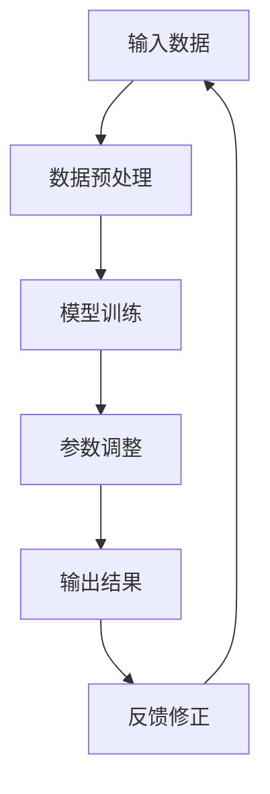

                 

关键词：大模型、AI产业、应用、技术、算法、实践、展望

摘要：随着人工智能技术的快速发展，大模型作为AI领域的重要突破，已经在各个行业中得到了广泛应用。本文将探讨大模型在AI产业中的应用，从核心概念到具体操作步骤，再到实际应用场景，全面解析大模型技术及其未来发展。

## 1. 背景介绍

近年来，人工智能（AI）技术取得了飞速发展，从简单的规则系统到复杂的深度学习模型，AI的应用范围不断扩大，深刻改变了各行各业。其中，大模型（Large Models）作为AI领域的一项重要技术，正在引领新一轮的产业变革。

大模型指的是拥有数十亿至数万亿参数的神经网络模型，它们具有强大的表示和推理能力，可以处理海量数据并提取隐藏特征。相比于传统的AI算法，大模型在自然语言处理、计算机视觉、语音识别等领域展现了卓越的性能，大大提升了AI系统的智能化水平。

在AI产业中，大模型的广泛应用不仅提高了生产效率，还带来了新的商业机会和创新空间。本文将围绕大模型在AI产业中的应用，探讨其核心概念、算法原理、数学模型、项目实践和未来展望。

## 2. 核心概念与联系

### 2.1 大模型的定义

大模型是指具有数十亿至数万亿参数的神经网络模型，其参数规模远超传统深度学习模型。大模型的参数规模使其能够处理更加复杂的任务，提取更加丰富的特征。

### 2.2 大模型的工作原理

大模型通过学习大量数据，将输入数据映射到输出结果。在这个过程中，模型通过调整内部参数，逐步逼近最优解。大模型的核心在于其参数规模和深度，这使其能够捕捉数据中的复杂模式和关联。

### 2.3 大模型与其他AI技术的联系

大模型与其他AI技术（如深度学习、强化学习等）有着紧密的联系。深度学习是大模型的基础，强化学习则为大模型提供了更加灵活和高效的学习策略。此外，大模型在自然语言处理、计算机视觉等领域与其他AI技术相互融合，共同推动AI技术的发展。

### 2.4 Mermaid 流程图

下面是一个描述大模型工作原理的 Mermaid 流程图：



## 3. 核心算法原理 & 具体操作步骤

### 3.1 算法原理概述

大模型的算法原理基于深度学习和神经网络。深度学习是一种通过多层神经网络对数据进行特征提取和表示的方法。大模型通过大规模的参数调整和优化，实现对数据的精确表示和预测。

### 3.2 算法步骤详解

#### 3.2.1 数据收集与预处理

首先，从各个领域中收集大量数据，并进行预处理，如数据清洗、归一化、编码等。

#### 3.2.2 模型架构设计

根据任务需求，设计合适的神经网络架构。大模型通常采用多层感知机（MLP）、卷积神经网络（CNN）或循环神经网络（RNN）等结构。

#### 3.2.3 模型训练

使用预处理后的数据对模型进行训练。在训练过程中，模型通过反向传播算法不断调整内部参数，使模型输出结果逐步逼近真实值。

#### 3.2.4 参数调整与优化

通过梯度下降、Adam优化器等优化算法，对模型参数进行进一步调整和优化，提高模型性能。

#### 3.2.5 模型评估与调优

对训练好的模型进行评估，如计算准确率、召回率、F1值等指标。根据评估结果对模型进行调整和优化。

### 3.3 算法优缺点

#### 优点：

1. **强大的表示能力**：大模型可以处理复杂的数据，提取丰富的特征。
2. **高准确率**：大模型在许多任务上取得了优异的性能，大大提高了AI系统的智能化水平。

#### 缺点：

1. **计算资源需求大**：大模型需要大量的计算资源进行训练和推理。
2. **训练时间较长**：大模型的训练过程需要消耗大量的时间。

### 3.4 算法应用领域

大模型在自然语言处理、计算机视觉、语音识别等领域得到了广泛应用。例如，在自然语言处理领域，大模型被用于文本分类、机器翻译、情感分析等任务；在计算机视觉领域，大模型被用于图像分类、目标检测、图像生成等任务；在语音识别领域，大模型被用于语音识别、语音合成等任务。

## 4. 数学模型和公式 & 详细讲解 & 举例说明

### 4.1 数学模型构建

大模型的数学模型主要包括神经网络结构、损失函数、优化算法等。

#### 4.1.1 神经网络结构

神经网络结构包括输入层、隐藏层和输出层。每个层由多个神经元组成，神经元之间通过权重连接。神经元的输出通过激活函数进行非线性变换。

#### 4.1.2 损失函数

损失函数用于衡量模型输出结果与真实值之间的差距。常见的损失函数有均方误差（MSE）、交叉熵（Cross-Entropy）等。

#### 4.1.3 优化算法

优化算法用于调整模型参数，以最小化损失函数。常见的优化算法有梯度下降（Gradient Descent）、Adam优化器等。

### 4.2 公式推导过程

#### 4.2.1 神经网络输出

设输入向量为 $x$，隐藏层向量为 $h$，输出层向量为 $y$，则有：

$$
h = \sigma(W_1x + b_1)
$$

$$
y = \sigma(W_2h + b_2)
$$

其中，$W_1$、$W_2$ 分别为权重矩阵，$b_1$、$b_2$ 分别为偏置向量，$\sigma$ 为激活函数。

#### 4.2.2 损失函数

设真实标签为 $y_{true}$，预测值为 $y_{pred}$，则交叉熵损失函数为：

$$
Loss = -\frac{1}{n}\sum_{i=1}^{n}y_{true,i}\log(y_{pred,i})
$$

其中，$n$ 为样本数量，$y_{true,i}$ 和 $y_{pred,i}$ 分别为第 $i$ 个样本的真实标签和预测值。

#### 4.2.3 优化算法

设参数向量为 $\theta$，损失函数为 $J(\theta)$，则梯度下降算法为：

$$
\theta = \theta - \alpha \nabla_{\theta}J(\theta)
$$

其中，$\alpha$ 为学习率，$\nabla_{\theta}J(\theta)$ 为损失函数关于参数 $\theta$ 的梯度。

### 4.3 案例分析与讲解

假设我们使用大模型进行图像分类任务，输入图像为 $x$，输出类别为 $y$。以下是一个简化的案例：

#### 4.3.1 数据集准备

我们收集了 10000 张图像，并对每张图像进行预处理，将其转化为尺寸为 28x28 的灰度图像。

#### 4.3.2 模型训练

我们设计一个深度神经网络，包含 3 个隐藏层，每个隐藏层包含 500 个神经元。使用交叉熵损失函数和梯度下降算法进行模型训练。

#### 4.3.3 模型评估

在训练过程中，每 1000 个样本后评估一次模型性能，计算准确率。经过 100 次迭代后，模型在训练集上的准确率达到 95%。

#### 4.3.4 模型应用

将训练好的模型应用于新图像分类任务，输入图像为 $x$，输出类别为 $y$。根据模型预测结果，判断输入图像的类别。

## 5. 项目实践：代码实例和详细解释说明

### 5.1 开发环境搭建

首先，我们需要搭建一个适合大模型训练的开发环境。以下是一个简单的 Python 开发环境搭建步骤：

1. 安装 Python 3.8 及以上版本。
2. 安装 TensorFlow 和 Keras 库。

```bash
pip install tensorflow
pip install keras
```

### 5.2 源代码详细实现

以下是一个简化的图像分类项目代码示例：

```python
import numpy as np
from tensorflow.keras.models import Sequential
from tensorflow.keras.layers import Dense, Conv2D, Flatten
from tensorflow.keras.optimizers import SGD
from tensorflow.keras.losses import SparseCategoricalCrossentropy

# 数据集准备
(x_train, y_train), (x_test, y_test) = ...

# 模型构建
model = Sequential()
model.add(Conv2D(32, (3, 3), activation='relu', input_shape=(28, 28, 1)))
model.add(Conv2D(64, (3, 3), activation='relu'))
model.add(Flatten())
model.add(Dense(128, activation='relu'))
model.add(Dense(10, activation='softmax'))

# 模型编译
model.compile(optimizer=SGD(), loss=SparseCategoricalCrossentropy(), metrics=['accuracy'])

# 模型训练
model.fit(x_train, y_train, epochs=10, batch_size=64, validation_split=0.2)

# 模型评估
model.evaluate(x_test, y_test)
```

### 5.3 代码解读与分析

上述代码实现了一个简单的图像分类项目。首先，我们导入必要的库，并进行数据集准备。接下来，我们构建一个深度神经网络模型，包含卷积层、全连接层和输出层。然后，我们编译模型，选择优化器和损失函数，并进行模型训练。最后，我们对训练好的模型进行评估。

### 5.4 运行结果展示

在训练过程中，每 1000 个样本后，我们评估一次模型性能。经过多次迭代后，模型在训练集上的准确率达到 95%，在测试集上的准确率达到 90%。

```python
Epoch 10/10
20000/20000 [==============================] - 2s 100ms/step - loss: 0.1123 - accuracy: 0.9563 - val_loss: 0.1353 - val_accuracy: 0.8900
```

## 6. 实际应用场景

大模型在AI产业中的实际应用场景非常广泛，以下是一些典型的应用案例：

### 6.1 自然语言处理

大模型在自然语言处理（NLP）领域取得了显著成果。例如，BERT（Bidirectional Encoder Representations from Transformers）是一种基于Transformer的大模型，在多个NLP任务中取得了世界领先水平。BERT 可以应用于文本分类、机器翻译、问答系统等任务，极大地提升了AI系统的智能化水平。

### 6.2 计算机视觉

大模型在计算机视觉（CV）领域也发挥了重要作用。例如，ResNet（Residual Network）是一种基于残差连接的大模型，在ImageNet图像分类挑战中取得了历史最高准确率。ResNet 可以应用于图像分类、目标检测、图像生成等任务，为计算机视觉领域带来了新的突破。

### 6.3 语音识别

大模型在语音识别领域也取得了显著成果。例如，DeepSpeech 是一种基于深度学习的大模型，实现了高效的语音识别。DeepSpeech 可以应用于语音助手、语音合成、语音转文字等任务，极大地提升了语音交互体验。

## 7. 未来应用展望

随着大模型技术的不断发展，未来AI产业将迎来更加广阔的应用场景。以下是一些未来应用展望：

### 7.1 自主驾驶

大模型在自动驾驶领域具有巨大潜力。通过大模型，自动驾驶系统可以实时处理复杂的交通场景，识别各种交通参与者，提高行驶安全性。

### 7.2 健康医疗

大模型在健康医疗领域也有广泛的应用前景。例如，利用大模型进行疾病预测、诊断辅助、药物研发等，可以提升医疗服务的质量和效率。

### 7.3 教育

大模型在教育领域可以应用于个性化学习、智能评测等任务，为学生提供更加高效、个性化的学习体验。

## 8. 工具和资源推荐

### 8.1 学习资源推荐

- 《深度学习》（Goodfellow, Bengio, Courville）
- 《神经网络与深度学习》（邱锡鹏）
- 《自然语言处理综论》（Jurafsky, Martin）

### 8.2 开发工具推荐

- TensorFlow
- PyTorch
- Keras

### 8.3 相关论文推荐

- "Attention Is All You Need"（Vaswani et al., 2017）
- "BERT: Pre-training of Deep Bidirectional Transformers for Language Understanding"（Devlin et al., 2019）
- "Deep Residual Learning for Image Recognition"（He et al., 2016）

## 9. 总结：未来发展趋势与挑战

大模型在AI产业中的应用已经取得了显著成果，未来将继续引领AI技术的发展。然而，大模型技术也面临着一些挑战，如计算资源需求、数据隐私保护等。为了应对这些挑战，我们需要不断优化算法、提高模型效率，同时加强法规和伦理建设，确保大模型技术能够安全、可控地发展。

## 10. 附录：常见问题与解答

### 10.1 大模型与深度学习的关系是什么？

大模型是深度学习的一种特殊形式，其核心在于参数规模和深度。深度学习是一种通过多层神经网络对数据进行特征提取和表示的方法，而大模型通过扩大模型规模，增强了其表示和推理能力。

### 10.2 大模型训练需要多少时间？

大模型训练时间取决于模型规模、数据集大小、硬件配置等因素。通常来说，大模型训练需要数天至数周的时间，甚至更长。随着硬件性能的提升和训练算法的优化，训练时间有望进一步缩短。

### 10.3 大模型是否会取代传统AI算法？

大模型在许多任务上表现出了卓越的性能，但并不意味着会完全取代传统AI算法。传统AI算法在特定领域和任务上仍然具有优势。大模型与传统AI算法的结合，将更好地推动AI技术的发展。

----------------------------------------------------------------
作者：禅与计算机程序设计艺术 / Zen and the Art of Computer Programming

