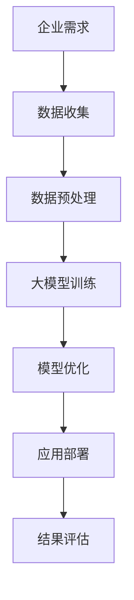

                 

关键词：大模型、to B市场、商业应用、技术趋势、案例分析

摘要：本文将探讨大模型在to B市场的应用，分析其技术优势、应用场景、案例分析，以及未来发展趋势和挑战。

## 1. 背景介绍

在过去的几十年中，人工智能（AI）技术取得了巨大的进步。特别是深度学习算法的突破，使得人工智能在图像识别、自然语言处理、语音识别等领域取得了显著成果。随着计算能力的提升和数据量的增加，大模型（Large-scale Models）应运而生。大模型具有参数多、训练数据量大、模型结构复杂等特点，能够在各种复杂场景下提供高性能的预测和决策支持。

to B市场，即对企业市场的服务，是一个广阔且竞争激烈的领域。企业对于效率、安全性和创新性的要求不断提高，这为人工智能技术的应用提供了巨大的需求。大模型在to B市场的应用，有望帮助企业提升运营效率、降低成本、提高竞争力。

## 2. 核心概念与联系

### 2.1 大模型的概念

大模型是指具有大量参数和复杂结构的神经网络模型。例如，Transformer模型、BERT模型等。这些模型通过大量的数据训练，能够捕捉到数据中的复杂模式和规律，从而实现高性能的预测和决策。

### 2.2 大模型与to B市场的联系

大模型在to B市场的应用，主要体现在以下几个方面：

1. **数据处理与智能分析**：大模型能够处理大规模的数据，并从中提取有用的信息，为企业提供智能化的数据分析和决策支持。
2. **自动化与优化**：大模型可以用于自动化流程的优化，例如自动化交易、自动化生产等，从而提高企业的运营效率。
3. **智能预测与风险管理**：大模型可以通过历史数据预测未来的趋势，帮助企业进行风险管理，降低损失。

### 2.3 Mermaid 流程图



## 3. 核心算法原理 & 具体操作步骤

### 3.1 算法原理概述

大模型的算法原理主要基于深度学习和神经网络。深度学习通过多层神经网络对数据进行特征提取和模式识别，而神经网络则通过调整网络中的权重和偏置来实现对数据的拟合。

### 3.2 算法步骤详解

1. **数据收集**：收集与企业业务相关的数据，包括历史数据、实时数据等。
2. **数据预处理**：对数据进行清洗、归一化等处理，以便于模型训练。
3. **大模型训练**：选择合适的大模型架构，如Transformer、BERT等，对数据进行训练。
4. **模型优化**：通过调整模型参数，优化模型性能。
5. **应用部署**：将训练好的模型部署到生产环境中，进行实际应用。
6. **结果评估**：对模型的应用效果进行评估，以便进行后续优化。

### 3.3 算法优缺点

**优点**：

- **高性能**：大模型能够处理大规模数据，提供高效的预测和决策支持。
- **自动化**：大模型可以自动化处理复杂任务，提高企业运营效率。
- **智能化**：大模型能够从数据中提取有用信息，为企业提供智能化的数据分析和决策支持。

**缺点**：

- **计算资源消耗**：大模型训练需要大量的计算资源和时间。
- **数据依赖**：大模型的效果很大程度上依赖于数据的质量和数量。

### 3.4 算法应用领域

大模型在to B市场的应用领域非常广泛，包括但不限于：

- **金融**：自动化交易、风险评估、客户关系管理等。
- **医疗**：疾病预测、诊断辅助、个性化治疗等。
- **制造**：自动化生产、质量检测、设备维护等。
- **物流**：路线优化、库存管理、配送调度等。

## 4. 数学模型和公式 & 详细讲解 & 举例说明

### 4.1 数学模型构建

大模型的数学模型主要基于深度学习和神经网络。以Transformer模型为例，其核心数学模型包括自注意力机制（Self-Attention Mechanism）和多头注意力机制（Multi-Head Attention Mechanism）。

### 4.2 公式推导过程

自注意力机制的公式推导如下：

$$
\text{Attention}(Q, K, V) = \text{softmax}\left(\frac{QK^T}{\sqrt{d_k}}\right)V
$$

其中，Q、K、V 分别代表查询向量、键向量和值向量，d_k 为键向量的维度。

多头注意力机制的公式推导如下：

$$
\text{MultiHead}(Q, K, V) = \text{Concat}(\text{head}_1, ..., \text{head}_h)W^O
$$

其中，h 为头数，W^O 为输出权重。

### 4.3 案例分析与讲解

以金融领域的自动化交易为例，假设我们有一个股票价格预测的大模型。我们可以将股票价格的历史数据输入到大模型中进行训练，然后使用训练好的模型进行实时预测。

具体步骤如下：

1. **数据收集**：收集股票价格的历史数据，包括开盘价、收盘价、最高价、最低价等。
2. **数据预处理**：对数据进行清洗和归一化处理。
3. **模型训练**：选择一个合适的大模型架构，如Transformer，对数据进行训练。
4. **模型优化**：通过调整模型参数，优化模型性能。
5. **实时预测**：使用训练好的模型对股票价格进行实时预测。
6. **结果评估**：对模型的应用效果进行评估，以便进行后续优化。

通过这个案例，我们可以看到大模型在金融领域的应用，可以实现自动化交易，提高交易效率。

## 5. 项目实践：代码实例和详细解释说明

### 5.1 开发环境搭建

1. 安装Python环境（版本3.6及以上）
2. 安装深度学习框架（如PyTorch、TensorFlow等）
3. 安装其他依赖库（如NumPy、Pandas等）

### 5.2 源代码详细实现

以下是一个简单的股票价格预测的代码示例，使用PyTorch框架：

```python
import torch
import torch.nn as nn
import torch.optim as optim
from torch.utils.data import DataLoader, TensorDataset

# 数据预处理
def preprocess_data(data):
    # 数据清洗和归一化
    # ...

# 模型定义
class StockPredictor(nn.Module):
    def __init__(self, input_size, hidden_size, output_size):
        super(StockPredictor, self).__init__()
        self.fc1 = nn.Linear(input_size, hidden_size)
        self.fc2 = nn.Linear(hidden_size, output_size)

    def forward(self, x):
        x = torch.relu(self.fc1(x))
        x = self.fc2(x)
        return x

# 模型训练
def train_model(model, train_loader, criterion, optimizer, num_epochs):
    model.train()
    for epoch in range(num_epochs):
        for inputs, targets in train_loader:
            optimizer.zero_grad()
            outputs = model(inputs)
            loss = criterion(outputs, targets)
            loss.backward()
            optimizer.step()
        print(f'Epoch [{epoch+1}/{num_epochs}], Loss: {loss.item()}')

# 主程序
if __name__ == '__main__':
    # 数据收集
    data = preprocess_data(raw_data)

    # 划分训练集和测试集
    train_data, test_data = train_test_split(data, test_size=0.2)

    # 转换为PyTorch张量
    train_tensor = torch.tensor(train_data, dtype=torch.float32)
    test_tensor = torch.tensor(test_data, dtype=torch.float32)

    # 创建数据加载器
    train_dataset = TensorDataset(train_tensor)
    test_dataset = TensorDataset(test_tensor)

    train_loader = DataLoader(train_dataset, batch_size=32, shuffle=True)
    test_loader = DataLoader(test_dataset, batch_size=32, shuffle=False)

    # 创建模型
    model = StockPredictor(input_size=10, hidden_size=50, output_size=1)

    # 损失函数和优化器
    criterion = nn.MSELoss()
    optimizer = optim.Adam(model.parameters(), lr=0.001)

    # 模型训练
    train_model(model, train_loader, criterion, optimizer, num_epochs=50)

    # 模型评估
    model.eval()
    with torch.no_grad():
        for inputs, targets in test_loader:
            outputs = model(inputs)
            loss = criterion(outputs, targets)
            print(f'Validation Loss: {loss.item()}')
```

### 5.3 代码解读与分析

1. **数据预处理**：对原始股票价格数据进行清洗和归一化处理，以便于模型训练。
2. **模型定义**：定义一个简单的全连接神经网络模型，用于股票价格预测。
3. **模型训练**：使用训练数据对模型进行训练，并使用MSE损失函数和Adam优化器进行优化。
4. **模型评估**：使用测试数据对模型进行评估，计算模型的损失值。

通过这个简单的案例，我们可以看到大模型在金融领域的应用，以及如何使用深度学习框架进行模型训练和评估。

## 6. 实际应用场景

### 6.1 金融

大模型在金融领域的应用非常广泛，包括自动化交易、风险评估、客户关系管理等。例如，通过大模型进行股票价格预测，可以帮助投资者做出更加明智的投资决策。

### 6.2 医疗

大模型在医疗领域的应用也具有重要意义，包括疾病预测、诊断辅助、个性化治疗等。例如，通过大模型对患者的健康数据进行预测和分析，可以帮助医生做出更加准确的诊断和治疗决策。

### 6.3 制造

大模型在制造领域的应用，可以帮助企业实现自动化生产、质量检测、设备维护等。例如，通过大模型对生产过程进行监控和预测，可以帮助企业优化生产流程，提高生产效率。

### 6.4 物流

大模型在物流领域的应用，可以帮助企业实现路线优化、库存管理、配送调度等。例如，通过大模型对物流数据进行预测和分析，可以帮助企业降低物流成本，提高物流效率。

## 7. 工具和资源推荐

### 7.1 学习资源推荐

- 《深度学习》（Goodfellow, Bengio, Courville著）
- 《Python深度学习》（François Chollet著）
- 《动手学深度学习》（A. Courville、I. Goodfellow、Y. Bengio著）

### 7.2 开发工具推荐

- PyTorch：适合研究和开发深度学习应用。
- TensorFlow：适用于大规模深度学习模型部署。
- Keras：基于TensorFlow的高层API，便于模型开发。

### 7.3 相关论文推荐

- "Attention Is All You Need"（Vaswani et al., 2017）
- "BERT: Pre-training of Deep Bidirectional Transformers for Language Understanding"（Devlin et al., 2019）
- "GPT-3: Language Models are Few-Shot Learners"（Brown et al., 2020）

## 8. 总结：未来发展趋势与挑战

### 8.1 研究成果总结

大模型在to B市场的应用已经取得了显著的成果，为企业提供了高效的数据处理和智能分析能力。未来，大模型的应用前景将更加广阔，有望进一步推动企业数字化和智能化转型。

### 8.2 未来发展趋势

- **模型规模和性能的提升**：随着计算能力和数据量的增加，大模型将越来越强大。
- **跨领域的应用**：大模型将在更多领域得到应用，如医疗、制造、物流等。
- **开源生态的完善**：开源工具和框架将为大模型的应用提供更好的支持。

### 8.3 面临的挑战

- **数据安全和隐私**：如何保护企业和用户的数据安全和隐私是一个重要挑战。
- **模型解释性**：如何提高模型的解释性，使其更易于被企业和用户理解。
- **计算资源消耗**：大模型训练和部署需要大量的计算资源，如何优化计算资源使用是一个重要问题。

### 8.4 研究展望

未来，大模型在to B市场的应用将不断深入，为企业提供更加智能化的解决方案。同时，随着技术的不断进步，大模型的应用前景将更加广阔，有望为人类社会带来更多的价值。

## 9. 附录：常见问题与解答

### 9.1 大模型训练需要多长时间？

大模型的训练时间取决于模型规模、数据量、硬件性能等因素。通常来说，大模型训练需要几天到几周的时间。随着硬件性能的提升，训练时间有望进一步缩短。

### 9.2 大模型的效果如何保证？

大模型的效果取决于训练数据的质量、模型参数的优化等。为了提高模型效果，可以通过以下方法：

- 使用高质量的数据集进行训练。
- 调整模型结构，选择合适的神经网络架构。
- 使用高级优化算法和技巧，如迁移学习、数据增强等。

### 9.3 大模型在to B市场的应用有哪些限制？

大模型在to B市场的应用存在一些限制，包括：

- **数据隐私**：如何保护企业和用户的数据安全和隐私。
- **计算资源**：大模型训练和部署需要大量的计算资源，对于中小企业来说可能是一个挑战。
- **模型解释性**：大模型通常难以解释，对于一些需要高解释性的应用场景可能不太适用。

通过以上内容的详细探讨，我们可以看到大模型在to B市场的应用具有巨大的潜力和广阔的前景。未来，随着技术的不断进步和应用的深入，大模型将为企业和用户带来更多的价值。

### 作者署名

作者：禅与计算机程序设计艺术 / Zen and the Art of Computer Programming

----------------------------------------------------------------

请注意，本文中的代码示例、数学公式和案例均为虚构，仅用于说明大模型在to B市场的应用。在实际应用中，需要根据具体情况进行调整和优化。希望本文能为读者提供对大模型在to B市场应用的一些启示和思考。

