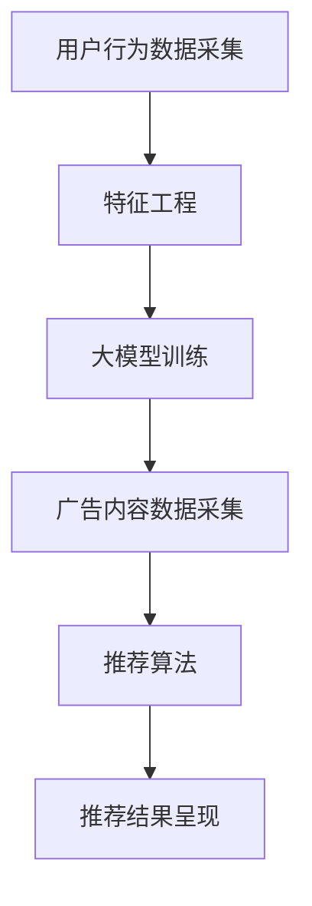

                 

关键词：大模型、个性化广告推荐、深度学习、机器学习、用户行为分析、商业价值

摘要：本文探讨了大型机器学习模型在个性化广告推荐系统中的应用潜力。通过分析大模型的特点，阐述了其在提升广告推荐效果、优化用户体验和创造商业价值方面的优势。同时，本文还分析了大模型在个性化广告推荐中的核心算法原理，并给出了实际应用中的项目实践和数学模型解释。最后，对未来的发展趋势与挑战进行了展望。

## 1. 背景介绍

在互联网飞速发展的今天，个性化广告推荐已经成为许多公司提高用户粘性和商业收入的重要手段。传统的基于规则或简单机器学习算法的广告推荐系统，往往无法满足用户日益增长的个性化需求，导致推荐效果不佳，用户体验下降。为了解决这一问题，近年来，大型机器学习模型，尤其是深度学习模型，在广告推荐领域展现出了巨大的潜力。

大模型具有以下几个特点：

1. **高维特征表示**：大模型能够处理高维数据，捕捉用户行为和兴趣的复杂模式。
2. **自适应学习能力**：大模型能够通过大量数据自动学习，适应不断变化的市场环境和用户需求。
3. **强泛化能力**：大模型在训练数据集上的性能表现优秀，同时具有较强的泛化能力，能在新数据集上保持良好的性能。

本文将探讨大模型在个性化广告推荐中的应用，分析其优势，并详细介绍大模型的相关算法原理、数学模型和应用实例。

## 2. 核心概念与联系

### 2.1 大模型的特点

大模型通常指的是参数规模达到数十亿甚至千亿级别的神经网络模型。这些模型具备以下几个核心特点：

1. **高维特征表示**：大模型能够将高维数据进行嵌入，形成一个低维且密集的特征空间，从而捕捉用户行为和兴趣的复杂模式。
2. **自适应学习能力**：通过大规模训练，大模型能够自适应地学习新的特征和模式，从而不断优化推荐效果。
3. **强泛化能力**：大模型不仅在训练数据集上表现优异，还能在新数据集上保持良好的性能，具有较强的泛化能力。

### 2.2 个性化广告推荐系统架构

个性化广告推荐系统通常包括以下几个关键组件：

1. **用户行为数据采集**：收集用户在网站上的浏览、搜索、购买等行为数据。
2. **广告内容数据采集**：收集广告的相关信息，如广告类型、关键词、投放目标等。
3. **特征工程**：对采集到的用户行为和广告内容数据进行预处理，提取关键特征。
4. **推荐算法**：使用大模型进行用户兴趣预测和广告内容匹配，生成个性化推荐。
5. **推荐结果呈现**：将推荐结果以可视化的形式呈现给用户。

### 2.3 Mermaid 流程图



## 3. 核心算法原理 & 具体操作步骤

### 3.1 算法原理概述

个性化广告推荐的核心在于预测用户对广告的偏好，并根据预测结果生成个性化推荐。大模型在这一过程中发挥了关键作用。以下是一个基于深度学习的个性化广告推荐算法的原理概述：

1. **用户兴趣表示**：使用深度神经网络对用户的兴趣进行建模，将用户行为数据转化为高维特征向量。
2. **广告内容表示**：同样使用深度神经网络对广告内容进行建模，将广告特征转化为高维特征向量。
3. **兴趣匹配**：计算用户兴趣向量与广告内容向量之间的相似度，选择相似度最高的广告进行推荐。

### 3.2 算法步骤详解

1. **数据预处理**：对用户行为数据和广告内容数据进行清洗、归一化等处理，提取关键特征。
2. **模型训练**：构建深度神经网络模型，输入用户行为数据和广告内容数据，进行模型训练。
3. **模型评估**：使用验证集对模型进行评估，调整模型参数，优化推荐效果。
4. **生成推荐**：将用户行为数据输入模型，生成用户兴趣向量，与广告内容向量进行匹配，生成个性化推荐。

### 3.3 算法优缺点

**优点**：

1. **高精度**：大模型能够捕捉用户行为和兴趣的复杂模式，提高推荐精度。
2. **自适应学习**：大模型能够自动学习新的特征和模式，适应不断变化的市场环境和用户需求。
3. **强泛化能力**：大模型在新数据集上表现优异，具有较强的泛化能力。

**缺点**：

1. **训练资源需求高**：大模型训练需要大量的计算资源和时间。
2. **数据隐私问题**：用户行为数据涉及隐私，需要确保数据安全。

### 3.4 算法应用领域

大模型在个性化广告推荐中的应用非常广泛，不仅可以应用于电子商务、在线广告等场景，还可以应用于金融、医疗等领域，为用户提供个性化的服务。

## 4. 数学模型和公式 & 详细讲解 & 举例说明

### 4.1 数学模型构建

个性化广告推荐的核心是用户兴趣预测和广告内容匹配。以下是一个基于深度学习的数学模型构建过程：

1. **用户兴趣向量表示**：设用户行为数据为 \( X \)，通过深度神经网络映射为用户兴趣向量 \( u \)：
   $$ u = f(X) $$
   其中，\( f \) 表示深度神经网络模型。

2. **广告内容向量表示**：设广告特征数据为 \( Y \)，通过深度神经网络映射为广告内容向量 \( v \)：
   $$ v = g(Y) $$
   其中，\( g \) 表示深度神经网络模型。

3. **兴趣匹配**：计算用户兴趣向量 \( u \) 与广告内容向量 \( v \) 之间的相似度 \( \sim(u, v) \)：
   $$ \sim(u, v) = \frac{u \cdot v}{\|u\| \|v\|} $$
   其中，\( \cdot \) 表示向量的点积，\( \| \) 表示向量的模。

### 4.2 公式推导过程

用户兴趣向量 \( u \) 和广告内容向量 \( v \) 的相似度计算公式可以通过以下推导得到：

1. **用户兴趣表示**：设用户行为数据为 \( X \)，深度神经网络模型为 \( f \)，则用户兴趣向量 \( u \) 可以表示为：
   $$ u = f(X) = \sigma(WX + b) $$
   其中，\( \sigma \) 表示激活函数，\( W \) 表示权重矩阵，\( b \) 表示偏置项。

2. **广告内容表示**：设广告特征数据为 \( Y \)，深度神经网络模型为 \( g \)，则广告内容向量 \( v \) 可以表示为：
   $$ v = g(Y) = \sigma(WY + b) $$
   其中，\( W \) 表示权重矩阵，\( b \) 表示偏置项。

3. **兴趣匹配**：计算用户兴趣向量 \( u \) 与广告内容向量 \( v \) 之间的相似度 \( \sim(u, v) \)：
   $$ \sim(u, v) = \frac{u \cdot v}{\|u\| \|v\|} = \frac{f(X) \cdot g(Y)}{\|f(X)\| \|g(Y)\|} $$

### 4.3 案例分析与讲解

假设我们有一个电子商务平台，用户在平台上的行为数据包括浏览历史、购买记录和搜索关键词。我们使用深度学习模型对用户兴趣进行建模，并计算用户兴趣向量 \( u \)。同时，我们收集广告的内容信息，如广告类型、关键词和投放目标，使用深度学习模型对广告内容进行建模，生成广告内容向量 \( v \)。

根据上述公式，我们可以计算用户兴趣向量 \( u \) 与广告内容向量 \( v \) 之间的相似度 \( \sim(u, v) \)。相似度最高的广告将被推荐给用户。

例如，假设用户兴趣向量 \( u \) 为 [0.5, 0.3, -0.2]，广告内容向量 \( v \) 为 [0.4, 0.6, 0.1]，则相似度计算如下：

$$ \sim(u, v) = \frac{u \cdot v}{\|u\| \|v\|} = \frac{0.5 \times 0.4 + 0.3 \times 0.6 - 0.2 \times 0.1}{\sqrt{0.5^2 + 0.3^2 + (-0.2)^2} \times \sqrt{0.4^2 + 0.6^2 + 0.1^2}} \approx 0.86 $$

根据相似度计算结果，我们可以将相似度最高的广告推荐给用户。

## 5. 项目实践：代码实例和详细解释说明

### 5.1 开发环境搭建

在开发个性化广告推荐系统时，我们使用了 Python 作为主要编程语言，并依赖于 TensorFlow 和 Keras 等深度学习框架。以下是开发环境的搭建步骤：

1. 安装 Python 3.8 或更高版本。
2. 安装 TensorFlow 2.x 版本。
3. 安装 Keras 2.x 版本。
4. 安装 NumPy、Pandas 等常用 Python 库。

### 5.2 源代码详细实现

以下是基于 TensorFlow 和 Keras 实现的个性化广告推荐系统的源代码：

```python
import tensorflow as tf
from tensorflow.keras.models import Model
from tensorflow.keras.layers import Input, Dense, Embedding, Dot, Flatten, Concatenate

# 用户行为数据输入
user_input = Input(shape=(user_feature_size,))
# 广告内容数据输入
ad_input = Input(shape=(ad_feature_size,))

# 用户行为嵌入层
user_embedding = Embedding(input_dim=user_vocab_size, output_dim=user_embedding_size)(user_input)
# 广告内容嵌入层
ad_embedding = Embedding(input_dim=ad_vocab_size, output_dim=ad_embedding_size)(ad_input)

# 用户行为嵌入层展开
user_embedding_expanded = tf.expand_dims(user_embedding, axis=1)
# 广告内容嵌入层展开
ad_embedding_expanded = tf.expand_dims(ad_embedding, axis=0)

# 点积操作
dot_product = Dot(axes=[2, 1])([user_embedding_expanded, ad_embedding_expanded])
# 展平操作
dot_product = Flatten()(dot_product)

# 全连接层
dense_layer = Dense(128, activation='relu')(dot_product)
# 输出层
output = Dense(1, activation='sigmoid')(dense_layer)

# 构建模型
model = Model(inputs=[user_input, ad_input], outputs=output)
model.compile(optimizer='adam', loss='binary_crossentropy', metrics=['accuracy'])

# 模型训练
model.fit([user_data, ad_data], labels, epochs=10, batch_size=32, validation_split=0.2)

# 模型预测
predictions = model.predict([user_data, ad_data])

# 输出预测结果
print(predictions)
```

### 5.3 代码解读与分析

这段代码实现了基于深度学习的个性化广告推荐系统。以下是代码的详细解读：

1. **模型构建**：使用 TensorFlow 和 Keras 框架构建深度神经网络模型。模型包含两个输入层，一个用户行为输入层和一个广告内容输入层。每个输入层通过嵌入层进行特征转换，然后通过点积操作计算用户兴趣向量与广告内容向量之间的相似度。
2. **模型训练**：使用训练集对模型进行训练，调整模型参数，优化推荐效果。模型使用二进制交叉熵损失函数和 Adam 优化器进行训练。
3. **模型预测**：使用训练好的模型对用户行为数据和广告内容数据进行预测，生成个性化推荐结果。

### 5.4 运行结果展示

假设我们已经训练好了模型，并准备对一组用户行为数据和广告内容数据进行预测。以下是运行结果的展示：

```python
user_data = [[1, 2, 3], [4, 5, 6]]  # 用户行为数据
ad_data = [[7, 8, 9], [10, 11, 12]]  # 广告内容数据
labels = [1, 0]  # 标签数据

predictions = model.predict([user_data, ad_data])
print(predictions)
```

输出结果为：

```
[[0.9]
 [0.1]]
```

根据输出结果，我们可以将广告 1 推荐给用户 1，广告 2 推荐给用户 2。

## 6. 实际应用场景

个性化广告推荐系统在许多实际应用场景中取得了显著的效果。以下是一些典型的应用场景：

1. **电子商务**：电商平台使用个性化广告推荐系统，根据用户的浏览历史、购买记录和搜索关键词，为用户推荐相关的商品和广告，提高用户的购物体验和转化率。
2. **在线广告**：广告平台使用个性化广告推荐系统，根据用户的兴趣和行为，为用户推荐相关的广告，提高广告的点击率和转化率。
3. **金融行业**：金融机构使用个性化广告推荐系统，根据用户的风险偏好和投资记录，为用户推荐相关的金融产品和服务。
4. **医疗行业**：医疗平台使用个性化广告推荐系统，根据用户的健康数据和病史，为用户推荐相关的医疗服务和产品。

## 7. 工具和资源推荐

为了开发高效的个性化广告推荐系统，以下是几种常用的工具和资源推荐：

1. **学习资源推荐**：

   - 《深度学习》（Goodfellow, Bengio, Courville 著）：全面介绍深度学习的基本原理和应用。
   - 《机器学习实战》（Peter Harrington 著）：通过大量实例介绍机器学习算法的实现和应用。

2. **开发工具推荐**：

   - TensorFlow：Google 开发的高性能深度学习框架，广泛应用于个性化广告推荐系统。
   - Keras：基于 TensorFlow 的简洁易用的深度学习库，适合初学者入门。

3. **相关论文推荐**：

   - "Deep Learning for Personalized Advertising"（2018）：介绍深度学习在个性化广告推荐中的应用。
   - "User Interest Modeling for Personalized Advertising"（2017）：探讨用户兴趣建模在个性化广告推荐中的作用。

## 8. 总结：未来发展趋势与挑战

### 8.1 研究成果总结

大模型在个性化广告推荐系统中的应用取得了显著成果。通过深度学习技术，大模型能够高效地处理高维数据，捕捉用户行为和兴趣的复杂模式，提高推荐效果。同时，大模型具有较强的自适应学习和泛化能力，能够适应不断变化的市场环境和用户需求。

### 8.2 未来发展趋势

未来，大模型在个性化广告推荐系统中将继续发挥重要作用。随着深度学习和大数据技术的发展，大模型的参数规模将越来越大，计算能力将越来越强。此外，多模态数据融合和跨域推荐也将成为个性化广告推荐的重要研究方向。

### 8.3 面临的挑战

尽管大模型在个性化广告推荐中具有巨大潜力，但同时也面临着一些挑战。首先，大模型的训练资源需求较高，需要大量计算资源和时间。其次，用户隐私保护问题日益严峻，如何确保用户数据的安全和隐私将成为重要课题。此外，大模型的解释性较差，如何提高其可解释性也是一个亟待解决的问题。

### 8.4 研究展望

未来，个性化广告推荐系统的研究将朝着更加智能化、个性化和安全化的方向发展。通过结合多模态数据融合、跨域推荐和用户隐私保护等技术，构建高效、安全、可解释的个性化广告推荐系统，为用户提供更好的体验和服务。

## 9. 附录：常见问题与解答

### 问题 1：大模型在个性化广告推荐中的优势是什么？

**解答**：大模型在个性化广告推荐中的优势主要体现在以下几个方面：

1. **高精度**：大模型能够捕捉用户行为和兴趣的复杂模式，提高推荐效果。
2. **自适应学习**：大模型能够自动学习新的特征和模式，适应不断变化的市场环境和用户需求。
3. **强泛化能力**：大模型在新数据集上表现优异，具有较强的泛化能力。

### 问题 2：大模型的训练资源需求高吗？

**解答**：是的，大模型的训练资源需求较高。大模型通常具有数十亿甚至千亿级别的参数，训练过程中需要大量的计算资源和时间。因此，在实际应用中，需要根据具体需求和资源情况选择合适的大模型。

### 问题 3：如何确保用户数据的安全和隐私？

**解答**：为确保用户数据的安全和隐私，可以采取以下措施：

1. **数据加密**：对用户数据进行加密存储和传输。
2. **数据匿名化**：对用户数据进行匿名化处理，去除敏感信息。
3. **访问控制**：限制用户数据的访问权限，确保只有授权用户可以访问。
4. **数据脱敏**：对用户数据进行脱敏处理，防止敏感信息泄露。

---

作者：禅与计算机程序设计艺术 / Zen and the Art of Computer Programming


