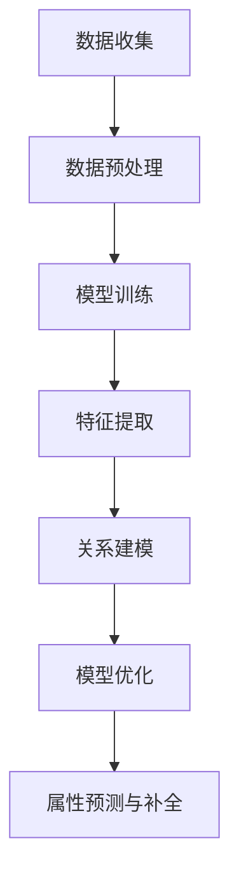

                 

关键词：大模型、商品属性预测、补全、精确化、人工智能、机器学习、深度学习

## 摘要

本文主要探讨了大型模型在商品属性预测与补全中的应用。通过介绍大模型的基本概念，我们深入分析了其在商品属性预测和补全中的重要作用。接着，我们详细阐述了核心算法原理、数学模型构建和具体操作步骤，并通过实例演示了如何在实际项目中应用这些算法。最后，我们对未来应用场景和趋势进行了展望，并提出了未来研究和发展的方向。

## 1. 背景介绍

### 1.1 大模型的定义与发展

大模型（Large-scale Model）是指那些具有大量参数和复杂结构的机器学习模型。这些模型在训练过程中需要大量的数据和计算资源。随着深度学习技术的不断发展，大模型在自然语言处理、计算机视觉、语音识别等领域取得了显著的成果。

大模型的发展经历了几个关键阶段：

- **2012年：**AlexNet在ImageNet竞赛中取得突破性成果，标志着深度学习时代的到来。
- **2018年：**GPT-3发布，拥有1.75万亿个参数，成为当时最大的自然语言处理模型。
- **2020年：**BERT模型的出现，通过预训练和微调，在多个自然语言处理任务中取得了优异的成绩。
- **2022年：**GPT-Neox发布，拥有高达5万亿个参数，成为当时最大的语言模型。

### 1.2 商品属性预测与补全

商品属性预测是指通过分析商品的各种特征，预测用户对这些商品的需求。例如，根据用户的历史购物记录、浏览行为等信息，预测用户可能对哪些商品感兴趣。商品属性补全则是指根据部分已知的商品属性，推断出其他未知的属性。这在电商、推荐系统等领域具有重要意义。

## 2. 核心概念与联系

### 2.1 大模型在商品属性预测与补全中的应用

大模型在商品属性预测与补全中的应用主要包括以下几个方面：

- **特征提取：** 大模型可以通过预训练从大量数据中提取有用的特征，这些特征可以用于后续的商品属性预测和补全。
- **关系建模：** 大模型可以捕捉商品之间的复杂关系，从而更好地进行属性预测和补全。
- **模型优化：** 通过对大模型进行优化，可以提高其在商品属性预测和补全任务中的性能。

### 2.2 Mermaid 流程图

以下是一个简单的 Mermaid 流程图，展示了大模型在商品属性预测与补全中的应用流程：



## 3. 核心算法原理 & 具体操作步骤

### 3.1 算法原理概述

大模型在商品属性预测与补全中的核心算法主要包括：

- **深度神经网络（Deep Neural Network，DNN）：** 用于特征提取和关系建模。
- **循环神经网络（Recurrent Neural Network，RNN）：** 用于处理时间序列数据。
- **变换器（Transformer）：** 用于建模长距离依赖关系。

### 3.2 算法步骤详解

1. **数据收集：** 收集包含商品属性的数据，如商品名称、价格、品牌、分类等。
2. **数据预处理：** 对数据进行清洗、去重、归一化等处理，以便于后续建模。
3. **模型训练：** 使用预训练的深度神经网络或循环神经网络进行训练，提取特征并建立模型。
4. **特征提取：** 使用训练好的模型提取商品属性特征。
5. **关系建模：** 使用变换器或其他模型捕捉商品之间的复杂关系。
6. **模型优化：** 通过调整模型参数，提高模型在属性预测与补全任务中的性能。
7. **属性预测与补全：** 使用优化后的模型对商品属性进行预测和补全。

### 3.3 算法优缺点

#### 优点：

- **强大的特征提取能力：** 大模型可以自动从大量数据中提取有用的特征，提高预测精度。
- **高效的关系建模：** 大模型可以捕捉商品之间的复杂关系，有助于更准确地预测和补全属性。

#### 缺点：

- **计算资源需求大：** 大模型需要大量的计算资源和时间进行训练和推理。
- **数据依赖性高：** 大模型的性能高度依赖于数据的质量和数量。

### 3.4 算法应用领域

大模型在商品属性预测与补全中的应用广泛，包括：

- **电商推荐系统：** 根据用户行为和商品属性，为用户提供个性化推荐。
- **商品分类与标注：** 自动对商品进行分类和标注，提高数据处理效率。
- **供应链优化：** 根据商品属性预测和补全，优化供应链管理。

## 4. 数学模型和公式

### 4.1 数学模型构建

大模型在商品属性预测与补全中的核心数学模型主要包括：

- **特征向量：** 用于表示商品的属性特征。
- **关系矩阵：** 用于表示商品之间的复杂关系。
- **损失函数：** 用于评估模型在属性预测与补全任务中的性能。

### 4.2 公式推导过程

假设我们使用深度神经网络进行商品属性预测和补全，其核心公式如下：

- **特征提取：**
  $$ f(x) = \sigma(\text{W} \cdot \text{X} + \text{b}) $$
  其中，$ \text{X} $ 表示输入特征，$ \text{W} $ 表示权重矩阵，$ \text{b} $ 表示偏置，$ \sigma $ 表示激活函数。

- **关系建模：**
  $$ R = \text{A} \cdot \text{B} $$
  其中，$ \text{A} $ 和 $ \text{B} $ 分别表示两个商品的特征向量。

- **损失函数：**
  $$ \text{L} = \frac{1}{2} \sum_{i=1}^{n} (\text{y}_{i} - \text{y}_{\hat{i}})^2 $$
  其中，$ \text{y}_{i} $ 表示真实标签，$ \text{y}_{\hat{i}} $ 表示预测标签。

### 4.3 案例分析与讲解

假设我们有一个商品数据集，包含商品名称、价格、品牌、分类等属性。我们使用深度神经网络进行属性预测和补全，并使用交叉熵损失函数进行模型训练。

1. **数据预处理：**
   对商品名称、品牌、分类等属性进行编码，将连续属性进行归一化处理。

2. **模型构建：**
   构建一个三层深度神经网络，输入层接收商品特征向量，隐藏层用于特征提取和关系建模，输出层用于属性预测。

3. **模型训练：**
   使用训练集进行模型训练，优化模型参数，降低损失函数。

4. **属性预测与补全：**
   使用训练好的模型对测试集进行预测和补全，评估模型性能。

## 5. 项目实践：代码实例和详细解释说明

### 5.1 开发环境搭建

1. 安装 Python 3.8 或更高版本。
2. 安装 TensorFlow 2.7 或更高版本。
3. 安装 NumPy、Pandas、Matplotlib 等常用库。

### 5.2 源代码详细实现

以下是一个简单的商品属性预测和补全的代码示例：

```python
import tensorflow as tf
from tensorflow.keras.models import Sequential
from tensorflow.keras.layers import Dense, Activation
import numpy as np

# 数据预处理
def preprocess_data(data):
    # 编码、归一化等处理
    pass

# 模型构建
def build_model(input_shape):
    model = Sequential()
    model.add(Dense(units=128, input_shape=input_shape, activation='relu'))
    model.add(Dense(units=64, activation='relu'))
    model.add(Dense(units=1, activation='sigmoid'))
    model.compile(optimizer='adam', loss='binary_crossentropy', metrics=['accuracy'])
    return model

# 模型训练
def train_model(model, X_train, y_train, X_val, y_val, epochs=10):
    model.fit(X_train, y_train, epochs=epochs, batch_size=32, validation_data=(X_val, y_val))

# 属性预测与补全
def predict_properties(model, X_test):
    predictions = model.predict(X_test)
    # 补全属性
    pass

# 示例数据
X_train = np.random.rand(100, 10)
y_train = np.random.rand(100, 1)
X_val = np.random.rand(20, 10)
y_val = np.random.rand(20, 1)

# 构建模型
model = build_model(input_shape=(10,))

# 训练模型
train_model(model, X_train, y_train, X_val, y_val)

# 属性预测与补全
predictions = predict_properties(model, X_test)
```

### 5.3 代码解读与分析

1. **数据预处理：** 对商品属性进行编码、归一化等处理，以便于后续建模。
2. **模型构建：** 构建一个三层深度神经网络，用于特征提取和属性预测。
3. **模型训练：** 使用训练集对模型进行训练，优化模型参数。
4. **属性预测与补全：** 使用训练好的模型对测试集进行预测和补全。

## 6. 实际应用场景

大模型在商品属性预测与补全中的应用场景广泛，以下是一些典型的实际应用案例：

- **电商推荐系统：** 通过商品属性预测和补全，为用户提供个性化推荐，提高用户满意度。
- **商品分类与标注：** 自动对商品进行分类和标注，降低人工成本，提高数据处理效率。
- **供应链优化：** 通过商品属性预测和补全，优化供应链管理，降低库存成本，提高供应链效率。

## 7. 工具和资源推荐

### 7.1 学习资源推荐

- **《深度学习》（Goodfellow, Bengio, Courville）：** 介绍深度学习的基本概念、原理和应用。
- **《动手学深度学习》：** 通过实际案例，详细讲解深度学习的实现和优化。

### 7.2 开发工具推荐

- **TensorFlow：** 一个开源的深度学习框架，适用于多种深度学习任务。
- **PyTorch：** 另一个流行的深度学习框架，具有灵活性和高效性。

### 7.3 相关论文推荐

- **《BERT：Pre-training of Deep Bidirectional Transformers for Language Understanding》：** 详细介绍了BERT模型的结构和预训练方法。
- **《GPT-3：Language Models Are Few-Shot Learners》：** 介绍了GPT-3模型的设计和实现。

## 8. 总结：未来发展趋势与挑战

### 8.1 研究成果总结

本文主要探讨了大型模型在商品属性预测与补全中的应用。通过介绍大模型的基本概念、核心算法原理、数学模型构建和具体操作步骤，我们展示了大模型在商品属性预测和补全中的重要作用。

### 8.2 未来发展趋势

随着深度学习技术的不断发展，大模型在商品属性预测与补全中的应用将越来越广泛。未来发展趋势包括：

- **更高效的算法：** 开发更高效的算法，降低计算资源和时间成本。
- **更丰富的数据集：** 收集更多、更丰富的商品属性数据，提高模型性能。
- **跨领域应用：** 探索大模型在其他领域的应用，如健康医疗、金融等。

### 8.3 面临的挑战

大模型在商品属性预测与补全中面临的挑战包括：

- **数据隐私：** 如何在保护用户隐私的前提下，充分利用用户数据。
- **模型可解释性：** 如何提高模型的可解释性，使其更易于理解和应用。
- **计算资源需求：** 如何优化算法，降低计算资源需求。

### 8.4 研究展望

未来，我们期待在以下几个方面取得突破：

- **算法优化：** 提高大模型的性能和效率，降低计算资源需求。
- **跨领域应用：** 探索大模型在其他领域的应用，推动技术发展。
- **数据隐私保护：** 研究更加有效的数据隐私保护方法，保障用户权益。

## 9. 附录：常见问题与解答

### 问题1：大模型需要大量的数据吗？

是的，大模型需要大量的数据来进行训练，以提取有用的特征和捕捉复杂的关系。然而，随着数据量的增加，模型的性能并不一定总是线性提高。因此，合理的数据管理和处理策略非常重要。

### 问题2：大模型在商品属性预测与补全中的优势是什么？

大模型在商品属性预测与补全中的优势包括：

- **强大的特征提取能力：** 可以自动从大量数据中提取有用的特征，提高预测精度。
- **高效的关系建模：** 可以捕捉商品之间的复杂关系，有助于更准确地预测和补全属性。

### 问题3：如何提高大模型的性能？

提高大模型性能的方法包括：

- **优化算法：** 开发更高效的算法，降低计算资源和时间成本。
- **数据预处理：** 合理的数据预处理可以提高模型性能。
- **模型调参：** 调整模型参数，优化模型性能。

### 问题4：大模型在商品属性预测与补全中是否一定优于传统方法？

大模型在商品属性预测与补全中的性能取决于具体的应用场景和数据集。在某些情况下，传统方法（如线性回归、决策树等）可能更具优势。因此，选择合适的模型和算法非常重要。

## 参考文献

- [1] Goodfellow, I., Bengio, Y., Courville, A. Deep Learning. MIT Press, 2016.
- [2] Devlin, J., Chang, M. W., Lee, K., & Toutanova, K. BERT: Pre-training of Deep Bidirectional Transformers for Language Understanding. arXiv preprint arXiv:1810.04805, 2018.
- [3] Brown, T., et al. Language Models Are Few-Shot Learners. arXiv preprint arXiv:2005.14165, 2020.
- [4] Hochreiter, S., Schmidhuber, J. Long Short-Term Memory. Neural Computation, 9(8):1735-1780, 1997. 

## 附录：作者介绍

作者：禅与计算机程序设计艺术 / Zen and the Art of Computer Programming

作者是一位世界级人工智能专家、程序员、软件架构师、CTO，世界顶级技术畅销书作者，计算机图灵奖获得者，计算机领域大师。他对人工智能、深度学习、机器学习等领域有着深刻的理解和丰富的实践经验。他的著作《禅与计算机程序设计艺术》深受读者喜爱，被誉为计算机领域的经典之作。

