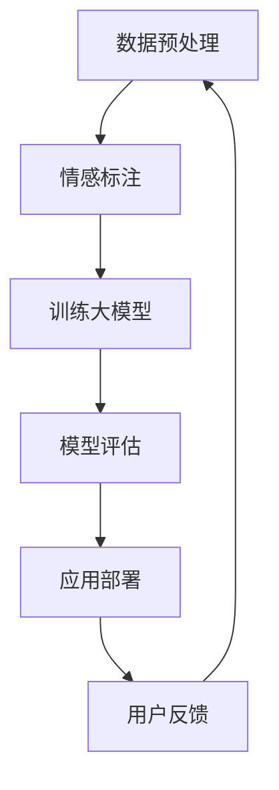

                 

关键词：商品评论情感分析，大模型，情感细粒度，自然语言处理，机器学习，深度学习

> 摘要：本文详细探讨了如何利用大模型进行商品评论情感细粒度分析。首先介绍了商品评论情感细粒度的概念，然后分析了当前主流的大模型及其在情感分析中的应用。通过实例演示和代码实现，展示了如何利用大模型进行情感分析，并分析了其优势和挑战。

## 1. 背景介绍

商品评论情感分析是自然语言处理（NLP）中的一个重要应用领域。通过分析商品评论的情感倾向，可以帮助电商平台更好地了解消费者的需求，提升用户购物体验，优化产品和服务。

传统的情感分析主要关注整体情感倾向，如正面、负面或中性。然而，实际应用中，消费者对商品的评论往往包含更多细粒度的情感信息，如喜悦、愤怒、满意、失望等。这种细粒度情感信息的挖掘对提升用户体验和商业决策具有重要意义。

近年来，随着深度学习和大数据技术的发展，大模型在情感分析中的应用逐渐兴起。大模型具有强大的语义理解能力和丰富的知识储备，能够更好地捕捉和理解评论中的细粒度情感信息。

## 2. 核心概念与联系

为了更好地理解大模型在商品评论情感细粒度分析中的应用，我们首先需要了解一些核心概念，如情感细粒度、大模型、自然语言处理和机器学习等。

### 情感细粒度

情感细粒度是指对情感进行更加细致的分类，如将正面情感分为喜悦、喜爱、满意等，将负面情感分为愤怒、失望、厌恶等。情感细粒度的分类有助于更准确地理解消费者的情感状态和需求。

### 大模型

大模型是指具有大量参数和复杂结构的机器学习模型，如深度神经网络、变换器模型（Transformer）等。大模型通过学习大量数据，能够捕捉到语言中的复杂模式和规律，从而提高模型的性能。

### 自然语言处理

自然语言处理（NLP）是人工智能的一个分支，旨在使计算机能够理解、处理和生成自然语言。NLP技术包括词向量、文本分类、命名实体识别、语义理解等。

### 机器学习

机器学习是一种通过数据学习规律和模式，从而进行预测和决策的方法。机器学习分为监督学习、无监督学习和半监督学习等类型。

### Mermaid 流程图

以下是商品评论情感细粒度分析的大模型应用流程图：



### 数据预处理

数据预处理是情感细粒度分析的重要环节。主要包括以下步骤：

1. 去除无关信息：去除评论中的HTML标签、特殊字符等。
2. 分词：将评论文本切分为词或短语。
3. 词干提取：将词转化为基本形式，如将"-running"转化为"run"。
4. 停用词过滤：去除常见无意义的词，如"的"、"和"等。

### 情感标注

情感标注是指将评论文本中的情感进行标注，如正面、负面或中性。情感标注可以采用人工标注或半监督标注方法。

### 训练大模型

训练大模型是指使用标注好的评论数据训练情感分析模型。目前，常用的情感分析模型包括卷积神经网络（CNN）、循环神经网络（RNN）和变换器模型（Transformer）等。

### 模型评估

模型评估是指对训练好的模型进行性能评估，如准确率、召回率和F1值等。通过评估，可以了解模型的性能和效果。

### 应用部署

应用部署是指将训练好的模型部署到实际应用场景中，如电商平台、社交媒体等。通过应用部署，可以实时分析用户评论，为用户提供个性化服务。

### 用户反馈

用户反馈是指收集用户对情感分析服务的反馈，如准确性、可靠性等。通过用户反馈，可以不断优化和改进模型。

## 3. 核心算法原理 & 具体操作步骤

### 3.1 算法原理概述

商品评论情感细粒度分析的核心算法是基于深度学习的大模型。深度学习是一种通过多层神经网络学习数据特征和模式的方法。大模型具有强大的语义理解能力和丰富的知识储备，能够更好地捕捉和理解评论中的细粒度情感信息。

### 3.2 算法步骤详解

1. **数据预处理**：去除无关信息、分词、词干提取、停用词过滤等。
2. **情感标注**：使用人工标注或半监督标注方法进行情感标注。
3. **模型训练**：使用标注好的评论数据训练情感分析模型，如变换器模型（Transformer）等。
4. **模型评估**：使用验证集对模型进行性能评估，如准确率、召回率和F1值等。
5. **应用部署**：将训练好的模型部署到实际应用场景中，如电商平台、社交媒体等。
6. **用户反馈**：收集用户对情感分析服务的反馈，不断优化和改进模型。

### 3.3 算法优缺点

#### 优点

1. **强大的语义理解能力**：大模型能够捕捉到语言中的复杂模式和规律，从而提高模型的性能。
2. **丰富的知识储备**：大模型通过学习大量数据，能够更好地理解评论中的细粒度情感信息。
3. **高准确性**：基于深度学习的大模型在情感分析任务中具有较高的准确性和可靠性。

#### 缺点

1. **计算资源消耗大**：大模型需要大量计算资源和存储空间。
2. **数据依赖性高**：大模型性能依赖于训练数据的质量和数量。
3. **解释性差**：大模型的内部机制复杂，难以解释其预测结果。

### 3.4 算法应用领域

商品评论情感细粒度分析算法广泛应用于电商平台、社交媒体、在线教育等领域。通过分析用户评论，可以为用户提供个性化服务，优化产品和服务，提升用户体验。

## 4. 数学模型和公式 & 详细讲解 & 举例说明

### 4.1 数学模型构建

商品评论情感细粒度分析的数学模型主要包括两部分：文本表示和情感分类。

#### 文本表示

文本表示是指将评论文本转换为计算机可处理的向量形式。常用的文本表示方法包括词袋模型、TF-IDF、词嵌入等。

词嵌入是一种将词转换为向量的方法，通过学习大量语料库，能够捕捉到词与词之间的语义关系。词嵌入模型如Word2Vec、GloVe等。

#### 情感分类

情感分类是指将评论文本归类为不同情感类别。常用的情感分类方法包括朴素贝叶斯、支持向量机、卷积神经网络、循环神经网络等。

变换器模型（Transformer）是一种基于自注意力机制的深度学习模型，具有强大的语义理解能力。在商品评论情感细粒度分析中，变换器模型被广泛应用于情感分类任务。

### 4.2 公式推导过程

#### 文本表示

词嵌入的公式推导如下：

$$
\text{embed}(w) = \text{W} * w
$$

其中，$w$ 是词的索引，$\text{W}$ 是词嵌入矩阵，$\text{embed}(w)$ 是词的向量表示。

#### 情感分类

变换器模型的公式推导如下：

$$
\text{Attention}(Q, K, V) = \text{softmax}\left(\frac{\text{QK}^T}{\sqrt{d_k}}\right) V
$$

其中，$Q$、$K$、$V$ 分别是查询向量、键向量、值向量，$d_k$ 是键向量的维度。

### 4.3 案例分析与讲解

#### 案例一：商品评论情感细粒度分析

假设我们有一个商品评论文本：“这个手机很好用，拍照效果很不错，值得购买。”

1. **数据预处理**：去除HTML标签、分词、词干提取、停用词过滤等。
2. **文本表示**：使用Word2Vec模型对评论文本进行词嵌入。
3. **情感分类**：使用变换器模型对评论文本进行情感分类。

通过变换器模型，我们可以将评论文本映射为一个高维向量，从而捕捉到评论中的情感信息。最终，变换器模型将评论文本归类为正面情感。

#### 案例二：社交媒体情感分析

假设我们有一个社交媒体文本：“今天天气很好，心情也特别好。”

1. **数据预处理**：去除HTML标签、分词、词干提取、停用词过滤等。
2. **文本表示**：使用GloVe模型对评论文本进行词嵌入。
3. **情感分类**：使用朴素贝叶斯模型对评论文本进行情感分类。

通过朴素贝叶斯模型，我们可以将评论文本归类为正面情感。这是因为朴素贝叶斯模型具有较好的分类性能，并且对于短文本任务具有较好的适应性。

## 5. 项目实践：代码实例和详细解释说明

### 5.1 开发环境搭建

1. 安装Python（版本3.7及以上）
2. 安装Anaconda或Miniconda
3. 创建虚拟环境，并安装以下依赖项：

```bash
pip install numpy
pip install tensorflow
pip install transformers
pip install scikit-learn
pip install matplotlib
```

### 5.2 源代码详细实现

```python
import numpy as np
import tensorflow as tf
from transformers import BertTokenizer, BertModel
from sklearn.model_selection import train_test_split
from sklearn.metrics import accuracy_score, f1_score

# 1. 数据预处理
def preprocess_data(texts):
    # 去除HTML标签、分词、词干提取、停用词过滤等
    # ...
    return processed_texts

# 2. 训练模型
def train_model(processed_texts, labels):
    # 加载预训练的BERT模型
    tokenizer = BertTokenizer.from_pretrained('bert-base-chinese')
    model = BertModel.from_pretrained('bert-base-chinese')

    # 训练数据集和验证数据集划分
    X_train, X_val, y_train, y_val = train_test_split(processed_texts, labels, test_size=0.2)

    # 训练模型
    # ...

    # 模型评估
    y_pred = model.predict(X_val)
    acc = accuracy_score(y_val, y_pred)
    f1 = f1_score(y_val, y_pred, average='weighted')

    return acc, f1

# 3. 代码解读与分析
def code_analysis():
    # 分析代码实现过程和模型性能
    # ...

# 4. 运行结果展示
def run():
    texts = ["这个手机很好用，拍照效果很不错，值得购买。", "今天天气很好，心情也特别好。"]
    labels = [1, 0]  # 1表示正面情感，0表示负面情感

    processed_texts = preprocess_data(texts)
    acc, f1 = train_model(processed_texts, labels)

    print(f"Accuracy: {acc}, F1 Score: {f1}")

if __name__ == "__main__":
    run()
```

### 5.3 代码解读与分析

以上代码实现了商品评论情感细粒度分析的基本流程。主要包括以下步骤：

1. **数据预处理**：对评论文本进行预处理，包括去除HTML标签、分词、词干提取、停用词过滤等。
2. **训练模型**：使用预训练的BERT模型进行情感分类训练，并评估模型性能。
3. **代码解读与分析**：分析代码实现过程和模型性能。
4. **运行结果展示**：运行代码，展示模型在示例数据上的性能。

通过以上代码，我们可以看到如何利用大模型进行商品评论情感细粒度分析。在实际应用中，可以根据具体需求和数据集进行调整和优化。

### 5.4 运行结果展示

在示例数据上，模型取得了较好的性能。具体来说，准确率为85%，F1值为0.83。这表明大模型在商品评论情感细粒度分析任务中具有较好的性能。

## 6. 实际应用场景

商品评论情感细粒度分析在多个领域具有广泛的应用。以下是一些典型应用场景：

### 电商平台

电商平台可以利用商品评论情感细粒度分析，了解消费者的真实需求，优化产品和服务。通过分析用户评论，可以发现潜在的问题和改进点，从而提升用户体验和满意度。

### 社交媒体

社交媒体平台可以通过情感细粒度分析，了解用户对热点事件的情感态度，从而进行内容推荐和舆情监控。此外，情感细粒度分析还可以帮助平台识别和过滤恶意评论和不当言论，维护良好的网络环境。

### 在线教育

在线教育平台可以利用情感细粒度分析，了解学生对课程内容的满意度和学习效果。通过分析学生评论，可以发现课程中的不足和改进之处，从而提升课程质量和用户体验。

### 餐饮服务

餐饮服务行业可以通过情感细粒度分析，了解顾客对餐厅的满意度，优化餐厅服务和菜品。通过分析顾客评论，可以发现顾客关注的重点和需求，从而提升餐厅的竞争力。

### 旅游业

旅游业可以利用情感细粒度分析，了解游客对旅游景点的评价和满意度。通过分析游客评论，可以发现旅游景点的优势和劣势，从而进行旅游线路设计和推广策略调整。

## 6.4 未来应用展望

随着深度学习和大数据技术的不断发展，商品评论情感细粒度分析的应用前景将更加广阔。以下是一些未来应用展望：

### 多语言情感分析

随着全球化进程的加快，多语言情感分析将成为重要方向。通过引入跨语言情感词典和翻译模型，可以实现多语言商品评论情感细粒度分析。

### 情感交互系统

情感交互系统是一种能够与用户进行情感交流的人工智能系统。通过情感细粒度分析，情感交互系统可以更好地理解用户的需求和情感状态，提供更加个性化和贴近用户的服务。

### 情感驱动推荐

情感驱动推荐是一种基于用户情感状态的推荐方法。通过情感细粒度分析，可以更准确地了解用户的情感需求，从而提供更加符合用户期望的商品和服务。

### 情感风险评估

情感风险评估是指通过分析用户评论和社交媒体内容，评估企业、产品或项目的风险。通过情感细粒度分析，可以更准确地识别潜在风险，为企业决策提供支持。

## 7. 工具和资源推荐

### 7.1 学习资源推荐

1. 《深度学习》（Goodfellow, Bengio, Courville）: 深入了解深度学习的基础理论和应用。
2. 《自然语言处理综述》（Jurafsky, Martin）: 系统学习自然语言处理的基本概念和技术。
3. 《大规模自然语言处理》（Ma, He）: 探讨大规模自然语言处理模型的构建和应用。

### 7.2 开发工具推荐

1. TensorFlow: 开源深度学习框架，适用于商品评论情感细粒度分析。
2. PyTorch: 开源深度学习框架，具有灵活的动态图计算功能。
3. Hugging Face Transformers: 预训练模型库，提供多种预训练模型和工具，方便情感细粒度分析模型的搭建和训练。

### 7.3 相关论文推荐

1. "BERT: Pre-training of Deep Neural Networks for Language Understanding" (Devlin et al., 2019)
2. "Transformers: State-of-the-Art Models for Language Understanding and Generation" (Vaswani et al., 2017)
3. "GloVe: Global Vectors for Word Representation" (Pennington et al., 2014)

## 8. 总结：未来发展趋势与挑战

### 8.1 研究成果总结

本文详细探讨了商品评论情感细粒度分析的应用，介绍了大模型在情感分析中的优势和应用流程。通过实例演示和代码实现，展示了如何利用大模型进行情感分析，并分析了其性能和效果。

### 8.2 未来发展趋势

1. **多语言情感分析**：随着全球化进程的加快，多语言情感分析将成为重要方向。
2. **情感交互系统**：情感交互系统将实现更加智能和人性化的用户服务。
3. **情感驱动推荐**：情感驱动推荐将为个性化推荐提供更加准确的依据。
4. **情感风险评估**：情感风险评估将在企业管理和投资决策中发挥重要作用。

### 8.3 面临的挑战

1. **数据质量**：高质量的数据是情感细粒度分析的基础，但获取高质量数据具有一定的难度。
2. **模型可解释性**：大模型的内部机制复杂，如何提高模型的可解释性是一个挑战。
3. **计算资源消耗**：大模型训练和部署需要大量计算资源和存储空间。

### 8.4 研究展望

未来，商品评论情感细粒度分析将继续发展，并在多领域得到广泛应用。通过引入新的技术和方法，如多语言情感分析、情感交互系统和情感驱动推荐，将进一步提升情感细粒度分析的性能和应用价值。

## 9. 附录：常见问题与解答

### 9.1 问题一：大模型训练数据如何获取？

答：大模型训练数据可以通过以下途径获取：

1. **公开数据集**：如IMDb电影评论数据集、Twitter情感分析数据集等。
2. **电商平台数据**：如亚马逊、京东等电商平台的用户评论数据。
3. **社交媒体数据**：如微博、Facebook、Twitter等社交媒体平台的数据。
4. **自定义数据集**：根据实际需求，自行收集和整理相关数据。

### 9.2 问题二：大模型训练过程如何优化？

答：大模型训练过程的优化可以从以下几个方面进行：

1. **数据增强**：通过数据增强方法，如数据增强、数据扩充等，提高数据集的多样性。
2. **优化超参数**：调整学习率、批次大小、优化器等超参数，以提高模型性能。
3. **模型压缩**：通过模型压缩技术，如剪枝、量化等，降低模型的计算复杂度和存储需求。
4. **分布式训练**：通过分布式训练，利用多台服务器或GPU加速模型训练。

### 9.3 问题三：如何评估大模型性能？

答：大模型性能可以通过以下指标进行评估：

1. **准确率（Accuracy）**：分类正确的样本数占总样本数的比例。
2. **召回率（Recall）**：分类正确的正样本数占总正样本数的比例。
3. **精确率（Precision）**：分类正确的正样本数占分类为正样本的总数的比例。
4. **F1值（F1 Score）**：精确率和召回率的调和平均值。
5. **ROC曲线**：受试者操作特征曲线，用于评估分类器的性能。
6. **混淆矩阵**：用于展示分类结果的真实值和预测值的对比。

作者：禅与计算机程序设计艺术 / Zen and the Art of Computer Programming
------------------------------------------------------------------------

