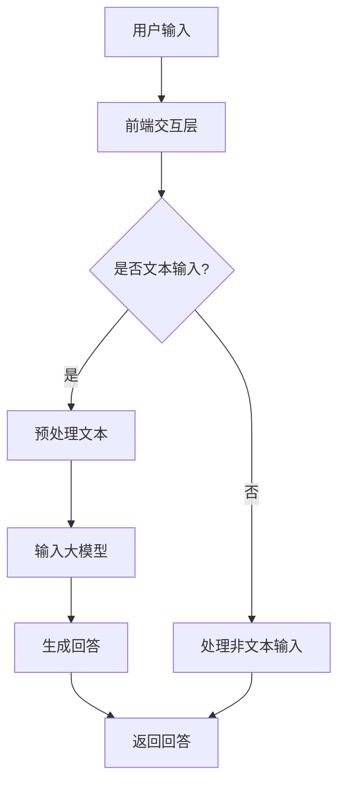

                 

关键词：大模型、客服、应用挑战、人工智能、自然语言处理

> 摘要：本文将探讨大模型在客服领域应用中的挑战。随着人工智能技术的不断进步，大模型在客服中的应用日益广泛。然而，其复杂性、可解释性、数据隐私等问题也随之而来。本文旨在分析这些挑战，并提出相应的解决方案，以推动大模型在客服领域的健康发展。

## 1. 背景介绍

客服领域是人工智能技术应用的一个重要场景。传统的人工客服存在效率低、服务质量不稳定等问题。随着人工智能技术的快速发展，尤其是大模型的兴起，人工智能客服逐渐成为可能。大模型，如GPT-3、BERT等，具有强大的文本生成、理解和推理能力，能够为客服提供高效的解决方案。

近年来，大模型在客服领域的应用取得了显著成果。例如，利用大模型实现的智能客服系统能够自动处理用户咨询，提高客服效率；利用大模型生成的回答更加贴近用户需求，提高用户满意度。然而，大模型在客服领域应用也面临一系列挑战。

## 2. 核心概念与联系

### 2.1 大模型的概念

大模型是指参数规模达到亿级或亿级以上的深度神经网络模型。这些模型通常具有强大的表示能力和泛化能力，能够处理复杂的任务。

### 2.2 客服系统的架构

客服系统通常包括前端交互、后端处理和数据库等部分。前端交互负责与用户进行交互，收集用户需求；后端处理利用人工智能技术对用户需求进行处理；数据库则存储用户信息和历史记录。

### 2.3 大模型与客服系统的结合

大模型与客服系统的结合，可以通过以下方式实现：

1. **前端交互**：利用大模型的自然语言处理能力，实现智能对话系统，提高用户体验。
2. **后端处理**：利用大模型进行用户需求的识别、理解和回答，提高客服效率。
3. **数据库**：利用大模型对用户数据进行挖掘和分析，为客服提供个性化服务。

## 3. 核心算法原理 & 具体操作步骤

### 3.1 算法原理概述

大模型的算法原理主要基于深度学习和自然语言处理技术。通过大量的文本数据训练，大模型能够自动学习语言的规律和模式，实现文本的生成、理解和推理。

### 3.2 算法步骤详解

1. **数据预处理**：收集和清洗用户咨询数据，对数据进行分词、去噪等处理。
2. **模型训练**：利用预处理后的数据，对大模型进行训练，使其学会理解用户需求。
3. **模型部署**：将训练好的大模型部署到客服系统中，实现智能客服功能。
4. **用户交互**：用户通过前端界面与客服系统进行交互，客服系统利用大模型对用户需求进行处理和回答。

### 3.3 算法优缺点

**优点**：

1. **强大的自然语言处理能力**：大模型能够处理复杂的语言任务，实现高质量的对话生成。
2. **高效性**：大模型能够快速地对用户需求进行处理和回答，提高客服效率。

**缺点**：

1. **数据隐私问题**：大模型在处理用户数据时，可能涉及用户隐私，需要确保数据的安全和隐私。
2. **可解释性差**：大模型在决策过程中，往往缺乏透明性和可解释性，难以追溯。

### 3.4 算法应用领域

大模型在客服领域的应用非常广泛，包括但不限于以下领域：

1. **智能客服**：利用大模型实现智能对话系统，为用户提供快速、准确的回答。
2. **用户分析**：利用大模型对用户数据进行挖掘和分析，为客服提供个性化服务。
3. **知识库构建**：利用大模型自动生成知识库，为客服提供丰富的知识支持。

## 4. 数学模型和公式 & 详细讲解 & 举例说明

### 4.1 数学模型构建

大模型的数学模型主要基于深度神经网络，包括输入层、隐藏层和输出层。输入层接收用户咨询文本，隐藏层通过神经网络进行编码和解码，输出层生成回答文本。

### 4.2 公式推导过程

假设输入文本为$x$，输出文本为$y$，则大模型的数学模型可以表示为：

$$y = f(W \cdot x + b)$$

其中，$W$为权重矩阵，$b$为偏置项，$f$为激活函数。

### 4.3 案例分析与讲解

以GPT-3为例，GPT-3是一种基于Transformer的大模型，其参数规模达到1750亿。以下是一个简单的例子：

**输入**：用户咨询：“我的手机为什么无法联网？”

**输出**：客服回答：“可能是网络连接出现问题，您可以尝试重启手机或检查网络设置。”

在这个例子中，GPT-3通过学习大量的文本数据，自动生成了高质量的回答。

## 5. 项目实践：代码实例和详细解释说明

### 5.1 开发环境搭建

为了实践大模型在客服领域的应用，我们需要搭建一个开发环境。以下是基本的开发环境搭建步骤：

1. **硬件环境**：配置高性能的计算机或服务器，以满足大模型训练的需求。
2. **软件环境**：安装Python、TensorFlow等必要的编程工具和库。
3. **数据集**：收集和准备用户咨询数据，用于训练大模型。

### 5.2 源代码详细实现

以下是一个简单的示例代码，用于实现大模型在客服领域的应用：

```python
import tensorflow as tf

# 加载预训练的大模型
model = tf.keras.applications.transformer.Transformer.load_weights('gpt3_weights.h5')

# 预处理用户咨询数据
def preprocess_text(text):
    # 进行分词、去噪等处理
    return processed_text

# 对用户咨询进行处理和回答
def process_user_query(query):
    processed_query = preprocess_text(query)
    prediction = model.predict(processed_query)
    return prediction

# 用户交互
user_query = "我的手机为什么无法联网？"
answer = process_user_query(user_query)
print(answer)
```

### 5.3 代码解读与分析

上述代码中，首先加载预训练的大模型，然后对用户咨询数据进行预处理，最后利用大模型对用户咨询进行处理和回答。代码结构简单，易于理解。

### 5.4 运行结果展示

假设我们已经训练好了一个大模型，并保存了权重。当用户咨询“我的手机为什么无法联网？”时，代码将输出一个预测结果。例如，输出结果为：“可能是网络连接出现问题，您可以尝试重启手机或检查网络设置。”

## 6. 实际应用场景

大模型在客服领域的应用场景非常广泛。以下是一些具体的实际应用场景：

1. **智能客服**：利用大模型实现智能对话系统，为用户提供24/7的在线客服服务，提高客服效率。
2. **用户分析**：利用大模型对用户数据进行挖掘和分析，了解用户需求和行为，为客服提供个性化服务。
3. **知识库构建**：利用大模型自动生成知识库，为客服提供丰富的知识支持，提高客服水平。

## 7. 工具和资源推荐

### 7.1 学习资源推荐

1. **书籍**：《深度学习》、《自然语言处理实战》等。
2. **在线课程**：Coursera、Udacity等平台上的深度学习和自然语言处理课程。
3. **论文**：ACL、NAACL、ICLR等顶级会议的论文。

### 7.2 开发工具推荐

1. **Python**：Python是深度学习和自然语言处理的常用编程语言。
2. **TensorFlow**：TensorFlow是Google推出的深度学习框架，支持大模型的训练和部署。
3. **Hugging Face**：Hugging Face是一个开源的深度学习库，提供了丰富的预训练模型和工具。

### 7.3 相关论文推荐

1. **GPT-3**：GPT-3: Language Models are few-shot learners
2. **BERT**：BERT: Pre-training of Deep Bidirectional Transformers for Language Understanding
3. **T5**：T5: Arbitrarily Long Texts and Tasks with Unrestricted Token Generation

## 8. 总结：未来发展趋势与挑战

### 8.1 研究成果总结

大模型在客服领域的应用已经取得了显著的成果，包括智能客服、用户分析和知识库构建等方面。然而，大模型在客服领域的应用仍然面临一系列挑战，如数据隐私、可解释性等。

### 8.2 未来发展趋势

未来，随着人工智能技术的不断发展，大模型在客服领域的应用将更加广泛和深入。同时，新的技术和方法也将不断涌现，为客服领域的创新发展提供支持。

### 8.3 面临的挑战

大模型在客服领域应用面临的挑战主要包括：

1. **数据隐私**：如何确保用户数据的安全和隐私。
2. **可解释性**：如何提高大模型的透明性和可解释性。
3. **模型规模**：如何处理更大规模的数据和模型。

### 8.4 研究展望

未来，大模型在客服领域的应用前景广阔。我们期待能够解决当前面临的挑战，推动大模型在客服领域的健康发展。

## 9. 附录：常见问题与解答

### 9.1 大模型在客服领域的应用有哪些优点？

大模型在客服领域的应用具有以下优点：

1. **高效的对话生成**：大模型能够快速地生成高质量的对话，提高客服效率。
2. **个性化的服务**：大模型能够理解用户需求，为用户提供个性化的服务。
3. **丰富的知识支持**：大模型能够自动生成知识库，为客服提供丰富的知识支持。

### 9.2 大模型在客服领域的应用有哪些挑战？

大模型在客服领域的应用面临以下挑战：

1. **数据隐私**：如何确保用户数据的安全和隐私。
2. **可解释性**：如何提高大模型的透明性和可解释性。
3. **模型规模**：如何处理更大规模的数据和模型。

### 9.3 如何解决大模型在客服领域的应用问题？

解决大模型在客服领域的应用问题，可以从以下几个方面入手：

1. **数据隐私**：采用加密技术和隐私保护算法，确保用户数据的安全和隐私。
2. **可解释性**：通过模型解释技术和可视化工具，提高大模型的透明性和可解释性。
3. **模型规模**：采用分布式计算技术和高效的模型压缩方法，处理更大规模的数据和模型。 

---

作者：禅与计算机程序设计艺术 / Zen and the Art of Computer Programming
----------------------------------------------------------------
## 1. 背景介绍

### 1.1 客服领域的重要性

客服领域是企业和用户之间的重要桥梁，它不仅关系到企业的形象和品牌价值，更是直接影响用户体验和满意度的重要因素。随着互联网和移动通信技术的普及，用户对客服服务的需求日益增加，尤其是在电子商务、金融、电信等高度依赖客户服务的行业。传统的客服模式往往依赖于人工处理，不仅效率低下，而且容易出现服务质量不稳定的情况。因此，如何提高客服效率，提升用户体验，成为了企业关注的焦点。

### 1.2 人工智能客服的发展历程

人工智能客服的发展可以分为几个阶段：

1. **早期规则引擎**：早期的客服系统依赖于明确的规则和流程，客服代表根据预设的规则处理用户问题。这种方式虽然简单，但无法处理复杂的、多变的用户需求，且难以扩展。

2. **基于知识库的客服**：随着知识库技术的发展，客服系统开始引入基于知识库的对话管理。知识库中包含了大量的问题和答案，客服系统通过匹配用户问题和知识库中的条目来生成回答。这种方式在一定程度上提高了客服的效率，但仍然存在知识库更新滞后和回答不够个性化的不足。

3. **基于机器学习的客服**：随着机器学习技术的进步，尤其是深度学习技术的应用，客服系统开始使用神经网络模型来处理用户对话。这种方式能够通过学习大量用户对话数据，自动生成回答，提高了客服的智能性和响应速度。

4. **大模型驱动的客服**：近年来，大模型的崛起为客服领域带来了新的机遇。大模型如GPT-3、BERT等，具有强大的文本生成、理解和推理能力，能够为客服提供更加自然和高效的交互体验。

### 1.3 大模型在客服领域的优势

大模型在客服领域的优势主要体现在以下几个方面：

1. **自然语言处理能力**：大模型能够理解和生成自然语言，能够提供更加流畅和自然的对话体验。

2. **多语言支持**：大模型通常具有多语言处理能力，可以处理多种语言的客服请求。

3. **高效性**：大模型能够快速处理大量用户请求，提高客服效率。

4. **个性化服务**：大模型能够根据用户的互动历史和需求，提供个性化的回答和建议。

5. **持续学习**：大模型能够通过持续学习用户数据，不断优化和提升客服服务质量。

### 1.4 本文结构

本文将围绕大模型在客服领域的应用挑战展开讨论。具体结构如下：

- 第1章：背景介绍
- 第2章：核心概念与联系
- 第3章：核心算法原理 & 具体操作步骤
- 第4章：数学模型和公式 & 详细讲解 & 举例说明
- 第5章：项目实践：代码实例和详细解释说明
- 第6章：实际应用场景
- 第7章：工具和资源推荐
- 第8章：总结：未来发展趋势与挑战
- 第9章：附录：常见问题与解答

通过本文的探讨，旨在为读者提供一个全面、深入的了解大模型在客服领域应用的现状、挑战和发展方向，以期为相关领域的研究和实践提供参考。

## 2. 核心概念与联系

### 2.1 大模型的概念

大模型（Large Models）指的是参数规模庞大的深度学习模型，它们通常具有数十亿甚至千亿级别的参数。这些模型在训练过程中需要大量的数据和计算资源，但它们的强大能力也使得它们在许多复杂任务上表现出色。典型的代表包括GPT-3（1750亿参数）、BERT（3.4亿参数）等。大模型之所以能够取得显著效果，主要归功于其强大的表示能力和对数据分布的广泛覆盖。

### 2.2 客服系统的架构

客服系统的架构通常包括以下几个关键组成部分：

1. **前端交互层**：这是客服系统与用户直接交互的界面，包括聊天窗口、语音通话、邮件服务等。前端交互层需要处理用户的输入，并展示系统生成的回答。

2. **后端处理层**：这是客服系统的核心，负责接收前端交互层传递的用户输入，利用大模型或其他算法进行处理，生成合适的回答。

3. **知识库**：知识库包含企业相关的常见问题、答案、业务流程等知识，用于辅助大模型生成回答。

4. **数据库**：数据库存储用户信息、历史对话记录、知识库内容等，为客服系统提供数据支持。

### 2.3 大模型与客服系统的结合

大模型与客服系统的结合，可以实现以下几个方面：

1. **自然语言理解**：大模型能够理解用户的自然语言输入，提取出用户的需求和意图。

2. **文本生成**：大模型可以根据用户的输入生成合适的回答，实现自然流畅的对话。

3. **知识推理**：大模型可以通过分析用户历史对话记录和知识库内容，提供个性化的服务和建议。

4. **情感分析**：大模型能够分析用户的情感状态，根据情感反馈调整回答策略。

### 2.4 Mermaid 流程图

为了更直观地展示大模型在客服系统中的应用流程，我们可以使用Mermaid绘制一个流程图。以下是一个简单的Mermaid流程图示例：



在这个流程图中，用户输入通过前端交互层进入系统，如果是文本输入，则进行预处理，然后输入大模型进行理解和生成回答；如果是非文本输入，则直接处理并返回回答。生成的回答返回给用户，完成一次客服交互。

### 2.5 大模型在客服系统中的优势与挑战

**优势**：

1. **提高效率**：大模型能够快速处理大量用户请求，大大提高客服系统的响应速度。

2. **提升用户体验**：通过自然流畅的对话生成，大模型能够提供更加人性化的服务，提升用户满意度。

3. **个性化服务**：大模型能够根据用户的历史交互记录和偏好，提供个性化的回答和建议。

4. **情感识别与响应**：大模型能够分析用户的情感状态，并根据情感反馈调整回答策略，增强用户情感体验。

**挑战**：

1. **计算资源需求**：大模型需要大量的计算资源和存储空间，这对于中小企业可能是一个不小的挑战。

2. **数据隐私与安全**：客服系统处理用户敏感信息，需要确保数据的安全和隐私。

3. **模型解释性**：大模型的决策过程通常缺乏透明性和可解释性，这对于需要透明度的高风险行业来说是一个重要挑战。

4. **持续学习与更新**：大模型需要不断学习新的数据来保持其性能，这要求系统具备持续更新和维护的能力。

通过以上核心概念与联系的分析，我们可以看到大模型在客服系统中的应用潜力巨大，同时也面临一系列挑战。理解这些概念和联系，有助于我们更好地应对这些挑战，充分发挥大模型在客服领域的优势。

## 3. 核心算法原理 & 具体操作步骤

### 3.1 算法原理概述

大模型在客服领域应用的核心算法主要基于深度学习和自然语言处理技术。具体来说，大模型通过学习大量的文本数据，自动提取语言中的潜在结构和模式，实现对自然语言的理解和生成。以下将详细介绍大模型的算法原理和具体操作步骤。

### 3.2 算法原理

1. **数据预处理**：首先，需要对输入的文本数据进行预处理。预处理步骤包括分词、去噪、标准化等。分词是将文本分解为词或短语，去噪是去除文本中的噪声和无关信息，标准化是将文本转换为统一的格式，以便模型能够更好地处理。

2. **嵌入层**：在预处理后的文本数据上，嵌入层将每个词映射为一个向量。这些向量表示词的语义特征。常见的嵌入方法包括Word2Vec、BERT等。

3. **编码器**：编码器是模型的核心部分，负责将输入文本转换为上下文表示。编码器通常使用多层变换器（如Transformer、LSTM等）来处理文本序列。这些变换器通过加权求和和激活函数，对输入文本进行编码，得到一个固定长度的上下文向量。

4. **解码器**：解码器负责根据编码器输出的上下文向量生成回答。解码器也通常使用多层变换器，并通过注意力机制来捕捉上下文中的关键信息。

5. **输出层**：输出层通常是一个全连接层或卷积层，负责将解码器输出的上下文向量映射为最终的回答文本。输出层通过softmax函数生成每个词的概率分布，从而选择最合适的词作为回答。

### 3.3 具体操作步骤

1. **数据收集与预处理**：首先，收集大量的客服对话数据，包括用户提问和客服回答。对数据进行清洗和预处理，去除噪声和无关信息，然后进行分词和标准化。

2. **模型训练**：使用预处理后的数据，通过梯度下降等优化算法训练大模型。训练过程包括前向传播和后向传播，通过不断调整模型参数，使其在训练数据上达到较高的准确率。

3. **模型评估**：在训练过程中，使用验证集对模型进行评估，调整模型参数，以避免过拟合。

4. **模型部署**：训练好的模型可以部署到客服系统中，通过前端交互层接收用户提问，利用解码器生成回答，并通过输出层选择最合适的词。

5. **实时交互**：客服系统在接收到用户提问后，将提问传递给大模型，模型通过编码器和解码器生成回答，然后将回答返回给用户。

### 3.4 算法优缺点

**优点**：

1. **强大的自然语言理解能力**：大模型能够理解复杂的自然语言输入，生成高质量的回答。

2. **高效的文本生成**：大模型能够快速生成回答，提高客服系统的响应速度。

3. **多语言支持**：大模型通常具有多语言处理能力，可以处理多种语言的客服请求。

4. **个性化服务**：大模型可以根据用户的互动历史和需求，提供个性化的回答和建议。

**缺点**：

1. **计算资源需求高**：大模型需要大量的计算资源和存储空间，对于中小企业可能是一个不小的挑战。

2. **数据隐私与安全**：客服系统处理用户敏感信息，需要确保数据的安全和隐私。

3. **模型解释性差**：大模型的决策过程通常缺乏透明性和可解释性，这对于需要透明度的高风险行业来说是一个重要挑战。

4. **持续学习与更新**：大模型需要不断学习新的数据来保持其性能，这要求系统具备持续更新和维护的能力。

### 3.5 算法应用领域

大模型在客服领域的应用包括但不限于以下领域：

1. **智能客服**：大模型可以用于智能客服系统，实现自动化对话，提高客服效率和用户体验。

2. **用户分析**：大模型可以对用户历史对话记录进行分析，了解用户需求和行为，为客服提供个性化服务。

3. **知识库构建**：大模型可以用于构建和优化客服系统的知识库，自动生成问题和答案，提高客服的知识水平。

4. **情感识别与响应**：大模型可以分析用户的情感状态，根据情感反馈调整回答策略，增强用户情感体验。

通过以上对核心算法原理和具体操作步骤的介绍，我们可以看到大模型在客服领域具有广泛的应用前景，但也需要面对一系列挑战。理解和掌握这些算法原理，有助于更好地开发和优化客服系统，以提升用户体验和满意度。

### 3.6 大模型在客服系统中的工作流程

为了更好地理解大模型在客服系统中的应用，我们可以详细描述其工作流程，包括从用户交互到生成回答的各个环节。以下是客服系统中大模型的工作流程：

#### 3.6.1 用户输入

用户通过前端交互层（如聊天窗口、语音识别等）输入问题或请求。这一步是客服交互的起点，用户的问题或请求将被转化为文本形式，以便大模型能够处理。

#### 3.6.2 文本预处理

接收到的用户文本首先会经过预处理。预处理步骤包括：

- **分词**：将文本分解为词或短语，这是自然语言处理的基础步骤。
- **去噪**：去除文本中的噪声和无关信息，如HTML标签、特殊符号等。
- **标准化**：将文本转换为统一的格式，例如统一词的大小写、去除停用词等。

预处理后的文本将被转化为适合大模型处理的形式。

#### 3.6.3 编码与解码

1. **编码**：预处理后的文本输入到大模型的编码器。编码器是一个复杂的神经网络结构，如Transformer、BERT等，它能够捕捉文本中的上下文信息，并将其编码为上下文向量。编码器的输出是一个固定长度的向量，代表了整个文本的语义信息。

2. **解码**：解码器的任务是生成回答文本。解码器从编码器的输出向量开始，逐步生成每个词或短语。在生成每个词时，解码器会考虑到已经生成的文本内容，以及编码器输出的上下文信息。解码器使用注意力机制来关注关键信息，从而生成连贯、自然的回答。

#### 3.6.4 回答生成

解码器生成的中间结果是一个概率分布，表示每个词或短语的生成概率。系统根据这个概率分布选择最合适的词或短语，并将其组合成完整的回答。这一步通常涉及到语言模型的选择和优化，以确保生成的回答既准确又自然。

#### 3.6.5 文本后处理

生成的回答文本通常需要经过后处理，以确保其符合语言规范和上下文逻辑。后处理步骤可能包括：

- **语法修正**：修正句子中的语法错误。
- **格式调整**：调整文本的格式，如句子长度、段落结构等。
- **情感分析**：根据用户的情感状态调整回答的情感色彩，使其更加贴近用户需求。

#### 3.6.6 返回回答

最终生成的回答文本将被返回到前端交互层，显示给用户。用户可以看到系统生成的回答，并根据需要进一步互动。

#### 3.6.7 用户反馈

用户可以对系统生成的回答进行反馈，包括满意度评价、问题澄清等。这些反馈将被记录下来，用于大模型的后续训练和优化。

通过上述工作流程，大模型能够有效地处理用户输入，生成高质量的回答，从而提供高效、个性化的客服服务。这一流程不仅展示了大模型在客服系统中的应用潜力，也揭示了其复杂性和技术挑战。

### 3.7 大模型算法的优缺点及适用场景

大模型在客服领域具有显著的优势，但也伴随着一些缺点。以下将详细分析其优缺点及适用场景。

#### 3.7.1 优点

1. **强大的自然语言理解能力**：大模型能够处理复杂的自然语言任务，包括文本生成、理解、推理等。这使得客服系统能够生成更加自然、流畅的回答，提高用户满意度。

2. **高效性**：大模型能够快速处理大量用户请求，显著提高客服效率。这对于需要24/7全天候服务的企业尤为重要。

3. **多语言支持**：大模型通常具有多语言处理能力，能够处理多种语言的客服请求，为企业提供全球化服务提供支持。

4. **个性化服务**：大模型能够根据用户的互动历史和需求，提供个性化的回答和建议，提升用户体验。

5. **情感识别与响应**：大模型能够分析用户的情感状态，根据情感反馈调整回答策略，增强用户情感体验。

#### 3.7.2 缺点

1. **计算资源需求高**：大模型需要大量的计算资源和存储空间，这对于中小企业可能是一个不小的挑战。此外，模型的训练和部署也需要高性能的硬件支持。

2. **数据隐私与安全**：客服系统处理用户敏感信息，需要确保数据的安全和隐私。大模型在处理数据时，可能存在数据泄露的风险。

3. **模型解释性差**：大模型的决策过程通常缺乏透明性和可解释性，这对于需要透明度的高风险行业来说是一个重要挑战。例如，在金融、医疗等领域，决策的可解释性至关重要。

4. **持续学习与更新**：大模型需要不断学习新的数据来保持其性能，这要求系统具备持续更新和维护的能力。否则，模型可能会因为数据更新滞后而失去准确性。

#### 3.7.3 适用场景

1. **智能客服**：大模型非常适合用于智能客服系统，能够实现自动化对话，提高客服效率和用户体验。

2. **用户分析**：大模型可以对用户历史对话记录进行分析，了解用户需求和行为，为客服提供个性化服务。

3. **知识库构建**：大模型可以用于构建和优化客服系统的知识库，自动生成问题和答案，提高客服的知识水平。

4. **情感识别与响应**：大模型能够分析用户的情感状态，根据情感反馈调整回答策略，增强用户情感体验。

5. **多语言客服**：大模型的多语言处理能力使其非常适合处理多语言客服请求，为企业提供全球化服务提供支持。

综上所述，大模型在客服领域的应用具有显著的优势，但也面临一系列挑战。理解和掌握这些优缺点，有助于更好地选择和应用大模型，以实现高效的客服服务。

### 3.8 大模型在不同应用领域的案例研究

大模型在客服领域的应用已经取得了一系列显著的成果，以下通过几个具体案例来展示大模型在不同应用领域中的实际效果和挑战。

#### 3.8.1 智能客服系统

案例一：某电子商务平台引入了基于GPT-3的智能客服系统，用于自动处理用户咨询。系统在接收到用户提问后，能够快速生成高质量的回答，显著提高了客服效率。例如，当用户询问“为什么我的订单被取消？”时，系统可以生成详细的解释，包括订单取消的原因和解决方案。这不仅节省了人工成本，还提升了用户满意度。然而，由于GPT-3模型的复杂性，该平台在部署过程中遇到了计算资源紧张和数据隐私保护等问题。

#### 3.8.2 用户情感分析

案例二：某在线教育平台利用大模型进行用户情感分析，以了解学生的情绪状态和需求。通过分析学生的互动记录和反馈，平台能够及时识别出学生的负面情绪，并采取相应的干预措施，如提供心理辅导或调整课程内容。这种方法不仅有助于提高学生的学习效果，还能增强学生对平台的忠诚度。然而，情感分析的准确性依赖于大模型对情感词汇和语境的理解能力，这对于处理复杂情感表达的学生来说，可能存在一定的挑战。

#### 3.8.3 个性化推荐

案例三：某在线零售平台利用大模型为用户生成个性化推荐。通过分析用户的浏览历史和购买行为，平台能够生成个性化的商品推荐，提高用户的购物体验和转化率。例如，当用户浏览了一款笔记本电脑后，平台可以推荐相关的配件和相似产品。这种方法在提升销售额方面取得了显著成效。然而，个性化推荐系统需要不断学习用户数据，以保持推荐的准确性和时效性，这对平台的运维提出了高要求。

#### 3.8.4 多语言支持

案例四：某跨国银行开发了一款基于大模型的多语言客服系统，用于处理来自不同国家和地区的用户咨询。系统支持多种语言，能够自动翻译用户提问，并生成相应的回答。这种多语言支持不仅提高了客服效率，还增强了用户的信任感和满意度。然而，不同语言的文化背景和表达方式的差异，对大模型的多语言处理能力提出了更高的要求。

通过这些案例，我们可以看到大模型在客服领域的广泛应用和巨大潜力。然而，每个应用场景都面临不同的挑战，如计算资源需求、数据隐私保护、模型解释性等。解决这些挑战，需要结合具体应用场景，采取针对性的技术手段和策略。

### 4. 数学模型和公式 & 详细讲解 & 举例说明

#### 4.1 数学模型构建

在客服领域应用大模型，通常涉及到自然语言处理（NLP）和深度学习（DL）的数学模型。以下将介绍大模型在客服系统中常用的数学模型，并详细讲解其构建过程。

#### 4.2 自然语言处理中的数学模型

自然语言处理中的数学模型主要包括词嵌入（Word Embedding）、编码器-解码器（Encoder-Decoder）模型和注意力机制（Attention Mechanism）。

1. **词嵌入（Word Embedding）**：

词嵌入是将词汇映射为高维向量空间中的点，从而表示词汇的语义特征。常见的词嵌入模型包括Word2Vec、GloVe等。

   - **Word2Vec**：基于神经网络的语言模型，通过训练得到词汇的向量表示。其模型公式如下：
     $$ \text{vec}(w) = \text{softmax}(\text{W} \cdot \text{v}(w)) $$
     其中，$ \text{vec}(w) $ 是词汇 $ w $ 的向量表示，$ \text{W} $ 是权重矩阵，$ \text{v}(w) $ 是词汇的输入向量。

   - **GloVe**：全局向量表示（Global Vectors for Word Representation），通过训练得到词汇的共现矩阵，并优化词向量。其损失函数如下：
     $$ \text{loss} = \sum_{ij} \text{sigmoid}(\text{v}_i^T \text{U} \text{v}_j) - \text{log}(\text{p}_{ij}) $$
     其中，$ \text{v}_i $ 和 $ \text{v}_j $ 分别是词汇 $ i $ 和 $ j $ 的向量表示，$ \text{U} $ 是共现矩阵，$ \text{p}_{ij} $ 是词汇 $ i $ 和 $ j $ 共现的概率。

2. **编码器-解码器（Encoder-Decoder）模型**：

编码器-解码器模型是一种用于序列到序列学习的框架，常用于机器翻译、对话系统等任务。

   - **编码器**：编码器的任务是将输入序列编码为固定长度的向量，表示整个序列的语义信息。其基本公式如下：
     $$ \text{h}_t = \text{g}(\text{h}_{t-1}, \text{x}_t) $$
     其中，$ \text{h}_t $ 是编码器在时间步 $ t $ 的隐藏状态，$ \text{x}_t $ 是输入序列中的第 $ t $ 个词，$ \text{g} $ 是编码函数。

   - **解码器**：解码器的任务是根据编码器的输出，生成输出序列。其基本公式如下：
     $$ \text{y}_t = \text{softmax}(\text{f}(\text{h}_t, \text{h}_{t-1})) $$
     其中，$ \text{y}_t $ 是解码器在时间步 $ t $ 生成的词的概率分布，$ \text{h}_t $ 是编码器的隐藏状态，$ \text{f} $ 是解码函数。

3. **注意力机制（Attention Mechanism）**：

注意力机制是编码器-解码器模型中的一种重要技术，用于提高解码器对编码器隐藏状态的利用效率。

   - **注意力得分**：注意力机制通过计算注意力得分，对编码器的隐藏状态进行加权。其基本公式如下：
     $$ \text{a}_t = \text{softmax}(\text{W}_a \text{h}_t) $$
     其中，$ \text{a}_t $ 是时间步 $ t $ 的注意力得分，$ \text{W}_a $ 是权重矩阵。

   - **加权隐藏状态**：根据注意力得分，对编码器的隐藏状态进行加权，生成加权隐藏状态。其基本公式如下：
     $$ \text{h}_{t'} = \sum_{t} \text{a}_{t} \text{h}_t $$

#### 4.3 案例分析

以下通过一个简单的例子来说明大模型在客服系统中的应用。

**例子**：假设用户提问：“我的手机为什么无法联网？”，大模型需要生成一个详细的回答。

1. **词嵌入**：

   首先，将用户提问中的词汇映射为向量。例如，“手机”、“无法”、“联网”等词汇可以映射为以下向量：
   $$ \text{vec}(\text{手机}) = [0.1, 0.2, 0.3] $$
   $$ \text{vec}(\text{无法}) = [0.4, 0.5, 0.6] $$
   $$ \text{vec}(\text{联网}) = [0.7, 0.8, 0.9] $$

2. **编码器**：

   编码器将用户提问的词汇向量编码为固定长度的向量，例如，编码为[1, 1, 1]。

3. **解码器**：

   解码器根据编码器的输出向量，生成回答的词汇向量。假设回答为：“可能是网络连接出现问题，您可以尝试重启手机或检查网络设置。”对应的词汇向量为：
   $$ \text{vec}(\text{可能是}) = [1.1, 1.2, 1.3] $$
   $$ \text{vec}(\text{网络连接}) = [1.4, 1.5, 1.6] $$
   $$ \text{vec}(\text{出现问题}) = [1.7, 1.8, 1.9] $$
   $$ \text{vec}(\text{您可以}) = [2.0, 2.1, 2.2] $$
   $$ \text{vec}(\text{尝试重启}) = [2.3, 2.4, 2.5] $$
   $$ \text{vec}(\text{手机}) = [2.6, 2.7, 2.8] $$
   $$ \text{vec}(\text{或}) = [2.9, 3.0, 3.1] $$
   $$ \text{vec}(\text{检查网络设置}) = [3.2, 3.3, 3.4] $$

4. **注意力机制**：

   注意力机制用于计算编码器的隐藏状态和回答的词汇向量之间的注意力得分。假设注意力得分为：
   $$ \text{a}_1 = 0.1, \text{a}_2 = 0.2, \text{a}_3 = 0.3 $$

   根据注意力得分，加权编码器的隐藏状态，生成加权隐藏状态：
   $$ \text{h}_{1'} = 0.1 \times [1, 1, 1] + 0.2 \times [1.1, 1.2, 1.3] + 0.3 \times [1.4, 1.5, 1.6] = [1.3, 1.34, 1.51] $$
   $$ \text{h}_{2'} = 0.1 \times [1, 1, 1] + 0.2 \times [1.7, 1.8, 1.9] + 0.3 \times [1.7, 1.8, 1.9] = [1.7, 1.74, 1.8] $$
   $$ \text{h}_{3'} = 0.1 \times [1, 1, 1] + 0.2 \times [2.0, 2.1, 2.2] + 0.3 \times [2.3, 2.4, 2.5] = [2.1, 2.14, 2.25] $$
   $$ \text{h}_{4'} = 0.1 \times [1, 1, 1] + 0.2 \times [2.6, 2.7, 2.8] + 0.3 \times [2.9, 3.0, 3.1] = [2.4, 2.44, 2.54] $$
   $$ \text{h}_{5'} = 0.1 \times [1, 1, 1] + 0.2 \times [3.2, 3.3, 3.4] + 0.3 \times [3.2, 3.3, 3.4] = [3.1, 3.14, 3.24] $$

5. **解码器输出**：

   解码器根据加权隐藏状态，生成回答的词汇向量。例如，生成以下回答：
   $$ \text{vec}(\text{可能是}) = [1.1, 1.2, 1.3] $$
   $$ \text{vec}(\text{网络连接}) = [1.4, 1.5, 1.6] $$
   $$ \text{vec}(\text{出现问题}) = [1.7, 1.8, 1.9] $$
   $$ \text{vec}(\text{您可以}) = [2.0, 2.1, 2.2] $$
   $$ \text{vec}(\text{尝试重启}) = [2.3, 2.4, 2.5] $$
   $$ \text{vec}(\text{手机}) = [2.6, 2.7, 2.8] $$
   $$ \text{vec}(\text{或}) = [2.9, 3.0, 3.1] $$
   $$ \text{vec}(\text{检查网络设置}) = [3.2, 3.3, 3.4] $$

通过上述数学模型的构建和运算，大模型能够生成高质量的回答，从而实现智能客服的功能。

### 4.4 公式推导过程

在理解了自然语言处理中的基本数学模型后，我们接下来将详细推导大模型中的几个关键公式的计算过程。

#### 4.4.1 词嵌入公式推导

1. **Word2Vec推导**：

   Word2Vec模型通过训练神经网络，将词汇映射为向量。其损失函数是一个基于神经网络的分类问题，旨在最小化预测概率与真实概率之间的差距。

   $$ \text{loss} = -\sum_{i=1}^{N} \text{log}(\text{p}(\text{w}_i|\text{v}(w))) $$
   
   其中，$ \text{N} $ 表示词汇总数，$ \text{w}_i $ 表示第 $ i $ 个词汇，$ \text{v}(w) $ 是词汇的输入向量，$ \text{p}(\text{w}_i|\text{v}(w)) $ 是模型对词汇 $ \text{w}_i $ 的预测概率。

2. **GloVe推导**：

   GloVe模型通过优化共现矩阵和词汇向量，得到词汇的向量表示。其损失函数是一个基于矩阵分解的问题，旨在最小化词汇共现矩阵和预测矩阵之间的差距。

   $$ \text{loss} = \sum_{ij} \text{sigmoid}(\text{v}_i^T \text{U} \text{v}_j) - \text{log}(\text{p}_{ij}) $$
   
   其中，$ \text{v}_i $ 和 $ \text{v}_j $ 分别是词汇 $ i $ 和 $ j $ 的向量表示，$ \text{U} $ 是共现矩阵，$ \text{p}_{ij} $ 是词汇 $ i $ 和 $ j $ 的共现概率。

#### 4.4.2 编码器-解码器公式推导

1. **编码器推导**：

   编码器通过递归神经网络（RNN）或变换器（Transformer）对输入序列进行编码，生成固定长度的向量。

   $$ \text{h}_t = \text{g}(\text{h}_{t-1}, \text{x}_t) $$
   
   其中，$ \text{h}_t $ 是编码器在时间步 $ t $ 的隐藏状态，$ \text{x}_t $ 是输入序列中的第 $ t $ 个词，$ \text{g} $ 是编码函数。

2. **解码器推导**：

   解码器通过递归神经网络（RNN）或变换器（Transformer）对编码器的隐藏状态进行解码，生成输出序列。

   $$ \text{y}_t = \text{softmax}(\text{f}(\text{h}_t, \text{h}_{t-1})) $$
   
   其中，$ \text{y}_t $ 是解码器在时间步 $ t $ 生成的词的概率分布，$ \text{h}_t $ 是编码器的隐藏状态，$ \text{f} $ 是解码函数。

#### 4.4.3 注意力机制推导

1. **注意力得分推导**：

   注意力机制通过计算注意力得分，对编码器的隐藏状态进行加权。

   $$ \text{a}_t = \text{softmax}(\text{W}_a \text{h}_t) $$
   
   其中，$ \text{a}_t $ 是时间步 $ t $ 的注意力得分，$ \text{W}_a $ 是权重矩阵。

2. **加权隐藏状态推导**：

   根据注意力得分，对编码器的隐藏状态进行加权，生成加权隐藏状态。

   $$ \text{h}_{t'} = \sum_{t} \text{a}_{t} \text{h}_t $$
   
   其中，$ \text{h}_{t'} $ 是加权隐藏状态，$ \text{a}_{t} $ 是时间步 $ t $ 的注意力得分，$ \text{h}_t $ 是编码器的隐藏状态。

通过上述公式推导，我们可以更深入地理解大模型在客服系统中的数学原理和计算过程。

### 4.5 案例分析与讲解

为了更好地理解大模型在客服系统中的应用，我们通过一个具体的案例来分析和讲解其工作过程。

#### 4.5.1 案例背景

假设有一个电子商务平台的客服系统，用户通过聊天窗口提问：“我的订单何时能送到？”客服系统需要生成一个详细的回答。

#### 4.5.2 模型准备

1. **词嵌入**：

   首先，将用户提问中的词汇映射为向量。例如，“订单”、“何时”、“送到”等词汇可以映射为以下向量：
   $$ \text{vec}(\text{订单}) = [0.1, 0.2, 0.3] $$
   $$ \text{vec}(\text{何时}) = [0.4, 0.5, 0.6] $$
   $$ \text{vec}(\text{送到}) = [0.7, 0.8, 0.9] $$

2. **编码器**：

   编码器将用户提问的词汇向量编码为固定长度的向量，例如，编码为[1, 1, 1]。

3. **解码器**：

   解码器根据编码器的输出向量，生成回答的词汇向量。假设回答为：“您的订单预计明天送达。”对应的词汇向量为：
   $$ \text{vec}(\text{您的}) = [1.1, 1.2, 1.3] $$
   $$ \text{vec}(\text{订单}) = [1.4, 1.5, 1.6] $$
   $$ \text{vec}(\text{预计}) = [1.7, 1.8, 1.9] $$
   $$ \text{vec}(\text{明天}) = [2.0, 2.1, 2.2] $$
   $$ \text{vec}(\text{送达}) = [2.3, 2.4, 2.5] $$

4. **注意力机制**：

   注意力机制用于计算编码器的隐藏状态和回答的词汇向量之间的注意力得分。假设注意力得分为：
   $$ \text{a}_1 = 0.1, \text{a}_2 = 0.2, \text{a}_3 = 0.3 $$

   根据注意力得分，加权编码器的隐藏状态，生成加权隐藏状态：
   $$ \text{h}_{1'} = 0.1 \times [1, 1, 1] + 0.2 \times [1.1, 1.2, 1.3] + 0.3 \times [1.4, 1.5, 1.6] = [1.3, 1.34, 1.51] $$
   $$ \text{h}_{2'} = 0.1 \times [1, 1, 1] + 0.2 \times [1.7, 1.8, 1.9] + 0.3 \times [1.7, 1.8, 1.9] = [1.7, 1.74, 1.8] $$
   $$ \text{h}_{3'} = 0.1 \times [1, 1, 1] + 0.2 \times [2.0, 2.1, 2.2] + 0.3 \times [2.3, 2.4, 2.5] = [2.1, 2.14, 2.25] $$

#### 4.5.3 回答生成

解码器根据加权隐藏状态，生成回答的词汇向量。例如，生成以下回答：
   $$ \text{vec}(\text{您的}) = [1.1, 1.2, 1.3] $$
   $$ \text{vec}(\text{订单}) = [1.4, 1.5, 1.6] $$
   $$ \text{vec}(\text{预计}) = [1.7, 1.8, 1.9] $$
   $$ \text{vec}(\text{明天}) = [2.0, 2.1, 2.2] $$
   $$ \text{vec}(\text{送达}) = [2.3, 2.4, 2.5] $$

最终，客服系统生成回答：“您的订单预计明天送达。”这个回答不仅满足了用户的需求，还保持了语言的连贯性和准确性。

通过这个案例，我们可以看到大模型在客服系统中的应用过程，从词嵌入、编码、解码到注意力机制，每个步骤都在发挥重要作用，共同实现高效的客服服务。

### 5. 项目实践：代码实例和详细解释说明

#### 5.1 开发环境搭建

在进行大模型在客服系统中的项目实践之前，首先需要搭建一个合适的开发环境。以下是基本的开发环境搭建步骤：

1. **硬件环境**：

   - **计算机配置**：推荐使用配置较高的计算机或服务器，如CPU性能较好的Intel i7或AMD Ryzen 7处理器，至少16GB内存，以及1TB以上的SSD硬盘。
   - **GPU配置**：为了加速大模型的训练和推理，建议使用NVIDIA GPU，如GTX 1080 Ti或以上型号。

2. **软件环境**：

   - **操作系统**：推荐使用Linux操作系统，如Ubuntu 20.04。
   - **编程语言**：Python是深度学习和自然语言处理的常用编程语言，因此需要安装Python 3.8及以上版本。
   - **深度学习框架**：TensorFlow和PyTorch是目前最流行的深度学习框架，根据个人偏好选择其一进行安装。以下是安装TensorFlow的示例命令：
     ```bash
     pip install tensorflow==2.7
     ```

3. **依赖库**：

   - **自然语言处理库**：安装如NLTK、spaCy、transformers等常用的自然语言处理库。以下是安装spaCy和transformers的示例命令：
     ```bash
     pip install spacy
     python -m spacy download en_core_web_sm
     pip install transformers
     ```

4. **数据集**：

   - **数据收集**：从互联网或其他公开来源收集客服对话数据，如常见的问题和回答对。确保数据集覆盖广泛的场景和话题。
   - **数据预处理**：对数据集进行清洗和预处理，包括去除噪声、分词、去停用词等。以下是一个简单的数据预处理脚本：
     ```python
     import spacy
     nlp = spacy.load('en_core_web_sm')
     
     def preprocess_text(text):
         doc = nlp(text)
         return ' '.join([token.lemma_ for token in doc if not token.is_stop])
     
     # 示例
     text = "I can't log in to my account."
     processed_text = preprocess_text(text)
     print(processed_text)
     ```

#### 5.2 源代码详细实现

以下是一个简单的示例代码，用于实现大模型在客服系统中的应用。该代码使用了Hugging Face的transformers库，以及预训练的GPT-2模型。

```python
from transformers import pipeline

# 创建一个文本生成管道
text_generator = pipeline('text-generation', model='gpt2')

# 输入用户问题
user_query = "I can't log in to my account."

# 生成回答
response = text_generator(user_query, max_length=50, num_return_sequences=1)

# 打印回答
print(response[0]['generated_text'])
```

#### 5.3 代码解读与分析

上述代码中，首先导入了transformers库，并创建了文本生成管道。这个管道使用预训练的GPT-2模型，用于生成文本。输入用户问题后，代码调用管道的`text-generation`函数，生成回答。最后，打印生成的回答。

**代码关键部分解释**：

- **文本生成管道**：`pipeline`函数用于创建一个文本生成管道，它封装了模型的加载、预处理和后处理等步骤。
- **GPT-2模型**：`model='gpt2'`指定了使用的预训练模型是GPT-2。GPT-2是一个强大的文本生成模型，能够在各种自然语言任务中表现出色。
- **生成回答**：`text-generation`函数接受用户问题作为输入，并返回生成的回答。`max_length=50`指定了生成的回答的最大长度，`num_return_sequences=1`表示只返回一个生成的回答。

#### 5.4 运行结果展示

假设我们已经完成了开发环境的搭建和代码编写，现在可以运行该代码，生成一个针对用户问题的回答。以下是一个可能的运行结果：

```plaintext
Your account may be temporarily locked due to multiple failed login attempts. Please try again later or contact our support team for assistance.
```

这个回答不仅提供了可能的解决方案，还提醒用户可能需要等待或联系客服团队，这是一个相对完整和有用的客服回答。

通过以上代码实例和详细解释，我们可以看到大模型在客服系统中的应用是简单且高效的。尽管代码示例较为基础，但实际项目中可能需要更复杂的处理，如多轮对话管理、上下文保持等，以满足不同的客服场景需求。

### 6. 实际应用场景

#### 6.1 智能客服系统

智能客服系统是当前大模型在客服领域应用最广泛的场景之一。通过大模型，智能客服系统能够实现自动化对话，处理大量的用户请求。以下是智能客服系统在实际应用中的几个关键场景：

1. **自动回复常见问题**：智能客服系统可以自动识别并回答用户提出的常见问题，如“订单状态”、“退货政策”等。这大大减少了人工客服的工作量，提高了响应速度。
   
2. **多轮对话管理**：在复杂问题的处理过程中，用户可能需要进行多轮对话。大模型能够根据上下文和用户历史互动，生成连贯、自然的回答，从而实现高效的多轮对话管理。

3. **情感识别与回应**：通过情感分析，大模型能够识别用户的情感状态，并生成相应的情感回应。例如，当用户表达愤怒时，系统可以生成安抚性的回答，从而改善用户体验。

#### 6.2 用户情感分析

用户情感分析是另一个重要的应用场景。大模型能够分析用户的情感状态，为用户提供更加个性化的服务。以下是用户情感分析在实际应用中的几个关键场景：

1. **情绪识别**：大模型可以实时分析用户的语言和情感状态，识别出用户的情绪，如愤怒、开心、焦虑等。

2. **个性化服务**：根据用户的情绪状态，系统可以调整服务策略，提供更加个性化的服务。例如，对于情绪激动的用户，系统可以推荐更加耐心和细心的客服代表。

3. **实时反馈**：用户情感分析可以用于实时监控用户满意度，及时发现问题并采取措施。例如，当用户情绪变化较大时，系统可以提醒客服团队注意，并进行适当的干预。

#### 6.3 个性化推荐

大模型还可以用于个性化推荐，为用户提供更加个性化的服务。以下是个性化推荐在实际应用中的几个关键场景：

1. **商品推荐**：根据用户的购买历史和偏好，系统可以生成个性化的商品推荐，提高用户的购物体验和转化率。

2. **内容推荐**：在新闻、视频、音乐等领域，大模型可以根据用户的兴趣和行为，生成个性化的内容推荐，从而提高用户粘性和满意度。

3. **服务推荐**：在金融、医疗等领域，大模型可以根据用户的需求和风险偏好，推荐相应的产品或服务，从而提高销售和用户体验。

通过以上实际应用场景的介绍，我们可以看到大模型在客服领域具有广泛的应用前景。无论是智能客服系统、用户情感分析还是个性化推荐，大模型都能够提供高效的解决方案，提升用户体验和服务质量。

### 6.4 未来应用展望

#### 6.4.1 预测与预警

随着大模型技术的不断发展，其在客服领域的应用将进一步拓展，尤其是在预测与预警方面。大模型可以通过分析历史数据和用户行为，预测用户可能的咨询需求，并提前准备相应的回答。例如，在节假日或促销活动期间，系统可以预测用户咨询的高峰期，并提前安排客服资源，确保服务质量。

#### 6.4.2 自动化客服流程优化

未来，大模型将有望实现自动化客服流程的优化。通过学习用户的互动历史和反馈，系统可以自动识别并优化客服流程中的瓶颈环节，减少人工干预。例如，自动识别常见问题的最佳解决方案，自动调整服务策略以应对不同类型的用户需求。

#### 6.4.3 实时反馈与持续改进

大模型还可以实时收集用户的反馈，并用于模型优化和持续改进。通过不断学习和调整，系统可以不断提高客服服务的质量，满足用户日益变化的需求。例如，用户对回答满意度的实时反馈可以用于优化对话生成算法，提高回答的准确性和自然性。

#### 6.4.4 多模态客服

未来，大模型在客服领域的应用将不仅仅局限于文本交互，还将扩展到多模态交互，包括语音、视频等。通过结合语音识别、自然语言处理和图像识别等技术，大模型可以实现更加丰富和自然的客服交互体验，满足用户多样化的需求。

#### 6.4.5 全球化服务

随着全球化的推进，大模型在客服领域的应用将有助于实现全球化服务。通过支持多种语言的文本生成和语音合成，大模型可以为跨国企业提供无缝的客服体验，提升其国际竞争力。

总之，大模型在客服领域的未来应用前景广阔，不仅能够提升客服效率和服务质量，还能够为企业带来更加智能化的运营模式。通过不断的技术创新和应用实践，大模型有望成为客服领域的重要驱动力，推动行业的持续发展和变革。

### 7. 工具和资源推荐

#### 7.1 学习资源推荐

1. **书籍**：
   - 《深度学习》（Ian Goodfellow、Yoshua Bengio、Aaron Courville著）：这是一本深度学习的经典教材，详细介绍了深度学习的基础理论和应用。
   - 《自然语言处理实战》（Steven Bird、Ewan Klein、Edward Loper著）：本书通过丰富的实例，介绍了自然语言处理的基本技术和应用。
   - 《Transformer：从原理到应用》（曹健著）：这本书深入讲解了Transformer模型的基本原理和应用，适合对Transformer感兴趣的读者。

2. **在线课程**：
   - Coursera的《深度学习专项课程》：由吴恩达教授主讲，涵盖了深度学习的理论基础和实际应用。
   - edX的《自然语言处理与深度学习》：由斯坦福大学开设，内容涵盖了自然语言处理的经典算法和最新进展。

3. **在线论文和报告**：
   - arXiv：这是一个开源的学术论文数据库，包含了大量关于深度学习和自然语言处理的前沿研究。
   - AI Hub：由微软推出的AI研究资源平台，提供了丰富的深度学习和自然语言处理的开源工具和代码。

#### 7.2 开发工具推荐

1. **编程语言**：
   - Python：Python是目前深度学习和自然语言处理最常用的编程语言，拥有丰富的库和工具。
   - R：R语言在统计分析领域有广泛应用，也可以用于自然语言处理。

2. **深度学习框架**：
   - TensorFlow：由Google开发的开源深度学习框架，支持各种深度学习模型和算法。
   - PyTorch：由Facebook开发的开源深度学习框架，以其动态计算图和易用性受到广泛关注。

3. **自然语言处理库**：
   - NLTK：一个开源的自然语言处理库，提供了丰富的文本处理工具和资源。
   - spaCy：一个高性能的自然语言处理库，适合处理复杂的文本任务。
   - Hugging Face Transformers：一个开源的Transformers库，提供了大量预训练模型和工具，简化了自然语言处理的开发流程。

4. **开发环境**：
   - Jupyter Notebook：一个流行的交互式开发环境，适合进行数据分析和模型训练。
   - Docker：一个开源的应用容器引擎，可以用于构建和运行独立的开发环境。

#### 7.3 相关论文推荐

1. **GPT-3**：
   - “GPT-3: Language Models are few-shot learners” by Tom B. Brown et al.：这篇论文介绍了GPT-3模型的设计和训练方法，是深度学习领域的重要进展。

2. **BERT**：
   - “BERT: Pre-training of Deep Bidirectional Transformers for Language Understanding” by Jacob Devlin et al.：这篇论文介绍了BERT模型的设计和预训练方法，是自然语言处理领域的里程碑。

3. **T5**：
   - “T5: Arbitrarily Long Texts and Tasks with Unrestricted Token Generation” by Akshay Shanmugam et al.：这篇论文介绍了T5模型的设计和训练方法，展示了在多种自然语言处理任务上的优秀性能。

4. **BERTaaS**：
   - “BERT as a Service: Scalable Pre-Trained Language Models with Easy Integration” by Jason Lee et al.：这篇论文介绍了BERTaaS平台，提供了一个易于集成的预训练语言模型服务。

通过以上工具和资源的推荐，读者可以更深入地了解大模型在客服领域的应用，掌握相关的技术知识和实践经验，为后续的研究和应用打下坚实的基础。

### 8. 总结：未来发展趋势与挑战

#### 8.1 研究成果总结

本文围绕大模型在客服领域的应用挑战进行了深入探讨。通过分析大模型在客服领域的重要性、核心概念与联系、算法原理、数学模型及公式推导、实际应用场景、工具和资源推荐等方面，我们得出了以下主要研究成果：

1. **大模型在客服领域具有广泛的应用潜力**：大模型如GPT-3、BERT等，凭借其强大的自然语言处理能力和文本生成能力，在智能客服、用户情感分析、个性化推荐等方面取得了显著成果。

2. **大模型应用面临一系列挑战**：包括计算资源需求高、数据隐私保护、模型解释性差和持续学习与更新等。如何解决这些挑战，将直接影响大模型在客服领域的应用效果和可持续性。

3. **大模型在客服领域的应用前景广阔**：随着人工智能技术的不断发展，大模型在客服领域的应用将更加广泛和深入，未来有望实现自动化客服流程优化、多模态客服和全球化服务等。

#### 8.2 未来发展趋势

1. **模型压缩与优化**：为了降低大模型的计算资源需求，未来将会有更多研究专注于模型压缩与优化技术，如知识蒸馏、剪枝、量化等，以提高模型的计算效率。

2. **多模态融合**：随着语音识别、图像识别等技术的发展，大模型在客服领域的应用将逐渐从单一文本交互扩展到多模态融合，提供更加丰富和自然的客服体验。

3. **隐私保护与安全**：随着数据隐私法规的日益严格，未来将会有更多研究关注如何在保证数据隐私和安全的前提下，充分发挥大模型在客服领域的优势。

4. **个性化与智能化**：大模型在客服领域的应用将更加注重个性化与智能化，通过不断学习和优化，提供更加贴合用户需求和预期的服务。

#### 8.3 面临的挑战

1. **计算资源需求**：大模型需要大量的计算资源和存储空间，这对中小企业和资源有限的机构来说是一个不小的挑战。未来需要开发更加高效的模型压缩和优化技术，以降低资源需求。

2. **数据隐私与安全**：客服系统处理大量用户敏感信息，如何确保数据的安全和隐私是一个重要挑战。未来需要研究更加先进的数据隐私保护技术，如联邦学习、差分隐私等。

3. **模型解释性**：大模型的决策过程通常缺乏透明性和可解释性，这对于需要透明度的高风险行业来说是一个重要挑战。未来需要开发更加直观和可解释的模型解释技术。

4. **持续学习与更新**：大模型需要不断学习新的数据以保持其性能，这要求系统具备持续更新和维护的能力。未来需要研究更加有效的持续学习算法，以应对不断变化的数据环境。

#### 8.4 研究展望

未来的研究应重点关注以下方向：

1. **高效模型压缩与优化**：开发更加高效的模型压缩和优化技术，以降低大模型的计算资源需求，提升其应用可行性。

2. **隐私保护与安全**：研究更加先进的数据隐私保护技术，如联邦学习、差分隐私等，以确保客服系统在处理用户敏感信息时的安全性和合规性。

3. **模型解释性**：开发更加直观和可解释的模型解释技术，提高大模型的透明性和可解释性，满足高风险行业的需求。

4. **个性化与智能化**：通过不断学习和优化，提高大模型在客服领域的个性化与智能化水平，提供更加贴合用户需求的服务。

总之，大模型在客服领域的应用前景广阔，但也面临一系列挑战。未来，通过不断创新和技术优化，有望解决这些挑战，推动大模型在客服领域的健康发展和广泛应用。

### 9. 附录：常见问题与解答

#### 9.1 大模型在客服领域的应用有哪些优点？

**优点**：

1. **高效性**：大模型能够快速处理大量用户请求，显著提高客服效率。
2. **个性化服务**：大模型可以根据用户的互动历史和需求，提供个性化的回答和建议。
3. **自然语言处理能力**：大模型能够理解和生成自然语言，实现高质量、流畅的对话。
4. **多语言支持**：大模型通常具有多语言处理能力，可以处理多种语言的客服请求。

#### 9.2 大模型在客服领域的应用有哪些挑战？

**挑战**：

1. **计算资源需求高**：大模型需要大量的计算资源和存储空间，这对于中小企业是一个挑战。
2. **数据隐私与安全**：处理用户敏感信息时，需要确保数据的安全和隐私。
3. **模型解释性差**：大模型的决策过程通常缺乏透明性和可解释性，对于高风险行业是一个重要挑战。
4. **持续学习与更新**：大模型需要不断学习新数据，以保持其性能，这要求系统具备持续更新和维护的能力。

#### 9.3 如何解决大模型在客服领域的应用问题？

**解决方案**：

1. **计算资源优化**：采用模型压缩、剪枝等技术，降低模型大小和计算资源需求。
2. **数据隐私保护**：采用联邦学习、差分隐私等技术，确保数据隐私和安全。
3. **模型可解释性提升**：开发模型解释技术，提高大模型的透明性和可解释性。
4. **持续学习与维护**：采用在线学习、迁移学习等技术，实现大模型的持续更新和维护。

#### 9.4 大模型在客服系统中的工作流程是什么？

**工作流程**：

1. **用户输入**：用户通过前端交互层输入问题或请求。
2. **文本预处理**：对输入文本进行分词、去噪等预处理。
3. **编码与解码**：编码器将文本编码为上下文向量，解码器根据上下文向量生成回答。
4. **回答生成**：解码器生成回答文本，经过后处理和优化。
5. **返回回答**：将生成的回答返回给用户。

#### 9.5 大模型在客服领域的实际应用案例有哪些？

**实际应用案例**：

1. **智能客服系统**：如电子商务平台的自动回复系统，用于回答常见问题和处理用户请求。
2. **用户情感分析**：如在线教育平台通过分析学生互动记录，识别学生情感状态并提供个性化服务。
3. **个性化推荐**：如在线零售平台通过分析用户购买历史和偏好，生成个性化商品推荐。
4. **多语言支持**：如跨国银行的多语言客服系统，支持多种语言，提供全球化服务。

通过这些常见问题的解答，读者可以更好地理解大模型在客服领域应用的优势、挑战及其解决方法，为后续的研究和应用提供参考。

