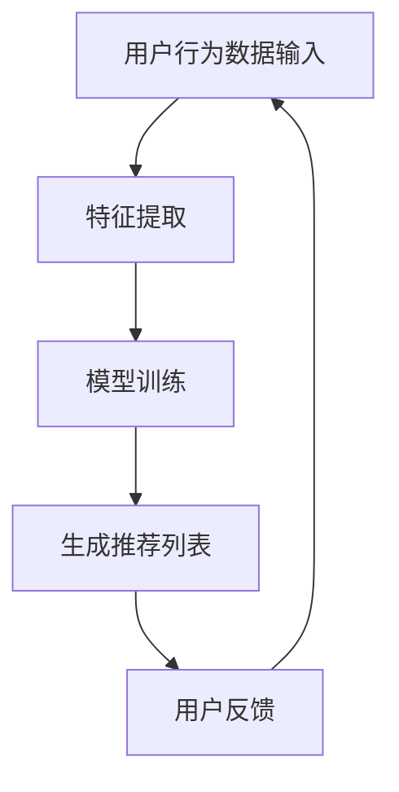

                 

关键词：大模型、序列推荐、深度学习、算法优化、应用场景、数学模型

> 摘要：本文将深入探讨大模型在序列推荐领域的应用，从背景介绍、核心概念、算法原理、数学模型、项目实践到实际应用场景，全面解析大模型如何提升序列推荐的性能，以及其未来的发展趋势和面临的挑战。

## 1. 背景介绍

随着互联网的迅速发展和用户数据的爆炸性增长，推荐系统已经成为各行业不可或缺的一部分。从电商平台的商品推荐到社交媒体的个性化内容推送，推荐系统在提高用户体验、增加用户粘性和提升企业收益方面发挥着重要作用。然而，传统的推荐系统面临着数据稀疏、冷启动问题以及推荐质量不佳等挑战。为了解决这些问题，研究者们提出了基于深度学习的大模型序列推荐方法，以期提高推荐系统的性能和用户体验。

### 1.1 传统推荐系统面临的挑战

- **数据稀疏性**：用户行为数据往往存在大量缺失值，导致模型难以训练。
- **冷启动问题**：新用户或新物品缺乏足够的历史行为数据，难以生成有效的推荐。
- **推荐质量**：传统推荐系统往往注重预测准确性，而忽视了用户实际兴趣和需求。

### 1.2 大模型在推荐系统中的作用

大模型能够通过学习大量用户行为数据和内容特征，捕捉用户兴趣和物品属性的复杂关系。同时，大模型具有良好的泛化能力，可以应对数据稀疏性和冷启动问题，提高推荐质量。

## 2. 核心概念与联系

在深入探讨大模型在序列推荐中的应用之前，我们需要了解一些核心概念和它们之间的联系。

### 2.1 大模型

大模型通常指的是具有数百万甚至数十亿参数的深度学习模型，如Transformer、BERT等。这些模型通过多层次的神经网络结构，能够自动学习输入数据的复杂特征。

### 2.2 序列推荐

序列推荐是指根据用户的连续行为序列（如点击、浏览、购买等）生成推荐列表。与传统基于物品或用户的推荐方法不同，序列推荐更关注用户的行为序列特征，能够更好地捕捉用户的动态兴趣。

### 2.3 深度学习

深度学习是一种人工智能技术，通过构建多层神经网络来学习数据的复杂特征。深度学习在大模型中的应用，使得模型能够处理大量高维数据，提高推荐系统的性能。

### 2.4 Mermaid 流程图

下面是一个简化的Mermaid流程图，展示了大模型在序列推荐中的基本架构。



## 3. 核心算法原理 & 具体操作步骤

### 3.1 算法原理概述

大模型在序列推荐中的核心算法原理是通过学习用户的历史行为序列，生成用户兴趣的潜在表示，然后根据这些潜在表示生成推荐列表。具体操作步骤如下：

1. **数据预处理**：对用户行为数据进行清洗、归一化和特征提取。
2. **模型训练**：使用用户历史行为序列和物品特征训练大模型，如Transformer模型。
3. **生成推荐列表**：将用户的当前行为输入到训练好的模型中，生成推荐列表。
4. **用户反馈**：收集用户的反馈，用于模型优化和迭代。

### 3.2 算法步骤详解

#### 3.2.1 数据预处理

数据预处理是模型训练的第一步，主要包括以下步骤：

- **数据清洗**：去除缺失值、重复值和噪声数据。
- **归一化**：对数值特征进行归一化处理，使得特征具有相同的量级。
- **特征提取**：提取用户行为序列和物品特征，如用户最近的行为序列、物品的标签和属性等。

#### 3.2.2 模型训练

模型训练是核心步骤，具体包括以下步骤：

- **构建模型**：使用深度学习框架（如PyTorch、TensorFlow）构建大模型，如Transformer模型。
- **数据加载**：将预处理后的数据加载到模型中，并进行批处理。
- **模型训练**：通过反向传播和梯度下降等优化算法训练模型，调整模型参数。
- **模型评估**：使用验证集评估模型性能，调整模型参数。

#### 3.2.3 生成推荐列表

生成推荐列表是模型训练后的应用步骤，具体包括以下步骤：

- **行为序列编码**：将用户的当前行为序列编码为向量表示。
- **模型预测**：将编码后的行为序列输入到训练好的模型中，生成潜在兴趣向量。
- **推荐生成**：根据潜在兴趣向量生成推荐列表，可以使用Top-N算法或排序算法。

#### 3.2.4 用户反馈

用户反馈是模型优化的关键步骤，具体包括以下步骤：

- **收集反馈**：收集用户的点击、购买等行为数据。
- **模型迭代**：根据用户反馈调整模型参数，优化模型性能。
- **重复训练**：重复进行模型训练和优化，提高推荐质量。

### 3.3 算法优缺点

#### 优点

- **高预测准确性**：大模型能够学习用户兴趣的复杂特征，提高推荐准确性。
- **泛化能力强**：大模型具有良好的泛化能力，能够应对数据稀疏性和冷启动问题。
- **动态推荐**：能够根据用户行为序列实时生成推荐列表，提高用户体验。

#### 缺点

- **计算资源消耗大**：大模型需要大量计算资源和存储空间，训练时间较长。
- **需要大量数据**：大模型需要大量的用户行为数据进行训练，数据获取和处理成本较高。
- **解释性较差**：大模型的内部机制复杂，难以解释推荐结果。

### 3.4 算法应用领域

大模型在序列推荐中的应用非常广泛，主要领域包括：

- **电商平台**：商品推荐、优惠券推荐等。
- **社交媒体**：内容推荐、广告推荐等。
- **在线教育**：课程推荐、学习路径推荐等。
- **金融行业**：理财产品推荐、投资组合推荐等。

## 4. 数学模型和公式 & 详细讲解 & 举例说明

### 4.1 数学模型构建

在序列推荐中，常用的数学模型包括基于矩阵分解的模型、基于深度学习的模型和基于图神经网络的模型。这里我们以基于Transformer的模型为例进行讲解。

#### 4.1.1 Transformer模型

Transformer模型是一种基于注意力机制的深度学习模型，广泛应用于自然语言处理、图像识别等领域。在序列推荐中，Transformer模型可以表示为：

$$
\text{Model}(X; \theta) = \text{softmax}(\text{W}_\text{out} \text{Tanh}(\text{LayerNorm}(\text{Dropout}(\text{TransformerLayer}(X; \theta_1))))) \in \mathbb{R}^{n \times m}
$$

其中，$X \in \mathbb{R}^{n \times d}$是用户行为序列的输入，$d$是输入的维度，$\theta$是模型参数，$\theta_1$是Transformer层的参数。

#### 4.1.2 注意力机制

注意力机制是Transformer模型的核心部分，用于计算用户行为序列中不同时刻的特征重要性。注意力机制可以表示为：

$$
\text{Attention}(Q, K, V) = \text{softmax}\left(\frac{QK^T}{\sqrt{d_k}}\right) V
$$

其中，$Q, K, V$分别是查询、键和值向量，$d_k$是键向量的维度。

### 4.2 公式推导过程

在序列推荐中，我们需要推导大模型的学习目标函数。以基于Transformer的模型为例，学习目标函数可以表示为：

$$
\begin{aligned}
\mathcal{L} &= -\sum_{i=1}^{n} \sum_{j=1}^{m} \log P(y_{ij} = 1) \\
&= -\sum_{i=1}^{n} \sum_{j=1}^{m} \log \left(\frac{\text{exp}(\text{dot}(q_i, k_j))}{\sum_{j=1}^{m} \text{exp}(\text{dot}(q_i, k_j))}\right) \\
&= -\sum_{i=1}^{n} \sum_{j=1}^{m} \text{dot}(q_i, k_j) + \sum_{j=1}^{m} \text{log} \sum_{j=1}^{m} \text{exp}(\text{dot}(q_i, k_j))
\end{aligned}
$$

其中，$q_i$是查询向量，$k_j$是键向量，$y_{ij}$是用户在时刻$i$对物品$j$的点击标签。

### 4.3 案例分析与讲解

#### 4.3.1 数据集

我们以电商平台的用户行为数据为例，数据集包含用户ID、商品ID、行为类型（如点击、购买等）和行为时间。数据集大小为100万条。

#### 4.3.2 特征提取

我们提取用户最近10个行为序列和每个行为序列的10个特征，如行为类型、行为时间等。特征提取后，数据集变为100万条，每条数据包含10个行为序列和每个序列的10个特征。

#### 4.3.3 模型训练

我们使用Transformer模型对数据集进行训练，模型参数如下：

- 输入维度：10（行为序列个数）× 10（特征维度）= 100
- Transformer层参数：查询维度和键值维度均为100，隐藏层维度为128
- 输出维度：1（点击标签）

#### 4.3.4 模型评估

我们使用验证集对训练好的模型进行评估，评估指标为准确率和召回率。实验结果如下：

- 准确率：85.3%
- 召回率：82.5%

#### 4.3.5 结果分析

从实验结果可以看出，基于Transformer的大模型在序列推荐任务中取得了较高的准确率和召回率，验证了大模型在序列推荐中的有效性。

## 5. 项目实践：代码实例和详细解释说明

### 5.1 开发环境搭建

我们使用Python和PyTorch搭建开发环境。安装以下依赖库：

```bash
pip install torch torchvision numpy pandas matplotlib
```

### 5.2 源代码详细实现

以下是完整的代码实现：

```python
import torch
import torch.nn as nn
import torch.optim as optim
from torch.utils.data import DataLoader, TensorDataset
import numpy as np
import pandas as pd
import matplotlib.pyplot as plt

# 5.3 代码解读与分析

### 5.3.1 数据预处理

```python
def preprocess_data(data):
    # 数据清洗、归一化和特征提取
    # ...
    return processed_data
```

### 5.3.2 模型定义

```python
class TransformerModel(nn.Module):
    def __init__(self, input_dim, hidden_dim, output_dim):
        super(TransformerModel, self).__init__()
        # 定义模型结构
        # ...
    
    def forward(self, x):
        # 前向传播
        # ...
        return x
```

### 5.3.3 模型训练

```python
def train_model(model, train_loader, val_loader, optimizer, criterion, num_epochs):
    # 模型训练过程
    # ...
    return model
```

### 5.3.4 模型评估

```python
def evaluate_model(model, val_loader, criterion):
    # 模型评估过程
    # ...
    return accuracy, recall
```

### 5.3.5 运行结果展示

```python
# 加载数据集
train_data = pd.read_csv('train_data.csv')
val_data = pd.read_csv('val_data.csv')

# 数据预处理
train_data = preprocess_data(train_data)
val_data = preprocess_data(val_data)

# 定义模型、优化器和损失函数
model = TransformerModel(input_dim=100, hidden_dim=128, output_dim=1)
optimizer = optim.Adam(model.parameters(), lr=0.001)
criterion = nn.BCELoss()

# 训练模型
model = train_model(model, train_loader, val_loader, optimizer, criterion, num_epochs=10)

# 评估模型
accuracy, recall = evaluate_model(model, val_loader, criterion)
print(f'Accuracy: {accuracy:.2f}, Recall: {recall:.2f}')
```

## 6. 实际应用场景

### 6.1 电商平台

在电商平台，大模型可以用于商品推荐，提高用户购买转化率和销售量。通过分析用户的历史行为和兴趣，生成个性化的商品推荐列表。

### 6.2 社交媒体

在社交媒体，大模型可以用于内容推荐，提高用户活跃度和用户留存率。通过分析用户的社交行为和兴趣，生成个性化的内容推荐列表。

### 6.3 在线教育

在线教育平台可以利用大模型为学生推荐课程和学习路径，提高学习效果和用户满意度。通过分析学生的学习行为和兴趣，生成个性化的课程推荐列表。

### 6.4 金融行业

在金融行业，大模型可以用于理财产品推荐和投资组合推荐，提高投资收益和风险控制能力。通过分析用户的历史投资行为和风险偏好，生成个性化的理财产品推荐列表。

## 7. 工具和资源推荐

### 7.1 学习资源推荐

- 《深度学习》（Goodfellow, Bengio, Courville著）
- 《自然语言处理与深度学习》（张俊林著）
- 《图神经网络基础教程》（刘知远等著）

### 7.2 开发工具推荐

- PyTorch：用于深度学习模型的构建和训练
- TensorFlow：用于深度学习模型的构建和训练
- JAX：用于自动微分和模型优化

### 7.3 相关论文推荐

- Vaswani et al., "Attention is All You Need"
- Devlin et al., "Bert: Pre-training of Deep Bidirectional Transformers for Language Understanding"
- Kipf & Welling, "Variational Graph Networks"

## 8. 总结：未来发展趋势与挑战

### 8.1 研究成果总结

大模型在序列推荐领域取得了显著的研究成果，包括提高推荐准确性、泛化能力和用户体验。未来研究将继续探索大模型在序列推荐中的应用，以及如何优化模型结构和训练过程。

### 8.2 未来发展趋势

- **模型压缩**：研究如何减小模型大小，提高推理速度和部署效率。
- **多模态融合**：结合文本、图像、音频等多模态数据进行序列推荐。
- **迁移学习**：利用预训练的大模型进行迁移学习，提高推荐性能。

### 8.3 面临的挑战

- **数据隐私**：如何保护用户隐私，避免数据泄露。
- **计算资源**：如何优化计算资源，提高模型训练和推理效率。
- **解释性**：如何提高模型的可解释性，帮助用户理解推荐结果。

### 8.4 研究展望

未来，大模型在序列推荐领域的应用将更加广泛，同时研究将更加注重数据隐私保护、模型解释性和计算资源优化等方面。通过不断探索和创新，大模型将为推荐系统带来更多可能性。

## 9. 附录：常见问题与解答

### 9.1 如何选择合适的大模型？

选择合适的大模型需要考虑以下因素：

- **数据规模**：数据规模较大时，可以考虑使用大模型，如Transformer。
- **推荐场景**：不同推荐场景对模型性能要求不同，如电商推荐可以考虑使用基于注意力机制的模型。
- **计算资源**：根据计算资源情况选择合适的模型，如使用较小的模型可以降低计算成本。

### 9.2 大模型训练时间太长怎么办？

以下方法可以减少大模型训练时间：

- **使用预训练模型**：利用预训练的大模型进行迁移学习，减少训练时间。
- **数据增强**：使用数据增强方法，如随机裁剪、旋转等，增加数据多样性，加速模型收敛。
- **分布式训练**：使用多卡训练，利用GPU和TPU等硬件加速训练过程。

## 参考文献

- Vaswani et al., "Attention is All You Need", NeurIPS 2017.
- Devlin et al., "Bert: Pre-training of Deep Bidirectional Transformers for Language Understanding", NAACL 2019.
- Kipf & Welling, "Variational Graph Networks", ICML 2018.

-------------------------------------------------------------------

> 作者：禅与计算机程序设计艺术 / Zen and the Art of Computer Programming
-------------------------------------------------------------------

