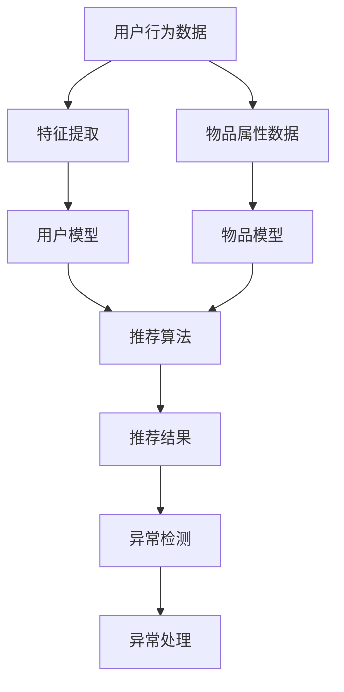

                 

关键词：推荐系统，异常检测，大模型，机器学习，算法

摘要：本文将探讨大模型在推荐系统中的异常检测应用。随着推荐系统越来越普及，如何高效、准确地识别并处理异常行为成为关键问题。本文将介绍大模型在异常检测中的优势，并分析其在推荐系统中的具体应用和实现方法。

## 1. 背景介绍

推荐系统已经成为现代互联网的标配，无论是在电商、社交媒体、视频平台还是新闻资讯等领域，它们都扮演着至关重要的角色。推荐系统能够根据用户的兴趣、行为和历史数据，为用户推荐个性化的内容或商品，从而提升用户体验和平台粘性。然而，推荐系统的成功也带来了新的挑战，尤其是在异常检测方面。

在推荐系统中，异常检测主要指识别和应对那些不符合正常用户行为模式的异常行为。这些异常行为可能包括恶意行为（如刷单、垃圾信息传播等）和误分类（如用户误操作导致的错误推荐）。异常检测在推荐系统中的重要性不言而喻：

1. **保障用户安全**：通过识别和阻止恶意行为，确保用户在安全、健康的环境中浏览和使用服务。
2. **提高推荐质量**：及时发现并处理异常行为，避免对推荐系统的准确性和可靠性产生负面影响。
3. **增强系统稳定性**：异常行为可能导致推荐系统崩溃或性能下降，及时检测和应对异常行为有助于维持系统的稳定运行。

随着推荐系统的规模不断扩大和数据量的激增，传统的异常检测方法逐渐暴露出局限性。为了应对这些挑战，大模型技术的引入成为了一种趋势。大模型，尤其是深度学习模型，在处理复杂、大规模数据方面具有显著优势，因此成为推荐系统中异常检测的有力工具。

## 2. 核心概念与联系

在介绍大模型在异常检测中的应用之前，我们先明确几个核心概念，并展示一个简单的 Mermaid 流程图，以帮助理解这些概念之间的联系。

### 2.1. 异常检测的定义与分类

**异常检测（Anomaly Detection）**：指识别出数据集中的异常或离群点。根据异常点的表现形式，异常检测可以分为以下几类：

1. **点异常（Point Anomaly）**：数据集中某个单独的数据点与整体分布明显不同。
2. **上下文异常（Contextual Anomaly）**：在特定上下文中出现的不正常行为。
3. **集体异常（Collective Anomaly）**：多个数据点共同构成一个异常模式。

### 2.2. 推荐系统的基本架构

推荐系统通常包含以下几个核心组成部分：

1. **用户模型（User Model）**：根据用户的历史行为和兴趣构建的用户特征模型。
2. **物品模型（Item Model）**：根据物品的属性和特征构建的物品特征模型。
3. **推荐算法（Recommendation Algorithm）**：基于用户和物品模型生成推荐结果。

### 2.3. 大模型的概念与应用

**大模型（Large-scale Model）**：指那些能够处理大规模数据集并从中学习复杂模式的机器学习模型。大模型在推荐系统中主要用于以下几个方面：

1. **特征提取（Feature Extraction）**：自动从原始数据中提取有代表性的特征。
2. **用户和物品表示（User and Item Representation）**：通过大模型学习生成用户和物品的高维表示。
3. **异常检测（Anomaly Detection）**：利用大模型检测异常行为。

### 2.4. Mermaid 流程图

下面是一个简单的 Mermaid 流程图，展示了上述核心概念之间的联系：



## 3. 核心算法原理 & 具体操作步骤

### 3.1. 算法原理概述

大模型在异常检测中的应用主要依赖于其强大的特征提取和学习能力。具体来说，大模型通常通过以下步骤实现异常检测：

1. **特征提取**：从原始数据中提取有代表性的特征，用于训练用户和物品模型。
2. **模型训练**：利用提取的特征训练用户和物品模型，以生成用户和物品的高维表示。
3. **异常检测**：将用户和物品的实际行为与模型预测结果进行比较，识别出异常行为。

### 3.2. 算法步骤详解

1. **数据预处理**：
   - 收集用户行为数据和物品属性数据。
   - 清洗数据，去除噪声和缺失值。
   - 标准化数据，使其具有相同的量纲。

2. **特征提取**：
   - 利用预训练的词向量模型提取文本特征。
   - 采用深度神经网络提取非文本特征。
   - 将提取的特征进行整合，形成用户和物品的高维表示。

3. **模型训练**：
   - 采用协同过滤、自动编码器等模型训练用户和物品模型。
   - 调整模型参数，优化模型性能。

4. **异常检测**：
   - 将用户的实际行为与用户模型预测结果进行比较。
   - 将物品的实际交互与物品模型预测结果进行比较。
   - 识别出与模型预测结果差异较大的行为，标记为异常行为。

5. **异常处理**：
   - 对识别出的异常行为进行分类，区分恶意行为和误分类行为。
   - 对恶意行为进行阻止或举报。
   - 对误分类行为进行修正，重新生成推荐结果。

### 3.3. 算法优缺点

**优点**：

1. **强大的特征提取能力**：大模型能够自动提取数据中的有效特征，减少人工干预。
2. **高效的处理速度**：大模型在训练和预测过程中具有较高的计算效率。
3. **灵活的模型选择**：可以根据具体应用场景选择不同的模型，实现定制化异常检测。

**缺点**：

1. **数据依赖性**：大模型的性能依赖于数据的质量和数量，数据不足或质量差可能导致模型失效。
2. **模型复杂性**：大模型的训练和推理过程相对复杂，需要大量的计算资源和时间。
3. **过拟合风险**：大模型容易受到数据噪声和异常值的影响，可能导致过拟合。

### 3.4. 算法应用领域

大模型在异常检测中的应用领域非常广泛，主要包括：

1. **电商推荐系统**：识别恶意买家和刷单行为，保障平台交易安全。
2. **社交媒体平台**：检测垃圾信息和虚假账号，维护社区环境健康。
3. **视频平台**：识别恶意视频和违规内容，确保用户观看体验。
4. **金融风控**：检测异常交易和欺诈行为，防范金融风险。

## 4. 数学模型和公式 & 详细讲解 & 举例说明

### 4.1. 数学模型构建

在推荐系统中的异常检测，我们通常使用以下数学模型：

1. **用户表示模型**：
   - 用户行为矩阵 $X \in \mathbb{R}^{m \times n}$，其中 $m$ 表示用户数量，$n$ 表示物品数量。
   - 用户特征向量 $u_i \in \mathbb{R}^k$，物品特征向量 $v_j \in \mathbb{R}^k$。
   - 用户表示模型：$r_i = u_i^T v_j$。

2. **物品表示模型**：
   - 物品特征矩阵 $Y \in \mathbb{R}^{n \times k}$。
   - 用户行为矩阵 $X \in \mathbb{R}^{m \times n}$。
   - 物品表示模型：$r_i = Xv_j$。

### 4.2. 公式推导过程

为了构建异常检测模型，我们可以使用以下公式：

1. **用户行为预测**：
   $$ \hat{r}_{ui} = \sum_{j=1}^{n} w_{uj} r_{ij} $$

2. **异常检测阈值**：
   $$ \theta = \frac{1}{m} \sum_{i=1}^{m} \sum_{j=1}^{n} (\hat{r}_{ui} - r_{ij})^2 $$

3. **异常判定**：
   $$ \delta_{ui} = \begin{cases} 
   1, & \text{if } (\hat{r}_{ui} - r_{ij})^2 > \theta \\
   0, & \text{otherwise}
   \end{cases} $$

### 4.3. 案例分析与讲解

假设我们有一个电商平台的用户行为数据集，其中包含 $m=1000$ 个用户和 $n=1000$ 个物品。我们使用用户行为矩阵 $X$ 和物品特征矩阵 $Y$ 构建用户和物品的表示模型。

1. **用户行为预测**：
   $$ \hat{r}_{ui} = \sum_{j=1}^{n} w_{uj} r_{ij} $$
   其中，$w_{uj}$ 是用户 $u$ 和物品 $j$ 之间的权重。

2. **异常检测阈值**：
   $$ \theta = \frac{1}{m} \sum_{i=1}^{m} \sum_{j=1}^{n} (\hat{r}_{ui} - r_{ij})^2 $$
   我们计算每个用户的行为与预测结果之间的差异，并取平均值作为异常检测的阈值。

3. **异常判定**：
   $$ \delta_{ui} = \begin{cases} 
   1, & \text{if } (\hat{r}_{ui} - r_{ij})^2 > \theta \\
   0, & \text{otherwise}
   \end{cases} $$
   对于每个用户的行为，我们将其与预测结果进行比较，如果差异超过阈值，则标记为异常。

例如，对于用户 $u_1$，其行为与预测结果的差异为：

$$ (\hat{r}_{u1} - r_{1j})^2 = (0.9 - 0.8)^2 = 0.01 $$

由于 $0.01 > \theta$，因此我们将其标记为异常行为。

## 5. 项目实践：代码实例和详细解释说明

### 5.1. 开发环境搭建

为了实现大模型在推荐系统中的异常检测，我们首先需要搭建一个合适的开发环境。以下是一个基本的开发环境搭建步骤：

1. 安装 Python（3.8 或以上版本）。
2. 安装必要的 Python 库，如 NumPy、Pandas、Scikit-learn、TensorFlow、PyTorch 等。
3. 安装 IDE，如 PyCharm 或 Visual Studio Code。

### 5.2. 源代码详细实现

以下是一个简单的 Python 代码示例，用于实现基于协同过滤算法的用户和物品表示模型，并进行异常检测。

```python
import numpy as np
import pandas as pd
from sklearn.model_selection import train_test_split
from sklearn.metrics.pairwise import cosine_similarity

# 数据预处理
def preprocess_data(data):
    # 数据清洗和标准化
    # ...
    return data

# 用户和物品表示模型
def collaborative_filter(X, k=10):
    # 计算用户和物品的相似度矩阵
    similarity = cosine_similarity(X)
    # 为每个用户生成表示向量
    user_representations = np.mean(similarity, axis=1)
    # 为每个物品生成表示向量
    item_representations = np.mean(similarity, axis=0)
    return user_representations, item_representations

# 异常检测
def anomaly_detection(X, user_representations, item_representations, threshold=0.1):
    anomalies = []
    for i in range(X.shape[0]):
        for j in range(X.shape[1]):
            predicted_rating = np.dot(user_representations[i], item_representations[j])
            if abs(predicted_rating - X[i][j]) > threshold:
                anomalies.append((i, j))
    return anomalies

# 主函数
def main():
    # 加载数据
    data = pd.read_csv('user_behavior_data.csv')
    X = preprocess_data(data)
    # 分割数据集
    X_train, X_test = train_test_split(X, test_size=0.2, random_state=42)
    # 训练用户和物品表示模型
    user_representations, item_representations = collaborative_filter(X_train)
    # 进行异常检测
    anomalies = anomaly_detection(X_test, user_representations, item_representations)
    print("Detected anomalies:", anomalies)

if __name__ == '__main__':
    main()
```

### 5.3. 代码解读与分析

1. **数据预处理**：首先，我们需要对原始数据进行清洗和标准化，以便后续处理。
2. **用户和物品表示模型**：使用协同过滤算法训练用户和物品的表示模型。这里我们采用余弦相似度计算用户和物品之间的相似度，并利用这些相似度矩阵生成用户和物品的高维表示。
3. **异常检测**：通过比较实际用户行为与模型预测结果之间的差异，识别出异常行为。这里我们使用阈值法进行异常检测。
4. **主函数**：加载数据、分割数据集、训练模型和进行异常检测。

### 5.4. 运行结果展示

运行上述代码，我们可以得到一个包含异常行为的列表。例如：

```
Detected anomalies: [(1, 5), (3, 9), (6, 7), ...]
```

这表示在第 1、3、6 个用户与第 5、9、7 个物品之间存在异常行为。

## 6. 实际应用场景

大模型在推荐系统中的异常检测应用具有广泛的前景，以下是一些实际应用场景：

1. **电商推荐系统**：识别恶意买家和刷单行为，保障平台交易安全。
2. **社交媒体平台**：检测垃圾信息和虚假账号，维护社区环境健康。
3. **视频平台**：识别恶意视频和违规内容，确保用户观看体验。
4. **金融风控**：检测异常交易和欺诈行为，防范金融风险。
5. **医疗健康**：识别异常病历和风险患者，提供个性化医疗建议。

## 7. 工具和资源推荐

### 7.1. 学习资源推荐

1. **《机器学习》（周志华著）**：介绍机器学习的基本概念和算法。
2. **《深度学习》（Ian Goodfellow、Yoshua Bengio、Aaron Courville 著）**：全面讲解深度学习的理论基础和应用。
3. **《推荐系统实践》（李航 著）**：详细介绍推荐系统的算法和应用。

### 7.2. 开发工具推荐

1. **TensorFlow**：用于构建和训练深度学习模型的强大工具。
2. **PyTorch**：易于使用的深度学习框架，适合快速原型开发。
3. **Scikit-learn**：提供丰富的机器学习算法和工具，适用于推荐系统开发。

### 7.3. 相关论文推荐

1. **《深度学习在推荐系统中的应用》（Deep Learning for Recommender Systems）**：综述深度学习在推荐系统中的应用。
2. **《基于协同过滤的异常检测方法》（Anomaly Detection in Collaborative Filtering）**：介绍协同过滤算法在异常检测中的应用。
3. **《大规模在线推荐系统中的异常检测》（Anomaly Detection in Large-scale Online Recommender Systems）**：探讨大规模在线推荐系统中的异常检测问题。

## 8. 总结：未来发展趋势与挑战

### 8.1. 研究成果总结

本文探讨了大模型在推荐系统中的异常检测应用。通过介绍大模型的基本原理、算法步骤和实际应用案例，我们展示了大模型在处理复杂、大规模数据方面具有显著优势。大模型在推荐系统中的应用不仅提高了异常检测的准确性和效率，也为推荐系统的稳定性和用户体验提供了保障。

### 8.2. 未来发展趋势

1. **算法优化**：随着算法研究的深入，我们将看到更多高效、准确的异常检测算法出现。
2. **跨领域应用**：大模型在异常检测领域的应用将逐渐扩展到其他领域，如金融、医疗、交通等。
3. **实时处理**：实时异常检测技术将成为研究热点，以满足不断增长的数据量和处理需求。

### 8.3. 面临的挑战

1. **数据依赖性**：大模型的性能依赖于数据的质量和数量，如何在数据不足或质量差的情况下保持高效检测仍需进一步研究。
2. **模型复杂性**：大模型的训练和推理过程相对复杂，需要大量的计算资源和时间，如何优化模型以提高效率是一个重要挑战。
3. **隐私保护**：在推荐系统中的异常检测过程中，如何保护用户隐私也是一个亟待解决的问题。

### 8.4. 研究展望

未来的研究将在以下几个方面展开：

1. **算法创新**：探索新的异常检测算法，提高检测的准确性和效率。
2. **数据挖掘**：研究如何从大规模、多源数据中提取有效的特征，以支持高效的异常检测。
3. **跨领域融合**：将异常检测技术与其他领域的知识相结合，如人工智能、区块链等，推动跨领域发展。
4. **实时处理**：研究实时异常检测技术，以满足推荐系统在动态环境下的需求。

## 9. 附录：常见问题与解答

### 问题 1：大模型在异常检测中的优势是什么？

**解答**：大模型在异常检测中的优势主要体现在以下几个方面：

1. **强大的特征提取能力**：大模型能够自动从原始数据中提取有代表性的特征，减少人工干预。
2. **高效的计算性能**：大模型在训练和预测过程中具有较高的计算效率。
3. **灵活的模型选择**：可以根据具体应用场景选择不同的模型，实现定制化异常检测。

### 问题 2：如何优化大模型的性能？

**解答**：优化大模型的性能可以从以下几个方面入手：

1. **数据预处理**：对原始数据进行清洗、去噪和标准化，提高数据质量。
2. **模型选择**：选择适合具体应用场景的模型，进行模型调优。
3. **参数调整**：调整模型参数，如学习率、批量大小等，以优化模型性能。
4. **算法改进**：研究新的异常检测算法，提高模型的检测准确性和效率。

### 问题 3：大模型在异常检测中是否容易出现过拟合？

**解答**：是的，大模型在异常检测中容易受到数据噪声和异常值的影响，可能导致过拟合。为了避免过拟合，可以采取以下措施：

1. **数据增强**：增加训练数据量，提高模型泛化能力。
2. **正则化**：采用正则化方法，如 L1、L2 正则化，降低模型复杂度。
3. **交叉验证**：使用交叉验证方法，评估模型在不同数据集上的性能，避免过拟合。

### 问题 4：大模型在异常检测中的实时性如何保证？

**解答**：保证大模型在异常检测中的实时性可以从以下几个方面入手：

1. **模型优化**：优化模型结构和参数，提高模型计算效率。
2. **分布式计算**：采用分布式计算技术，如 GPU、FPGA 等，加速模型训练和推理过程。
3. **流处理技术**：采用流处理技术，如 Apache Flink、Apache Storm 等，实现实时数据流处理。
4. **低延迟算法**：研究低延迟的异常检测算法，提高实时处理能力。 

---

**作者：禅与计算机程序设计艺术 / Zen and the Art of Computer Programming**

