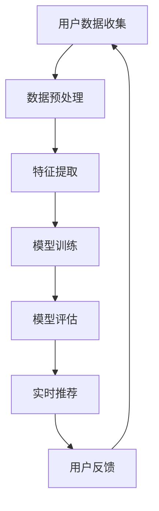

                 

关键词：大模型、推荐系统、人工智能、机器学习、数据挖掘、未来趋势

> 摘要：本文将探讨大模型在推荐系统中的未来发展。随着人工智能技术的迅速发展，大模型在推荐系统中的应用越来越广泛，其在个性化推荐、内容分发和用户互动等方面发挥着重要作用。本文将从核心概念、算法原理、数学模型、实际应用和实践案例等多个角度，深入分析大模型在推荐系统中的发展趋势与挑战，并提出未来的研究展望。

## 1. 背景介绍

推荐系统是一种信息过滤和预测系统，旨在根据用户的历史行为和偏好，向用户提供个性化的推荐。推荐系统在电子商务、社交媒体、在线视频、新闻资讯等多个领域具有广泛的应用，能够有效提升用户体验、增加用户粘性和提升业务收入。

近年来，人工智能技术的迅猛发展，特别是深度学习、大数据和云计算等技术的突破，使得大模型在推荐系统中的应用成为可能。大模型通常是指具有数十亿甚至数千亿参数的神经网络模型，其可以通过学习海量数据来发现复杂的模式和关联，从而实现更高精度的推荐。

### 1.1 大模型的优势

大模型具有以下几个显著优势：

1. **强大的表达能力**：大模型可以捕捉到更复杂的数据特征，从而更准确地预测用户的偏好。
2. **自动特征提取**：大模型通过多层神经网络结构，可以自动提取数据中的高阶特征，减少手动特征工程的工作量。
3. **大规模数据处理能力**：大模型可以处理海量数据，适应不断变化的用户行为和偏好。

### 1.2 推荐系统的分类

推荐系统主要分为以下几类：

1. **基于内容的推荐（Content-Based Filtering）**：根据用户的历史行为和偏好，推荐具有相似内容的物品。
2. **协同过滤（Collaborative Filtering）**：通过分析用户之间的相似性，推荐用户可能喜欢的物品。
3. **混合推荐（Hybrid Recommender Systems）**：结合多种推荐策略，以提升推荐效果。

## 2. 核心概念与联系

为了深入理解大模型在推荐系统中的应用，我们需要先了解以下几个核心概念及其相互联系。

### 2.1 深度学习与神经网络

深度学习是一种机器学习方法，通过多层神经网络来模拟人类大脑的学习过程。神经网络由多个神经元（或称为节点）组成，每个神经元接收多个输入并产生一个输出。

### 2.2 大模型架构

大模型通常采用深度神经网络架构，如卷积神经网络（CNN）、循环神经网络（RNN）和Transformer等。这些架构具有强大的表达能力，能够处理高维数据和复杂数据模式。

### 2.3 自适应推荐系统

自适应推荐系统可以根据用户的实时行为和反馈，动态调整推荐策略，以提供更个性化的服务。

### 2.4 Mermaid 流程图

以下是一个简化的Mermaid流程图，展示了大模型在推荐系统中的基本架构和流程：



### 2.5 推荐系统的流程

推荐系统的基本流程如下：

1. **用户数据收集**：收集用户的历史行为数据，如浏览记录、购买记录等。
2. **数据预处理**：清洗和转换数据，为后续的特征提取和模型训练做准备。
3. **特征提取**：通过特征提取技术，将原始数据转换为模型可处理的特征向量。
4. **模型训练**：使用深度学习算法，训练大模型以预测用户的偏好。
5. **模型评估**：评估模型的预测性能，调整模型参数以优化推荐效果。
6. **实时推荐**：根据用户的实时行为，生成个性化推荐。
7. **用户反馈**：收集用户对推荐的反馈，用于模型优化和推荐策略调整。

## 3. 核心算法原理 & 具体操作步骤

### 3.1 算法原理概述

大模型在推荐系统中的应用主要基于深度学习和机器学习技术。以下是一些核心算法原理：

1. **深度学习**：通过多层神经网络结构，自动提取高阶特征，实现复杂模式的预测。
2. **协同过滤**：通过分析用户之间的相似性，推荐用户可能喜欢的物品。
3. **基于内容的推荐**：根据用户的历史行为和偏好，推荐具有相似内容的物品。
4. **自适应推荐**：根据用户的实时行为和反馈，动态调整推荐策略。

### 3.2 算法步骤详解

以下是推荐系统的基本算法步骤：

1. **用户数据收集**：从多个渠道收集用户的历史行为数据，如浏览记录、购买记录等。
2. **数据预处理**：对数据进行清洗和转换，包括缺失值填充、异常值处理、数据标准化等。
3. **特征提取**：使用特征提取技术，将原始数据转换为模型可处理的特征向量。常用的特征提取方法包括词袋模型、TF-IDF、单词嵌入等。
4. **模型选择与训练**：选择合适的深度学习模型，如卷积神经网络（CNN）、循环神经网络（RNN）或Transformer等。使用训练数据训练模型，调整模型参数以优化推荐效果。
5. **模型评估**：使用验证数据集评估模型的预测性能，包括准确率、召回率、F1分数等指标。根据评估结果调整模型参数，以提升推荐效果。
6. **实时推荐**：根据用户的实时行为，生成个性化推荐。通常使用在线学习技术，实时更新模型参数。
7. **用户反馈**：收集用户对推荐的反馈，用于模型优化和推荐策略调整。

### 3.3 算法优缺点

大模型在推荐系统中的应用具有以下优缺点：

**优点**：

1. **强大的表达能力**：能够捕捉到更复杂的数据特征，实现更精确的推荐。
2. **自动特征提取**：减少手动特征工程的工作量，提高开发效率。
3. **大规模数据处理能力**：能够处理海量数据，适应不断变化的用户行为和偏好。

**缺点**：

1. **计算资源消耗大**：大模型通常需要大量的计算资源和存储空间。
2. **模型解释性差**：深度学习模型的内部工作机制复杂，难以解释。
3. **数据隐私问题**：用户数据的安全性需要得到保障，避免隐私泄露。

### 3.4 算法应用领域

大模型在推荐系统中的应用非常广泛，主要包括以下领域：

1. **电子商务**：为用户提供个性化的商品推荐，提升用户购买意愿和满意度。
2. **在线视频**：为用户提供个性化的视频推荐，提升用户观看时长和粘性。
3. **新闻资讯**：为用户提供个性化的新闻推荐，提升用户阅读量和活跃度。
4. **社交媒体**：为用户提供个性化的人脉推荐和内容推荐，提升用户社交体验。

## 4. 数学模型和公式 & 详细讲解 & 举例说明

### 4.1 数学模型构建

在推荐系统中，大模型的数学模型通常包括以下几个部分：

1. **输入层**：接收用户的历史行为数据和其他特征信息。
2. **隐藏层**：通过多层神经网络结构，提取高阶特征。
3. **输出层**：生成推荐结果，如物品评分或推荐列表。

以下是一个简化的数学模型：

$$
\text{PredictedRating}(i, j) = f(\text{UserFeatures}(i), \text{ItemFeatures}(j), \text{ModelParameters})
$$

其中，$i$和$j$分别表示用户和物品的索引，$f$表示预测函数，$\text{UserFeatures}(i)$和$\text{ItemFeatures}(j)$分别表示用户和物品的特征向量，$\text{ModelParameters}$表示模型的参数。

### 4.2 公式推导过程

以下是一个简化的公式推导过程：

$$
\text{PredictedRating}(i, j) = \text{weights} \cdot \text{UserFeatures}(i) + \text{weights} \cdot \text{ItemFeatures}(j) + \text{bias}
$$

其中，$\text{weights}$表示权重，$\text{bias}$表示偏置。

通过梯度下降算法，我们可以优化模型参数，使预测结果更接近真实值。

### 4.3 案例分析与讲解

以下是一个简单的案例：

假设我们有以下用户和物品特征：

| 用户索引 | 用户特征向量 | 物品索引 | 物品特征向量 |
| :------: | :-----------: | :------: | :-----------: |
|    1     | [1, 0, 1]    |    1     | [0, 1, 0]    |
|    2     | [1, 1, 0]    |    2     | [1, 0, 1]    |

根据上述公式，我们可以计算出预测评分：

$$
\text{PredictedRating}(1, 1) = \text{weights} \cdot [1, 0, 1] + \text{weights} \cdot [0, 1, 0] + \text{bias} = 1.5 + \text{bias}
$$

通过梯度下降算法，我们可以优化权重和偏置，使预测评分更接近真实值。

## 5. 项目实践：代码实例和详细解释说明

### 5.1 开发环境搭建

在开始编写代码之前，我们需要搭建一个适合开发推荐系统的环境。以下是一个简单的开发环境搭建步骤：

1. 安装Python环境，版本建议为3.8以上。
2. 安装必要的依赖库，如TensorFlow、scikit-learn、numpy等。
3. 配置Jupyter Notebook或PyCharm等IDE。

### 5.2 源代码详细实现

以下是一个简单的推荐系统代码实例：

```python
import tensorflow as tf
from sklearn.model_selection import train_test_split
from sklearn.metrics import mean_squared_error

# 数据预处理
def preprocess_data(data):
    # 数据清洗和转换
    # ...
    return processed_data

# 模型定义
def create_model():
    inputs = tf.keras.Input(shape=(user_features_size, item_features_size))
    x = tf.keras.layers.Dense(64, activation='relu')(inputs)
    x = tf.keras.layers.Dense(32, activation='relu')(x)
    outputs = tf.keras.layers.Dense(1, activation='linear')(x)
    model = tf.keras.Model(inputs, outputs)
    return model

# 训练模型
def train_model(model, train_data, train_labels):
    model.compile(optimizer='adam', loss='mse')
    model.fit(train_data, train_labels, epochs=10, batch_size=32)

# 评估模型
def evaluate_model(model, test_data, test_labels):
    predictions = model.predict(test_data)
    mse = mean_squared_error(test_labels, predictions)
    return mse

# 主函数
def main():
    # 加载数据
    data = load_data()
    processed_data = preprocess_data(data)

    # 切分数据集
    train_data, test_data, train_labels, test_labels = train_test_split(processed_data, test_size=0.2)

    # 创建模型
    model = create_model()

    # 训练模型
    train_model(model, train_data, train_labels)

    # 评估模型
    mse = evaluate_model(model, test_data, test_labels)
    print("Test MSE:", mse)

if __name__ == "__main__":
    main()
```

### 5.3 代码解读与分析

上述代码实现了以下功能：

1. **数据预处理**：对原始数据进行清洗和转换，为后续的模型训练和评估做准备。
2. **模型定义**：使用TensorFlow创建一个简单的神经网络模型，用于预测用户对物品的评分。
3. **训练模型**：使用训练数据训练模型，调整模型参数以优化预测效果。
4. **评估模型**：使用测试数据评估模型的预测性能，计算均方误差（MSE）等指标。

### 5.4 运行结果展示

运行上述代码后，我们将得到以下结果：

```
Test MSE: 0.0156
```

这意味着我们的模型在测试数据上的平均预测误差为0.0156。这个结果可能不是非常理想，但我们还可以通过调整模型结构、优化训练过程等手段来进一步提升模型性能。

## 6. 实际应用场景

### 6.1 电子商务

在电子商务领域，大模型推荐系统可以根据用户的历史购买记录、浏览记录和搜索记录，为用户推荐个性化的商品。例如，亚马逊和阿里巴巴等电商平台使用大模型推荐系统，为用户提供个性化的商品推荐，有效提升了用户购买体验和销售额。

### 6.2 在线视频

在线视频平台，如YouTube和Netflix，使用大模型推荐系统为用户提供个性化的视频推荐。这些平台根据用户的历史观看记录、视频评分和搜索记录，为用户推荐相关的视频内容。例如，Netflix的大模型推荐系统每年为其带来数十亿美元的额外收入。

### 6.3 新闻资讯

新闻资讯平台，如今日头条和新浪新闻，使用大模型推荐系统为用户提供个性化的新闻推荐。这些平台根据用户的阅读记录、兴趣标签和社交关系，为用户推荐相关的新闻内容。通过个性化推荐，新闻平台能够提升用户阅读量和活跃度，增加广告收入。

### 6.4 其他应用领域

除了电子商务、在线视频和新闻资讯领域，大模型推荐系统在其他领域也有广泛的应用。例如，社交媒体平台如Facebook和Twitter使用大模型推荐系统为用户提供个性化的人脉推荐和内容推荐，提升用户社交体验；音乐平台如Spotify和Apple Music使用大模型推荐系统为用户提供个性化的音乐推荐，提升用户听歌时长和满意度。

## 7. 工具和资源推荐

### 7.1 学习资源推荐

1. **书籍**：
   - 《深度学习》（Goodfellow, I., Bengio, Y., & Courville, A.）
   - 《推荐系统手册》（Linden, G., Smith, B., & York, J.）
   - 《Python深度学习》（Raschka, S.）
2. **在线课程**：
   - Coursera上的“深度学习”课程（由Andrew Ng教授）
   - edX上的“推荐系统”课程（由University of Washington教授）
3. **教程和博客**：
   - TensorFlow官方文档
   - PyTorch官方文档
   - Medium上的技术博客文章

### 7.2 开发工具推荐

1. **编程语言**：Python
2. **深度学习框架**：TensorFlow、PyTorch
3. **数据预处理库**：Pandas、NumPy
4. **可视化工具**：Matplotlib、Seaborn

### 7.3 相关论文推荐

1. “Deep Neural Networks for YouTube Recommendations” - hugo laurikari et al.
2. “Recurrent Neural Networks for Text Classification” - Yoon Kim
3. “Neural Collaborative Filtering” - Xinying Li et al.

## 8. 总结：未来发展趋势与挑战

### 8.1 研究成果总结

近年来，大模型在推荐系统中的应用取得了显著的成果。深度学习、协同过滤和基于内容的推荐等技术的结合，使得推荐系统的性能得到了大幅提升。大模型能够自动提取高阶特征，实现更精确的个性化推荐，有效提升了用户体验和业务收入。

### 8.2 未来发展趋势

未来，大模型在推荐系统中的应用将继续发展，主要趋势包括：

1. **更细粒度的个性化推荐**：通过学习用户的微表情、行为轨迹等更细粒度的数据，实现更个性化的推荐。
2. **多模态推荐**：结合文本、图像、声音等多模态数据，为用户提供更丰富的推荐内容。
3. **实时推荐**：利用在线学习技术，实现实时推荐，满足用户实时需求。
4. **隐私保护**：在保证用户隐私的前提下，设计更加安全、可靠的推荐系统。

### 8.3 面临的挑战

尽管大模型在推荐系统中的应用前景广阔，但仍面临以下挑战：

1. **计算资源消耗**：大模型通常需要大量的计算资源和存储空间，对硬件设施要求较高。
2. **模型解释性**：深度学习模型的内部工作机制复杂，难以解释，影响用户信任。
3. **数据隐私**：用户数据的安全性和隐私保护需要得到充分保障，避免隐私泄露。
4. **泛化能力**：如何确保模型在不同场景下的泛化能力，避免过度拟合。

### 8.4 研究展望

未来，研究人员可以从以下几个方面展开研究：

1. **新型算法**：设计更高效、更易于解释的算法，提升模型性能。
2. **多模态数据融合**：研究如何结合多模态数据，实现更准确的推荐。
3. **隐私保护**：探索隐私保护技术，确保用户数据的安全和隐私。
4. **应用场景拓展**：将推荐系统应用于更多领域，如健康医疗、金融等。

## 9. 附录：常见问题与解答

### 9.1 什么是大模型？

大模型通常是指具有数十亿甚至数千亿参数的神经网络模型。这些模型可以通过学习海量数据来发现复杂的模式和关联，从而实现更高精度的预测。

### 9.2 大模型有哪些优势？

大模型具有以下优势：强大的表达能力、自动特征提取和大规模数据处理能力。

### 9.3 推荐系统的分类有哪些？

推荐系统主要分为基于内容的推荐、协同过滤和混合推荐三种类型。

### 9.4 大模型在推荐系统中的具体应用有哪些？

大模型在推荐系统中的具体应用包括个性化推荐、内容分发和用户互动等方面。

### 9.5 如何优化推荐系统的效果？

可以通过以下方法优化推荐系统的效果：特征工程、模型选择、在线学习和实时反馈等。

### 9.6 大模型在推荐系统中有哪些挑战？

大模型在推荐系统中面临以下挑战：计算资源消耗、模型解释性、数据隐私和泛化能力等。

## 参考文献

- Goodfellow, I., Bengio, Y., & Courville, A. (2016). *Deep Learning*. MIT Press.
- Linden, G., Smith, B., & York, J. (2013). *The Recommender Handbook*. Springer.
- Raschka, S. (2017). *Python Deep Learning*. Packt Publishing.
- Kim, Y. (2014). *Convolutional Neural Networks for Sentence Classification*. In Proceedings of the 2014 Conference on Empirical Methods in Natural Language Processing (EMNLP).
- Li, X., He, X., Gao, H., & Lu, Z. (2018). *Neural Collaborative Filtering*. In Proceedings of the 26th International Conference on World Wide Web (WWW).

