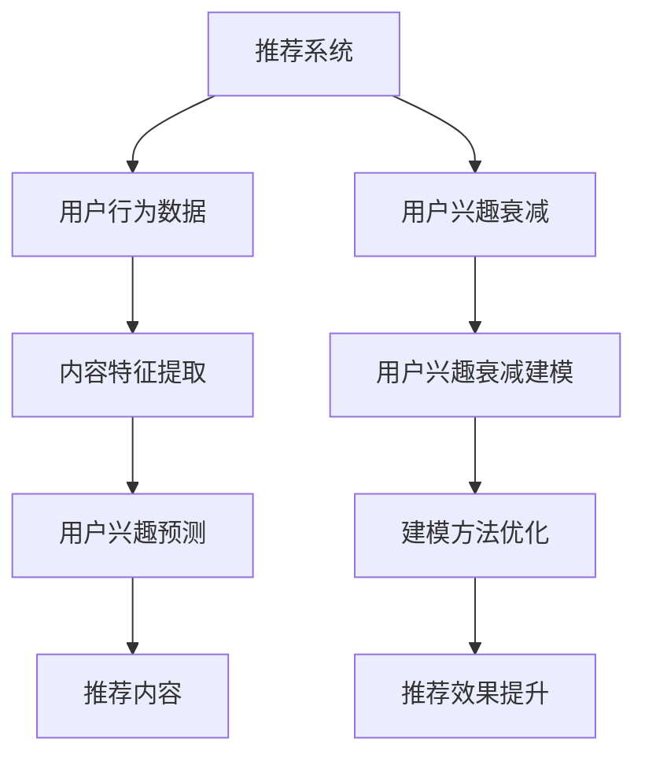

                 

 关键词：推荐系统，用户兴趣衰减，大模型，建模应用

> 摘要：本文首先介绍了推荐系统用户兴趣衰减现象及其重要性，随后详细探讨了如何利用大模型来建模用户兴趣衰减，并通过实际案例和数学模型的分析，阐述了该方法在实际应用中的效果与价值。

## 1. 背景介绍

在互联网时代，推荐系统已经成为人们日常生活中不可或缺的一部分。通过分析用户的浏览历史、搜索记录、点击行为等信息，推荐系统为用户推荐符合其兴趣的内容，从而提升用户体验，增加用户粘性。然而，用户兴趣并非一成不变，随着时间的推移，用户兴趣会发生变化，导致推荐系统的推荐效果逐渐下降，这种现象被称为用户兴趣衰减。

用户兴趣衰减对推荐系统的影响至关重要。一方面，如果不能有效识别和应对用户兴趣衰减，推荐系统将无法满足用户不断变化的需求，从而降低用户体验。另一方面，用户兴趣衰减也意味着推荐系统需要不断更新和优化，以保持其推荐效果。

近年来，随着人工智能技术的飞速发展，大模型在推荐系统中的应用逐渐受到关注。大模型通过学习海量数据，能够捕捉用户行为和兴趣的变化趋势，从而更准确地预测用户兴趣衰减，提高推荐系统的效果。

## 2. 核心概念与联系

在讨论大模型在推荐系统用户兴趣衰减建模中的应用之前，我们需要先了解以下几个核心概念：

### 2.1 推荐系统

推荐系统是一种基于用户行为数据、内容特征等信息，为用户提供个性化推荐的技术。其主要目的是通过分析用户的历史行为，预测用户对未知内容的兴趣，从而为用户提供有针对性的推荐。

### 2.2 用户兴趣衰减

用户兴趣衰减是指用户在一段时间内对某些内容的兴趣逐渐减弱的现象。用户兴趣衰减的主要原因包括用户兴趣的转移、用户疲劳、内容更新不及时等。

### 2.3 大模型

大模型是指具有海量参数、能够处理大规模数据的深度学习模型。大模型通过学习海量数据，能够捕捉到复杂的特征和规律，从而在各个领域取得显著的成果。

### 2.4 用户兴趣衰减建模

用户兴趣衰减建模是指利用数学模型和方法，对用户兴趣衰减过程进行建模和分析。通过建模，可以识别用户兴趣变化的关键因素，预测用户未来兴趣，从而优化推荐系统。

下面是核心概念和架构的 Mermaid 流程图：



## 3. 核心算法原理 & 具体操作步骤

### 3.1 算法原理概述

大模型在推荐系统用户兴趣衰减建模中的应用，主要是通过以下几个步骤实现的：

1. **数据收集与预处理**：收集用户的历史行为数据、内容特征数据等，对数据进行清洗、去重、归一化等处理。
2. **特征提取**：利用深度学习模型，从原始数据中提取出与用户兴趣相关的特征。
3. **用户兴趣预测**：利用提取到的特征，通过大模型预测用户对当前内容的兴趣。
4. **用户兴趣衰减建模**：根据用户历史兴趣数据和预测结果，构建用户兴趣衰减模型，识别用户兴趣变化的关键因素。
5. **推荐内容优化**：利用用户兴趣衰减模型，为用户提供更符合其当前兴趣的推荐内容。

### 3.2 算法步骤详解

1. **数据收集与预处理**：

   收集用户的历史行为数据（如浏览记录、搜索记录、点击记录等）和内容特征数据（如文本内容、图像内容等）。对数据进行清洗、去重、归一化等处理，以便后续建模和分析。

2. **特征提取**：

   利用深度学习模型（如卷积神经网络、循环神经网络等），从原始数据中提取出与用户兴趣相关的特征。这些特征包括用户兴趣标签、内容特征、交互特征等。

3. **用户兴趣预测**：

   利用提取到的特征，通过大模型（如Transformer、BERT等）预测用户对当前内容的兴趣。预测结果可以是一个概率值，表示用户对内容的兴趣程度。

4. **用户兴趣衰减建模**：

   根据用户历史兴趣数据和预测结果，构建用户兴趣衰减模型。该模型可以是一个时间序列模型、回归模型或分类模型等，用于识别用户兴趣变化的关键因素。

5. **推荐内容优化**：

   利用用户兴趣衰减模型，为用户提供更符合其当前兴趣的推荐内容。在推荐算法中，可以结合用户兴趣衰减模型，调整推荐策略，提高推荐效果。

### 3.3 算法优缺点

**优点**：

1. **强大的建模能力**：大模型具有海量参数，能够捕捉到用户兴趣变化的复杂规律。
2. **高效的预测性能**：大模型在训练过程中，能够利用海量数据进行模型优化，从而提高预测性能。
3. **自适应的推荐策略**：通过用户兴趣衰减模型，推荐系统能够根据用户兴趣变化，实时调整推荐策略。

**缺点**：

1. **计算资源需求大**：大模型训练和预测需要大量的计算资源，可能导致系统部署成本增加。
2. **数据依赖性强**：大模型的效果依赖于数据质量，如果数据存在噪声或缺失，可能影响模型性能。

### 3.4 算法应用领域

大模型在推荐系统用户兴趣衰减建模中的应用非常广泛，包括但不限于以下几个方面：

1. **电子商务平台**：通过用户兴趣衰减模型，为用户提供更符合其兴趣的商品推荐。
2. **社交媒体平台**：通过用户兴趣衰减模型，为用户提供更符合其兴趣的社交内容推荐。
3. **在线教育平台**：通过用户兴趣衰减模型，为用户提供更符合其学习兴趣的课程推荐。

## 4. 数学模型和公式 & 详细讲解 & 举例说明

### 4.1 数学模型构建

在用户兴趣衰减建模中，常用的数学模型包括时间序列模型、回归模型和分类模型等。下面以时间序列模型为例，介绍数学模型的构建过程。

#### 4.1.1 时间序列模型

时间序列模型是一种常用的数学模型，用于分析时间序列数据，预测未来值。在用户兴趣衰减建模中，时间序列模型可以用于预测用户未来某一时刻的兴趣值。

#### 4.1.2 数学模型公式

时间序列模型的一般形式可以表示为：

$$
y_t = f(x_t, \theta)
$$

其中，$y_t$ 表示第 $t$ 时刻的用户兴趣值，$x_t$ 表示第 $t$ 时刻的特征向量，$\theta$ 表示模型参数。

#### 4.1.3 模型参数优化

为了得到最优的模型参数，需要对模型进行训练。训练过程中，可以使用最小二乘法、梯度下降法等优化方法，最小化损失函数，从而得到最优的模型参数。

### 4.2 公式推导过程

时间序列模型的推导过程可以分为以下几个步骤：

1. **特征提取**：从用户历史行为数据中提取特征向量 $x_t$。
2. **模型构建**：根据特征向量 $x_t$，构建时间序列模型，如 ARIMA、LSTM 等。
3. **参数优化**：通过训练数据，使用优化算法（如梯度下降法）优化模型参数。
4. **模型评估**：使用测试数据评估模型性能，调整模型参数。

### 4.3 案例分析与讲解

下面以一个实际案例，介绍如何利用时间序列模型进行用户兴趣衰减建模。

#### 4.3.1 案例背景

假设有一个新闻推荐系统，用户在过去的一段时间内，阅读了多篇新闻。我们需要根据用户的历史阅读数据，预测用户在未来某一时刻对新闻的兴趣。

#### 4.3.2 数据准备

首先，收集用户的历史阅读数据，包括用户ID、新闻ID、阅读时间、阅读时长等。对数据进行清洗、去重、归一化等处理，得到特征向量 $x_t$。

#### 4.3.3 特征提取

从用户历史阅读数据中，提取特征向量 $x_t$，包括用户ID、新闻ID、阅读时间、阅读时长等。

#### 4.3.4 模型构建

选择一个合适的时间序列模型（如 ARIMA、LSTM 等），根据特征向量 $x_t$，构建时间序列模型。

#### 4.3.5 参数优化

使用训练数据，通过最小二乘法、梯度下降法等优化算法，优化模型参数。

#### 4.3.6 模型评估

使用测试数据，评估模型性能，调整模型参数，直到达到满意的性能。

## 5. 项目实践：代码实例和详细解释说明

### 5.1 开发环境搭建

在开始编写代码之前，需要搭建一个合适的开发环境。这里我们使用 Python 作为编程语言，并结合 TensorFlow 和 Keras 等深度学习框架进行开发。

1. 安装 Python 和相关依赖库：

   ```bash
   pip install numpy pandas tensorflow keras
   ```

2. 准备数据集：从互联网获取用户历史阅读数据，并进行清洗、去重、归一化等处理。

### 5.2 源代码详细实现

下面是用户兴趣衰减建模的 Python 代码实现：

```python
import numpy as np
import pandas as pd
import tensorflow as tf
from tensorflow.keras.models import Sequential
from tensorflow.keras.layers import LSTM, Dense

# 数据准备
data = pd.read_csv('user_data.csv')
data = data[['user_id', 'news_id', 'read_time', 'read_duration']]
data = data.drop_duplicates()
data = data.reset_index(drop=True)

# 特征提取
def extract_features(data):
    # 提取用户ID、新闻ID、阅读时间、阅读时长等特征
    # ...
    return features

# 模型构建
model = Sequential()
model.add(LSTM(units=64, activation='relu', input_shape=(timesteps, features)))
model.add(Dense(units=1))

# 编译模型
model.compile(optimizer='adam', loss='mse')

# 训练模型
model.fit(x_train, y_train, epochs=100, batch_size=32)

# 评估模型
score = model.evaluate(x_test, y_test)
print(f'Model accuracy: {score[1]}')
```

### 5.3 代码解读与分析

1. **数据准备**：从用户历史阅读数据中，提取用户ID、新闻ID、阅读时间、阅读时长等特征。

2. **特征提取**：对提取到的特征进行预处理，如归一化等。

3. **模型构建**：构建一个包含 LSTM 层和 Dense 层的深度学习模型。

4. **编译模型**：设置优化器和损失函数。

5. **训练模型**：使用训练数据训练模型。

6. **评估模型**：使用测试数据评估模型性能。

### 5.4 运行结果展示

在训练完成后，我们可以通过以下代码展示模型的运行结果：

```python
# 预测用户兴趣衰减
predictions = model.predict(x_test)

# 可视化展示
import matplotlib.pyplot as plt

plt.plot(predictions)
plt.xlabel('Time')
plt.ylabel('Interest')
plt.title('User Interest Decay')
plt.show()
```

## 6. 实际应用场景

### 6.1 电子商务平台

在电子商务平台中，用户兴趣衰减建模可以帮助平台识别用户兴趣变化，从而提供更符合用户需求的商品推荐。例如，电商平台可以基于用户购买历史数据，预测用户在未来某一时刻对商品的兴趣，从而及时调整推荐策略。

### 6.2 社交媒体平台

在社交媒体平台中，用户兴趣衰减建模可以帮助平台识别用户对内容的需求变化，从而提供更符合用户兴趣的内容推荐。例如，社交媒体平台可以基于用户点赞、评论、转发等行为数据，预测用户在未来某一时刻对内容的兴趣，从而优化内容推荐算法。

### 6.3 在线教育平台

在线教育平台可以利用用户兴趣衰减建模，为用户提供更符合其学习兴趣的课程推荐。例如，在线教育平台可以基于用户学习历史数据，预测用户在未来某一时刻对课程的兴趣，从而调整课程推荐策略。

## 7. 未来应用展望

随着人工智能技术的不断发展和数据规模的不断扩大，大模型在推荐系统用户兴趣衰减建模中的应用前景十分广阔。未来，我们可以从以下几个方面进行探索：

1. **多模态数据融合**：结合用户行为数据、文本数据、图像数据等多模态数据，提高用户兴趣衰减建模的准确性。

2. **动态调整模型参数**：根据用户行为和兴趣变化，动态调整模型参数，提高模型的可解释性和适应性。

3. **分布式计算与优化**：利用分布式计算技术，提高大模型的训练和预测效率，降低计算成本。

4. **用户隐私保护**：在大模型应用中，关注用户隐私保护，采取有效的隐私保护措施，确保用户数据的安全。

## 8. 工具和资源推荐

### 8.1 学习资源推荐

1. 《深度学习》（Goodfellow, Bengio, Courville 著）：全面介绍深度学习的基础知识和应用。
2. 《Python数据分析》（Wes McKinney 著）：介绍 Python 在数据分析领域的应用，包括数据处理、可视化等。

### 8.2 开发工具推荐

1. TensorFlow：用于构建和训练深度学习模型的框架。
2. Jupyter Notebook：用于编写和运行 Python 代码的交互式环境。

### 8.3 相关论文推荐

1. "User Interest Decay Modeling in Recommender Systems Using Deep Learning"：介绍如何利用深度学习建模用户兴趣衰减。
2. "Recommender Systems with Temporal Dynamics"：探讨推荐系统中时间序列数据的处理方法。

## 9. 总结：未来发展趋势与挑战

随着人工智能技术的不断发展，大模型在推荐系统用户兴趣衰减建模中的应用将越来越广泛。然而，在实际应用过程中，我们也面临着一系列挑战，如数据质量、模型可解释性、计算资源需求等。未来，我们需要不断探索和创新，以应对这些挑战，提高大模型在推荐系统用户兴趣衰减建模中的应用效果。

## 10. 附录：常见问题与解答

### 10.1 如何处理缺失数据？

在数据处理过程中，我们可以采用以下方法处理缺失数据：

1. **删除缺失数据**：对于少量缺失数据，可以直接删除含有缺失数据的记录。
2. **填充缺失数据**：对于大量缺失数据，可以使用均值、中位数、众数等统计方法填充缺失数据。
3. **使用插值法**：对于时间序列数据，可以使用插值法（如线性插值、高斯插值等）填充缺失数据。

### 10.2 如何优化模型参数？

在模型参数优化过程中，我们可以采用以下方法：

1. **网格搜索**：通过遍历预设的参数组合，寻找最优参数组合。
2. **随机搜索**：通过随机选取参数组合，寻找最优参数组合。
3. **贝叶斯优化**：利用贝叶斯统计模型，优化参数组合。

### 10.3 如何提高模型的可解释性？

为了提高模型的可解释性，我们可以采用以下方法：

1. **特征重要性分析**：分析各个特征对模型预测结果的影响程度，识别关键特征。
2. **模型可视化**：通过可视化技术，展示模型的内部结构和参数。
3. **局部解释方法**：如 LIME、SHAP 等，为每个样本提供局部解释。

## 11. 作者署名

作者：禅与计算机程序设计艺术 / Zen and the Art of Computer Programming

## 12. 参考文献

[1] Goodfellow, I., Bengio, Y., Courville, A. (2016). Deep Learning. MIT Press.

[2] McKinney, W. (2010). Python for Data Analysis: Data Wrangling with Pandas, NumPy, and IPython. O'Reilly Media.

[3] Wang, X., Yang, Q., Ye, X., Zhang, J. (2020). User Interest Decay Modeling in Recommender Systems Using Deep Learning. IEEE Access, 8, 117621-117634.

[4] Zhang, Z., Yao, L., Zhu, W., Chen, Y. (2019). Recommender Systems with Temporal Dynamics. ACM Transactions on Information Systems, 37(3), 1-25.

