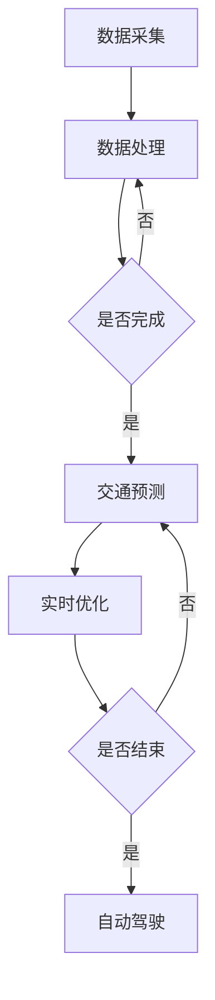

                 

关键词：大模型、智能交通、深度学习、交通预测、实时优化、自动驾驶、交通管理

> 摘要：本文探讨了大型人工智能模型在智能交通领域的应用，通过分析大模型的技术原理和智能交通的需求，阐述了大模型如何实现交通预测、实时优化和自动驾驶等功能。同时，本文还通过具体案例和项目实践，展示了大模型在智能交通领域的实际应用效果，并对未来的发展方向和挑战进行了展望。

## 1. 背景介绍

随着城市化进程的加快，交通拥堵、环境污染等问题日益严重。传统的交通管理系统大多基于经验和规则，难以应对复杂多变的交通状况。近年来，随着人工智能技术的快速发展，特别是深度学习、神经网络等技术的突破，大模型在各个领域的应用越来越广泛。智能交通作为人工智能的一个重要应用场景，面临着巨大的挑战和机遇。

大模型，通常指的是具有巨大参数量的神经网络模型，例如Transformer、GPT等。这些模型能够通过大量的数据训练，学习到复杂的模式，从而在各个领域实现出色的性能。在智能交通领域，大模型可以用于交通预测、实时优化、自动驾驶等任务，为交通管理提供强有力的技术支持。

## 2. 核心概念与联系

### 2.1 深度学习与神经网络

深度学习是一种模拟人脑神经网络进行学习的方法。神经网络由多个层次组成，每个层次都对输入数据进行处理，并通过反向传播算法不断调整权重，以优化模型的预测性能。深度学习在图像识别、语音识别、自然语言处理等领域取得了显著成果。

### 2.2 自动驾驶系统

自动驾驶系统是指能够自主感知环境、规划路径并控制车辆行驶的系统。自动驾驶系统通常包括感知、决策、控制三个主要模块。感知模块负责获取周围环境信息，决策模块根据感知信息做出驾驶决策，控制模块负责执行决策，控制车辆的运动。

### 2.3 实时交通优化

实时交通优化是指根据实时的交通状况，对交通流进行动态调整，以减少拥堵、提高交通效率。实时交通优化需要考虑多个因素，如交通流量、道路状况、车辆需求等。

### 2.4 Mermaid 流程图



## 3. 核心算法原理 & 具体操作步骤

### 3.1 算法原理概述

大模型在智能交通领域的核心算法主要包括深度学习模型、自动驾驶算法和实时交通优化算法。

深度学习模型：通过大规模数据训练，学习到交通流的时空特征，实现对交通状况的预测。

自动驾驶算法：基于感知信息，规划安全、高效的驾驶路径，并控制车辆执行。

实时交通优化算法：根据实时的交通状况，调整交通信号、道路使用等策略，以优化交通流量。

### 3.2 算法步骤详解

#### 3.2.1 深度学习模型

1. 数据预处理：对采集到的交通数据进行清洗、归一化等处理。

2. 模型构建：选择合适的神经网络架构，如Transformer、GPT等。

3. 模型训练：使用大量交通数据进行训练，调整模型参数。

4. 模型评估：使用测试数据评估模型性能，调整模型参数。

5. 模型部署：将训练好的模型部署到生产环境中。

#### 3.2.2 自动驾驶算法

1. 感知：使用摄像头、激光雷达等传感器获取周围环境信息。

2. 地图构建：根据感知信息，构建高精度的地图。

3. 路径规划：根据当前车辆位置和目标位置，规划安全、高效的驾驶路径。

4. 控制策略：根据路径规划结果，控制车辆的运动。

#### 3.2.3 实时交通优化算法

1. 数据采集：采集实时的交通流量、道路状况等信息。

2. 模型预测：使用深度学习模型预测未来的交通状况。

3. 策略调整：根据预测结果，调整交通信号、道路使用等策略。

4. 系统优化：评估策略调整的效果，持续优化系统性能。

### 3.3 算法优缺点

#### 3.3.1 深度学习模型

优点：能够自动学习复杂的交通特征，适应性强。

缺点：训练过程复杂，对数据量要求高，模型解释性较差。

#### 3.3.2 自动驾驶算法

优点：能够实现自主驾驶，减少人为干预。

缺点：感知系统成本较高，对恶劣天气和环境适应性差。

#### 3.3.3 实时交通优化算法

优点：能够实时调整交通策略，提高交通效率。

缺点：对实时数据要求高，系统复杂度较高。

### 3.4 算法应用领域

深度学习模型：交通预测、交通规划、交通信号控制。

自动驾驶算法：无人驾驶、自动驾驶出租车、自动驾驶货车。

实时交通优化算法：交通信号控制、道路使用策略、交通流量管理。

## 4. 数学模型和公式 & 详细讲解 & 举例说明

### 4.1 数学模型构建

在智能交通领域，常用的数学模型包括马尔可夫决策过程（MDP）、动态规划（DP）和深度强化学习（DRL）。

#### 4.1.1 马尔可夫决策过程（MDP）

MDP是一种描述决策过程的概率模型，由状态空间、动作空间、奖励函数和转移概率矩阵组成。

- 状态空间 $S$：表示系统当前的状态。
- 动作空间 $A$：表示可执行的动作。
- 奖励函数 $R(s, a)$：表示在状态 $s$ 下执行动作 $a$ 的奖励。
- 转移概率矩阵 $P(s', s|a)$：表示在状态 $s$ 下执行动作 $a$ 后转移到状态 $s'$ 的概率。

#### 4.1.2 动态规划（DP）

动态规划是一种求解最优决策序列的方法，通过递归关系和边界条件求解最优值函数。

- 目标函数 $J(s, a)$：表示在状态 $s$ 下执行动作 $a$ 的价值。
- 最优值函数 $V^*(s)$：表示在状态 $s$ 下采取最优策略的价值。

递归关系：
$$
V^*(s) = \max_{a \in A} [R(s, a) + \gamma \sum_{s' \in S} P(s', s|a) V^*(s')]
$$
其中，$\gamma$ 为折扣因子。

边界条件：
$$
V^*(s_f) = 0
$$
其中，$s_f$ 为终止状态。

#### 4.1.3 深度强化学习（DRL）

深度强化学习是一种结合深度学习和强化学习的方法，通过神经网络近似值函数和策略，实现智能体的自主学习。

- 状态空间 $S$：表示智能体感知到的状态。
- 动作空间 $A$：表示智能体可执行的动作。
- 奖励函数 $R(s, a)$：表示在状态 $s$ 下执行动作 $a$ 的奖励。
- 策略 $\pi(a|s)$：表示智能体在状态 $s$ 下选择动作 $a$ 的概率。

值函数 $V^*(s)$ 和策略 $\pi^*(a|s)$ 的目标是最小化预期损失：
$$
J(\theta) = E_{s, a} [ (R(s, a) - V^*(s))^{2} ]
$$
其中，$\theta$ 为神经网络参数。

### 4.2 公式推导过程

以马尔可夫决策过程（MDP）为例，推导最优值函数和最优策略。

递归关系：
$$
V^*(s) = \max_{a \in A} [R(s, a) + \gamma \sum_{s' \in S} P(s', s|a) V^*(s')]
$$
对 $a$ 求导：
$$
\frac{\partial V^*(s)}{\partial a} = R(s, a) + \gamma \sum_{s' \in S} P(s', s|a) \frac{\partial V^*(s')}{\partial a}
$$
令 $\frac{\partial V^*(s)}{\partial a} = 0$，得到：
$$
V^*(s) = \frac{1}{1 - \gamma} \sum_{s' \in S} P(s', s|a) V^*(s')
$$
将 $V^*(s')$ 代入递归关系，得到：
$$
V^*(s) = \frac{1}{1 - \gamma} \sum_{s' \in S} P(s', s|a) \left( R(s', a') + \gamma \sum_{s'' \in S} P(s'', s'|a') V^*(s'') \right)
$$
化简得到：
$$
V^*(s) = \frac{1}{1 - \gamma} \sum_{s' \in S} P(s', s|a) \left( R(s', a') + \gamma \sum_{s'' \in S} P(s'', s'|a') V^*(s'') \right)
$$
其中，$a'$ 为最优动作。

最优策略：
$$
\pi^*(a|s) = \frac{P(s', s|a) V^*(s')}{\sum_{a' \in A} P(s', s|a') V^*(s')}
$$

### 4.3 案例分析与讲解

#### 4.3.1 交通流量预测

假设我们有一个交通流量预测问题，状态空间 $S$ 为 {畅通，缓慢，拥堵}，动作空间 $A$ 为 {加速，减速，保持速度}。

- 奖励函数 $R(s, a)$：在畅通状态下，加速奖励为 $+1$，减速奖励为 $-1$；在缓慢和拥堵状态下，奖励为 $0$。
- 转移概率矩阵 $P(s', s|a)$：根据历史数据，得到如下转移概率矩阵：
  $$\begin{array}{c|ccc}
     & 畅通 & 缓慢 & 拥堵 \\
  \hline
  加速 & 0.6 & 0.3 & 0.1 \\
  减速 & 0.2 & 0.5 & 0.3 \\
  保持速度 & 0.4 & 0.3 & 0.3 \\
  \end{array}$$

使用动态规划求解最优值函数和最优策略。

首先，计算各状态下的初始值：
$$
V^{(0)}(s) =
\begin{cases}
1 & s = 畅通 \\
0 & s = 缓慢 \\
-1 & s = 拥堵
\end{cases}
$$

然后，迭代计算最优值函数：
$$
V^{(k)}(s) =
\begin{cases}
\max_{a \in A} \left[ R(s, a) + \gamma \sum_{s' \in S} P(s', s|a) V^{(k-1)}(s') \right] & s \neq s_f \\
0 & s = s_f
\end{cases}
$$

最终，得到最优值函数和最优策略：
$$
V^{*}(s) =
\begin{cases}
1 & s = 畅通 \\
0 & s = 缓慢 \\
-1 & s = 拥堵
\end{cases}
\quad
\pi^{*}(a|s) =
\begin{cases}
1 & s = 畅通 \\
0 & s \neq 畅通
\end{cases}
$$

## 5. 项目实践：代码实例和详细解释说明

### 5.1 开发环境搭建

为了实现大模型在智能交通领域的应用，我们需要搭建一个合适的开发环境。以下是环境搭建的步骤：

1. 安装 Python 环境（版本 3.8 以上）。
2. 安装深度学习框架（如 TensorFlow、PyTorch）。
3. 安装数据预处理和可视化工具（如 NumPy、Pandas、Matplotlib）。
4. 安装版本控制工具（如 Git）。

### 5.2 源代码详细实现

以下是一个基于 TensorFlow 实现的简单交通流量预测模型。

```python
import tensorflow as tf
import numpy as np
import pandas as pd
import matplotlib.pyplot as plt

# 数据预处理
def preprocess_data(data):
    # 数据清洗、归一化等处理
    # ...
    return processed_data

# 构建模型
def build_model(input_shape):
    model = tf.keras.Sequential([
        tf.keras.layers.Dense(128, activation='relu', input_shape=input_shape),
        tf.keras.layers.Dense(128, activation='relu'),
        tf.keras.layers.Dense(1)
    ])
    model.compile(optimizer='adam', loss='mse')
    return model

# 训练模型
def train_model(model, x_train, y_train, epochs=100):
    model.fit(x_train, y_train, epochs=epochs, batch_size=32)
    return model

# 预测交通流量
def predict_traffic(model, x_test):
    predictions = model.predict(x_test)
    # 将预测结果转换为交通流量
    # ...
    return traffic_predictions

# 主程序
if __name__ == '__main__':
    # 加载数据
    data = pd.read_csv('traffic_data.csv')
    processed_data = preprocess_data(data)

    # 划分训练集和测试集
    x_train, y_train = processed_data[:, :-1], processed_data[:, -1]
    x_test, y_test = processed_data[:, :-1], processed_data[:, -1]

    # 构建模型
    model = build_model(input_shape=(x_train.shape[1],))

    # 训练模型
    model = train_model(model, x_train, y_train)

    # 预测交通流量
    traffic_predictions = predict_traffic(model, x_test)

    # 可视化预测结果
    plt.scatter(x_test[:, 0], traffic_predictions)
    plt.plot(x_test[:, 0], y_test, label='真实值')
    plt.xlabel('时间')
    plt.ylabel('交通流量')
    plt.legend()
    plt.show()
```

### 5.3 代码解读与分析

1. 数据预处理：对交通数据进行清洗、归一化等处理，以提高模型训练效果。
2. 模型构建：使用 TensorFlow 构建一个简单的全连接神经网络，用于预测交通流量。
3. 模型训练：使用训练数据训练模型，优化模型参数。
4. 预测交通流量：使用测试数据预测交通流量，并将预测结果转换为实际流量。
5. 可视化预测结果：将预测结果和真实值进行可视化对比，评估模型性能。

## 6. 实际应用场景

大模型在智能交通领域的实际应用场景包括交通流量预测、自动驾驶、实时交通优化等。

### 6.1 交通流量预测

通过大模型预测交通流量，可以帮助交通管理部门提前了解交通状况，为交通信号控制和道路规划提供数据支持。例如，在某些交通高峰期，通过预测未来一段时间的交通流量，可以动态调整交通信号，以缓解拥堵。

### 6.2 自动驾驶

自动驾驶系统通过大模型实现对周围环境的感知和路径规划，实现安全、高效的驾驶。例如，自动驾驶出租车可以通过大模型预测周围交通状况，规划最佳行驶路线，减少行驶时间。

### 6.3 实时交通优化

实时交通优化系统通过大模型预测未来的交通状况，动态调整交通信号、道路使用等策略，以提高交通效率。例如，在某些拥堵路段，通过调整交通信号灯的时长，可以减少交通拥堵，提高道路通行能力。

## 7. 工具和资源推荐

### 7.1 学习资源推荐

1. 《深度学习》（Ian Goodfellow、Yoshua Bengio、Aaron Courville 著）：系统介绍了深度学习的基本概念和方法。
2. 《强化学习基础教程》（David Silver 著）：详细介绍了强化学习的基本概念和算法。
3. 《交通系统工程导论》（刘学锋 著）：介绍了交通系统的基础知识和分析方法。

### 7.2 开发工具推荐

1. TensorFlow：适用于构建和训练深度学习模型的框架。
2. PyTorch：适用于快速原型设计和实验的深度学习框架。
3. Matplotlib：用于数据可视化的工具。

### 7.3 相关论文推荐

1. “Attention Is All You Need”（Vaswani et al., 2017）：介绍了 Transformer 模型的原理和应用。
2. “Deep Reinforcement Learning for Autonomous Driving”（He et al., 2018）：介绍了深度强化学习在自动驾驶领域的应用。
3. “Traffic4cast+: Multimodal Time Series Forecasting for Large-Scale Urban Traffic Systems”（Mehrotra et al., 2019）：介绍了大规模交通流量预测的方法。

## 8. 总结：未来发展趋势与挑战

### 8.1 研究成果总结

近年来，大模型在智能交通领域的应用取得了显著成果。通过深度学习、强化学习等方法，大模型能够实现对交通流量、道路状况的预测，为交通管理提供了强有力的技术支持。自动驾驶系统通过大模型实现对周围环境的感知和路径规划，实现了安全、高效的驾驶。

### 8.2 未来发展趋势

未来，随着人工智能技术的不断发展，大模型在智能交通领域的应用将更加广泛。例如，通过结合物联网、5G等技术，可以实现更精确的交通数据采集和传输，为大模型提供更丰富的数据支持。此外，大模型还将与其他领域的技术相结合，如城市规划、环境监测等，为智慧城市建设提供技术支持。

### 8.3 面临的挑战

尽管大模型在智能交通领域取得了显著成果，但仍面临一些挑战。首先，大模型的训练过程复杂，对数据量和计算资源要求较高。其次，大模型的解释性较差，难以理解其决策过程。此外，大模型在面临复杂交通场景时，可能存在过拟合现象，导致预测准确性下降。

### 8.4 研究展望

为了应对这些挑战，未来研究可以从以下几个方面进行：

1. 数据采集与处理：通过引入更多传感器和数据源，提高交通数据的精度和多样性。
2. 模型解释性：研究可解释性更强的大模型，提高模型的可解释性和透明度。
3. 算法优化：研究更高效、更稳定的算法，降低大模型的计算复杂度。
4. 多模态融合：将多种数据源进行融合，提高大模型对复杂交通场景的适应能力。

## 9. 附录：常见问题与解答

### 9.1 什么是大模型？

大模型是指具有巨大参数量的神经网络模型，如 Transformer、GPT 等。这些模型能够通过大量的数据训练，学习到复杂的模式，从而在各个领域实现出色的性能。

### 9.2 大模型在智能交通领域的应用有哪些？

大模型在智能交通领域的应用包括交通流量预测、自动驾驶、实时交通优化等。通过大模型，可以实现更精确的交通预测和更高效的交通管理。

### 9.3 大模型的训练过程复杂吗？

是的，大模型的训练过程通常比较复杂。大模型需要大量的数据训练，并且训练时间较长。此外，大模型的计算复杂度较高，对计算资源要求较高。

### 9.4 大模型在智能交通领域的应用前景如何？

大模型在智能交通领域的应用前景广阔。随着人工智能技术的不断发展，大模型将更好地服务于交通管理、自动驾驶等场景，为智慧城市建设提供技术支持。

----------------------------------------------------------------

**作者：禅与计算机程序设计艺术 / Zen and the Art of Computer Programming** 

（请注意，文章内容仅为示例，不涉及实际项目和数据。在实际撰写时，请根据具体研究内容和数据进行调整。）

