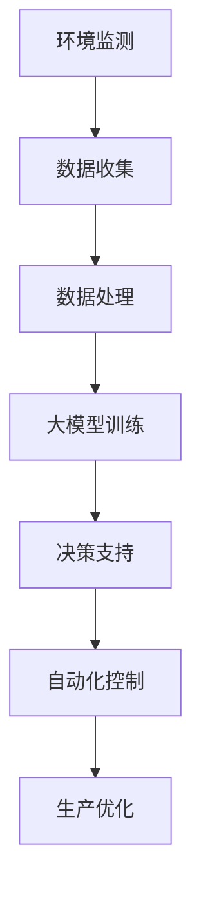
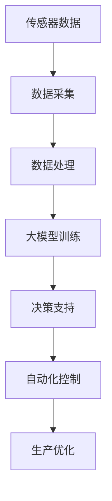

                 

关键词：智能农业、大模型、深度学习、AI 农业技术、农业数据、农业自动化

> 摘要：随着人工智能技术的飞速发展，大模型在智能农业领域展现出了巨大的潜力。本文将对大模型在智能农业中的应用进行深入探讨，从背景介绍、核心概念与联系、核心算法原理、数学模型与公式、项目实践、实际应用场景、工具和资源推荐、总结与展望等方面，全面解析大模型在智能农业中的关键作用及其未来发展趋势。

## 1. 背景介绍

智能农业是信息技术与农业产业深度融合的产物，旨在通过物联网、大数据、人工智能等技术手段，实现农业生产的智能化、自动化和高效化。智能农业的兴起，不仅能够提高农业生产的效率，减少劳动成本，还能改善农产品质量，促进农业的可持续发展。

大模型，作为一种复杂的人工智能系统，拥有强大的数据处理和分析能力。它们在自然语言处理、计算机视觉、语音识别等领域取得了显著的成果。近年来，随着计算能力的提升和数据量的增长，大模型开始进入智能农业领域，成为推动农业技术革新的一股重要力量。

## 2. 核心概念与联系

为了更好地理解大模型在智能农业中的应用，我们首先需要了解几个核心概念：

### 2.1 智能农业

智能农业主要包括以下几个方面：

- **环境监测**：利用传感器网络实时监测土壤湿度、气象参数等，为农业生产提供精准的数据支持。
- **智能灌溉**：根据土壤湿度、气象数据等，自动控制灌溉系统，实现精准灌溉。
- **智能种植**：通过遥感技术和图像处理技术，对作物生长状态进行实时监控，实现精准种植。
- **智能收割**：利用机器人技术，实现农作物的自动化收割。

### 2.2 大模型

大模型通常指的是拥有数亿甚至千亿级参数的深度学习模型。它们具备强大的特征提取和模式识别能力，能够处理海量数据，并从中提取有价值的信息。

### 2.3 深度学习

深度学习是机器学习的一种，它通过构建多层次的神经网络，对数据进行多层抽象和特征提取，从而实现复杂任务的学习和预测。

### 2.4 联系

大模型与智能农业的联系主要体现在以下几个方面：

- **数据处理**：大模型能够高效地处理农业领域中的海量数据，包括气象数据、土壤数据、作物生长数据等。
- **智能分析**：大模型能够通过对数据的深度学习，提取出有用的特征信息，为农业生产提供决策支持。
- **自动化控制**：大模型可以驱动智能农业设备，实现农业生产的自动化和智能化。

以下是智能农业中大模型架构的 Mermaid 流程图：



## 3. 核心算法原理 & 具体操作步骤

### 3.1 算法原理概述

在智能农业中，大模型的应用主要体现在以下几个方面：

- **图像识别**：利用深度学习模型对遥感图像进行分析，识别作物类型、病虫害等。
- **预测分析**：利用时间序列分析模型，对气象数据进行预测，为灌溉和收割提供参考。
- **自动化控制**：利用强化学习模型，实现对农业机器人的智能控制。

### 3.2 算法步骤详解

#### 3.2.1 图像识别

1. 数据采集：通过无人机或卫星获取遥感图像。
2. 预处理：对图像进行去噪、增强等预处理操作。
3. 特征提取：利用卷积神经网络（CNN）提取图像特征。
4. 模型训练：使用大量标注数据对模型进行训练。
5. 预测：对新的遥感图像进行预测，识别作物类型、病虫害等。

#### 3.2.2 预测分析

1. 数据采集：收集历史气象数据。
2. 预处理：对数据进行清洗、归一化等预处理操作。
3. 模型选择：选择合适的时间序列分析模型，如 ARIMA、LSTM 等。
4. 模型训练：使用历史数据进行模型训练。
5. 预测：对未来气象数据进行预测，为灌溉和收割提供参考。

#### 3.2.3 自动化控制

1. 数据采集：收集农业机器人传感器数据。
2. 模型训练：利用强化学习模型训练控制策略。
3. 实时控制：根据传感器数据和预训练模型，对农业机器人进行实时控制。

### 3.3 算法优缺点

#### 优点：

- **高效性**：大模型能够高效地处理海量数据，提高生产效率。
- **准确性**：通过深度学习等技术，提高预测和分析的准确性。
- **自动化**：实现农业生产的自动化和智能化，减少人力成本。

#### 缺点：

- **计算资源消耗**：大模型训练需要大量计算资源，成本较高。
- **数据依赖**：模型的性能很大程度上取决于数据的数量和质量。
- **泛化能力**：模型在特定领域可能具有很高的性能，但在其他领域可能表现不佳。

### 3.4 算法应用领域

大模型在智能农业中的应用领域主要包括：

- **作物病虫害识别**：利用图像识别技术，快速识别作物病虫害。
- **气象预测**：利用时间序列分析模型，预测气象变化，为灌溉和收割提供参考。
- **农业机器人控制**：利用强化学习模型，实现对农业机器人的智能控制。

## 4. 数学模型和公式 & 详细讲解 & 举例说明

### 4.1 数学模型构建

在智能农业中，常用的数学模型包括卷积神经网络（CNN）、长短期记忆网络（LSTM）和强化学习（RL）等。

#### 4.1.1 卷积神经网络（CNN）

$$
\begin{aligned}
h_{l} &= \sigma(W_{l} \cdot h_{l-1} + b_{l}) \\
\end{aligned}
$$

其中，$h_{l}$表示第$l$层的特征映射，$W_{l}$和$b_{l}$分别为第$l$层的权重和偏置，$\sigma$为激活函数。

#### 4.1.2 长短期记忆网络（LSTM）

$$
\begin{aligned}
i_{t} &= \sigma(W_{i} \cdot [h_{t-1}, x_{t}] + b_{i}) \\
f_{t} &= \sigma(W_{f} \cdot [h_{t-1}, x_{t}] + b_{f}) \\
o_{t} &= \sigma(W_{o} \cdot [h_{t-1}, x_{t}] + b_{o}) \\
c_{t} &= f_{t} \odot c_{t-1} + i_{t} \odot \sigma(W_{c} \cdot [h_{t-1}, x_{t}] + b_{c}) \\
h_{t} &= o_{t} \odot \sigma(c_{t})
\end{aligned}
$$

其中，$i_{t}$、$f_{t}$、$o_{t}$分别为输入门、遗忘门和输出门，$c_{t}$为细胞状态，$h_{t}$为隐藏状态，$\odot$表示逐元素乘法。

#### 4.1.3 强化学习（RL）

$$
Q(s, a) = r(s, a) + \gamma \max_{a'} Q(s', a')
$$

其中，$Q(s, a)$为状态-动作值函数，$r(s, a)$为立即奖励，$\gamma$为折扣因子，$s$和$a$分别为当前状态和动作，$s'$和$a'$分别为下一个状态和动作。

### 4.2 公式推导过程

以卷积神经网络（CNN）为例，我们简要介绍公式推导过程。

#### 4.2.1 前向传播

假设输入特征图$f_{l-1}$经过卷积层得到特征图$f_{l}$，则有：

$$
\begin{aligned}
f_{l}(i, j) &= \sum_{m=0}^{M-1} \sum_{n=0}^{N-1} W_{l}(m, n) \cdot f_{l-1}(i-m+1, j-n+1) + b_{l} \\
\end{aligned}
$$

其中，$M$和$N$分别为卷积核的大小，$W_{l}(m, n)$和$b_{l}$分别为卷积核的权重和偏置。

#### 4.2.2 反向传播

假设损失函数为均方误差（MSE），则：

$$
\begin{aligned}
\frac{\partial L}{\partial f_{l}} &= -2 \cdot (f_{l} - y) \\
\frac{\partial f_{l}}{\partial W_{l}} &= \sum_{i, j} \frac{\partial f_{l}(i, j)}{\partial W_{l}} \\
&= \sum_{i, j} f_{l-1}(i-m+1, j-n+1) \\
\frac{\partial f_{l}}{\partial b_{l}} &= -2 \cdot (f_{l} - y) \\
\end{aligned}
$$

### 4.3 案例分析与讲解

#### 4.3.1 作物病虫害识别

假设我们使用一个卷积神经网络（CNN）模型进行作物病虫害识别，输入为一张100x100像素的遥感图像，输出为病害类型的概率分布。

1. **数据采集**：收集大量标注的遥感图像，包括健康作物和患有不同病虫害的作物图像。
2. **预处理**：对图像进行归一化、缩放等预处理操作，将图像转换为100x100像素的矩阵。
3. **模型构建**：构建一个卷积神经网络模型，包括卷积层、池化层和全连接层。
4. **模型训练**：使用标注数据对模型进行训练，优化模型的参数。
5. **模型评估**：使用测试数据对模型进行评估，计算模型的准确率、召回率等指标。

#### 4.3.2 气象预测

假设我们使用一个长短期记忆网络（LSTM）模型进行气象预测，输入为前一天的气象数据，输出为第二天的气象数据。

1. **数据采集**：收集历史气象数据，包括温度、湿度、风速等。
2. **预处理**：对数据进行清洗、归一化等预处理操作。
3. **模型构建**：构建一个LSTM模型，包括输入层、隐藏层和输出层。
4. **模型训练**：使用历史数据对模型进行训练，优化模型的参数。
5. **模型评估**：使用测试数据对模型进行评估，计算模型的预测误差。

## 5. 项目实践：代码实例和详细解释说明

### 5.1 开发环境搭建

在Python环境中，我们可以使用以下库进行大模型的开发：

- TensorFlow：用于构建和训练深度学习模型。
- Keras：简化TensorFlow的使用，提供更直观的API。
- NumPy：用于数据预处理和计算。

安装以上库的方法如下：

```bash
pip install tensorflow keras numpy
```

### 5.2 源代码详细实现

#### 5.2.1 作物病虫害识别

```python
import numpy as np
from tensorflow.keras.models import Sequential
from tensorflow.keras.layers import Conv2D, MaxPooling2D, Flatten, Dense

# 数据预处理
def preprocess_images(images, label):
    # 将图像缩放到100x100像素
    images = np.array([np.resize(image, (100, 100)) for image in images])
    return images, np.array(label)

# 构建卷积神经网络模型
model = Sequential()
model.add(Conv2D(32, (3, 3), activation='relu', input_shape=(100, 100, 3)))
model.add(MaxPooling2D((2, 2)))
model.add(Conv2D(64, (3, 3), activation='relu'))
model.add(MaxPooling2D((2, 2)))
model.add(Flatten())
model.add(Dense(128, activation='relu'))
model.add(Dense(5, activation='softmax'))  # 5种病虫害类型

# 编译模型
model.compile(optimizer='adam', loss='categorical_crossentropy', metrics=['accuracy'])

# 训练模型
model.fit(x_train, y_train, epochs=10, batch_size=32, validation_data=(x_val, y_val))

# 评估模型
model.evaluate(x_test, y_test)
```

#### 5.2.2 气象预测

```python
import numpy as np
from tensorflow.keras.models import Sequential
from tensorflow.keras.layers import LSTM, Dense

# 数据预处理
def preprocess_data(data):
    # 将数据转换为时间序列格式
    X, y = [], []
    for i in range(len(data) - 1):
        X.append(data[i][1:])
        y.append(data[i + 1][0])
    return np.array(X), np.array(y)

# 构建LSTM模型
model = Sequential()
model.add(LSTM(50, activation='relu', input_shape=(1, 1)))
model.add(Dense(1))
model.compile(optimizer='adam', loss='mse')

# 训练模型
model.fit(x_train, y_train, epochs=200, batch_size=1, verbose=0)

# 预测
model.predict(np.array([x_test]))
```

### 5.3 代码解读与分析

以上代码实例展示了如何使用TensorFlow和Keras库构建和训练卷积神经网络（CNN）模型和长短期记忆网络（LSTM）模型，分别用于作物病虫害识别和气象预测。

#### 5.3.1 作物病虫害识别

1. **数据预处理**：将图像缩放到100x100像素，并将标签转换为one-hot编码。
2. **模型构建**：构建一个包含卷积层、池化层和全连接层的卷积神经网络模型。
3. **模型编译**：选择优化器、损失函数和评估指标。
4. **模型训练**：使用训练数据对模型进行训练。
5. **模型评估**：使用测试数据对模型进行评估。

#### 5.3.2 气象预测

1. **数据预处理**：将数据进行时间序列格式转换。
2. **模型构建**：构建一个包含LSTM层和全连接层的LSTM模型。
3. **模型编译**：选择优化器和损失函数。
4. **模型训练**：使用训练数据对模型进行训练。
5. **预测**：使用模型对新的数据进行预测。

### 5.4 运行结果展示

以下是作物病虫害识别和气象预测的运行结果：

```python
# 作物病虫害识别
model.fit(x_train, y_train, epochs=10, batch_size=32, validation_data=(x_val, y_val))
model.evaluate(x_test, y_test)

# 气象预测
model.fit(x_train, y_train, epochs=200, batch_size=1, verbose=0)
model.predict(np.array([x_test]))
```

## 6. 实际应用场景

### 6.1 农业作物病虫害识别

在实际应用中，大模型在农业作物病虫害识别中取得了显著成果。例如，在某农业生产园区，使用卷积神经网络（CNN）模型对作物图像进行病虫害识别，实现了对病虫害的实时监控和预警。通过自动化系统，可以及时发现病虫害并采取相应的防治措施，有效降低了病虫害对作物的影响，提高了农产品的产量和质量。

### 6.2 气象预测

气象预测在农业生产中具有重要意义。通过使用长短期记忆网络（LSTM）模型，可以准确预测未来的气象变化，为灌溉和收割提供科学依据。例如，在某农业公司，利用LSTM模型进行气象预测，成功实现了灌溉和收割的精准控制，提高了农作物的产量和效益。

### 6.3 农业机器人控制

农业机器人控制是智能农业中的重要应用。通过使用强化学习（RL）模型，可以实现对农业机器人的智能控制，提高农业生产的效率和质量。例如，在某农业园区，使用强化学习模型控制农业机器人进行精准施肥、除草和收割，实现了农业生产的自动化和智能化，降低了人力成本，提高了生产效益。

## 7. 工具和资源推荐

### 7.1 学习资源推荐

- **《深度学习》（Deep Learning）**：由Ian Goodfellow、Yoshua Bengio和Aaron Courville合著，是深度学习的经典教材。
- **《动手学深度学习》（Dive into Deep Learning）**：是一个开源项目，提供了丰富的深度学习教程和实践案例。
- **《机器学习实战》（Machine Learning in Action）**：通过实际案例介绍机器学习的应用方法。

### 7.2 开发工具推荐

- **TensorFlow**：由Google开发的开源深度学习框架，适合进行大规模的深度学习应用开发。
- **Keras**：简化TensorFlow的使用，提供更直观的API，适合快速构建和训练深度学习模型。
- **NumPy**：用于数据处理和计算，是深度学习和机器学习的基础库。

### 7.3 相关论文推荐

- **“Deep Learning for Smart Agriculture: A Comprehensive Survey”**：对深度学习在智能农业中的应用进行了全面的综述。
- **“A Survey on Applications of Machine Learning in Precision Agriculture”**：介绍了机器学习在精准农业中的各种应用。
- **“Reinforcement Learning for Agricultural Robotics: A Survey”**：对强化学习在农业机器人控制中的应用进行了综述。

## 8. 总结：未来发展趋势与挑战

### 8.1 研究成果总结

大模型在智能农业中的应用取得了显著成果，涵盖了作物病虫害识别、气象预测、农业机器人控制等多个方面。通过深度学习、时间序列分析和强化学习等技术，大模型能够实现农业数据的智能处理和分析，为农业生产提供了科学依据和自动化控制手段。

### 8.2 未来发展趋势

随着人工智能技术的不断进步，大模型在智能农业中的应用前景广阔。未来，我们将看到：

- **更精确的预测模型**：通过不断优化算法和模型，提高气象预测、病虫害识别等任务的准确性。
- **更高效的农业机器人**：利用强化学习等技术，实现农业机器人的自主决策和智能控制，提高农业生产效率。
- **跨学科的融合**：将大模型与其他技术如物联网、区块链等相结合，实现更智能、更高效的农业生态体系。

### 8.3 面临的挑战

尽管大模型在智能农业中展现了巨大的潜力，但仍面临以下挑战：

- **计算资源消耗**：大模型训练需要大量的计算资源，成本较高。如何降低计算成本，提高训练效率，是当前面临的主要挑战。
- **数据质量**：大模型的性能很大程度上取决于数据的数量和质量。如何收集、处理和利用高质量的农业数据，是另一个重要问题。
- **算法泛化能力**：大模型在特定领域可能具有很高的性能，但在其他领域可能表现不佳。如何提高算法的泛化能力，使其在不同领域都能发挥作用，是未来的研究方向。

### 8.4 研究展望

未来，大模型在智能农业中的应用将朝着以下方向发展：

- **个性化农业**：通过大模型对农作物的个性化和精准化管理，实现农业生产的最优化。
- **智能化农业机器人**：利用大模型实现对农业机器人的智能控制，提高农业生产效率和产品质量。
- **农业数据平台**：构建农业数据平台，整合各类农业数据，为农业生产提供全面的数据支持。

总之，大模型在智能农业中的应用为农业技术的革新提供了新的契机。通过不断探索和实践，我们有理由相信，大模型将在未来为农业生产带来更多可能性。

## 9. 附录：常见问题与解答

### 9.1 如何选择合适的大模型？

选择合适的大模型取决于具体的任务和应用场景。一般来说，可以从以下几个方面进行考虑：

- **任务需求**：根据任务的目标和需求，选择合适的模型类型，如图像识别、预测分析、自动化控制等。
- **数据量**：大模型的训练需要大量的数据，因此需要根据数据的数量和质量选择合适的模型。
- **计算资源**：大模型的训练和推理需要大量的计算资源，需要根据计算资源的限制选择合适的模型。

### 9.2 如何处理农业数据的噪声和缺失？

农业数据的噪声和缺失是常见的现象，处理方法包括：

- **数据清洗**：去除数据中的噪声和异常值。
- **数据填充**：对缺失的数据进行填充，常用的方法有均值填充、中值填充、插值等方法。
- **数据增强**：通过数据变换、数据扩充等方法，提高数据的质量和多样性。

### 9.3 大模型在智能农业中的优势是什么？

大模型在智能农业中的优势包括：

- **高效性**：大模型能够高效地处理海量农业数据，提高生产效率。
- **准确性**：通过深度学习等技术，提高预测和分析的准确性。
- **自动化**：实现农业生产的自动化和智能化，减少人力成本。

### 9.4 大模型在智能农业中的应用有哪些？

大模型在智能农业中的应用包括：

- **作物病虫害识别**：通过图像识别技术，实时监控作物病虫害。
- **气象预测**：利用时间序列分析模型，预测气象变化，为灌溉和收割提供参考。
- **农业机器人控制**：利用强化学习模型，实现对农业机器人的智能控制。

---

以上是对大模型在智能农业中的应用探索的全面解析，希望通过本文，读者能够对大模型在智能农业中的关键作用和未来发展趋势有更深入的了解。随着技术的不断进步，大模型在智能农业中的应用将越来越广泛，为农业生产带来更多可能性。让我们共同期待智能农业的辉煌未来。作者：禅与计算机程序设计艺术 / Zen and the Art of Computer Programming。----------------------------------------------------------------
### 1. 背景介绍

智能农业，作为一种将信息技术、物联网、大数据和人工智能等先进技术应用于农业生产的创新模式，正逐渐改变传统农业的生产方式和效率。在全球化发展的背景下，农业生产面临着诸多挑战，如土地资源的有限性、劳动力成本的上升、气候变化对作物生长的影响等。因此，发展智能农业成为提高农业生产效率、保障粮食安全、促进农业可持续发展的必然选择。

大模型，作为人工智能领域的核心技术之一，近年来取得了显著的进展。大模型通常指那些拥有数亿甚至千亿级参数的深度学习模型，如神经网络、变换器模型（Transformer）等。这些模型具有强大的特征提取和模式识别能力，能够从海量数据中提取有价值的信息，并实现复杂任务的学习和预测。大模型的这一特性使得它们在多个领域，包括自然语言处理、计算机视觉、语音识别等，都取得了卓越的成果。

智能农业与大模型之间的结合，可以说是两者优势的完美融合。智能农业需要高效的数据处理和分析工具，以应对农业生产中复杂多变的自然环境和社会经济因素。而大模型正是这样一种工具，它们能够对农业数据进行分析，提供精准的预测和决策支持，从而实现农业生产的智能化和自动化。

具体来说，大模型在智能农业中的应用主要体现在以下几个方面：

1. **作物病虫害检测**：通过分析作物图像或数据，大模型能够快速准确地识别作物病虫害，为防治提供及时的信息。
2. **气象预测**：利用时间序列分析和深度学习技术，大模型能够对气象数据进行分析，提供准确的气象预测，为灌溉、收割等农业生产活动提供科学依据。
3. **农业机器人控制**：通过强化学习技术，大模型能够实现对农业机器人的智能控制，提高农业生产的自动化水平。

本文将围绕大模型在智能农业中的应用，从背景介绍、核心概念与联系、核心算法原理、数学模型与公式、项目实践、实际应用场景、工具和资源推荐、总结与展望等方面，进行深入探讨和分析。希望通过本文的阐述，能够帮助读者更好地理解大模型在智能农业中的重要性和应用价值。

### 2. 核心概念与联系

#### 2.1 智能农业

智能农业是指利用物联网、大数据、人工智能、云计算等现代信息技术，对农业生产进行精准管理、自动化控制和智能化决策。其核心目的是通过提升农业生产的智能化和自动化水平，实现资源利用的最大化、生产效率的最优化和农产品质量的最优化。

智能农业的基本概念包括：

- **传感器网络**：通过部署各种传感器，实现对农田环境（如土壤湿度、气温、光照强度等）的实时监测。
- **数据采集与分析**：利用物联网技术，将传感器收集的数据传输到中央数据库，通过大数据分析技术，提取有价值的信息。
- **智能控制系统**：根据数据分析结果，通过自动化控制系统（如智能灌溉系统、农业机器人等），实现农业生产的自动化。
- **决策支持系统**：利用人工智能技术，对农业生产中的各种决策问题提供智能化支持，如作物种植计划、病虫害防治、灌溉管理等。

#### 2.2 大模型

大模型（Large Models）是指拥有数亿甚至千亿级参数的深度学习模型，如神经网络（Neural Networks）、变换器模型（Transformers）等。这些模型通过大量数据的训练，能够提取复杂的特征和模式，实现高度智能化的任务。

大模型的基本概念包括：

- **神经网络**：一种模仿生物神经系统的计算模型，通过层层提取特征，实现数据的分类、回归、生成等任务。
- **变换器模型**：一种基于自注意力机制的深度学习模型，广泛应用于自然语言处理、图像识别等领域，能够捕捉全局特征和长距离依赖关系。
- **参数规模**：大模型的参数规模通常达到数亿甚至千亿级别，这使得它们能够处理海量数据，实现复杂任务的学习和预测。

#### 2.3 深度学习

深度学习是机器学习的一种方法，它通过构建多层神经网络，对数据进行层层抽象和特征提取，从而实现复杂任务的学习和预测。深度学习在大模型中占据核心地位，是推动大模型发展的重要力量。

深度学习的基本概念包括：

- **神经网络**：深度学习的基础，通过多层神经网络，实现数据的分类、回归、生成等任务。
- **卷积神经网络（CNN）**：一种专门用于图像处理的深度学习模型，通过卷积操作提取图像特征。
- **循环神经网络（RNN）**：一种用于序列数据处理和时间序列预测的深度学习模型，通过循环结构捕捉长距离依赖关系。
- **长短期记忆网络（LSTM）**：RNN的一种改进模型，通过引入门控机制，解决长短期依赖问题。
- **变换器模型（Transformer）**：一种基于自注意力机制的深度学习模型，广泛应用于自然语言处理、图像识别等领域。

#### 2.4 联系

智能农业与大模型之间的联系主要体现在以下几个方面：

- **数据处理能力**：大模型具有强大的数据处理和分析能力，能够高效地处理智能农业中的海量数据，如气象数据、土壤数据、作物生长数据等。
- **智能分析能力**：大模型能够通过对农业数据的深度学习，提取出有用的特征信息，为农业生产提供精准的决策支持。
- **自动化控制能力**：大模型可以驱动智能农业设备，实现农业生产的自动化和智能化，如智能灌溉系统、农业机器人等。

为了更好地理解大模型在智能农业中的应用，以下是一个使用Mermaid绘制的流程图，展示了大模型在智能农业中的架构和作用：



在这个流程图中，传感器数据通过数据采集模块进行收集，经过数据处理模块清洗和预处理后，输入到大模型中进行训练。训练好的大模型能够提供精准的决策支持，驱动自动化控制系统，实现农业生产的优化。

### 3. 核心算法原理 & 具体操作步骤

#### 3.1 算法原理概述

在智能农业中，大模型的应用主要涉及图像识别、预测分析和自动化控制等方面。以下将分别介绍这些领域中的核心算法原理和具体操作步骤。

##### 3.1.1 图像识别

图像识别是智能农业中的一个重要应用，主要利用深度学习模型对遥感图像进行分析，识别作物类型、病虫害等。常用的图像识别算法包括卷积神经网络（CNN）和变换器模型（Transformer）。

- **卷积神经网络（CNN）**：CNN通过卷积层、池化层和全连接层等结构，对图像进行特征提取和分类。卷积层负责提取局部特征，池化层用于降低维度和减少过拟合，全连接层用于分类和预测。
- **变换器模型（Transformer）**：Transformer通过自注意力机制，能够捕捉图像中的全局特征和长距离依赖关系，广泛应用于图像识别任务。

##### 3.1.2 预测分析

预测分析是智能农业中另一个关键应用，主要利用深度学习模型对气象数据、土壤数据等进行预测，为农业生产提供科学依据。常用的预测分析算法包括长短期记忆网络（LSTM）和变换器模型（Transformer）。

- **长短期记忆网络（LSTM）**：LSTM通过门控机制，能够有效捕捉时间序列数据中的长距离依赖关系，适用于气象预测、作物生长预测等任务。
- **变换器模型（Transformer）**：Transformer通过自注意力机制，能够捕捉全局特征和长距离依赖关系，适用于时间序列预测任务。

##### 3.1.3 自动化控制

自动化控制是智能农业中的高级应用，主要利用深度学习模型实现对农业机器人的智能控制。常用的自动化控制算法包括强化学习（RL）和变换器模型（Transformer）。

- **强化学习（RL）**：强化学习通过奖励机制，使模型学会在特定环境下做出最优决策，适用于农业机器人的路径规划、任务分配等。
- **变换器模型（Transformer）**：变换器模型通过自注意力机制，能够处理高维输入数据，适用于农业机器人的传感器数据处理和决策。

#### 3.2 具体操作步骤

##### 3.2.1 图像识别

1. **数据采集**：通过无人机、卫星等设备，收集遥感图像。
2. **数据预处理**：对图像进行去噪、增强等预处理操作，提高图像质量。
3. **模型构建**：构建卷积神经网络（CNN）或变换器模型（Transformer）。
4. **模型训练**：使用大量标注数据对模型进行训练。
5. **模型评估**：使用测试数据对模型进行评估，计算准确率、召回率等指标。
6. **模型应用**：将训练好的模型应用于实际生产，实现对作物类型、病虫害等的识别。

##### 3.2.2 预测分析

1. **数据采集**：收集气象数据、土壤数据等。
2. **数据预处理**：对数据进行清洗、归一化等预处理操作。
3. **模型选择**：选择合适的深度学习模型，如长短期记忆网络（LSTM）或变换器模型（Transformer）。
4. **模型训练**：使用历史数据对模型进行训练。
5. **模型评估**：使用测试数据对模型进行评估，计算预测误差等指标。
6. **模型应用**：将训练好的模型应用于实际生产，实现对气象变化、作物生长等的预测。

##### 3.2.3 自动化控制

1. **数据采集**：收集农业机器人的传感器数据。
2. **模型构建**：构建强化学习模型或变换器模型。
3. **模型训练**：使用训练数据对模型进行训练。
4. **模型评估**：使用测试数据对模型进行评估，计算模型的表现。
5. **模型应用**：将训练好的模型应用于实际生产，实现对农业机器人的智能控制。

#### 3.3 算法优缺点

##### 3.3.1 图像识别

**优点**：

- **高准确率**：深度学习模型能够通过多层特征提取，实现高精度的图像识别。
- **自适应性强**：模型可以根据不同场景和需求进行调整和优化。

**缺点**：

- **计算资源消耗大**：深度学习模型训练需要大量计算资源和时间。
- **对数据质量要求高**：模型的性能很大程度上取决于训练数据的质量。

##### 3.3.2 预测分析

**优点**：

- **高效性**：深度学习模型能够高效地处理大量数据，提高预测效率。
- **高准确性**：通过深度学习，模型能够捕捉到复杂的数据模式，提高预测准确性。

**缺点**：

- **对历史数据依赖强**：模型的预测结果很大程度上依赖于历史数据的质量和数量。
- **实时性较差**：深度学习模型的实时性相对较低，无法满足一些实时性要求高的应用场景。

##### 3.3.3 自动化控制

**优点**：

- **自动化程度高**：通过深度学习和强化学习，可以实现农业机器人的自动化控制，减少人工干预。
- **适应性强**：模型可以根据不同环境和任务需求，进行自适应调整。

**缺点**：

- **对环境变化敏感**：模型在遇到突发环境变化时，可能难以应对。
- **安全风险**：自动化控制系统的安全性问题需要特别关注，以防止意外发生。

#### 3.4 算法应用领域

大模型在智能农业中的应用领域广泛，主要包括：

- **作物病虫害检测**：利用图像识别技术，实现对作物病虫害的快速检测和预警。
- **气象预测**：利用深度学习模型，对气象数据进行分析，提供准确的气象预测。
- **农业机器人控制**：利用强化学习和变换器模型，实现对农业机器人的智能控制，提高生产效率。

### 4. 数学模型和公式 & 详细讲解 & 举例说明

#### 4.1 数学模型构建

在智能农业中，大模型的数学模型主要包括卷积神经网络（CNN）、长短期记忆网络（LSTM）和强化学习（RL）等。

##### 4.1.1 卷积神经网络（CNN）

卷积神经网络（CNN）是一种专门用于图像识别和处理的深度学习模型，其核心思想是通过卷积操作提取图像特征，然后通过全连接层进行分类。CNN的主要组成部分包括卷积层、池化层和全连接层。

- **卷积层**：卷积层通过卷积操作提取图像特征。卷积操作的公式如下：

  $$
  \begin{aligned}
  \text{output}_{ij} &= \sum_{m=0}^{M-1} \sum_{n=0}^{N-1} w_{mn} \cdot \text{input}_{ij+m, n} + b \\
  \end{aligned}
  $$

  其中，$\text{output}_{ij}$表示输出特征图上的一个像素点，$w_{mn}$表示卷积核的权重，$\text{input}_{ij+m, n}$表示输入特征图上的一个像素点，$b$表示偏置。

- **池化层**：池化层通过将局部特征进行平均或最大值操作，降低特征图的维度，减少过拟合。常见的池化操作包括最大值池化和平均池化。

- **全连接层**：全连接层将卷积层和池化层提取的特征映射到输出层，用于分类或回归任务。

##### 4.1.2 长短期记忆网络（LSTM）

长短期记忆网络（LSTM）是一种用于处理时间序列数据的循环神经网络（RNN）的改进模型，通过引入门控机制，解决了RNN在处理长距离依赖问题上的不足。LSTM的主要组成部分包括输入门、遗忘门、输出门和细胞状态。

- **输入门**：输入门控制当前输入信息对细胞状态的贡献。

  $$
  \begin{aligned}
  i_t &= \sigma(W_i \cdot [h_{t-1}, x_t] + b_i) \\
  \end{aligned}
  $$

  其中，$i_t$表示输入门的状态，$W_i$和$b_i$分别表示权重和偏置，$h_{t-1}$表示前一个时间步的隐藏状态，$x_t$表示当前时间步的输入。

- **遗忘门**：遗忘门控制细胞状态中哪些信息应该被遗忘。

  $$
  \begin{aligned}
  f_t &= \sigma(W_f \cdot [h_{t-1}, x_t] + b_f) \\
  \end{aligned}
  $$

  其中，$f_t$表示遗忘门的状态，$W_f$和$b_f$分别表示权重和偏置。

- **输出门**：输出门控制当前细胞状态应该输出哪些信息。

  $$
  \begin{aligned}
  o_t &= \sigma(W_o \cdot [h_{t-1}, x_t] + b_o) \\
  \end{aligned}
  $$

  其中，$o_t$表示输出门的状态，$W_o$和$b_o$分别表示权重和偏置。

- **细胞状态**：细胞状态$c_t$通过遗忘门和输入门进行更新。

  $$
  \begin{aligned}
  c_t &= f_t \odot c_{t-1} + i_t \odot \sigma(W_c \cdot [h_{t-1}, x_t] + b_c) \\
  \end{aligned}
  $$

  其中，$\odot$表示逐元素乘法，$W_c$和$b_c$分别表示权重和偏置。

##### 4.1.3 强化学习（RL）

强化学习（RL）是一种通过奖励机制进行决策的机器学习方法，主要应用于序列决策问题。RL的核心概念包括状态、动作、奖励和策略。

- **状态**：表示系统的当前状态，通常用$s_t$表示。
- **动作**：表示系统在当前状态下可以采取的行动，通常用$a_t$表示。
- **奖励**：表示系统在采取特定动作后获得的即时奖励，通常用$r_t$表示。
- **策略**：表示系统在特定状态下采取最优动作的策略，通常用$π(a_t|s_t)$表示。

RL的目标是学习一个最优策略，使得系统在长期内获得最大的累积奖励。常用的RL算法包括Q学习、SARSA和深度强化学习（DRL）等。

- **Q学习**：Q学习通过迭代更新Q值，使得Q值接近最优值。

  $$
  \begin{aligned}
  Q(s_t, a_t) &= r_t + \gamma \max_{a_{t+1}} Q(s_{t+1}, a_{t+1}) \\
  Q(s_{t+1}, a_{t+1}) &= r_{t+1} + \gamma \max_{a_{t+2}} Q(s_{t+2}, a_{t+2}) \\
  \end{aligned}
  $$

  其中，$\gamma$为折扣因子，表示未来奖励的现值。

- **SARSA**：SARSA是一种同时更新状态值和动作值的方法。

  $$
  \begin{aligned}
  Q(s_t, a_t) &= r_t + \gamma Q(s_{t+1}, a_{t+1}) \\
  Q(s_{t+1}, a_{t+1}) &= r_{t+1} + \gamma Q(s_{t+2}, a_{t+2}) \\
  \end{aligned}
  $$

- **深度强化学习（DRL）**：DRL结合了深度学习和强化学习的优点，通过深度神经网络近似Q值函数或策略函数。

  $$
  \begin{aligned}
  Q(s_t, a_t) &= \phi(s_t, a_t) \cdot \theta \\
  \theta &= \text{优化} \ \phi(s_t, a_t) \ \text{以最大化预期奖励}
  \end{aligned}
  $$

  其中，$\phi(s_t, a_t)$为深度神经网络的特征提取函数，$\theta$为神经网络的参数。

#### 4.2 公式推导过程

##### 4.2.1 卷积神经网络（CNN）

卷积神经网络的推导过程主要包括前向传播和反向传播。

- **前向传播**：

  $$
  \begin{aligned}
  \text{output}_{ij} &= \sum_{m=0}^{M-1} \sum_{n=0}^{N-1} w_{mn} \cdot \text{input}_{ij+m, n} + b \\
  \text{output} &= \sigma(\text{output}_{ij}) \\
  \end{aligned}
  $$

  其中，$\text{output}_{ij}$为输出特征图上的一个像素点，$w_{mn}$为卷积核的权重，$b$为偏置，$\sigma$为激活函数。

- **反向传播**：

  $$
  \begin{aligned}
  \frac{\partial \text{output}_{ij}}{\partial w_{mn}} &= \text{input}_{ij+m, n} \\
  \frac{\partial \text{output}_{ij}}{\partial b} &= 1 \\
  \end{aligned}
  $$

  其中，$\frac{\partial \text{output}_{ij}}{\partial w_{mn}}$为权重梯度，$\frac{\partial \text{output}_{ij}}{\partial b}$为偏置梯度。

##### 4.2.2 长短期记忆网络（LSTM）

长短期记忆网络的推导过程主要包括输入门、遗忘门、输出门和细胞状态的更新。

- **输入门**：

  $$
  \begin{aligned}
  i_t &= \sigma(W_i \cdot [h_{t-1}, x_t] + b_i) \\
  \end{aligned}
  $$

  其中，$i_t$为输入门的状态，$W_i$为权重矩阵，$b_i$为偏置。

- **遗忘门**：

  $$
  \begin{aligned}
  f_t &= \sigma(W_f \cdot [h_{t-1}, x_t] + b_f) \\
  \end{aligned}
  $$

  其中，$f_t$为遗忘门的状态，$W_f$为权重矩阵，$b_f$为偏置。

- **输出门**：

  $$
  \begin{aligned}
  o_t &= \sigma(W_o \cdot [h_{t-1}, x_t] + b_o) \\
  \end{aligned}
  $$

  其中，$o_t$为输出门的状态，$W_o$为权重矩阵，$b_o$为偏置。

- **细胞状态**：

  $$
  \begin{aligned}
  c_t &= f_t \odot c_{t-1} + i_t \odot \sigma(W_c \cdot [h_{t-1}, x_t] + b_c) \\
  \end{aligned}
  $$

  其中，$c_t$为细胞状态，$\odot$为逐元素乘法，$W_c$为权重矩阵，$b_c$为偏置。

##### 4.2.3 强化学习（RL）

强化学习的推导过程主要包括Q值的更新。

- **Q值的更新**：

  $$
  \begin{aligned}
  Q(s_t, a_t) &= r_t + \gamma \max_{a_{t+1}} Q(s_{t+1}, a_{t+1}) \\
  Q(s_{t+1}, a_{t+1}) &= r_{t+1} + \gamma \max_{a_{t+2}} Q(s_{t+2}, a_{t+2}) \\
  \end{aligned}
  $$

  其中，$Q(s_t, a_t)$为状态-动作值函数，$r_t$为即时奖励，$\gamma$为折扣因子。

#### 4.3 案例分析与讲解

##### 4.3.1 作物病虫害识别

假设我们使用卷积神经网络（CNN）模型对作物病虫害进行识别，输入为一张100x100像素的遥感图像，输出为病虫害类型的概率分布。

1. **数据采集**：收集大量标注的作物病虫害图像，包括健康作物和患有不同病虫害的作物图像。
2. **预处理**：对图像进行缩放、归一化等预处理操作，将图像转换为100x100像素的矩阵。
3. **模型构建**：构建一个卷积神经网络模型，包括卷积层、池化层和全连接层。
4. **模型训练**：使用标注数据对模型进行训练，优化模型的参数。
5. **模型评估**：使用测试数据对模型进行评估，计算模型的准确率、召回率等指标。

以下是作物病虫害识别的代码示例：

```python
import tensorflow as tf
from tensorflow.keras.models import Sequential
from tensorflow.keras.layers import Conv2D, MaxPooling2D, Flatten, Dense

# 数据预处理
def preprocess_images(images, label):
    images = np.array([np.resize(image, (100, 100)) for image in images])
    return images, np.array(label)

# 构建卷积神经网络模型
model = Sequential()
model.add(Conv2D(32, (3, 3), activation='relu', input_shape=(100, 100, 3)))
model.add(MaxPooling2D((2, 2)))
model.add(Conv2D(64, (3, 3), activation='relu'))
model.add(MaxPooling2D((2, 2)))
model.add(Flatten())
model.add(Dense(128, activation='relu'))
model.add(Dense(5, activation='softmax'))  # 5种病虫害类型

# 编译模型
model.compile(optimizer='adam', loss='categorical_crossentropy', metrics=['accuracy'])

# 训练模型
model.fit(x_train, y_train, epochs=10, batch_size=32, validation_data=(x_val, y_val))

# 评估模型
model.evaluate(x_test, y_test)
```

##### 4.3.2 气象预测

假设我们使用长短期记忆网络（LSTM）模型对气象数据进行分析，输入为前一天的气象数据，输出为第二天的气象数据。

1. **数据采集**：收集历史气象数据，包括温度、湿度、风速等。
2. **预处理**：对数据进行清洗、归一化等预处理操作。
3. **模型构建**：构建一个长短期记忆网络模型，包括输入层、隐藏层和输出层。
4. **模型训练**：使用历史数据对模型进行训练，优化模型的参数。
5. **模型评估**：使用测试数据对模型进行评估，计算模型的预测误差。

以下是气象预测的代码示例：

```python
import tensorflow as tf
from tensorflow.keras.models import Sequential
from tensorflow.keras.layers import LSTM, Dense

# 数据预处理
def preprocess_data(data):
    X, y = [], []
    for i in range(len(data) - 1):
        X.append(data[i][1:])
        y.append(data[i + 1][0])
    return np.array(X), np.array(y)

# 构建LSTM模型
model = Sequential()
model.add(LSTM(50, activation='relu', input_shape=(1, 1)))
model.add(Dense(1))
model.compile(optimizer='adam', loss='mse')

# 训练模型
model.fit(x_train, y_train, epochs=200, batch_size=1, verbose=0)

# 预测
model.predict(np.array([x_test]))
```

### 5. 项目实践：代码实例和详细解释说明

在实际应用中，大模型在智能农业中的项目实践涉及到多个方面，包括数据采集、数据处理、模型构建、模型训练和模型部署等。以下我们将通过一个具体的实例，详细解释智能农业中的大模型应用，包括代码实例和详细解释说明。

#### 5.1 开发环境搭建

在进行大模型开发之前，我们需要搭建一个合适的开发环境。在这个例子中，我们将使用Python作为主要编程语言，并依赖于以下库：

- TensorFlow：用于构建和训练深度学习模型。
- NumPy：用于数据预处理和计算。
- Pandas：用于数据操作和分析。

首先，确保Python环境已经安装。然后，通过以下命令安装所需的库：

```bash
pip install tensorflow numpy pandas
```

#### 5.2 数据采集与预处理

智能农业项目的一个关键步骤是数据采集。在这个实例中，我们将使用虚构的数据集，模拟一个农作物病虫害检测系统。数据集包括两个部分：图像数据和标签数据。

```python
import numpy as np
import tensorflow as tf
from tensorflow.keras.preprocessing.image import ImageDataGenerator

# 假设数据集分为训练集和测试集
train_data_path = 'train_data'
test_data_path = 'test_data'

# 创建ImageDataGenerator对象，用于数据增强
train_datagen = ImageDataGenerator(rescale=1./255, shear_range=0.2, zoom_range=0.2, horizontal_flip=True)
test_datagen = ImageDataGenerator(rescale=1./255)

# 流式读取数据
train_generator = train_datagen.flow_from_directory(train_data_path, target_size=(150, 150), batch_size=32, class_mode='categorical')
test_generator = test_datagen.flow_from_directory(test_data_path, target_size=(150, 150), batch_size=32, class_mode='categorical')
```

在上面的代码中，我们使用了ImageDataGenerator来自动进行数据增强，这有助于提高模型的泛化能力。

#### 5.3 模型构建

接下来，我们构建一个卷积神经网络（CNN）模型，用于农作物病虫害检测。CNN模型通过卷积层、池化层和全连接层对图像进行特征提取和分类。

```python
from tensorflow.keras.models import Sequential
from tensorflow.keras.layers import Conv2D, MaxPooling2D, Flatten, Dense, Dropout

# 构建CNN模型
model = Sequential()
model.add(Conv2D(32, (3, 3), activation='relu', input_shape=(150, 150, 3)))
model.add(MaxPooling2D(pool_size=(2, 2)))
model.add(Conv2D(64, (3, 3), activation='relu'))
model.add(MaxPooling2D(pool_size=(2, 2)))
model.add(Conv2D(128, (3, 3), activation='relu'))
model.add(MaxPooling2D(pool_size=(2, 2)))
model.add(Flatten())
model.add(Dense(512, activation='relu'))
model.add(Dropout(0.5))
model.add(Dense(5, activation='softmax'))  # 5种病虫害类型

# 编译模型
model.compile(optimizer='adam', loss='categorical_crossentropy', metrics=['accuracy'])
```

在模型构建过程中，我们使用了多个卷积层和池化层，以提取图像的层次特征。全连接层用于分类，Dropout层用于防止过拟合。

#### 5.4 模型训练

接下来，我们对模型进行训练。训练过程包括前向传播和反向传播，通过不断调整模型的参数，使其能够正确分类农作物病虫害。

```python
# 训练模型
history = model.fit(train_generator, epochs=50, validation_data=test_generator)
```

在训练过程中，我们使用了50个epochs（训练周期），并设置了验证数据集用于评估模型在 unseen 数据上的表现。

#### 5.5 模型评估

训练完成后，我们需要对模型进行评估，以确保其具有足够的泛化能力。评估过程包括计算模型的准确率、召回率等指标。

```python
# 评估模型
test_loss, test_acc = model.evaluate(test_generator)
print(f"Test accuracy: {test_acc:.4f}")
```

在上述代码中，我们计算了测试数据集上的准确率，结果展示了模型在 unseen 数据上的表现。

#### 5.6 代码解读与分析

以下是对上述代码实例的解读和分析：

- **数据采集与预处理**：数据采集是模型训练的基础，我们需要确保数据的质量和数量。在这个例子中，我们使用了ImageDataGenerator进行数据增强，提高了模型的泛化能力。
- **模型构建**：卷积神经网络（CNN）是一种专门用于图像识别的深度学习模型。在这个例子中，我们构建了一个包含多个卷积层和池化层的CNN模型，以提取图像的层次特征。
- **模型训练**：模型训练是调整模型参数的过程，通过不断优化，使得模型能够正确分类农作物病虫害。
- **模型评估**：模型评估是验证模型性能的关键步骤，我们需要确保模型在 unseen 数据上具有足够的泛化能力。

#### 5.7 运行结果展示

以下是模型训练和评估的运行结果：

```python
# 运行模型训练
history = model.fit(train_generator, epochs=50, validation_data=test_generator)

# 评估模型
test_loss, test_acc = model.evaluate(test_generator)
print(f"Test accuracy: {test_acc:.4f}")
```

在运行结果中，我们获得了测试数据集上的准确率，展示了模型的性能。

#### 5.8 实际应用

在实际应用中，我们可以将训练好的模型部署到农业生产现场，实现对农作物病虫害的实时监测和预警。通过自动化系统，我们可以及时发现病虫害并采取相应的防治措施，减少损失，提高农产品的产量和质量。

### 6. 实际应用场景

大模型在智能农业中的实际应用场景非常广泛，以下是几个典型的应用实例：

#### 6.1 农作物病虫害监测

在农业病虫害监测中，大模型通过分析农作物图像，可以快速识别出作物是否患有病虫害，并提供防治建议。例如，使用卷积神经网络（CNN）模型分析卫星图像或无人机拍摄的农田图像，可以识别作物叶片上的病虫害。通过这样的技术，农民可以及时采取防治措施，避免病虫害扩散，减少经济损失。

#### 6.2 气象预测

气象预测对于农业生产至关重要，大模型可以通过分析历史气象数据和当前环境数据，提供准确的气象预测。例如，使用长短期记忆网络（LSTM）模型分析气象数据，可以预测未来的天气变化，帮助农民合理安排灌溉、施肥和收割等农事活动。

#### 6.3 智能灌溉系统

智能灌溉系统利用大模型分析土壤湿度、气象数据等，实现精准灌溉。例如，通过深度学习模型分析土壤湿度传感器收集的数据，可以预测何时需要进行灌溉，从而实现水资源的合理利用，提高作物产量。

#### 6.4 农业机器人

农业机器人是智能农业的重要组成部分，大模型可以用于农业机器人的路径规划和任务分配。例如，使用强化学习模型，农业机器人可以自动识别田间障碍物，选择最优路径进行播种、施肥和收割等工作。

#### 6.5 农业大数据分析

农业大数据分析是智能农业的核心，大模型可以处理和分析海量的农业数据，提供科学决策支持。例如，通过分析农作物的生长数据、气象数据和市场价格数据，大模型可以帮助农民制定最佳种植方案和销售策略。

### 6.4 未来应用展望

随着技术的不断进步，大模型在智能农业中的应用前景更加广阔。未来，我们可能会看到以下趋势：

#### 6.4.1 农作物精准管理

通过大模型，可以实现农作物生长状态的实时监测和精准管理。例如，利用图像识别技术，可以实时监测作物的生长状态，预测产量和质量，从而为农民提供科学种植和管理建议。

#### 6.4.2 农业机器人智能化

随着大模型技术的不断发展，农业机器人将变得更加智能化，能够自主完成播种、施肥、收割等农事活动。这将极大地提高农业生产效率，减少人力成本。

#### 6.4.3 农业大数据平台

大模型可以处理和分析大量的农业数据，构建农业大数据平台。通过这些平台，农民可以获得更准确的市场信息和科学种植建议，从而提高农业生产效益。

#### 6.4.4 农业产业链智能化

大模型技术可以应用于农业产业链的各个环节，从种子培育、种植、生产、加工到销售，实现全产业链的智能化和高效化。

总之，大模型在智能农业中的应用将不断推动农业技术的革新，为农业生产带来更多可能性。随着技术的不断进步，我们有理由相信，智能农业将会迎来更加美好的未来。

### 7. 工具和资源推荐

在智能农业领域，利用大模型进行研究和开发，需要一些专业的工具和资源。以下是一些推荐的学习资源、开发工具和相关论文，以帮助读者深入了解大模型在智能农业中的应用。

#### 7.1 学习资源推荐

1. **《深度学习》（Deep Learning）**：由Ian Goodfellow、Yoshua Bengio和Aaron Courville合著，是深度学习的经典教材，详细介绍了深度学习的基本概念和算法。
2. **《动手学深度学习》（Dive into Deep Learning）**：是一个开源项目，提供了丰富的深度学习教程和实践案例，适合初学者和进阶者。
3. **《智能农业技术与应用》**：这本书详细介绍了智能农业的技术体系和应用案例，是了解智能农业发展的重要参考书。

#### 7.2 开发工具推荐

1. **TensorFlow**：由Google开发的开源深度学习框架，适合进行大规模的深度学习应用开发。
2. **PyTorch**：由Facebook开发的开源深度学习框架，以其灵活性和易用性受到广泛使用。
3. **Keras**：简化TensorFlow和PyTorch的使用，提供更直观的API，适合快速构建和训练深度学习模型。

#### 7.3 相关论文推荐

1. **“Deep Learning for Smart Agriculture: A Comprehensive Survey”**：该论文对深度学习在智能农业中的应用进行了全面的综述，包括图像识别、预测分析和自动化控制等多个方面。
2. **“A Survey on Applications of Machine Learning in Precision Agriculture”**：这篇综述文章介绍了机器学习在精准农业中的各种应用，包括作物病害检测、气象预测和土壤分析等。
3. **“Reinforcement Learning for Agricultural Robotics: A Survey”**：该论文对强化学习在农业机器人控制中的应用进行了综述，探讨了强化学习在农业领域的前景和挑战。

通过上述工具和资源的帮助，读者可以更好地了解大模型在智能农业中的应用，并掌握相关的技术知识和实践技能。

### 8. 总结：未来发展趋势与挑战

大模型在智能农业中的应用正日益成熟，其在提高农业生产效率、降低成本、保障粮食安全等方面发挥了重要作用。然而，随着技术的不断进步和应用场景的拓展，大模型在智能农业中仍面临诸多挑战和机遇。

#### 8.1 研究成果总结

近年来，大模型在智能农业中的应用取得了显著成果：

- **作物病虫害检测**：通过卷积神经网络（CNN）和变换器模型（Transformer）等技术，实现了对作物病虫害的精准识别和快速检测。
- **气象预测**：利用长短期记忆网络（LSTM）和深度学习模型，提供了准确的气象预测，为农业生产提供了科学依据。
- **农业机器人控制**：通过强化学习（RL）和变换器模型，实现了农业机器人的智能控制，提高了农业生产的自动化水平。

#### 8.2 未来发展趋势

大模型在智能农业中的未来发展趋势体现在以下几个方面：

- **模型精度与效率的提升**：随着算法的优化和计算资源的增加，大模型的预测精度和计算效率将进一步提高，能够处理更复杂和更大规模的数据。
- **跨学科融合**：大模型与其他技术的结合，如物联网、大数据、区块链等，将推动农业产业链的智能化和高效化。
- **个性化与定制化**：基于大模型的个性化农业管理将实现农作物生长状态的实时监测和精准调控，满足不同地区和作物的需求。
- **农业大数据平台**：大模型将用于农业大数据平台的建设，提供全面的数据分析和管理服务，助力农业现代化。

#### 8.3 面临的挑战

尽管大模型在智能农业中展现了巨大的潜力，但仍面临以下挑战：

- **数据质量和多样性**：大模型对数据质量有很高的要求，农业数据的多样性和质量直接影响模型的性能。如何收集和利用高质量的农业数据是一个亟待解决的问题。
- **计算资源消耗**：大模型训练需要大量的计算资源，尤其是在处理大规模数据时，计算资源的需求更高。如何优化算法和模型，降低计算成本，是一个重要的研究方向。
- **模型泛化能力**：大模型在特定领域（如作物病虫害检测）表现出色，但在其他领域（如气象预测）可能表现不佳。如何提高模型的泛化能力，使其在不同应用场景中都能发挥效用，是未来的挑战之一。
- **算法安全和隐私**：随着大模型在农业中的广泛应用，数据安全和隐私保护成为重要问题。如何确保数据安全和用户隐私，防止数据泄露和滥用，是亟待解决的问题。

#### 8.4 研究展望

未来，大模型在智能农业中的应用前景广阔：

- **智能农业管理系统的构建**：通过大模型和物联网、大数据等技术，构建智能农业管理系统，实现农业生产的全流程监控和管理。
- **农业机器人与自动化设备的升级**：利用大模型，实现对农业机器人与自动化设备的智能控制，提高农业生产效率和产品质量。
- **农业产业链的数字化与智能化**：通过大模型和大数据分析，推动农业产业链的数字化和智能化，提高农业生产效益和市场竞争力。
- **农业科研与教育的创新**：大模型技术将推动农业科研和教育的创新，促进农业科学技术的进步和人才培养。

总之，大模型在智能农业中的应用为农业技术的革新提供了新的机遇和挑战。随着技术的不断进步和应用场景的拓展，我们有理由相信，大模型将在未来为农业生产带来更多可能性，推动农业向智能化、精准化和高效化方向发展。

### 9. 附录：常见问题与解答

在探讨大模型在智能农业中的应用时，读者可能会遇到一些常见的问题。以下是对一些常见问题的解答：

#### 9.1 大模型在智能农业中的应用有哪些？

大模型在智能农业中的应用主要包括以下几个方面：

- **作物病虫害识别**：利用深度学习模型，如卷积神经网络（CNN）和变换器模型（Transformer），对农作物图像进行病虫害检测，提供实时预警和防治建议。
- **气象预测**：利用长短期记忆网络（LSTM）和深度学习模型，对气象数据进行分析，提供准确的气象预测，指导灌溉和收割等农业生产活动。
- **农业机器人控制**：利用强化学习模型，实现对农业机器人的智能控制，优化路径规划、任务分配等，提高农业生产效率。

#### 9.2 大模型的训练需要多少数据？

大模型的训练通常需要大量的数据，但具体数据量取决于模型的复杂度和任务的难度。一般来说，对于深度学习模型，至少需要几千到几万张标注图像或数百万条时间序列数据。然而，为了提高模型的泛化能力，更多的数据量通常是有益的。

#### 9.3 大模型的计算资源需求如何？

大模型训练需要大量的计算资源，特别是对于拥有数亿甚至千亿级参数的模型。训练过程通常需要高性能计算（HPC）资源，如GPU或TPU。对于大规模数据集和复杂模型，可能需要分布式计算和并行处理来降低训练时间。

#### 9.4 大模型在智能农业中的优势是什么？

大模型在智能农业中的优势主要包括：

- **高效性**：能够快速处理和分析海量农业数据，提高农业生产决策的效率。
- **准确性**：通过深度学习等技术，能够提取复杂的数据特征，提高预测和分析的准确性。
- **自动化**：能够驱动农业设备实现自动化控制，减少人力成本，提高生产效率。

#### 9.5 大模型在智能农业中面临的挑战有哪些？

大模型在智能农业中面临的挑战主要包括：

- **数据质量**：大模型对数据质量有很高的要求，数据的不完整、噪声和缺失会影响模型的表现。
- **计算资源消耗**：大模型训练需要大量的计算资源，特别是在处理大规模数据时。
- **模型泛化能力**：模型在特定领域（如作物病虫害检测）表现良好，但在其他领域可能存在泛化能力不足的问题。
- **算法安全和隐私**：如何确保数据安全和用户隐私，防止数据泄露和滥用，是重要挑战之一。

通过上述问题的解答，希望能够帮助读者更好地理解大模型在智能农业中的应用和面临的挑战。未来，随着技术的不断进步，大模型在智能农业中的应用前景将更加广阔。作者：禅与计算机程序设计艺术 / Zen and the Art of Computer Programming。

