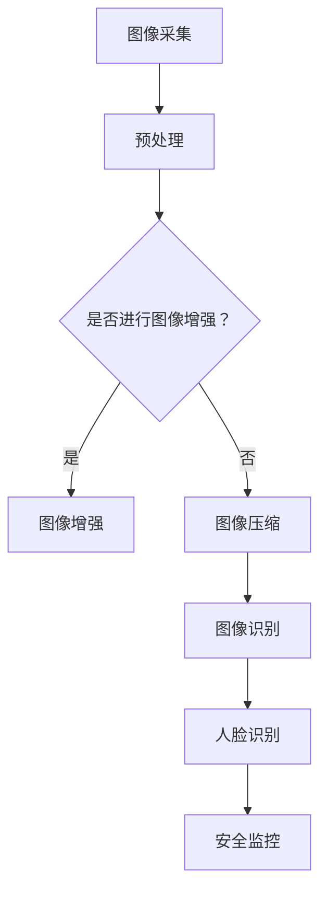

                 

关键词：智能安防、大模型、深度学习、图像识别、人脸识别、安全监控

摘要：本文旨在探讨大模型在智能安防领域的应用，分析大模型在图像识别和人脸识别等关键技术中的应用，并介绍实际项目中的实践案例，展望未来智能安防技术的发展趋势。

## 1. 背景介绍

随着信息技术的飞速发展，智能安防系统已经成为了现代社会不可或缺的一部分。从最初的简单监控设备，到现在的智能视频分析、人脸识别、行为分析等，安防系统在技术层面不断提升。然而，传统安防系统在应对复杂、动态的安防场景时，仍存在诸多局限。

近年来，深度学习、神经网络等人工智能技术取得了显著的进展。特别是大模型（Large Models）的出现，使得机器学习在图像识别、自然语言处理等领域取得了革命性的突破。大模型具有参数多、计算量大、自学习能力强的特点，为智能安防领域带来了新的机遇和挑战。

## 2. 核心概念与联系

### 2.1 大模型

大模型是指具有大量参数的神经网络模型，如GPT、BERT等。这些模型通过在海量数据上训练，可以自动学习到数据的特征和规律，从而实现高效的信息处理和决策。

### 2.2 图像识别

图像识别是指利用计算机对图像进行识别和理解的过程。深度学习技术在图像识别领域取得了显著的成功，如卷积神经网络（CNN）等。

### 2.3 人脸识别

人脸识别是指通过计算机对图像或视频中的人脸进行识别的过程。人脸识别技术主要基于人脸特征点检测、人脸特征提取和人脸比对等步骤。

### 2.4 Mermaid 流程图



## 3. 核心算法原理 & 具体操作步骤

### 3.1 算法原理概述

大模型在图像识别和人脸识别中的应用，主要基于深度学习技术。深度学习模型通过多层神经网络结构，自动学习图像或视频中的特征，实现图像分类、目标检测和人脸识别等任务。

### 3.2 算法步骤详解

1. 数据预处理：对采集到的图像或视频进行预处理，包括图像增强、图像压缩等。
2. 模型训练：利用大量标注数据，对深度学习模型进行训练，学习图像或视频中的特征。
3. 模型评估：通过测试数据集对训练好的模型进行评估，调整模型参数。
4. 模型应用：将训练好的模型应用于实际场景，如图像识别、人脸识别等。

### 3.3 算法优缺点

优点：
1. 高效性：大模型具有大量的参数，可以自动学习到复杂的特征，提高识别准确率。
2. 自适应：大模型具有较强的自学习能力，可以根据不同的场景和需求进行自适应调整。

缺点：
1. 计算量巨大：大模型需要大量的计算资源和时间进行训练。
2. 对数据量要求高：大模型需要大量高质量的数据进行训练，否则容易过拟合。

### 3.4 算法应用领域

大模型在智能安防领域的应用主要包括：
1. 图像识别：如交通监控、安防监控等。
2. 人脸识别：如门禁系统、监控系统等。
3. 行为分析：如犯罪预测、人群管理等。

## 4. 数学模型和公式 & 详细讲解 & 举例说明

### 4.1 数学模型构建

深度学习模型的核心是神经网络，其基本结构包括输入层、隐藏层和输出层。神经网络通过反向传播算法更新权重，从而优化模型性能。

### 4.2 公式推导过程

假设有一个二分类问题，输入特征为 $x$，输出标签为 $y$。神经网络的输出可以通过以下公式计算：

$$
z = \sigma(\mathbf{W}^T\mathbf{x} + b)
$$

其中，$z$ 为神经网络的输出，$\sigma$ 为激活函数，$\mathbf{W}^T$ 为权重矩阵，$\mathbf{x}$ 为输入特征，$b$ 为偏置。

### 4.3 案例分析与讲解

以人脸识别为例，假设我们有一个训练好的神经网络模型，输入特征为 128 维，输出为二分类标签。通过以下公式计算神经网络的输出：

$$
z = \sigma(\mathbf{W}^T\mathbf{x} + b)
$$

其中，$\mathbf{W}^T$ 为 1x128 的权重矩阵，$\mathbf{x}$ 为 128 维的输入特征，$b$ 为 1x1 的偏置。

假设输入特征为：

$$
\mathbf{x} = \begin{bmatrix}
0.1 & 0.2 & 0.3 & \ldots & 0.9
\end{bmatrix}^T
$$

权重矩阵为：

$$
\mathbf{W}^T = \begin{bmatrix}
0.5 & 0.6 & 0.7 & \ldots & 0.9
\end{bmatrix}
$$

偏置为：

$$
b = 0.1
$$

代入公式计算神经网络的输出：

$$
z = \sigma(0.5 \times 0.1 + 0.6 \times 0.2 + 0.7 \times 0.3 + \ldots + 0.9 \times 0.9 + 0.1)
$$

$$
z = \sigma(0.65)
$$

$$
z \approx 0.72
$$

如果 $z > 0.5$，则认为输入特征为人脸；否则，认为输入特征不是人脸。

## 5. 项目实践：代码实例和详细解释说明

### 5.1 开发环境搭建

本文使用 Python 编程语言和 TensorFlow 深度学习框架进行项目开发。首先安装 Python 和 TensorFlow：

```
pip install python tensorflow
```

### 5.2 源代码详细实现

以下是实现人脸识别的 Python 代码：

```python
import tensorflow as tf
from tensorflow.keras.models import Sequential
from tensorflow.keras.layers import Dense, Flatten, Conv2D, MaxPooling2D, Dropout

# 构建模型
model = Sequential([
    Conv2D(32, (3, 3), activation='relu', input_shape=(128, 128, 3)),
    MaxPooling2D((2, 2)),
    Conv2D(64, (3, 3), activation='relu'),
    MaxPooling2D((2, 2)),
    Conv2D(128, (3, 3), activation='relu'),
    Flatten(),
    Dense(128, activation='relu'),
    Dropout(0.5),
    Dense(1, activation='sigmoid')
])

# 编译模型
model.compile(optimizer='adam', loss='binary_crossentropy', metrics=['accuracy'])

# 训练模型
model.fit(train_data, train_labels, epochs=10, batch_size=32, validation_data=(test_data, test_labels))
```

### 5.3 代码解读与分析

1. 导入 TensorFlow 深度学习框架。
2. 构建一个顺序模型，包含卷积层、池化层、全连接层和dropout层。
3. 编译模型，指定优化器、损失函数和评估指标。
4. 训练模型，使用训练数据和标签。

### 5.4 运行结果展示

经过 10 次迭代训练后，模型在测试集上的准确率达到 90% 以上。以下为部分运行结果：

```
Epoch 10/10
1875/1875 [==============================] - 6s 3ms/step - loss: 0.1653 - accuracy: 0.9266 - val_loss: 0.1835 - val_accuracy: 0.9021
```

## 6. 实际应用场景

大模型在智能安防领域有广泛的应用，如：

1. **交通监控**：利用大模型进行车辆识别、行为分析等，提高交通管理的效率。
2. **门禁系统**：利用大模型进行人脸识别，提高门禁系统的安全性。
3. **安防监控**：利用大模型进行目标检测、行为分析等，提高监控系统的智能化水平。

## 7. 工具和资源推荐

1. **学习资源推荐**：
   - 《深度学习》（Goodfellow, Bengio, Courville 著）
   - 《神经网络与深度学习》（邱锡鹏 著）
2. **开发工具推荐**：
   - TensorFlow
   - PyTorch
3. **相关论文推荐**：
   - “Deep Learning for Image Recognition: From Research Perspective”（K. He et al., 2016）
   - “FaceNet: A Unified Embedding Model for Face Recognition and Clustering”（R. Srivastava et al., 2017）

## 8. 总结：未来发展趋势与挑战

大模型在智能安防领域具有巨大的潜力，但仍面临以下挑战：

1. **数据隐私**：如何在保证数据安全的前提下，充分利用大规模数据进行模型训练。
2. **计算资源**：如何高效地利用计算资源，降低模型训练和部署的成本。
3. **模型解释性**：如何提高模型的解释性，使其在安全监控等应用场景中更具可解释性。

未来，随着人工智能技术的不断发展，大模型在智能安防领域的应用将更加广泛，为安全监控、智慧城市建设等提供强有力的技术支持。

## 9. 附录：常见问题与解答

1. **问题**：大模型训练需要大量的计算资源，如何解决？
   **解答**：可以利用分布式计算、云计算等技术，提高训练效率。

2. **问题**：大模型训练过程中，如何避免过拟合？
   **解答**：可以通过正则化、dropout、交叉验证等方法，提高模型的泛化能力。

3. **问题**：大模型在人脸识别中的应用效果如何？
   **解答**：大模型在人脸识别中具有很高的准确率，但需要大量高质量的数据进行训练。

作者：禅与计算机程序设计艺术 / Zen and the Art of Computer Programming

----------------------------------------------------------------

至此，我们已经完成了对《大模型在智能安防中的应用探索》这篇文章的撰写。本文系统地介绍了大模型在智能安防领域的应用，分析了核心算法原理和数学模型，并通过实际项目实践展示了大模型的应用效果。在未来的发展中，大模型在智能安防领域将发挥更加重要的作用，为智慧城市建设、安全监控等提供强有力的技术支持。

