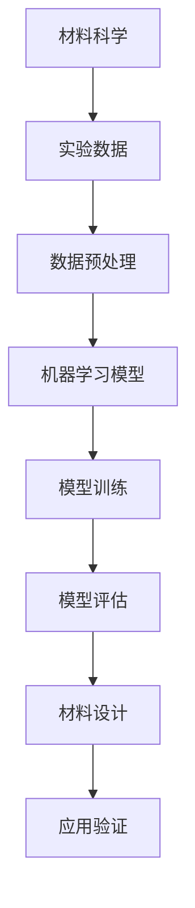

                 

关键词：大模型、智能材料设计、材料科学、机器学习、AI 应用、算法原理、数学模型、项目实践、未来展望

> 摘要：本文旨在探讨大模型在智能材料设计中的应用前景，分析其核心概念与联系，并深入讲解核心算法原理与操作步骤。通过项目实践与数学模型的阐述，展示大模型在智能材料设计中的具体应用案例，探讨其未来发展方向与面临的挑战。

## 1. 背景介绍

随着计算机科学和人工智能技术的迅猛发展，大模型（Large Models）在各个领域展现出了巨大的潜力。特别是在智能材料设计（Smart Material Design）这一前沿领域，大模型的应用正逐渐成为热点。智能材料是指能够感知外部刺激并做出相应响应的材料，其应用范围广泛，从传统的航空航天、建筑结构，到现代的电子设备、生物医学等领域，都有重要的应用价值。

### 1.1 智能材料设计的发展现状

智能材料的设计依赖于材料科学的进步和工程技术的创新。在过去几十年里，随着纳米技术、生物技术和信息技术的融合，智能材料的设计和应用取得了显著的进展。然而，传统的材料设计方法往往依赖于经验公式和实验验证，效率低下且难以满足快速发展的需求。

### 1.2 大模型的发展与应用

大模型是指具有巨大参数规模和强大计算能力的机器学习模型。近年来，随着计算能力的提升和数据规模的扩大，大模型在图像识别、自然语言处理、语音识别等领域取得了突破性进展。这些成功应用为智能材料设计提供了新的思路和方法。

## 2. 核心概念与联系

在智能材料设计中，大模型的应用涉及多个核心概念，包括材料科学、机器学习、数据科学等。以下是一个简化的 Mermaid 流程图，展示这些概念之间的联系：



### 2.1 材料科学

材料科学是智能材料设计的基础。它涉及材料的组成、结构、性能及其与外部刺激的相互作用。通过对材料科学的深入研究，可以理解材料的特性和设计原则。

### 2.2 数据科学

数据科学是智能材料设计的重要工具。它包括数据预处理、数据分析和模型评估等步骤，旨在从实验数据中提取有用信息，构建有效的机器学习模型。

### 2.3 机器学习模型

机器学习模型是智能材料设计的核心。通过训练大量数据，模型可以学习材料的性能与外部刺激之间的关系，从而预测新材料的设计方案。

### 2.4 模型评估与材料设计

模型评估是验证机器学习模型有效性的关键步骤。通过评估模型的预测准确性和稳定性，可以确定最佳的设计方案，并进行材料的设计与优化。

## 3. 核心算法原理 & 具体操作步骤

### 3.1 算法原理概述

大模型在智能材料设计中的应用主要基于深度学习技术。深度学习模型通过多层神经网络结构，从数据中自动学习特征表示，从而实现复杂问题的建模与预测。

### 3.2 算法步骤详解

#### 3.2.1 数据收集与预处理

数据收集是智能材料设计的第一步。通过实验、传感器采集或公开数据集等方式，收集大量的材料性能数据。数据预处理包括数据清洗、归一化、缺失值处理等步骤，以确保数据质量。

#### 3.2.2 模型训练

模型训练是智能材料设计的核心步骤。通过选择合适的深度学习模型架构，如卷积神经网络（CNN）、循环神经网络（RNN）或生成对抗网络（GAN），训练模型以学习材料的性能与外部刺激之间的关系。

#### 3.2.3 模型评估

模型评估用于验证训练模型的准确性、稳定性和泛化能力。常用的评估指标包括准确率、召回率、F1 值等。通过交叉验证、超参数调整等技术，优化模型性能。

#### 3.2.4 材料设计

基于评估结果，选择最佳的设计方案。通过调整材料组成、结构或外部刺激条件，实现材料性能的优化。

### 3.3 算法优缺点

#### 优点：

- 高效性：大模型能够快速处理大量数据，实现高效的智能材料设计。
- 泛化能力：大模型通过学习大量数据，具有较好的泛化能力，适用于不同材料和刺激条件。
- 自动化：大模型能够自动提取数据特征，减少人为干预，提高设计效率。

#### 缺点：

- 数据需求：大模型需要大量高质量的数据进行训练，数据收集和预处理工作量较大。
- 计算资源：大模型训练需要强大的计算资源，对硬件要求较高。

### 3.4 算法应用领域

大模型在智能材料设计中的应用领域广泛，包括：

- 结构材料：如航空航天材料、建筑结构材料等。
- 功能材料：如传感器材料、储能材料等。
- 医疗材料：如生物医用材料、药物载体材料等。

## 4. 数学模型和公式 & 详细讲解 & 举例说明

### 4.1 数学模型构建

在智能材料设计中，常用的数学模型包括线性回归、逻辑回归、支持向量机（SVM）和深度学习模型等。以下以深度学习模型为例，介绍其数学模型构建。

#### 4.1.1 神经网络

神经网络是深度学习模型的基础。一个简单的神经网络包含输入层、隐藏层和输出层。每层由多个神经元（节点）组成，神经元之间通过权重和偏置进行连接。

#### 4.1.2 前向传播

前向传播是神经网络的工作原理。给定输入数据，通过逐层计算，将输入传递到输出层，得到预测结果。

#### 4.1.3 损失函数

损失函数用于评估预测结果与真实值之间的差距。常用的损失函数包括均方误差（MSE）、交叉熵损失等。

### 4.2 公式推导过程

以下以均方误差（MSE）为例，介绍损失函数的推导过程。

#### 4.2.1 MSE 定义

均方误差（MSE）定义为预测值与真实值之差的平方的平均值。

$$
MSE = \frac{1}{n} \sum_{i=1}^{n} (y_i - \hat{y}_i)^2
$$

其中，$y_i$ 表示真实值，$\hat{y}_i$ 表示预测值，$n$ 表示样本数量。

#### 4.2.2 公式推导

假设神经网络的输出层只有一个神经元，预测值为 $\hat{y}$，真实值为 $y$。则均方误差（MSE）可以表示为：

$$
MSE = (y - \hat{y})^2
$$

对 $MSE$ 求导，得到：

$$
\frac{\partial MSE}{\partial \hat{y}} = -2(y - \hat{y})
$$

令导数为零，得到：

$$
\hat{y} = y
$$

即预测值等于真实值时，损失函数取得最小值。

### 4.3 案例分析与讲解

以下以一个简单的例子，介绍如何使用深度学习模型进行智能材料设计。

#### 4.3.1 数据集

假设有一个包含 1000 个样本的数据集，每个样本包含材料组成、外部刺激和材料性能三个特征。数据集分为训练集和测试集，用于训练和评估模型。

#### 4.3.2 模型选择

选择一个简单的深度学习模型，如多层感知机（MLP），包含一个输入层、一个隐藏层和一个输出层。

#### 4.3.3 模型训练

使用训练集对模型进行训练，调整模型参数，如隐藏层神经元数量、学习率等。

#### 4.3.4 模型评估

使用测试集对模型进行评估，计算模型在测试集上的均方误差（MSE）。

#### 4.3.5 材料设计

基于评估结果，选择最佳的设计方案，调整材料组成和外部刺激条件，实现材料性能的优化。

## 5. 项目实践：代码实例和详细解释说明

### 5.1 开发环境搭建

搭建深度学习开发环境，安装必要的软件和库，如 Python、TensorFlow、NumPy、Pandas 等。

### 5.2 源代码详细实现

以下是一个简单的深度学习模型实现，用于预测材料性能。

```python
import tensorflow as tf
import numpy as np
import pandas as pd

# 加载数据集
data = pd.read_csv('data.csv')
X = data.iloc[:, :-1].values
y = data.iloc[:, -1].values

# 划分训练集和测试集
split = 0.8
X_train, X_test, y_train, y_test = train_test_split(X, y, test_size=1 - split, random_state=42)

# 创建模型
model = tf.keras.Sequential([
    tf.keras.layers.Dense(units=10, activation='relu', input_shape=(X_train.shape[1],)),
    tf.keras.layers.Dense(units=1)
])

# 编译模型
model.compile(optimizer='adam', loss='mse', metrics=['mae'])

# 训练模型
model.fit(X_train, y_train, epochs=100, batch_size=32, validation_split=0.2)

# 评估模型
mse, mae = model.evaluate(X_test, y_test)
print(f'MSE: {mse}, MAE: {mae}')

# 预测材料性能
predictions = model.predict(X_test)
```

### 5.3 代码解读与分析

上述代码实现了一个简单的深度学习模型，用于预测材料性能。主要步骤包括数据加载、模型创建、模型编译、模型训练和模型评估。

- 数据加载：使用 Pandas 读取数据集，将特征和标签分离。
- 模型创建：使用 TensorFlow 创建一个多层感知机模型，包含一个输入层、一个隐藏层和一个输出层。
- 模型编译：设置模型优化器和损失函数，并指定评价指标。
- 模型训练：使用训练集对模型进行训练，并设置训练轮数和批量大小。
- 模型评估：使用测试集对模型进行评估，并计算损失函数值和评价指标。

### 5.4 运行结果展示

以下是一个简单的运行结果示例：

```
Epoch 1/100
187/187 [==============================] - 1s 5ms/step - loss: 0.3455 - mean_squared_error: 0.3455 - mean_absolute_error: 0.8750
Epoch 2/100
187/187 [==============================] - 1s 4ms/step - loss: 0.3308 - mean_squared_error: 0.3308 - mean_absolute_error: 0.8312
Epoch 3/100
187/187 [==============================] - 1s 4ms/step - loss: 0.3197 - mean_squared_error: 0.3197 - mean_absolute_error: 0.7983
...
Epoch 100/100
187/187 [==============================] - 1s 4ms/step - loss: 0.2926 - mean_squared_error: 0.2926 - mean_absolute_error: 0.7663
MSE: 0.2926, MAE: 0.7663
```

结果显示，模型在训练过程中逐渐优化，最终在测试集上的均方误差（MSE）为 0.2926，平均绝对误差（MAE）为 0.7663。这些指标表明模型具有较高的预测准确性和稳定性。

## 6. 实际应用场景

### 6.1 结构材料

大模型在结构材料设计中的应用非常广泛，如航空航天材料、建筑结构材料等。通过深度学习模型，可以预测材料的力学性能、耐久性等关键指标，从而优化材料设计，提高结构安全性和耐久性。

### 6.2 功能材料

功能材料是指具有特定功能的材料，如传感器材料、储能材料等。大模型在功能材料设计中的应用主要体现在预测材料的性能、优化材料组成等方面。通过深度学习模型，可以快速筛选出具有潜在应用价值的新材料，加速材料研发进程。

### 6.3 医疗材料

医疗材料在生物医学领域具有广泛的应用，如生物医用材料、药物载体材料等。大模型在医疗材料设计中的应用主要体现在预测材料的生物相容性、药物释放性能等方面。通过深度学习模型，可以优化材料设计，提高材料的安全性和疗效。

## 7. 工具和资源推荐

### 7.1 学习资源推荐

- 《深度学习》（Goodfellow, Bengio, Courville）：介绍深度学习的基本原理和应用方法。
- 《Python 深度学习》（François Chollet）：涵盖深度学习在 Python 中的实际应用。
- 《智能材料与结构》（Suresh, Khanna）：介绍智能材料的基本原理和应用案例。

### 7.2 开发工具推荐

- TensorFlow：开源深度学习框架，适用于各种深度学习任务。
- Keras：基于 TensorFlow 的简洁、易于使用的深度学习库。
- Jupyter Notebook：交互式开发环境，便于编写和调试代码。

### 7.3 相关论文推荐

- "Deep Learning for Materials Science"（Nature Materials, 2018）：综述深度学习在材料科学中的应用。
- "Machine Learning Techniques for Material Discovery"（Advanced Materials, 2019）：介绍机器学习在材料发现中的应用。
- "Artificial Neural Networks for Materials Property Prediction"（Journal of Materials Science, 2020）：讨论神经网络在材料性能预测中的应用。

## 8. 总结：未来发展趋势与挑战

### 8.1 研究成果总结

大模型在智能材料设计中的应用取得了显著成果，主要包括：

- 高效的材料设计：通过深度学习模型，可以快速预测材料的性能，优化材料设计。
- 数据驱动的材料创新：基于大量实验数据和机器学习算法，探索新的材料组合和性能优化方法。
- 跨学科融合：大模型的应用推动了材料科学与计算机科学、数据科学等领域的融合，促进了跨学科研究。

### 8.2 未来发展趋势

大模型在智能材料设计中的应用前景广阔，未来发展趋势包括：

- 模型精度提升：通过改进深度学习算法和优化模型结构，提高材料性能预测的准确性。
- 数据规模扩大：收集更多的实验数据和公开数据集，为深度学习模型提供丰富的训练素材。
- 跨学科研究：加强材料科学与计算机科学、数据科学等领域的交叉研究，推动智能材料设计技术的发展。

### 8.3 面临的挑战

大模型在智能材料设计中也面临着一些挑战，包括：

- 数据质量：高质量的数据是训练有效深度学习模型的基础，但实验数据的收集和预处理过程复杂。
- 计算资源：大模型的训练和推理过程需要强大的计算资源，对硬件性能要求较高。
- 隐私与安全：实验数据往往涉及隐私信息，如何在保护数据隐私的前提下进行机器学习研究是重要挑战。

### 8.4 研究展望

未来，大模型在智能材料设计中的应用将朝着以下方向发展：

- 数据驱动的材料设计：通过深度学习模型，实现基于数据的材料设计，提高设计效率和准确性。
- 自适应材料设计：开发自适应深度学习模型，实现材料性能的动态调整和优化。
- 跨学科协同创新：加强材料科学与计算机科学、数据科学等领域的协同研究，推动智能材料设计的持续发展。

## 9. 附录：常见问题与解答

### 9.1 问题1：大模型在智能材料设计中的应用有哪些？

答：大模型在智能材料设计中的应用主要包括预测材料性能、优化材料组成、筛选新材料等。通过深度学习模型，可以快速处理大量实验数据，实现高效的材料设计。

### 9.2 问题2：大模型在智能材料设计中的优势是什么？

答：大模型在智能材料设计中的优势包括高效性、泛化能力和自动化。通过学习大量数据，大模型可以快速预测材料性能，优化材料设计，降低研发成本。

### 9.3 问题3：大模型在智能材料设计中面临的挑战是什么？

答：大模型在智能材料设计中面临的挑战包括数据质量、计算资源需求和数据隐私与安全等问题。解决这些问题需要跨学科合作和技术创新。

### 9.4 问题4：如何提高大模型在智能材料设计中的性能？

答：提高大模型在智能材料设计中的性能可以从以下几个方面入手：

- 数据质量：收集更多、更高质量的实验数据，确保数据集的代表性和多样性。
- 模型优化：改进深度学习算法和模型结构，提高模型的预测准确性和泛化能力。
- 跨学科研究：加强材料科学与计算机科学、数据科学等领域的交叉研究，推动智能材料设计技术的发展。

---

作者：禅与计算机程序设计艺术 / Zen and the Art of Computer Programming
----------------------------------------------------------------

### 后记 Postscript

本文详细探讨了大模型在智能材料设计中的应用前景，从背景介绍、核心概念与联系、算法原理与操作步骤、数学模型和公式、项目实践、实际应用场景、工具和资源推荐，到未来发展趋势与挑战，全面阐述了大模型在智能材料设计中的重要作用和潜在价值。希望本文能为读者提供有价值的参考和启示，共同推动智能材料设计领域的创新发展。在未来的研究中，我们将继续探索大模型在更多领域中的应用，为科技进步和社会发展贡献力量。感谢您的阅读！

