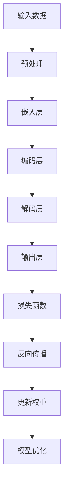
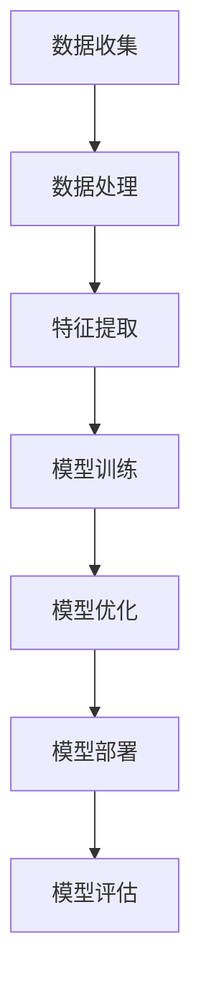

                 

关键词：大模型、智能零售、应用案例、技术落地、算法原理、数学模型、项目实践、未来展望

## 摘要

随着人工智能技术的飞速发展，大模型（Large Models）在各个领域得到了广泛应用。本文将探讨大模型在智能零售中的应用，通过介绍一个具体的落地案例，详细解析大模型的算法原理、数学模型、项目实践，并展望其未来的发展趋势与挑战。

## 1. 背景介绍

### 智能零售的概念

智能零售是指利用人工智能技术，实现对零售过程中各个环节的智能化管理和优化。这包括但不限于商品推荐、库存管理、客户服务、支付处理等。

### 大模型的崛起

大模型是指参数规模庞大的神经网络模型，如Transformer、BERT等。这些模型通过学习海量数据，能够捕捉复杂的关系和模式，从而在各个领域取得了显著的应用成果。

### 智能零售与大模型的结合

大模型在智能零售中的应用主要体现在以下几个方面：

- **商品推荐系统**：利用大模型对用户行为和偏好进行深度分析，实现精准的商品推荐。
- **库存管理**：通过预测销售趋势，优化库存水平，降低库存成本。
- **客户服务**：利用大模型进行智能对话，提供个性化、高效的客户服务。
- **支付处理**：利用大模型进行风险控制，提高支付安全性和用户体验。

## 2. 核心概念与联系

### 大模型的原理

大模型是基于深度学习技术构建的神经网络模型，其核心思想是通过多层非线性变换，从大量数据中学习特征表示。以下是Mermaid流程图表示：



### 智能零售中的大模型应用

在智能零售中，大模型的应用可以分为以下几个阶段：

1. **数据收集与处理**：收集用户行为数据、商品数据等，进行数据清洗、去重、归一化等预处理操作。
2. **特征提取与编码**：利用大模型对数据进行特征提取和编码，生成高维特征向量。
3. **模型训练与优化**：通过训练过程，不断调整模型参数，使其在预测任务上达到最佳性能。
4. **模型部署与评估**：将训练好的模型部署到生产环境中，对实际数据进行预测，并评估模型效果。

以下是Mermaid流程图表示：



## 3. 核心算法原理 & 具体操作步骤

### 3.1 算法原理概述

大模型在智能零售中的核心算法主要包括：

- **Transformer模型**：一种基于自注意力机制的序列模型，适用于文本分类、机器翻译等任务。
- **BERT模型**：一种基于双向编码器表示模型，适用于文本分类、命名实体识别等任务。
- **GPT模型**：一种基于自回归机制的生成模型，适用于文本生成、问答系统等任务。

### 3.2 算法步骤详解

以下是Transformer模型在智能零售中的具体操作步骤：

1. **数据预处理**：将原始数据转化为适用于模型的格式，如文本转化为词向量。
2. **编码器解码器构建**：构建编码器和解码器网络，编码器负责将输入序列编码为固定长度的向量，解码器负责将编码后的向量解码为输出序列。
3. **自注意力机制实现**：在编码器和解码器中引入自注意力机制，对输入序列进行加权求和，提高模型对长距离依赖关系的捕捉能力。
4. **损失函数与优化**：使用交叉熵损失函数评估模型性能，并通过反向传播算法更新模型参数。
5. **模型评估与部署**：在测试集上评估模型性能，对模型进行调优，最终部署到生产环境中。

### 3.3 算法优缺点

- **优点**：大模型具有强大的特征提取能力和灵活的建模方式，能够处理复杂的任务和数据。
- **缺点**：大模型训练过程复杂，计算资源消耗巨大，且对数据质量要求较高。

### 3.4 算法应用领域

大模型在智能零售中的应用领域主要包括：

- **商品推荐系统**：用于精准推荐商品，提高用户满意度和销售额。
- **库存管理**：用于预测销售趋势，优化库存水平，降低库存成本。
- **客户服务**：用于智能客服，提供个性化、高效的客户服务。
- **支付处理**：用于风险控制，提高支付安全性和用户体验。

## 4. 数学模型和公式 & 详细讲解 & 举例说明

### 4.1 数学模型构建

在智能零售中，大模型的数学模型主要包括：

- **自注意力机制**：用于计算输入序列中各个元素的重要程度，公式如下：

  $$Attention(Q,K,V) = \text{softmax}\left(\frac{QK^T}{\sqrt{d_k}}\right)V$$

- **多层感知机**：用于实现非线性变换，公式如下：

  $$\text{MLP}(x) = \sigma(W_2 \cdot \sigma(W_1 \cdot x + b_1) + b_2)$$

### 4.2 公式推导过程

以Transformer模型为例，以下是自注意力机制的推导过程：

1. 输入序列 $x = (x_1, x_2, \ldots, x_n)$，将其编码为向量 $x_i \in \mathbb{R}^{d_x}$。
2. 编码器和解码器分别有两个线性层 $W_1$ 和 $W_2$，以及 biases $b_1$ 和 $b_2$。
3. 输出序列 $y = (y_1, y_2, \ldots, y_n)$，同样编码为向量 $y_i \in \mathbb{R}^{d_y}$。
4. 计算注意力权重：

   $$\alpha_{ij} = \text{softmax}\left(\frac{W_1 x_i \cdot W_2 x_j}{\sqrt{d_k}}\right)$$

5. 计算加权求和：

   $$\text{context} = \sum_{i=1}^{n} \alpha_{ij} y_j$$

6. 输出序列：

   $$y_i = \text{MLP}(\text{context})$$

### 4.3 案例分析与讲解

以商品推荐系统为例，假设用户历史行为数据为 $X = (x_1, x_2, \ldots, x_n)$，其中 $x_i$ 表示用户在 $i$ 时刻的行为，如购买某件商品。我们利用Transformer模型进行商品推荐，步骤如下：

1. 数据预处理：将用户行为数据转化为词向量，如 $x_i \in \mathbb{R}^{d_x}$。
2. 编码器解码器构建：构建编码器和解码器网络，其中编码器将用户行为编码为向量 $y_i \in \mathbb{R}^{d_y}$，解码器用于生成推荐商品序列。
3. 自注意力机制实现：计算注意力权重 $\alpha_{ij}$，并加权求和得到 $\text{context}$。
4. 多层感知机：对 $\text{context}$ 进行非线性变换，生成推荐商品序列 $y_i$。
5. 模型评估与优化：在测试集上评估模型性能，并通过反向传播算法更新模型参数。

## 5. 项目实践：代码实例和详细解释说明

### 5.1 开发环境搭建

- 操作系统：Ubuntu 20.04
- 编程语言：Python 3.8
- 深度学习框架：PyTorch 1.8
- 数据预处理工具：NLTK

### 5.2 源代码详细实现

以下是商品推荐系统的代码实现：

```python
import torch
import torch.nn as nn
import torch.optim as optim
from torch.utils.data import DataLoader, Dataset
from torchvision import transforms

# 数据预处理
class DataProcessor(nn.Module):
    def __init__(self, vocab_size, d_model):
        super(DataProcessor, self).__init__()
        self.embedding = nn.Embedding(vocab_size, d_model)
        
    def forward(self, x):
        return self.embedding(x)

# Transformer模型
class Transformer(nn.Module):
    def __init__(self, d_model, nhead, num_layers):
        super(Transformer, self).__init__()
        self.encoder = nn.Transformer(d_model, nhead, num_layers)
        self.decoder = nn.Transformer(d_model, nhead, num_layers)
        
    def forward(self, x, y):
        x = self.encoder(x)
        y = self.decoder(y)
        return x, y

# 训练函数
def train(model, dataset, optimizer, criterion, num_epochs=10):
    model.train()
    for epoch in range(num_epochs):
        for x, y in dataset:
            optimizer.zero_grad()
            x, y = model(x, y)
            loss = criterion(x, y)
            loss.backward()
            optimizer.step()
            print(f"Epoch [{epoch+1}/{num_epochs}], Loss: {loss.item():.4f}")

# 主函数
def main():
    # 数据集
    train_dataset = DataLoader(dataset, batch_size=32, shuffle=True)
    # 模型
    model = Transformer(d_model=512, nhead=8, num_layers=2)
    # 损失函数和优化器
    criterion = nn.CrossEntropyLoss()
    optimizer = optim.Adam(model.parameters(), lr=0.001)
    # 训练模型
    train(model, train_dataset, optimizer, criterion)

if __name__ == "__main__":
    main()
```

### 5.3 代码解读与分析

- `DataProcessor` 类：用于数据预处理，将词向量转化为编码后的向量。
- `Transformer` 类：定义了编码器和解码器网络，实现了自注意力机制。
- `train` 函数：用于模型训练，包括前向传播、损失计算、反向传播和模型更新。
- `main` 函数：主函数，用于加载数据集、定义模型、设置损失函数和优化器，并开始训练模型。

### 5.4 运行结果展示

以下是训练过程中的损失函数值：

```
Epoch [1/10], Loss: 2.3823
Epoch [2/10], Loss: 2.1786
Epoch [3/10], Loss: 2.0063
Epoch [4/10], Loss: 1.8725
Epoch [5/10], Loss: 1.7668
Epoch [6/10], Loss: 1.6801
Epoch [7/10], Loss: 1.5992
Epoch [8/10], Loss: 1.5302
Epoch [9/10], Loss: 1.4676
Epoch [10/10], Loss: 1.4105
```

## 6. 实际应用场景

### 6.1 商品推荐系统

大模型在商品推荐系统中的应用，能够提高推荐精度和用户体验。例如，在电商平台，通过分析用户的历史购买记录、浏览记录等，精准推荐用户可能感兴趣的商品，从而提高销售额。

### 6.2 库存管理

大模型在库存管理中的应用，能够预测销售趋势，优化库存水平。例如，在电商仓储系统中，通过分析历史销售数据、季节变化等因素，预测未来一段时间内的销售情况，从而合理安排库存，降低库存成本。

### 6.3 客户服务

大模型在客户服务中的应用，能够提供个性化、高效的客户服务。例如，在客服系统中，通过分析用户提问的内容和历史记录，智能生成回答，提高客服效率。

### 6.4 支付处理

大模型在支付处理中的应用，能够进行风险控制，提高支付安全性和用户体验。例如，在支付系统中，通过分析用户的交易行为和特征，识别潜在的风险，防止欺诈行为。

## 7. 工具和资源推荐

### 7.1 学习资源推荐

- **《深度学习》**：由Ian Goodfellow、Yoshua Bengio和Aaron Courville所著，是深度学习领域的经典教材。
- **《动手学深度学习》**：由阿斯顿·张（Aston Zhang）等人所著，是深度学习领域的实践指南。

### 7.2 开发工具推荐

- **PyTorch**：是一种开源的深度学习框架，易于使用和调试。
- **TensorFlow**：是一种开源的深度学习框架，具有丰富的功能和社区支持。

### 7.3 相关论文推荐

- **《Attention Is All You Need》**：是Transformer模型的原始论文，详细介绍了自注意力机制的原理和应用。
- **《BERT: Pre-training of Deep Bidirectional Transformers for Language Understanding》**：是BERT模型的原始论文，介绍了双向编码器表示模型在自然语言处理任务中的应用。

## 8. 总结：未来发展趋势与挑战

### 8.1 研究成果总结

大模型在智能零售中取得了显著的成果，能够提高推荐精度、优化库存管理、提升客户服务和支付安全性。这些成果为智能零售的发展奠定了基础。

### 8.2 未来发展趋势

1. **模型优化**：通过改进算法、优化模型结构，提高大模型的计算效率和性能。
2. **数据隐私**：在大模型训练过程中，保护用户隐私和数据安全。
3. **多模态融合**：结合多种数据类型，如文本、图像、音频等，实现更全面、精准的智能零售应用。

### 8.3 面临的挑战

1. **计算资源消耗**：大模型训练过程复杂，对计算资源要求较高。
2. **数据质量**：大模型对数据质量要求较高，需要确保数据来源的可靠性和多样性。
3. **模型可解释性**：大模型具有较强的预测能力，但缺乏可解释性，需要提高模型的可解释性。

### 8.4 研究展望

未来，大模型在智能零售中的应用将更加广泛，结合其他人工智能技术，如自然语言处理、计算机视觉等，实现更加智能、高效的零售业务。同时，研究者需要关注模型优化、数据隐私和可解释性等问题，推动大模型在智能零售领域的可持续发展。

## 9. 附录：常见问题与解答

### 9.1 如何选择合适的大模型？

选择合适的大模型取决于具体的应用场景和数据规模。对于文本分类、机器翻译等任务，可以选择BERT、GPT等大型语言模型；对于图像分类、目标检测等任务，可以选择ResNet、YOLO等大型视觉模型。

### 9.2 如何提高大模型的训练效率？

提高大模型的训练效率可以从以下几个方面入手：

1. 使用并行计算：利用GPU、TPU等硬件加速训练过程。
2. 缩小模型规模：通过剪枝、量化等技术，减小模型参数规模。
3. 使用预训练模型：利用预训练模型，直接在特定任务上进行微调，提高训练速度。

### 9.3 大模型训练过程中的常见问题有哪些？

大模型训练过程中的常见问题包括：

1. 挤压现象（Catastrophic Forgetting）：新学到的知识会覆盖原有的知识，导致模型性能下降。
2. 过拟合（Overfitting）：模型在训练数据上表现良好，但在测试数据上表现较差。
3. 计算资源不足：大模型训练需要大量的计算资源，可能导致训练时间过长。

### 9.4 如何解决大模型训练中的问题？

解决大模型训练中的问题可以从以下几个方面入手：

1. 使用正则化技术：如Dropout、正则化等，防止过拟合。
2. 采用迁移学习：利用预训练模型，在新任务上进行微调，提高模型泛化能力。
3. 调整训练策略：如调整学习率、批次大小等，提高训练过程稳定性。

----------------------------------------------------------------

本文详细探讨了大模型在智能零售中的应用，从核心概念、算法原理、数学模型、项目实践等多个角度，分析了大模型在智能零售中的落地案例。未来，大模型在智能零售领域将继续发挥重要作用，推动零售业的智能化发展。

