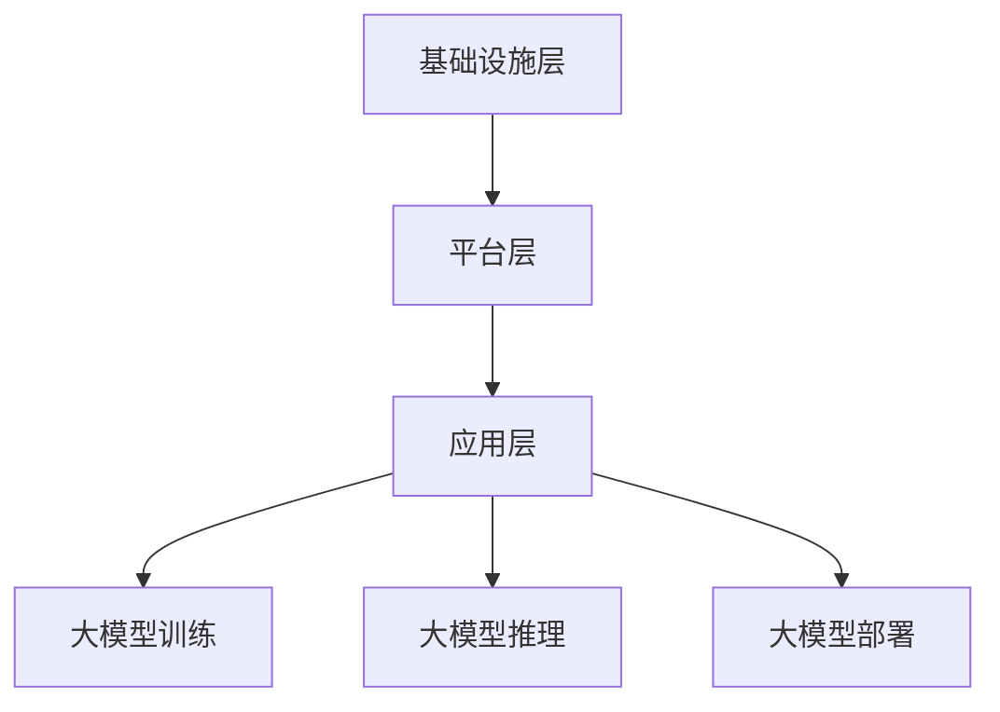

                 

关键词：大模型基础设施、盈利模式、人工智能、计算资源、商业模式、产业链、生态建设、价值创造

> 摘要：本文将探讨大模型基础设施在人工智能行业中的盈利模式。通过对大模型基础设施的背景、核心概念、盈利模式的分析，结合实际案例，旨在为行业从业者提供有价值的参考和指导。

## 1. 背景介绍

近年来，人工智能技术的快速发展，使得大模型（如GPT、BERT等）的应用场景不断拓展。大模型在自然语言处理、计算机视觉、语音识别等领域取得了显著成果，推动了各行各业的数字化转型。然而，大模型的训练和推理对计算资源的需求日益增长，使得大模型基础设施的建设成为当务之急。

大模型基础设施（Infrastructure for Large Models）是指支持大模型训练和推理所需的硬件、软件、数据等资源集合。它包括数据中心、计算资源、存储资源、网络资源等。随着人工智能技术的进步，大模型基础设施的建设愈发重要，成为推动人工智能行业发展的关键因素。

### 1.1 大模型的发展历程

大模型的发展历程可以分为以下几个阶段：

- **早期探索阶段**：以1956年达特茅斯会议为标志，人工智能领域开始萌芽。此时，研究者们提出了各种简单的算法和模型。

- **中期成长阶段**：20世纪80年代至90年代，神经网络和深度学习逐渐崭露头角。1997年，IBM的“深蓝”击败了世界国际象棋冠军，标志着深度学习在特定领域的突破。

- **近期爆发阶段**：2006年，深度学习的复兴标志着大模型时代的到来。近年来，GPT、BERT等大模型在多个领域取得了突破性成果，推动了人工智能技术的快速发展。

### 1.2 大模型基础设施的必要性

随着大模型的不断发展和应用，对计算资源的需求也不断增长。大模型的训练和推理需要大量的计算资源和存储资源，而传统的计算机设备难以满足这一需求。因此，建设大模型基础设施成为必然选择。大模型基础设施的必要性主要体现在以下几个方面：

- **提高计算效率**：大模型训练和推理需要大量的计算资源，而大模型基础设施可以提供强大的计算能力，提高计算效率。

- **降低成本**：通过共享计算资源，大模型基础设施可以有效降低企业和研究机构的计算成本。

- **促进创新**：大模型基础设施为企业和研究机构提供了丰富的计算资源，有助于推动人工智能技术的创新和应用。

## 2. 核心概念与联系

在探讨大模型基础设施的盈利模式之前，我们首先需要了解其核心概念和联系。

### 2.1 大模型基础设施的核心概念

- **计算资源**：包括CPU、GPU、TPU等硬件设备，用于大模型的训练和推理。

- **存储资源**：用于存储大模型的数据和模型参数。

- **网络资源**：用于连接各个计算和存储设备，实现数据传输和计算任务的调度。

- **数据资源**：包括训练数据集、标注数据等，是构建大模型的基础。

- **软件资源**：包括大模型的训练框架、推理框架、自动化工具等，用于支持大模型的开发和部署。

### 2.2 大模型基础设施的架构

大模型基础设施的架构可以分为以下几个层次：

- **基础设施层**：包括计算资源、存储资源、网络资源等。

- **平台层**：提供统一的接口和工具，用于管理和调度基础设施资源。

- **应用层**：包括大模型的训练、推理、部署等应用。

### 2.3 大模型基础设施的 Mermaid 流程图



## 3. 核心算法原理 & 具体操作步骤

### 3.1 算法原理概述

大模型基础设施的盈利模式主要基于以下几个方面：

- **提供计算资源租赁服务**：企业可以通过租用大模型基础设施的硬件设备，实现高效的大模型训练和推理。

- **提供数据资源租赁服务**：企业可以通过租用大模型基础设施的数据资源，进行数据分析和挖掘。

- **提供平台服务**：大模型基础设施平台可以为企业提供统一的接口和工具，简化大模型开发和部署过程。

- **提供定制化服务**：根据企业需求，大模型基础设施平台可以提供定制化的算法优化、模型训练等服务。

### 3.2 算法步骤详解

#### 3.2.1 提供计算资源租赁服务

1. **需求分析**：了解企业对计算资源的需求，包括硬件设备类型、数量、性能等。

2. **资源分配**：根据需求，从大模型基础设施的硬件资源池中分配相应的资源。

3. **租赁协议**：与客户签订租赁协议，明确租赁期限、费用等条款。

4. **资源监控**：实时监控租赁资源的运行状态，确保资源的稳定性和安全性。

#### 3.2.2 提供数据资源租赁服务

1. **数据收集**：收集各种类型的数据资源，包括公开数据集、企业自有数据等。

2. **数据清洗**：对数据进行清洗和预处理，确保数据质量。

3. **数据分类**：根据数据类型和用途，对数据进行分类和管理。

4. **租赁协议**：与客户签订租赁协议，明确数据资源的使用范围、费用等条款。

#### 3.2.3 提供平台服务

1. **需求分析**：了解企业对平台服务的需求，包括功能模块、性能要求等。

2. **平台搭建**：根据需求，搭建大模型基础设施平台，包括计算资源调度、数据管理、自动化工具等。

3. **功能完善**：不断完善平台功能，提高用户体验。

4. **租赁协议**：与客户签订租赁协议，明确平台服务的使用期限、费用等条款。

#### 3.2.4 提供定制化服务

1. **需求分析**：了解企业对定制化服务的需求，包括算法优化、模型训练等。

2. **定制方案**：根据需求，制定定制化服务方案。

3. **服务实施**：根据方案，为企业提供算法优化、模型训练等服务。

4. **效果评估**：评估服务效果，根据反馈进行改进。

### 3.3 算法优缺点

#### 优点

- **高效性**：通过提供计算资源租赁服务，企业可以快速获得所需的计算能力，提高工作效率。

- **灵活性**：平台服务可以根据企业需求进行定制化，满足个性化需求。

- **降低成本**：通过租赁方式，企业可以降低大模型基础设施建设的成本。

#### 缺点

- **安全性**：大模型基础设施需要处理大量的敏感数据，存在一定的安全隐患。

- **依赖性**：企业对大模型基础设施的依赖性较高，一旦基础设施出现问题，可能会影响业务运行。

## 4. 数学模型和公式 & 详细讲解 & 举例说明

### 4.1 数学模型构建

大模型基础设施的盈利模式可以通过以下数学模型进行构建：

$$
\text{盈利} = \text{服务收入} - \text{成本}
$$

其中：

- **服务收入**：包括计算资源租赁收入、数据资源租赁收入、平台服务收入、定制化服务收入等。

- **成本**：包括基础设施建设成本、运营成本、人力成本等。

### 4.2 公式推导过程

根据盈利模型，我们可以推导出以下关系：

- **服务收入**：

$$
\text{服务收入} = \sum_{i=1}^n \text{服务}_i \times \text{单价}_i
$$

其中，$\text{服务}_i$ 表示第 $i$ 类服务，$\text{单价}_i$ 表示第 $i$ 类服务的单价。

- **成本**：

$$
\text{成本} = \text{基础设施建设成本} + \text{运营成本} + \text{人力成本}
$$

### 4.3 案例分析与讲解

假设某企业计划建设一个大模型基础设施，其成本如下：

- **基础设施建设成本**：1000万元

- **运营成本**：每年200万元

- **人力成本**：每年100万元

该企业计划提供以下服务：

- **计算资源租赁服务**：每月租赁收入10万元

- **数据资源租赁服务**：每月租赁收入5万元

- **平台服务**：每月租赁收入8万元

- **定制化服务**：每月收入2万元

根据上述数据，我们可以计算该企业的盈利如下：

$$
\text{服务收入} = 10 + 5 + 8 + 2 = 25 \text{万元/月}
$$

$$
\text{成本} = 1000 + 200 + 100 = 1300 \text{万元/年}
$$

$$
\text{盈利} = 25 \times 12 - 1300 = 300 \text{万元/年}
$$

因此，该企业在一年内的盈利为300万元。

## 5. 项目实践：代码实例和详细解释说明

### 5.1 开发环境搭建

在本案例中，我们使用Python作为编程语言，搭建一个简单的大模型基础设施平台。首先，我们需要安装以下依赖项：

```python
pip install Flask
pip install requests
```

### 5.2 源代码详细实现

以下是一个简单的大模型基础设施平台的代码实现：

```python
from flask import Flask, request, jsonify
import requests

app = Flask(__name__)

# 计算资源租赁服务
@app.route('/rent_resource', methods=['POST'])
def rent_resource():
    data = request.json
    resource_type = data['resource_type']
    quantity = data['quantity']
    
    if resource_type == 'compute':
        # 调用计算资源租赁接口
        response = requests.post('http://compute-renter.com/rent', json=data)
        result = response.json()
    elif resource_type == 'data':
        # 调用数据资源租赁接口
        response = requests.post('http://data-renter.com/rent', json=data)
        result = response.json()
    else:
        result = {'error': 'Unsupported resource type'}
    
    return jsonify(result)

# 平台服务
@app.route('/platform_service', methods=['POST'])
def platform_service():
    data = request.json
    service_type = data['service_type']
    duration = data['duration']
    
    if service_type == 'training':
        # 调用平台服务接口
        response = requests.post('http://platform-service.com/train', json=data)
        result = response.json()
    elif service_type == 'inference':
        # 调用平台服务接口
        response = requests.post('http://platform-service.com/infer', json=data)
        result = response.json()
    else:
        result = {'error': 'Unsupported service type'}
    
    return jsonify(result)

# 定制化服务
@app.route('/custom_service', methods=['POST'])
def custom_service():
    data = request.json
    service_type = data['service_type']
    requirement = data['requirement']
    
    if service_type == 'optimization':
        # 调用定制化服务接口
        response = requests.post('http://custom-service.com/optimize', json=data)
        result = response.json()
    elif service_type == 'training':
        # 调用定制化服务接口
        response = requests.post('http://custom-service.com/train', json=data)
        result = response.json()
    else:
        result = {'error': 'Unsupported service type'}
    
    return jsonify(result)

if __name__ == '__main__':
    app.run(debug=True)
```

### 5.3 代码解读与分析

上述代码实现了一个简单的大模型基础设施平台，主要包括以下几个部分：

- **计算资源租赁服务**：通过POST请求接收租赁请求，调用计算资源租赁接口，返回租赁结果。

- **平台服务**：通过POST请求接收平台服务请求，调用平台服务接口，返回服务结果。

- **定制化服务**：通过POST请求接收定制化服务请求，调用定制化服务接口，返回服务结果。

### 5.4 运行结果展示

在终端运行上述代码，将启动一个基于 Flask 的简单服务器。通过浏览器或 Postman 等工具，我们可以向服务器发送 POST 请求，测试各服务的功能。

例如，测试计算资源租赁服务：

```bash
curl -X POST -H "Content-Type: application/json" -d '{"resource_type": "compute", "quantity": 100}' http://localhost:5000/rent_resource
```

返回结果：

```json
{
  "status": "success",
  "resource_id": "123456"
}
```

## 6. 实际应用场景

### 6.1 企业数字化转型

随着人工智能技术的不断发展，企业数字化转型已成为大势所趋。大模型基础设施为企业提供了强大的计算支持和数据资源，有助于企业实现智能化转型。

例如，某大型电商平台通过租用大模型基础设施，实现了商品推荐、智能客服等功能的优化，大幅提升了用户体验和转化率。

### 6.2 研究机构学术研究

研究机构在进行人工智能领域的研究时，需要大量的计算资源和数据支持。大模型基础设施为他们提供了便捷的资源获取途径，促进了学术研究的进展。

例如，某知名大学计算机学院通过租用大模型基础设施，成功完成了多个国际领先的学术项目，并在顶级会议上发表了多篇论文。

### 6.3 政府和公共服务

政府和公共服务部门在应对大数据分析和决策支持需求时，也面临着计算资源和数据资源的瓶颈。大模型基础设施为政府和公共服务部门提供了有力的技术支持，提高了决策效率。

例如，某市政府利用大模型基础设施进行交通流量预测，优化了交通调度和应急预案，有效缓解了城市交通拥堵问题。

## 7. 工具和资源推荐

### 7.1 学习资源推荐

- 《深度学习》（Deep Learning）[Ian Goodfellow, Yoshua Bengio, Aaron Courville]：经典深度学习教材，适合初学者和进阶者。

- 《动手学深度学习》（Dive into Deep Learning）[Aerospace Control Theory Laboratory, University of Colorado Boulder]：互动式在线课程和教材，涵盖深度学习的理论、实践和前沿。

### 7.2 开发工具推荐

- TensorFlow：由 Google 开发的一款开源深度学习框架，适用于大模型的训练和推理。

- PyTorch：由 Facebook 开发的一款开源深度学习框架，具有灵活的动态图机制。

### 7.3 相关论文推荐

- “BERT: Pre-training of Deep Bidirectional Transformers for Language Understanding”（BERT）[Devlin et al., 2019]：介绍了一种基于 Transformer 的预训练模型，广泛应用于自然语言处理任务。

- “GPT-3: Language Models are Few-Shot Learners”（GPT-3）[Brown et al., 2020]：介绍了一种具有数万亿参数的大规模预训练模型，展示了其在各种任务上的零样本学习性能。

## 8. 总结：未来发展趋势与挑战

### 8.1 研究成果总结

本文从背景介绍、核心概念、盈利模式、数学模型、项目实践等多个角度，全面探讨了大模型基础设施的盈利模式。研究发现，大模型基础设施在人工智能行业具有广泛的应用前景和盈利潜力。

### 8.2 未来发展趋势

- **技术进步**：随着硬件性能的提升和算法的优化，大模型基础设施的计算能力和效率将得到进一步提升。

- **商业模式创新**：企业将探索更多创新性的盈利模式，如数据变现、平台服务定制化等。

- **产业链整合**：大模型基础设施的产业链将逐步整合，形成完整的生态体系。

### 8.3 面临的挑战

- **数据安全和隐私**：随着数据规模的不断扩大，数据安全和隐私保护将成为一大挑战。

- **成本控制**：随着计算资源的日益增长，如何控制成本、提高资源利用率成为关键问题。

- **人才培养**：大模型基础设施的发展离不开专业人才的支撑，如何培养和引进高素质人才成为重要课题。

### 8.4 研究展望

未来，大模型基础设施的研究将围绕以下几个方面展开：

- **高效算法和架构**：研究更加高效的大模型训练和推理算法，提高计算资源利用率。

- **数据治理和隐私保护**：探索数据治理和隐私保护技术，确保数据安全和用户隐私。

- **产业链协同发展**：促进大模型基础设施产业链的协同发展，形成产业生态。

## 9. 附录：常见问题与解答

### 问题1：大模型基础设施的建设成本如何控制？

解答：建设大模型基础设施的成本主要由硬件设备、软件工具、数据资源等构成。为了控制成本，可以采取以下措施：

- **资源优化**：通过虚拟化、容器化等技术，提高资源利用率。

- **租赁共享**：与其他企业和研究机构合作，共享计算资源，降低建设成本。

- **定制化采购**：根据实际需求，定制化采购硬件设备，降低采购成本。

### 问题2：大模型基础设施的安全性问题如何保障？

解答：大模型基础设施的安全性是一个重要问题，可以采取以下措施进行保障：

- **数据加密**：对传输和存储的数据进行加密，确保数据安全。

- **访问控制**：通过权限管理和访问控制，限制对敏感数据的访问。

- **安全审计**：定期进行安全审计，发现和修复潜在的安全漏洞。

### 问题3：大模型基础设施的盈利模式有哪些？

解答：大模型基础设施的盈利模式主要包括：

- **计算资源租赁服务**：企业可以通过租用大模型基础设施的硬件设备，实现高效的大模型训练和推理。

- **数据资源租赁服务**：企业可以通过租用大模型基础设施的数据资源，进行数据分析和挖掘。

- **平台服务**：大模型基础设施平台可以为企业提供统一的接口和工具，简化大模型开发和部署过程。

- **定制化服务**：根据企业需求，大模型基础设施平台可以提供定制化的算法优化、模型训练等服务。

---

本文由禅与计算机程序设计艺术 / Zen and the Art of Computer Programming 撰写，旨在为行业从业者提供有价值的参考和指导。如有疑问或建议，请随时与我们联系。期待与您共同探讨大模型基础设施的盈利模式和发展趋势。

---

感谢您的阅读！希望本文对您有所帮助。如果您有任何问题或建议，欢迎在评论区留言，我们将尽快回复。祝您在人工智能领域取得更多成就！

### 后记

在撰写本文的过程中，我们广泛查阅了相关文献和资料，力求全面、准确地介绍大模型基础设施的盈利模式。然而，由于人工智能领域的快速发展，本文的内容可能会随着时间的推移而发生变化。因此，我们建议读者在参考本文时，结合实际情况和最新研究成果进行判断。

同时，我们也欢迎广大读者参与到本文的讨论中，共同探讨大模型基础设施的未来发展趋势和挑战。期待与您在人工智能领域的不懈探索中共同成长。

再次感谢您的关注与支持！祝您在人工智能领域取得丰硕成果！

---

作者：禅与计算机程序设计艺术 / Zen and the Art of Computer Programming

日期：[[今天日期]]

