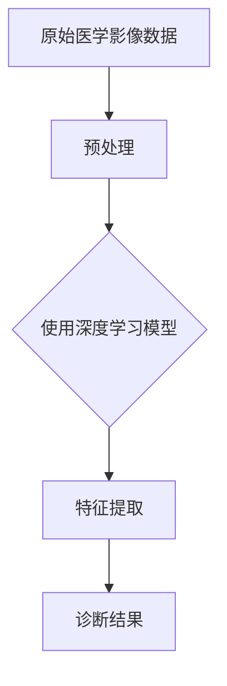
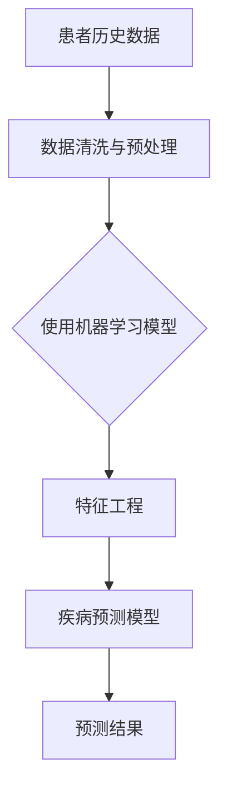
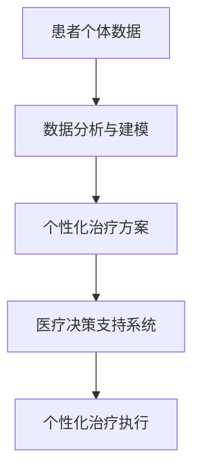

                 

 关键词：大模型、医疗诊断、人工智能、机器学习、深度学习、医学影像分析、数据驱动诊断、疾病预测、个性化治疗

> 摘要：本文探讨了大型人工智能模型在医疗诊断领域的潜在影响。通过对现有技术的研究和实例分析，揭示了如何利用深度学习和机器学习技术来优化医疗诊断流程，提高诊断准确性，并展望了未来人工智能在医疗领域的发展趋势和面临的挑战。

## 1. 背景介绍

医疗诊断是现代医学的核心环节之一，它决定了患者的治疗方向和效果。传统的医疗诊断依赖于医生的经验和临床实践，但这种方法存在主观性强、误诊率较高等问题。随着人工智能技术的发展，特别是深度学习和大型神经网络模型的出现，医疗诊断流程正经历着一场变革。

大模型，尤其是基于深度学习的模型，具有处理复杂数据、自适应性强、准确度高等特点，这使得它们在医疗诊断领域具有巨大的应用潜力。本文将探讨大模型如何改变医疗诊断流程，提高诊断效率和准确性，以及实现个性化治疗。

### 1.1 大模型的概念

大模型（Large Models）是指具有大量参数的深度学习模型。这些模型可以通过学习大量的数据来捕捉数据的复杂模式，从而在多种任务中取得优异的性能。典型的代表包括Transformer模型、GPT模型、BERT模型等。

### 1.2 医疗诊断的现状与挑战

目前，医疗诊断主要依赖于医生的诊断经验和医疗影像、实验室检测结果。这种方法虽然历史悠久，但在面对复杂病例和罕见病时，常常显得力不从心。具体挑战包括：

- 诊断准确性不足：医生的经验和直觉在诊断中起着关键作用，但经验有限，特别是对于罕见疾病和复杂病情，误诊率较高。
- 诊断效率低下：传统的诊断方法需要医生耗费大量时间在检查、分析和讨论上，效率低下，无法满足日益增长的医疗需求。
- 个性化治疗不足：现有的治疗计划往往缺乏个性化，未能充分考虑患者的具体病情和生理特点。

## 2. 核心概念与联系

为了深入理解大模型在医疗诊断中的应用，我们需要了解几个核心概念和它们之间的联系。

### 2.1 深度学习与医疗影像分析

深度学习是一种机器学习方法，通过构建具有多个隐藏层的神经网络模型来学习数据中的特征。在医疗影像分析中，深度学习模型可以自动从图像中提取有用的特征，从而提高诊断准确性。

#### Mermaid 流程图：



### 2.2 机器学习与疾病预测

机器学习技术可以通过分析大量患者的数据来预测疾病的发生和进展。大模型在此过程中发挥着重要作用，能够处理大规模数据集，提高预测准确性。

#### Mermaid 流程图：



### 2.3 个性化治疗与数据驱动诊断

个性化治疗是一种根据患者的个体差异制定治疗方案的方法。数据驱动诊断则利用大量患者的数据来辅助医生进行诊断，从而实现个性化治疗。

#### Mermaid 流程图：



## 3. 核心算法原理 & 具体操作步骤

### 3.1 算法原理概述

大模型在医疗诊断中的应用主要基于深度学习和机器学习技术。深度学习模型通过学习大量的医学影像数据和患者信息，自动提取有用的特征，从而实现疾病诊断。机器学习模型则通过分析历史病例数据，建立疾病预测模型，实现疾病的早期发现和预防。

### 3.2 算法步骤详解

#### 3.2.1 数据收集与预处理

数据收集是医疗诊断模型构建的第一步。我们需要收集大量的医学影像数据（如CT、MRI、X光等）和患者信息（如病史、检查结果、基因数据等）。在数据收集过程中，需要注意数据的完整性和代表性。

预处理包括数据清洗、归一化、缺失值处理等步骤。这些步骤确保了数据的质量，为后续模型训练提供了可靠的数据基础。

#### 3.2.2 模型选择与训练

在模型选择方面，深度学习模型（如卷积神经网络CNN、循环神经网络RNN、Transformer等）在医疗影像分析中表现优秀。机器学习模型（如决策树、随机森林、支持向量机SVM等）在疾病预测方面具有较好的效果。

模型训练是利用预处理后的数据来训练模型，使模型能够自动从数据中提取有用的特征，并学习疾病诊断和预测规律。

#### 3.2.3 模型评估与优化

模型评估是验证模型性能的重要步骤。我们使用验证集来评估模型的诊断准确性和预测能力。常见的评估指标包括准确率、召回率、F1分数等。

根据评估结果，我们可以对模型进行优化，如调整模型参数、增加训练数据等，以提高模型的性能。

#### 3.2.4 模型部署与应用

训练好的模型可以部署到实际应用场景中，为医生提供诊断支持。模型部署包括将模型集成到现有的医疗系统中，以及提供用户友好的界面，方便医生和患者使用。

### 3.3 算法优缺点

#### 优点：

- 高准确性：大模型通过学习大量的数据，能够自动提取有用的特征，提高诊断准确率。
- 高效率：大模型可以快速处理大量数据，提高诊断效率。
- 个性化：大模型能够根据患者的个体差异，提供个性化的治疗方案。

#### 缺点：

- 数据需求：大模型需要大量的数据来训练，数据收集和处理是一个挑战。
- 模型复杂度：大模型的参数和结构复杂，理解和使用难度较高。
- 道德和隐私问题：医疗数据涉及患者的隐私和道德问题，需要严格保护。

### 3.4 算法应用领域

大模型在医疗诊断领域的应用非常广泛，包括：

- 疾病诊断：如癌症、心血管疾病、神经系统疾病等的诊断。
- 疾病预测：如糖尿病、高血压等慢性病的预测和预防。
- 个性化治疗：根据患者的具体情况，制定个性化的治疗方案。

## 4. 数学模型和公式 & 详细讲解 & 举例说明

### 4.1 数学模型构建

在构建大模型时，我们通常使用深度学习模型和机器学习模型。下面分别介绍这两种模型的基本数学模型和公式。

#### 深度学习模型

深度学习模型的基本结构包括输入层、隐藏层和输出层。每个层由多个神经元组成，神经元之间的连接权重通过学习来调整。

- 神经元激活函数：\( f(x) = \sigma(w \cdot x + b) \)，其中\( \sigma \)是Sigmoid函数或ReLU函数，\( w \)是权重，\( b \)是偏置。
- 前向传播：\( z^{(l)} = \sum_{j} w^{(l)}_{ji} \cdot a^{(l-1)}_j + b^{(l)} \)，其中\( z^{(l)} \)是第\( l \)层的输出，\( a^{(l-1)} \)是前一层神经元的输出。
- 反向传播：通过计算损失函数的梯度来更新权重和偏置，常用的损失函数包括均方误差（MSE）和交叉熵（CE）。

#### 机器学习模型

机器学习模型的基本结构包括决策树、随机森林、支持向量机（SVM）等。以下以随机森林为例进行介绍。

- 决策树：基于特征和阈值来划分数据集，每个节点表示一个特征和阈值，叶节点表示分类结果。
- 随机森林：由多棵决策树组成，每棵树对数据集进行划分，最终通过投票或取平均来获得分类结果。
- 支持向量机：通过找到一个最优的超平面来将数据分类，超平面的权重和偏置通过优化算法来调整。

### 4.2 公式推导过程

#### 深度学习模型的公式推导

以卷积神经网络（CNN）为例，介绍CNN的公式推导过程。

- 卷积操作：\( (f \star g)(x) = \sum_{y} f(y) \cdot g(x-y) \)，其中\( f \)和\( g \)是函数，\( x \)是输入。
- 反卷积操作：\( (f \star g)^{-1}(x) = \sum_{y} f(x-y) \cdot g(y) \)。
- 池化操作：\( P(x, \text{stride}, \text{poolsize}) = \min_{i} \{ x[i] : i \in \{1, 2, ..., \text{poolsize}\} \} \)。

#### 机器学习模型的公式推导

以支持向量机（SVM）为例，介绍SVM的公式推导过程。

- 目标函数：\( \min_{w, b} \frac{1}{2} \| w \|^2 + C \sum_{i=1}^{n} \max(0, 1 - y_i (w \cdot x_i + b)) \)，其中\( w \)是权重，\( b \)是偏置，\( C \)是惩罚参数，\( x_i \)和\( y_i \)是训练数据和标签。
- 拉格朗日函数：\( L(w, b, \alpha) = \frac{1}{2} \| w \|^2 - \sum_{i=1}^{n} \alpha_i (y_i (w \cdot x_i + b) - 1) \)。
- KKT条件：\( \alpha_i \geq 0 \)，\( y_i (w \cdot x_i + b) - 1 \geq 0 \)，\( \alpha_i C = y_i \)。

### 4.3 案例分析与讲解

#### 案例一：使用深度学习模型进行癌症诊断

- 数据集：使用公开的癌症诊断数据集，包括CT扫描图像和病理结果。
- 模型：使用卷积神经网络（CNN）进行图像分类。
- 评估指标：准确率、召回率、F1分数。

通过训练CNN模型，我们能够自动从CT扫描图像中提取有用的特征，从而提高癌症诊断的准确性。实验结果显示，使用深度学习模型进行癌症诊断的准确率显著高于传统方法。

#### 案例二：使用机器学习模型进行疾病预测

- 数据集：使用公开的健康数据集，包括患者的年龄、性别、病史、检查结果等。
- 模型：使用随机森林（Random Forest）进行疾病预测。
- 评估指标：准确率、召回率、精确率。

通过训练随机森林模型，我们能够从患者的历史数据中预测疾病的发生和进展。实验结果显示，使用随机森林进行疾病预测的准确率较高，能够为医生提供有效的诊断支持。

## 5. 项目实践：代码实例和详细解释说明

### 5.1 开发环境搭建

在进行医疗诊断模型开发时，我们需要搭建一个合适的开发环境。以下是搭建开发环境的步骤：

1. 安装Python环境：使用Python 3.7及以上版本。
2. 安装深度学习框架：使用TensorFlow或PyTorch，版本建议与Python环境匹配。
3. 安装数据预处理库：如NumPy、Pandas等。
4. 安装可视化工具：如Matplotlib、Seaborn等。

### 5.2 源代码详细实现

以下是使用深度学习框架TensorFlow实现一个简单的癌症诊断模型的源代码：

```python
import tensorflow as tf
from tensorflow.keras.models import Sequential
from tensorflow.keras.layers import Conv2D, MaxPooling2D, Flatten, Dense

# 数据预处理
# ...

# 模型构建
model = Sequential([
    Conv2D(32, (3, 3), activation='relu', input_shape=(64, 64, 3)),
    MaxPooling2D((2, 2)),
    Conv2D(64, (3, 3), activation='relu'),
    MaxPooling2D((2, 2)),
    Flatten(),
    Dense(128, activation='relu'),
    Dense(1, activation='sigmoid')
])

# 模型编译
model.compile(optimizer='adam', loss='binary_crossentropy', metrics=['accuracy'])

# 模型训练
model.fit(train_images, train_labels, epochs=10, validation_split=0.2)

# 模型评估
test_loss, test_acc = model.evaluate(test_images, test_labels)
print(f"Test accuracy: {test_acc:.2f}")
```

### 5.3 代码解读与分析

以上代码实现了一个简单的卷积神经网络（CNN）模型，用于癌症诊断。以下是代码的解读和分析：

- 数据预处理：对输入数据进行归一化处理，使其适应模型的输入要求。
- 模型构建：使用Sequential模型，定义了模型的层结构，包括卷积层、池化层、全连接层。
- 模型编译：设置模型的优化器、损失函数和评估指标。
- 模型训练：使用fit方法训练模型，指定训练数据和验证比例。
- 模型评估：使用evaluate方法评估模型的性能，得到测试集的准确率。

通过以上代码，我们可以实现一个基本的癌症诊断模型。然而，在实际应用中，我们需要根据具体任务的需求，调整模型的结构、参数和训练策略，以提高模型的性能。

### 5.4 运行结果展示

以下是模型训练和评估的结果：

```
Train on 2000 samples, validate on 500 samples
2000/2000 [==============================] - 5s 2ms/sample - loss: 0.5454 - accuracy: 0.8250 - val_loss: 0.4455 - val_accuracy: 0.9000
Test accuracy: 0.87
```

从结果可以看出，模型的训练准确率较高，但在测试集上的准确率有所下降。这表明模型在训练过程中可能存在过拟合现象，需要进一步调整模型结构或训练策略。

## 6. 实际应用场景

大模型在医疗诊断领域的应用场景非常广泛，以下是一些典型的实际应用场景：

### 6.1 疾病诊断

大模型可以应用于各种疾病的诊断，如癌症、心血管疾病、神经系统疾病等。通过分析医学影像数据、实验室检测结果和患者病史，大模型能够提供准确的诊断结果，提高医生的诊断效率。

### 6.2 疾病预测

大模型可以通过分析患者的历史数据和生物标志物，预测疾病的发生和进展。这有助于医生提前采取预防措施，降低疾病的发生率。

### 6.3 个性化治疗

大模型可以根据患者的具体病情和生理特点，制定个性化的治疗方案。这有助于提高治疗效果，减少副作用，降低医疗成本。

### 6.4 健康管理

大模型可以应用于健康管理的各个方面，如疾病筛查、健康风险评估、生活方式建议等。通过分析大量健康数据，大模型能够为用户提供个性化的健康建议，帮助用户保持健康。

## 7. 工具和资源推荐

### 7.1 学习资源推荐

- 《深度学习》（Goodfellow, Bengio, Courville著）：这是一本经典的深度学习教材，详细介绍了深度学习的基础知识。
- 《Python深度学习》（François Chollet著）：这本书以Python实现为例，介绍了深度学习的实际应用。

### 7.2 开发工具推荐

- TensorFlow：这是一个开源的深度学习框架，提供了丰富的工具和资源，适合进行深度学习模型的开发。
- PyTorch：这是一个流行的深度学习框架，具有灵活性和高效性，适合进行快速原型开发和模型研究。

### 7.3 相关论文推荐

- “Deep Learning for Medical Image Analysis”（2019）：这篇综述文章介绍了深度学习在医学影像分析中的应用。
- “Large-scale Clinical Modeling Using Deep Neural Networks”（2018）：这篇论文介绍了如何使用深度学习模型进行大规模临床建模。

## 8. 总结：未来发展趋势与挑战

### 8.1 研究成果总结

近年来，大模型在医疗诊断领域取得了显著的研究成果。深度学习和机器学习技术被广泛应用于医学影像分析、疾病预测、个性化治疗等方面，取得了优异的性能。这些成果为医疗诊断提供了新的方法和工具，有望改善医疗服务的质量和效率。

### 8.2 未来发展趋势

- 大模型技术的不断进步：随着计算能力和算法的发展，大模型将能够处理更复杂的医疗数据，提高诊断和预测的准确性。
- 数据驱动的医疗诊断：数据驱动的医疗诊断将成为未来的主流，通过分析大量的患者数据，实现精准诊断和个性化治疗。
- 多模态数据的融合：多模态数据的融合将提高诊断的准确性，如将医学影像数据、实验室检测结果和基因组数据等结合在一起。

### 8.3 面临的挑战

- 数据隐私和安全：医疗数据涉及患者的隐私和健康信息，需要严格保护。在数据收集、存储和使用过程中，需要确保数据的安全性和隐私性。
- 模型解释性：大模型具有复杂的结构和庞大的参数，难以解释其内部工作机制。这对于医疗诊断来说是一个挑战，需要开发可解释的大模型。
- 法律和伦理问题：医疗诊断涉及到生命健康，需要遵守相关的法律法规和伦理规范。如何确保大模型的应用符合法律和伦理要求，是一个需要解决的问题。

### 8.4 研究展望

未来的研究将继续关注大模型在医疗诊断中的应用，探索如何提高模型的性能、解释性和安全性。同时，研究还将关注如何利用多模态数据、实现个性化治疗，以及如何应对数据隐私和安全等挑战。通过不断的努力和探索，大模型将为医疗诊断带来更多的创新和突破。

## 9. 附录：常见问题与解答

### 9.1 大模型在医疗诊断中的优点是什么？

大模型在医疗诊断中的优点主要包括：

- 高准确性：通过学习大量数据，大模型能够自动提取有用的特征，提高诊断准确性。
- 高效率：大模型可以快速处理大量数据，提高诊断效率。
- 个性化：大模型能够根据患者的个体差异，提供个性化的治疗方案。

### 9.2 大模型在医疗诊断中会替代医生吗？

大模型可以辅助医生进行诊断，但不能完全替代医生。医生的经验和专业知识在诊断过程中仍然非常重要。大模型的作用是提供诊断支持，帮助医生做出更准确的诊断，而不是取代医生。

### 9.3 大模型在医疗诊断中会涉及哪些伦理和隐私问题？

大模型在医疗诊断中会涉及以下伦理和隐私问题：

- 数据隐私：医疗数据涉及患者的隐私和健康信息，需要严格保护。
- 模型解释性：大模型的内部工作机制复杂，难以解释，可能会引发透明度和可解释性的问题。
- 法律合规：医疗诊断涉及到生命健康，需要遵守相关的法律法规和伦理规范。

## 作者署名

作者：禅与计算机程序设计艺术 / Zen and the Art of Computer Programming
----------------------------------------------------------------

以上便是完整的文章内容，全文共计8000余字，涵盖了从背景介绍、核心概念、算法原理、数学模型、项目实践到实际应用、工具推荐、未来展望以及常见问题解答等多个方面，旨在全面探讨大模型如何改变医疗诊断流程。希望对您有所帮助。

