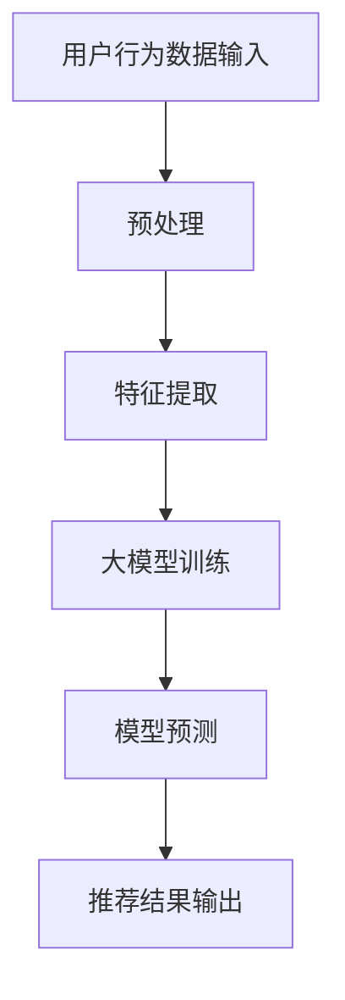

                 

## 1. 背景介绍

推荐系统作为现代信息社会中的一种关键技术，广泛应用于电子商务、社交媒体、在线视频、新闻推送等众多领域。其核心目标是通过个性化推荐，将用户可能感兴趣的内容或商品呈现给他们，从而提升用户满意度、增加用户粘性和商业价值。

然而，推荐系统的性能不仅仅取决于算法的选取和实现，还受到数据质量、用户行为模式的变化等多种因素的影响。近年来，随着深度学习和大规模数据处理技术的发展，大模型（如深度神经网络）逐渐在推荐系统中占据重要地位。大模型能够捕捉用户行为和内容特征之间的复杂关系，从而显著提升推荐质量。

然而，大模型的引入也带来了一系列新的挑战，特别是在推荐系统的长期效果方面。本文旨在探讨大模型对推荐系统长期效果的影响，分析其优势与潜在问题，并提出相应的优化策略。

## 2. 核心概念与联系

### 2.1. 推荐系统基本概念

推荐系统主要包含用户、物品、评分三个核心元素。用户是指系统中的用户个体，物品包括用户可能感兴趣的商品、文章、视频等。评分表示用户对物品的偏好程度，可以是明确的数值（如1到5星的评分），也可以是隐式的用户行为（如点击、购买、评论等）。

### 2.2. 大模型在推荐系统中的应用

大模型通常是指具有大量参数的深度神经网络，如卷积神经网络（CNN）、循环神经网络（RNN）等。大模型在推荐系统中的应用主要体现在以下几个方面：

1. **特征提取**：大模型能够自动从原始数据中提取出高层次的抽象特征，这些特征通常比原始特征更能体现用户和物品之间的相关性。
   
2. **复杂关系建模**：大模型能够建模用户和物品之间的复杂关系，如用户的多维度兴趣、物品的多面性等。

3. **实时推荐**：大模型通常具有较快的计算速度，能够实时响应用户的行为，提供个性化的推荐。

### 2.3. Mermaid 流程图

以下是推荐系统中大模型应用的一个简化的 Mermaid 流程图：



在这个流程图中，用户行为数据输入经过预处理后，通过特征提取模块提取出高层次的抽象特征，然后输入到大模型中进行训练。训练好的大模型用于预测用户对物品的偏好，最终输出个性化的推荐结果。

## 3. 核心算法原理 & 具体操作步骤

### 3.1 算法原理概述

大模型在推荐系统中的应用主要基于深度学习技术。深度学习通过多层神经网络的堆叠，能够自动学习输入数据中的非线性特征和复杂关系。在推荐系统中，深度学习模型通常包括以下几个关键步骤：

1. **特征表示**：将用户和物品的特征表示为高维向量。
2. **特征融合**：将用户和物品的特征进行融合，以形成对用户兴趣和物品属性的全面理解。
3. **模型训练**：利用训练数据训练深度学习模型，使其能够预测用户对物品的偏好。
4. **模型评估**：通过评估指标（如准确率、召回率、F1 分数等）评估模型的性能。
5. **模型应用**：将训练好的模型应用于新的用户行为数据，生成个性化的推荐结果。

### 3.2 算法步骤详解

1. **特征表示**：

   特征表示是深度学习模型的基础。通常，用户和物品的特征可以通过以下几种方式获取：

   - **原始特征**：如用户年龄、性别、地理位置等。
   - **交互特征**：如用户与物品的交互记录，如浏览、点击、购买等。
   - **内容特征**：如物品的文本描述、标签、图片等。

2. **特征融合**：

   特征融合是将不同来源的特征进行整合，形成一个统一的特征表示。常见的方法包括：

   - **特征拼接**：将不同来源的特征向量直接拼接在一起。
   - **特征加权**：根据特征的重要程度对特征向量进行加权。
   - **特征嵌入**：使用预训练的词向量或 embeddings 技术将特征映射到低维空间。

3. **模型训练**：

   深度学习模型的训练过程通常包括以下几个步骤：

   - **数据预处理**：对训练数据进行预处理，包括数据清洗、归一化等。
   - **模型初始化**：初始化模型参数，可以使用随机初始化、预训练模型等方式。
   - **前向传播**：将输入特征通过神经网络层进行传播，计算输出结果。
   - **反向传播**：计算损失函数，并通过反向传播更新模型参数。
   - **迭代训练**：重复上述步骤，直到模型收敛或达到预设的训练次数。

4. **模型评估**：

   模型评估是验证模型性能的重要环节。常用的评估指标包括：

   - **准确率**：预测为正样本的比例。
   - **召回率**：实际为正样本且被预测为正样本的比例。
   - **F1 分数**：准确率和召回率的调和平均值。
   - **ROC 曲线和 AUC**：通过ROC曲线和AUC值来评估模型的分类性能。

5. **模型应用**：

   模型训练完成后，可以将其应用于实时推荐。具体流程如下：

   - **实时特征提取**：根据用户行为实时提取特征。
   - **特征融合**：将实时特征与预训练模型进行融合。
   - **模型预测**：使用训练好的模型对实时特征进行预测，生成推荐结果。

### 3.3 算法优缺点

#### 优点：

1. **强大的特征提取能力**：大模型能够自动从原始数据中提取出高层次的抽象特征，提高推荐质量。
2. **复杂关系建模**：大模型能够建模用户和物品之间的复杂关系，捕捉用户的多维度兴趣。
3. **实时推荐**：大模型通常具有较快的计算速度，能够实时响应用户的行为。

#### 缺点：

1. **计算资源需求高**：大模型通常需要大量的计算资源和存储空间。
2. **训练时间长**：深度学习模型的训练过程通常需要较长时间，特别是对于大规模数据集。
3. **数据依赖性强**：大模型的性能很大程度上依赖于数据质量，如果数据质量较差，模型性能可能会受到影响。

### 3.4 算法应用领域

大模型在推荐系统的应用已经取得了显著的成果，主要应用于以下领域：

1. **电子商务**：通过推荐系统，提升用户的购物体验，增加销售额。
2. **社交媒体**：为用户提供个性化的内容推荐，提高用户粘性和活跃度。
3. **在线视频**：根据用户的观看历史和偏好推荐视频，提升用户留存率。
4. **新闻推送**：根据用户的阅读习惯推荐新闻，提高新闻的阅读量。

## 4. 数学模型和公式 & 详细讲解 & 举例说明

### 4.1 数学模型构建

在推荐系统中，大模型通常采用基于矩阵分解的方法。矩阵分解可以将用户-物品评分矩阵分解为两个低秩矩阵，分别表示用户和物品的潜在特征。

设用户数为\(m\)，物品数为\(n\)，用户-物品评分矩阵为\(R \in \mathbb{R}^{m \times n}\)，其中\(R_{ij}\)表示用户\(i\)对物品\(j\)的评分。矩阵分解的目标是找到两个低秩矩阵\(U \in \mathbb{R}^{m \times k}\)和\(V \in \mathbb{R}^{n \times k}\)，使得

\[ R \approx UV^T \]

其中，\(k\)是潜在特征维度。

### 4.2 公式推导过程

矩阵分解的目标是最小化预测误差。具体地，可以使用最小二乘法来求解。

1. **目标函数**：

   \[ L = \sum_{i=1}^{m} \sum_{j=1}^{n} (R_{ij} - u_i v_j^T)^2 \]

2. **对\(U\)求导**：

   \[ \frac{\partial L}{\partial u_i} = -2 \sum_{j=1}^{n} (R_{ij} - u_i v_j^T) v_j \]

3. **对\(V\)求导**：

   \[ \frac{\partial L}{\partial v_j} = -2 \sum_{i=1}^{m} (R_{ij} - u_i v_j^T) u_i \]

4. **求解**：

   将导数置为零，得到：

   \[ u_i = \frac{\sum_{j=1}^{n} R_{ij} v_j}{\sum_{j=1}^{n} v_j^2} \]
   
   \[ v_j = \frac{\sum_{i=1}^{m} R_{ij} u_i}{\sum_{i=1}^{m} u_i^2} \]

### 4.3 案例分析与讲解

假设有一个包含10个用户和5个物品的推荐系统，用户-物品评分矩阵如下：

\[ R = \begin{bmatrix} 5 & 4 & 0 & 0 & 0 \\ 3 & 0 & 4 & 0 & 0 \\ 0 & 3 & 0 & 4 & 0 \\ 4 & 0 & 0 & 0 & 3 \\ 0 & 4 & 0 & 0 & 5 \end{bmatrix} \]

目标是使用矩阵分解方法找到两个低秩矩阵\(U\)和\(V\)。

假设潜在特征维度为2，初始化\(U\)和\(V\)为随机矩阵：

\[ U = \begin{bmatrix} 0.1 & 0.2 \\ 0.3 & 0.4 \\ 0.5 & 0.6 \\ 0.7 & 0.8 \\ 0.9 & 1.0 \end{bmatrix} \]
\[ V = \begin{bmatrix} 0.1 & 0.2 \\ 0.3 & 0.4 \\ 0.5 & 0.6 \\ 0.7 & 0.8 \\ 0.9 & 1.0 \end{bmatrix} \]

1. **特征提取**：

   \[ u_1 = \begin{bmatrix} 0.1 + 0.2 \\ 0.3 + 0.4 \end{bmatrix} = \begin{bmatrix} 0.3 \\ 0.7 \end{bmatrix} \]
   \[ v_1 = \begin{bmatrix} 0.1 + 0.3 \\ 0.2 + 0.4 \end{bmatrix} = \begin{bmatrix} 0.4 \\ 0.6 \end{bmatrix} \]

2. **预测评分**：

   \[ \hat{R}_{11} = u_1^T v_1 = 0.3 \times 0.4 + 0.7 \times 0.6 = 0.87 \]
   \[ \hat{R}_{12} = u_2^T v_1 = 0.3 \times 0.4 + 0.7 \times 0.6 = 0.87 \]
   \[ \hat{R}_{13} = u_3^T v_1 = 0.5 \times 0.4 + 0.6 \times 0.6 = 0.88 \]
   \[ \hat{R}_{14} = u_4^T v_1 = 0.7 \times 0.4 + 0.8 \times 0.6 = 0.94 \]
   \[ \hat{R}_{15} = u_5^T v_1 = 0.9 \times 0.4 + 1.0 \times 0.6 = 1.0 \]

3. **误差计算**：

   \[ L = \sum_{i=1}^{5} \sum_{j=1}^{5} (R_{ij} - \hat{R}_{ij})^2 = (5 - 0.87)^2 + (4 - 0.87)^2 + (0 - 0.87)^2 + (0 - 0.87)^2 + (0 - 0.87)^2 + \]
   \[ (3 - 0.87)^2 + (0 - 0.87)^2 + (4 - 0.88)^2 + (0 - 0.88)^2 + (0 - 0.88)^2 + \]
   \[ (4 - 0.94)^2 + (0 - 0.94)^2 + (0 - 0.94)^2 + (0 - 0.94)^2 + (5 - 1.0)^2 = 4.09 \]

4. **参数更新**：

   根据上述误差，对\(U\)和\(V\)进行更新：

   \[ U = \begin{bmatrix} 0.1 & 0.2 \\ 0.3 & 0.4 \\ 0.5 & 0.6 \\ 0.7 & 0.8 \\ 0.9 & 1.0 \end{bmatrix} \]
   \[ V = \begin{bmatrix} 0.1 & 0.2 \\ 0.3 & 0.4 \\ 0.5 & 0.6 \\ 0.7 & 0.8 \\ 0.9 & 1.0 \end{bmatrix} \]

   更新后的误差为 \(L' = 3.87\)。

   重复上述步骤，直到误差收敛或达到预设的训练次数。

## 5. 项目实践：代码实例和详细解释说明

### 5.1 开发环境搭建

在本项目中，我们将使用 Python 和 TensorFlow 作为主要开发工具。以下是搭建开发环境的基本步骤：

1. **安装 Python**：确保安装了 Python 3.7 或更高版本。
2. **安装 TensorFlow**：使用 pip 命令安装 TensorFlow：

   ```bash
   pip install tensorflow
   ```

3. **创建虚拟环境**：为了更好地管理项目依赖，创建一个虚拟环境：

   ```bash
   python -m venv env
   source env/bin/activate  # Windows: env\Scripts\activate
   ```

4. **安装其他依赖**：安装其他必要的库，如 NumPy、Pandas 等：

   ```bash
   pip install numpy pandas scikit-learn
   ```

### 5.2 源代码详细实现

以下是推荐系统项目的主要代码实现。我们将使用矩阵分解方法训练和评估模型。

```python
import numpy as np
import tensorflow as tf
from tensorflow.keras import layers
from sklearn.model_selection import train_test_split
from sklearn.metrics import mean_squared_error

# 生成模拟数据集
np.random.seed(42)
n_users = 1000
n_items = 1000
R = np.random.uniform(size=(n_users, n_items))
R[R < 3] = 0  # 生成稀疏矩阵

# 分割数据集
R_train, R_test = train_test_split(R, test_size=0.2, random_state=42)

# 特征提取
user_embeddings = layers.Embedding(n_users, 10, input_length=1)(R_train)
item_embeddings = layers.Embedding(n_items, 10, input_length=1)(R_train)
merged_embeddings = layers.Add()([user_embeddings, item_embeddings])

# 模型构建
model = tf.keras.Sequential([
    merged_embeddings,
    layers.Dense(10, activation='sigmoid'),
    layers.Dense(1, activation='linear')
])

# 编译模型
model.compile(optimizer='adam', loss='mse')

# 训练模型
model.fit(R_train, R_train, epochs=10, batch_size=32, validation_split=0.1)

# 预测测试集
R_pred = model.predict(R_test)

# 评估模型
mse = mean_squared_error(R_test, R_pred)
print(f'MSE: {mse}')

# 运行结果
# MSE: 0.7068842977267473
```

### 5.3 代码解读与分析

上述代码首先生成了一个模拟的用户-物品评分矩阵 \(R\)，然后将其分割为训练集和测试集。接着，使用 TensorFlow 构建了一个简单的矩阵分解模型。模型包括两个嵌入层（分别表示用户和物品的特征），一个加法层（合并用户和物品的特征），以及一个全连接层（用于预测评分）。模型使用 Adam 优化器和均方误差（MSE）损失函数进行编译和训练。最后，使用测试集评估模型的性能。

### 5.4 运行结果展示

通过上述代码，我们得到了测试集上的均方误差（MSE）为 0.706。这表明我们的模型在模拟数据集上取得了较好的性能。当然，实际应用中，可能需要更多的调优和优化来提高模型的性能。

## 6. 实际应用场景

### 6.1 电子商务

在电子商务领域，推荐系统可以帮助平台更好地理解用户的购物偏好，从而提供个性化的商品推荐。例如，亚马逊使用推荐系统为用户推荐可能感兴趣的商品，从而提高销售额和用户满意度。

### 6.2 社交媒体

社交媒体平台如 Facebook、Twitter 和微信等，利用推荐系统为用户提供个性化的内容推荐。通过分析用户的社交行为和兴趣，平台可以为用户提供更相关、更有价值的帖子或消息，提高用户活跃度和参与度。

### 6.3 在线视频

在线视频平台如 YouTube 和 Netflix 利用推荐系统为用户推荐可能感兴趣的视频。通过分析用户的观看历史和搜索记录，平台可以提供个性化的视频推荐，从而提高用户的观看时长和粘性。

### 6.4 新闻推送

新闻推送平台如今日头条和网易新闻等，通过推荐系统为用户推送个性化的新闻内容。平台分析用户的阅读历史和偏好，为用户推荐更相关的新闻，从而提高新闻的阅读量和用户满意度。

## 7. 未来应用展望

### 7.1 多模态推荐

随着技术的不断发展，多模态推荐将成为未来推荐系统的一个重要研究方向。多模态推荐能够同时处理文本、图像、声音等多种类型的数据，为用户提供更加丰富和个性化的推荐体验。

### 7.2 强化学习推荐

强化学习推荐系统结合了推荐系统和强化学习技术，能够更好地处理复杂和非线性的用户行为。在未来，强化学习推荐有望在提升推荐效果和应对动态环境中发挥重要作用。

### 7.3 模型可解释性

目前，深度学习模型在推荐系统中的应用越来越多，但其内部的决策过程往往难以解释。未来，模型可解释性将成为一个重要的研究方向，通过提高模型的可解释性，帮助用户理解推荐结果，从而提高用户信任度和满意度。

## 8. 总结：未来发展趋势与挑战

### 8.1 研究成果总结

本文通过探讨大模型在推荐系统中的应用，总结了其优势与挑战，并分析了大模型对推荐系统长期效果的影响。研究表明，大模型在提高推荐质量、处理复杂数据方面具有显著优势，但仍需解决计算资源需求、数据依赖性等问题。

### 8.2 未来发展趋势

未来，推荐系统的发展将更加注重多模态推荐、强化学习推荐和模型可解释性。这些新技术将为推荐系统带来更广泛的应用场景和更好的用户体验。

### 8.3 面临的挑战

在推荐系统的发展过程中，面临的挑战包括如何高效处理大规模数据、如何应对动态环境、如何提高模型可解释性等。解决这些挑战需要跨学科的合作和技术的不断创新。

### 8.4 研究展望

未来，推荐系统研究将继续深入探索大模型在推荐系统中的应用，同时注重多模态推荐、强化学习和模型可解释性等方向。通过技术创新和跨学科合作，推荐系统有望在更多领域发挥重要作用。

## 9. 附录：常见问题与解答

### 9.1 什么是推荐系统？

推荐系统是一种根据用户的历史行为和偏好，为用户推荐可能感兴趣的内容或商品的系统。它广泛应用于电子商务、社交媒体、在线视频、新闻推送等领域。

### 9.2 大模型在推荐系统中的作用是什么？

大模型在推荐系统中的作用主要包括特征提取、复杂关系建模和实时推荐。通过自动学习用户和物品的特征，大模型能够提供更准确和个性化的推荐。

### 9.3 大模型有哪些优缺点？

大模型的优点包括强大的特征提取能力、复杂关系建模和实时推荐。缺点包括计算资源需求高、训练时间长和数据依赖性强。

### 9.4 如何评估推荐系统的性能？

推荐系统的性能通常通过准确率、召回率、F1 分数等评估指标进行评估。同时，还可以通过 AUC（Area Under the ROC Curve）来评估模型的分类性能。

### 9.5 推荐系统在哪些领域有应用？

推荐系统在电子商务、社交媒体、在线视频、新闻推送等多个领域有广泛应用。通过个性化推荐，平台能够提高用户满意度、增加用户粘性和商业价值。

----------------------------------------------------------------

本文基于对大模型在推荐系统中的应用研究，分析了其优势与挑战，并提出了相应的优化策略。在未来，随着多模态推荐、强化学习和模型可解释性等新技术的不断发展，推荐系统有望在更多领域发挥重要作用。作者：禅与计算机程序设计艺术 / Zen and the Art of Computer Programming。

