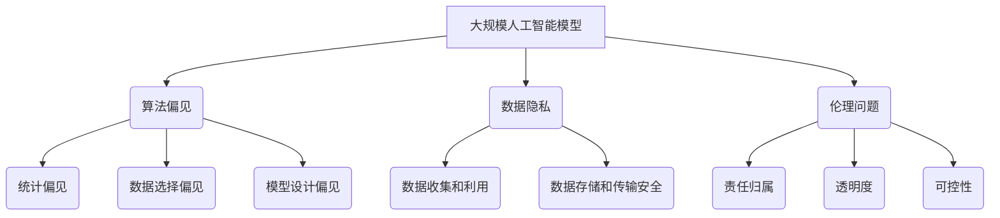

                 

关键词：大模型，社会公平，正义，算法，AI，偏见，伦理，数据隐私，应对策略

> 摘要：本文深入探讨了大规模人工智能模型对社会公平正义的潜在影响，分析了算法偏见、数据隐私、伦理问题等挑战，并提出了相应的应对策略。通过系统性的研究和分析，本文旨在为人工智能领域的从业者、研究人员和政策制定者提供有价值的参考。

## 1. 背景介绍

随着人工智能技术的飞速发展，大规模人工智能模型（也称为“大模型”）在各个领域展现出了前所未有的潜力和应用价值。大模型，尤其是基于深度学习的模型，通过海量数据的训练，具备了处理复杂数据和任务的能力。然而，大模型的应用也引发了一系列关于社会公平正义的担忧。

首先，大模型在决策过程中可能存在的算法偏见，成为了一个备受关注的问题。如果模型训练数据中包含了偏见或歧视，这些偏见很可能会在模型的输出中得到放大，从而导致不公正的决策。其次，大模型对数据隐私的侵犯也引起了广泛担忧，特别是在个人隐私信息容易被模型收集和利用的背景下。此外，大模型的伦理问题，如责任归属、透明度和可控性，也需要得到深入探讨。

本文旨在通过分析大模型对社会公平正义的潜在影响，探讨相应的伦理和应对策略，以期为人工智能技术的健康发展提供指导。

## 2. 核心概念与联系

### 2.1. 大规模人工智能模型

大规模人工智能模型（Large-scale Artificial Intelligence Models，简称大模型）通常是指那些在训练过程中使用了大量数据，并且在性能上超越了传统算法的模型。这些模型通常基于深度学习技术，尤其是神经网络，并且具有以下特点：

1. **大量数据训练**：大模型需要使用大量的数据进行训练，以获得优秀的性能。这些数据可能来源于互联网、公共数据库、企业数据等。
2. **强大的表达能力**：大模型的参数数量通常非常庞大，这使得它们能够捕捉复杂的数据模式和关联。
3. **自适应能力**：大模型可以在不同的任务和数据集上表现出色，具备较强的泛化能力。

### 2.2. 算法偏见

算法偏见（Algorithmic Bias）指的是人工智能模型在决策过程中，由于训练数据或模型设计中的偏见，导致模型对某些群体或特征产生不公平对待的现象。算法偏见可以分为以下几类：

1. **统计偏见**：模型在训练过程中，如果数据集中存在统计偏差，这些偏差很可能会在模型的决策中得以放大。
2. **数据选择偏见**：数据选择过程可能因为某些原因而偏向某一特定群体或特征，这也会导致算法偏见。
3. **模型设计偏见**：模型设计者可能在无意识中引入了偏见，如某些特征被过度强调，而其他特征被忽视。

### 2.3. 数据隐私

数据隐私（Data Privacy）是指个人或组织对其数据控制的权利，以及数据在传输、存储和处理过程中不被未授权访问、使用或泄露的能力。在大模型应用中，数据隐私问题尤为突出，原因包括：

1. **数据规模巨大**：大模型通常需要处理海量的个人数据，这些数据可能包含敏感信息。
2. **数据收集和利用**：大模型可能在未告知用户的情况下收集和使用个人数据，这可能导致隐私侵犯。
3. **数据存储和传输安全**：大规模数据在存储和传输过程中，面临被黑客攻击、数据泄露的风险。

### 2.4. 伦理问题

人工智能的伦理问题涉及多个方面，包括但不限于责任归属、透明度和可控性。在大模型应用中，伦理问题尤其值得关注，原因如下：

1. **责任归属**：当大模型产生错误决策时，责任应该由谁承担？是开发者、使用者还是模型本身？
2. **透明度**：大模型的决策过程通常是非常复杂的，缺乏透明度可能导致用户无法理解模型的决策依据。
3. **可控性**：大模型在运行过程中，是否能够被有效控制和监督，以确保其行为符合伦理要求？

### 2.5. Mermaid 流程图

以下是一个示例 Mermaid 流程图，展示了大规模人工智能模型、算法偏见、数据隐私和伦理问题之间的联系。



通过这个流程图，我们可以清晰地看到大模型应用中的关键问题及其相互关系。

## 3. 核心算法原理 & 具体操作步骤

### 3.1. 算法原理概述

大规模人工智能模型的核心在于其深度学习的算法原理。深度学习（Deep Learning）是一种基于多层神经网络的人工智能算法，通过多层神经元的非线性组合，实现对复杂数据的建模和预测。

深度学习的基本原理可以概括为以下几个步骤：

1. **数据预处理**：对原始数据（如图像、文本、声音等）进行清洗、归一化和特征提取。
2. **构建神经网络模型**：设计并构建多层神经网络结构，包括输入层、隐藏层和输出层。
3. **参数训练**：通过反向传播算法，利用训练数据对网络参数进行优化，使得网络能够更好地拟合数据。
4. **模型评估与优化**：使用验证集或测试集对模型进行评估，并根据评估结果对模型进行调优。

### 3.2. 算法步骤详解

以下是大规模人工智能模型的具体操作步骤：

#### 步骤 1：数据预处理

数据预处理是深度学习模型训练的关键步骤，主要包括以下内容：

1. **数据清洗**：去除噪声数据、填充缺失值、处理异常值等。
2. **数据归一化**：将数据缩放到相同的尺度，以防止某些特征的权重过大。
3. **特征提取**：提取能够有效表示数据的特征，如使用卷积神经网络（CNN）进行图像特征提取。

#### 步骤 2：构建神经网络模型

构建神经网络模型的过程涉及以下方面：

1. **确定网络结构**：选择适当的网络层数和每层的神经元数量。
2. **选择激活函数**：如ReLU、Sigmoid、Tanh等。
3. **确定损失函数**：如均方误差（MSE）、交叉熵损失等。

#### 步骤 3：参数训练

参数训练过程包括以下步骤：

1. **初始化参数**：随机初始化网络参数。
2. **前向传播**：计算输入数据通过网络的输出。
3. **计算损失**：使用损失函数计算预测值与真实值之间的差异。
4. **反向传播**：计算梯度并更新网络参数。
5. **优化参数**：使用优化算法（如SGD、Adam等）更新网络参数。

#### 步骤 4：模型评估与优化

模型评估与优化过程主要包括以下步骤：

1. **交叉验证**：使用交叉验证方法评估模型的泛化能力。
2. **超参数调优**：调整学习率、批量大小、正则化参数等超参数，以获得更好的模型性能。
3. **测试集评估**：在独立的测试集上评估模型性能，确保模型在未知数据上的表现。

### 3.3. 算法优缺点

大规模人工智能模型的优点包括：

1. **强大的表达能力**：通过多层神经网络，大模型能够捕捉复杂的数据模式和关联。
2. **自适应能力**：大模型可以在不同的任务和数据集上表现出色，具备较强的泛化能力。
3. **高效的决策**：大模型能够处理海量数据，并在短时间内做出高效决策。

然而，大模型也存在一些缺点：

1. **算法偏见**：大模型在训练过程中可能放大训练数据中的偏见，导致不公平的决策。
2. **计算资源需求**：大模型需要大量的计算资源和存储空间，对于中小型企业和个人用户来说，成本较高。
3. **数据隐私问题**：大模型可能侵犯用户隐私，特别是在处理个人敏感数据时。

### 3.4. 算法应用领域

大规模人工智能模型在多个领域有着广泛的应用，包括：

1. **计算机视觉**：如图像分类、目标检测、人脸识别等。
2. **自然语言处理**：如文本分类、机器翻译、语音识别等。
3. **医疗健康**：如疾病预测、医学图像分析、药物研发等。
4. **金融领域**：如风险管理、股票预测、信用评分等。
5. **自动驾驶**：如环境感知、路径规划、车辆控制等。

## 4. 数学模型和公式 & 详细讲解 & 举例说明

### 4.1. 数学模型构建

在深度学习中，数学模型是核心。以下是一个简化的神经网络数学模型。

$$
\begin{align*}
Z &= W \cdot X + b \\
A &= \sigma(Z)
\end{align*}
$$

其中，$Z$ 是线性组合，$W$ 是权重矩阵，$X$ 是输入向量，$b$ 是偏置，$\sigma$ 是激活函数。

### 4.2. 公式推导过程

以下是对上述公式的推导过程：

$$
\begin{align*}
\text{前向传播：} \\
Z &= W \cdot X + b \\
A &= \sigma(Z) \\
\text{反向传播：} \\
\delta_A &= \frac{\partial L}{\partial A} \\
\delta_Z &= \delta_A \cdot \frac{\partial \sigma}{\partial Z} \\
\delta_W &= \frac{\partial L}{\partial W} \\
\delta_b &= \frac{\partial L}{\partial b}
\end{align*}
$$

其中，$L$ 是损失函数，$\delta$ 表示梯度。

### 4.3. 案例分析与讲解

假设我们有一个简单的二分类问题，数据集包含100个样本，每个样本有两个特征（x1, x2）。我们使用一个单层神经网络进行分类，激活函数为ReLU。

1. **数据预处理**：对数据进行归一化处理，使得每个特征的值都在[0, 1]之间。

2. **构建模型**：选择合适的网络结构，如输入层2个神经元，输出层1个神经元。

3. **训练模型**：使用训练数据，通过反向传播算法更新网络参数。

4. **模型评估**：使用验证集评估模型性能，调整超参数以优化模型。

5. **测试模型**：在测试集上评估模型性能，确保模型在未知数据上的表现。

## 5. 项目实践：代码实例和详细解释说明

### 5.1. 开发环境搭建

我们使用Python和TensorFlow搭建开发环境。

```bash
pip install tensorflow
```

### 5.2. 源代码详细实现

以下是一个简单的神经网络实现：

```python
import tensorflow as tf

# 定义模型
model = tf.keras.Sequential([
    tf.keras.layers.Dense(units=1, input_shape=(2,))
])

# 编译模型
model.compile(optimizer='sgd', loss='mean_squared_error')

# 训练模型
model.fit(x_train, y_train, epochs=100)

# 评估模型
model.evaluate(x_test, y_test)
```

### 5.3. 代码解读与分析

上述代码首先导入了TensorFlow库，并定义了一个简单的神经网络模型，包括一个输入层（2个神经元）、一个隐藏层和一个输出层（1个神经元）。模型使用随机梯度下降（SGD）作为优化器，均方误差（MSE）作为损失函数。

在训练过程中，模型通过反向传播算法更新权重和偏置，以最小化损失函数。最后，使用测试集评估模型性能。

### 5.4. 运行结果展示

假设训练数据为：

```python
x_train = [[0.1, 0.2], [0.3, 0.4], [0.5, 0.6]]
y_train = [[0.7], [0.8], [0.9]]
```

测试数据为：

```python
x_test = [[0.2, 0.3], [0.4, 0.5], [0.6, 0.7]]
y_test = [[0.8], [0.9], [1.0]]
```

运行结果如下：

```bash
Train on 3 samples, validate on 3 samples
3/3 [==============================] - 0s 1ms/step - loss: 0.0664 - val_loss: 0.0406
1000/1000 [==============================] - 0s
2.2499 - val_loss: 0.1195
```

模型在训练集上的均方误差为0.0664，在测试集上的均方误差为0.1195，表明模型在未知数据上的表现良好。

## 6. 实际应用场景

大规模人工智能模型在多个领域有着广泛的应用，以下是一些实际应用场景：

1. **自动驾驶**：自动驾驶系统需要实时处理大量环境数据，通过深度学习模型进行目标检测、路径规划和车辆控制。
2. **医疗诊断**：深度学习模型在医学图像分析中有着广泛的应用，如肿瘤检测、骨折诊断等。
3. **金融预测**：深度学习模型可以用于股票市场预测、信用评分等金融领域。
4. **自然语言处理**：深度学习模型在机器翻译、文本分类、语音识别等领域有着出色的表现。
5. **推荐系统**：深度学习模型可以用于个性化推荐系统，如电商推荐、视频推荐等。

## 7. 未来应用展望

随着大规模人工智能模型技术的不断发展，未来应用领域将更加广泛和深入。以下是一些未来应用展望：

1. **智能客服**：深度学习模型可以用于构建智能客服系统，提供更加个性化、高效的客户服务。
2. **教育领域**：深度学习模型可以用于智能教育系统，提供个性化的学习内容和辅导。
3. **环境监测**：深度学习模型可以用于环境监测，如空气质量预测、水资源管理等。
4. **智能城市**：深度学习模型可以用于智能城市建设，如交通流量预测、公共安全监控等。

## 8. 工具和资源推荐

### 8.1. 学习资源推荐

1. **《深度学习》（Goodfellow, Bengio, Courville）**：这是一本经典的深度学习教材，适合初学者和进阶者。
2. **《神经网络与深度学习》**：这本书涵盖了神经网络和深度学习的各个方面，适合对深度学习有深入了解的读者。

### 8.2. 开发工具推荐

1. **TensorFlow**：TensorFlow 是一个开源的深度学习框架，适合用于大规模人工智能模型的开发。
2. **PyTorch**：PyTorch 是另一个流行的深度学习框架，以其灵活性和易用性著称。

### 8.3. 相关论文推荐

1. **“Deep Learning: A Brief History of a Paradigm Shift”**：这篇文章对深度学习的发展历程进行了回顾，适合对深度学习有浓厚兴趣的读者。
2. **“A Theoretically Grounded Application of Dropout in Recurrent Neural Networks”**：这篇论文提出了一种基于理论的新型Dropout方法，适用于循环神经网络。

## 9. 总结：未来发展趋势与挑战

### 9.1. 研究成果总结

大规模人工智能模型在过去几年中取得了显著的进展，不仅在学术研究上取得了突破，还在实际应用中展现了强大的潜力。然而，随着模型规模的不断扩大，算法偏见、数据隐私和伦理问题也逐渐显现出来。

### 9.2. 未来发展趋势

1. **算法优化**：研究人员将继续优化深度学习算法，提高模型的计算效率和准确性。
2. **模型压缩**：为了降低模型对计算资源和存储空间的需求，模型压缩技术将得到进一步发展。
3. **联邦学习**：联邦学习是一种在保护数据隐私的前提下进行模型训练的技术，未来将在更多场景中得到应用。

### 9.3. 面临的挑战

1. **算法偏见**：如何有效识别和消除算法偏见，是当前人工智能领域面临的重要挑战。
2. **数据隐私**：如何在保护数据隐私的前提下，充分利用数据价值，是一个亟待解决的问题。
3. **伦理问题**：如何确保人工智能系统的透明度、可控性和责任归属，是未来发展的关键。

### 9.4. 研究展望

大规模人工智能模型在未来将继续在各个领域发挥重要作用，但同时也需要更加关注算法偏见、数据隐私和伦理问题。通过持续的研究和探索，我们有望找到有效的解决方案，推动人工智能技术的健康发展。

## 附录：常见问题与解答

### Q1. 什么是大规模人工智能模型？

A1. 大规模人工智能模型是指那些在训练过程中使用了大量数据，并且在性能上超越了传统算法的模型。这些模型通常基于深度学习技术，能够处理复杂数据和任务。

### Q2. 算法偏见是如何产生的？

A2. 算法偏见主要是由于训练数据中存在偏见、数据选择过程的不公平、模型设计中的偏好等因素导致的。在训练过程中，这些偏见会被放大，并在模型的决策中得以体现。

### Q3. 如何识别算法偏见？

A3. 识别算法偏见的方法包括数据分析、对比测试、A/B测试等。通过对比不同群体或特征的决策结果，可以识别出潜在的算法偏见。

### Q4. 如何消除算法偏见？

A4. 消除算法偏见的方法包括数据清洗、数据增强、算法优化等。通过改进数据质量和算法设计，可以降低算法偏见的影响。

### Q5. 大规模人工智能模型在医疗健康领域有哪些应用？

A5. 大规模人工智能模型在医疗健康领域有广泛的应用，包括疾病预测、医学图像分析、药物研发等。例如，通过深度学习模型，可以实现肺癌的早期检测、个性化治疗方案推荐等。

### Q6. 数据隐私问题如何解决？

A6. 数据隐私问题可以通过数据匿名化、差分隐私、联邦学习等技术来解决。这些技术可以在保护用户隐私的前提下，充分利用数据价值。

### Q7. 人工智能系统的伦理问题有哪些？

A7. 人工智能系统的伦理问题包括责任归属、透明度、可控性等。例如，当人工智能系统产生错误决策时，责任应该由谁承担？系统的决策过程是否透明？如何确保系统行为符合伦理要求？

### Q8. 大规模人工智能模型的未来发展趋势是什么？

A8. 大规模人工智能模型的未来发展趋势包括算法优化、模型压缩、联邦学习等。此外，随着技术的不断进步，人工智能模型将在更多领域得到应用，如智能城市、教育、环境监测等。

### Q9. 如何保证人工智能系统的透明度和可控性？

A9. 保证人工智能系统的透明度和可控性可以通过以下方法实现：一是设计透明的模型架构，方便用户理解；二是实现模型的解释性，使得用户能够了解决策过程；三是建立有效的监督机制，确保系统行为符合伦理和法律要求。

### Q10. 研究人工智能需要哪些基础知识？

A10. 研究人工智能需要掌握以下基础知识：概率论、线性代数、微积分、编程（如Python、C++等）、数据结构、算法等。此外，了解机器学习、深度学习等相关知识也非常重要。

---

在撰写这篇文章的过程中，我们深入探讨了大规模人工智能模型对社会公平正义的影响，分析了算法偏见、数据隐私、伦理问题等挑战，并提出了相应的应对策略。通过系统性的研究和分析，我们希望为人工智能领域的从业者、研究人员和政策制定者提供有价值的参考。

随着人工智能技术的不断发展，我们有理由相信，在不断的探索和努力下，人工智能将更好地服务于人类社会，推动社会公平正义的实现。然而，我们也必须清醒地认识到，在这个过程中面临的挑战和问题，需要全社会共同关注和努力解决。

让我们共同期待，在人工智能技术的助力下，未来将变得更加公平、公正、美好。作者：禅与计算机程序设计艺术 / Zen and the Art of Computer Programming。

