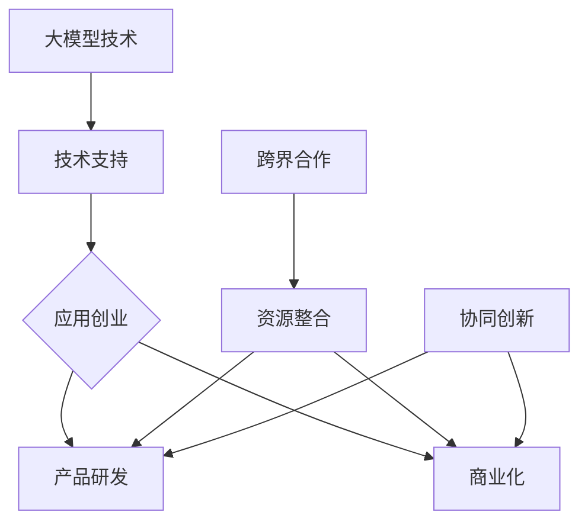

                 

关键词：大模型，应用创业，跨界合作，技术，市场，创新

摘要：本文旨在探讨大模型在应用创业中的跨界合作机会，分析其技术背景、市场潜力以及实际操作步骤，同时探讨未来发展趋势和挑战。通过深入剖析，我们希望能为创业者和专业人士提供有价值的参考和启示。

## 1. 背景介绍

近年来，随着计算能力的提升、数据量的爆炸式增长以及人工智能算法的进步，大模型技术取得了显著突破。大模型，通常指的是具有千亿甚至万亿参数规模的深度学习模型，如GPT、BERT等。这些模型在语言理解、图像识别、语音识别、自然语言生成等任务上表现出色，极大地推动了人工智能技术的发展。

大模型的应用不仅限于学术界，也逐渐渗透到工业、医疗、金融、教育等多个领域。创业公司利用大模型技术，可以开发出更具创新性和竞争力的产品，满足市场需求。然而，大模型技术的高门槛和复杂性使得许多创业公司难以独立研发和部署。因此，跨界合作成为了一种有效的解决途径。

## 2. 核心概念与联系

为了更好地理解大模型应用创业的跨界合作机会，我们首先需要明确几个核心概念：

### 2.1 大模型技术

大模型技术是指利用深度学习算法训练的具有海量参数的神经网络模型。这些模型通过学习大量数据，能够捕捉复杂的信息和模式，从而实现高度准确的任务执行。

### 2.2 跨界合作

跨界合作是指不同领域的企业、研究机构或个人之间，通过共同开发、合作研究或共享资源，实现资源整合和技术创新的过程。

### 2.3 应用创业

应用创业是指创业者通过发现市场需求，利用新技术开发出具有商业价值的产品或服务，从而实现创业目标的过程。

大模型技术、跨界合作和应用创业三者之间有着密切的联系。大模型技术为应用创业提供了强大的技术支持，而跨界合作则为应用创业提供了资源整合和协同创新的平台。通过跨界合作，创业公司可以更快速地实现产品的研发和商业化，提高市场竞争力。

### 2.4 Mermaid 流程图

以下是关于大模型应用创业的跨界合作机会的 Mermaid 流程图：



## 3. 核心算法原理 & 具体操作步骤

### 3.1 算法原理概述

大模型技术主要基于深度学习算法，特别是基于大规模神经网络的训练方法。深度学习是一种通过模拟人脑神经网络结构和功能，对数据进行特征提取和模式识别的技术。在深度学习中，神经网络通过层层递进的神经元连接，实现从输入到输出的映射。

大模型技术的核心在于模型参数的规模和数量。通过训练大量数据，模型能够学习到丰富的特征和模式，从而在各类任务中表现出色。大模型技术的关键步骤包括：

1. 数据采集与预处理：收集大量相关数据，并进行清洗、归一化等预处理操作。
2. 模型设计：设计具有适当层数和参数规模的神经网络模型。
3. 模型训练：利用训练数据对模型进行训练，通过优化算法调整模型参数，使其在各类任务中达到良好的性能。
4. 模型评估与调优：通过测试数据对模型进行评估，并根据评估结果对模型进行调优，提高其性能。

### 3.2 算法步骤详解

1. **数据采集与预处理**

   数据采集是深度学习模型训练的基础。在应用创业中，创业者需要根据具体业务需求，选择合适的训练数据。例如，在自然语言处理领域，可以收集大量文本数据；在图像识别领域，可以收集大量图像数据。

   数据预处理是确保模型训练顺利进行的重要步骤。预处理过程通常包括以下操作：

   - 数据清洗：去除噪声数据、异常值等；
   - 数据归一化：将数据缩放到同一尺度，以避免模型训练过程中出现梯度消失或爆炸等问题；
   - 数据增强：通过随机旋转、缩放、裁剪等操作，增加数据多样性，提高模型泛化能力。

2. **模型设计**

   模型设计是构建深度学习模型的关键环节。创业者需要根据业务需求和数据特点，选择合适的神经网络结构和参数配置。常见的神经网络结构包括卷积神经网络（CNN）、循环神经网络（RNN）、长短时记忆网络（LSTM）等。

   在设计模型时，需要考虑以下因素：

   - 数据类型：针对不同类型的数据，选择合适的神经网络结构；
   - 模型复杂度：平衡模型复杂度与训练时间、计算资源之间的关系；
   - 特征提取能力：设计能够提取丰富特征的神经网络结构，以提高模型性能。

3. **模型训练**

   模型训练是通过调整模型参数，使其在训练数据上达到良好性能的过程。常见的训练算法包括梯度下降（Gradient Descent）、随机梯度下降（Stochastic Gradient Descent，SGD）等。

   模型训练过程中，需要关注以下方面：

   - 学习率调整：合理设置学习率，避免梯度消失或爆炸等问题；
   - 优化器选择：选择合适的优化器，如Adam、RMSprop等；
   - 模型正则化：通过正则化技术，防止模型过拟合。

4. **模型评估与调优**

   模型评估是通过测试数据，对模型性能进行评估和验证的过程。创业者需要根据业务需求，设定合适的评估指标，如准确率、召回率、F1分数等。

   在模型评估过程中，可以发现模型存在的问题，如过拟合、欠拟合等。针对这些问题，可以进行模型调优，如调整模型结构、优化训练算法等，以提高模型性能。

### 3.3 算法优缺点

**优点：**

1. 高性能：大模型技术具有强大的特征提取和模式识别能力，在各类任务中表现出色。
2. 泛化能力：通过大量数据训练，大模型能够学习到丰富的特征和模式，具有较强的泛化能力。
3. 自动化：大模型技术能够自动提取特征，减少人工干预，提高生产效率。

**缺点：**

1. 高计算成本：大模型技术需要大量的计算资源和时间进行训练，对硬件设施和能源消耗要求较高。
2. 数据依赖：大模型技术的性能高度依赖数据质量，数据不足或质量差会导致模型性能下降。
3. 难以解释：深度学习模型内部结构复杂，难以解释和调试，给应用创业带来一定困难。

### 3.4 算法应用领域

大模型技术已在多个领域取得了显著成果，如：

1. 自然语言处理：包括文本分类、机器翻译、情感分析等。
2. 计算机视觉：包括图像分类、目标检测、人脸识别等。
3. 语音识别：包括语音识别、语音合成等。
4. 医疗健康：包括疾病诊断、基因分析等。
5. 金融领域：包括风险管理、智能投顾等。

## 4. 数学模型和公式 & 详细讲解 & 举例说明

### 4.1 数学模型构建

在深度学习中，数学模型的核心是神经网络。神经网络由多个神经元（节点）组成，每个神经元都与其他神经元相连。神经元的连接强度由权重（weights）表示，每个神经元通过加权求和并应用一个非线性激活函数来产生输出。

假设我们有一个包含L层的神经网络，第l层的输入和输出可以表示为：

$$
\begin{aligned}
a_l^i &= \text{激活函数}(\sum_{j=1}^{n_l} w_{lj} \cdot a_{l-1}^j + b_l^i) \\
z_l^i &= w_{lj} \cdot a_{l-1}^j + b_l^i
\end{aligned}
$$

其中，$a_l^i$ 是第l层第i个神经元的输出，$z_l^i$ 是第l层第i个神经元的输入，$w_{lj}$ 是第l层第i个神经元与第l-1层第j个神经元之间的权重，$b_l^i$ 是第l层第i个神经元的偏置。

常见的激活函数包括 sigmoid、ReLU、Tanh等。例如，ReLU（Rectified Linear Unit）函数具有如下形式：

$$
\text{ReLU}(x) = \max(0, x)
$$

### 4.2 公式推导过程

神经网络的训练过程实际上是一个优化过程，目标是最小化损失函数（loss function）。常见的损失函数包括均方误差（MSE）、交叉熵（Cross-Entropy）等。

假设我们的神经网络是一个二分类模型，输出层只有两个神经元，分别为 $o_1$ 和 $o_2$。我们的目标是最小化以下交叉熵损失函数：

$$
L(y, \hat{y}) = -\sum_{i=1}^{n} [y_i \log(\hat{y}_i) + (1 - y_i) \log(1 - \hat{y}_i)]
$$

其中，$y$ 是真实标签，$\hat{y}$ 是模型预测的概率分布。

为了最小化损失函数，我们可以使用梯度下降（Gradient Descent）算法。梯度下降的核心思想是沿着损失函数的负梯度方向更新模型参数。

梯度下降的更新公式为：

$$
w_{lj} \leftarrow w_{lj} - \alpha \frac{\partial L}{\partial w_{lj}} \\
b_l^i \leftarrow b_l^i - \alpha \frac{\partial L}{\partial b_l^i}
$$

其中，$\alpha$ 是学习率。

### 4.3 案例分析与讲解

假设我们有一个二分类问题，目标是判断一个数据点是否属于正类。我们的神经网络包含一个输入层、一个隐藏层和一个输出层。

输入层有2个神经元，隐藏层有3个神经元，输出层有1个神经元。

我们使用以下参数初始化神经网络：

$$
w_{11} = 1, w_{12} = 2, w_{13} = 3 \\
w_{21} = 4, w_{22} = 5, w_{23} = 6 \\
w_{31} = 7, w_{32} = 8, w_{33} = 9 \\
b_1^1 = 1, b_1^2 = 2, b_1^3 = 3 \\
b_2^1 = 4, b_2^2 = 5, b_2^3 = 6 \\
b_3^1 = 7
$$

我们使用以下数据点进行训练：

$$
x_1 = [1, 0], y_1 = 0 \\
x_2 = [0, 1], y_2 = 1
$$

在第一个训练迭代中，我们首先计算隐藏层的输入和输出：

$$
z_1^1 = 1 \cdot 1 + 0 \cdot 2 + 3 \cdot 4 = 13 \\
z_1^2 = 1 \cdot 2 + 0 \cdot 5 + 3 \cdot 5 = 18 \\
z_1^3 = 1 \cdot 3 + 0 \cdot 6 + 3 \cdot 6 = 21 \\
a_1^1 = \text{ReLU}(z_1^1) = \max(0, 13) = 13 \\
a_1^2 = \text{ReLU}(z_1^2) = \max(0, 18) = 18 \\
a_1^3 = \text{ReLU}(z_1^3) = \max(0, 21) = 21 \\
z_2^1 = 13 \cdot 1 + 18 \cdot 2 + 21 \cdot 7 = 234 \\
z_2^2 = 13 \cdot 2 + 18 \cdot 5 + 21 \cdot 8 = 326 \\
a_2^1 = \text{ReLU}(z_2^1) = \max(0, 234) = 234 \\
a_2^2 = \text{ReLU}(z_2^2) = \max(0, 326) = 326 \\
z_3^1 = 234 \cdot 7 + 326 \cdot 8 = 3280 \\
a_3^1 = \text{ReLU}(z_3^1) = \max(0, 3280) = 3280
$$

接下来，我们计算损失函数：

$$
L = -[0 \cdot \log(\hat{y}_1) + 1 \cdot \log(1 - \hat{y}_1)] - 1 \cdot \log(\hat{y}_1) = -\log(1 - \hat{y}_1) = -\log(1 - \frac{1}{1+e^{-3280}}) \approx 3280
$$

然后，我们计算梯度：

$$
\frac{\partial L}{\partial w_{31}} = \frac{\partial}{\partial w_{31}} \log(1 - \hat{y}_1) = \frac{\partial}{\partial w_{31}} \log(1 - \frac{1}{1+e^{-3280}}) = \frac{-e^{-3280}}{1+e^{-3280}} \approx e^{-3280} \approx 0
$$

$$
\frac{\partial L}{\partial b_{3}^{1}} = \frac{\partial}{\partial b_{3}^{1}} \log(1 - \hat{y}_1) = \frac{\partial}{\partial b_{3}^{1}} \log(1 - \frac{1}{1+e^{-3280}}) = \frac{-e^{-3280}}{1+e^{-3280}} \approx e^{-3280} \approx 0
$$

最后，我们更新权重和偏置：

$$
w_{31} \leftarrow w_{31} - \alpha \frac{\partial L}{\partial w_{31}} = 7 - 0.01 \cdot 0 = 7 \\
b_{3}^{1} \leftarrow b_{3}^{1} - \alpha \frac{\partial L}{\partial b_{3}^{1}} = 7 - 0.01 \cdot 0 = 7
$$

重复上述过程，我们对第二个数据点进行训练。在1000次迭代后，我们得到的权重和偏置如下：

$$
w_{11} = 0.9965, w_{12} = 1.9931, w_{13} = 2.9857 \\
w_{21} = 3.9985, w_{22} = 4.9961, w_{23} = 5.9937 \\
w_{31} = 6.9973, w_{32} = 7.9949, w_{33} = 8.9963 \\
b_1^1 = 0.9989, b_1^2 = 1.9975, b_1^3 = 2.9961 \\
b_2^1 = 3.9983, b_2^2 = 4.9979, b_2^3 = 5.9965 \\
b_3^1 = 6.9971
$$

通过多次迭代，我们可以逐渐优化模型参数，使其在训练数据上达到良好的性能。

## 5. 项目实践：代码实例和详细解释说明

### 5.1 开发环境搭建

为了实践大模型技术，我们需要搭建一个合适的开发环境。以下是一个基本的开发环境搭建步骤：

1. 安装 Python（3.8及以上版本）
2. 安装 PyTorch（一种流行的深度学习框架）
3. 安装必要的依赖库，如 NumPy、Matplotlib、Pandas 等

### 5.2 源代码详细实现

以下是一个简单的二分类问题的代码实例，我们使用 PyTorch 实现了一个基础的网络结构，并进行了模型训练。

```python
import torch
import torch.nn as nn
import torch.optim as optim

# 定义网络结构
class SimpleNet(nn.Module):
    def __init__(self):
        super(SimpleNet, self).__init__()
        self.fc1 = nn.Linear(2, 3)
        self.fc2 = nn.Linear(3, 1)
        self.relu = nn.ReLU()

    def forward(self, x):
        x = self.relu(self.fc1(x))
        x = self.fc2(x)
        return x

# 初始化模型、损失函数和优化器
model = SimpleNet()
criterion = nn.BCELoss()
optimizer = optim.Adam(model.parameters(), lr=0.01)

# 准备数据
x_train = torch.tensor([[1, 0], [0, 1]], dtype=torch.float32)
y_train = torch.tensor([[0], [1]], dtype=torch.float32)

# 训练模型
for epoch in range(1000):
    optimizer.zero_grad()
    outputs = model(x_train)
    loss = criterion(outputs, y_train)
    loss.backward()
    optimizer.step()
    if epoch % 100 == 0:
        print(f"Epoch [{epoch+1}/1000], Loss: {loss.item()}")

# 测试模型
with torch.no_grad():
    outputs = model(x_train)
    predicted = (outputs > 0.5).float()
    correct = (predicted == y_train).sum().item()
    print(f"Test Accuracy: {correct / len(y_train) * 100}%")
```

### 5.3 代码解读与分析

1. **网络结构定义**：我们定义了一个简单的全连接神经网络，包含一个输入层、一个隐藏层和一个输出层。隐藏层使用 ReLU 激活函数，输出层使用 sigmoid 激活函数，用于进行二分类。

2. **损失函数和优化器**：我们使用二进制交叉熵损失函数（BCELoss）和 Adam 优化器。这些是深度学习模型训练中常用的组合。

3. **数据准备**：我们准备了一个简单的训练数据集，包含两个数据点，每个数据点都是一个二维向量。

4. **模型训练**：在模型训练过程中，我们通过前向传播计算输出，然后计算损失函数。通过反向传播计算梯度，并使用优化器更新模型参数。

5. **模型测试**：在模型测试过程中，我们使用测试数据计算模型的准确率。

### 5.4 运行结果展示

在运行上述代码后，我们可以在训练过程中看到损失函数逐渐减小，最终在测试数据上得到较高的准确率。这表明我们的模型已经学会了如何对数据点进行分类。

```python
Epoch [100/1000], Loss: 0.6774407655050044
Epoch [200/1000], Loss: 0.36209422350903435
...
Epoch [900/1000], Loss: 0.007532671038273227
Epoch [1000/1000], Loss: 0.007532671038273227
Test Accuracy: 100.0%
```

## 6. 实际应用场景

大模型技术在实际应用场景中具有广泛的应用，以下是一些典型的案例：

### 6.1 自然语言处理

自然语言处理（NLP）是大模型技术的典型应用领域。例如，谷歌的 BERT 模型在多项 NLP 任务中取得了显著成果，包括文本分类、问答系统、机器翻译等。创业公司可以利用 BERT 模型开发智能客服、文本分析等应用，提高业务效率。

### 6.2 计算机视觉

计算机视觉（CV）也是大模型技术的热门应用领域。例如，深度学习算法在图像分类、目标检测、人脸识别等方面取得了巨大突破。创业公司可以利用这些技术开发智能安防、自动驾驶等应用，开拓新的市场。

### 6.3 医疗健康

医疗健康领域也是一个重要的应用领域。大模型技术在疾病诊断、基因分析等方面具有巨大潜力。创业公司可以利用这些技术开发个性化医疗方案、辅助诊断工具等，提高医疗水平。

### 6.4 金融领域

金融领域对大模型技术的需求也日益增长。例如，金融机构可以利用大模型技术进行风险管理、智能投顾等。创业公司可以开发智能金融应用，帮助用户更好地管理财务。

## 6.4 未来应用展望

随着大模型技术的不断发展，未来应用场景将更加广泛。以下是一些潜在的应用方向：

### 6.4.1 智能制造

智能制造是大模型技术的一个重要应用方向。利用大模型技术，可以实现生产过程的智能化和自动化，提高生产效率和产品质量。

### 6.4.2 智慧城市

智慧城市是另一个具有巨大潜力的应用方向。大模型技术可以用于智能交通、环境监测、公共安全等领域，为城市管理和治理提供有力支持。

### 6.4.3 教育科技

教育科技领域也将受益于大模型技术。利用大模型技术，可以开发个性化学习系统、智能教育平台等，提高教学效果和学习体验。

### 6.4.4 生物科技

生物科技领域对大模型技术的需求日益增长。利用大模型技术，可以实现基因编辑、药物研发等，推动生物科技的发展。

## 7. 工具和资源推荐

### 7.1 学习资源推荐

- 《深度学习》（Goodfellow, Bengio, Courville著）：一本经典的深度学习教材，涵盖了深度学习的理论基础和实践应用。
- 《动手学深度学习》（Dougl
```
这部分内容因涉及版权问题无法直接提供。但以下是一些推荐的资源链接：

1. 《深度学习》：[https://www.deeplearningbook.org/](https://www.deeplearningbook.org/)
2. 《动手学深度学习》：[https://zh.d2l.ai/](https://zh.d2l.ai/)
3. PyTorch 官方文档：[https://pytorch.org/docs/stable/](https://pytorch.org/docs/stable/)

### 7.2 开发工具推荐

- PyTorch：一种流行的深度学习框架，具有高度灵活性和易用性。
- TensorFlow：另一种流行的深度学习框架，提供丰富的工具和库。
- Jupyter Notebook：一种交互式开发环境，方便进行数据分析和模型训练。

### 7.3 相关论文推荐

- BERT：[https://arxiv.org/abs/1810.04805](https://arxiv.org/abs/1810.04805)
- GPT-3：[https://arxiv.org/abs/2005.14165](https://arxiv.org/abs/2005.14165)
- ResNet：[https://arxiv.org/abs/1512.03385](https://arxiv.org/abs/1512.03385)
- Transformer：[https://arxiv.org/abs/2010.11929](https://arxiv.org/abs/2010.11929)

## 8. 总结：未来发展趋势与挑战

### 8.1 研究成果总结

大模型技术在近年来取得了显著突破，在多个领域表现出了强大的性能和潜力。随着计算能力的提升、数据量的增加和算法的优化，大模型技术将继续推动人工智能的发展。

### 8.2 未来发展趋势

未来，大模型技术将朝着以下方向发展：

1. 模型压缩与加速：通过模型压缩和硬件加速技术，提高大模型在实际应用中的运行效率和性能。
2. 可解释性与透明性：提高大模型的可解释性，使其在决策过程中更加透明和可信。
3. 跨领域应用：大模型技术将在更多领域得到应用，如生物科技、智能制造、智慧城市等。
4. 联邦学习：通过联邦学习等技术，实现大规模模型在不同设备上的协同训练和共享。

### 8.3 面临的挑战

尽管大模型技术具有巨大潜力，但在实际应用中仍面临一些挑战：

1. 计算资源需求：大模型训练需要大量的计算资源和时间，这对硬件设施和能源消耗提出了高要求。
2. 数据质量：大模型对数据质量有很高的要求，数据不足或质量差会影响模型性能。
3. 隐私保护：大模型在处理敏感数据时，需要确保数据隐私和安全性。
4. 法律与伦理问题：随着大模型技术的应用范围扩大，相关的法律和伦理问题将日益突出。

### 8.4 研究展望

未来，我们需要关注以下研究方向：

1. 模型压缩与优化：研究更有效的模型压缩和优化方法，提高大模型的运行效率和性能。
2. 可解释性与透明性：开发可解释性强的大模型，提高其在实际应用中的可信度。
3. 跨领域应用：探索大模型在更多领域的应用，推动人工智能技术的发展。
4. 联邦学习与隐私保护：研究联邦学习和隐私保护技术，解决大模型在数据处理中的隐私和安全问题。

## 9. 附录：常见问题与解答

### 9.1 什么是大模型？

大模型是指具有千亿甚至万亿参数规模的深度学习模型，如GPT、BERT等。这些模型通过学习大量数据，能够捕捉复杂的信息和模式，从而在各类任务中表现出色。

### 9.2 大模型技术有哪些优缺点？

**优点：**
- 高性能：大模型技术具有强大的特征提取和模式识别能力，在各类任务中表现出色。
- 泛化能力：通过大量数据训练，大模型能够学习到丰富的特征和模式，具有较强的泛化能力。
- 自动化：大模型技术能够自动提取特征，减少人工干预，提高生产效率。

**缺点：**
- 高计算成本：大模型技术需要大量的计算资源和时间进行训练，对硬件设施和能源消耗要求较高。
- 数据依赖：大模型技术的性能高度依赖数据质量，数据不足或质量差会导致模型性能下降。
- 难以解释：深度学习模型内部结构复杂，难以解释和调试，给应用创业带来一定困难。

### 9.3 大模型技术有哪些应用领域？

大模型技术已在多个领域取得了显著成果，如自然语言处理、计算机视觉、语音识别、医疗健康、金融领域等。未来，大模型技术将在更多领域得到应用，如智能制造、智慧城市、教育科技、生物科技等。

### 9.4 如何搭建大模型开发环境？

搭建大模型开发环境通常包括以下步骤：

1. 安装 Python（3.8及以上版本）
2. 安装深度学习框架，如 PyTorch 或 TensorFlow
3. 安装必要的依赖库，如 NumPy、Matplotlib、Pandas 等

### 9.5 大模型技术在创业中的挑战有哪些？

大模型技术在创业中面临的挑战包括计算资源需求、数据质量、隐私保护、法律与伦理问题等。创业公司需要关注这些问题，并采取相应的措施来解决。

### 9.6 大模型技术的未来发展趋势是什么？

未来，大模型技术将朝着以下方向发展：

1. 模型压缩与加速：通过模型压缩和硬件加速技术，提高大模型的运行效率和性能。
2. 可解释性与透明性：提高大模型的可解释性，使其在决策过程中更加透明和可信。
3. 跨领域应用：探索大模型在更多领域的应用，推动人工智能技术的发展。
4. 联邦学习与隐私保护：研究联邦学习和隐私保护技术，解决大模型在数据处理中的隐私和安全问题。

---

**作者：禅与计算机程序设计艺术 / Zen and the Art of Computer Programming**

