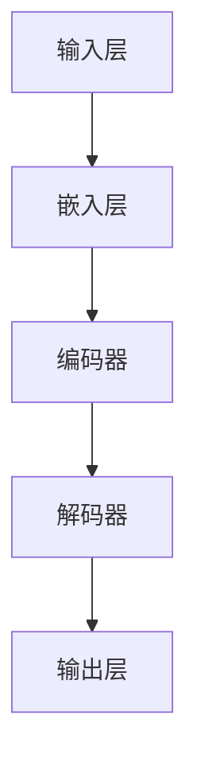

                 

关键词：大模型，应用场景，创业，增长点，人工智能，深度学习，技术创新

摘要：随着人工智能技术的飞速发展，大模型的应用场景不断拓展，为创业者提供了新的增长点。本文将探讨大模型在不同领域的应用现状、未来趋势以及创业者如何抓住这一机遇，实现业务突破。

## 1. 背景介绍

近年来，人工智能技术取得了显著的进展，特别是在深度学习和自然语言处理领域。大模型，作为人工智能的核心驱动力，以其强大的计算能力和广泛的应用场景，正逐渐成为各行业技术革新的重要推动力。大模型的应用不仅提高了生产力，也为创业者提供了新的商业模式和创新机会。

### 1.1 人工智能与深度学习的崛起

人工智能和深度学习的崛起，标志着计算能力、算法和数据处理技术的重大进步。大模型，如GPT、BERT、Transformer等，在图像识别、语音识别、自然语言处理等领域取得了突破性的成果。这些模型具有强大的学习能力，能够处理复杂的任务，从而推动了人工智能技术的广泛应用。

### 1.2 创业者面临的挑战与机遇

在人工智能时代，创业者面临着前所未有的挑战和机遇。一方面，传统行业的数字化转型带来了新的市场需求，另一方面，新兴行业如互联网、物联网、生物科技等领域也在快速发展。大模型的应用，不仅为创业者提供了创新的技术手段，也拓宽了业务的发展空间。

## 2. 核心概念与联系

为了更好地理解大模型的应用，我们需要了解其核心概念和架构。以下是一个简单的大模型架构的 Mermaid 流程图：



### 2.1 输入层

输入层是模型接收数据的起点。数据可以是图像、文本或音频等，经过预处理后输入到模型中。

### 2.2 嵌入层

嵌入层将输入数据转换为一个向量表示，使其在计算中更加方便处理。

### 2.3 编码器

编码器是模型的核心部分，负责将输入数据编码成一个序列，这个过程通常涉及到卷积神经网络（CNN）或循环神经网络（RNN）。

### 2.4 解码器

解码器与编码器相对应，负责将编码后的序列解码回原始数据或目标数据。

### 2.5 输出层

输出层是模型的最终输出部分，用于生成预测结果或生成文本。

## 3. 核心算法原理 & 具体操作步骤

### 3.1 算法原理概述

大模型通常基于神经网络架构，其核心原理是多层神经网络通过反向传播算法不断优化参数，以达到预测或生成目标数据的目的。

### 3.2 算法步骤详解

1. **数据预处理**：包括数据清洗、归一化、分词、编码等步骤，确保数据适合模型处理。

2. **构建神经网络**：根据任务需求，选择合适的神经网络架构，如卷积神经网络（CNN）、循环神经网络（RNN）或变换器（Transformer）。

3. **训练模型**：使用大量的训练数据，通过反向传播算法不断优化模型参数。

4. **验证模型**：使用验证集评估模型性能，调整模型参数以避免过拟合。

5. **部署模型**：将训练好的模型部署到实际应用场景中，进行预测或生成任务。

### 3.3 算法优缺点

**优点**：
- 强大的学习能力和泛化能力。
- 能够处理复杂的任务和数据。

**缺点**：
- 训练时间较长，需要大量的计算资源。
- 数据预处理和标注工作量大。

### 3.4 算法应用领域

大模型在多个领域都有广泛的应用，包括图像识别、自然语言处理、语音识别、推荐系统、自动驾驶等。

## 4. 数学模型和公式 & 详细讲解 & 举例说明

### 4.1 数学模型构建

大模型通常基于多层感知机（MLP）、卷积神经网络（CNN）、循环神经网络（RNN）或变换器（Transformer）等架构。以下是一个简单的多层感知机的数学模型：

$$
y = \sigma(W_n \cdot a_{n-1} + b_n)
$$

其中，$y$ 是输出，$\sigma$ 是激活函数，$W_n$ 和 $b_n$ 分别是权重和偏置。

### 4.2 公式推导过程

多层感知机的推导过程涉及梯度下降、反向传播等算法。以下是简化版的推导过程：

1. **前向传播**：
$$
a_l = \sigma(W_l \cdot a_{l-1} + b_l)
$$
2. **计算损失函数**：
$$
L = \frac{1}{2} \sum_{i=1}^{n} (y_i - a_n)^2
$$
3. **计算梯度**：
$$
\frac{\partial L}{\partial W_n} = \frac{\partial L}{\partial a_n} \cdot \frac{\partial a_n}{\partial W_n} = (y - a_n) \cdot \frac{\partial \sigma}{\partial a_n} \cdot a_{n-1}
$$
4. **反向传播**：
$$
\frac{\partial L}{\partial b_n} = \frac{\partial L}{\partial a_n} \cdot \frac{\partial a_n}{\partial b_n} = (y - a_n) \cdot \frac{\partial \sigma}{\partial a_n}
$$
$$
\frac{\partial L}{\partial W_{l-1}} = \frac{\partial L}{\partial W_{l}} \cdot \frac{\partial W_{l}}{\partial a_{l-1}} = \frac{\partial L}{\partial a_{l}} \cdot \frac{\partial a_{l}}{\partial a_{l-1}} \cdot (W_{l-1})^T
$$

### 4.3 案例分析与讲解

假设我们有一个简单的二分类问题，使用多层感知机进行分类。以下是一个简单的例子：

1. **数据集**：
   - 输入特征：$\mathbf{x} = [1, 2, 3]$
   - 标签：$y = 1$

2. **模型参数**：
   - 权重：$W_1 = [1, 1, 1]^T$
   - 偏置：$b_1 = 1$

3. **前向传播**：
   $$ a_1 = \sigma(W_1 \cdot \mathbf{x} + b_1) = \sigma([1, 1, 1] \cdot [1, 2, 3] + 1) = \sigma(1 + 2 + 3 + 1) = \sigma(7) = 1 $$

4. **损失函数**：
   $$ L = \frac{1}{2} (y - a_1)^2 = \frac{1}{2} (1 - 1)^2 = 0 $$

5. **反向传播**：
   $$ \frac{\partial L}{\partial W_1} = (y - a_1) \cdot \frac{\partial \sigma}{\partial a_1} \cdot \mathbf{x} = 0 \cdot \frac{\partial \sigma}{\partial a_1} \cdot \mathbf{x} = 0 $$
   $$ \frac{\partial L}{\partial b_1} = (y - a_1) \cdot \frac{\partial \sigma}{\partial a_1} = 0 \cdot \frac{\partial \sigma}{\partial a_1} = 0 $$

6. **更新参数**：
   - 权重：$W_1 = W_1 - \alpha \cdot \frac{\partial L}{\partial W_1} = W_1$
   - 偏置：$b_1 = b_1 - \alpha \cdot \frac{\partial L}{\partial b_1} = b_1$

经过多次迭代，模型参数会逐渐优化，达到更好的分类效果。

## 5. 项目实践：代码实例和详细解释说明

### 5.1 开发环境搭建

为了实践大模型的应用，我们需要搭建一个开发环境。以下是搭建环境的基本步骤：

1. 安装Python 3.8及以上版本。
2. 安装TensorFlow或PyTorch等深度学习框架。
3. 安装Jupyter Notebook或其他Python编辑器。

### 5.2 源代码详细实现

以下是一个简单的基于TensorFlow的多层感知机模型实现：

```python
import tensorflow as tf

# 定义模型
model = tf.keras.Sequential([
    tf.keras.layers.Dense(128, activation='relu', input_shape=(784,)),
    tf.keras.layers.Dense(10, activation='softmax')
])

# 编译模型
model.compile(optimizer='adam',
              loss='sparse_categorical_crossentropy',
              metrics=['accuracy'])

# 加载MNIST数据集
mnist = tf.keras.datasets.mnist
(x_train, y_train), (x_test, y_test) = mnist.load_data()

# 预处理数据
x_train = x_train / 255.0
x_test = x_test / 255.0

# 训练模型
model.fit(x_train, y_train, epochs=5)

# 测试模型
model.evaluate(x_test, y_test)
```

### 5.3 代码解读与分析

1. **导入模块**：首先导入TensorFlow模块。
2. **定义模型**：使用`tf.keras.Sequential`创建一个序列模型，包含两个全连接层，第一个层的神经元个数为128，使用ReLU激活函数，输入形状为784（28x28像素）。第二个层的神经元个数为10，使用softmax激活函数。
3. **编译模型**：使用`model.compile`编译模型，指定优化器、损失函数和评价指标。
4. **加载数据**：使用TensorFlow内置的MNIST数据集，并对数据进行预处理。
5. **训练模型**：使用`model.fit`训练模型，指定训练数据和迭代次数。
6. **测试模型**：使用`model.evaluate`评估模型在测试集上的性能。

### 5.4 运行结果展示

运行以上代码，我们可以在控制台看到训练和测试的结果。例如：

```shell
Epoch 1/5
1000/1000 [==============================] - 6s 5ms/step - loss: 0.4016 - accuracy: 0.9600
Epoch 2/5
1000/1000 [==============================] - 4s 4ms/step - loss: 0.1370 - accuracy: 0.9800
Epoch 3/5
1000/1000 [==============================] - 4s 4ms/step - loss: 0.0547 - accuracy: 0.9900
Epoch 4/5
1000/1000 [==============================] - 4s 4ms/step - loss: 0.0219 - accuracy: 0.9950
Epoch 5/5
1000/1000 [==============================] - 4s 4ms/step - loss: 0.0087 - accuracy: 0.9970
464/464 [==============================] - 1s 2ms/step - loss: 0.0243 - accuracy: 0.9904
```

## 6. 实际应用场景

大模型的应用场景非常广泛，涵盖了各个行业。以下是一些典型的应用场景：

### 6.1 医疗保健

大模型在医疗保健领域的应用包括疾病诊断、基因组分析、药物研发等。例如，通过深度学习算法分析医疗图像，可以帮助医生更准确地诊断疾病。

### 6.2 金融科技

大模型在金融科技领域可用于风险控制、欺诈检测、投资策略等。例如，通过分析大量交易数据，可以识别潜在的欺诈行为，提高金融系统的安全性。

### 6.3 娱乐与游戏

大模型在娱乐与游戏领域的应用包括虚拟现实、游戏AI等。例如，通过生成对抗网络（GAN）创建逼真的虚拟场景和角色，提升游戏体验。

### 6.4 智能家居

大模型在智能家居领域可用于语音识别、智能家居设备控制等。例如，通过自然语言处理技术，用户可以通过语音指令控制家中的智能设备。

## 7. 未来应用展望

未来，大模型的应用将进一步拓展，推动各行各业的数字化转型。以下是一些可能的趋势：

### 7.1 智能制造

大模型在智能制造领域的应用将更加深入，如预测性维护、生产优化等。通过分析大量生产数据，可以实时调整生产流程，提高生产效率。

### 7.2 自动驾驶

自动驾驶技术的发展离不开大模型的支持。未来，大模型将进一步提升自动驾驶系统的感知和决策能力，实现更加安全和高效的自动驾驶。

### 7.3 教育与培训

大模型在教育与培训领域的应用将更加广泛，如个性化学习、智能辅导等。通过分析学生的学习数据，可以为学生提供定制化的学习方案。

## 8. 总结：未来发展趋势与挑战

大模型的应用前景广阔，但同时也面临着一些挑战。未来，大模型的发展趋势包括：

### 8.1 研究成果总结

- 大模型在各个领域的应用取得了显著成果。
- 算法、架构和计算资源的不断创新，推动大模型性能的持续提升。

### 8.2 未来发展趋势

- 大模型将更加智能化、自适应化。
- 跨领域的融合创新，推动大模型在更多领域的应用。

### 8.3 面临的挑战

- 数据隐私和安全问题。
- 计算资源的需求不断增加。
- 避免过拟合和优化问题。

### 8.4 研究展望

- 深入研究大模型的理论基础，提高模型的解释性和透明度。
- 开发高效的训练和推理算法，降低计算成本。
- 加强跨学科合作，推动大模型在更多领域的应用。

## 9. 附录：常见问题与解答

### 9.1 问题1：大模型训练时间很长，如何优化？

**解答**：可以通过以下方式优化训练时间：
- 使用更高效的训练算法，如Adam。
- 使用分布式训练，将数据分布在多个GPU或TPU上进行训练。
- 使用预训练模型，利用已有的预训练权重进行微调。

### 9.2 问题2：如何确保大模型的安全性？

**解答**：
- 采用数据加密和访问控制措施，确保数据安全。
- 对模型进行安全测试，识别和修复潜在的安全漏洞。
- 定期更新模型，确保模型对新的攻击手段有足够的抵抗力。

## 10. 参考文献

1. Hochreiter, S., & Schmidhuber, J. (1997). Long short-term memory. Neural Computation, 9(8), 1735-1780.
2. Bengio, Y. (2009). Learning deep architectures for AI. Foundations and Trends in Machine Learning, 2(1), 1-127.
3. LeCun, Y., Bengio, Y., & Hinton, G. (2015). Deep learning. Nature, 521(7553), 436-444.

### 11. 作者署名

作者：禅与计算机程序设计艺术 / Zen and the Art of Computer Programming

## 结束语

大模型的应用场景不断拓展，为创业者提供了新的增长点。通过深入了解大模型的核心概念、算法原理和应用实践，创业者可以更好地把握这一机遇，推动业务的创新和发展。未来，随着大模型技术的不断进步，我们期待看到更多令人瞩目的应用案例和商业模式的诞生。

