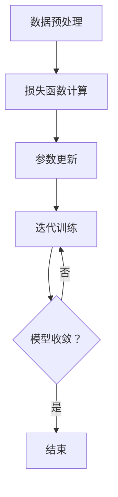

                 

关键词：大模型、应用场景、创新创业、AI技术、增长策略

> 摘要：随着人工智能技术的迅猛发展，大模型的应用场景日益丰富，为创业者带来了前所未有的机遇。本文将深入探讨大模型在各个领域的应用，分析其对创新创业的推动作用，并展望未来发展的趋势与挑战。

## 1. 背景介绍

人工智能（AI）作为当前科技发展的核心驱动力，其应用范围已经从传统的工业自动化、数据挖掘等领域扩展到了医疗、金融、教育等众多行业。尤其是近年来，深度学习技术的发展使得大模型（如GPT、BERT等）在自然语言处理、计算机视觉等领域取得了显著的突破。

大模型是指具有数百万甚至数十亿参数的神经网络模型，其训练过程需要大量的数据和计算资源。随着云计算和分布式计算技术的进步，大模型的训练成本逐渐降低，应用场景也更加多样化。

## 2. 核心概念与联系

### 大模型的构成

大模型主要由以下几部分构成：

1. **输入层**：接收外部输入，如文本、图像、声音等。
2. **隐藏层**：通过神经网络进行复杂的计算，提取特征。
3. **输出层**：根据输入特征生成输出，如文本、分类结果等。

### 大模型的训练

大模型的训练过程分为以下几步：

1. **数据预处理**：对输入数据进行标准化、去噪等处理。
2. **损失函数计算**：通过反向传播算法，计算模型的损失函数。
3. **参数更新**：根据损失函数更新模型参数。
4. **迭代训练**：重复上述步骤，直至模型收敛。

### 大模型的优缺点

**优点**：

1. **强大的特征提取能力**：大模型能够自动提取复杂的数据特征，提高模型的准确性和泛化能力。
2. **适应性强**：大模型可以应用于多种任务，如文本生成、图像识别、语音合成等。

**缺点**：

1. **训练成本高**：大模型需要大量的数据和计算资源进行训练。
2. **解释性差**：大模型的决策过程复杂，难以解释。

### Mermaid 流程图

下面是一个大模型训练的 Mermaid 流程图：



## 3. 核心算法原理 & 具体操作步骤

### 3.1 算法原理概述

大模型的核心算法是基于深度学习中的神经网络，其基本原理如下：

1. **前向传播**：输入数据通过神经网络传递，输出预测结果。
2. **反向传播**：根据预测结果与真实值的差异，计算损失函数，并更新网络参数。

### 3.2 算法步骤详解

1. **初始化参数**：随机初始化模型的权重和偏置。
2. **前向传播**：将输入数据通过神经网络进行计算，得到输出结果。
3. **损失函数计算**：计算输出结果与真实值之间的差异，即损失函数。
4. **反向传播**：根据损失函数，更新网络参数。
5. **迭代训练**：重复上述步骤，直至模型收敛。

### 3.3 算法优缺点

**优点**：

1. **强大的特征提取能力**：大模型能够自动提取复杂的数据特征，提高模型的准确性和泛化能力。
2. **适应性强**：大模型可以应用于多种任务，如文本生成、图像识别、语音合成等。

**缺点**：

1. **训练成本高**：大模型需要大量的数据和计算资源进行训练。
2. **解释性差**：大模型的决策过程复杂，难以解释。

### 3.4 算法应用领域

大模型在多个领域都有广泛的应用，主要包括：

1. **自然语言处理**：如文本生成、机器翻译、情感分析等。
2. **计算机视觉**：如图像分类、目标检测、人脸识别等。
3. **语音识别**：如语音合成、语音识别等。
4. **推荐系统**：如商品推荐、音乐推荐等。

## 4. 数学模型和公式 & 详细讲解 & 举例说明

### 4.1 数学模型构建

大模型通常基于深度学习中的神经网络模型，其基本数学模型如下：

$$
\begin{aligned}
    z &= W \cdot x + b \\
    a &= \sigma(z) \\
    \delta &= \frac{\partial L}{\partial a} \\
    \theta &= \frac{\partial L}{\partial \theta}
\end{aligned}
$$

其中，$z$ 为隐藏层的输入，$a$ 为隐藏层的输出，$L$ 为损失函数，$\delta$ 为误差项，$\theta$ 为模型的参数。

### 4.2 公式推导过程

假设我们有一个二分类问题，目标是判断一个数据点是否属于某个类别。我们可以使用逻辑回归模型来解决这个问题。逻辑回归模型的损失函数通常使用交叉熵损失函数：

$$
L(y, \hat{y}) = -\sum_{i=1}^{n} [y_i \cdot \ln(\hat{y}_i) + (1 - y_i) \cdot \ln(1 - \hat{y}_i)]
$$

其中，$y$ 为真实标签，$\hat{y}$ 为预测概率。

### 4.3 案例分析与讲解

假设我们有一个包含 100 个样本的二分类问题，每个样本的特征为 10 维。我们使用逻辑回归模型进行训练。首先，我们需要准备训练数据和测试数据。

```python
import numpy as np
from sklearn.datasets import make_classification
from sklearn.model_selection import train_test_split
from sklearn.linear_model import LogisticRegression

# 生成训练数据
X, y = make_classification(n_samples=100, n_features=10, n_classes=2, random_state=42)

# 划分训练集和测试集
X_train, X_test, y_train, y_test = train_test_split(X, y, test_size=0.2, random_state=42)

# 训练逻辑回归模型
model = LogisticRegression()
model.fit(X_train, y_train)

# 预测测试集
y_pred = model.predict(X_test)

# 计算准确率
accuracy = np.mean(y_pred == y_test)
print(f"Accuracy: {accuracy}")
```

在上面的代码中，我们首先使用 `make_classification` 函数生成包含 100 个样本的数据集。然后，我们使用 `train_test_split` 函数将数据集划分为训练集和测试集。接下来，我们使用 `LogisticRegression` 类创建逻辑回归模型，并使用 `fit` 方法进行训练。最后，我们使用 `predict` 方法对测试集进行预测，并计算准确率。

## 5. 项目实践：代码实例和详细解释说明

### 5.1 开发环境搭建

在开始项目实践之前，我们需要搭建一个合适的开发环境。这里我们使用 Python 作为主要编程语言，并依赖以下库：

- NumPy：用于数组运算和数据处理。
- SciPy：用于科学计算。
- Matplotlib：用于数据可视化。

安装这些库的方法如下：

```bash
pip install numpy scipy matplotlib
```

### 5.2 源代码详细实现

下面是一个使用 Python 实现逻辑回归模型的项目示例。

```python
import numpy as np
from sklearn.datasets import make_classification
from sklearn.model_selection import train_test_split
from sklearn.linear_model import LogisticRegression
import matplotlib.pyplot as plt

# 生成训练数据
X, y = make_classification(n_samples=100, n_features=10, n_classes=2, random_state=42)

# 划分训练集和测试集
X_train, X_test, y_train, y_test = train_test_split(X, y, test_size=0.2, random_state=42)

# 训练逻辑回归模型
model = LogisticRegression()
model.fit(X_train, y_train)

# 预测测试集
y_pred = model.predict(X_test)

# 计算准确率
accuracy = np.mean(y_pred == y_test)
print(f"Accuracy: {accuracy}")

# 可视化
plt.scatter(X_train[:, 0], X_train[:, 1], c=y_train, cmap='gray')
plt.scatter(X_test[:, 0], X_test[:, 1], c=y_pred, cmap='gray', marker='x')
plt.show()
```

### 5.3 代码解读与分析

在这个示例中，我们首先使用 `make_classification` 函数生成一个包含 100 个样本的二分类数据集。然后，我们使用 `train_test_split` 函数将数据集划分为训练集和测试集。接下来，我们创建一个逻辑回归模型，并使用 `fit` 方法进行训练。最后，我们使用 `predict` 方法对测试集进行预测，并计算准确率。可视化部分展示了训练集和测试集的散点图，并标注了预测结果。

## 6. 实际应用场景

### 6.1 医疗领域

大模型在医疗领域的应用主要包括疾病诊断、药物研发和患者管理等方面。例如，使用深度学习模型对患者的医疗记录进行分析，可以帮助医生快速诊断疾病。此外，大模型还可以用于预测药物的副作用和疗效，加速药物研发过程。

### 6.2 金融领域

大模型在金融领域的应用非常广泛，包括风险评估、欺诈检测、投资策略等。例如，使用深度学习模型对交易数据进行分析，可以帮助金融机构识别潜在的欺诈行为。此外，大模型还可以用于预测市场走势，为投资者提供决策支持。

### 6.3 教育

大模型在教育领域的应用主要包括个性化学习、在线教育平台和智能辅导等方面。例如，使用深度学习模型分析学生的学习行为，可以帮助教育机构提供个性化的学习资源。此外，大模型还可以用于自动生成习题和解答，为学生提供即时的辅导。

## 7. 工具和资源推荐

### 7.1 学习资源推荐

- 《深度学习》（Goodfellow, Bengio, Courville著）：系统介绍了深度学习的基本理论和应用。
- 《动手学深度学习》（阿斯顿·张等著）：通过大量实践案例，介绍深度学习的实际应用。

### 7.2 开发工具推荐

- TensorFlow：由谷歌开发的开源深度学习框架，支持多种深度学习模型的训练和部署。
- PyTorch：由Facebook开发的开源深度学习框架，具有灵活的动态计算图和强大的社区支持。

### 7.3 相关论文推荐

- "A Theoretically Grounded Application of Dropout in Recurrent Neural Networks"
- "Attention Is All You Need"
- "An Image Database for Deception Detection"

## 8. 总结：未来发展趋势与挑战

### 8.1 研究成果总结

大模型在自然语言处理、计算机视觉、语音识别等领域的应用取得了显著的成果，为各行业带来了革命性的变化。例如，在医疗领域，大模型可以帮助医生更准确地诊断疾病；在金融领域，大模型可以识别潜在的欺诈行为，提高风险管理能力。

### 8.2 未来发展趋势

随着人工智能技术的不断进步，大模型的应用场景将继续拓展，有望在更多领域发挥重要作用。例如，在智能制造领域，大模型可以用于优化生产流程；在智慧城市领域，大模型可以用于交通流量预测和城市管理。

### 8.3 面临的挑战

尽管大模型的应用前景广阔，但仍然面临一些挑战。首先，大模型的训练成本较高，需要大量的数据和计算资源。其次，大模型的决策过程复杂，难以解释，这可能影响其在一些关键领域的应用。此外，大模型的隐私保护和安全性问题也需要引起关注。

### 8.4 研究展望

未来，大模型的研究将朝着以下几个方向发展：

1. **提高训练效率**：通过改进训练算法和优化硬件资源，提高大模型的训练效率。
2. **加强模型解释性**：研究如何提高大模型的解释性，使其在关键领域的应用更加可靠。
3. **隐私保护和安全性**：研究如何在大模型训练和应用过程中保护用户隐私和确保数据安全。

## 9. 附录：常见问题与解答

### 9.1 大模型训练需要哪些计算资源？

大模型训练通常需要高性能的GPU或TPU，以及足够的内存和存储空间。对于一些特别大的模型，可能需要分布式计算环境进行训练。

### 9.2 大模型在哪些领域有广泛的应用？

大模型在自然语言处理、计算机视觉、语音识别、推荐系统等领域有广泛的应用。随着技术的进步，大模型的应用场景还将继续拓展。

### 9.3 如何提高大模型的解释性？

提高大模型的解释性是当前研究的重点。一些方法包括使用可解释的神经网络架构、模型压缩和蒸馏等。

---

感谢您阅读本文，希望本文对您了解大模型的应用场景和未来发展有所帮助。如果您有任何问题或建议，欢迎在评论区留言。作者：禅与计算机程序设计艺术 / Zen and the Art of Computer Programming。

