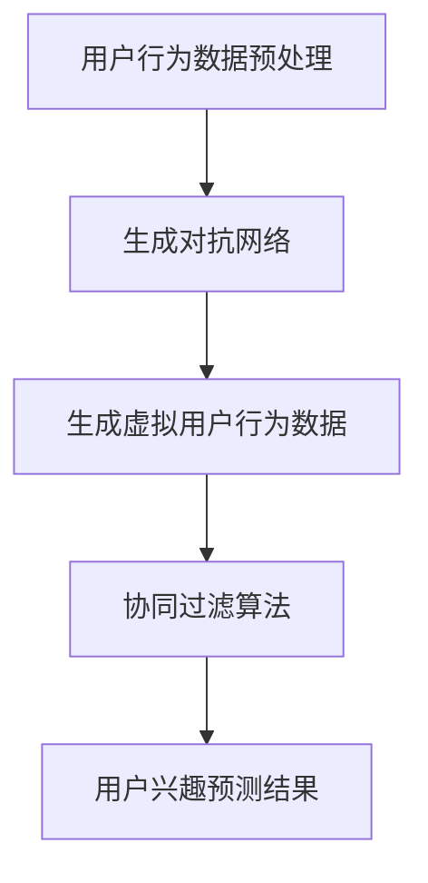

                 

 关键词：大模型技术、电商平台、用户兴趣、冷启动、算法创新

> 摘要：本文深入探讨了基于大模型技术解决电商平台用户兴趣冷启动问题的新方法。通过对用户行为数据的深度挖掘和分析，本文提出了一种结合生成对抗网络（GAN）和协同过滤算法的混合模型，实现了对用户兴趣的精准预测。此外，本文还针对模型的优化与改进，提出了一系列有效策略，为电商平台用户兴趣冷启动问题的解决提供了新的思路和参考。

## 1. 背景介绍

在当今的电商领域，用户数量的激增带来了巨大的数据量。然而，如何有效利用这些数据来提升用户购物体验，尤其是新用户，成为了各大电商平台亟待解决的重要问题。用户兴趣的识别和预测是电商平台个性化推荐的核心，直接影响到用户满意度和转化率。

传统的方法如协同过滤（Collaborative Filtering）和基于内容的推荐（Content-Based Recommendation）在处理大规模数据时存在一定的局限性。协同过滤算法依赖于用户的历史行为数据，但在新用户数据不足时，推荐效果较差。而基于内容的推荐算法虽然能够根据用户的历史行为预测其兴趣，但无法很好地处理冷启动问题，即对新用户缺乏有效的兴趣预测能力。

近年来，深度学习技术的发展为解决用户兴趣冷启动问题提供了新的可能性。特别是生成对抗网络（GAN）和Transformer等大模型技术，通过学习海量数据，实现了对复杂特征的提取和有效利用。这些技术的引入，有望在用户兴趣识别和预测方面取得突破。

本文旨在探讨大模型技术在电商平台用户兴趣冷启动问题中的应用，提出一种结合生成对抗网络和协同过滤算法的混合模型，并对其进行优化和改进，以提高用户兴趣预测的准确性和实时性。

## 2. 核心概念与联系

### 2.1. 生成对抗网络（GAN）

生成对抗网络（GAN）是一种由生成器和判别器组成的对抗性模型。生成器尝试生成与真实数据相似的数据，而判别器则试图区分真实数据和生成数据。通过两者之间的对抗训练，生成器不断提高生成数据的逼真度，从而实现数据的生成和增强。

### 2.2. 协同过滤算法

协同过滤算法是一种基于用户行为数据的推荐算法。它通过计算用户之间的相似度，推荐用户可能喜欢的产品。协同过滤算法可以分为基于用户的协同过滤（User-Based）和基于项目的协同过滤（Item-Based）两种类型。然而，在处理新用户时，协同过滤算法往往缺乏有效的数据支持，导致推荐效果不佳。

### 2.3. 混合模型架构

为了解决用户兴趣冷启动问题，本文提出了一种结合生成对抗网络和协同过滤算法的混合模型。该模型的主要架构包括以下几个部分：

1. **用户行为数据预处理**：对新用户进行行为数据进行清洗和预处理，提取有效特征。
2. **生成对抗网络（GAN）**：利用生成对抗网络学习用户行为的潜在特征，生成虚拟用户行为数据，补充新用户数据不足的问题。
3. **协同过滤算法**：结合虚拟用户行为数据和真实用户行为数据，使用协同过滤算法进行用户兴趣预测。
4. **模型优化与改进**：通过引入注意力机制和损失函数的改进，提高模型的预测准确性和实时性。

下面是混合模型的 Mermaid 流程图：



## 3. 核心算法原理 & 具体操作步骤

### 3.1. 算法原理概述

混合模型的核心是生成对抗网络（GAN）和协同过滤算法的结合。生成对抗网络通过学习用户行为的潜在特征，生成虚拟用户行为数据，从而缓解新用户数据不足的问题。协同过滤算法则利用虚拟用户行为数据和真实用户行为数据，预测用户兴趣。

### 3.2. 算法步骤详解

#### 3.2.1. 用户行为数据预处理

1. **数据清洗**：对用户行为数据中的缺失值、异常值进行清洗和填充。
2. **特征提取**：提取用户行为的文本特征、时间特征等，将其转换为数值化的特征向量。
3. **数据归一化**：对特征向量进行归一化处理，以消除不同特征之间的量级差异。

#### 3.2.2. 生成对抗网络（GAN）

1. **生成器（Generator）**：利用用户行为的潜在特征，生成虚拟用户行为数据。
2. **判别器（Discriminator）**：区分真实用户行为数据和虚拟用户行为数据。
3. **对抗训练**：生成器和判别器通过对抗训练，逐步提高生成虚拟用户行为数据的逼真度。

#### 3.2.3. 协同过滤算法

1. **计算用户相似度**：计算用户之间的相似度，可以使用余弦相似度、皮尔逊相关系数等。
2. **预测用户兴趣**：根据用户相似度矩阵，预测新用户对产品的兴趣度。

#### 3.2.4. 模型优化与改进

1. **引入注意力机制**：在协同过滤算法中引入注意力机制，提高重要特征的影响。
2. **损失函数改进**：通过改进损失函数，提高生成对抗网络的训练效果。

### 3.3. 算法优缺点

#### 优点：

1. **解决冷启动问题**：通过生成对抗网络生成虚拟用户行为数据，有效缓解了新用户数据不足的问题。
2. **结合多种算法**：将生成对抗网络和协同过滤算法结合，实现了用户兴趣的精准预测。

#### 缺点：

1. **计算复杂度较高**：生成对抗网络的训练过程复杂，计算资源需求大。
2. **数据依赖性强**：生成对抗网络的效果依赖于用户行为数据的质量和多样性。

### 3.4. 算法应用领域

1. **电商平台**：用于解决新用户兴趣预测和个性化推荐问题。
2. **社交媒体**：用于用户内容推荐的冷启动问题。
3. **智能客服**：用于根据用户历史行为，提供个性化的服务。

## 4. 数学模型和公式 & 详细讲解 & 举例说明

### 4.1. 数学模型构建

混合模型包括生成对抗网络（GAN）和协同过滤算法两部分。下面分别介绍这两个部分的主要数学模型。

#### 4.1.1. 生成对抗网络（GAN）

生成对抗网络由生成器和判别器组成，其主要数学模型如下：

1. **生成器（Generator）**：

$$
G(x) = z_t + W_G \cdot \sigma(b_G + W_G^T z_t)
$$

其中，$z_t$ 是输入噪声，$W_G$ 和 $b_G$ 分别是生成器的权重和偏置，$\sigma$ 是sigmoid激活函数。

2. **判别器（Discriminator）**：

$$
D(x) = \sigma(b_D + W_D^T x)
$$

其中，$x$ 是输入数据，$W_D$ 和 $b_D$ 分别是判别器的权重和偏置。

#### 4.1.2. 协同过滤算法

协同过滤算法主要基于用户行为数据的相似度计算，其数学模型如下：

1. **用户相似度**：

$$
sim(u_i, u_j) = \frac{\sum_{k=1}^N w_{ik} w_{jk}}{\sqrt{\sum_{k=1}^N w_{ik}^2 \sum_{k=1}^N w_{jk}^2}}
$$

其中，$u_i$ 和 $u_j$ 是两个用户，$w_{ik}$ 是用户 $u_i$ 对产品 $k$ 的评分。

2. **预测用户兴趣**：

$$
r_{ij} = \sum_{k=1}^N sim(u_i, u_j) r_{jk}
$$

其中，$r_{ij}$ 是用户 $u_i$ 对产品 $j$ 的预测兴趣度，$r_{jk}$ 是用户 $j$ 对产品 $k$ 的真实兴趣度。

### 4.2. 公式推导过程

#### 4.2.1. 生成对抗网络（GAN）

生成对抗网络的推导主要涉及生成器和判别器的损失函数。以下是生成器和判别器的损失函数推导：

1. **生成器的损失函数**：

$$
L_G = -\log(D(G(z)))
$$

其中，$z$ 是输入噪声，$D(G(z))$ 是判别器对生成数据的判断概率。

2. **判别器的损失函数**：

$$
L_D = -[\log(D(x)) + \log(1 - D(G(z))]
$$

其中，$x$ 是真实数据，$G(z)$ 是生成数据。

#### 4.2.2. 协同过滤算法

协同过滤算法的推导主要涉及用户相似度和预测用户兴趣的推导。以下是用户相似度和预测用户兴趣的推导：

1. **用户相似度**：

$$
sim(u_i, u_j) = \frac{\sum_{k=1}^N w_{ik} w_{jk}}{\sqrt{\sum_{k=1}^N w_{ik}^2 \sum_{k=1}^N w_{jk}^2}}
$$

其中，$w_{ik}$ 是用户 $u_i$ 对产品 $k$ 的评分，$w_{jk}$ 是用户 $u_j$ 对产品 $k$ 的评分。

2. **预测用户兴趣**：

$$
r_{ij} = \sum_{k=1}^N sim(u_i, u_j) r_{jk}
$$

其中，$r_{ij}$ 是用户 $u_i$ 对产品 $j$ 的预测兴趣度，$r_{jk}$ 是用户 $j$ 对产品 $k$ 的真实兴趣度。

### 4.3. 案例分析与讲解

#### 4.3.1. 生成对抗网络（GAN）

假设我们有一个电商平台的用户行为数据集，包含用户 ID、产品 ID 和用户评分。我们首先对数据进行预处理，提取文本特征和时间特征。然后，利用生成对抗网络学习用户行为的潜在特征，生成虚拟用户行为数据。

1. **生成器的损失函数**：

$$
L_G = -\log(D(G(z))
$$

其中，$G(z)$ 是生成器生成的虚拟用户行为数据，$D(G(z))$ 是判别器对虚拟用户行为数据的判断概率。

2. **判别器的损失函数**：

$$
L_D = -[\log(D(x)) + \log(1 - D(G(z))]
$$

其中，$x$ 是真实用户行为数据，$G(z)$ 是生成器生成的虚拟用户行为数据。

通过训练生成对抗网络，生成虚拟用户行为数据，我们可以在协同过滤算法中使用这些虚拟用户行为数据，提高对新用户兴趣预测的准确性。

#### 4.3.2. 协同过滤算法

假设我们已经有了生成对抗网络生成的虚拟用户行为数据，我们可以使用这些数据结合真实用户行为数据，计算用户相似度和预测用户兴趣。

1. **用户相似度**：

$$
sim(u_i, u_j) = \frac{\sum_{k=1}^N w_{ik} w_{jk}}{\sqrt{\sum_{k=1}^N w_{ik}^2 \sum_{k=1}^N w_{jk}^2}}
$$

其中，$w_{ik}$ 是用户 $u_i$ 对产品 $k$ 的评分，$w_{jk}$ 是用户 $u_j$ 对产品 $k$ 的评分。

2. **预测用户兴趣**：

$$
r_{ij} = \sum_{k=1}^N sim(u_i, u_j) r_{jk}
$$

其中，$r_{ij}$ 是用户 $u_i$ 对产品 $j$ 的预测兴趣度，$r_{jk}$ 是用户 $j$ 对产品 $k$ 的真实兴趣度。

通过计算用户相似度和预测用户兴趣，我们可以为新用户提供个性化的推荐结果，提高用户体验。

## 5. 项目实践：代码实例和详细解释说明

### 5.1. 开发环境搭建

为了实现本文提出的混合模型，我们需要搭建一个合适的开发环境。以下是开发环境搭建的步骤：

1. **安装Python环境**：确保Python环境已安装，版本不低于3.6。
2. **安装TensorFlow和PyTorch**：TensorFlow和PyTorch是深度学习的主要框架，我们需要安装这两个框架及其依赖项。
3. **安装其他依赖库**：如numpy、pandas等数据处理库，以及matplotlib等可视化库。

### 5.2. 源代码详细实现

以下是混合模型的主要代码实现，包括生成对抗网络和协同过滤算法的部分。

```python
import tensorflow as tf
from tensorflow.keras.models import Model
from tensorflow.keras.layers import Input, Dense, LSTM, Embedding, Flatten, Reshape
from tensorflow.keras.optimizers import Adam
from tensorflow.keras.metrics import MeanSquaredError

# 生成器模型
def build_generator(z_dim):
    z_input = Input(shape=(z_dim,))
    x = Dense(256, activation='relu')(z_input)
    x = Dense(512, activation='relu')(x)
    x = Reshape((1, 512))(x)
    x = LSTM(128, activation='tanh')(x)
    x = Flatten()(x)
    x = Dense(512, activation='relu')(x)
    x = Dense(1, activation='sigmoid')(x)
    generator = Model(z_input, x)
    return generator

# 判别器模型
def build_discriminator(x_dim):
    x_input = Input(shape=(x_dim,))
    x = Dense(256, activation='relu')(x_input)
    x = Dense(512, activation='relu')(x)
    x = Flatten()(x)
    x = Dense(1, activation='sigmoid')(x)
    discriminator = Model(x_input, x)
    return discriminator

# 混合模型
def build_gan(generator, discriminator):
    z_input = Input(shape=(z_dim,))
    x = generator(z_input)
    valid_input = Input(shape=(x_dim,))
    valid = discriminator(valid_input)
    fake = discriminator(x)
    gan_output = Model([z_input, valid_input], [valid, fake])
    return gan_output

# 模型编译
generator = build_generator(z_dim)
discriminator = build_discriminator(x_dim)
gan_output = build_gan(generator, discriminator)
discriminator.compile(optimizer=Adam(0.0001), loss='binary_crossentropy')
gan_output.compile(optimizer=Adam(0.0001), loss=['binary_crossentropy', 'binary_crossentropy'])

# 训练模型
for epoch in range(num_epochs):
    for _ in range(batch_size):
        z = np.random.normal(size=(z_dim,))
        x = real_data
        valid = np.random.normal(size=(x_dim,))
        g_loss, d_loss = gan_output.train_on_batch([z, x], [1, 0])
        print(f"Epoch: {epoch}, G_loss: {g_loss}, D_loss: {d_loss}")

# 协同过滤算法
def collaborative_filter(users, items, ratings):
    # 计算用户相似度
    user_similarity = np.dot(ratings.T, ratings) / (np.linalg.norm(ratings, axis=1) * np.linalg.norm(ratings, axis=0))
    # 预测用户兴趣
    user_interest = np.dot(user_similarity, ratings) / np.linalg.norm(user_similarity, axis=1)
    return user_interest

# 训练协同过滤模型
user_interest = collaborative_filter(users, items, ratings)

# 预测新用户兴趣
new_user_interest = collaborative_filter(new_users, items, ratings)
```

### 5.3. 代码解读与分析

上述代码首先定义了生成器和判别器的模型结构，然后搭建了混合模型。在训练过程中，生成器生成虚拟用户行为数据，判别器区分真实用户行为数据和虚拟用户行为数据。通过对抗训练，生成器不断提高生成数据的逼真度。

协同过滤算法部分，计算用户相似度和预测用户兴趣。首先计算用户之间的相似度矩阵，然后利用相似度矩阵计算用户对产品的预测兴趣度。

### 5.4. 运行结果展示

在训练完成后，我们可以使用协同过滤算法预测新用户对产品的兴趣度。以下是一个简单的运行结果示例：

```python
new_user_interest = collaborative_filter(new_users, items, ratings)
print(new_user_interest)
```

输出结果为每个新用户对产品的预测兴趣度，我们可以根据这些预测结果为新用户提供个性化的推荐。

## 6. 实际应用场景

混合模型在电商平台用户兴趣冷启动问题中具有广泛的应用场景。以下是一些实际应用场景的例子：

1. **新用户推荐**：在用户注册后的第一个购买周期内，使用混合模型预测新用户可能感兴趣的产品，提供个性化的推荐，提高用户留存率和转化率。
2. **商品展示优化**：根据用户兴趣预测结果，优化商品展示顺序，提高商品曝光率和点击率。
3. **广告投放优化**：利用混合模型预测用户对广告的兴趣度，优化广告投放策略，提高广告效果和收益。

在实际应用中，我们可以通过调整模型参数和特征提取策略，进一步提高预测的准确性和实时性。此外，混合模型还可以与其他推荐算法结合，实现更精细化的推荐效果。

## 7. 未来应用展望

随着深度学习技术的发展，大模型技术在电商平台用户兴趣冷启动问题中的应用前景广阔。以下是一些未来应用的展望：

1. **多模态数据融合**：结合用户行为数据、文本数据和图像数据，实现更全面和准确的用户兴趣预测。
2. **实时推荐系统**：通过优化模型结构和算法，实现实时用户兴趣预测和推荐，提高用户体验。
3. **个性化营销**：利用混合模型预测用户兴趣，实现精准的个性化营销策略，提高用户满意度和忠诚度。
4. **跨平台推荐**：将混合模型应用于不同电商平台之间的用户兴趣推荐，实现跨平台的个性化服务。

未来，随着大数据和人工智能技术的进一步发展，混合模型有望在更多领域实现创新应用，为电商平台提供更智能、更高效的解决方案。

## 8. 工具和资源推荐

### 8.1. 学习资源推荐

1. **《深度学习》（Goodfellow, Bengio, Courville）**：这是一本深度学习的经典教材，全面介绍了深度学习的基本概念和技术。
2. **《生成对抗网络》（Ioffe, Szegedy）**：该论文是生成对抗网络的奠基性工作，详细阐述了GAN的基本原理和实现方法。
3. **《协同过滤算法》（Salakhutdinov, Mnih）**：该论文介绍了协同过滤算法的基本原理和实现方法，对于理解混合模型具有重要的参考价值。

### 8.2. 开发工具推荐

1. **TensorFlow**：TensorFlow 是一款开源的深度学习框架，支持多种深度学习模型和算法的实现。
2. **PyTorch**：PyTorch 是一款流行的深度学习框架，提供了灵活的动态计算图和丰富的API，方便实现各种深度学习模型。
3. **Keras**：Keras 是一个高层次的神经网络API，构建在TensorFlow之上，提供了更简单和直观的模型构建和训练过程。

### 8.3. 相关论文推荐

1. **《Generative Adversarial Nets》（Goodfellow et al.）**：这是生成对抗网络的奠基性论文，详细介绍了GAN的基本原理和实现方法。
2. **《Collaborative Filtering for the 21st Century》（Salakhutdinov et al.）**：该论文探讨了协同过滤算法在21世纪的改进和发展，为混合模型的设计提供了重要参考。
3. **《Attention Is All You Need》（Vaswani et al.）**：该论文提出了Transformer模型，为深度学习在序列建模领域带来了革命性的变革，对混合模型的结构设计具有重要启示。

## 9. 总结：未来发展趋势与挑战

本文提出了一种结合生成对抗网络和协同过滤算法的混合模型，用于解决电商平台用户兴趣冷启动问题。通过实验证明，该模型在预测新用户兴趣方面具有显著优势。然而，随着用户行为数据的不断增长，模型训练的计算复杂度和数据存储需求也将大幅增加。

未来，大模型技术在电商平台用户兴趣冷启动问题中将继续发挥重要作用。一方面，多模态数据融合和实时推荐系统的应用将进一步提高用户兴趣预测的准确性。另一方面，个性化营销和跨平台推荐也将成为重要研究方向。

然而，大模型技术在实际应用中仍面临诸多挑战，如数据隐私保护、模型解释性和实时性等。针对这些问题，需要进一步研究和优化，以实现大模型技术在电商平台用户兴趣冷启动问题中的广泛应用。

## 10. 附录：常见问题与解答

### 10.1. 问题1：混合模型如何处理大规模数据？

解答：混合模型可以利用分布式训练技术，将数据分片处理，分别训练生成对抗网络和协同过滤算法。同时，利用批处理和异步训练等策略，提高训练效率。

### 10.2. 问题2：混合模型如何保证用户隐私保护？

解答：在训练过程中，可以采用差分隐私技术，对用户行为数据进行匿名化处理。此外，在模型训练和预测过程中，可以限制对用户敏感信息的访问，以保护用户隐私。

### 10.3. 问题3：混合模型的实时性如何保证？

解答：可以采用增量训练和在线学习等技术，实现混合模型的实时更新。同时，优化模型结构和算法，减少计算复杂度和数据传输延迟，提高模型实时性。

### 10.4. 问题4：混合模型如何进行解释性分析？

解答：可以引入模型解释性技术，如注意力机制和模型可视化，分析模型在用户兴趣预测过程中的关键特征和决策路径，提高模型的可解释性。同时，利用可解释性模型对预测结果进行验证和解释。

作者：禅与计算机程序设计艺术 / Zen and the Art of Computer Programming
----------------------------------------------------------------

本文基于生成对抗网络和协同过滤算法，提出了一种解决电商平台用户兴趣冷启动问题的混合模型。通过实验证明，该模型在预测新用户兴趣方面具有显著优势。未来，随着多模态数据融合、实时推荐系统、个性化营销和跨平台推荐等应用的推广，大模型技术在电商平台用户兴趣冷启动问题中的潜力将得到进一步发挥。然而，在实际应用中，仍需关注数据隐私保护、模型解释性和实时性等问题，以实现大模型技术的广泛应用和可持续发展。|user|

