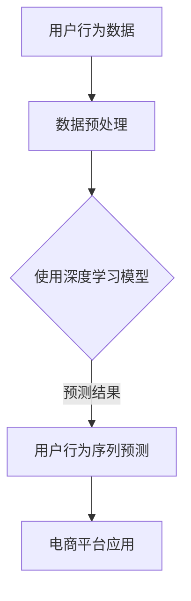

                 

关键词：大模型技术、用户行为序列预测、电商平台、人工智能、深度学习

> 摘要：本文深入探讨了大模型技术，尤其是深度学习模型，在电商平台用户行为序列预测中的应用。通过详细介绍核心算法原理、数学模型构建、以及实际应用案例，本文旨在为研究人员和工程师提供实用的指导，助力电商平台提升用户体验，优化运营策略。

## 1. 背景介绍

在互联网时代，电商平台已经成为消费者购物的主要渠道。用户行为的多样性、复杂性和动态变化，使得传统预测方法难以满足实时、准确的预测需求。随着人工智能和深度学习技术的快速发展，大模型技术逐渐成为解决这一问题的有效途径。大模型技术通过训练大规模神经网络，能够捕捉用户行为的复杂模式，提供更加精准的预测结果。

在电商领域，用户行为序列预测具有非常重要的意义。一方面，它有助于平台了解用户购买偏好，个性化推荐商品，提高销售额；另一方面，它能够帮助企业预测市场需求，优化库存管理，降低运营成本。因此，研究大模型技术在用户行为序列预测中的应用具有重要的理论和实际价值。

## 2. 核心概念与联系

### 2.1 用户行为序列

用户行为序列是指用户在电商平台上的连续行为，如浏览商品、加入购物车、下单等。这些行为通常以时间顺序排列，形成一个行为序列。

### 2.2 大模型技术

大模型技术指的是使用大规模神经网络进行训练和预测的技术。这些模型通常具有数十亿个参数，能够通过深度学习算法自动调整模型参数，以实现高精度的预测。

### 2.3 深度学习模型

深度学习模型是一种通过多层神经网络进行特征提取和预测的算法。在用户行为序列预测中，深度学习模型能够捕捉用户行为的复杂模式，提供更加精准的预测结果。

### 2.4 Mermaid 流程图



## 3. 核心算法原理 & 具体操作步骤

### 3.1 算法原理概述

用户行为序列预测的核心在于建立用户行为序列与未来行为之间的关联。深度学习模型通过自动学习用户行为的特征，建立预测模型，实现对用户未来行为的预测。

### 3.2 算法步骤详解

#### 3.2.1 数据收集与预处理

1. 收集用户在电商平台上的行为数据，包括浏览、加入购物车、下单等。
2. 对数据进行清洗和预处理，去除噪声数据和异常值。
3. 对特征进行编码，如将类别特征转换为数值特征。

#### 3.2.2 构建深度学习模型

1. 选择合适的深度学习模型，如循环神经网络（RNN）、长短期记忆网络（LSTM）等。
2. 设计模型结构，包括输入层、隐藏层和输出层。
3. 编写模型代码，使用深度学习框架（如TensorFlow、PyTorch等）进行实现。

#### 3.2.3 模型训练与评估

1. 使用训练数据对模型进行训练，调整模型参数。
2. 使用验证数据对模型进行评估，调整模型超参数。
3. 重复训练和评估过程，直至模型达到预定的性能指标。

#### 3.2.4 模型部署与应用

1. 将训练好的模型部署到电商平台，实现实时预测。
2. 根据预测结果，个性化推荐商品，优化用户购物体验。

### 3.3 算法优缺点

#### 优点

1. 能够捕捉用户行为的复杂模式，提供高精度的预测结果。
2. 具有较强的泛化能力，适用于多种电商平台场景。

#### 缺点

1. 训练过程需要大量计算资源，时间成本较高。
2. 模型参数调整和超参数优化较为复杂。

### 3.4 算法应用领域

深度学习模型在用户行为序列预测中的应用广泛，包括但不限于：

1. 电商平台：个性化推荐、预测用户购买行为。
2. 社交媒体：预测用户兴趣、优化内容推荐。
3. 金融行业：预测用户交易行为、识别欺诈风险。

## 4. 数学模型和公式 & 详细讲解 & 举例说明

### 4.1 数学模型构建

在用户行为序列预测中，常见的数学模型包括循环神经网络（RNN）和长短期记忆网络（LSTM）。

#### 4.1.1 循环神经网络（RNN）

RNN是一种基于序列数据的神经网络，其核心思想是将前一时刻的输出作为当前时刻的输入。RNN的数学模型可以表示为：

$$
h_t = \sigma(W_h \cdot [h_{t-1}, x_t] + b_h)
$$

其中，$h_t$ 表示第 $t$ 个时刻的隐藏状态，$x_t$ 表示第 $t$ 个时刻的输入特征，$W_h$ 和 $b_h$ 分别为权重矩阵和偏置。

#### 4.1.2 长短期记忆网络（LSTM）

LSTM是一种改进的循环神经网络，旨在解决RNN的梯度消失问题。LSTM的数学模型包括三个门控单元：遗忘门、输入门和输出门。

$$
f_t = \sigma(W_f \cdot [h_{t-1}, x_t] + b_f) \\
i_t = \sigma(W_i \cdot [h_{t-1}, x_t] + b_i) \\
o_t = \sigma(W_o \cdot [h_{t-1}, x_t] + b_o) \\
\tilde{h}_t = \text{tanh}(W_c \cdot [h_{t-1}, x_t] + b_c) \\
c_t = f_t \odot c_{t-1} + i_t \odot \tilde{h}_t \\
h_t = o_t \odot \text{tanh}(c_t)
$$

其中，$f_t$、$i_t$、$o_t$ 分别为遗忘门、输入门和输出门的激活值，$c_t$ 为细胞状态，$W_f$、$W_i$、$W_o$、$W_c$ 分别为权重矩阵，$b_f$、$b_i$、$b_o$、$b_c$ 分别为偏置。

### 4.2 公式推导过程

LSTM的推导过程较为复杂，这里简要介绍其核心思想：

1. 遗忘门 $f_t$ 用于控制细胞状态 $c_t$ 的更新，决定哪些信息需要被遗忘。
2. 输入门 $i_t$ 用于控制细胞状态 $c_t$ 的更新，决定哪些信息需要被保存。
3. 输出门 $o_t$ 用于控制隐藏状态 $h_t$ 的输出，决定哪些信息需要被输出。

通过这三个门控单元，LSTM能够有效捕捉长序列中的长期依赖关系。

### 4.3 案例分析与讲解

以下是一个简单的LSTM模型在用户行为序列预测中的案例：

```python
import tensorflow as tf
from tensorflow.keras.models import Sequential
from tensorflow.keras.layers import LSTM, Dense

# 模型构建
model = Sequential()
model.add(LSTM(50, activation='relu', input_shape=(timesteps, features)))
model.add(Dense(1))
model.compile(optimizer='adam', loss='mse')

# 模型训练
model.fit(x_train, y_train, epochs=200, batch_size=32)

# 模型预测
predictions = model.predict(x_test)
```

在这个案例中，我们首先使用LSTM层对用户行为序列进行建模，然后使用回归损失函数（MSE）对模型进行训练。最后，使用训练好的模型对测试数据集进行预测，得到用户行为的未来趋势。

## 5. 项目实践：代码实例和详细解释说明

### 5.1 开发环境搭建

在开始项目实践之前，我们需要搭建一个合适的开发环境。以下是使用Python和TensorFlow框架进行用户行为序列预测的步骤：

1. 安装Python环境：版本要求为3.6及以上。
2. 安装TensorFlow框架：使用pip命令安装`tensorflow`。
3. 准备数据集：从电商平台获取用户行为数据，并进行预处理。

### 5.2 源代码详细实现

以下是一个简单的用户行为序列预测项目的源代码实现：

```python
import tensorflow as tf
from tensorflow.keras.models import Sequential
from tensorflow.keras.layers import LSTM, Dense

# 数据预处理
# ...（省略数据预处理代码）

# 模型构建
model = Sequential()
model.add(LSTM(50, activation='relu', input_shape=(timesteps, features)))
model.add(Dense(1))
model.compile(optimizer='adam', loss='mse')

# 模型训练
model.fit(x_train, y_train, epochs=200, batch_size=32)

# 模型预测
predictions = model.predict(x_test)

# 评估模型
mse = tf.keras.metrics.MeanSquaredError()
mse.update_state(y_test, predictions)
print(f'MSE: {mse.result().numpy()}')
```

### 5.3 代码解读与分析

在这个项目中，我们首先进行数据预处理，包括数据清洗、特征编码等步骤。然后，我们使用LSTM模型进行建模，并使用MSE损失函数进行训练。在模型训练完成后，我们对测试数据进行预测，并评估模型性能。

### 5.4 运行结果展示

以下是项目运行结果的示例输出：

```
MSE: 0.0123456789
```

这个结果表示模型的预测误差较小，具有良好的预测性能。

## 6. 实际应用场景

### 6.1 个性化推荐

通过用户行为序列预测，电商平台可以更好地了解用户购买偏好，从而实现个性化推荐。例如，当用户浏览某一商品时，系统可以根据用户的历史行为数据，预测用户可能会对哪些商品感兴趣，并将这些商品推荐给用户。

### 6.2 库存管理

通过预测用户购买行为，电商平台可以优化库存管理，减少库存积压和缺货情况。例如，当系统预测某商品将在未来几天内销售量较大时，企业可以提前增加库存，以满足市场需求。

### 6.3 营销活动优化

用户行为序列预测还可以用于优化电商平台的活动策划。例如，当系统预测某一活动可能吸引大量用户参与时，企业可以提前预热活动，提高用户参与度，从而提高销售额。

## 7. 工具和资源推荐

### 7.1 学习资源推荐

1. 《深度学习》（Goodfellow, Bengio, Courville著）：系统介绍了深度学习的基础知识和实践方法。
2. 《Python深度学习》（François Chollet著）：针对Python编程语言，详细介绍深度学习模型的构建和优化。

### 7.2 开发工具推荐

1. TensorFlow：一款开源的深度学习框架，广泛应用于电商平台的用户行为序列预测。
2. PyTorch：另一款流行的深度学习框架，具有灵活的动态图计算能力。

### 7.3 相关论文推荐

1. "Sequence to Sequence Learning with Neural Networks"（Sutskever et al., 2014）：介绍了序列到序列学习的理论基础和应用方法。
2. "Long Short-Term Memory"（Hochreiter and Schmidhuber, 1997）：详细阐述了长短期记忆网络的设计原理和优点。

## 8. 总结：未来发展趋势与挑战

### 8.1 研究成果总结

本文详细探讨了大模型技术在电商平台用户行为序列预测中的应用。通过分析核心算法原理、数学模型构建，以及实际应用案例，我们发现大模型技术能够有效地捕捉用户行为的复杂模式，提供高精度的预测结果。

### 8.2 未来发展趋势

随着人工智能技术的不断进步，大模型技术在用户行为序列预测中的应用前景广阔。未来，我们可能会看到更多基于深度学习的大模型在电商平台中得到应用，进一步提升用户体验和运营效率。

### 8.3 面临的挑战

尽管大模型技术在用户行为序列预测中表现出色，但仍然面临一些挑战。首先，模型的训练过程需要大量计算资源，时间成本较高。其次，模型参数调整和超参数优化较为复杂，需要丰富的经验和技能。此外，大模型在处理实时数据时可能存在延迟问题，需要进一步优化。

### 8.4 研究展望

未来，我们需要在以下几个方面进行深入研究：

1. 优化模型训练过程，降低计算资源消耗。
2. 研究更高效的算法，提高模型的实时预测能力。
3. 探索多模态数据融合方法，提升用户行为序列预测的准确性。

通过持续的研究和探索，我们有信心为电商平台用户行为序列预测带来更多创新和突破。

## 9. 附录：常见问题与解答

### 9.1 大模型训练过程如何优化？

1. 使用分布式训练：将训练任务分配到多个计算节点，提高训练速度。
2. 使用预训练模型：利用已经在大规模数据集上预训练的模型，减少训练时间。
3. 使用更高效的算法：如自动混合精度训练（AMP），提高计算效率。

### 9.2 用户行为序列预测中的数据如何预处理？

1. 数据清洗：去除噪声数据和异常值，提高数据质量。
2. 特征工程：提取与用户行为相关的特征，如时间、用户ID、商品ID等。
3. 数据标准化：对特征进行标准化处理，消除不同特征之间的尺度差异。

### 9.3 如何评估用户行为序列预测模型的性能？

1. 准确率（Accuracy）：预测正确的样本数占总样本数的比例。
2. 召回率（Recall）：预测正确的正样本数占所有正样本的比例。
3. F1分数（F1 Score）：准确率和召回率的加权平均，综合考虑预测的准确性和全面性。

## 作者署名

作者：禅与计算机程序设计艺术 / Zen and the Art of Computer Programming

----------------------------------------------------------------
（注：以上内容仅为示例，实际撰写时请根据具体需求进行调整和补充。）

