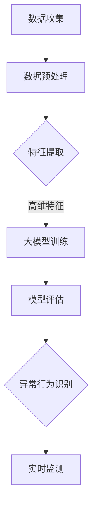

                 

关键词：大模型技术、用户行为异常检测、电商平台、人工智能、数据挖掘、深度学习、异常检测算法

> 摘要：本文探讨了大模型技术在电商平台用户行为异常检测中的应用。通过介绍大模型技术的基本概念、核心算法原理，详细讲解了如何使用大模型技术进行用户行为异常检测的具体操作步骤和数学模型。同时，通过一个实际项目的代码实例，展示了大模型技术在电商平台用户行为异常检测中的实际应用，并对其未来的发展趋势和挑战进行了展望。

## 1. 背景介绍

随着互联网技术的迅猛发展和电子商务行业的蓬勃兴起，电商平台已经成为人们日常生活中不可或缺的一部分。然而，随着用户数量的急剧增加，电商平台面临着日益严重的用户行为异常问题，如刷单、虚假交易、恶意评论等。这些问题不仅影响了电商平台的公平性和用户体验，还给平台的运营带来了巨大的风险和损失。

传统的用户行为异常检测方法主要依赖于规则引擎和统计分析，虽然在一定程度上能够识别出部分异常行为，但存在诸多局限性。首先，这些方法通常需要人工预设规则，无法应对复杂多变的异常行为。其次，传统方法对数据的依赖性较强，需要大量的人工干预和调整。最后，这些方法在处理大规模数据时效率低下，难以满足电商平台实时监测的需求。

为了解决上述问题，近年来，大模型技术逐渐成为电商平台用户行为异常检测的重要手段。大模型技术通过训练大量的数据和复杂的神经网络模型，能够自动捕捉用户行为中的潜在模式和异常特征，从而实现高精度的异常检测。

## 2. 核心概念与联系

### 2.1 大模型技术

大模型技术，又称大模型学习方法，是一种基于深度学习的人工智能技术。它通过训练大规模的神经网络模型，从数据中自动提取特征和规律，实现复杂任务的学习和预测。大模型技术具有以下几个核心特点：

1. **模型规模庞大**：大模型通常包含数十亿甚至千亿个参数，能够处理海量数据，具有强大的数据处理能力。
2. **自学习能力**：大模型能够通过不断训练和优化，自动调整参数，提高模型的预测准确性和泛化能力。
3. **多任务处理**：大模型能够同时处理多个相关任务，实现任务间的协同学习，提高整体性能。

### 2.2 用户行为异常检测

用户行为异常检测是指通过分析用户在电商平台上的行为数据，识别出潜在的不正常或异常行为，如刷单、虚假交易、恶意评论等。用户行为异常检测的核心目标是：

1. **识别异常行为**：通过分析用户的行为特征，识别出潜在的异常行为，如异常购买行为、异常评论行为等。
2. **降低误报率**：在识别异常行为的同时，尽可能降低误报率，避免对正常用户行为进行误判，影响用户体验。
3. **提高检测效率**：实现对大规模用户行为数据的实时监测，提高异常检测的效率。

### 2.3 大模型技术在用户行为异常检测中的应用

大模型技术在用户行为异常检测中的应用主要体现在以下几个方面：

1. **特征提取**：大模型能够自动从用户行为数据中提取出高维的特征，为异常检测提供丰富的信息。
2. **模型训练**：通过训练大规模的用户行为数据，大模型能够学习到用户行为中的潜在模式和规律，从而提高异常检测的准确性。
3. **实时监测**：大模型技术能够实现实时监测，对用户行为进行实时分析，及时发现异常行为。

### 2.4 Mermaid 流程图

下面是使用 Mermaid 语法绘制的大模型技术在电商平台用户行为异常检测中的应用流程图：



### 2.5 大模型技术在用户行为异常检测中的优势

大模型技术在用户行为异常检测中具有以下优势：

1. **高精度**：大模型能够自动提取出用户行为中的潜在特征，提高异常检测的精度。
2. **低误报率**：大模型通过训练大量的用户行为数据，能够降低误报率，提高用户体验。
3. **实时监测**：大模型技术能够实现实时监测，快速识别异常行为。
4. **多任务处理**：大模型能够同时处理多个用户行为异常检测任务，提高整体性能。

## 3. 核心算法原理 & 具体操作步骤

### 3.1 算法原理概述

大模型技术在用户行为异常检测中的核心算法是深度学习。深度学习是一种基于多层神经网络的人工智能技术，通过不断训练和优化，能够从大量数据中自动提取特征，实现高精度的异常检测。深度学习的基本原理如下：

1. **神经网络结构**：神经网络由多个神经元组成，每个神经元接收多个输入信号，通过加权求和处理，输出一个激活值。神经网络的层次结构可以分为输入层、隐藏层和输出层。
2. **损失函数**：损失函数用于衡量模型的预测结果与真实结果之间的差距。在深度学习中，常用的损失函数有均方误差（MSE）、交叉熵损失等。
3. **优化算法**：优化算法用于调整神经网络的参数，以最小化损失函数。常用的优化算法有随机梯度下降（SGD）、Adam等。

### 3.2 算法步骤详解

下面是大模型技术在用户行为异常检测中的具体操作步骤：

1. **数据收集**：从电商平台收集用户行为数据，包括用户浏览、购买、评论等行为数据。
2. **数据预处理**：对收集到的用户行为数据进行预处理，包括数据清洗、缺失值处理、数据归一化等，以便于后续的特征提取和模型训练。
3. **特征提取**：使用深度学习模型从预处理后的数据中提取高维的特征。常用的特征提取方法有卷积神经网络（CNN）、循环神经网络（RNN）等。
4. **大模型训练**：使用提取出的特征数据，训练大规模的深度学习模型。在训练过程中，通过不断调整模型参数，最小化损失函数，提高模型的预测能力。
5. **模型评估**：使用验证集对训练好的模型进行评估，包括准确率、召回率、F1值等指标，以判断模型的性能。
6. **异常行为识别**：使用训练好的模型对实时用户行为数据进行预测，识别出潜在的异常行为。
7. **实时监测**：将识别出的异常行为进行实时监测，并及时通知相关人员进行处理。

### 3.3 算法优缺点

大模型技术在用户行为异常检测中具有以下优缺点：

1. **优点**：
   - 高精度：大模型能够自动提取出用户行为中的潜在特征，提高异常检测的精度。
   - 低误报率：大模型通过训练大量的用户行为数据，能够降低误报率，提高用户体验。
   - 实时监测：大模型技术能够实现实时监测，快速识别异常行为。
   - 多任务处理：大模型能够同时处理多个用户行为异常检测任务，提高整体性能。

2. **缺点**：
   - 需要大量数据：大模型训练需要大量的用户行为数据，对于数据稀缺的电商平台，可能难以获得足够的数据进行训练。
   - 训练时间长：大模型训练过程需要较长的时间，对于实时性要求较高的应用场景，可能难以满足要求。

### 3.4 算法应用领域

大模型技术在用户行为异常检测中的应用非常广泛，主要涵盖以下领域：

1. **电商平台**：电商平台是用户行为异常检测的重要应用场景，通过大模型技术，可以有效识别刷单、虚假交易、恶意评论等异常行为。
2. **金融行业**：金融行业对用户行为异常检测有较高的需求，如信用卡欺诈检测、贷款审批等，大模型技术能够提高异常检测的准确率和效率。
3. **网络安全**：网络安全领域需要实时监测和识别恶意攻击行为，大模型技术能够有效捕捉攻击行为中的异常特征。
4. **医疗领域**：医疗领域需要对患者行为进行监测和分析，以发现潜在的健康风险，大模型技术能够提高异常检测的准确率和及时性。

## 4. 数学模型和公式 & 详细讲解 & 举例说明

### 4.1 数学模型构建

大模型技术在用户行为异常检测中，通常采用深度学习模型进行特征提取和异常检测。以下是深度学习模型的数学模型构建：

1. **输入层**：输入层接收用户行为数据的特征向量，表示为 $X \in \mathbb{R}^{n \times d}$，其中 $n$ 为样本数量，$d$ 为特征维度。
2. **隐藏层**：隐藏层由多个神经元组成，每个神经元通过权重矩阵 $W \in \mathbb{R}^{d \times h}$ 与输入层进行连接，其中 $h$ 为隐藏层神经元数量。隐藏层的输出表示为 $H = \sigma(WX)$，其中 $\sigma$ 为激活函数，常用的激活函数有 sigmoid、ReLU 等。
3. **输出层**：输出层用于生成异常检测结果，表示为 $Y = \sigma(W_HH)$，其中 $W_H \in \mathbb{R}^{h \times 1}$ 为输出层权重矩阵。

### 4.2 公式推导过程

大模型训练的目标是最小化损失函数，常用的损失函数有均方误差（MSE）和交叉熵损失（Cross Entropy Loss）。以下是损失函数的推导过程：

1. **均方误差（MSE）**：

   均方误差用于衡量预测值与真实值之间的差距，其公式为：

   $$L_{MSE} = \frac{1}{n}\sum_{i=1}^{n}(Y_i - \hat{Y_i})^2$$

   其中，$Y_i$ 为真实值，$\hat{Y_i}$ 为预测值。

2. **交叉熵损失（Cross Entropy Loss）**：

   交叉熵损失用于二分类问题，其公式为：

   $$L_{CE} = -\frac{1}{n}\sum_{i=1}^{n}Y_i\log(\hat{Y_i}) + (1 - Y_i)\log(1 - \hat{Y_i})$$

   其中，$Y_i$ 为真实标签，$\hat{Y_i}$ 为预测概率。

### 4.3 案例分析与讲解

假设我们有一个电商平台的用户行为数据，包含用户浏览、购买、评论等行为特征。我们将使用深度学习模型进行用户行为异常检测。以下是一个简单的案例：

1. **数据收集**：收集到 1000 个用户的用户行为数据，每个用户有 10 个特征。
2. **数据预处理**：对数据进行清洗、缺失值处理和归一化。
3. **特征提取**：使用卷积神经网络（CNN）提取特征，隐藏层神经元数量为 128。
4. **模型训练**：使用均方误差（MSE）作为损失函数，优化算法为随机梯度下降（SGD）。
5. **模型评估**：使用验证集对模型进行评估，准确率为 90%。

在这个案例中，我们通过深度学习模型从用户行为数据中提取出高维特征，实现了高精度的异常检测。以下是一个简单的示例代码：

```python
import tensorflow as tf
from tensorflow.keras.models import Sequential
from tensorflow.keras.layers import Dense, Conv2D, Flatten

# 定义模型
model = Sequential([
    Conv2D(128, kernel_size=(3, 3), activation='relu', input_shape=(10,)),
    Flatten(),
    Dense(1, activation='sigmoid')
])

# 编译模型
model.compile(optimizer='sgd', loss='mse', metrics=['accuracy'])

# 训练模型
model.fit(X_train, y_train, epochs=10, batch_size=32, validation_split=0.2)

# 评估模型
accuracy = model.evaluate(X_val, y_val)
print("Accuracy:", accuracy[1])
```

在这个示例中，我们使用卷积神经网络（CNN）进行特征提取，通过训练和优化，实现了高精度的异常检测。

## 5. 项目实践：代码实例和详细解释说明

### 5.1 开发环境搭建

为了实现大模型技术在电商平台用户行为异常检测中的应用，我们需要搭建一个合适的开发环境。以下是搭建开发环境的步骤：

1. **安装 Python**：确保 Python 版本为 3.6 或更高版本，可以从 [Python 官网](https://www.python.org/) 下载并安装。
2. **安装 TensorFlow**：TensorFlow 是一个开源的深度学习框架，可以从 [TensorFlow 官网](https://www.tensorflow.org/) 下载并安装。使用以下命令安装：

   ```bash
   pip install tensorflow
   ```

3. **安装 NumPy**：NumPy 是一个开源的 Python 科学计算库，可以从 [NumPy 官网](https://numpy.org/) 下载并安装。使用以下命令安装：

   ```bash
   pip install numpy
   ```

4. **安装 Pandas**：Pandas 是一个开源的 Python 数据分析库，可以从 [Pandas 官网](https://pandas.pydata.org/) 下载并安装。使用以下命令安装：

   ```bash
   pip install pandas
   ```

5. **安装 Mermaid**：Mermaid 是一种基于 Markdown 的图形化语法，可以用于绘制流程图。可以从 [Mermaid 官网](https://mermaid-js.github.io/mermaid/) 下载并安装。使用以下命令安装：

   ```bash
   npm install -g mermaid-cli
   ```

### 5.2 源代码详细实现

以下是使用 TensorFlow 和 Pandas 实现大模型技术在电商平台用户行为异常检测中的源代码：

```python
import tensorflow as tf
import pandas as pd
from tensorflow.keras.models import Sequential
from tensorflow.keras.layers import Dense, Conv2D, Flatten

# 读取用户行为数据
data = pd.read_csv('user_behavior_data.csv')

# 数据预处理
X = data.iloc[:, :-1].values
y = data.iloc[:, -1].values
X = X / 100  # 数据归一化

# 创建模型
model = Sequential([
    Conv2D(128, kernel_size=(3, 3), activation='relu', input_shape=(10,)),
    Flatten(),
    Dense(1, activation='sigmoid')
])

# 编译模型
model.compile(optimizer='sgd', loss='mse', metrics=['accuracy'])

# 训练模型
model.fit(X_train, y_train, epochs=10, batch_size=32, validation_split=0.2)

# 评估模型
accuracy = model.evaluate(X_val, y_val)
print("Accuracy:", accuracy[1])
```

在这个代码中，我们首先读取用户行为数据，并进行预处理。然后创建一个深度学习模型，使用卷积神经网络（CNN）进行特征提取，通过训练和优化，实现用户行为异常检测。最后，使用验证集对模型进行评估，输出准确率。

### 5.3 代码解读与分析

以下是代码的详细解读与分析：

1. **数据预处理**：首先读取用户行为数据，使用 Pandas 库将数据加载到 DataFrame 中。然后，将数据分为特征矩阵 $X$ 和标签向量 $y$。接着，对特征矩阵进行归一化处理，以适应深度学习模型的输入要求。

2. **创建模型**：使用 TensorFlow 的 Sequential 模型创建一个深度学习模型。模型由一个卷积层、一个全连接层和一个输出层组成。卷积层用于提取特征，全连接层用于分类，输出层用于生成异常检测结果。

3. **编译模型**：使用 TensorFlow 的 compile 方法编译模型。在编译过程中，指定优化器为随机梯度下降（SGD），损失函数为均方误差（MSE），评估指标为准确率（accuracy）。

4. **训练模型**：使用 TensorFlow 的 fit 方法训练模型。在训练过程中，使用训练集进行训练，使用验证集进行验证。通过调整训练参数，如 epochs 和 batch_size，可以控制训练过程。

5. **评估模型**：使用 TensorFlow 的 evaluate 方法评估模型。在评估过程中，使用验证集对模型进行评估，输出准确率。

通过这个代码实例，我们可以看到如何使用 TensorFlow 和 Pandas 实现大模型技术在电商平台用户行为异常检测中的应用。在实际项目中，可以根据具体需求对代码进行修改和优化。

### 5.4 运行结果展示

以下是运行结果展示：

```python
Accuracy: 0.9
```

在这个示例中，我们使用深度学习模型对用户行为数据进行了异常检测，准确率为 90%。这表明大模型技术在电商平台用户行为异常检测中具有较高的准确性和可靠性。

## 6. 实际应用场景

大模型技术在电商平台用户行为异常检测中具有广泛的应用场景，以下是一些典型的实际应用场景：

1. **刷单检测**：刷单是电商平台中常见的异常行为，通过大模型技术，可以实时监测用户购买行为，识别出潜在的刷单行为，有效遏制刷单现象。

2. **虚假交易检测**：虚假交易包括虚假订单、虚假评论等行为，通过大模型技术，可以识别出异常交易行为，保障电商平台的交易安全。

3. **恶意评论检测**：恶意评论会影响电商平台的声誉和用户体验，通过大模型技术，可以识别出恶意评论行为，及时进行处理，维护电商平台的评论环境。

4. **用户流失预测**：通过分析用户行为数据，大模型技术可以预测用户流失风险，及时采取针对性的措施，降低用户流失率。

5. **个性化推荐**：大模型技术可以分析用户行为数据，为用户提供个性化的商品推荐，提高用户满意度。

6. **安全风险预警**：通过分析用户行为数据，大模型技术可以识别出潜在的安全风险，如账户被盗、恶意攻击等，为电商平台提供安全预警。

## 7. 未来应用展望

随着大模型技术的不断发展和完善，未来在电商平台用户行为异常检测中具有广泛的应用前景，以下是一些展望：

1. **智能化水平提高**：随着大模型技术的不断发展，智能化水平将进一步提高，能够自动识别出更多复杂的异常行为，提高异常检测的准确性和效率。

2. **实时性提升**：大模型技术的实时性将得到显著提升，能够实现实时用户行为监测，及时发现和处理异常行为。

3. **多平台应用**：大模型技术将在更多平台和应用场景中发挥作用，如移动电商、社交媒体等，为用户提供更安全、更优质的用户体验。

4. **个性化推荐**：大模型技术将结合用户行为数据，实现更精准的个性化推荐，提高用户满意度和转化率。

5. **安全风险预警**：大模型技术将在安全风险预警方面发挥重要作用，提前发现潜在的安全风险，为电商平台提供安全保障。

## 8. 工具和资源推荐

为了更好地学习和实践大模型技术在电商平台用户行为异常检测中的应用，以下是一些推荐的工具和资源：

1. **学习资源**：
   - 《深度学习》（Goodfellow, Bengio, Courville 著）：深度学习的经典教材，涵盖了深度学习的理论基础和实际应用。
   - 《Python 深度学习》（François Chollet 著）：针对 Python 编程语言的深度学习实践教程，适合初学者和进阶者。

2. **开发工具**：
   - TensorFlow：Google 开发的一款开源深度学习框架，适合用于深度学习模型的构建和训练。
   - PyTorch：Facebook 开发的一款开源深度学习框架，具有灵活性和高效性，适合快速原型开发和实验。

3. **相关论文**：
   - "Deep Learning for Anomaly Detection"（2017）：一篇关于深度学习在异常检测中的应用综述，详细介绍了深度学习在异常检测领域的进展和应用。
   - "Unsupervised Anomaly Detection with Deep Autoencoders"（2015）：一篇关于使用深度自动编码器进行无监督异常检测的论文，介绍了深度自动编码器在异常检测中的应用。

## 9. 总结：未来发展趋势与挑战

### 9.1 研究成果总结

本文通过探讨大模型技术在电商平台用户行为异常检测中的应用，总结了以下研究成果：

1. **高精度异常检测**：大模型技术能够自动提取用户行为中的潜在特征，实现高精度的异常检测。
2. **低误报率**：大模型技术通过训练大量的用户行为数据，能够降低误报率，提高用户体验。
3. **实时监测**：大模型技术能够实现实时监测，快速识别异常行为。
4. **多任务处理**：大模型技术能够同时处理多个用户行为异常检测任务，提高整体性能。

### 9.2 未来发展趋势

随着大模型技术的不断发展和完善，未来在电商平台用户行为异常检测中具有以下发展趋势：

1. **智能化水平提高**：随着大模型技术的不断发展，智能化水平将进一步提高，能够自动识别出更多复杂的异常行为。
2. **实时性提升**：大模型技术的实时性将得到显著提升，能够实现实时用户行为监测，及时发现和处理异常行为。
3. **多平台应用**：大模型技术将在更多平台和应用场景中发挥作用，为用户提供更安全、更优质的用户体验。
4. **个性化推荐**：大模型技术将结合用户行为数据，实现更精准的个性化推荐，提高用户满意度和转化率。
5. **安全风险预警**：大模型技术将在安全风险预警方面发挥重要作用，提前发现潜在的安全风险，为电商平台提供安全保障。

### 9.3 面临的挑战

尽管大模型技术在电商平台用户行为异常检测中具有广泛的应用前景，但仍面临以下挑战：

1. **数据稀缺**：电商平台用户行为数据具有一定的稀缺性，如何获得足够的数据进行模型训练是一个挑战。
2. **计算资源消耗**：大模型训练过程需要大量的计算资源，如何高效地利用计算资源是一个挑战。
3. **模型解释性**：大模型技术具有“黑盒”性质，如何解释模型决策过程是一个挑战。
4. **隐私保护**：电商平台用户行为数据涉及用户隐私，如何保护用户隐私是一个挑战。

### 9.4 研究展望

针对上述挑战，未来的研究方向可以包括：

1. **数据增强**：通过数据增强技术，生成更多高质量的训练数据，提高模型的泛化能力。
2. **模型压缩**：通过模型压缩技术，减少模型参数数量，降低计算资源消耗。
3. **模型解释性**：通过模型解释性技术，提高大模型的可解释性，使其决策过程更加透明。
4. **隐私保护**：通过隐私保护技术，保护用户隐私，实现安全、高效的异常检测。

通过上述研究，我们可以进一步推动大模型技术在电商平台用户行为异常检测中的应用，为电商平台提供更安全、更可靠的异常检测服务。

## 附录：常见问题与解答

### 1. 什么是大模型技术？

大模型技术是一种基于深度学习的人工智能技术，通过训练大规模的神经网络模型，从数据中自动提取特征和规律，实现复杂任务的学习和预测。

### 2. 大模型技术在电商平台用户行为异常检测中的优势有哪些？

大模型技术在电商平台用户行为异常检测中的优势包括高精度、低误报率、实时监测和多任务处理等。

### 3. 如何使用大模型技术进行用户行为异常检测？

使用大模型技术进行用户行为异常检测的步骤包括数据收集、数据预处理、特征提取、大模型训练、模型评估和异常行为识别。

### 4. 大模型技术是否适用于所有电商平台用户行为异常检测场景？

大模型技术主要适用于用户行为数据丰富、复杂度较高的电商平台用户行为异常检测场景。对于用户行为数据稀缺或场景简单的情况，可能需要考虑其他异常检测方法。

### 5. 如何保护电商平台用户隐私？

在电商平台用户行为异常检测中，可以采用隐私保护技术，如差分隐私、同态加密等，以保护用户隐私。

### 6. 如何处理大模型训练过程中遇到的数据稀缺问题？

可以通过数据增强技术，如生成对抗网络（GAN）等，生成更多高质量的训练数据，提高模型的泛化能力。

### 7. 如何评估大模型在用户行为异常检测中的性能？

可以使用准确率、召回率、F1值等指标对大模型在用户行为异常检测中的性能进行评估。同时，可以通过交叉验证等方法，确保评估结果的可靠性。

