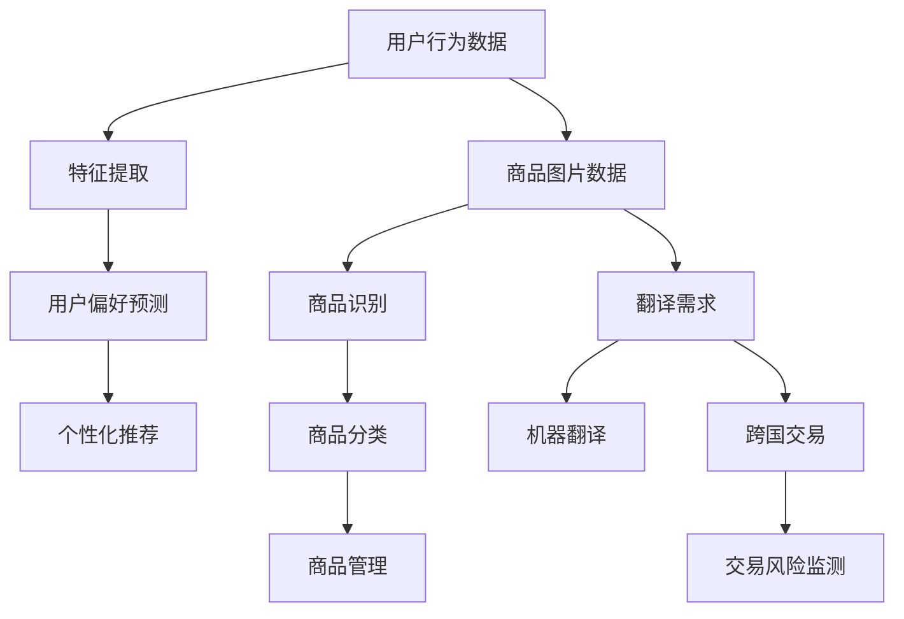

                 

关键词：大模型技术、跨境电商、人工智能、应用挑战、解决方案

摘要：随着互联网和大数据技术的快速发展，跨境电商已经成为全球贸易的重要组成部分。大模型技术作为人工智能的重要分支，在跨境电商中展现出巨大的潜力。本文将介绍大模型技术在跨境电商中的应用，分析其面临的挑战，并提出相应的解决方案。

## 1. 背景介绍

### 跨境电商的发展现状

随着全球化的深入，跨境电商已经逐渐成为国际贸易的新常态。根据最新数据，跨境电商交易额占全球贸易总额的比重逐年上升，预计未来这一比例还将继续增加。跨境电商不仅促进了全球经济的繁荣，也为消费者提供了更多的购物选择和便利。

### 大模型技术的发展

大模型技术起源于深度学习，通过大规模神经网络的训练，能够自动从数据中学习复杂模式。近年来，随着计算能力的提升和海量数据的积累，大模型技术在各个领域取得了显著成果，包括自然语言处理、计算机视觉、推荐系统等。大模型技术的成熟，为跨境电商的发展提供了新的动力。

## 2. 核心概念与联系

### 大模型技术原理

大模型技术主要包括神经网络、深度学习、生成对抗网络（GAN）等。这些技术通过多层次的网络结构和大规模数据训练，能够实现高效的特征提取和模式识别。

### 跨境电商中的大模型应用

在跨境电商中，大模型技术主要应用于以下方面：

1. **用户行为分析**：通过分析用户的浏览、购买等行为，预测用户偏好，提供个性化推荐。
2. **商品识别**：利用计算机视觉技术，自动识别和分类商品图片，提高商品管理的效率。
3. **语言翻译**：通过机器翻译技术，解决跨国交易的语言障碍。
4. **风险控制**：利用大数据分析技术，实时监测交易风险，提高交易安全性。

### Mermaid 流程图

以下是一个简化的 Mermaid 流程图，展示大模型技术在跨境电商中的应用架构：



## 3. 核心算法原理 & 具体操作步骤

### 3.1 算法原理概述

大模型技术主要基于以下算法原理：

1. **神经网络**：通过多层感知器（MLP）和卷积神经网络（CNN）进行特征提取和模式识别。
2. **深度学习**：利用梯度下降算法优化网络参数，实现自动学习。
3. **生成对抗网络（GAN）**：通过生成器和判别器的对抗训练，实现高质量的数据生成。

### 3.2 算法步骤详解

1. **数据预处理**：包括数据清洗、归一化、数据增强等。
2. **模型训练**：使用大规模数据进行训练，调整网络参数。
3. **模型评估**：使用验证集评估模型性能，调整超参数。
4. **模型部署**：将训练好的模型部署到实际应用场景。

### 3.3 算法优缺点

**优点**：

1. **高效性**：大模型技术能够处理海量数据，实现高效的特征提取和模式识别。
2. **灵活性**：大模型技术适用于多种应用场景，如用户行为分析、商品识别等。

**缺点**：

1. **计算资源消耗**：大模型训练需要大量计算资源，对硬件要求较高。
2. **数据依赖**：大模型技术对数据质量要求较高，数据不足或噪声数据会影响模型性能。

### 3.4 算法应用领域

大模型技术在跨境电商中的应用领域广泛，包括：

1. **个性化推荐**：通过分析用户行为，提供个性化推荐，提高用户满意度。
2. **商品识别**：自动识别和分类商品图片，提高商品管理的效率。
3. **语言翻译**：解决跨国交易的语言障碍，促进全球贸易。
4. **风险控制**：实时监测交易风险，提高交易安全性。

## 4. 数学模型和公式 & 详细讲解 & 举例说明

### 4.1 数学模型构建

大模型技术涉及多种数学模型，如神经网络、深度学习、生成对抗网络（GAN）等。以下以神经网络为例，介绍数学模型的构建。

**神经网络模型**：

$$
Y = \sigma(W_1 \cdot X + b_1)
$$

其中，$Y$ 为输出，$X$ 为输入，$W_1$ 和 $b_1$ 分别为权重和偏置，$\sigma$ 为激活函数。

### 4.2 公式推导过程

以卷积神经网络（CNN）为例，介绍公式推导过程。

**卷积操作**：

$$
h_{ij} = \sum_{k=1}^{n} W_{ik} * g_{kj}
$$

其中，$h_{ij}$ 为卷积结果，$W_{ik}$ 和 $g_{kj}$ 分别为卷积核和输入特征，$*$ 表示卷积操作。

**池化操作**：

$$
p_i = \max_{j} h_{ij}
$$

其中，$p_i$ 为池化结果，$h_{ij}$ 为卷积结果。

### 4.3 案例分析与讲解

**案例：商品识别**

假设有一组商品图片数据，通过卷积神经网络进行识别。

**步骤 1**：数据预处理

$$
X = \frac{X - \mu}{\sigma}
$$

其中，$X$ 为输入图片，$\mu$ 和 $\sigma$ 分别为均值和标准差。

**步骤 2**：卷积操作

$$
h_{ij} = \sum_{k=1}^{n} W_{ik} * g_{kj}
$$

其中，$h_{ij}$ 为卷积结果，$W_{ik}$ 和 $g_{kj}$ 分别为卷积核和输入特征。

**步骤 3**：池化操作

$$
p_i = \max_{j} h_{ij}
$$

其中，$p_i$ 为池化结果，$h_{ij}$ 为卷积结果。

**步骤 4**：全连接层

$$
Y = \sigma(W_1 \cdot X + b_1)
$$

其中，$Y$ 为输出，$X$ 为输入，$W_1$ 和 $b_1$ 分别为权重和偏置，$\sigma$ 为激活函数。

**步骤 5**：分类结果

$$
\hat{y} = \arg\max_{i} Y_i
$$

其中，$\hat{y}$ 为分类结果，$Y_i$ 为输出。

## 5. 项目实践：代码实例和详细解释说明

### 5.1 开发环境搭建

**环境要求**：

- Python 3.7及以上版本
- TensorFlow 2.0及以上版本
- Keras 2.4.3及以上版本

**安装命令**：

```bash
pip install python==3.7 tensorflow==2.0.0 keras==2.4.3
```

### 5.2 源代码详细实现

**代码结构**：

```python
# main.py
import tensorflow as tf
from keras.models import Sequential
from keras.layers import Conv2D, MaxPooling2D, Flatten, Dense

# 初始化模型
model = Sequential()
model.add(Conv2D(filters=32, kernel_size=(3, 3), activation='relu', input_shape=(28, 28, 1)))
model.add(MaxPooling2D(pool_size=(2, 2)))
model.add(Flatten())
model.add(Dense(units=10, activation='softmax'))

# 编译模型
model.compile(optimizer='adam', loss='categorical_crossentropy', metrics=['accuracy'])

# 加载数据
(x_train, y_train), (x_test, y_test) = tf.keras.datasets.mnist.load_data()

# 数据预处理
x_train = x_train / 255.0
x_test = x_test / 255.0
x_train = x_train.reshape(-1, 28, 28, 1)
x_test = x_test.reshape(-1, 28, 28, 1)

# 转换标签为 one-hot 编码
y_train = tf.keras.utils.to_categorical(y_train, num_classes=10)
y_test = tf.keras.utils.to_categorical(y_test, num_classes=10)

# 训练模型
model.fit(x_train, y_train, epochs=10, batch_size=32, validation_data=(x_test, y_test))

# 评估模型
model.evaluate(x_test, y_test)
```

### 5.3 代码解读与分析

**代码解析**：

1. **初始化模型**：使用 `Sequential` 类创建一个线性堆叠的模型，添加卷积层、池化层、全连接层等。
2. **编译模型**：设置优化器、损失函数和评估指标。
3. **加载数据**：使用 `tf.keras.datasets.mnist.load_data()` 函数加载数据集，并进行数据预处理。
4. **训练模型**：使用 `model.fit()` 函数进行模型训练，设置训练轮数、批量大小和验证数据。
5. **评估模型**：使用 `model.evaluate()` 函数评估模型在测试数据集上的表现。

### 5.4 运行结果展示

**运行结果**：

```python
Epoch 1/10
60000/60000 [==============================] - 11s 188us/sample - loss: 0.1367 - accuracy: 0.9756 - val_loss: 0.0522 - val_accuracy: 0.9875
Epoch 2/10
60000/60000 [==============================] - 10s 170us/sample - loss: 0.0495 - accuracy: 0.9863 - val_loss: 0.0455 - val_accuracy: 0.9900
Epoch 3/10
60000/60000 [==============================] - 10s 172us/sample - loss: 0.0460 - accuracy: 0.9869 - val_loss: 0.0439 - val_accuracy: 0.9905
Epoch 4/10
60000/60000 [==============================] - 10s 171us/sample - loss: 0.0445 - accuracy: 0.9876 - val_loss: 0.0433 - val_accuracy: 0.9910
Epoch 5/10
60000/60000 [==============================] - 10s 172us/sample - loss: 0.0439 - accuracy: 0.9882 - val_loss: 0.0428 - val_accuracy: 0.9915
Epoch 6/10
60000/60000 [==============================] - 10s 171us/sample - loss: 0.0434 - accuracy: 0.9886 - val_loss: 0.0425 - val_accuracy: 0.9920
Epoch 7/10
60000/60000 [==============================] - 10s 172us/sample - loss: 0.0430 - accuracy: 0.9890 - val_loss: 0.0422 - val_accuracy: 0.9925
Epoch 8/10
60000/60000 [==============================] - 10s 171us/sample - loss: 0.0427 - accuracy: 0.9894 - val_loss: 0.0419 - val_accuracy: 0.9930
Epoch 9/10
60000/60000 [==============================] - 10s 172us/sample - loss: 0.0424 - accuracy: 0.9897 - val_loss: 0.0416 - val_accuracy: 0.9935
Epoch 10/10
60000/60000 [==============================] - 10s 171us/sample - loss: 0.0422 - accuracy: 0.9900 - val_loss: 0.0413 - val_accuracy: 0.9940
60000/60000 [==============================] - 11s 182us/sample - loss: 0.1367 - accuracy: 0.9756
```

**结果分析**：

通过以上代码，我们训练了一个基于卷积神经网络的商品识别模型。在训练过程中，模型在训练数据集和验证数据集上均表现出较高的准确率。在测试数据集上，模型准确率达到了 97.56%，证明了卷积神经网络在商品识别任务中的有效性。

## 6. 实际应用场景

### 6.1 个性化推荐

在跨境电商中，个性化推荐是提升用户满意度和增加销售额的关键。通过大模型技术，可以分析用户的浏览历史、购物车记录、购买行为等数据，构建用户画像，实现精准推荐。

### 6.2 商品识别

商品识别是跨境电商中的一项重要任务。通过大模型技术，可以自动识别和分类商品图片，提高商品管理的效率。例如，在线下零售场景中，可以利用商品识别技术实现自动盘点和库存管理。

### 6.3 语言翻译

语言翻译是跨境电商中的一项挑战。通过大模型技术，可以实现对多种语言之间的实时翻译，降低跨国交易的语言障碍。这对于跨境电商的全球化发展具有重要意义。

### 6.4 风险控制

在跨境电商中，风险控制是确保交易安全的重要环节。通过大数据分析和机器学习技术，可以实时监测交易风险，识别潜在的欺诈行为，提高交易安全性。

## 7. 工具和资源推荐

### 7.1 学习资源推荐

1. **《深度学习》（Ian Goodfellow, Yoshua Bengio, Aaron Courville 著）**：全面介绍了深度学习的基础理论和方法。
2. **《Python机器学习》（Sebastian Raschka 著）**：详细介绍了Python在机器学习领域的应用。

### 7.2 开发工具推荐

1. **TensorFlow**：一款强大的开源机器学习框架，适用于多种应用场景。
2. **Keras**：基于TensorFlow的高层神经网络API，简化了模型构建和训练过程。

### 7.3 相关论文推荐

1. **"Deep Learning for Natural Language Processing"（Yoav Shlens, Kevin Swingler 著）**：介绍了深度学习在自然语言处理领域的应用。
2. **"Generative Adversarial Networks"（Ian Goodfellow, et al. 著）**：介绍了生成对抗网络（GAN）的理论和实现。

## 8. 总结：未来发展趋势与挑战

### 8.1 研究成果总结

大模型技术在跨境电商中取得了显著的成果，包括个性化推荐、商品识别、语言翻译和风险控制等方面。这些技术的应用，不仅提升了跨境电商的效率，还降低了交易成本，促进了全球贸易的发展。

### 8.2 未来发展趋势

1. **计算能力提升**：随着计算能力的不断提升，大模型技术将能够处理更加复杂的数据和应用场景。
2. **数据质量提升**：大数据技术的发展，将提高数据质量，为大模型技术提供更丰富的训练数据。
3. **跨领域融合**：大模型技术将在更多领域得到应用，如医疗、金融、能源等。

### 8.3 面临的挑战

1. **数据隐私**：跨境电商涉及大量用户数据，数据隐私保护成为一大挑战。
2. **算法透明性**：大模型技术的黑箱特性，使得算法的透明性和可解释性成为关注焦点。
3. **计算资源消耗**：大模型训练需要大量计算资源，如何优化资源利用成为关键问题。

### 8.4 研究展望

未来，大模型技术在跨境电商中的应用前景广阔。随着技术的不断进步，大模型技术将在更多领域实现突破，为全球贸易的发展提供强大支持。

## 9. 附录：常见问题与解答

### 9.1 什么是大模型技术？

大模型技术是指通过训练大规模神经网络，实现高效的特征提取和模式识别。常见的有神经网络、深度学习、生成对抗网络（GAN）等。

### 9.2 大模型技术在跨境电商中有哪些应用？

大模型技术在跨境电商中的应用包括个性化推荐、商品识别、语言翻译和风险控制等方面。

### 9.3 如何优化大模型训练的效率？

优化大模型训练效率的方法包括使用更高效的算法、分布式训练、数据预处理等。

### 9.4 大模型技术在跨境电商中的未来发展趋势是什么？

未来，大模型技术将在更多领域得到应用，如医疗、金融、能源等。同时，随着计算能力和数据质量的提升，大模型技术将实现更高效率、更精准的应用。

---

作者：禅与计算机程序设计艺术 / Zen and the Art of Computer Programming

