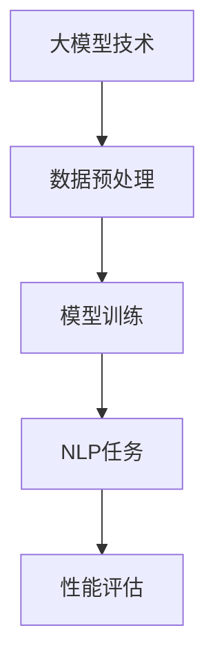

                 

关键词：大模型技术、自然语言处理、进展、算法、应用场景、未来展望

> 摘要：本文将深入探讨大模型技术在自然语言处理（NLP）领域的进展，分析核心概念、算法原理、数学模型以及实际应用，展望未来发展趋势与挑战，旨在为读者提供全面的技术解读与启示。

## 1. 背景介绍

随着互联网和大数据技术的发展，自然语言处理（NLP）成为人工智能领域的重要研究方向。NLP旨在使计算机能够理解、解释和生成人类语言，实现人与机器的有效沟通。传统NLP方法主要依赖于规则和统计模型，然而在处理复杂语言现象时，效果有限。近年来，大模型技术，如深度学习模型（尤其是Transformer架构）的崛起，为NLP带来了新的突破。

大模型技术通过训练大规模神经网络，使其能够捕捉语言中的复杂模式和规律，从而显著提升了NLP任务的性能。代表模型如GPT、BERT、T5等，已经在诸多领域展现了卓越的表现，推动了NLP的快速发展。

## 2. 核心概念与联系

### 2.1 大模型技术

大模型技术是指通过训练大规模神经网络来学习和预测数据的过程。这些模型通常具有数亿甚至数万亿个参数，需要海量数据和计算资源来训练。

### 2.2 自然语言处理

自然语言处理（NLP）涉及语言的理解、生成、转换和模拟等多个方面，包括文本分类、情感分析、机器翻译、问答系统等。

### 2.3 关联架构

大模型技术与NLP的结合，主要体现在模型架构的设计上。以Transformer为例，其通过自注意力机制（self-attention）和编码器-解码器（encoder-decoder）结构，实现了对文本序列的建模和预测。

### 2.4 Mermaid 流程图



## 3. 核心算法原理 & 具体操作步骤

### 3.1 算法原理概述

大模型技术在NLP中的应用，主要依赖于深度学习，特别是基于Transformer架构的模型。这些模型通过多层神经网络结构，实现对语言数据的建模和预测。

### 3.2 算法步骤详解

1. **数据预处理**：清洗和规范化文本数据，将其转换为模型可处理的格式。

2. **模型训练**：使用大量文本数据训练模型，通过反向传播算法优化模型参数。

3. **NLP任务**：将训练好的模型应用于各种NLP任务，如文本分类、机器翻译等。

4. **性能评估**：通过指标（如准确率、召回率等）评估模型在各个任务上的性能。

### 3.3 算法优缺点

**优点**：
- **强大的建模能力**：能够捕捉语言中的复杂模式和规律。
- **高泛化能力**：在不同NLP任务上表现出色。

**缺点**：
- **计算资源需求大**：训练和推理过程需要大量计算资源和时间。
- **数据依赖性高**：模型的性能依赖于训练数据的质量和规模。

### 3.4 算法应用领域

大模型技术在NLP领域的应用非常广泛，包括但不限于：

- **文本分类**：新闻分类、情感分析等。
- **机器翻译**：跨语言信息交换。
- **问答系统**：智能客服、知识图谱构建等。

## 4. 数学模型和公式 & 详细讲解 & 举例说明

### 4.1 数学模型构建

大模型技术主要依赖于深度学习模型，如Transformer。其核心数学模型包括自注意力机制和编码器-解码器结构。

### 4.2 公式推导过程

自注意力机制（self-attention）的公式如下：

$$
\text{Attention}(Q, K, V) = \text{softmax}\left(\frac{QK^T}{\sqrt{d_k}}\right) V
$$

其中，$Q$、$K$、$V$分别为查询、键和值向量，$d_k$为键向量的维度。

编码器-解码器（encoder-decoder）结构的公式如下：

$$
\text{Encoder}(x) = \text{MultiHeadAttention}(x, x, x) + x
$$

$$
\text{Decoder}(y) = \text{MultiHeadAttention}(y, y, \text{Encoder}(x)) + y
$$

其中，$x$为编码器输入，$y$为解码器输入。

### 4.3 案例分析与讲解

以BERT模型为例，其核心思想是在大规模语料库上进行预训练，然后针对具体任务进行微调。BERT模型在文本分类、情感分析等任务上取得了优异的性能。

## 5. 项目实践：代码实例和详细解释说明

### 5.1 开发环境搭建

- 安装Python环境（建议使用Anaconda）
- 安装TensorFlow或PyTorch库
- 准备预训练模型（如BERT）

### 5.2 源代码详细实现

以下是一个简单的文本分类任务的实现示例：

```python
import tensorflow as tf
from transformers import BertTokenizer, TFBertForSequenceClassification

# 加载预训练模型和分词器
tokenizer = BertTokenizer.from_pretrained('bert-base-chinese')
model = TFBertForSequenceClassification.from_pretrained('bert-base-chinese')

# 准备数据
inputs = tokenizer("你好，这是一个文本分类任务。", return_tensors='tf')

# 进行预测
outputs = model(inputs)

# 获取预测结果
predictions = tf.argmax(outputs.logits, axis=-1).numpy()

print(predictions)
```

### 5.3 代码解读与分析

上述代码实现了基于BERT模型的文本分类任务。首先加载预训练模型和分词器，然后准备输入数据，接着进行预测，最后获取预测结果。

### 5.4 运行结果展示

运行结果为一个整数数组，表示每个类别的概率。可以通过计算概率最大的类别来获取预测结果。

## 6. 实际应用场景

大模型技术在NLP领域具有广泛的应用场景，以下为一些实际案例：

- **智能客服**：利用文本分类和情感分析，实现智能问答和情绪识别。
- **内容审核**：通过文本分类和情感分析，自动识别和处理违规内容。
- **机器翻译**：利用神经机器翻译，实现跨语言信息传递。

## 7. 未来应用展望

随着大模型技术的不断发展，NLP领域有望实现更多突破，例如：

- **更高效的模型**：通过改进模型结构和优化算法，提高计算效率和性能。
- **更广泛的场景应用**：探索大模型技术在更多领域的应用，如语音识别、多模态处理等。
- **隐私保护和数据安全**：研究如何在大模型训练和推理过程中保护用户隐私和数据安全。

## 8. 总结：未来发展趋势与挑战

### 8.1 研究成果总结

大模型技术在NLP领域取得了显著成果，显著提升了各类NLP任务的性能。

### 8.2 未来发展趋势

- **模型效率和性能优化**
- **多模态数据处理**
- **跨领域应用探索**
- **隐私保护和数据安全**

### 8.3 面临的挑战

- **计算资源需求**
- **数据质量和隐私问题**
- **模型可解释性和可靠性**

### 8.4 研究展望

未来，大模型技术在NLP领域的研究将继续深入，推动人工智能技术在更多领域的应用。

## 9. 附录：常见问题与解答

**Q：大模型训练需要多少数据？**
A：大模型训练需要大量数据，通常数百万到数十亿级别的数据量。数据越多，模型的性能越可能提升。

**Q：大模型训练需要多少时间？**
A：大模型训练时间取决于模型规模、硬件配置和数据规模等因素。通常需要数天到数周的时间。

**Q：大模型训练需要多少计算资源？**
A：大模型训练需要大量的计算资源，包括GPU、TPU等硬件设备。计算资源越多，训练速度越快。

---

作者：禅与计算机程序设计艺术 / Zen and the Art of Computer Programming
----------------------------------------------------------------

以上就是本文的完整内容，希望对读者在了解大模型技术在自然语言处理领域的进展有所帮助。在未来的研究中，我们将继续关注这一领域的最新动态和发展趋势。如果您有任何疑问或建议，欢迎在评论区留言讨论。

