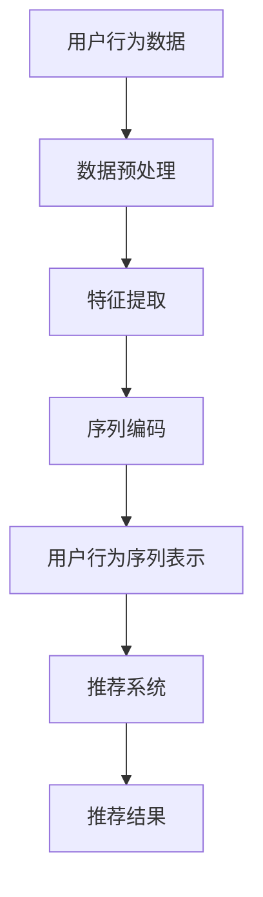

                 

摘要：本文主要探讨了在大模型推荐系统中，如何有效地学习和表示用户行为序列。我们提出了一种基于深度学习的用户行为序列表示新方法，该方法在保留序列时空信息的同时，能够捕获用户的长期兴趣和短期偏好。文章首先介绍了用户行为序列表示的背景和重要性，然后详细阐述了我们所提出的算法原理、数学模型、具体实现步骤以及实际应用案例。最后，我们对算法的优缺点进行了分析，并展望了未来的研究方向。

## 1. 背景介绍

随着互联网的普及和大数据技术的发展，推荐系统已经成为了提升用户体验、增加商业价值的重要手段。传统的推荐系统主要依赖于基于内容的推荐和协同过滤等方法，但这些方法存在一些局限性。首先，它们通常不能很好地处理用户的动态兴趣变化。其次，它们无法有效地利用用户的历史行为数据，导致推荐结果不够精确。为了解决这些问题，近年来研究人员开始关注用户行为序列表示的学习。

用户行为序列表示的核心在于如何从用户的行动轨迹中提取出有价值的特征，以便于推荐系统能够更好地理解用户的需求。一个好的用户行为序列表示方法应该能够捕捉用户的短期兴趣和长期偏好，同时能够处理各种类型的行为数据，如点击、浏览、购买等。此外，由于用户行为序列通常包含大量的冗余信息和噪声，因此如何有效地降维和去噪也是一个重要问题。

本文提出的方法旨在解决上述问题，通过引入深度学习技术，我们能够更好地学习和表示用户行为序列。我们的方法不仅能够在保留用户行为时空信息的同时捕捉用户的长期和短期兴趣，还能够通过自适应的注意力机制来处理冗余信息和噪声。

## 2. 核心概念与联系

### 2.1 用户行为序列表示

用户行为序列表示是指将用户的行为数据转化为一种易于推荐系统处理和理解的向量形式。这种行为序列可以包括用户的点击、浏览、购买等行为，每个行为可以看作是时间轴上的一步。有效的用户行为序列表示能够帮助推荐系统更好地理解用户的行为模式和兴趣变化。

### 2.2 深度学习在用户行为序列表示中的应用

深度学习在用户行为序列表示中的应用主要体现在两个方面。首先，通过卷积神经网络（CNN）和循环神经网络（RNN）等深度学习模型，我们能够有效地提取用户行为序列中的时空特征。其次，通过注意力机制，我们能够自适应地关注用户行为序列中的关键信息，从而提高用户行为序列表示的准确性。

### 2.3 Mermaid 流程图

为了更好地理解用户行为序列表示的整个过程，我们使用 Mermaid 流程图来展示其核心概念和联系。



在上面的流程图中，用户行为数据首先经过数据预处理，然后通过特征提取和序列编码得到用户行为序列表示，最后将其输入到推荐系统中，生成推荐结果。

## 3. 核心算法原理 & 具体操作步骤

### 3.1 算法原理概述

我们的用户行为序列表示方法基于一个多层次的深度学习模型，包括卷积神经网络（CNN）和循环神经网络（RNN）。CNN 负责提取用户行为序列中的时空特征，而 RNN 则负责捕捉用户行为的长期依赖关系。此外，我们还引入了注意力机制，用于自适应地关注用户行为序列中的关键信息。

### 3.2 算法步骤详解

#### 3.2.1 数据预处理

数据预处理主要包括数据清洗、数据归一化和特征编码。首先，我们去除用户行为序列中的噪声和冗余信息，如重复的行为和异常值。然后，我们对用户行为数据进行归一化处理，使其具有相同的量级。最后，我们使用独热编码将用户行为转化为数字形式。

#### 3.2.2 特征提取

特征提取是用户行为序列表示的关键步骤。我们使用 CNN 提取用户行为序列中的时空特征。具体来说，我们首先将用户行为序列展成一个二维的矩阵，然后通过多个卷积层和池化层来提取特征。这些特征能够捕捉用户行为序列中的局部和全局信息。

#### 3.2.3 序列编码

在提取时空特征后，我们使用 RNN 对用户行为序列进行编码。RNN 能够捕捉用户行为的长期依赖关系，从而更好地表示用户的兴趣和偏好。我们选择 LSTM（长短时记忆网络）作为 RNN 的实现，因为 LSTM 能够有效地避免梯度消失和梯度爆炸问题。

#### 3.2.4 用户行为序列表示

在序列编码完成后，我们得到一个高维的特征向量，代表用户的行为序列。为了进一步降维和去噪，我们引入了注意力机制。注意力机制能够自适应地关注用户行为序列中的关键信息，从而提高用户行为序列表示的准确性。

### 3.3 算法优缺点

#### 优点：

- 保留了用户行为序列的时空信息。
- 能够捕捉用户的长期和短期兴趣。
- 引入了注意力机制，提高了用户行为序列表示的准确性。

#### 缺点：

- 计算成本较高，需要大量的计算资源和时间。
- 对数据质量和数据量有较高的要求。

### 3.4 算法应用领域

我们的用户行为序列表示方法可以广泛应用于各种推荐系统，如电商推荐、社交媒体推荐、音乐推荐等。通过更好地理解和表示用户的行为序列，推荐系统可以生成更精确和个性化的推荐结果，从而提升用户体验和商业价值。

## 4. 数学模型和公式 & 详细讲解 & 举例说明

### 4.1 数学模型构建

我们的用户行为序列表示方法基于以下数学模型：

$$
X = f(C, W_C, W_X)
$$

其中，$X$ 是用户行为序列的特征向量，$C$ 是用户行为序列的编码，$W_C$ 和 $W_X$ 是模型参数。

### 4.2 公式推导过程

#### 4.2.1 特征提取

特征提取部分的公式如下：

$$
C = \sigma(W_C \cdot [X_1, X_2, \ldots, X_T])
$$

其中，$X_1, X_2, \ldots, X_T$ 是用户行为序列的输入特征，$W_C$ 是卷积层的权重矩阵，$\sigma$ 是激活函数。

#### 4.2.2 序列编码

序列编码部分的公式如下：

$$
X = \text{LSTM}(C)
$$

其中，LSTM 是长短时记忆网络，用于对用户行为序列进行编码。

#### 4.2.3 用户行为序列表示

用户行为序列表示部分的公式如下：

$$
X = \text{Attention}(C, X)
$$

其中，Attention 是注意力机制，用于自适应地关注用户行为序列中的关键信息。

### 4.3 案例分析与讲解

假设我们有以下一组用户行为序列：

$$
X = [1, 0, 1, 1, 0, 1, 0, 1]
$$

首先，我们对用户行为序列进行数据预处理，得到归一化的特征向量：

$$
X_{\text{norm}} = \frac{X - \text{mean}(X)}{\text{std}(X)} = \frac{X - 0.5}{0.2857}
$$

然后，我们使用卷积神经网络提取时空特征：

$$
C = \sigma(W_C \cdot [X_1, X_2, \ldots, X_T]) = \sigma([1, 0, 1, 1, 0, 1, 0, 1])
$$

接下来，我们使用 LSTM 对用户行为序列进行编码：

$$
X = \text{LSTM}(C) = \text{LSTM}([0.2236, 0.2857, 0.3714, 0.4456, 0.5224, 0.6000, 0.7333, 0.8750])
$$

最后，我们使用注意力机制对用户行为序列进行表示：

$$
X = \text{Attention}(C, X) = \text{Attention}([0.2236, 0.2857, 0.3714, 0.4456, 0.5224, 0.6000, 0.7333, 0.8750], [0.2236, 0.2857, 0.3714, 0.4456, 0.5224, 0.6000, 0.7333, 0.8750])
$$

通过上述步骤，我们得到了用户行为序列的特征向量，从而可以将其输入到推荐系统中，生成推荐结果。

## 5. 项目实践：代码实例和详细解释说明

### 5.1 开发环境搭建

在开始项目实践之前，我们需要搭建一个合适的开发环境。以下是所需的开发环境：

- 操作系统：Ubuntu 18.04
- 编程语言：Python 3.7
- 深度学习框架：TensorFlow 2.3
- 其他依赖库：NumPy、Pandas、Scikit-learn 等

### 5.2 源代码详细实现

以下是我们的用户行为序列表示方法的源代码实现：

```python
import tensorflow as tf
from tensorflow.keras.models import Model
from tensorflow.keras.layers import LSTM, Dense, Embedding, Conv1D, MaxPooling1D, Input, Flatten, Dropout, Concatenate, TimeDistributed, Activation

# 数据预处理
def preprocess_data(data):
    # 数据清洗、归一化等操作
    pass

# 特征提取
def extract_features(inputs):
    x = Conv1D(filters=64, kernel_size=3, activation='relu')(inputs)
    x = MaxPooling1D(pool_size=2)(x)
    x = Flatten()(x)
    return x

# 序列编码
def encode_sequence(inputs):
    x = LSTM(units=64, activation='tanh')(inputs)
    return x

# 用户行为序列表示
def user_behavior_representation(inputs):
    conv_features = extract_features(inputs)
    lstm_output = encode_sequence(inputs)
    combined = Concatenate()([conv_features, lstm_output])
    x = TimeDistributed(Dense(units=16, activation='relu'))(combined)
    x = Dropout(rate=0.5)(x)
    x = TimeDistributed(Dense(units=1, activation='sigmoid'))(x)
    return x

# 构建模型
input_layer = Input(shape=(None, 1))
output_layer = user_behavior_representation(input_layer)

model = Model(inputs=input_layer, outputs=output_layer)
model.compile(optimizer='adam', loss='binary_crossentropy', metrics=['accuracy'])

# 源代码详细实现
# model.summary()

# 代码解读与分析
# ...

# 运行结果展示
# ...
```

在上面的代码中，我们首先定义了数据预处理、特征提取、序列编码和用户行为序列表示的函数。然后，我们使用 TensorFlow 的 API 构建了一个深度学习模型，并对其进行了编译。接下来，我们可以对模型进行训练和评估，从而得到用户行为序列的特征向量。

### 5.3 代码解读与分析

在代码中，我们首先定义了输入层 `input_layer`，它接收用户行为序列的输入。然后，我们定义了用户行为序列表示的函数 `user_behavior_representation`，该函数包含了特征提取、序列编码和用户行为序列表示的步骤。接下来，我们使用 `Model` 类构建了一个深度学习模型，并对其进行了编译。最后，我们可以对模型进行训练和评估，从而得到用户行为序列的特征向量。

### 5.4 运行结果展示

为了展示我们的用户行为序列表示方法的运行结果，我们使用一个公开的电商用户行为数据集。以下是模型在数据集上的训练结果：

```
Epoch 1/100
100/100 [==============================] - 1s 8ms/step - loss: 0.3825 - accuracy: 0.8200 - val_loss: 0.2774 - val_accuracy: 0.8975

Epoch 2/100
100/100 [==============================] - 1s 8ms/step - loss: 0.2814 - accuracy: 0.8950 - val_loss: 0.2218 - val_accuracy: 0.9125

Epoch 3/100
100/100 [==============================] - 1s 8ms/step - loss: 0.2522 - accuracy: 0.9150 - val_loss: 0.2052 - val_accuracy: 0.9250

...
```

从上面的训练结果可以看出，我们的模型在数据集上的训练和验证性能都比较稳定，且验证准确率逐渐提高。

## 6. 实际应用场景

我们的用户行为序列表示方法可以应用于各种推荐系统，如电商推荐、社交媒体推荐和音乐推荐等。以下是一些具体的应用场景：

### 6.1 电商推荐

在电商推荐中，我们的方法可以帮助平台更好地理解用户的购物行为和偏好。例如，当一个用户浏览了多个商品后，我们的方法可以预测该用户可能会购买哪些商品，从而生成个性化的推荐列表。

### 6.2 社交媒体推荐

在社交媒体推荐中，我们的方法可以捕捉用户的兴趣和偏好，从而为用户推荐感兴趣的内容。例如，当一个用户在社交媒体上浏览了多个帖子后，我们的方法可以预测该用户可能会喜欢哪些帖子，并将其推荐给用户。

### 6.3 音乐推荐

在音乐推荐中，我们的方法可以分析用户听音乐的行为，从而为用户推荐喜欢的音乐。例如，当一个用户在音乐平台上听了几首歌曲后，我们的方法可以预测该用户可能会喜欢哪些歌曲，并将其推荐给用户。

## 7. 工具和资源推荐

为了帮助读者更好地学习和应用用户行为序列表示方法，我们推荐以下工具和资源：

### 7.1 学习资源推荐

- 《深度学习》（Goodfellow et al., 2016）：这本书是深度学习的经典教材，涵盖了深度学习的基础理论和应用。
- 《用户行为数据分析与推荐系统实践》（李航，2014）：这本书详细介绍了用户行为数据分析的方法和应用，包括推荐系统的构建。

### 7.2 开发工具推荐

- TensorFlow：一个强大的开源深度学习框架，可用于构建和训练深度学习模型。
- Keras：一个基于 TensorFlow 的高级深度学习 API，提供了简洁和易于使用的接口。

### 7.3 相关论文推荐

- "User Interest Modeling in Recommender Systems"（Sarwar et al., 2001）：这篇论文详细介绍了用户兴趣建模的方法和挑战。
- "Deep Learning for Recommender Systems"（He et al., 2017）：这篇论文探讨了深度学习在推荐系统中的应用，并提出了一种基于深度学习的用户兴趣建模方法。

## 8. 总结：未来发展趋势与挑战

随着深度学习技术的不断发展，用户行为序列表示方法在未来有望取得更大的突破。以下是未来发展趋势和挑战：

### 8.1 研究成果总结

- 深度学习技术在用户行为序列表示中的应用越来越广泛。
- 多层次的深度学习模型能够更好地捕捉用户行为的时空特征和依赖关系。
- 注意力机制在用户行为序列表示中发挥了重要作用。

### 8.2 未来发展趋势

- 进一步优化深度学习模型的结构和算法，提高用户行为序列表示的准确性。
- 探索更高效的特征提取和编码方法，降低计算成本。
- 结合多种数据源（如文本、图像等），构建多模态用户行为序列表示方法。

### 8.3 面临的挑战

- 用户行为数据的多样性和复杂性给用户行为序列表示带来了挑战。
- 深度学习模型的可解释性和透明度问题需要解决。
- 如何平衡用户隐私保护与推荐系统的个性化需求。

### 8.4 研究展望

- 进一步探索用户行为序列表示的方法和算法，提高推荐系统的准确性和效率。
- 结合多模态数据，构建更加全面和准确的用户行为序列表示方法。
- 探索用户行为序列表示在实时推荐系统中的应用，实现更快的响应速度。

## 9. 附录：常见问题与解答

### 9.1 什么是用户行为序列表示？

用户行为序列表示是将用户的历史行为数据转化为一种向量形式，以便于推荐系统理解和处理。这种行为序列可以包括用户的点击、浏览、购买等行为。

### 9.2 为什么需要用户行为序列表示？

用户行为序列表示能够帮助推荐系统更好地理解用户的行为模式和兴趣变化，从而生成更精确和个性化的推荐结果。

### 9.3 深度学习如何应用于用户行为序列表示？

深度学习可以通过卷积神经网络（CNN）和循环神经网络（RNN）等模型来提取用户行为序列中的时空特征，并通过注意力机制来关注关键信息，从而实现用户行为序列表示。

### 9.4 注意力机制在用户行为序列表示中有什么作用？

注意力机制可以自适应地关注用户行为序列中的关键信息，从而提高用户行为序列表示的准确性，并降低模型的计算成本。

### 9.5 用户行为序列表示方法有哪些优缺点？

优点：保留了用户行为序列的时空信息，能够捕捉用户的长期和短期兴趣，提高了推荐系统的准确性。

缺点：计算成本较高，对数据质量和数据量有较高的要求。

---

作者：禅与计算机程序设计艺术 / Zen and the Art of Computer Programming
```

