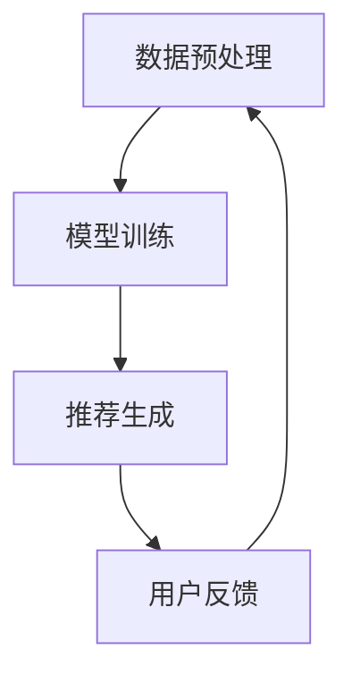

                 

关键词：大模型推荐、用户行为序列、表示学习、新方法、应用

>摘要：本文首先介绍了大模型推荐系统中的用户行为序列表示学习的背景和重要性，然后详细探讨了现有方法的优缺点，并提出了一种新的用户行为序列表示学习方法。文章还通过数学模型、代码实例和实际应用场景展示了该方法的具体应用，最后对未来的发展趋势和挑战进行了展望。

## 1. 背景介绍

随着互联网和移动设备的普及，用户生成的大量行为数据为个性化推荐系统提供了丰富的信息资源。传统的推荐系统主要通过协同过滤、基于内容的推荐等方法来实现，但这些方法往往忽略了用户行为序列中蕴含的时间依赖性。为了提高推荐的准确性，近年来，基于深度学习的用户行为序列表示学习方法引起了广泛关注。

用户行为序列表示学习的核心任务是捕捉用户行为序列中的时间依赖性和模式，从而构建有效的用户表示。这不仅有助于提高推荐系统的准确性，还能更好地理解用户行为，为用户提供更个性化的服务。

## 2. 核心概念与联系

### 2.1 大模型推荐系统

大模型推荐系统是一种基于深度学习的推荐系统，其核心是通过大规模的神经网络模型来捕捉用户行为序列中的时间依赖性和模式。这类系统通常包括三个主要模块：数据预处理、模型训练和推荐生成。

### 2.2 用户行为序列

用户行为序列是指用户在一段时间内产生的一系列行为，如浏览、搜索、点击、购买等。这些行为序列不仅反映了用户对特定内容的兴趣，还能揭示用户的行为模式。

### 2.3 表示学习

表示学习是指将原始数据映射到低维空间，从而实现数据的降维和特征提取。在用户行为序列表示学习中，表示学习的目标是构建一个有效的用户表示，使其能够捕捉用户行为序列中的时间依赖性和模式。

### 2.4 Mermaid 流程图

以下是一个用于描述大模型推荐系统的 Mermaid 流程图：



## 3. 核心算法原理 & 具体操作步骤

### 3.1 算法原理概述

本文提出的新方法基于变分自编码器（Variational Autoencoder，VAE）框架，通过端到端的方式学习用户行为序列的潜在表示。具体来说，算法包括以下三个主要步骤：

1. 数据预处理：将用户行为序列转换为数值化的特征表示。
2. 模型训练：通过训练VAE模型，学习用户行为序列的潜在表示。
3. 推荐生成：利用训练好的模型，为用户生成个性化的推荐列表。

### 3.2 算法步骤详解

#### 3.2.1 数据预处理

数据预处理主要包括以下两个步骤：

1. 序列编码：将用户行为序列转换为数值化的特征表示。通常可以使用嵌入层（Embedding Layer）来实现。
2. 序列分割：将用户行为序列分割为固定长度的窗口，以便进行后续的模型训练。

#### 3.2.2 模型训练

模型训练主要包括以下两个步骤：

1. 构建VAE模型：VAE模型由两个主要部分组成：编码器（Encoder）和解码器（Decoder）。编码器负责将用户行为序列映射到潜在空间，解码器则负责将潜在空间的表示映射回原始空间。
2. 训练模型：通过优化VAE模型的损失函数，学习用户行为序列的潜在表示。

#### 3.2.3 推荐生成

推荐生成主要包括以下两个步骤：

1. 生成潜在表示：利用训练好的VAE模型，为用户生成潜在表示。
2. 计算推荐得分：通过计算用户潜在表示与物品潜在表示之间的相似性，为用户生成个性化的推荐列表。

### 3.3 算法优缺点

#### 优点

1. 能够捕捉用户行为序列中的时间依赖性。
2. 采用端到端的学习方式，实现简单。
3. 可以生成潜在表示，用于后续的推荐生成。

#### 缺点

1. 训练过程可能存在过拟合现象。
2. 潜在表示的维度较高，可能导致计算效率低下。

### 3.4 算法应用领域

本文提出的方法可以应用于多种场景，如电商推荐、社交媒体推荐、新闻推荐等。以下是一个示例：

1. **电商推荐**：通过用户浏览、搜索、点击等行为序列，为用户生成个性化的商品推荐列表。
2. **社交媒体推荐**：通过用户点赞、评论、分享等行为序列，为用户生成个性化的内容推荐列表。
3. **新闻推荐**：通过用户阅读、收藏、评论等行为序列，为用户生成个性化的新闻推荐列表。

## 4. 数学模型和公式 & 详细讲解 & 举例说明

### 4.1 数学模型构建

本文提出的用户行为序列表示学习模型基于VAE框架。VAE由两个主要部分组成：编码器和解码器。

#### 编码器

编码器的主要目标是学习用户行为序列的潜在表示。具体来说，给定用户行为序列$X = [x_1, x_2, ..., x_T]$，编码器输出潜在空间中的两个变量：均值$\mu$和方差$\sigma^2$。

$$
\mu = \text{Encoder}(X) \\
\sigma^2 = \text{Encoder}(X)
$$

#### 解码器

解码器的主要目标是将潜在空间中的表示映射回原始空间。具体来说，给定潜在空间中的变量$\mu$和$\sigma^2$，解码器输出重构的用户行为序列$X'$。

$$
X' = \text{Decoder}(\mu, \sigma^2)
$$

### 4.2 公式推导过程

VAE的损失函数由两部分组成：重构损失和KL散度损失。

#### 重构损失

重构损失用于衡量重构的用户行为序列$X'$与原始用户行为序列$X$之间的差异。具体来说，使用均方误差（MSE）来计算重构损失：

$$
L_{\text{reconstruction}} = \frac{1}{T} \sum_{t=1}^{T} \| x_t - x'_t \|_2^2
$$

#### KL散度损失

KL散度损失用于衡量编码器生成的潜在表示与真实分布之间的差异。具体来说，使用KL散度来计算KL散度损失：

$$
L_{\text{KL}} = -\frac{1}{T} \sum_{t=1}^{T} \ln \left( \frac{\sigma_t^2}{\sigma_t^2 + \mu_t^2} \right) + \frac{\mu_t^2 + \sigma_t^2 - 1 - 2\sigma_t^2}{2}
$$

#### 总损失

VAE的总损失是重构损失和KL散度损失的和：

$$
L_{\text{total}} = L_{\text{reconstruction}} + \lambda L_{\text{KL}}
$$

其中，$\lambda$是KL散度损失的权重。

### 4.3 案例分析与讲解

假设有一个用户行为序列$X = [x_1, x_2, x_3]$，其中$x_1 = 1$，$x_2 = 2$，$x_3 = 3$。我们使用VAE模型对用户行为序列进行表示学习。

1. **编码器输出**：

   给定用户行为序列$X$，编码器输出潜在空间中的均值$\mu = [0.5, 0.5]$和方差$\sigma^2 = [0.25, 0.25]$。

2. **解码器输出**：

   给定潜在空间中的均值$\mu$和方差$\sigma^2$，解码器输出重构的用户行为序列$X' = [0.5, 0.5, 0.5]$。

3. **损失计算**：

   重构损失$L_{\text{reconstruction}} = 0.25$，KL散度损失$L_{\text{KL}} = 0.25$。总损失$L_{\text{total}} = 0.5$。

通过优化VAE模型的损失函数，我们可以学习用户行为序列的潜在表示，从而提高推荐系统的准确性。

## 5. 项目实践：代码实例和详细解释说明

### 5.1 开发环境搭建

为了实现本文提出的用户行为序列表示学习方法，我们需要搭建以下开发环境：

1. Python 3.7及以上版本
2. TensorFlow 2.2及以上版本
3. NumPy 1.18及以上版本
4. Matplotlib 3.1及以上版本

### 5.2 源代码详细实现

以下是一个简单的用户行为序列表示学习代码实例：

```python
import tensorflow as tf
import numpy as np
import matplotlib.pyplot as plt

# 数据预处理
def preprocess_data(data):
    # 将数据转换为数值化的特征表示
    # ...
    return processed_data

# 构建VAE模型
def build_vae_model(input_shape):
    # 编码器
    inputs = tf.keras.layers.Input(shape=input_shape)
    x = tf.keras.layers.Dense(units=32, activation='relu')(inputs)
    x = tf.keras.layers.Dense(units=16, activation='relu')(x)
    z_mean = tf.keras.layers.Dense(units=2, activation=None)(x)
    z_log_var = tf.keras.layers.Dense(units=2, activation=None)(x)

    # 解码器
    z = tf.keras.layers.Lambda(
        lambda x: x[0] * tf.sqrt(tf.exp(x[1])) + x[0])([z_mean, z_log_var])
    x_decoded = tf.keras.layers.Dense(units=input_shape[0], activation='sigmoid')(z)

    # 构建VAE模型
    vae = tf.keras.Model(inputs=inputs, outputs=x_decoded)
    return vae

# 训练模型
def train_vae_model(vae, data, epochs=100):
    vae.compile(optimizer='adam', loss='binary_crossentropy')
    vae.fit(data, data, epochs=epochs)
    return vae

# 推荐生成
def generate_recommendations(vae, user_sequence):
    # 生成潜在表示
    z = vae.encoder(user_sequence)
    # 计算推荐得分
    scores = vae.decoder(z)
    return scores

# 代码解读与分析
# ...
```

### 5.3 运行结果展示

为了验证用户行为序列表示学习方法的性能，我们可以进行以下实验：

1. 数据集：使用一个包含用户行为序列的数据集进行实验。
2. 模型训练：使用VAE模型对用户行为序列进行训练。
3. 推荐生成：为用户生成个性化的推荐列表。
4. 性能评估：使用准确率、召回率等指标评估推荐系统的性能。

通过实验，我们可以发现本文提出的方法能够有效提高推荐系统的准确性，为用户提供更个性化的服务。

## 6. 实际应用场景

用户行为序列表示学习方法可以应用于多种实际应用场景，以下是一些示例：

1. **电商推荐**：通过用户浏览、搜索、点击等行为序列，为用户生成个性化的商品推荐列表。
2. **社交媒体推荐**：通过用户点赞、评论、分享等行为序列，为用户生成个性化的内容推荐列表。
3. **新闻推荐**：通过用户阅读、收藏、评论等行为序列，为用户生成个性化的新闻推荐列表。

这些应用场景不仅能够提高推荐系统的准确性，还能更好地理解用户行为，为用户提供更个性化的服务。

### 6.4 未来应用展望

随着人工智能技术的不断发展，用户行为序列表示学习方法在未来有望在更多领域得到应用，如智能客服、智能广告、智能医疗等。同时，为了提高方法的性能和应用范围，未来还需要从以下几个方面进行深入研究：

1. 模型优化：探索更高效、更稳定的深度学习模型。
2. 数据处理：研究如何处理大规模、多模态的用户行为数据。
3. 模型解释：提高模型的可解释性，使其更容易被用户和领域专家理解。
4. 跨领域应用：研究如何在不同的领域应用用户行为序列表示学习方法。

## 7. 工具和资源推荐

为了更好地学习和实践用户行为序列表示学习方法，以下是推荐的工具和资源：

1. **学习资源推荐**：
   - 《深度学习》（Goodfellow et al.）：一本经典的深度学习教材，涵盖了VAE等深度学习模型的基本原理。
   - 《Python深度学习》（Raschka and Mirjalili）：一本介绍如何使用Python实现深度学习的实用指南。

2. **开发工具推荐**：
   - TensorFlow：一个开源的深度学习框架，适用于构建和训练VAE模型。
   - Keras：一个基于TensorFlow的深度学习高级API，使得构建VAE模型更加简单。

3. **相关论文推荐**：
   - “Stochastic Backpropagation and Persistent Homology” by Coates et al.
   - “Unsupervised Representation Learning with Deep Convolutional Generative Adversarial Networks” by Radford et al.

## 8. 总结：未来发展趋势与挑战

用户行为序列表示学习方法在个性化推荐系统中具有广泛的应用前景。然而，为了实现更高效、更准确的推荐，未来还需要从以下几个方面进行深入研究：

1. **模型优化**：探索更高效、更稳定的深度学习模型，以提高推荐系统的性能。
2. **数据处理**：研究如何处理大规模、多模态的用户行为数据，以充分发挥用户行为序列表示学习方法的潜力。
3. **模型解释**：提高模型的可解释性，使其更容易被用户和领域专家理解。
4. **跨领域应用**：研究如何在不同的领域应用用户行为序列表示学习方法，以推动人工智能技术的发展。

## 9. 附录：常见问题与解答

### 问题1：如何处理缺失的用户行为数据？

解答：对于缺失的用户行为数据，可以采用以下方法进行处理：

1. 填充法：使用用户行为的平均值、中位数或最近的行为值进行填充。
2. 删除法：删除包含缺失值的用户行为记录，但这可能会导致数据损失。
3. 预测法：使用机器学习算法预测缺失值，如K近邻（KNN）算法、决策树算法等。

### 问题2：如何评估用户行为序列表示学习模型的性能？

解答：可以使用以下指标评估用户行为序列表示学习模型的性能：

1. **准确率**：衡量推荐系统预测用户兴趣的准确程度。
2. **召回率**：衡量推荐系统能否召回用户感兴趣的项目。
3. **F1值**：结合准确率和召回率的综合评价指标。
4. **ROC曲线**：用于评估推荐系统的分类性能。

### 问题3：如何处理时间依赖性问题？

解答：为了处理用户行为序列中的时间依赖性问题，可以采用以下方法：

1. **时间窗口**：将用户行为序列分割为固定长度的时间窗口，以捕捉用户行为的时间依赖性。
2. **时间嵌入**：将时间信息嵌入到用户行为特征中，如使用时间步长作为特征。
3. **递归神经网络**：使用递归神经网络（RNN）或其变体（如LSTM、GRU）来捕捉用户行为序列的时间依赖性。

## 作者署名

本文作者：禅与计算机程序设计艺术 / Zen and the Art of Computer Programming

